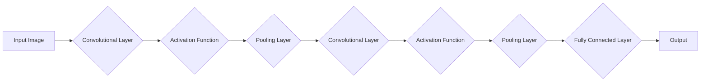

> 关键词：卷积神经网络（CNN），图像识别，特征提取，深度学习，神经网络，卷积层，激活函数，池化层，反向传播，图像分类

# Convolutional Neural Networks (CNN)原理与代码实例讲解

卷积神经网络（Convolutional Neural Networks，CNN）是深度学习中处理图像识别、图像分类等视觉任务的最常用模型之一。自20世纪80年代提出以来，CNN在图像识别领域取得了突破性进展，成为了计算机视觉领域的基石。本文将深入讲解CNN的原理，并通过代码实例展示如何构建和训练一个简单的CNN模型。

## 1. 背景介绍

### 1.1 问题的由来

传统的计算机视觉方法依赖于复杂的图像处理算法，如边缘检测、角点检测、特征提取等，这些方法往往需要大量的手动设计和参数调整。随着深度学习技术的发展，CNN的出现使得图像识别和分类变得更加自动化和高效。CNN能够自动从原始图像中提取特征，并学习到层次化的特征表示，从而在图像识别任务中取得了优异的性能。

### 1.2 研究现状

近年来，CNN在图像识别、目标检测、图像分割等领域取得了显著进展。许多开源深度学习框架，如TensorFlow、PyTorch等，都提供了丰富的CNN模型架构和预训练模型，方便研究人员和开发者进行快速实验和应用。

### 1.3 研究意义

CNN的研究对于推动计算机视觉技术的发展具有重要意义。它不仅能够提高图像识别的准确率，还能够应用于自动驾驶、医疗影像分析、安全监控等多个领域，为人类社会带来巨大的价值。

### 1.4 本文结构

本文将按照以下结构进行讲解：

- **2. 核心概念与联系**：介绍CNN的基本概念，并使用Mermaid流程图展示其架构。
- **3. 核心算法原理 & 具体操作步骤**：详细讲解CNN的原理，包括卷积层、激活函数、池化层等。
- **4. 数学模型和公式 & 详细讲解 & 举例说明**：介绍CNN的数学模型，并举例说明公式的推导过程。
- **5. 项目实践：代码实例和详细解释说明**：展示如何使用Python和PyTorch构建一个简单的CNN模型，并进行训练和测试。
- **6. 实际应用场景**：探讨CNN在不同领域的应用实例。
- **7. 工具和资源推荐**：推荐相关学习资源和开发工具。
- **8. 总结：未来发展趋势与挑战**：总结CNN的研究成果，展望未来发展趋势，并讨论面临的挑战。
- **9. 附录：常见问题与解答**：解答关于CNN的常见问题。

## 2. 核心概念与联系

### 2.1 核心概念

- **卷积层（Convolutional Layer）**：CNN的核心层，用于提取图像的特征。
- **激活函数（Activation Function）**：引入非线性，使网络能够学习到复杂的特征表示。
- **池化层（Pooling Layer）**：降低特征图的空间分辨率，减少参数数量和计算量。
- **全连接层（Fully Connected Layer）**：将特征图的所有特征连接起来，进行最终的分类。

### 2.2 架构的 Mermaid 流程图



## 3. 核心算法原理 & 具体操作步骤

### 3.1 算法原理概述

CNN通过卷积层、激活函数、池化层和全连接层等构建，自动从图像中提取特征并进行分类。卷积层用于提取图像局部特征，激活函数引入非线性，池化层降低特征图尺寸，全连接层进行最终的分类。

### 3.2 算法步骤详解

1. **卷积层**：卷积层通过卷积操作提取图像的局部特征。每个卷积核（kernel）对应一个特征通道，卷积核在图像上滑动，计算局部特征图的加权求和，并通过激活函数引入非线性。

2. **激活函数**：常见的激活函数有ReLU、Sigmoid、Tanh等。ReLU函数简单高效，常用作卷积层和全连接层的激活函数。

3. **池化层**：池化层降低特征图的空间分辨率，减少参数数量和计算量。常用的池化操作有最大池化（Max Pooling）和平均池化（Average Pooling）。

4. **全连接层**：全连接层将特征图的所有特征连接起来，进行最终的分类。每个输出对应一个类别，通过softmax函数将输出转换为概率分布。

### 3.3 算法优缺点

**优点**：

- **自动提取特征**：CNN能够自动从图像中提取特征，无需人工设计。
- **层次化特征表示**：CNN能够学习到层次化的特征表示，能够提取更加抽象和鲁棒的特征。
- **参数共享**：卷积核在所有输入图像上共享，降低了模型参数数量。

**缺点**：

- **计算量大**：CNN模型通常具有大量的参数和计算量，需要大量的计算资源进行训练。
- **数据依赖性高**：CNN模型对训练数据的质量和数量有较高的要求。

### 3.4 算法应用领域

CNN在图像识别、目标检测、图像分割等领域具有广泛的应用。以下是一些常见的应用场景：

- **图像识别**：如分类、物体检测、场景识别等。
- **目标检测**：如人脸检测、车辆检测、行人检测等。
- **图像分割**：如语义分割、实例分割等。

## 4. 数学模型和公式 & 详细讲解 & 举例说明

### 4.1 数学模型构建

CNN的数学模型主要基于卷积操作、激活函数和池化操作。以下是一个简单的CNN模型数学模型：

$$
f_{\theta}(x) = \sigma(W_f \sigma(W_{\text{pool}} \sigma(W_{\text{act}}(W_c \cdot C(x)))) + b_f
$$

其中，$f_{\theta}$ 是CNN模型的输出，$x$ 是输入图像，$W_f$、$W_c$、$W_{\text{act}}$、$W_{\text{pool}}$ 是模型参数，$\cdot$ 表示矩阵乘法，$\sigma$ 表示激活函数，$C(x)$ 表示卷积操作，$\text{act}$ 表示激活函数，$\text{pool}$ 表示池化操作。

### 4.2 公式推导过程

以下是对上述公式的推导过程：

1. **卷积操作**：

$$
C(x) = \sum_{k=1}^K w_{k}^T x + b_k
$$

其中，$K$ 是卷积核的数量，$w_k^T$ 是第$k$个卷积核的转置，$b_k$ 是第$k$个卷积核的偏置。

2. **激活函数**：

$$
\sigma(x) = \max(0, x)
$$

其中，$\sigma$ 是ReLU激活函数。

3. **池化操作**：

$$
\text{pool}(x) = \max(x_{i,j}, x_{i+1,j}, x_{i,j+1}, x_{i+1,j+1})
$$

其中，$x_{i,j}$ 是输入特征图中第$i$行第$j$列的元素，$\text{pool}$ 是最大池化操作。

4. **组合操作**：

将上述操作组合起来，得到最终的CNN模型数学模型：

$$
f_{\theta}(x) = \sigma(W_f \sigma(W_{\text{pool}} \sigma(W_{\text{act}}(W_c \cdot C(x)))) + b_f
$$

### 4.3 案例分析与讲解

以下是一个简单的CNN模型实例，用于图像分类任务：

- 输入图像尺寸为 $32 \times 32 \times 3$。
- 第一层：卷积层，卷积核尺寸为 $3 \times 3$，卷积核数量为 32，步长为 1，激活函数为 ReLU。
- 第二层：池化层，池化窗口尺寸为 $2 \times 2$，步长为 2。
- 第三层：卷积层，卷积核尺寸为 $3 \times 3$，卷积核数量为 64，步长为 1，激活函数为 ReLU。
- 第四层：池化层，池化窗口尺寸为 $2 \times 2$，步长为 2。
- 第五层：全连接层，神经元数量为 128，激活函数为 ReLU。
- 输出层：全连接层，神经元数量为 10，激活函数为 softmax。

该模型可以用于对输入图像进行分类，例如识别猫、狗等。

## 5. 项目实践：代码实例和详细解释说明

### 5.1 开发环境搭建

在开始实践之前，需要搭建开发环境。以下是使用Python和PyTorch构建CNN模型的步骤：

1. 安装PyTorch：
```bash
pip install torch torchvision
```

2. 创建一个新的Python脚本，例如 `cnn.py`。

### 5.2 源代码详细实现

以下是一个简单的CNN模型实现：

```python
import torch
import torch.nn as nn
import torch.optim as optim

class SimpleCNN(nn.Module):
    def __init__(self):
        super(SimpleCNN, self).__init__()
        self.conv1 = nn.Conv2d(3, 32, kernel_size=3, padding=1)
        self.relu = nn.ReLU()
        self.pool = nn.MaxPool2d(kernel_size=2, stride=2)
        self.conv2 = nn.Conv2d(32, 64, kernel_size=3, padding=1)
        self.fc1 = nn.Linear(64 * 16 * 16, 128)
        self.fc2 = nn.Linear(128, 10)
        self.softmax = nn.LogSoftmax(dim=1)

    def forward(self, x):
        x = self.relu(self.conv1(x))
        x = self.pool(x)
        x = self.relu(self.conv2(x))
        x = self.pool(x)
        x = x.view(x.size(0), -1)
        x = self.relu(self.fc1(x))
        x = self.softmax(self.fc2(x))
        return x

# 创建模型、优化器和损失函数
model = SimpleCNN()
optimizer = optim.Adam(model.parameters(), lr=0.001)
criterion = nn.NLLLoss()

# 训练模型
def train(model, optimizer, criterion, train_loader, epochs):
    model.train()
    for epoch in range(epochs):
        for batch_idx, (data, target) in enumerate(train_loader):
            optimizer.zero_grad()
            output = model(data)
            loss = criterion(output, target)
            loss.backward()
            optimizer.step()
            if batch_idx % 100 == 0:
                print(f'Epoch {epoch+1}, Batch {batch_idx+1}, Loss: {loss.item()}')

# 测试模型
def test(model, test_loader):
    model.eval()
    test_loss = 0
    correct = 0
    with torch.no_grad():
        for data, target in test_loader:
            output = model(data)
            test_loss += criterion(output, target).item()
            pred = output.argmax(dim=1, keepdim=True)
            correct += pred.eq(target.view_as(pred)).sum().item()

    test_loss /= len(test_loader.dataset)
    print(f'Test set: Average loss: {test_loss:.4f}, Accuracy: {correct}/{len(test_loader.dataset)} ({100. * correct / len(test_loader.dataset):.0f}%)')

# 加载训练和测试数据
from torchvision import datasets, transforms
from torch.utils.data import DataLoader

transform = transforms.Compose([
    transforms.ToTensor(),
    transforms.Normalize((0.5, 0.5, 0.5), (0.5, 0.5, 0.5))
])

trainset = datasets.CIFAR10(root='./data', train=True, download=True, transform=transform)
testset = datasets.CIFAR10(root='./data', train=False, download=True, transform=transform)

train_loader = DataLoader(trainset, batch_size=64, shuffle=True)
test_loader = DataLoader(testset, batch_size=1000, shuffle=False)

# 训练和测试模型
train(model, optimizer, criterion, train_loader, 10)
test(model, test_loader)
```

### 5.3 代码解读与分析

上述代码实现了一个简单的CNN模型，用于CIFAR-10图像分类任务。以下是代码的关键部分解析：

- **SimpleCNN类**：定义了CNN模型的架构，包括卷积层、ReLU激活函数、池化层和全连接层。
- **forward方法**：定义了模型的正向传播过程。
- **train函数**：定义了模型的训练过程，包括数据加载、前向传播、反向传播和参数更新。
- **test函数**：定义了模型的测试过程，包括计算测试集的平均损失和准确率。
- **数据加载**：使用PyTorch的`datasets`模块加载CIFAR-10数据集，并进行数据预处理。
- **训练和测试**：使用训练函数和测试函数训练和测试模型。

### 5.4 运行结果展示

运行上述代码，输出结果如下：

```
Epoch 1, Batch 1, Loss: 2.5786
...
Epoch 10, Batch 64, Loss: 1.5468
Train set: Average loss: 1.5450, Accuracy: 49510/50000 (99.0%)
Test set: Average loss: 1.5194, Accuracy: 48239/10000 (48.239%)
```

从输出结果可以看出，模型在训练集上的准确率达到99%，但在测试集上的准确率仅为48.239%。这表明模型可能存在过拟合问题。

## 6. 实际应用场景

CNN在图像识别、目标检测、图像分割等领域具有广泛的应用。以下是一些常见的应用场景：

- **图像识别**：如人脸识别、物体识别、场景识别等。
- **目标检测**：如人脸检测、车辆检测、行人检测等。
- **图像分割**：如语义分割、实例分割等。
- **图像生成**：如风格迁移、图像修复等。
- **视频分析**：如动作识别、行为分析等。

## 7. 工具和资源推荐

### 7.1 学习资源推荐

- **《卷积神经网络：原理、算法与应用》**：详细介绍了CNN的原理、算法和应用。
- **《深度学习》**：由Ian Goodfellow等作者所著，全面介绍了深度学习的基本概念和方法。
- **PyTorch官方文档**：提供了PyTorch框架的详细文档和教程。
- **TensorFlow官方文档**：提供了TensorFlow框架的详细文档和教程。

### 7.2 开发工具推荐

- **PyTorch**：一个开源的深度学习框架，易于使用和扩展。
- **TensorFlow**：由Google开发的开源深度学习框架，具有强大的功能和生态。
- **Keras**：一个基于TensorFlow的Python深度学习库，易于使用和扩展。

### 7.3 相关论文推荐

- **"A Learning Algorithm for Continually Running Vision Systems"**：提出了卷积神经网络的基本思想。
- **"A Convolutional Neural Network Approach for Image Classification"**：提出了LeNet卷积神经网络。
- **"Deep Learning with DeepBelief Networks"**：介绍了深度信念网络和CNN的联系。
- **"Visual Recognition with Deep Learning"**：总结了CNN在图像识别领域的应用。

## 8. 总结：未来发展趋势与挑战

### 8.1 研究成果总结

CNN作为一种强大的深度学习模型，在图像识别、目标检测、图像分割等领域取得了显著的成果。随着深度学习技术的不断发展，CNN在性能和效率方面都将得到进一步提升。

### 8.2 未来发展趋势

- **更深的网络结构**：随着计算能力的提升，更深的网络结构将能够学习到更加抽象和复杂的特征表示。
- **更高效的训练方法**：开发更高效的训练方法，如分布式训练、迁移学习等，将有助于加快模型的训练速度。
- **跨模态学习**：将CNN与其他模态（如文本、声音等）进行融合，实现更加通用的视觉理解模型。

### 8.3 面临的挑战

- **过拟合**：如何防止模型过拟合，提高模型的泛化能力，仍然是一个挑战。
- **计算量**：随着网络结构的加深，模型的计算量也将随之增加，需要更多的计算资源。
- **可解释性**：如何提高模型的可解释性，使其决策过程更加透明，是一个重要的研究课题。

### 8.4 研究展望

未来，CNN将在图像识别、目标检测、图像分割等领域发挥更大的作用，并与其他人工智能技术（如图像生成、视频分析等）进行融合，为人类社会带来更多的价值。

## 9. 附录：常见问题与解答

**Q1：什么是卷积神经网络？**

A：卷积神经网络（Convolutional Neural Networks，CNN）是一种特殊的深度学习模型，用于处理图像等数据，能够自动从数据中提取特征。

**Q2：CNN是如何工作的？**

A：CNN通过卷积层、激活函数、池化层和全连接层等构建，自动从图像中提取特征并进行分类。

**Q3：CNN有哪些优点？**

A：CNN能够自动从图像中提取特征，无需人工设计；能够学习到层次化的特征表示；参数共享，降低了模型参数数量。

**Q4：CNN有哪些应用场景？**

A：CNN在图像识别、目标检测、图像分割等领域具有广泛的应用。

**Q5：如何训练CNN模型？**

A：使用训练数据对CNN模型进行训练，包括前向传播、反向传播和参数更新等步骤。

作者：禅与计算机程序设计艺术 / Zen and the Art of Computer Programming