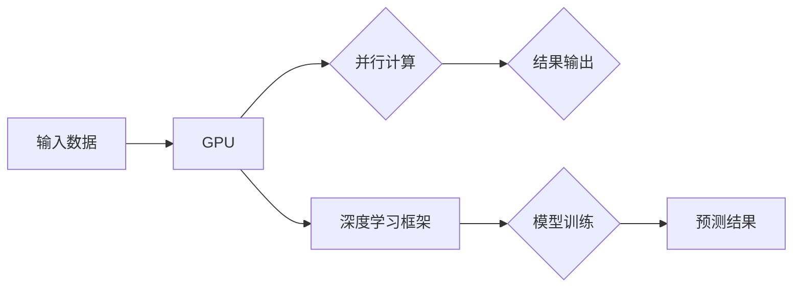

# NVIDIA与GPU的发明

> 关键词：NVIDIA, GPU, 图形处理器, 计算能力, 并行计算, 人工智能, 计算机图形学, CUDA, Deep Learning

## 1. 背景介绍

### 1.1 问题的由来

自计算机图形学诞生以来，图形处理器（Graphics Processing Unit，简称GPU）在处理大量并行计算任务方面展现出巨大的潜力。然而，早期GPU主要被用于计算机图形渲染，其并行计算能力并未得到充分利用。随着科学计算和人工智能领域的快速发展，对高性能计算的需求日益增长，GPU的并行计算能力开始受到重视。NVIDIA作为GPU领域的领导者，在这一领域做出了革命性的贡献。

### 1.2 研究现状

NVIDIA的GPU技术在过去的几十年中取得了长足的进步。从最初的GeForce系列显卡，到后来的GPU架构变革，再到CUDA并行计算平台和深度学习库TensorRT的推出，NVIDIA不断推动着GPU技术的发展，为科学研究、工业制造、娱乐产业等领域带来了前所未有的计算能力。

### 1.3 研究意义

NVIDIA与GPU的发明对计算机科学和人工智能领域具有重要意义：

1. 提升计算效率。GPU的高并行计算能力，使得许多原本需要耗时数小时甚至数天的计算任务，可以在数分钟内完成。
2. 推动科学发现。GPU在生物信息学、材料科学、气象预报等领域的应用，极大地推动了科学研究的进展。
3. 促进人工智能发展。GPU为深度学习算法提供了强大的计算支持，使得深度学习技术在图像识别、语音识别、自然语言处理等领域取得了突破性进展。
4. 改变生活方式。GPU在游戏、视频渲染、虚拟现实等领域的应用，极大地丰富了人们的娱乐生活。

### 1.4 本文结构

本文将从以下几个方面对NVIDIA与GPU的发明进行探讨：

- 核心概念与联系
- 核心算法原理与具体操作步骤
- 数学模型与公式
- 项目实践
- 实际应用场景
- 工具和资源推荐
- 总结与展望

## 2. 核心概念与联系

### 2.1 核心概念

#### 2.1.1 图形处理器（GPU）

图形处理器是一种专门为图形渲染而设计的处理器。它具有大量的并行处理单元（CUDA核心），可以同时处理多个计算任务，从而实现高效的图形渲染和并行计算。

#### 2.1.2 CUDA

CUDA（Compute Unified Device Architecture）是NVIDIA开发的并行计算平台和编程模型。它允许开发者利用GPU的并行计算能力进行通用计算，而不仅仅是图形渲染。

#### 2.1.3 深度学习

深度学习是一种机器学习方法，通过多层神经网络模拟人脑神经元的工作原理，从数据中自动学习特征和模式。

### 2.2 核心概念原理和架构的 Mermaid 流程图



### 2.3 核心概念之间的联系

GPU通过CUDA平台，为深度学习框架提供强大的并行计算能力，从而实现高效的数据处理和模型训练。深度学习框架利用GPU的并行计算能力，从数据中学习特征和模式，最终输出预测结果。

## 3. 核心算法原理 & 具体操作步骤

### 3.1 算法原理概述

GPU的并行计算原理基于其大量可同时工作的处理单元。这些处理单元可以在同一时刻处理不同的计算任务，从而大大提高计算效率。

### 3.2 算法步骤详解

#### 3.2.1 数据加载与预处理

首先，将数据加载到GPU内存中，并进行必要的预处理，如归一化、标准化等。

#### 3.2.2 网络构建

在深度学习框架中构建神经网络模型，如卷积神经网络（CNN）、循环神经网络（RNN）等。

#### 3.2.3 模型训练

使用GPU进行模型训练，包括前向传播、反向传播、参数更新等步骤。

#### 3.2.4 模型评估与优化

在测试集上评估模型性能，并对模型进行优化，如调整超参数、调整网络结构等。

### 3.3 算法优缺点

#### 3.3.1 优点

- 高效的并行计算能力
- 易于实现大规模神经网络
- 计算速度快，效率高

#### 3.3.2 缺点

- 对GPU依赖性强
- 部署成本高
- 优化难度大

### 3.4 算法应用领域

GPU和深度学习技术在以下领域得到广泛应用：

- 计算机视觉：图像识别、目标检测、人脸识别等
- 自然语言处理：机器翻译、文本分类、情感分析等
- 科学研究：生物信息学、材料科学、气象预报等
- 工业制造：产品设计、仿真模拟、质量控制等

## 4. 数学模型和公式 & 详细讲解 & 举例说明

### 4.1 数学模型构建

深度学习模型的数学模型通常包括以下几个部分：

- 神经网络结构：包括输入层、隐藏层和输出层
- 激活函数：如ReLU、Sigmoid、Tanh等
- 损失函数：如均方误差（MSE）、交叉熵（Cross-Entropy）等
- 优化算法：如梯度下降、Adam等

### 4.2 公式推导过程

以下以神经网络中的反向传播算法为例，介绍公式推导过程。

#### 4.2.1 损失函数

均方误差（MSE）定义为：

$$
MSE = \frac{1}{N}\sum_{i=1}^{N}(y_i - \hat{y}_i)^2
$$

其中，$y_i$ 为真实标签，$\hat{y}_i$ 为模型预测值。

#### 4.2.2 梯度计算

损失函数对权重 $w$ 的梯度为：

$$
\frac{\partial MSE}{\partial w} = \frac{\partial MSE}{\partial \hat{y}_i}\frac{\partial \hat{y}_i}{\partial w}
$$

其中，$\frac{\partial MSE}{\partial \hat{y}_i}$ 为损失函数对预测值的梯度，$\frac{\partial \hat{y}_i}{\partial w}$ 为预测值对权重的梯度。

#### 4.2.3 反向传播

反向传播算法通过层层计算，将损失函数对输入的梯度反向传播到每一层，并更新权重和偏置。

### 4.3 案例分析与讲解

以下以一个简单的神经网络为例，演示如何使用PyTorch进行模型训练。

```python
import torch
import torch.nn as nn
import torch.optim as optim

# 定义模型
class SimpleNN(nn.Module):
    def __init__(self):
        super(SimpleNN, self).__init__()
        self.fc1 = nn.Linear(10, 50)
        self.relu = nn.ReLU()
        self.fc2 = nn.Linear(50, 1)
    
    def forward(self, x):
        x = self.fc1(x)
        x = self.relu(x)
        x = self.fc2(x)
        return x

# 实例化模型
model = SimpleNN().to(device)

# 定义损失函数和优化器
criterion = nn.MSELoss()
optimizer = optim.SGD(model.parameters(), lr=0.01)

# 训练模型
for epoch in range(100):
    for i, (x, y) in enumerate(train_loader):
        x, y = x.to(device), y.to(device)
        optimizer.zero_grad()
        output = model(x)
        loss = criterion(output, y)
        loss.backward()
        optimizer.step()

# 测试模型
with torch.no_grad():
    correct = 0
    total = 0
    for x, y in test_loader:
        x, y = x.to(device), y.to(device)
        output = model(x)
        _, predicted = torch.max(output.data, 1)
        total += y.size(0)
        correct += (predicted == y).sum().item()

print('Test Accuracy of the model on the 10000 test images: %d %%' % (100 * correct / total))
```

以上代码展示了如何使用PyTorch构建一个简单的神经网络，并进行模型训练和测试。

## 5. 项目实践：代码实例和详细解释说明

### 5.1 开发环境搭建

在进行GPU编程和深度学习项目实践之前，我们需要搭建相应的开发环境。以下是使用NVIDIA CUDA和PyTorch进行开发的步骤：

1. 安装CUDA Toolkit：从NVIDIA官网下载并安装CUDA Toolkit，确保与你的GPU驱动程序兼容。
2. 安装PyTorch：根据CUDA版本和操作系统，从PyTorch官网下载并安装对应版本的PyTorch。
3. 安装相关依赖库：如NumPy、SciPy、scikit-learn等。
4. 配置CUDA环境变量：确保CUDA环境变量已正确配置。

### 5.2 源代码详细实现

以下是一个使用PyTorch实现图像分类的简单示例。

```python
import torch
import torch.nn as nn
import torch.optim as optim
from torchvision import datasets, transforms

# 定义模型
class CNN(nn.Module):
    def __init__(self):
        super(CNN, self).__init__()
        self.conv1 = nn.Conv2d(1, 32, kernel_size=3, stride=1, padding=1)
        self.conv2 = nn.Conv2d(32, 64, kernel_size=3, stride=1, padding=1)
        self.fc1 = nn.Linear(64 * 6 * 6, 128)
        self.fc2 = nn.Linear(128, 10)
    
    def forward(self, x):
        x = torch.relu(self.conv1(x))
        x = torch.max_pool2d(x, kernel_size=2, stride=2)
        x = torch.relu(self.conv2(x))
        x = torch.max_pool2d(x, kernel_size=2, stride=2)
        x = x.view(-1, 64 * 6 * 6)
        x = torch.relu(self.fc1(x))
        x = self.fc2(x)
        return x

# 实例化模型
model = CNN().to(device)

# 定义损失函数和优化器
criterion = nn.CrossEntropyLoss()
optimizer = optim.Adam(model.parameters(), lr=0.001)

# 训练模型
for epoch in range(10):
    for i, (images, labels) in enumerate(train_loader):
        images, labels = images.to(device), labels.to(device)
        optimizer.zero_grad()
        outputs = model(images)
        loss = criterion(outputs, labels)
        loss.backward()
        optimizer.step()

# 测试模型
with torch.no_grad():
    correct = 0
    total = 0
    for images, labels in test_loader:
        images, labels = images.to(device), labels.to(device)
        outputs = model(images)
        _, predicted = torch.max(outputs.data, 1)
        total += labels.size(0)
        correct += (predicted == labels).sum().item()

print('Test Accuracy of the model on the 10000 test images: %d %%' % (100 * correct / total))
```

以上代码展示了如何使用PyTorch构建一个简单的卷积神经网络（CNN）模型，并进行图像分类任务。

### 5.3 代码解读与分析

在上述代码中，我们首先定义了一个简单的CNN模型，包括两个卷积层、两个全连接层和ReLU激活函数。然后，我们使用Adam优化器进行模型训练，并使用交叉熵损失函数计算损失。

在训练过程中，我们对训练集进行迭代，对每个批次的数据进行前向传播、计算损失和反向传播，并更新模型参数。

在测试过程中，我们对测试集进行迭代，计算模型在测试集上的准确率。

### 5.4 运行结果展示

运行上述代码后，我们可以在控制台输出模型在测试集上的准确率。根据不同的数据集和模型参数，准确率可能会有所不同。

## 6. 实际应用场景

### 6.1 计算机视觉

GPU在计算机视觉领域的应用非常广泛，以下是一些典型的应用场景：

- 图像识别：使用深度学习模型对图像进行分类、检测和分割。
- 目标跟踪：使用深度学习模型跟踪图像中的目标。
- 视频分析：使用深度学习模型分析视频内容，如动作识别、人脸识别等。
- 自动驾驶：使用深度学习模型进行环境感知、决策规划和控制等任务。

### 6.2 自然语言处理

GPU在自然语言处理领域的应用也非常广泛，以下是一些典型的应用场景：

- 机器翻译：使用深度学习模型将一种语言的文本翻译成另一种语言。
- 语音识别：使用深度学习模型将语音信号转换为文本。
- 情感分析：使用深度学习模型对文本进行情感分类。
- 问答系统：使用深度学习模型回答用户提出的问题。

### 6.3 科学研究

GPU在科学研究领域的应用也取得了显著成果，以下是一些典型的应用场景：

- 生物信息学：使用GPU进行大规模基因序列分析。
- 材料科学：使用GPU进行材料性能模拟和预测。
- 气象预报：使用GPU进行天气预报和气候模拟。

### 6.4 未来应用展望

随着GPU并行计算能力的不断提升，以及深度学习技术的不断发展，GPU将在更多领域得到应用，以下是一些未来应用场景的展望：

- 人工智能助手：使用GPU进行智能对话、智能语音助手等任务。
- 虚拟现实/增强现实：使用GPU进行实时渲染和交互。
- 可穿戴设备：使用GPU进行健康监测、运动分析等任务。
- 智能家居：使用GPU进行智能家电控制、安防监控等任务。

## 7. 工具和资源推荐

### 7.1 学习资源推荐

以下是一些关于GPU和深度学习的学习资源：

- NVIDIA官方文档：提供CUDA和深度学习相关文档。
- PyTorch官方文档：提供PyTorch相关文档和教程。
- TensorFlow官方文档：提供TensorFlow相关文档和教程。
- Coursera在线课程：提供深度学习相关课程。
- fast.ai在线课程：提供免费深度学习课程。

### 7.2 开发工具推荐

以下是一些GPU和深度学习开发工具：

- CUDA Toolkit：NVIDIA提供的并行计算平台和编程模型。
- PyTorch：基于Python的深度学习框架。
- TensorFlow：基于Python的深度学习框架。
- CuDNN：NVIDIA提供的深度学习加速库。
- cuDNNx：NVIDIA提供的深度学习加速工具。

### 7.3 相关论文推荐

以下是一些关于GPU和深度学习的相关论文：

- "An Introduction to Parallel Computing for Scientists and Engineers" by Michael A. A. M. Kozierok
- "Deep Learning" by Ian Goodfellow, Yoshua Bengio, and Aaron Courville
- "CUDA by Example: An Introduction to General-Purpose Computing on GPUs" by Jason Sawchuk and Dave Stout
- "High-Performance Parallel Computing" by Michael J. Quinn
- "Parallel Programming in C with MPI and OpenMP" by Michael J. Quinn

## 8. 总结：未来发展趋势与挑战

### 8.1 研究成果总结

本文从NVIDIA与GPU的发明背景、核心概念、算法原理、数学模型、项目实践、实际应用场景等方面，全面介绍了GPU在深度学习领域的应用。NVIDIA作为GPU领域的领导者，推动了GPU技术的发展，为深度学习领域的突破性进展做出了巨大贡献。

### 8.2 未来发展趋势

未来，GPU和深度学习技术将在以下方面继续发展：

- GPU架构的持续优化，提高并行计算能力和能效比。
- 深度学习算法的不断创新，提高模型性能和泛化能力。
- GPU在更多领域的应用，如自动驾驶、医疗健康、工业制造等。
- 可持续发展，降低GPU能耗和碳排放。

### 8.3 面临的挑战

尽管GPU和深度学习技术取得了巨大进步，但仍面临以下挑战：

- GPU能耗和散热问题。
- 深度学习算法的可解释性和鲁棒性。
- GPU编程复杂性。
- 数据隐私和安全问题。

### 8.4 研究展望

未来，GPU和深度学习技术的研究需要从以下几个方面展开：

- 开发更高效、能效比更高的GPU架构。
- 研究可解释、可信赖的深度学习算法。
- 降低GPU编程复杂度，提高开发效率。
- 加强数据隐私保护和数据安全。

## 9. 附录：常见问题与解答

**Q1：GPU与CPU的主要区别是什么？**

A: GPU与CPU的主要区别在于并行计算能力。CPU由多个核心组成，但每个核心的计算能力相对较弱；而GPU由成千上万个核心组成，每个核心的计算能力相对较弱，但可以同时处理大量并行计算任务。

**Q2：如何选择合适的GPU？**

A: 选择合适的GPU需要根据你的具体需求进行考虑，以下是一些选择GPU时需要考虑的因素：

- 计算能力：根据你的计算任务需求，选择具有足够计算能力的GPU。
- 显存大小：根据你的模型大小和训练数据量，选择具有足够显存的GPU。
- 能耗和散热：根据你的硬件环境，选择能耗和散热性能良好的GPU。
- 成本：根据你的预算，选择性价比高的GPU。

**Q3：如何学习GPU编程？**

A: 学习GPU编程可以从以下几个方面入手：

- 学习CUDA编程模型：阅读NVIDIA官方文档，了解CUDA编程模型和API。
- 学习深度学习框架：学习PyTorch、TensorFlow等深度学习框架，了解如何利用GPU进行深度学习。
- 参考开源项目：参考GitHub上的开源项目，了解GPU编程的实际应用。
- 参加相关课程：参加Coursera、fast.ai等在线课程，学习GPU编程和深度学习。

**Q4：如何提高GPU编程效率？**

A: 提高GPU编程效率可以从以下几个方面入手：

- 优化数据传输：尽量减少数据在CPU和GPU之间的传输次数。
- 优化内存访问：尽量减少内存访问冲突，提高内存访问速度。
- 优化算法：优化算法，减少计算量，提高并行计算效率。
- 使用CUDA Toolkit：使用CUDA Toolkit提供的优化工具，如cuDNN、nccl等。

**Q5：GPU在人工智能领域的应用前景如何？**

A: GPU在人工智能领域的应用前景非常广阔。随着深度学习技术的不断发展，GPU将在图像识别、自然语言处理、语音识别等领域发挥越来越重要的作用。未来，GPU将成为人工智能领域的标配硬件。

---

作者：禅与计算机程序设计艺术 / Zen and the Art of Computer Programming