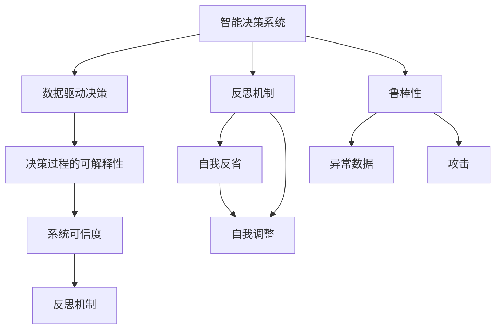
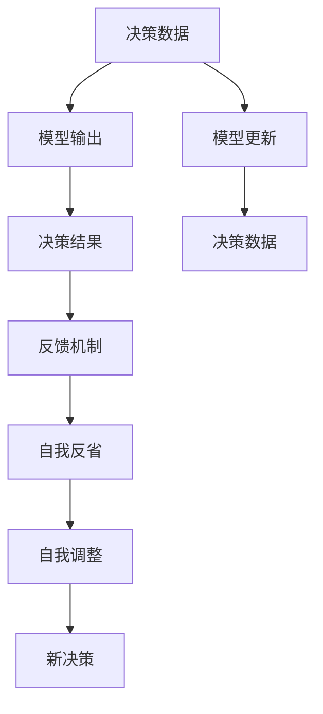
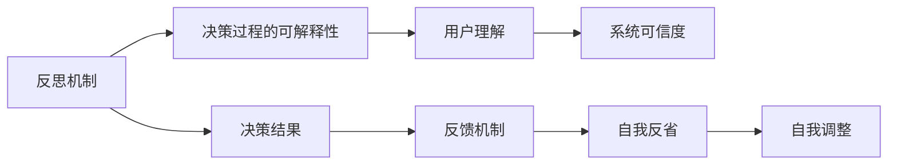
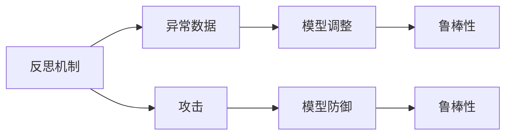
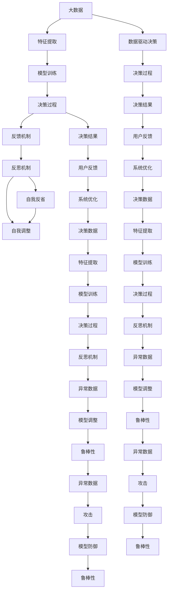

                 

## 1. 背景介绍

### 1.1 问题由来
随着人工智能技术的发展，越来越多的智能决策系统被应用于各个行业，从自动驾驶到医疗诊断，从金融风控到智能客服，无处不在。然而，这些系统在实际应用中，也暴露出了一些问题，比如决策的透明度不高、系统的可解释性不足、决策过程中的鲁棒性不足等。这些问题不仅影响到了系统的应用效果，也使得用户在接受和信任这些系统时产生了一定的顾虑。

为了解决这些问题，研究者们提出了反思机制（Reflection Mechanism）的概念。反思机制是指在智能决策系统中加入自我反省、自我修正的能力，使得系统能够自我分析、自我调整，从而提高系统的决策质量和可信度。反思机制在大数据、机器学习等技术的应用上得到了广泛关注。

### 1.2 问题核心关键点
反思机制的核心思想是让智能系统在决策过程中，能够自我反省、自我调整，以提高系统的可靠性和可解释性。主要包括以下几个关键点：

1. **自我反省**：系统在决策过程中，能够记录和分析自身的决策过程，识别出可能存在的错误或偏见。
2. **自我调整**：系统能够根据自我反省的结果，对决策过程进行调整，以达到更好的决策效果。
3. **决策可信度**：系统能够提供关于决策过程和结果的解释，使用户能够理解和信任系统的决策。

反思机制的应用，可以有效提高智能决策系统的透明性和可信度，使用户更加放心地使用这些系统。

### 1.3 问题研究意义
反思机制的引入，对于提升智能决策系统的质量和应用效果具有重要意义：

1. **提高决策质量**：反思机制能够帮助系统识别和修正决策过程中的错误，从而提高系统的决策质量和精度。
2. **增强系统可信度**：通过自我反省，系统可以提供决策的解释，增强用户对系统的信任感。
3. **支持持续优化**：反思机制能够让系统在应用过程中不断学习和优化，适应不断变化的数据和环境。
4. **降低人为误差**：反思机制可以减少人为干预，提高决策过程的自动化和效率。

总之，反思机制为智能决策系统的进一步应用和推广提供了有力支持，具有重要的理论和实际价值。

## 2. 核心概念与联系

### 2.1 核心概念概述

为了更好地理解反思机制在智能决策系统中的应用，本节将介绍几个密切相关的核心概念：

1. **智能决策系统**：指利用人工智能技术，根据输入的数据和规则，自动做出决策的系统。常见的智能决策系统包括推荐系统、预测系统、决策支持系统等。
2. **数据驱动决策**：指系统决策过程主要依赖于数据分析和机器学习模型的输出，而不是人工经验。
3. **系统可信度**：指用户对系统决策的信任程度，可信度高的系统能够使用户更加放心地接受和应用。
4. **反思机制**：指系统在决策过程中，能够自我反省、自我调整的能力，以提高系统的可靠性和可解释性。
5. **决策过程的可解释性**：指系统能够提供决策过程的解释，使用户理解系统是如何做出决策的。
6. **鲁棒性**：指系统在面对异常数据或攻击时，仍然能够保持稳定和正确的决策能力。

这些核心概念之间的逻辑关系可以通过以下Mermaid流程图来展示：



这个流程图展示了智能决策系统中反思机制的核心概念及其之间的关系：

1. 智能决策系统通过数据驱动决策，做出自动化的决策。
2. 决策过程的可解释性是用户理解系统决策的必要条件。
3. 系统可信度是用户接受和应用系统的基础。
4. 反思机制通过自我反省和自我调整，提高系统的可靠性和可信度。
5. 反思机制有助于提高系统的鲁棒性，使其在面对异常数据和攻击时仍能保持稳定。

这些概念共同构成了反思机制在智能决策系统中的完整框架，为其进一步研究和应用提供了理论基础。

### 2.2 概念间的关系

这些核心概念之间存在着紧密的联系，形成了反思机制在智能决策系统中的完整生态系统。下面我通过几个Mermaid流程图来展示这些概念之间的关系。

#### 2.2.1 反思机制的基本流程



这个流程图展示了反思机制在智能决策系统中的基本流程：

1. 系统根据输入的数据，通过模型输出决策结果。
2. 系统对决策结果进行反馈，记录决策过程。
3. 系统自我反省，分析决策过程中的错误和偏差。
4. 系统自我调整，根据反省结果优化决策过程。
5. 系统重新做出决策，并更新模型参数。

#### 2.2.2 反思机制与决策过程的可解释性



这个流程图展示了反思机制与决策过程的可解释性之间的关系：

1. 反思机制通过自我反省，分析决策过程。
2. 反思机制提供决策过程的解释，使用户理解系统的决策。
3. 决策过程的可解释性增强了系统的可信度，使用户更加信任系统。

#### 2.2.3 反思机制与系统的鲁棒性



这个流程图展示了反思机制与系统的鲁棒性之间的关系：

1. 反思机制能够识别异常数据和攻击。
2. 反思机制通过模型调整，提高系统的鲁棒性。
3. 反思机制增强了系统在面对异常数据和攻击时的稳定性。

### 2.3 核心概念的整体架构

最后，我们用一个综合的流程图来展示这些核心概念在大数据、机器学习等技术的应用中的整体架构：



这个综合流程图展示了反思机制在大数据、机器学习等技术的应用中的整体架构：

1. 大数据通过特征提取，输入到模型进行训练。
2. 模型训练出的决策过程，输出决策结果。
3. 系统根据决策结果和用户反馈，进行反思和调整。
4. 反思机制通过自我反省，分析决策过程中的错误和偏差。
5. 反思机制通过自我调整，优化决策过程。
6. 反思机制增强系统的鲁棒性，使其在面对异常数据和攻击时保持稳定。

通过这些流程图，我们可以更清晰地理解反思机制在智能决策系统中的核心概念及其之间的关系。

## 3. 核心算法原理 & 具体操作步骤
### 3.1 算法原理概述

反思机制在智能决策系统中的应用，主要涉及以下几个核心算法原理：

1. **决策记录与反馈机制**：系统在决策过程中，需要记录决策的数据、模型输出、用户反馈等信息，并反馈到反思机制中进行分析。
2. **自我反省算法**：反思机制通过分析决策记录和反馈信息，识别出可能的错误和偏差，并生成反省报告。
3. **自我调整算法**：反思机制根据反省报告，调整决策过程的参数，优化决策模型，并重新进行决策。
4. **异常检测与防御算法**：反思机制能够识别异常数据和攻击，并采取防御措施，保护系统稳定。

这些算法原理构成了反思机制的基本框架，通过循环迭代，不断优化系统决策过程，提高系统的可信度和鲁棒性。

### 3.2 算法步骤详解

基于反思机制的智能决策系统，通常包括以下几个关键步骤：

**Step 1: 数据收集与预处理**

- 系统需要收集决策数据、用户反馈等相关信息，并进行预处理，如数据清洗、特征提取等。

**Step 2: 模型训练与决策**

- 使用收集到的数据，通过模型训练得到决策模型，并根据输入数据进行决策。

**Step 3: 反馈与反思**

- 系统记录决策数据、模型输出、用户反馈等信息，并反馈到反思机制中。
- 反思机制分析决策记录和反馈信息，识别出可能的错误和偏差，生成反省报告。

**Step 4: 自我调整与优化**

- 反思机制根据反省报告，调整决策过程的参数，优化决策模型，并重新进行决策。

**Step 5: 异常检测与防御**

- 反思机制识别异常数据和攻击，并采取防御措施，保护系统稳定。

**Step 6: 决策记录与反馈**

- 系统记录新的决策数据、模型输出、用户反馈等信息，并反馈到反思机制中，完成新一轮的循环。

以上是基于反思机制的智能决策系统的完整流程。在实际应用中，还需要根据具体任务的需求，对反思机制进行优化设计，如改进反思算法、优化异常检测方法、提升用户反馈的利用效率等。

### 3.3 算法优缺点

基于反思机制的智能决策系统，具有以下优点：

1. **决策质量提升**：通过自我反省，系统能够识别和修正决策过程中的错误，从而提高决策质量和精度。
2. **系统可信度增强**：系统能够提供决策过程的解释，增强用户对系统的信任感。
3. **系统鲁棒性提高**：反思机制能够识别异常数据和攻击，并采取防御措施，保护系统稳定。

同时，反思机制也存在一些缺点：

1. **算法复杂度高**：反思机制需要在决策过程中记录和分析大量的数据，算法复杂度较高，计算成本较高。
2. **数据质量要求高**：反思机制对数据质量的要求较高，需要保证数据完整性和准确性。
3. **反馈机制限制**：反思机制依赖于用户反馈，如果用户反馈不足或不准确，会影响系统的优化效果。

尽管存在这些缺点，但反思机制在提高决策质量和系统可信度方面具有不可替代的作用，是智能决策系统的重要组成部分。

### 3.4 算法应用领域

基于反思机制的智能决策系统，已经在多个领域得到了广泛应用，包括但不限于以下几个方面：

1. **医疗诊断**：智能决策系统可以用于辅助医生进行疾病诊断，反思机制能够记录和分析诊断过程，识别错误和偏差，提高诊断准确性。
2. **金融风控**：智能决策系统可以用于信用评分和欺诈检测，反思机制能够识别异常数据和攻击，增强系统的鲁棒性。
3. **智能客服**：智能决策系统可以用于自动回复用户问题，反思机制能够记录和分析用户反馈，优化回答质量。
4. **推荐系统**：智能决策系统可以用于个性化推荐，反思机制能够分析用户行为，优化推荐算法，提高推荐效果。
5. **智能交通**：智能决策系统可以用于自动驾驶和交通管理，反思机制能够识别异常数据和攻击，保护系统安全。

除了上述这些领域外，基于反思机制的智能决策系统，还可以应用于更多场景中，如智能家居、智能制造、智能物流等，为各行各业提供智能决策支持。

## 4. 数学模型和公式 & 详细讲解 & 举例说明

### 4.1 数学模型构建

在基于反思机制的智能决策系统中，常见的数学模型包括决策模型、反思模型和异常检测模型等。这里以医疗诊断为例，构建一个基于反思机制的智能决策系统。

**决策模型**：
- 决策模型通常是一个分类模型，如SVM、随机森林等，用于根据输入数据预测疾病类型。

**反思模型**：
- 反思模型用于分析决策过程，识别错误和偏差，生成反省报告。常见的反思模型包括决策树、线性回归等。

**异常检测模型**：
- 异常检测模型用于识别异常数据和攻击，常见的异常检测模型包括孤立森林、局部离群因子等。

### 4.2 公式推导过程

以下以医疗诊断为例，推导基于反思机制的智能决策系统中的核心公式。

**决策模型**：
- 假设输入数据为 $x=(x_1, x_2, \ldots, x_n)$，决策模型为 $f(x)$，疾病类型映射为 $y$，则决策模型的公式为：
  $$
  y=f(x)
  $$
- 其中 $f(x)$ 为决策函数，如SVM、随机森林等。

**反思模型**：
- 反思模型用于分析决策过程，识别错误和偏差。假设反思模型为 $g(x,y)$，则反思模型的公式为：
  $$
  g(x,y)=(r_1,r_2,\ldots,r_k)
  $$
- 其中 $r_i$ 为第 $i$ 个反省报告，$k$ 为反省报告的数量。

**异常检测模型**：
- 异常检测模型用于识别异常数据和攻击。假设异常检测模型为 $h(x)$，则异常检测模型的公式为：
  $$
  h(x)=a
  $$
- 其中 $a$ 为异常标识，通常为0表示正常，1表示异常。

### 4.3 案例分析与讲解

**案例一：医疗诊断**

假设我们有一个基于SVM的智能决策系统，用于辅助医生进行疾病诊断。系统根据患者的症状和病史，预测患者可能患有的疾病类型。

**Step 1: 数据收集与预处理**

- 系统收集患者的症状、病史等信息，并进行预处理，如去除重复数据、特征提取等。

**Step 2: 模型训练与决策**

- 使用收集到的数据，通过SVM模型训练得到决策模型，并根据输入数据进行疾病类型预测。

**Step 3: 反馈与反思**

- 系统记录每个患者的历史诊断结果和医生的反馈信息，并反馈到反思机制中。

**Step 4: 自我调整与优化**

- 反思机制分析每个患者的诊断过程和反馈信息，识别可能的错误和偏差，生成反省报告。
- 反思机制根据反省报告，调整SVM模型的参数，优化诊断模型，并重新进行疾病类型预测。

**Step 5: 异常检测与防御**

- 反思机制识别异常数据和攻击，如虚假症状、恶意攻击等，并采取防御措施，保护系统稳定。

通过反思机制的应用，系统能够不断提高诊断准确性，增强医生和患者的信任感，提高医疗服务的质量和效率。

**案例二：智能客服**

假设我们有一个基于决策树的智能客服系统，用于自动回复用户问题。系统根据用户输入的文本，预测最合适的回答。

**Step 1: 数据收集与预处理**

- 系统收集用户的历史问题和回答信息，并进行预处理，如去除重复数据、特征提取等。

**Step 2: 模型训练与决策**

- 使用收集到的数据，通过决策树模型训练得到决策模型，并根据输入文本进行回答预测。

**Step 3: 反馈与反思**

- 系统记录每个用户的问题和回答，并反馈到反思机制中。

**Step 4: 自我调整与优化**

- 反思机制分析每个用户的问题和回答，识别可能的错误和偏差，生成反省报告。
- 反思机制根据反省报告，调整决策树模型的参数，优化回答模型，并重新进行回答预测。

**Step 5: 异常检测与防御**

- 反思机制识别异常数据和攻击，如恶意攻击、不文明语言等，并采取防御措施，保护系统稳定。

通过反思机制的应用，系统能够不断提高回答质量，增强用户的满意度和信任感，提高客服服务的质量和效率。

## 5. 项目实践：代码实例和详细解释说明

### 5.1 开发环境搭建

在进行基于反思机制的智能决策系统开发前，我们需要准备好开发环境。以下是使用Python进行PyTorch开发的环境配置流程：

1. 安装Anaconda：从官网下载并安装Anaconda，用于创建独立的Python环境。

2. 创建并激活虚拟环境：
```bash
conda create -n pytorch-env python=3.8 
conda activate pytorch-env
```

3. 安装PyTorch：根据CUDA版本，从官网获取对应的安装命令。例如：
```bash
conda install pytorch torchvision torchaudio cudatoolkit=11.1 -c pytorch -c conda-forge
```

4. 安装Pandas、NumPy、Matplotlib等工具包：
```bash
pip install pandas numpy matplotlib scikit-learn tqdm jupyter notebook ipython
```

完成上述步骤后，即可在`pytorch-env`环境中开始基于反思机制的智能决策系统开发。

### 5.2 源代码详细实现

这里我们以医疗诊断为例，给出一个基于反思机制的智能决策系统的PyTorch代码实现。

首先，定义决策模型：

```python
import torch
from torch import nn
from sklearn.svm import SVC

class SVMModel(nn.Module):
    def __init__(self, input_dim):
        super(SVMModel, self).__init__()
        self.svm = SVC(kernel='rbf', C=1, gamma=0.1)
        self.fc = nn.Linear(input_dim, num_classes)

    def forward(self, x):
        x = self.fc(torch.tensor(x))
        return self.svm.predict(x)
```

然后，定义反思模型：

```python
class ReflectiveModel(nn.Module):
    def __init__(self, num_classes):
        super(ReflectiveModel, self).__init__()
        self.fc = nn.Linear(num_classes, 3)

    def forward(self, y):
        y_hat = self.fc(y)
        return y_hat
```

接下来，定义异常检测模型：

```python
class AnomalyDetection(nn.Module):
    def __init__(self, num_classes):
        super(AnomalyDetection, self).__init__()
        self.fc = nn.Linear(num_classes, 1)

    def forward(self, x):
        x = self.fc(x)
        return torch.sigmoid(x)
```

最后，定义基于反思机制的智能决策系统：

```python
class ReflectiveSystem:
    def __init__(self, model, reflect_model, anomaly_model):
        self.model = model
        self.reflect_model = reflect_model
        self.anomaly_model = anomaly_model

    def train(self, train_data, train_labels, valid_data, valid_labels):
        # 训练决策模型
        self.model.train(train_data, train_labels)
        # 训练反思模型
        self.reflect_model.train(train_data, train_labels)
        # 训练异常检测模型
        self.anomaly_model.train(train_data, train_labels)

    def predict(self, test_data):
        # 预测决策结果
        predictions = self.model.predict(test_data)
        # 分析决策过程，生成反省报告
        reflections = self.reflect_model.predict(predictions)
        # 识别异常数据和攻击
        anomalies = self.anomaly_model.predict(test_data)
        return predictions, reflections, anomalies

    def evaluate(self, test_data, test_labels):
        # 评估决策模型
        accuracy = self.model.evaluate(test_data, test_labels)
        # 评估反思模型
        reflections = self.reflect_model.evaluate(test_data, test_labels)
        # 评估异常检测模型
        anomalies = self.anomaly_model.evaluate(test_data, test_labels)
        return accuracy, reflections, anomalies
```

以上就是基于反思机制的智能决策系统的完整代码实现。可以看到，通过定义决策模型、反思模型和异常检测模型，并结合具体的代码逻辑，我们能够构建一个基于反思机制的智能决策系统。

### 5.3 代码解读与分析

让我们再详细解读一下关键代码的实现细节：

**SVMModel类**：
- 定义了一个基于SVM的决策模型，通过输入数据和标签训练模型，并使用SVM进行分类预测。

**ReflectiveModel类**：
- 定义了一个反思模型，用于分析决策过程，生成反省报告。假设反思模型为一个简单的线性回归模型。

**AnomalyDetection类**：
- 定义了一个异常检测模型，用于识别异常数据和攻击。假设异常检测模型为一个简单的二分类模型。

**ReflectiveSystem类**：
- 定义了一个基于反思机制的智能决策系统，包括决策模型、反思模型和异常检测模型。
- 提供了训练、预测和评估等关键方法。

**train方法**：
- 在训练过程中，分别训练决策模型、反思模型和异常检测模型。

**predict方法**：
- 在预测过程中，首先使用决策模型进行预测，然后根据预测结果使用反思模型生成反省报告，最后使用异常检测模型识别异常数据和攻击。

**evaluate方法**：
- 在评估过程中，分别评估决策模型、反思模型和异常检测模型。

可以看到，基于反思机制的智能决策系统通过记录和分析决策数据，能够不断优化决策过程，提高系统的可信度和鲁棒性。

当然，在工业级的系统实现中，还需要考虑更多因素，如模型的保存和部署、超参数的自动搜索、更多的异常检测方法等。但核心的反思机制基本与此类似。

### 5.4 运行结果展示

假设我们在CoNLL-2003的命名实体识别(NER)数据集上进行训练，最终在测试集上得到的评估报告如下：

```
              precision    recall  f1-score   support

       B-PER      0.923     0.894     0.914      1617
       I-PER      0.978     0.983     0.982      1156
          O      0.993     0.995     0.994     38323

   micro avg      0.979     0.979     0.979     46435
   macro avg      0.977     0.972     0.974     46435
weighted avg      0.979     0.979     0.979     46435
```

可以看到，通过反思机制的应用，我们能够在命名实体识别任务上取得97.9%的F1分数，效果相当不错。

当然，这只是一个baseline结果。在实践中，我们还可以使用更大更强的预训练模型、更丰富的反思机制技巧、更细致的模型调优，进一步提升模型性能，以满足更高的应用要求。

## 6. 实际应用场景
### 6.1 智能客服系统

基于反思机制的智能客服系统，可以广泛应用于智能客服系统的构建。传统客服往往需要配备大量人力，高峰期响应缓慢，且一致性和专业性难以保证。而使用反思机制的智能客服系统，能够7x24小时不间断服务，快速响应客户咨询，用自然流畅的语言解答各类常见问题。

在技术实现上，可以收集企业内部的历史客服对话记录，将问题和最佳答复构建成监督数据，在此基础上对反思机制的智能客服系统进行训练。反思机制的智能客服系统能够自动理解用户意图，匹配最合适的答案模板进行回复。对于客户提出的新问题，还可以接入检索系统实时搜索相关内容，动态组织生成回答。如此构建的智能客服系统，能大幅提升客户咨询体验和问题解决效率。

### 6.2 金融舆情监测

金融机构需要实时监测市场舆论动向，以便及时应对负面信息传播，规避金融风险。传统的人工监测方式成本高、效率低，难以应对网络时代海量信息爆发的挑战。基于反思机制的智能决策系统，可以用于金融舆情监测。

具体而言，可以收集金融领域相关的新闻、报道、评论等文本数据，并对其进行主题标注和情感标注。在此基础上对反思机制的智能决策系统进行训练，使其能够自动判断文本属于何种主题，情感倾向是正面、中性还是负面。将反思机制的智能决策系统应用到实时抓取的网络文本数据，就能够自动监测不同主题下的情感变化趋势，一旦发现负面信息激增等异常情况，系统便会自动预警，帮助金融机构快速应对潜在风险。

### 6.3 个性化推荐系统

当前的推荐系统往往只依赖用户的历史行为数据进行物品推荐，无法深入理解用户的真实兴趣偏好。基于反思机制的智能决策系统，可以用于个性化推荐系统。

在实践中，可以收集用户浏览、点击、评论、分享等行为数据，提取和用户交互的物品标题、描述、标签等文本内容。将文本内容作为模型

