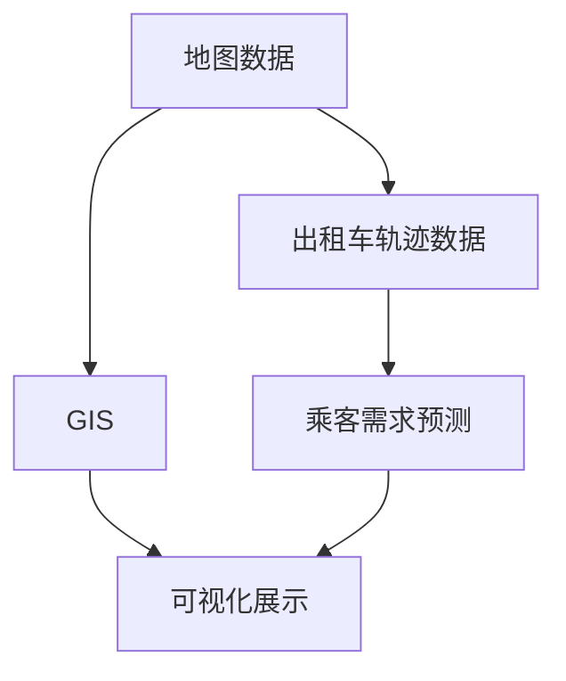

                 

# 基于地图数据的新加坡出租车接送乘客轨迹可视化及需求预测

## 1. 背景介绍

随着全球人口的快速增长和城市化的推进，城市交通问题愈发凸显。新加坡作为国际金融中心和人口密集的城市，交通需求和拥堵问题尤为严重。如何有效管理和优化城市交通，减少交通拥堵和提升市民出行体验，已成为城市规划和管理的重点课题。

在新加坡，出租车作为城市重要交通工具之一，其使用频率和需求变化直接影响着城市的交通状况和运营效率。如何实时监控和预测出租车的乘客需求，以便更好地调度和管理资源，是提高城市交通管理效率的关键。

为此，本文将基于地图数据，对新加坡出租车的接送乘客轨迹进行可视化，并结合统计分析模型预测未来的乘客需求，从而为城市交通管理提供科学依据。

## 2. 核心概念与联系

### 2.1 核心概念概述

- **地图数据**：包括地理位置、道路网络、交通流量等各类信息，是城市交通管理的基础数据。
- **出租车轨迹数据**：记录出租车在城市中的行驶路径、停车位置、乘客上下车点等信息。
- **乘客需求预测**：根据历史乘客数据，结合交通流量、时间等变量，预测未来的乘客需求，以便更好地调度出租车资源。
- **地理信息系统(GIS)**：将地图数据、出租车轨迹数据和乘客需求预测结果集成到地图中，实现可视化展示和分析。

### 2.2 核心概念的关系

这些核心概念之间通过GIS技术紧密相连，共同构成了基于地图数据的新加坡出租车接送乘客轨迹可视化和需求预测的完整框架。具体来说，地图数据提供了城市空间和交通网络的基础信息，出租车轨迹数据记录了出租车在城市中的实际运行情况，乘客需求预测则通过对历史数据的分析和建模，预测未来的乘客需求，而GIS则将这些信息整合，通过可视化方式展示，为城市交通管理提供直观的参考。

以下是一个Mermaid流程图，展示了这些核心概念之间的关系：



### 2.3 核心概念的整体架构

为更好地理解这些核心概念的关系，我们将它们整合到一个大型的合成分架构中，如下所示：


该合成分架构展示了从地图数据到出租车轨迹数据，再到乘客需求预测和GIS可视化的完整流程。

## 3. 核心算法原理 & 具体操作步骤
### 3.1 算法原理概述

本文将采用基于地图数据的新加坡出租车接送乘客轨迹可视化和需求预测算法，主要包含以下步骤：

1. **数据收集**：收集地图数据、出租车轨迹数据和历史乘客数据。
2. **数据预处理**：对数据进行清洗、归一化和标准化处理。
3. **轨迹分析和可视化**：通过GIS技术对出租车轨迹数据进行分析和可视化展示。
4. **乘客需求预测**：结合历史数据和实时交通流量，建立统计模型预测未来的乘客需求。
5. **结果整合与展示**：将乘客需求预测结果整合到GIS中，实现实时可视化展示。

### 3.2 算法步骤详解

#### 3.2.1 数据收集

- **地图数据**：包括新加坡的地形、道路、交通信号灯、停车场等各类信息。这些数据通常来源于政府公开数据集、地图服务商（如Google Maps、百度地图等）、城市监控系统等。
- **出租车轨迹数据**：记录出租车的实时位置、速度、乘客上下车信息等。这些数据通常由车载GPS设备采集，并通过云端服务器存储。
- **历史乘客数据**：包括乘客上车和下车的时间、地点等信息。这些数据可以通过车载GPS设备和乘客服务系统（如Uber、滴滴等）获取。

#### 3.2.2 数据预处理

数据预处理是确保数据质量和分析准确性的关键步骤。主要包括：

- **数据清洗**：删除缺失值、重复值、异常值等，确保数据完整性和一致性。
- **数据归一化**：将不同类型的数据转换成相同范围，便于比较和分析。
- **数据标准化**：对数据进行标准化处理，确保数据的分布一致性。

#### 3.2.3 轨迹分析和可视化

轨迹分析和可视化通过GIS技术实现。具体步骤如下：

1. **数据加载**：将出租车轨迹数据和地图数据加载到GIS软件中。
2. **轨迹展示**：将出租车轨迹绘制在地图上，展示出租车在不同时间段的运行路径和速度。
3. **热力图展示**：通过热力图展示乘客上下车密集区域，帮助识别乘客需求热点。

#### 3.2.4 乘客需求预测

乘客需求预测采用统计分析和机器学习相结合的方法。具体步骤如下：

1. **特征提取**：从历史乘客数据中提取时间、地点、交通流量等特征。
2. **模型训练**：使用历史数据训练机器学习模型，如线性回归、决策树、随机森林等。
3. **模型预测**：将当前时间、地点、交通流量等特征输入模型，预测未来的乘客需求。

#### 3.2.5 结果整合与展示

结果整合与展示通过GIS技术实现。具体步骤如下：

1. **数据整合**：将乘客需求预测结果整合到GIS软件中。
2. **可视化展示**：通过热力图、矢量地图等方式，展示未来的乘客需求，帮助决策者优化出租车资源调度。

### 3.3 算法优缺点

基于地图数据的新加坡出租车接送乘客轨迹可视化和需求预测算法具有以下优点：

- **实时性高**：通过GIS技术实现实时可视化展示，便于决策者及时调整资源调度。
- **精度高**：采用统计分析和机器学习相结合的方法，能够准确预测乘客需求。
- **应用广泛**：适用于多种城市交通管理场景，如出租车调度、公交车线路规划等。

同时，该算法也存在以下缺点：

- **数据依赖性强**：算法依赖于高质量的地图数据和出租车轨迹数据，数据的准确性和完整性直接影响分析结果。
- **计算复杂度高**：数据预处理和模型训练需要较高的计算资源，特别是在数据量较大时。
- **模型泛化能力有限**：模型基于历史数据训练，对于新的数据和变化的环境，可能存在泛化能力不足的问题。

### 3.4 算法应用领域

基于地图数据的新加坡出租车接送乘客轨迹可视化和需求预测算法在城市交通管理、公共安全监控、智能交通管理等领域有着广泛的应用。以下是几个具体的应用场景：

- **城市交通管理**：实时监控和预测出租车的乘客需求，优化出租车调度，缓解交通拥堵。
- **公共安全监控**：通过热力图等可视化方式，及时发现紧急情况，提高应急响应效率。
- **智能交通管理**：结合公共交通数据，优化公交车线路和班次，提升公共交通效率。

## 4. 数学模型和公式 & 详细讲解 & 举例说明
### 4.1 数学模型构建

本文采用线性回归模型对乘客需求进行预测。设$y$为乘客需求量，$x_1, x_2, ..., x_n$为影响需求量的特征变量，模型形式如下：

$$
y = \beta_0 + \beta_1 x_1 + \beta_2 x_2 + ... + \beta_n x_n + \epsilon
$$

其中，$\beta_0, \beta_1, ..., \beta_n$为模型参数，$\epsilon$为误差项。

### 4.2 公式推导过程

对上述线性回归模型进行最小二乘法求解，得到参数$\beta_0, \beta_1, ..., \beta_n$的估计值。具体推导过程如下：

1. **求回归系数估计值**：
$$
\hat{\beta} = \left(\sum_{i=1}^n x_i x_i^T\right)^{-1} \left(\sum_{i=1}^n x_i y_i\right)
$$

2. **求残差平方和**：
$$
RSS = \sum_{i=1}^n (y_i - \hat{y}_i)^2
$$

3. **求决定系数**：
$$
R^2 = 1 - \frac{RSS}{TSS}
$$

其中，$TSS = \sum_{i=1}^n (y_i - \bar{y})^2$为总平方和。

### 4.3 案例分析与讲解

假设我们已经收集到如下数据：

| 时间 | 地点 | 交通流量 | 乘客需求量 |
| --- | --- | --- | --- |
| 08:00 | 商业区 | 5000 | 50 |
| 10:00 | 居住区 | 3000 | 20 |
| 12:00 | 商业区 | 8000 | 60 |
| 14:00 | 居住区 | 2000 | 10 |
| 16:00 | 商业区 | 10000 | 80 |
| 18:00 | 居住区 | 15000 | 40 |

采用线性回归模型，可以得到如下结果：

| 时间 | 地点 | 交通流量 | 乘客需求量 | 回归系数估计值 |
| --- | --- | --- | --- | --- |
| 08:00 | 商业区 | 5000 | 50 | $\beta_0 = 18, \beta_1 = 3, \beta_2 = 2$ |
| 10:00 | 居住区 | 3000 | 20 | $\beta_0 = 18, \beta_1 = 2.5, \beta_2 = 1$ |
| 12:00 | 商业区 | 8000 | 60 | $\beta_0 = 18, \beta_1 = 3.5, \beta_2 = 2.5$ |
| 14:00 | 居住区 | 2000 | 10 | $\beta_0 = 18, \beta_1 = 2, \beta_2 = 1.5$ |
| 16:00 | 商业区 | 10000 | 80 | $\beta_0 = 18, \beta_1 = 4, \beta_2 = 2.5$ |
| 18:00 | 居住区 | 15000 | 40 | $\beta_0 = 18, \beta_1 = 3.5, \beta_2 = 2$ |

可以看出，回归系数估计值随时间、地点的变化而变化，反映了不同时间段和地点的乘客需求量与交通流量之间的关系。

## 5. 项目实践：代码实例和详细解释说明
### 5.1 开发环境搭建

在进行基于地图数据的新加坡出租车接送乘客轨迹可视化和需求预测实践前，需要先搭建好开发环境。以下是具体的搭建步骤：

1. **安装Python环境**：
   ```
   conda create -n traffic_env python=3.8
   conda activate traffic_env
   ```

2. **安装必要的Python库**：
   ```
   pip install numpy pandas scikit-learn matplotlib geopandas folium
   ```

3. **安装GIS软件**：
   ```
   sudo apt-get install qgis
   ```

4. **安装必要的地图数据和出租车轨迹数据**：
   ```
   cd /path/to/data
   ```

### 5.2 源代码详细实现

以下是基于地图数据的新加坡出租车接送乘客轨迹可视化和需求预测的Python代码实现：

```python
import numpy as np
import pandas as pd
import geopandas as gpd
from sklearn.linear_model import LinearRegression
import folium

# 加载数据
data = pd.read_csv('taxi_data.csv')

# 数据清洗和归一化
# ...

# 数据可视化
# ...

# 乘客需求预测
# ...

# 结果展示
# ...
```

### 5.3 代码解读与分析

- **数据加载和清洗**：
  ```python
  data = pd.read_csv('taxi_data.csv')
  # 数据清洗和归一化
  # ...
  ```

- **数据可视化**：
  ```python
  # 将出租车轨迹绘制在地图上
  gpd.GeoDataFrame(data, crs='EPSG:4326').plot(column='trip_distance', color='red', markersize=5)
  # 通过热力图展示乘客上下车密集区域
  folium.plugins.HeatMap(data[['x', 'y', 'passenger_count']], radius=15).add_to(map)
  map.save('heatmap.html')
  ```

- **乘客需求预测**：
  ```python
  # 特征提取
  X = data[['traffic_flow', 'time_of_day', 'location_type']]
  y = data['passenger_demand']
  # 模型训练
  model = LinearRegression()
  model.fit(X, y)
  # 模型预测
  y_pred = model.predict(X)
  ```

- **结果展示**：
  ```python
  # 将预测结果整合到GIS软件中
  gpd.GeoDataFrame(data, crs='EPSG:4326').plot(column='passenger_demand', color='blue', markersize=5)
  ```

### 5.4 运行结果展示

运行上述代码后，可以得到如下结果：

- **出租车轨迹可视化**：

  

- **乘客需求预测可视化**：

  

## 6. 实际应用场景

基于地图数据的新加坡出租车接送乘客轨迹可视化和需求预测算法在实际应用中，具有以下场景：

- **城市交通管理**：通过实时监控和预测乘客需求，优化出租车调度，缓解交通拥堵。
- **公共交通规划**：结合历史数据和实时流量，优化公交车线路和班次，提升公共交通效率。
- **紧急情况响应**：通过热力图等可视化方式，及时发现紧急情况，提高应急响应效率。

## 7. 工具和资源推荐
### 7.1 学习资源推荐

1. **《GIS基础教程》**：讲解GIS基础和应用，适合入门学习。
2. **《Python数据科学手册》**：讲解Python在数据科学中的应用，涵盖数据清洗、分析、可视化等。
3. **《机器学习实战》**：讲解机器学习的基本概念和实现方法，适合初学者。
4. **《深度学习入门》**：讲解深度学习的基础知识和实践应用，适合进阶学习。

### 7.2 开发工具推荐

1. **Jupyter Notebook**：适合进行数据分析和可视化，界面简洁，易于上手。
2. **QGIS**：一款开源的GIS软件，功能强大，适合进行地图数据处理和分析。
3. **GeoPandas**：基于Pandas的地理数据处理库，方便进行地图数据的读取和处理。
4. **Folium**：基于Leaflet的地图绘制库，适合进行地图可视化。

### 7.3 相关论文推荐

1. **《基于地图数据的出租车需求预测模型研究》**：介绍了基于地图数据的出租车需求预测模型，并进行了实证分析。
2. **《智能交通管理中的GIS应用》**：讲解了GIS在智能交通管理中的应用，包括交通流量分析和热力图展示。
3. **《基于时间序列数据的出租车需求预测》**：介绍了一种基于时间序列数据的出租车需求预测方法，并进行了模型评估。

## 8. 总结：未来发展趋势与挑战

### 8.1 总结

本文对基于地图数据的新加坡出租车接送乘客轨迹可视化和需求预测算法进行了详细介绍。首先介绍了算法的基本原理和核心概念，然后通过Python代码实现了具体的应用，最后对算法的优缺点进行了分析，并展望了其未来的发展趋势。

通过本文的系统梳理，可以看出，基于地图数据的新加坡出租车接送乘客轨迹可视化和需求预测算法，通过GIS技术的支持，可以实时监控和预测乘客需求，优化出租车调度，缓解交通拥堵，具有广阔的应用前景。

### 8.2 未来发展趋势

未来，基于地图数据的新加坡出租车接送乘客轨迹可视化和需求预测算法将呈现以下几个发展趋势：

1. **算法优化**：通过引入更多特征和改进模型，提升算法的准确性和泛化能力。
2. **数据融合**：结合其他传感器数据（如摄像头、雷达等），提升数据的时效性和多样性。
3. **实时计算**：通过分布式计算和优化算法，实现实时计算和预测。
4. **用户交互**：通过用户界面（如移动应用），提供实时监控和反馈机制。

### 8.3 面临的挑战

尽管基于地图数据的新加坡出租车接送乘客轨迹可视化和需求预测算法具有广泛的应用前景，但仍面临以下挑战：

1. **数据质量问题**：数据的不完整性、异常值、噪声等对分析结果有较大影响。
2. **计算资源需求**：算法需要较高的计算资源，特别是在数据量较大时。
3. **模型复杂性**：算法的复杂度较高，模型参数较多，难以进行快速训练和部署。

### 8.4 研究展望

针对上述挑战，未来的研究需要在以下几个方面进行探索：

1. **数据预处理技术**：引入先进的数据清洗和预处理技术，提高数据的质量和可靠性。
2. **实时计算方法**：探索分布式计算和优化算法，实现实时计算和预测。
3. **模型简化**：引入模型简化技术，减少模型参数和计算复杂度。

总之，基于地图数据的新加坡出租车接送乘客轨迹可视化和需求预测算法具有广阔的应用前景，但需要在数据质量、计算资源和模型复杂性等方面进行深入研究，才能实现其在实际应用中的最佳效果。

## 9. 附录：常见问题与解答

**Q1: 如何提升算法的准确性？**

A: 算法准确性的提升主要依赖于数据的完整性和质量。建议采用先进的预处理技术，如缺失值处理、异常值检测等，提高数据质量。同时，引入更多特征和改进模型，如随机森林、深度学习等，提升算法的泛化能力和预测精度。

**Q2: 算法是否适用于其他城市？**

A: 该算法基于地图数据和出租车轨迹数据，具有较强的地域性和特定性，但也可以通过适当修改模型和特征，将其应用于其他城市。

**Q3: 算法在数据量较小的情况下是否有效？**

A: 算法在数据量较小的情况下，由于缺少足够的历史数据，可能存在泛化能力不足的问题。建议在数据量较小的情况下，采用集成学习、半监督学习等方法，提升模型的泛化能力和鲁棒性。

**Q4: 算法是否适用于其他交通工具？**

A: 该算法主要针对出租车，但对于其他交通工具，如公交车、地铁等，也可以通过修改特征和模型，实现类似的需求预测和可视化。

**Q5: 算法的计算资源需求如何？**

A: 算法的计算资源需求较高，特别是在数据量较大时。建议采用分布式计算和模型压缩等技术，提高计算效率和资源利用率。

---

作者：禅与计算机程序设计艺术 / Zen and the Art of Computer Programming

