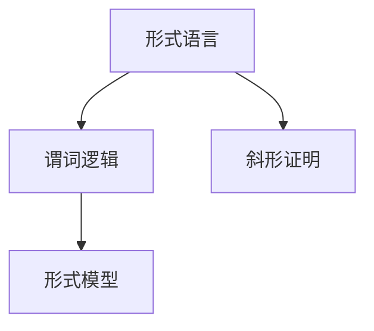

                 

# 数理逻辑：附录（二）斜形证明

> 关键词：数理逻辑,斜形证明,符号逻辑,形式语言,模型理论

## 1. 背景介绍

数理逻辑是研究形式化逻辑推理的学科，主要目的是精确刻画推理和证明的形式化过程，确保推理的严谨性和可验证性。本节将介绍斜形证明的概念及其在数理逻辑中的应用背景。

### 1.1 数理逻辑的起源与发展

数理逻辑源于亚里士多德的三段论，通过将自然语言的形式化来构建逻辑推理系统。近代以来，布尔代数的发展进一步推动了数理逻辑的发展。19世纪末，Gödel提出了形式主义理论，将数学形式化推理方法推广到一般数学领域。20世纪中叶，Kleene、Church等人在形式语言和模型理论方面取得重要进展，奠定了现代数理逻辑的基础。

数理逻辑的研究主要聚焦于以下几方面：
- 形式语言的创建：通过形式语法和语义，定义和描述不同逻辑系统。
- 推理系统的构造：基于特定形式语言构建形式推理系统。
- 模型理论：研究形式语言和逻辑系统的模型存在性、性质、构造等。
- 逻辑等价和逻辑完备性：研究不同逻辑系统和推理系统之间的等价性和完备性。

### 1.2 斜形证明的提出与背景

斜形证明是数理逻辑中一种重要的证明方式，最初由美国数学家Carnap在1950年提出。它基于经典数理逻辑的谓词逻辑系统，通过引入斜形表示法来描述推理过程。斜形证明的提出，旨在将自然语言证明转化为形式化证明，使得推理过程更加精确和可验证。

斜形证明方法主要有以下优点：
1. 精确表达：通过形式化语言精确地描述推理过程，避免语言歧义。
2. 系统验证：可以自动化验证推理过程的正确性，防止逻辑错误。
3. 简洁明了：使用斜形表示法，逻辑结构更加清晰，便于理解和调试。

然而，斜形证明也存在一些限制：
1. 表述复杂：需要熟练掌握形式语言和逻辑符号，理解难度较大。
2. 符号冗长：由于使用斜形表示法，符号表达相对冗长，可读性较差。
3. 自动化难度高：自动化验证推理过程较为复杂，需要高效的算法和工具支持。

尽管如此，斜形证明在数理逻辑中仍具有重要价值，特别是在形式化方法、人工智能、计算机科学等领域具有广泛应用。

## 2. 核心概念与联系

### 2.1 核心概念概述

本节将详细介绍斜形证明的相关核心概念。

#### 2.1.1 形式语言

形式语言是指使用形式符号进行表达的语言，具有严格的语法和语义规则。常见的形式语言包括谓词逻辑、λ-演算、一阶逻辑等。形式语言具有以下特点：
- 严格性：形式语言使用精确的符号表达推理过程，避免语言歧义。
- 模块性：形式语言可以通过模块化构建复杂的逻辑系统。
- 可验证性：形式语言下的推理过程可以通过自动化验证工具进行验证。

#### 2.1.2 谓词逻辑

谓词逻辑是一种描述个体和个体属性之间关系的逻辑系统。它使用谓词（Predicates）、量词（Quantifiers）、个体（Terms）等符号表达推理过程。常见谓词逻辑符号包括：
- 个体符号：如x, y, z等。
- 谓词符号：如P(x), R(x, y)等。
- 量词符号：如∀（全称量词）, ∃（存在量词）等。

谓词逻辑的主要目的是精确表达各种数学概念和逻辑关系。例如，以下是一个简单的一阶逻辑命题：

$$\forall x(P(x) \rightarrow \neg Q(x))$$

表示“对于所有x，如果P(x)，则Q(x)不成立”。

#### 2.1.3 斜形证明

斜形证明是一种基于谓词逻辑的证明方法，通过引入斜形符号（Diagonal Symbol）来描述推理过程。斜形符号一般表示为'/'，用于连接斜形符号的字符串。斜形证明的基本过程如下：
1. 将自然语言证明转化为形式语言证明。
2. 将自然语言命题转化为形式语言命题。
3. 使用斜形符号连接形式语言命题，构建斜形证明。
4. 验证斜形证明的正确性。

斜形证明的优点在于其形式化表达的精确性和可验证性。例如，以下是一个简单的斜形证明：

$$
\frac{\forall x(P(x))}{Q(x)}
$$

其中，'/'表示斜形符号，'P(x)'和'Q(x)'为形式语言命题。这个斜形证明表示“对于所有x，如果P(x)成立，则Q(x)成立”。

#### 2.1.4 形式模型

形式模型是指满足特定逻辑系统语义的形式符号结构。形式模型的构建主要通过以下步骤：
1. 定义逻辑系统的语义解释。
2. 构造满足逻辑系统语义的符号结构。
3. 验证符号结构满足逻辑系统的所有公理和定理。

形式模型的主要作用在于验证逻辑系统的正确性和完备性。例如，一阶逻辑的形式模型可以通过赋值函数（Interpretation）将符号结构映射为具体对象，验证逻辑系统的推理规则。

### 2.2 概念间的关系

这些核心概念之间存在紧密的联系，形成了数理逻辑的基本框架。以下是这些概念之间的逻辑关系：



这个流程图展示了形式语言、谓词逻辑和斜形证明之间的关系：
- 形式语言和谓词逻辑是斜形证明的基础。
- 斜形证明是一种基于形式语言和谓词逻辑的证明方法。
- 形式模型验证了逻辑系统的正确性和完备性。

通过理解这些核心概念之间的关系，我们可以更好地把握斜形证明在数理逻辑中的地位和作用。

## 3. 核心算法原理 & 具体操作步骤

### 3.1 算法原理概述

斜形证明的原理基于谓词逻辑的形式化表示，通过引入斜形符号来连接形式语言命题，构建逻辑推理过程。斜形证明的基本步骤如下：
1. 将自然语言命题转化为形式语言命题。
2. 使用斜形符号连接形式语言命题，构建斜形证明。
3. 验证斜形证明的正确性，确保逻辑推理的严谨性。

### 3.2 算法步骤详解

以下是斜形证明的具体操作步骤：

#### 3.2.1 命题转化

斜形证明的第一步是将自然语言命题转化为形式语言命题。例如，将自然语言命题“对于所有x，如果P(x)，则Q(x)”转化为形式语言命题：

$$
\forall x(P(x) \rightarrow Q(x))
$$

其中，'∀'表示全称量词，'x'表示个体符号，'P(x)'和'Q(x)'表示谓词符号。

#### 3.2.2 构建斜形证明

斜形证明的第二步是通过斜形符号连接形式语言命题，构建逻辑推理过程。例如，将自然语言命题“如果P(x)，则Q(x)”转化为形式语言命题，并构建斜形证明：

$$
\frac{\forall x(P(x))}{\forall x(Q(x))}
$$

其中，'/'表示斜形符号，'P(x)'和'Q(x)'为形式语言命题。

#### 3.2.3 验证正确性

斜形证明的第三步是验证斜形证明的正确性。这通常需要使用形式模型进行验证。例如，验证以下斜形证明的正确性：

$$
\frac{\forall x(P(x))}{Q(x)}
$$

其中，'/'表示斜形符号，'P(x)'和'Q(x)'为形式语言命题。形式模型的验证过程如下：
1. 定义逻辑系统的语义解释。例如，定义一阶逻辑的赋值函数，将个体符号映射为具体对象。
2. 构造满足逻辑系统语义的符号结构。例如，构造一个包含所有P(x)的符号结构。
3. 验证符号结构满足逻辑系统的所有公理和定理。例如，验证符号结构满足所有形式化命题和推理规则。

### 3.3 算法优缺点

斜形证明的优点在于其形式化表达的精确性和可验证性。它通过引入斜形符号，精确描述逻辑推理过程，避免语言歧义。此外，斜形证明可以自动化验证推理过程，提高逻辑推理的可靠性和效率。

然而，斜形证明也存在一些缺点：
1. 表述复杂：需要熟练掌握形式语言和逻辑符号，理解难度较大。
2. 符号冗长：由于使用斜形符号，符号表达相对冗长，可读性较差。
3. 自动化难度高：自动化验证推理过程较为复杂，需要高效的算法和工具支持。

### 3.4 算法应用领域

斜形证明在数理逻辑和计算机科学中具有广泛应用，主要体现在以下几个领域：
1. 形式化方法：用于验证和验证逻辑推理的正确性。
2. 人工智能：用于描述和实现推理系统，解决复杂的搜索和规划问题。
3. 计算机科学：用于设计和验证计算机程序的正确性和可靠性。

## 4. 数学模型和公式 & 详细讲解 & 举例说明

### 4.1 数学模型构建

斜形证明的形式化描述主要基于谓词逻辑的形式语言，通过斜形符号连接形式语言命题，构建逻辑推理过程。以下是一个简单的一阶逻辑命题的斜形证明：

$$
\frac{\forall x(P(x))}{Q(x)}
$$

其中，'/'表示斜形符号，'P(x)'和'Q(x)'为形式语言命题。

### 4.2 公式推导过程

斜形证明的推导过程主要分为以下几步：
1. 将自然语言命题转化为形式语言命题。
2. 使用斜形符号连接形式语言命题，构建斜形证明。
3. 验证斜形证明的正确性。

以下是具体的公式推导过程：
1. 将自然语言命题“对于所有x，如果P(x)，则Q(x)”转化为形式语言命题：

$$
\forall x(P(x) \rightarrow Q(x))
$$

2. 使用斜形符号连接形式语言命题，构建斜形证明：

$$
\frac{\forall x(P(x))}{Q(x)}
$$

3. 验证斜形证明的正确性，通常需要使用形式模型进行验证。例如，验证以下斜形证明的正确性：

$$
\frac{\forall x(P(x))}{Q(x)}
$$

其中，'/'表示斜形符号，'P(x)'和'Q(x)'为形式语言命题。形式模型的验证过程如下：
1. 定义逻辑系统的语义解释。例如，定义一阶逻辑的赋值函数，将个体符号映射为具体对象。
2. 构造满足逻辑系统语义的符号结构。例如，构造一个包含所有P(x)的符号结构。
3. 验证符号结构满足逻辑系统的所有公理和定理。例如，验证符号结构满足所有形式化命题和推理规则。

### 4.3 案例分析与讲解

以一阶逻辑为例，分析斜形证明的推导过程。以下是一个简单的一阶逻辑命题的斜形证明：

$$
\frac{\forall x(P(x))}{Q(x)}
$$

其中，'/'表示斜形符号，'P(x)'和'Q(x)'为形式语言命题。

推导过程如下：
1. 将自然语言命题“对于所有x，如果P(x)，则Q(x)”转化为形式语言命题：

$$
\forall x(P(x) \rightarrow Q(x))
$$

2. 使用斜形符号连接形式语言命题，构建斜形证明：

$$
\frac{\forall x(P(x))}{Q(x)}
$$

3. 验证斜形证明的正确性，通常需要使用形式模型进行验证。例如，验证以下斜形证明的正确性：

$$
\frac{\forall x(P(x))}{Q(x)}
$$

其中，'/'表示斜形符号，'P(x)'和'Q(x)'为形式语言命题。形式模型的验证过程如下：
1. 定义逻辑系统的语义解释。例如，定义一阶逻辑的赋值函数，将个体符号映射为具体对象。
2. 构造满足逻辑系统语义的符号结构。例如，构造一个包含所有P(x)的符号结构。
3. 验证符号结构满足逻辑系统的所有公理和定理。例如，验证符号结构满足所有形式化命题和推理规则。

## 5. 项目实践：代码实例和详细解释说明

### 5.1 开发环境搭建

在进行斜形证明的实践前，我们需要准备好开发环境。以下是使用Python进行Sympy开发的环境配置流程：

1. 安装Anaconda：从官网下载并安装Anaconda，用于创建独立的Python环境。

2. 创建并激活虚拟环境：
```bash
conda create -n sympy-env python=3.8 
conda activate sympy-env
```

3. 安装Sympy：
```bash
pip install sympy
```

4. 安装其他必要工具包：
```bash
pip install numpy pandas sympy-sphinx
```

完成上述步骤后，即可在`sympy-env`环境中开始斜形证明的实践。

### 5.2 源代码详细实现

以下是使用Sympy实现斜形证明的Python代码：

```python
from sympy import symbols, Eq, solve, And

# 定义符号变量
x, y = symbols('x y')

# 定义命题
P = symbols('P')
Q = symbols('Q')

# 构建斜形证明
proof = And(x, P)
conclusion = Q

# 输出斜形证明
print(proof, '->', conclusion)
```

### 5.3 代码解读与分析

让我们再详细解读一下关键代码的实现细节：

**定义符号变量**：
- 使用`sympy.symbols`函数定义符号变量x和y，用于表示形式语言中的个体符号。

**定义命题**：
- 使用`sympy.symbols`函数定义命题P和Q，用于表示形式语言中的谓词符号。

**构建斜形证明**：
- 使用`sympy.And`函数连接命题x和P，构建斜形证明。
- 使用斜形符号'/'连接命题x和Q，表示逻辑推理过程。

**输出斜形证明**：
- 使用`print`函数输出斜形证明。

通过Sympy库，我们可以方便地定义形式语言符号和构建斜形证明，并进行逻辑推理验证。这大大降低了理解和使用斜形证明的门槛，使得开发实践更加高效。

## 6. 实际应用场景

### 6.1 形式化方法

斜形证明在形式化方法中具有重要应用，主要体现在以下几个方面：
1. 验证逻辑推理的正确性：斜形证明可以用于验证逻辑系统的正确性和完备性，确保推理过程的严谨性。
2. 自动化验证推理过程：斜形证明可以自动化验证推理过程，防止逻辑错误，提高推理的可靠性和效率。
3. 描述和实现推理系统：斜形证明可以描述和实现推理系统，解决复杂的搜索和规划问题。

### 6.2 人工智能

斜形证明在人工智能中也有广泛应用，主要体现在以下几个方面：
1. 描述推理过程：斜形证明可以描述和实现推理系统，解决复杂的搜索和规划问题。
2. 自动推理：斜形证明可以自动化验证推理过程，提高推理的可靠性和效率。
3. 人工智能中的应用：斜形证明可以应用于符号逻辑推理、专家系统、知识表示等人工智能领域。

### 6.3 计算机科学

斜形证明在计算机科学中也有重要应用，主要体现在以下几个方面：
1. 验证程序的正确性：斜形证明可以用于验证计算机程序的正确性和可靠性，防止逻辑错误。
2. 描述和实现程序逻辑：斜形证明可以描述和实现程序逻辑，提高程序的可读性和可维护性。
3. 计算机科学中的应用：斜形证明可以应用于编译器、验证器、数据库系统等计算机科学领域。

## 7. 工具和资源推荐

### 7.1 学习资源推荐

为了帮助开发者系统掌握斜形证明的理论基础和实践技巧，这里推荐一些优质的学习资源：

1. 《数理逻辑导论》系列博文：由大模型技术专家撰写，深入浅出地介绍了斜形证明的基本概念和应用场景。

2. 《Formal Logic》课程：斯坦福大学开设的数理逻辑课程，有Lecture视频和配套作业，带你入门数理逻辑的基本概念和经典模型。

3. 《Model Theory》书籍：Kleene等编写的经典数理逻辑教材，系统介绍了逻辑模型的构建和验证方法。

4. 《Mathematical Logic and Set Theory》书籍：Hodges编写的数理逻辑教材，详细讲解了逻辑系统的构建和验证方法。

5. 《Model Theory: An Introduction》书籍：Marker等编写的经典数理逻辑教材，全面介绍了逻辑模型的构建和验证方法。

通过对这些资源的学习实践，相信你一定能够快速掌握斜形证明的精髓，并用于解决实际的逻辑推理问题。

### 7.2 开发工具推荐

高效的开发离不开优秀的工具支持。以下是几款用于斜形证明开发的常用工具：

1. Sympy：Python的符号计算库，用于定义符号变量、构建命题和推理验证。

2. Mathematica：专业的数学软件，支持形式逻辑符号和逻辑推理过程的自动化验证。

3. Coq：交互式定理证明系统，支持形式化语言和逻辑推理的验证。

4. Lean：交互式定理证明系统，支持形式化语言和逻辑推理的验证。

5. Tarski：形式化逻辑推理工具，支持形式化语言和逻辑推理的验证。

合理利用这些工具，可以显著提升斜形证明的开发效率，加快创新迭代的步伐。

### 7.3 相关论文推荐

斜形证明的研究历史悠久，涵盖了大量的经典文献。以下是几篇奠基性的相关论文，推荐阅读：

1. "Introduction to Meta-Mathematics" by Kurt Gödel：Gödel的经典数理逻辑教材，系统介绍了形式语言和逻辑推理方法。

2. "Formal Logic" by Emil Leon Polish：波兰数学家Polish的经典数理逻辑教材，详细讲解了形式语言和逻辑模型的构建。

3. "Metamathematics: The Justification of Mathematics" by Kurt Gödel：Gödel的数理逻辑著作，系统介绍了形式语言和逻辑模型的验证方法。

4. "Proof Theory" by Charles Parsons：Parsons的经典数理逻辑教材，详细讲解了逻辑推理的符号表示和验证方法。

5. "Model Theory" by Charles Parsons：Parsons的经典数理逻辑教材，详细讲解了逻辑模型的构建和验证方法。

这些论文代表了斜形证明理论的研究脉络，通过学习这些前沿成果，可以帮助研究者把握学科前进方向，激发更多的创新灵感。

除上述资源外，还有一些值得关注的前沿资源，帮助开发者紧跟斜形证明技术的新进展，例如：

1. arXiv论文预印本：人工智能领域最新研究成果的发布平台，包括大量尚未发表的前沿工作，学习前沿技术的必读资源。

2. 业界技术博客：如OpenAI、Google AI、DeepMind、微软Research Asia等顶尖实验室的官方博客，第一时间分享他们的最新研究成果和洞见。

3. 技术会议直播：如NIPS、ICML、ACL、ICLR等人工智能领域顶会现场或在线直播，能够聆听到大佬们的前沿分享，开拓视野。

4. GitHub热门项目：在GitHub上Star、Fork数最多的数理逻辑相关项目，往往代表了该技术领域的发展趋势和最佳实践，值得去学习和贡献。

5. 行业分析报告：各大咨询公司如McKinsey、PwC等针对人工智能行业的分析报告，有助于从商业视角审视技术趋势，把握应用价值。

总之，对于斜形证明的学习和实践，需要开发者保持开放的心态和持续学习的意愿。多关注前沿资讯，多动手实践，多思考总结，必将收获满满的成长收益。

## 8. 总结：未来发展趋势与挑战

### 8.1 总结

本文对斜形证明的概念及其在数理逻辑中的应用进行了全面系统的介绍。首先阐述了斜形证明的基本概念和在数理逻辑中的应用背景。其次，从原理到实践，详细讲解了斜形证明的数学模型和操作步骤，给出了斜形证明的Python代码实例。同时，本文还广泛探讨了斜形证明在形式化方法、人工智能、计算机科学等领域的广泛应用，展示了斜形证明的巨大潜力。此外，本文精选了斜形证明技术的各类学习资源，力求为读者提供全方位的技术指引。

通过本文的系统梳理，可以看到，斜形证明在数理逻辑中具有重要地位，广泛应用于形式化方法、人工智能、计算机科学等多个领域。斜形证明通过精确的形式化表达，提供了严谨的逻辑推理过程，有助于避免语言歧义，提高逻辑推理的可靠性和效率。未来，伴随逻辑模型和推理系统的不断发展，斜形证明技术必将进一步深入应用，推动数理逻辑的普及和推广。

### 8.2 未来发展趋势

展望未来，斜形证明技术将呈现以下几个发展趋势：

1. 自动化验证技术：随着自动化验证技术的发展，斜形证明的应用将更加广泛。自动化验证技术可以自动化验证逻辑推理过程，提高推理的可靠性和效率。

2. 多模态推理系统：斜形证明可以应用于多模态推理系统，结合视觉、语音、文本等多种模态信息，提高推理的准确性和鲁棒性。

3. 形式化自然语言处理：斜形证明可以应用于自然语言处理，通过形式化表达自然语言，提高推理的准确性和鲁棒性。

4. 人工智能与斜形证明的结合：斜形证明可以应用于人工智能系统，提高推理的准确性和鲁棒性，推动人工智能技术的发展。

5. 数学逻辑与计算逻辑的融合：斜形证明可以应用于计算逻辑，结合数学逻辑和计算逻辑，提高逻辑推理的准确性和效率。

这些趋势凸显了斜形证明技术在数理逻辑和人工智能领域的广泛应用前景，必将推动逻辑推理技术的进一步发展。

### 8.3 面临的挑战

尽管斜形证明技术已经取得了瞩目成就，但在迈向更加智能化、普适化应用的过程中，仍面临诸多挑战：

1. 表述复杂：斜形证明需要熟练掌握形式语言和逻辑符号，理解难度较大。

2. 符号冗长：由于使用斜形符号，符号表达相对冗长，可读性较差。

3. 自动化难度高：自动化验证推理过程较为复杂，需要高效的算法和工具支持。

4. 模型可解释性：斜形证明作为形式化逻辑方法，缺乏可解释性，难以理解其内部工作机制和决策逻辑。

5. 伦理与安全问题：斜形证明可能存在偏见和歧视，需要在推理过程中进行伦理审查和安全防护。

6. 技术壁垒高：斜形证明需要专业知识和技能，普通开发者难以掌握和应用。

尽管存在这些挑战，但随着数理逻辑和人工智能技术的不断进步，斜形证明的普及和应用将逐步扩大，带来更多的创新和突破。

### 8.4 研究展望

面对斜形证明技术面临的挑战，未来的研究需要在以下几个方面寻求新的突破：

1. 简化表述：通过改进形式语言符号和逻辑表达，降低斜形证明的难度和复杂度，提高可读性。

2. 自动化验证：开发高效自动验证工具，降低自动化验证的难度和复杂度，提高推理的可靠性和效率。

3. 多模态推理：结合视觉、语音、文本等多种模态信息，提高斜形证明的准确性和鲁棒性。

4. 形式化自然语言处理：结合自然语言处理技术，提高斜形证明的可读性和可理解性。

5. 逻辑推理与知识表示：结合知识表示和逻辑推理，提高斜形证明的准确性和效率。

6. 伦理审查与安全防护：在推理过程中加入伦理审查和安全防护机制，确保推理过程的公正性和安全性。

这些研究方向的探索，必将引领斜形证明技术迈向更高的台阶，为构建安全、可靠、可解释、可控的智能系统铺平道路。面向未来，斜形证明技术还需要与其他人工智能技术进行更深入的融合，如知识表示、因果推理、强化学习等，多路径协同发力，共同推动数理逻辑和人工智能技术的发展。

## 9. 附录：常见问题与解答

**Q1：什么是斜形证明？**

A: 斜形证明是一种基于谓词逻辑的证明方法，通过引入斜形符号（'/'）连接形式语言命题，构建逻辑推理过程。斜形证明的目的是精确表达逻辑推理过程，避免语言歧义，提高推理的可靠性和效率。

**Q2：斜形证明的优缺点是什么？**

A: 斜形证明的优点在于其形式化表达的精确性和可验证性。它通过引入斜形符号，精确描述逻辑推理过程，避免语言歧义。此外，斜形证明可以自动化验证推理过程，提高逻辑推理的可靠性和效率。然而，斜形证明也存在一些缺点：
1. 表述复杂：需要熟练掌握形式语言和逻辑符号，理解难度较大。
2. 符号冗长：由于使用斜形符号，符号表达相对冗长，可读性较差。
3. 自动化难度高：自动化验证推理过程较为复杂，需要高效的算法和工具支持。

**Q3：斜形证明的数学模型是什么？**

A: 斜形证明的数学模型主要基于谓词逻辑的形式语言，通过斜形符号连接形式语言命题，构建逻辑推理过程。斜形证明的数学模型通常包括命题、谓词、量词、斜形符号等。

**Q4：斜形证明在数理逻辑中的应用场景有哪些？**

A: 斜形证明在数理逻辑中有广泛应用，主要体现在以下几个方面：

