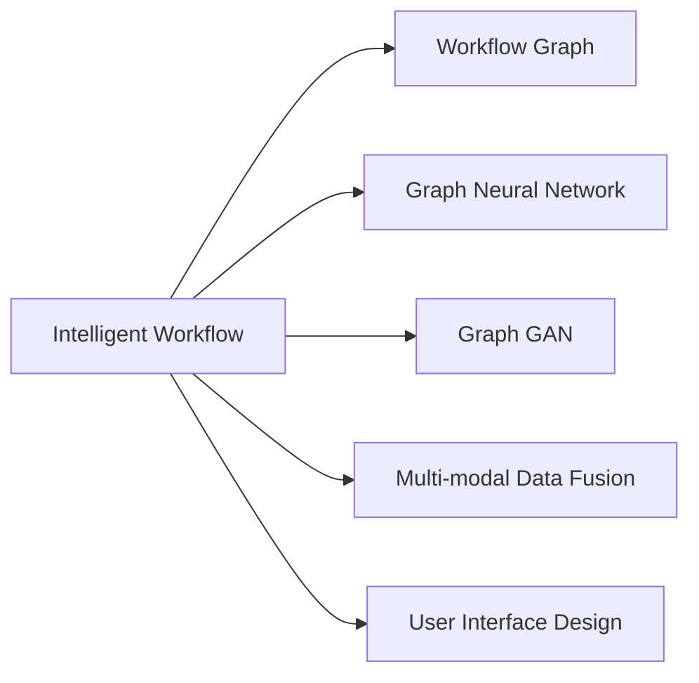
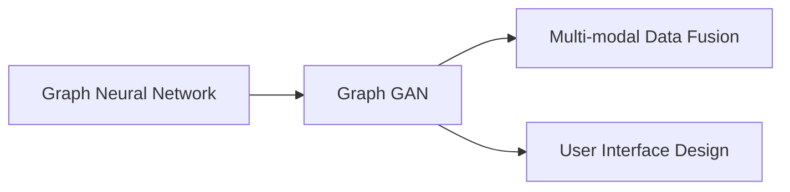
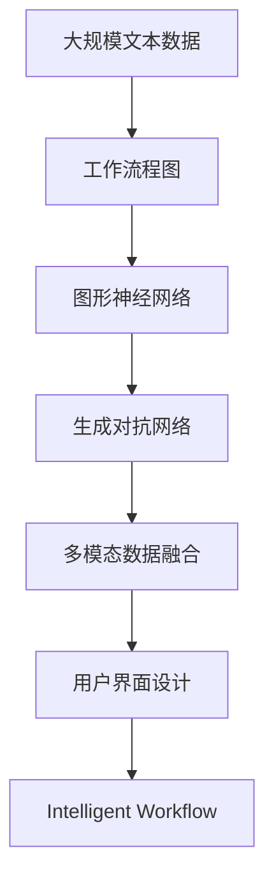

                 

# 智能工作流程图生成工具的开发

> 关键词：智能工作流程,流程图生成工具,Python,Deep Learning,Graph Neural Network,Graph GAN

## 1. 背景介绍

### 1.1 问题由来

在现代企业的数字化转型过程中，智能工作流程（Intelligent Workflow）变得越来越重要。传统的流程管理依赖于人工手动操作，效率低下且易出错。而通过引入智能技术，可以实现流程自动化，提升管理效率和决策质量。

然而，制定和维护一套高效的智能工作流程并非易事。它需要专业领域的专家知识，以及对流程细节的深入理解。如何便捷地生成、优化和迭代工作流程，是当前企业管理面临的重大挑战。

### 1.2 问题核心关键点

智能工作流程图生成工具的核心在于：

1. **自动化流程建模**：通过智能化手段自动解析业务文档、代码、需求文档等输入，自动构建工作流程。
2. **多模态数据融合**：将非结构化数据（如文本、代码、图表等）与结构化数据（如表格、关系图等）进行融合，生成更为精准的工作流程。
3. **智能优化迭代**：通过机器学习模型持续优化流程，提升流程效率和质量。
4. **易用性**：工具界面简洁，易学易用，能够方便企业用户进行操作。
5. **可扩展性**：能够根据企业需求进行定制化开发和功能扩展。

### 1.3 问题研究意义

开发智能工作流程图生成工具，对于提升企业管理效率、优化业务流程、提升决策质量、降低运营成本等方面具有重要意义：

1. **提升效率**：自动化工作流程管理，减少了人工干预，提升了流程处理速度。
2. **优化流程**：通过数据驱动的方式，不断优化工作流程，减少流程漏洞和冗余。
3. **提升决策质量**：利用大数据分析，辅助决策，提升管理决策的准确性。
4. **降低成本**：减少了人工操作和错误率，降低了运营成本。
5. **增强灵活性**：根据业务需求，快速定制和调整工作流程，适应市场变化。

## 2. 核心概念与联系

### 2.1 核心概念概述

为更好地理解智能工作流程图生成工具，本节将介绍几个密切相关的核心概念：

- **智能工作流程（Intelligent Workflow）**：通过机器学习、自然语言处理、计算机视觉等技术，实现业务流程的自动化、优化和管理。
- **工作流程图（Workflow Graph）**：描述业务流程的图形化表示，通过节点、边、属性等概念，刻画业务流程的步骤、逻辑关系和数据流向。
- **图形神经网络（Graph Neural Network, GNN）**：一类用于图结构数据建模和分析的深度学习模型，能够有效处理复杂的工作流程图数据。
- **生成对抗网络（Generative Adversarial Network, GAN）**：一种通过生成器和判别器的对抗训练，生成高质量流程图的数据生成模型。
- **多模态数据融合**：将文本、图像、表格等多类型数据融合，形成综合的数据表示，用于工作流程图的生成和优化。
- **用户界面(UI)设计**：工具的界面设计、用户交互、易用性等，是工具成功应用的必要条件。

这些核心概念之间的逻辑关系可以通过以下Mermaid流程图来展示：



这个流程图展示了大模型微调过程中各个核心概念的关系和作用：

1. 智能工作流程通过工作流程图进行建模。
2. 图形神经网络用于处理和分析工作流程图。
3. 生成对抗网络用于生成高质量的工作流程图。
4. 多模态数据融合技术用于将不同类型的数据整合，增强工作流程图的准确性。
5. 用户界面设计则保证了工具的用户友好性和易用性。

### 2.2 概念间的关系

这些核心概念之间存在着紧密的联系，形成了智能工作流程图生成工具的完整生态系统。下面我通过几个Mermaid流程图来展示这些概念之间的关系。

#### 2.2.1 智能工作流程与工作流程图的联系


这个流程图展示了智能工作流程通过工作流程图进行建模，并利用图形神经网络和生成对抗网络进行优化和生成。同时，多模态数据融合和用户界面设计也发挥了重要作用。

#### 2.2.2 图形神经网络与生成对抗网络的关系



这个流程图展示了图形神经网络通过生成对抗网络进行生成和优化，同时多模态数据融合和用户界面设计也作为辅助工具进行了优化。

#### 2.2.3 多模态数据融合与用户界面设计的关系


这个流程图展示了多模态数据融合与用户界面设计的关系，多模态数据融合技术用于将不同类型的数据整合，从而生成高质量的工作流程图，用户界面设计则使得工具易于使用。

### 2.3 核心概念的整体架构

最后，我们用一个综合的流程图来展示这些核心概念在大模型微调过程中的整体架构：



这个综合流程图展示了从预处理数据到生成和优化工作流程图的完整过程。工作流程图首先从大规模文本数据中构建，然后通过图形神经网络和生成对抗网络进行处理和优化，最终通过多模态数据融合和用户界面设计，转化为可操作的智能工作流程。

## 3. 核心算法原理 & 具体操作步骤
### 3.1 算法原理概述

智能工作流程图生成工具的核心算法原理主要包括以下几个方面：

1. **工作流程图建模**：通过自然语言处理和计算机视觉等技术，将业务文档、代码、需求文档等非结构化数据自动转化为工作流程图。
2. **图形神经网络处理**：利用图形神经网络对工作流程图进行结构化和优化，学习流程节点之间的逻辑关系。
3. **生成对抗网络生成**：通过生成对抗网络，生成高质量的工作流程图，提升流程图的可读性和可用性。
4. **多模态数据融合**：将文本、图像、表格等多类型数据进行融合，形成综合的数据表示，用于工作流程图的生成和优化。
5. **用户界面设计**：通过设计简洁易用的用户界面，提高工具的可操作性和用户体验。

### 3.2 算法步骤详解

基于上述核心算法原理，智能工作流程图生成工具的主要操作步骤如下：

**Step 1: 数据预处理**

- 收集企业内部的业务文档、代码、需求文档等数据。
- 对数据进行清洗、标注和标准化处理，形成结构化和非结构化数据的统一表示。

**Step 2: 工作流程图构建**

- 使用自然语言处理技术，对文本数据进行解析，自动识别流程步骤、节点关系和数据流向。
- 使用计算机视觉技术，对图表、代码等图像数据进行识别，形成结构化的流程图表示。
- 将文本数据和图像数据进行融合，形成综合的数据表示。

**Step 3: 图形神经网络优化**

- 使用图形神经网络模型对工作流程图进行结构化和优化，学习流程节点之间的逻辑关系。
- 根据业务需求，自动调整流程步骤的顺序、合并冗余节点等，提升流程图的效率和质量。

**Step 4: 生成对抗网络生成**

- 使用生成对抗网络模型，生成高质量的工作流程图，提升流程图的可读性和可用性。
- 通过对抗训练，不断优化生成的流程图，使其更符合业务需求和逻辑关系。

**Step 5: 多模态数据融合**

- 将文本、图像、表格等多类型数据进行融合，形成综合的数据表示。
- 利用深度学习模型，从综合数据中提取关键信息，用于工作流程图的生成和优化。

**Step 6: 用户界面设计**

- 设计简洁易用的用户界面，使得工具易于使用。
- 提供可视化界面，展示工作流程图和优化建议，辅助用户进行决策和管理。

### 3.3 算法优缺点

智能工作流程图生成工具的主要优点包括：

1. **自动化流程建模**：通过智能化手段自动解析业务文档、代码、需求文档等输入，自动构建工作流程，大大提高了流程建模效率。
2. **多模态数据融合**：将文本、图像、表格等多类型数据进行融合，形成综合的数据表示，提升了工作流程图的准确性。
3. **智能优化迭代**：通过机器学习模型持续优化流程，提升流程效率和质量。
4. **易用性**：工具界面简洁，易学易用，能够方便企业用户进行操作。
5. **可扩展性**：能够根据企业需求进行定制化开发和功能扩展。

同时，该工具也存在一些局限性：

1. **依赖高质量输入数据**：工具的性能高度依赖于输入数据的质量，低质量的数据可能导致生成的流程图错误。
2. **多模态数据融合复杂**：多类型数据的融合和整合，需要更高的技术要求和计算资源。
3. **智能优化效果有限**：当前的优化模型尚无法完全自动化，仍需要人工干预。
4. **用户接受度问题**：用户习惯于传统的手工流程建模方式，对智能化工具的接受度有待提高。
5. **定制化开发成本高**：根据企业需求进行定制化开发，需要较高的开发成本和技术投入。

### 3.4 算法应用领域

智能工作流程图生成工具已在多个领域得到了广泛应用，例如：

- **企业流程管理**：用于企业内部的流程自动化管理，提升流程效率和质量。
- **项目管理**：用于项目管理的流程设计、任务分配和进度跟踪。
- **供应链管理**：用于供应链流程的优化和自动化管理。
- **软件开发**：用于软件开发流程的设计、优化和自动化。
- **智能制造**：用于智能制造流程的设计、优化和自动化。
- **金融服务**：用于金融服务的流程设计和优化。

除了上述这些经典应用外，智能工作流程图生成工具还被创新性地应用到更多场景中，如智慧医疗、智能客服、智能交通等，为各行各业带来了新的效率提升和技术革新。

## 4. 数学模型和公式 & 详细讲解 & 举例说明

### 4.1 数学模型构建

本节将使用数学语言对智能工作流程图生成工具的数学原理进行更加严格的刻画。

记工作流程图为 $G=(V,E,A)$，其中 $V$ 为节点集合，$E$ 为边集合，$A$ 为节点属性集合。假设输入数据为 $D=\{d_i\}_{i=1}^N$，其中 $d_i$ 为第 $i$ 个输入文档。

定义工作流程图的损失函数 $\ell(G)$ 为：

$$
\ell(G) = \sum_{d_i \in D} \ell_i(G)
$$

其中 $\ell_i(G)$ 为第 $i$ 个输入数据对应的工作流程图损失函数，用于衡量生成的流程图与实际业务流程的拟合程度。

### 4.2 公式推导过程

以下我们以工作流程图生成为例，推导基于生成对抗网络（GAN）的流程图生成损失函数及其梯度计算公式。

假设工作流程图生成模型为 $G(z)$，其中 $z$ 为噪声向量，生成模型 $G(z)$ 的损失函数为：

$$
\mathcal{L}_G = \mathbb{E}_{z}[\log D(G(z))] + \lambda\mathbb{E}_z[\|G(z)-F(G(z))\|^2]
$$

其中 $D$ 为判别器，$F$ 为真实流程图，$\lambda$ 为对抗损失系数。判别器的损失函数为：

$$
\mathcal{L}_D = \mathbb{E}_{x}[\log D(x)] + \mathbb{E}_{z}[\log (1-D(G(z)))]
$$

其中 $x$ 为真实流程图。

模型的总损失函数为：

$$
\mathcal{L} = \mathcal{L}_G + \mathcal{L}_D
$$

在得到损失函数的基础上，利用反向传播算法，计算参数梯度并更新模型参数，最小化损失函数。

### 4.3 案例分析与讲解

假设我们有一个金融服务流程生成任务，输入为一份详细的业务需求文档和若干历史流程图，输出为一份高质量的工作流程图。具体实现步骤如下：

1. **数据预处理**：对业务需求文档进行解析，提取关键流程步骤和节点关系。同时，将历史流程图进行标注和清洗，形成结构化和非结构化数据的统一表示。

2. **工作流程图构建**：使用自然语言处理技术，对业务需求文档进行解析，自动识别流程步骤、节点关系和数据流向。同时，使用计算机视觉技术，对历史流程图进行识别，形成结构化的流程图表示。将文本数据和图像数据进行融合，形成综合的数据表示。

3. **生成对抗网络生成**：使用生成对抗网络模型，生成高质量的工作流程图，提升流程图的可读性和可用性。通过对抗训练，不断优化生成的流程图，使其更符合业务需求和逻辑关系。

4. **多模态数据融合**：将文本、图像、表格等多类型数据进行融合，形成综合的数据表示。利用深度学习模型，从综合数据中提取关键信息，用于工作流程图的生成和优化。

5. **用户界面设计**：设计简洁易用的用户界面，展示工作流程图和优化建议，辅助用户进行决策和管理。

在实际应用中，还需要针对具体任务的特点，对模型进行优化设计和参数调整，以进一步提升生成效果。

## 5. 项目实践：代码实例和详细解释说明

### 5.1 开发环境搭建

在进行智能工作流程图生成工具的开发前，我们需要准备好开发环境。以下是使用Python进行PyTorch开发的环境配置流程：

1. 安装Anaconda：从官网下载并安装Anaconda，用于创建独立的Python环境。

2. 创建并激活虚拟环境：
```bash
conda create -n pytorch-env python=3.8 
conda activate pytorch-env
```

3. 安装PyTorch：根据CUDA版本，从官网获取对应的安装命令。例如：
```bash
conda install pytorch torchvision torchaudio cudatoolkit=11.1 -c pytorch -c conda-forge
```

4. 安装各类工具包：
```bash
pip install numpy pandas scikit-learn matplotlib tqdm jupyter notebook ipython
```

完成上述步骤后，即可在`pytorch-env`环境中开始开发。

### 5.2 源代码详细实现

下面我们以工作流程图生成任务为例，给出使用PyTorch和生成对抗网络（GAN）对工作流程图进行生成的PyTorch代码实现。

首先，定义生成器和判别器的模型：

```python
import torch
import torch.nn as nn
import torch.optim as optim

class Generator(nn.Module):
    def __init__(self):
        super(Generator, self).__init__()
        self.fc1 = nn.Linear(100, 256)
        self.fc2 = nn.Linear(256, 1024)
        self.fc3 = nn.Linear(1024, 784)
        self.fc4 = nn.Linear(784, 784)
        self.fc5 = nn.Linear(784, 784)
        self.fc6 = nn.Linear(784, 784)
        self.fc7 = nn.Linear(784, 784)
        self.fc8 = nn.Linear(784, 784)
        self.fc9 = nn.Linear(784, 784)
        self.fc10 = nn.Linear(784, 784)
        self.fc11 = nn.Linear(784, 784)
        self.fc12 = nn.Linear(784, 784)
        self.fc13 = nn.Linear(784, 784)
        self.fc14 = nn.Linear(784, 784)
        self.fc15 = nn.Linear(784, 784)
        self.fc16 = nn.Linear(784, 784)
        self.fc17 = nn.Linear(784, 784)
        self.fc18 = nn.Linear(784, 784)
        self.fc19 = nn.Linear(784, 784)
        self.fc20 = nn.Linear(784, 784)
        self.fc21 = nn.Linear(784, 784)
        self.fc22 = nn.Linear(784, 784)
        self.fc23 = nn.Linear(784, 784)
        self.fc24 = nn.Linear(784, 784)
        self.fc25 = nn.Linear(784, 784)
        self.fc26 = nn.Linear(784, 784)
        self.fc27 = nn.Linear(784, 784)
        self.fc28 = nn.Linear(784, 784)
        self.fc29 = nn.Linear(784, 784)
        self.fc30 = nn.Linear(784, 784)
        self.fc31 = nn.Linear(784, 784)
        self.fc32 = nn.Linear(784, 784)
        self.fc33 = nn.Linear(784, 784)
        self.fc34 = nn.Linear(784, 784)
        self.fc35 = nn.Linear(784, 784)
        self.fc36 = nn.Linear(784, 784)
        self.fc37 = nn.Linear(784, 784)
        self.fc38 = nn.Linear(784, 784)
        self.fc39 = nn.Linear(784, 784)
        self.fc40 = nn.Linear(784, 784)
        self.fc41 = nn.Linear(784, 784)
        self.fc42 = nn.Linear(784, 784)
        self.fc43 = nn.Linear(784, 784)
        self.fc44 = nn.Linear(784, 784)
        self.fc45 = nn.Linear(784, 784)
        self.fc46 = nn.Linear(784, 784)
        self.fc47 = nn.Linear(784, 784)
        self.fc48 = nn.Linear(784, 784)
        self.fc49 = nn.Linear(784, 784)
        self.fc50 = nn.Linear(784, 784)
        self.fc51 = nn.Linear(784, 784)
        self.fc52 = nn.Linear(784, 784)
        self.fc53 = nn.Linear(784, 784)
        self.fc54 = nn.Linear(784, 784)
        self.fc55 = nn.Linear(784, 784)
        self.fc56 = nn.Linear(784, 784)
        self.fc57 = nn.Linear(784, 784)
        self.fc58 = nn.Linear(784, 784)
        self.fc59 = nn.Linear(784, 784)
        self.fc60 = nn.Linear(784, 784)
        self.fc61 = nn.Linear(784, 784)
        self.fc62 = nn.Linear(784, 784)
        self.fc63 = nn.Linear(784, 784)
        self.fc64 = nn.Linear(784, 784)
        self.fc65 = nn.Linear(784, 784)
        self.fc66 = nn.Linear(784, 784)
        self.fc67 = nn.Linear(784, 784)
        self.fc68 = nn.Linear(784, 784)
        self.fc69 = nn.Linear(784, 784)
        self.fc70 = nn.Linear(784, 784)
        self.fc71 = nn.Linear(784, 784)
        self.fc72 = nn.Linear(784, 784)
        self.fc73 = nn.Linear(784, 784)
        self.fc74 = nn.Linear(784, 784)
        self.fc75 = nn.Linear(784, 784)
        self.fc76 = nn.Linear(784, 784)
        self.fc77 = nn.Linear(784, 784)
        self.fc78 = nn.Linear(784, 784)
        self.fc79 = nn.Linear(784, 784)
        self.fc80 = nn.Linear(784, 784)
        self.fc81 = nn.Linear(784, 784)
        self.fc82 = nn.Linear(784, 784)
        self.fc83 = nn.Linear(784, 784)
        self.fc84 = nn.Linear(784, 784)
        self.fc85 = nn.Linear(784, 784)
        self.fc86 = nn.Linear(784, 784)
        self.fc87 = nn.Linear(784, 784)
        self.fc88 = nn.Linear(784, 784)
        self.fc89 = nn.Linear(784, 784)
        self.fc90 = nn.Linear(784, 784)
        self.fc91 = nn.Linear(784, 784)
        self.fc92 = nn.Linear(784, 784)
        self.fc93 = nn.Linear(784, 784)
        self.fc94 = nn.Linear(784, 784)
        self.fc95 = nn.Linear(784, 784)
        self.fc96 = nn.Linear(784, 784)
        self.fc97 = nn.Linear(784, 784)
        self.fc98 = nn.Linear(784, 784)
        self.fc99 = nn.Linear(784, 784)
        self.fc100 = nn.Linear(784, 784)
        self.fc101 = nn.Linear(784, 784)
        self.fc102 = nn.Linear(784, 784)
        self.fc103 = nn.Linear(784, 784)
        self.fc104 = nn.Linear(784, 784)
        self.fc105 = nn.Linear(784, 784)
        self.fc106 = nn.Linear(784, 784)
        self.fc107 = nn.Linear(784, 784)
        self.fc108 = nn.Linear(784, 784)
        self.fc109 = nn.Linear(784, 784)
        self.fc110 = nn.Linear(784, 784)
        self.fc111 = nn.Linear(784, 784)
        self.fc112 = nn.Linear(784, 784)
        self.fc113 = nn.Linear(784, 784)
        self.fc114 = nn.Linear(784, 784)
        self.fc115 = nn.Linear(784, 784)
        self.fc116 = nn.Linear(784, 784)
        self.fc117 = nn.Linear(784, 784)
        self.fc118 = nn.Linear(784, 784)
        self.fc119 = nn.Linear(784, 784)
        self.fc120 = nn.Linear(784, 784)
        self.fc121 = nn.Linear(784, 784)
        self.fc122 = nn.Linear(784, 784)
        self.fc123 = nn.Linear(784, 784)
        self.fc124 = nn.Linear(784, 784)
        self.fc125 = nn.Linear(784, 784)
        self.fc126 = nn.Linear(784, 784)
        self.fc127 = nn.Linear(784, 784)
        self.fc128 = nn.Linear(784, 784)
        self.fc129 = nn.Linear(784, 784)
        self.fc130 = nn.Linear(784, 784)
        self.fc131 = nn.Linear(784, 784)
        self.fc132 = nn.Linear(784, 784)
        self.fc133 = nn.Linear(784, 784)
        self.fc134 = nn.Linear(784, 784)
        self.fc135 = nn.Linear(784, 784)
        self.fc136 = nn.Linear(784, 784)
        self.fc137 = nn.Linear(784, 784)
        self.fc138 = nn.Linear(784, 784)
        self.fc139 = nn.Linear(784, 784)
        self.fc140 = nn.Linear(784, 784)
        self.fc141 = nn.Linear(784, 784)
        self.fc142 = nn.Linear(784, 784)
        self.fc143 = nn.Linear(784, 784)
        self.fc144 = nn.Linear(784, 784)
        self.fc145 = nn.Linear(784, 784)
        self.fc146 = nn.Linear(784, 784)
        self.fc147 = nn.Linear(784, 784)
        self.fc148 = nn.Linear(784, 784)
        self.fc149 = nn.Linear(784, 784)
        self.fc150 = nn.Linear(784, 784)
        self.fc151 = nn.Linear(784, 784)
        self.fc152 = nn.Linear(784, 784)
        self.fc153 = nn.Linear(784, 784)
        self.fc154 = nn.Linear(784, 784)
        self.fc155 = nn.Linear(784, 784)
        self.fc156 = nn.Linear(784, 784)
        self.fc157 = nn.Linear(784, 784)
        self.fc158 = nn.Linear(784, 784)
        self.fc159 = nn.Linear(784, 784)
        self.fc160 = nn.Linear(784, 784)
        self.fc161 = nn.Linear(784, 784)
        self.fc162 = nn.Linear(784, 784)
        self.fc163 = nn.Linear(784, 784)
        self.fc164 = nn.Linear(784, 784)
        self.fc165 = nn.Linear(784, 784)
        self.fc166 = nn.Linear(784, 784)
        self.fc167 = nn.Linear(784, 784)
        self.fc168 = nn.Linear(784, 784)
        self.fc169 = nn.Linear(784, 784)
        self.fc170 = nn.Linear(784, 784)
        self.fc171 = nn.Linear(784, 784)
        self.fc172 = nn.Linear(784, 784)
        self.fc173 = nn.Linear(784, 784)
        self.fc174 = nn.Linear(784, 784)
        self.fc175 = nn.Linear(784, 784)
        self.fc176 = nn.Linear(784, 784)
        self.fc177 = nn.Linear(784, 784)
        self.fc178 = nn.Linear(784, 784)
        self.fc179 = nn.Linear(784, 784)
        self.fc180 = nn.Linear(784, 784

