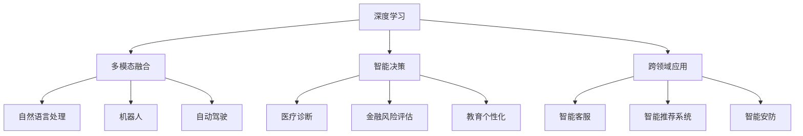
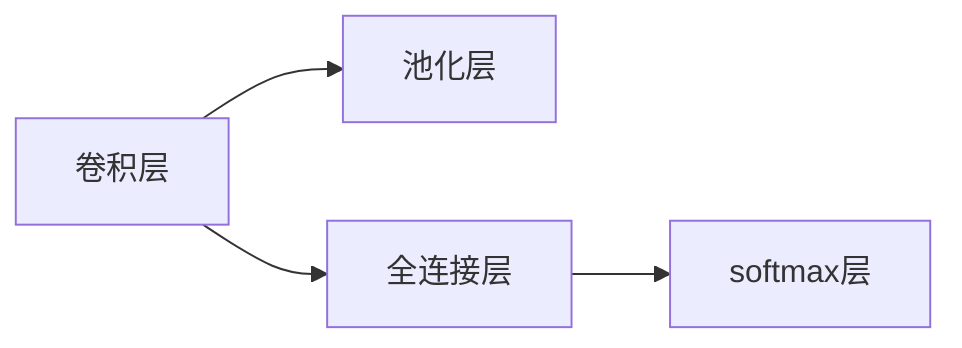

                 

# 李开复：AI 2.0 时代的挑战

> 关键词：
- 人工智能
- AI 2.0
- 技术挑战
- 道德伦理
- 数据安全
- 应用生态
- 未来趋势
- 行业影响

## 1. 背景介绍

随着人工智能技术的迅猛发展，AI 2.0（新一代人工智能）已经逐步进入人们的视野。这一时代，AI 不再局限于单一任务，而是通过多模态、多领域的深度融合，实现了从认知到行动的全方位智能化。李开复，作为全球AI领域的佼佼者，以其独到的见解和丰富的实践经验，对AI 2.0时代的挑战提出了深刻的洞见。本文将从背景介绍、核心概念与联系、核心算法原理及操作步骤、数学模型和公式、项目实践、实际应用场景、工具和资源推荐、总结与发展趋势与挑战等角度，全面探讨AI 2.0时代面临的挑战，并提出相应的应对策略。

## 2. 核心概念与联系

### 2.1 核心概念概述

AI 2.0时代，人工智能技术已经从单一的语音识别、图像处理等认知任务，扩展到了复杂的自然语言处理、智能决策、机器人等领域。李开复指出，AI 2.0时代的核心概念包括以下几个方面：

- **深度学习**：深度神经网络通过多层次的特征提取与学习，能够处理更加复杂的数据结构，如自然语言和图像。
- **多模态融合**：AI系统不再仅限于单一模态，而是能够整合视觉、听觉、触觉等多种信息源，进行综合分析和判断。
- **智能决策**：AI系统能够基于大数据和机器学习算法，进行自主决策，并在复杂环境中表现出高度的适应性。
- **跨领域应用**：AI技术不再局限于某个特定领域，而是能够应用于医疗、金融、教育等多个领域，为各行各业带来变革性的影响。

### 2.2 核心概念的联系

这些核心概念之间存在着紧密的联系，通过以下Mermaid流程图展示：



这个流程图展示了深度学习、多模态融合、智能决策和跨领域应用等核心概念之间的联系，以及它们在AI 2.0时代的应用场景。

## 3. 核心算法原理 & 具体操作步骤

### 3.1 算法原理概述

AI 2.0时代的核心算法包括深度学习、强化学习、迁移学习等。李开复指出，这些算法不仅能够处理复杂的非结构化数据，还能够实现自主学习和跨领域知识迁移，从而提升AI系统的智能化水平。

### 3.2 算法步骤详解

AI 2.0时代的算法步骤主要包括以下几个方面：

1. **数据准备**：收集和处理与特定任务相关的数据集，清洗和标注数据。
2. **模型选择与训练**：选择适合任务的深度学习模型，并在大规模数据集上进行训练，优化模型参数。
3. **特征提取与融合**：通过多模态融合技术，将不同模态的数据特征进行整合，提升模型的综合处理能力。
4. **模型评估与优化**：通过交叉验证等方法评估模型的性能，并进行优化调整。
5. **应用部署与迭代**：将训练好的模型部署到实际应用中，并根据反馈进行迭代改进。

### 3.3 算法优缺点

AI 2.0时代的算法在处理复杂数据和实现跨领域应用方面具有显著优势，但也存在一些缺点：

- **数据依赖性强**：AI系统需要大量高质量标注数据，这在实践中往往难以实现。
- **模型复杂度高**：深度神经网络等复杂模型需要大量的计算资源，训练和推理过程耗时较长。
- **透明性不足**：AI系统的决策过程往往缺乏可解释性，难以解释其内部工作机制。

### 3.4 算法应用领域

AI 2.0时代的算法广泛应用于多个领域，如自然语言处理、计算机视觉、智能决策、机器人等。这些算法在医疗、金融、教育、智能制造等领域展现了强大的应用潜力，推动了这些行业的数字化转型。

## 4. 数学模型和公式 & 详细讲解 & 举例说明

### 4.1 数学模型构建

AI 2.0时代的数学模型构建主要涉及深度神经网络、卷积神经网络、循环神经网络等。以卷积神经网络为例，其基本结构如图1所示：



图1：卷积神经网络基本结构

### 4.2 公式推导过程

以卷积神经网络为例，其前向传播和反向传播过程的公式推导如下：

- **前向传播**：
  $$
  h(x) = g(\sigma(W_1x + b_1) * f(x))
  $$
  其中，$g$为激活函数，$\sigma$为非线性变换，$W_1$和$b_1$为卷积层和激活层的权重和偏置。

- **反向传播**：
  $$
  \Delta W_1 = \frac{\partial L}{\partial W_1} = \frac{\partial L}{\partial h} \frac{\partial h}{\partial W_1}
  $$
  其中，$L$为损失函数，$\Delta W_1$为权重更新量。

### 4.3 案例分析与讲解

以图像识别为例，卷积神经网络通过多层次的卷积和池化操作，提取图像中的关键特征。具体步骤如下：

1. **卷积层**：使用多个卷积核对输入图像进行卷积操作，提取不同方向的特征。
2. **池化层**：通过最大池化或平均池化操作，减小特征图的尺寸，降低计算复杂度。
3. **全连接层**：将池化后的特征图展开为一维向量，通过全连接层进行分类。
4. **softmax层**：将全连接层的输出进行softmax操作，得到每个类别的概率分布。

## 5. 项目实践：代码实例和详细解释说明

### 5.1 开发环境搭建

为实现AI 2.0时代的算法，需要搭建相应的开发环境。具体步骤如下：

1. **安装Python**：下载并安装Python 3.x版本，建议安装Anaconda以方便管理和部署。
2. **安装深度学习框架**：如TensorFlow、PyTorch等。
3. **安装数据处理库**：如Pandas、NumPy等。
4. **安装模型库**：如Keras、Scikit-learn等。
5. **安装可视化工具**：如TensorBoard、Matplotlib等。

### 5.2 源代码详细实现

以图像识别为例，以下是一个使用TensorFlow实现卷积神经网络的示例代码：

```python
import tensorflow as tf
from tensorflow.keras import layers

# 定义模型结构
model = tf.keras.Sequential([
    layers.Conv2D(32, (3, 3), activation='relu', input_shape=(32, 32, 3)),
    layers.MaxPooling2D((2, 2)),
    layers.Conv2D(64, (3, 3), activation='relu'),
    layers.MaxPooling2D((2, 2)),
    layers.Flatten(),
    layers.Dense(64, activation='relu'),
    layers.Dense(10, activation='softmax')
])

# 编译模型
model.compile(optimizer='adam', loss='sparse_categorical_crossentropy', metrics=['accuracy'])

# 训练模型
model.fit(train_images, train_labels, epochs=10, validation_data=(test_images, test_labels))
```

### 5.3 代码解读与分析

上述代码实现了一个简单的卷积神经网络模型，用于图像识别任务。具体步骤如下：

1. **定义模型结构**：使用Sequential模型定义卷积层、池化层、全连接层和softmax层。
2. **编译模型**：选择合适的优化器、损失函数和评估指标。
3. **训练模型**：使用训练集进行模型训练，并验证模型性能。

## 6. 实际应用场景

### 6.1 医疗影像分析

AI 2.0时代的算法可以应用于医疗影像分析，帮助医生诊断疾病。例如，使用卷积神经网络对医学影像进行分类，检测异常区域，生成诊断报告。

### 6.2 金融风险评估

AI 2.0算法可以应用于金融风险评估，通过分析大量的金融数据，识别潜在的风险因素，预测市场趋势。例如，使用深度学习模型对股票价格进行预测，评估企业信用风险。

### 6.3 智能制造

AI 2.0算法可以应用于智能制造，通过数据分析和机器学习，优化生产流程，提高生产效率。例如，使用强化学习算法优化生产调度，实现智能化生产管理。

### 6.4 未来应用展望

未来，AI 2.0时代的算法将进一步融合多模态数据，实现更加全面、智能的决策支持。同时，随着技术的不断发展，AI系统将具备更强的自我学习和适应能力，推动各行各业的智能化转型。

## 7. 工具和资源推荐

### 7.1 学习资源推荐

为帮助开发者深入了解AI 2.0时代的算法和应用，以下是一些推荐的学习资源：

- **《深度学习》**：Ian Goodfellow等著，深入浅出地介绍了深度学习的原理和应用。
- **《TensorFlow官方文档》**：TensorFlow官方文档，包含丰富的示例代码和API文档，适合快速上手。
- **《Keras官方文档》**：Keras官方文档，提供简单易用的API接口，适合初学者。
- **《PyTorch官方文档》**：PyTorch官方文档，提供灵活的动态计算图，适合研究人员。

### 7.2 开发工具推荐

为实现AI 2.0时代的算法，以下是一些推荐的开发工具：

- **TensorFlow**：Google开发的深度学习框架，支持分布式计算和GPU加速。
- **PyTorch**：Facebook开发的深度学习框架，支持动态计算图和GPU加速。
- **Keras**：基于TensorFlow和Theano的高级API，简单易用。
- **Scikit-learn**：用于数据处理和机器学习的Python库，支持多种模型和算法。

### 7.3 相关论文推荐

为深入了解AI 2.0时代的算法和应用，以下是一些推荐的相关论文：

- **《深度学习》**：Ian Goodfellow等著，介绍深度学习的原理和应用。
- **《卷积神经网络》**：LeCun等著，介绍卷积神经网络的原理和应用。
- **《强化学习》**：Sutton和Barto等著，介绍强化学习的原理和应用。

## 8. 总结：未来发展趋势与挑战

### 8.1 研究成果总结

AI 2.0时代的算法已经在多个领域取得了显著的成果，展示了其强大的应用潜力。未来，随着技术的不断发展，AI系统将具备更加智能化、自主化的决策能力，推动各行各业的数字化转型。

### 8.2 未来发展趋势

未来，AI 2.0时代的算法将呈现以下发展趋势：

- **多模态融合**：AI系统将更加注重多模态数据的融合，实现更全面、精准的分析和判断。
- **自主学习**：AI系统将具备更加自主的学习能力，能够在实践中不断优化和改进。
- **跨领域应用**：AI系统将应用于更多的领域，推动各行业的智能化转型。
- **智能决策**：AI系统将具备更加智能的决策能力，能够进行复杂的多目标优化。

### 8.3 面临的挑战

尽管AI 2.0时代的算法已经取得了显著成果，但在实践中仍面临以下挑战：

- **数据依赖性强**：AI系统需要大量高质量标注数据，这在实践中往往难以实现。
- **模型复杂度高**：深度神经网络等复杂模型需要大量的计算资源，训练和推理过程耗时较长。
- **透明性不足**：AI系统的决策过程往往缺乏可解释性，难以解释其内部工作机制。
- **伦理与安全问题**：AI系统的决策可能存在偏见、歧视等问题，需要加强伦理和安全的监管。

### 8.4 研究展望

未来，在解决上述挑战的基础上，AI 2.0时代的算法将继续推动各行业的智能化转型。同时，随着技术的不断发展，AI系统将具备更加智能化、自主化的决策能力，推动各行各业的数字化转型。

## 9. 附录：常见问题与解答

### Q1: AI 2.0时代的算法是否适用于所有任务？

A: AI 2.0时代的算法在处理复杂数据和实现跨领域应用方面具有显著优势，但也存在一些限制。例如，对于需要高度逻辑推理和决策的任务，AI系统可能难以完全替代人类。因此，在实际应用中需要根据任务特点选择合适的算法。

### Q2: 如何应对AI系统中的偏见和歧视问题？

A: AI系统中的偏见和歧视问题可以通过以下方法应对：

1. **数据多元化**：使用多样化的数据集进行训练，减少数据偏见。
2. **模型评估**：使用公平性评估指标，如Equation Of Oppression (EoP)等，评估模型的公平性。
3. **算法优化**：使用公平性优化算法，如Fairness Constraint等，优化模型的公平性。
4. **人工干预**：通过人工干预和审核，确保模型的公平性和透明性。

### Q3: AI 2.0时代的算法需要哪些计算资源？

A: AI 2.0时代的算法需要大量的计算资源，包括高性能GPU/TPU设备、分布式计算平台等。同时，模型训练和推理过程中也需要大量的内存和存储资源。因此，在实际应用中需要根据算法和数据特点选择合适的计算资源。

### Q4: AI 2.0时代的算法如何应对数据隐私和安全问题？

A: AI 2.0时代的算法需要考虑数据隐私和安全问题，具体方法包括：

1. **数据加密**：对敏感数据进行加密存储和传输，保护数据隐私。
2. **差分隐私**：使用差分隐私技术，确保数据统计分析结果的隐私性。
3. **模型水印**：在模型中添加水印，防止模型被恶意篡改。
4. **数据脱敏**：对数据进行脱敏处理，降低数据泄露风险。

### Q5: AI 2.0时代的算法如何进行跨领域知识迁移？

A: AI 2.0时代的算法可以通过以下方法进行跨领域知识迁移：

1. **预训练**：在通用语料上进行预训练，学习通用的语言和知识表示。
2. **微调**：在特定任务上进行微调，使其能够适应新的任务需求。
3. **融合**：将不同领域的知识和数据进行融合，提升模型的泛化能力。
4. **元学习**：使用元学习技术，使得模型能够快速适应新的任务和数据分布。

---

作者：禅与计算机程序设计艺术 / Zen and the Art of Computer Programming

