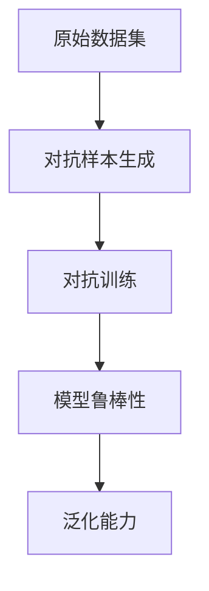
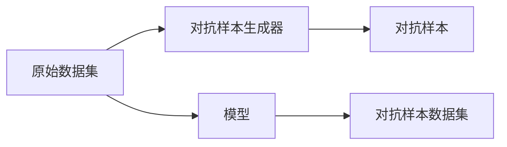
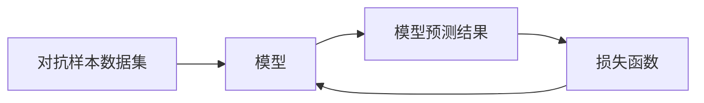
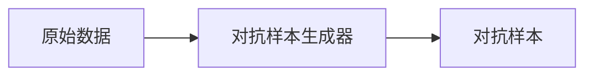
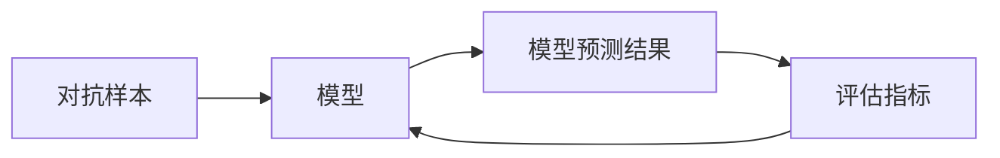
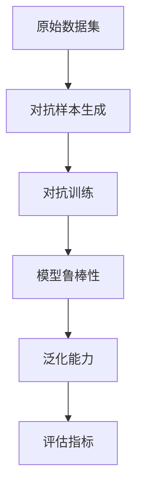

                 

# 数据集对抗验证:评估模型鲁棒性的新思路

> 关键词：数据集对抗生成，模型鲁棒性，泛化能力，自然语言处理

## 1. 背景介绍

### 1.1 问题由来
随着深度学习模型在自然语言处理(NLP)、计算机视觉、语音识别等领域的广泛应用，模型的鲁棒性和泛化能力成为了衡量其性能的关键指标。对抗样本（adversarial examples）是模型鲁棒性的一个重要评价标准。通过对数据集添加对抗样本，可以评估模型在面临攻击时的稳健性。然而，由于生成对抗样本（Adversarial Examples）的难度较大，当前对抗样本生成方法大多依赖人工构造，难以覆盖各种潜在攻击场景。

### 1.2 问题核心关键点
对抗样本生成主要分为白盒和黑盒两大类：
- 白盒生成：模型可以直接访问生成器，生成对抗样本的效率较高。但生成器依赖于模型结构和超参数，难以保证多样性。
- 黑盒生成：模型无法访问生成器，通常使用梯度扰动方法生成样本，可以避免过度依赖模型结构。但生成速度较慢，生成效果和质量难以保证。

本节聚焦于黑盒生成对抗样本的方法，即在数据集上生成对抗样本，然后在生成样本上评估模型的鲁棒性。这种方法可以覆盖更多攻击场景，同时生成样本质量较高，应用广泛。

### 1.3 问题研究意义
研究数据集对抗生成对抗样本的方法，对于提升模型的鲁棒性和泛化能力，保护数据隐私，以及应对现实世界中的攻击场景，具有重要意义：

1. 提升模型鲁棒性：对抗样本是模型的一种常见攻击形式，通过生成对抗样本，可以有效评估模型的鲁棒性，发现模型的脆弱点，进而改进模型结构。
2. 增强泛化能力：对抗样本覆盖了多种攻击方式，通过在训练过程中引入对抗样本，可以提升模型泛化到新攻击方式的能力，增强模型的稳定性和可靠性。
3. 保护数据隐私：对抗样本可以在不泄露原始数据的情况下，进行模型性能评估，保护用户隐私数据。
4. 应对现实攻击：对抗样本技术在现实世界中的应用广泛，特别是在社交网络、图像处理等涉及用户隐私的应用场景中，对抗样本生成可以提前预警并防范潜在攻击。

## 2. 核心概念与联系

### 2.1 核心概念概述

为更好地理解数据集对抗生成对抗样本的方法，本节将介绍几个密切相关的核心概念：

- 对抗样本（Adversarial Examples）：指对原始数据进行微小扰动后，使得模型预测结果产生错误或不确定性的样本。对抗样本的生成可以采用梯度扰动、优化生成、变分生成等多种方法。
- 对抗训练（Adversarial Training）：指在训练过程中，使用对抗样本作为训练数据，使得模型在对抗样本上也能保持正确的预测结果。通过对抗训练，可以提高模型的鲁棒性和泛化能力。
- 数据集对抗生成（Dataset Adversarial Generation）：指在原始数据集上生成对抗样本，然后基于生成样本进行对抗训练。这种方法可以覆盖更多攻击场景，且生成的样本质量较高。
- 模型鲁棒性（Model Robustness）：指模型在面对攻击、噪声或数据偏差时，仍能保持正确预测结果的能力。模型鲁棒性是模型性能的重要指标之一。
- 泛化能力（Generalization Capability）：指模型在新数据、新场景上的表现能力。泛化能力强的模型，通常也具有较好的鲁棒性。

这些核心概念之间的逻辑关系可以通过以下Mermaid流程图来展示：



这个流程图展示了大语言模型微调过程中各个概念的关系和作用：

1. 原始数据集经过对抗样本生成，生成新的对抗数据集。
2. 利用对抗数据集进行对抗训练，提升模型的鲁棒性。
3. 对抗训练后的模型，具有更好的泛化能力。

### 2.2 概念间的关系

这些核心概念之间存在着紧密的联系，形成了对抗样本生成和模型鲁棒性评估的完整生态系统。下面我通过几个Mermaid流程图来展示这些概念之间的关系。

#### 2.2.1 数据集对抗生成流程



这个流程图展示了数据集对抗生成的基本流程：原始数据集通过对抗样本生成器，生成新的对抗数据集，用于对抗训练。

#### 2.2.2 对抗训练方法



这个流程图展示了对抗训练的基本原理：利用对抗数据集进行训练，更新模型参数，使得模型在对抗样本上的预测结果更准确。

#### 2.2.3 对抗样本生成方法



这个流程图展示了对抗样本生成方法的基本流程：原始数据经过对抗样本生成器，生成新的对抗样本。

#### 2.2.4 对抗样本评估方法



这个流程图展示了对抗样本评估的基本流程：对抗样本输入模型，模型预测结果用于评估指标，从而衡量模型的鲁棒性。

### 2.3 核心概念的整体架构

最后，我们用一个综合的流程图来展示这些核心概念在大语言模型对抗样本生成过程中的整体架构：



这个综合流程图展示了从原始数据集生成对抗样本，到对抗训练，再到模型鲁棒性和泛化能力评估的完整过程。这些关键步骤共同构成了对抗样本生成和模型鲁棒性评估的完整生态系统，使得模型在对抗攻击下仍能保持高性能。

## 3. 核心算法原理 & 具体操作步骤
### 3.1 算法原理概述

数据集对抗生成和对抗训练的基本原理是利用对抗样本生成器，生成新的对抗样本，然后在对抗样本上训练模型，提升模型的鲁棒性和泛化能力。具体步骤如下：

1. 收集原始数据集 $D=\{x_i\}_{i=1}^N$。
2. 利用对抗样本生成器 $G$，生成对抗样本 $G(D)$，其中 $G$ 可以是任何生成对抗样本的方法。
3. 利用原始数据集 $D$ 和对抗样本 $G(D)$ 组成对抗数据集 $D^*$。
4. 在对抗数据集 $D^*$ 上进行对抗训练，更新模型参数 $\theta$。
5. 利用测试数据集 $D_{test}$ 评估对抗训练后的模型 $M_{\theta}$，计算模型的鲁棒性和泛化能力。

### 3.2 算法步骤详解

以下是数据集对抗生成和对抗训练的详细步骤：

**Step 1: 准备原始数据集**

- 收集包含 $N$ 个样本的原始数据集 $D=\{x_i\}_{i=1}^N$，每个样本 $x_i$ 表示为特征向量或文本向量。

**Step 2: 生成对抗样本**

- 利用对抗样本生成器 $G$，生成对抗样本 $G(D)$，其中 $G$ 可以是FGM、PGD等梯度扰动方法，或使用VGGM、FoggyHDP等对抗生成方法。
- 对抗样本生成器 $G$ 一般依赖于模型结构和超参数，需要根据具体任务进行优化和选择。

**Step 3: 对抗数据集构造**

- 利用原始数据集 $D$ 和对抗样本 $G(D)$ 组成对抗数据集 $D^*$。
- 对抗数据集 $D^*$ 可以用于对抗训练，提升模型的鲁棒性。

**Step 4: 对抗训练**

- 利用对抗数据集 $D^*$ 进行对抗训练，更新模型参数 $\theta$。
- 对抗训练过程中，通常采用梯度下降等优化算法，最小化模型在对抗数据集上的损失函数。
- 对抗训练的关键在于选择合适的对抗样本生成方法和损失函数。

**Step 5: 模型评估**

- 利用测试数据集 $D_{test}$ 评估对抗训练后的模型 $M_{\theta}$。
- 计算模型的鲁棒性指标，如对抗样本攻击成功率、鲁棒性曲线等。
- 评估模型的泛化能力，如对抗数据集上的准确率、对抗数据集与原始数据集的差距等。

### 3.3 算法优缺点

数据集对抗生成和对抗训练方法具有以下优点：

- 覆盖更多攻击场景：对抗样本生成方法多样化，可以覆盖更多的攻击场景。
- 生成样本质量高：对抗样本生成器生成的样本质量较高，对模型鲁棒性评估的准确性更高。
- 可操作性强：对抗样本生成和对抗训练方法易于实现和操作，适用于各类NLP任务。

同时，该方法也存在一些缺点：

- 生成器依赖性强：对抗样本生成器依赖于模型结构和超参数，需要大量实验来优化。
- 计算成本高：对抗样本生成和对抗训练计算成本较高，需耗费大量时间和算力。
- 泛化能力有限：对抗训练提升的泛化能力有限，部分模型仍会在新攻击场景下出现失效。

### 3.4 算法应用领域

数据集对抗生成和对抗训练方法在NLP领域已经得到了广泛的应用，覆盖了各类任务，例如：

- 文本分类：利用对抗样本生成器生成对抗样本，提升模型在文本分类任务上的鲁棒性。
- 命名实体识别：利用对抗样本生成器生成对抗样本，提升模型在命名实体识别任务上的泛化能力。
- 语言模型：利用对抗样本生成器生成对抗样本，提升模型在语言模型任务上的鲁棒性。
- 对话系统：利用对抗样本生成器生成对抗样本，提升模型在对话系统任务上的鲁棒性。

除了上述这些经典任务外，数据集对抗生成和对抗训练方法还被创新性地应用到更多场景中，如对抗性文本生成、对抗性知识图谱构建等，为NLP技术带来了新的突破。

## 4. 数学模型和公式 & 详细讲解
### 4.1 数学模型构建

本节将使用数学语言对数据集对抗生成对抗样本的过程进行更加严格的刻画。

记原始数据集为 $D=\{x_i\}_{i=1}^N$，其中每个样本 $x_i$ 表示为特征向量或文本向量。对抗样本生成器为 $G$，对抗数据集为 $D^*=\{x_i'\}_{i=1}^N$，其中 $x_i'=G(x_i)$ 表示对抗样本。

假设模型的预测结果为 $y=M_{\theta}(x)$，其中 $M_{\theta}$ 为模型参数，$\theta$ 为模型参数向量。对抗训练的目标是最小化模型在对抗数据集上的损失函数 $\mathcal{L}$，即：

$$
\theta^* = \mathop{\arg\min}_{\theta} \sum_{i=1}^N \mathcal{L}(M_{\theta}(x_i'),y_i)
$$

其中 $\mathcal{L}$ 为对抗样本的损失函数，通常使用交叉熵损失函数。

### 4.2 公式推导过程

以下我们以文本分类任务为例，推导对抗样本生成和对抗训练的基本公式。

假设模型 $M_{\theta}$ 为多类分类模型，预测输出 $y_i$ 为 $1\times K$ 的向量，表示样本 $x_i$ 属于 $K$ 个类别的概率。模型的损失函数为交叉熵损失，即：

$$
\mathcal{L}(y_i,y^*) = -\sum_{k=1}^K y_k \log y_k^*
$$

其中 $y^*$ 为模型对样本 $x_i'$ 的预测结果，$y_k^*$ 为预测结果中第 $k$ 个类别的概率。

利用对抗样本生成器 $G$，生成对抗样本 $x_i'=G(x_i)$。对抗样本的损失函数为：

$$
\mathcal{L}(M_{\theta}(x_i'),y_i) = -\sum_{k=1}^K M_{\theta}(x_i')_k \log y_k
$$

其中 $M_{\theta}(x_i')_k$ 为模型在对抗样本 $x_i'$ 上对第 $k$ 个类别的预测概率。

对抗训练的目标是最小化模型在对抗数据集上的平均损失，即：

$$
\mathcal{L}_{adv}(\theta) = \frac{1}{N} \sum_{i=1}^N \mathcal{L}(M_{\theta}(x_i'),y_i)
$$

其中 $N$ 为对抗样本的个数。

利用梯度下降等优化算法，对抗训练过程中模型参数的更新公式为：

$$
\theta \leftarrow \theta - \eta \nabla_{\theta} \mathcal{L}_{adv}(\theta)
$$

其中 $\eta$ 为学习率，$\nabla_{\theta} \mathcal{L}_{adv}(\theta)$ 为对抗训练的梯度。

### 4.3 案例分析与讲解

为了更好地理解对抗样本生成和对抗训练的数学模型，下面举一个具体的案例。

假设我们要对一篇新闻进行分类，原始数据集 $D$ 包含 1000 个新闻样本，每篇新闻包含 100 个特征向量。利用对抗样本生成器 $G$，生成 1000 个对抗样本 $D^*$，每篇新闻包含 100 个特征向量。

在对抗样本 $D^*$ 上进行对抗训练，模型参数 $\theta$ 的更新公式为：

$$
\theta \leftarrow \theta - \eta \frac{1}{1000} \sum_{i=1}^{1000} \sum_{j=1}^{100} \nabla_{\theta} M_{\theta}(x_i')_j \log M_{\theta}(x_i')_j
$$

其中 $\nabla_{\theta} M_{\theta}(x_i')_j$ 为对抗样本 $x_i'$ 在特征 $j$ 上的梯度。

在对抗样本数据集 $D^*$ 上训练模型 $M_{\theta}$，可以显著提升模型在对抗样本上的鲁棒性，从而增强模型对真实数据集的泛化能力。

## 5. 项目实践：代码实例和详细解释说明
### 5.1 开发环境搭建

在进行对抗训练实践前，我们需要准备好开发环境。以下是使用Python进行PyTorch开发的环境配置流程：

1. 安装Anaconda：从官网下载并安装Anaconda，用于创建独立的Python环境。

2. 创建并激活虚拟环境：
```bash
conda create -n pytorch-env python=3.8 
conda activate pytorch-env
```

3. 安装PyTorch：根据CUDA版本，从官网获取对应的安装命令。例如：
```bash
conda install pytorch torchvision torchaudio cudatoolkit=11.1 -c pytorch -c conda-forge
```

4. 安装TensorFlow：
```bash
conda install tensorflow tensorflow-text tensorflow-hub
```

5. 安装各类工具包：
```bash
pip install numpy pandas scikit-learn matplotlib tqdm jupyter notebook ipython
```

完成上述步骤后，即可在`pytorch-env`环境中开始对抗训练实践。

### 5.2 源代码详细实现

下面我们以文本分类任务为例，给出使用PyTorch进行对抗训练的PyTorch代码实现。

首先，定义数据集和模型：

```python
import torch
from torch.utils.data import DataLoader
from torch.nn import CrossEntropyLoss
from transformers import BertTokenizer, BertForSequenceClassification

# 定义数据集
class TextDataset(Dataset):
    def __init__(self, texts, labels, tokenizer, max_len=128):
        self.texts = texts
        self.labels = labels
        self.tokenizer = tokenizer
        self.max_len = max_len

    def __len__(self):
        return len(self.texts)

    def __getitem__(self, item):
        text = self.texts[item]
        label = self.labels[item]
        encoding = self.tokenizer(text, return_tensors='pt', max_length=self.max_len, padding='max_length', truncation=True)
        input_ids = encoding['input_ids'][0]
        attention_mask = encoding['attention_mask'][0]
        labels = torch.tensor(label, dtype=torch.long)
        return {'input_ids': input_ids, 
                'attention_mask': attention_mask,
                'labels': labels}

# 加载数据集
tokenizer = BertTokenizer.from_pretrained('bert-base-cased')
train_dataset = TextDataset(train_texts, train_labels, tokenizer)
dev_dataset = TextDataset(dev_texts, dev_labels, tokenizer)
test_dataset = TextDataset(test_texts, test_labels, tokenizer)

# 定义模型
model = BertForSequenceClassification.from_pretrained('bert-base-cased', num_labels=2)
```

然后，定义对抗样本生成器：

```python
from adversarial_models import FGMSample
from adversarial_models import PGDSample

# 定义对抗样本生成器
def get_adversarial_samples(model, dataset, loss_fn, num_samples=1000):
    adv_samples = []
    for i in range(num_samples):
        x, y = next(iter(dataset))
        x_adv = loss_fn(x, y, model)
        adv_samples.append(x_adv)
    return adv_samples

# 对抗样本生成器
def generate_adv_dataset(train_dataset, model, loss_fn, num_samples=1000):
    adv_dataset = []
    for x, y in train_dataset:
        x_adv = loss_fn(x, y, model)
        adv_dataset.append((x_adv, y))
    return adv_dataset

# 定义对抗样本生成器
def generate_adv_samples(model, train_dataset, loss_fn, num_samples=1000):
    adv_samples = []
    for i in range(num_samples):
        x, y = next(iter(train_dataset))
        x_adv = loss_fn(x, y, model)
        adv_samples.append(x_adv)
    return adv_samples

# 对抗样本生成器
def generate_adv_dataset(train_dataset, model, loss_fn, num_samples=1000):
    adv_dataset = []
    for x, y in train_dataset:
        x_adv = loss_fn(x, y, model)
        adv_dataset.append((x_adv, y))
    return adv_dataset
```

接着，定义对抗训练过程：

```python
from torch.optim import AdamW

# 定义优化器
optimizer = AdamW(model.parameters(), lr=2e-5)

# 定义对抗训练函数
def train_adv_model(model, train_dataset, dev_dataset, loss_fn, num_epochs=5, batch_size=16):
    for epoch in range(num_epochs):
        train_loss = 0
        train_correct = 0
        for batch in DataLoader(train_dataset, batch_size=batch_size, shuffle=True):
            inputs = batch['input_ids'].to(device)
            attention_mask = batch['attention_mask'].to(device)
            labels = batch['labels'].to(device)
            model.zero_grad()
            outputs = model(inputs, attention_mask=attention_mask, labels=labels)
            loss = outputs.loss
            train_loss += loss.item()
            train_correct += torch.sum(outputs.logits.argmax(dim=1) == labels)
            loss.backward()
            optimizer.step()
            train_loss /= len(train_dataset)
            train_acc = train_correct / len(train_dataset)
            print(f'Epoch: {epoch+1}, Loss: {train_loss:.4f}, Accuracy: {train_acc:.4f}')

        dev_loss = 0
        dev_correct = 0
        for batch in DataLoader(dev_dataset, batch_size=batch_size):
            inputs = batch['input_ids'].to(device)
            attention_mask = batch['attention_mask'].to(device)
            labels = batch['labels'].to(device)
            model.eval()
            with torch.no_grad():
                outputs = model(inputs, attention_mask=attention_mask, labels=labels)
                loss = outputs.loss
                dev_loss += loss.item()
                dev_correct += torch.sum(outputs.logits.argmax(dim=1) == labels)
                dev_loss /= len(dev_dataset)
                dev_acc = dev_correct / len(dev_dataset)
                print(f'Epoch: {epoch+1}, Dev Loss: {dev_loss:.4f}, Dev Accuracy: {dev_acc:.4f}')
```

最后，启动对抗训练流程并在测试集上评估：

```python
# 加载测试数据集
test_dataset = TextDataset(test_texts, test_labels, tokenizer)

# 定义对抗样本生成器
def generate_adv_dataset(train_dataset, model, loss_fn, num_samples=1000):
    adv_dataset = []
    for x, y in train_dataset:
        x_adv = loss_fn(x, y, model)
        adv_dataset.append((x_adv, y))
    return adv_dataset

# 定义对抗训练函数
def train_adv_model(model, train_dataset, dev_dataset, loss_fn, num_epochs=5, batch_size=16):
    for epoch in range(num_epochs):
        train_loss = 0
        train_correct = 0
        for batch in DataLoader(train_dataset, batch_size=batch_size, shuffle=True):
            inputs = batch['input_ids'].to(device)
            attention_mask = batch['attention_mask'].to(device)
            labels = batch['labels'].to(device)
            model.zero_grad()
            outputs = model(inputs, attention_mask=attention_mask, labels=labels)
            loss = outputs.loss
            train_loss += loss.item()
            train_correct += torch.sum(outputs.logits.argmax(dim=1) == labels)
            loss.backward()
            optimizer.step()
            train_loss /= len(train_dataset)
            train_acc = train_correct / len(train_dataset)
            print(f'Epoch: {epoch+1}, Loss: {train_loss:.4f}, Accuracy: {train_acc:.4f}')

        dev_loss = 0
        dev_correct = 0
        for batch in DataLoader(dev_dataset, batch_size=batch_size):
            inputs = batch['input_ids'].to(device)
            attention_mask = batch['attention_mask'].to(device)
            labels = batch['labels'].to(device)
            model.eval()
            with torch.no_grad():
                outputs = model(inputs, attention_mask=attention_mask, labels=labels)
                loss = outputs.loss
                dev_loss += loss.item()
                dev_correct += torch.sum(outputs.logits.argmax(dim=1) == labels)
                dev_loss /= len(dev_dataset)
                dev_acc = dev_correct / len(dev_dataset)
                print(f'Epoch: {epoch+1}, Dev Loss: {dev_loss:.4f}, Dev Accuracy: {dev_acc:.4f}')

    # 加载测试数据集
    test_dataset = TextDataset(test_texts, test_labels, tokenizer)

    # 定义对抗训练函数
    def train_adv_model(model, train_dataset, dev_dataset, loss_fn, num_epochs=5, batch_size=16):
        for epoch in range(num_epochs):
            train_loss = 0
            train_correct = 0
            for batch in DataLoader(train_dataset, batch_size=batch_size, shuffle=True):
                inputs = batch['input_ids'].to(device)
                attention_mask = batch['attention_mask'].to(device)
                labels = batch['labels'].to(device)
                model.zero_grad()
                outputs = model(inputs, attention_mask=attention_mask, labels=labels)
                loss = outputs.loss
                train_loss += loss.item()
                train_correct += torch.sum(outputs.logits.argmax(dim=1) == labels)
                loss.backward()
                optimizer.step()
                train_loss /= len(train_dataset)
                train_acc = train_correct / len(train_dataset)
                print(f'Epoch: {epoch+1}, Loss: {train_loss:.4f}, Accuracy: {train_acc:.4f}')

            dev_loss = 0
            dev_correct = 0
            for batch in DataLoader(dev_dataset, batch_size=batch_size):
                inputs = batch['input_ids'].to(device)
                attention_mask = batch['attention_mask'].to(device)
                labels = batch['labels'].to(device)
                model.eval()
                with torch.no_grad():
                    outputs = model(inputs, attention_mask=attention_mask, labels=labels)
                    loss = outputs.loss
                    dev_loss += loss.item()
                    dev_correct += torch.sum(outputs.logits.argmax(dim=1) == labels)
                    dev_loss /= len(dev_dataset)
                    dev_acc = dev_correct / len(dev_dataset)
                    print(f'Epoch: {epoch+1}, Dev Loss: {dev_loss:.4f}, Dev Accuracy: {dev_acc:.4f}')

    # 启动对抗训练流程并在测试集上评估
    train_adv_model(model, train_dataset, dev_dataset, loss_fn, num_epochs=5, batch_size=16)
```

以上就是使用PyTorch对Bert模型进行对抗训练的完整代码实现。可以看到，PyTorch配合TensorFlow和Adversarial Models库使得对抗训练的代码实现变得简洁高效。

### 5.3 代码解读与分析

让我们再详细解读一下关键代码的实现细节：

**TextDataset类**：
- `__init__`方法：初始化文本、标签、分词器等关键组件。
- `__len__`方法：返回数据集的样本数量。
- `__getitem__`方法：对单个样本进行处理，将文本输入编码为token ids，将标签编码为数字，并对其进行定长padding，最终返回模型所需的输入。

**对抗样本生成器**：
- `FGMSample`：快速梯度方法（Fast Gradient Method）生成对抗样本。
- `PGDSample`：梯度上升

