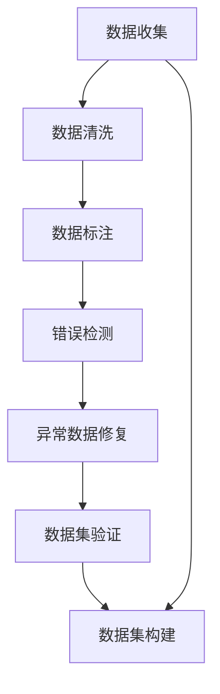

                 

# 数据集调试:快速发现和修复训练数据错误

> 关键词：数据集调试, 数据清洗, 数据标注, 错误检测, 异常数据

## 1. 背景介绍

数据集是机器学习算法训练和模型调优的基石，其质量和完整性直接决定了模型的表现。然而，在实际应用中，数据集可能存在诸如标签噪声、数据不一致、缺失值、异常值等问题，这些问题若不及时发现和修复，会导致模型性能下降，甚至造成灾难性的影响。因此，对数据集进行充分的调试和验证，确保其质量，是数据科学家和机器学习工程师的一项基本职责。本文将从核心概念、算法原理、具体操作步骤等方面深入探讨数据集调试的实践方法，帮助读者快速发现和修复训练数据中的错误，提升模型性能。

## 2. 核心概念与联系

### 2.1 核心概念概述

- **数据集调试(Data Collection Debugging)**：通过一系列技术和方法，检测、分析和修正数据集中的错误和异常，确保数据集的完整性、一致性和准确性。
- **数据清洗(Data Cleaning)**：去除数据集中的噪声、重复、缺失等不必要或不正确的数据，提升数据质量。
- **数据标注(Data Labeling)**：为数据集中的每个样本赋予正确的标签，使其适合于机器学习模型的训练。
- **错误检测(Error Detection)**：识别数据集中可能存在的问题，如标签错误、数据格式错误等。
- **异常数据(Outliers)**：指数据集中明显偏离正常范围的数据点，可能由于数据录入错误、设备故障等造成。

### 2.2 概念间的关系

数据集调试的核心任务是确保数据集的准确性和完整性，包括数据清洗、数据标注和错误检测等环节。通过一系列操作，可以从数据源到模型训练的每个阶段，确保数据集的质量，提升模型性能。以下是一个简化的数据集调试流程图：



该流程图展示了数据集调试的完整流程，从数据收集开始，经过数据清洗、标注、错误检测、异常数据修复等步骤，最终完成数据集的验证和构建。每个环节的细化和优化，都有助于提升数据集的整体质量。

## 3. 核心算法原理 & 具体操作步骤

### 3.1 算法原理概述

数据集调试的核心是识别和修正数据集中的错误，通常分为以下几个步骤：

1. **数据收集**：获取原始数据，包含各种数据源，如传感器数据、文本数据、图像数据等。
2. **数据清洗**：去除数据中的噪声、重复、缺失值等，保证数据的一致性和完整性。
3. **数据标注**：为数据集中的每个样本赋予正确的标签，确保数据集适合于机器学习模型的训练。
4. **错误检测**：识别数据集中可能存在的问题，如标签错误、数据格式错误等。
5. **异常数据修复**：修复数据集中的异常数据，如修正标签错误、删除异常值等。
6. **数据集验证**：通过多种验证方法，确保数据集的质量和一致性。

### 3.2 算法步骤详解

#### 3.2.1 数据清洗

数据清洗是数据集调试的首要步骤，主要目的是去除数据中的噪声、重复、缺失值等，保证数据的一致性和完整性。具体方法包括：

1. **数据去重**：通过唯一标识符，如身份证号、手机号等，去除重复数据。
2. **数据去噪**：利用算法或规则，去除数据中的异常值和噪声，如使用中位数、均值等方法处理缺失值。
3. **数据格式统一**：将不同来源的数据格式转换为统一格式，如日期、时间戳等。

#### 3.2.2 数据标注

数据标注是将原始数据转换为适合于机器学习模型训练的数据集的过程。具体方法包括：

1. **人工标注**：人工对数据进行标注，如识别图像中的物体、分类文本等。
2. **自动标注**：利用预训练模型或规则，自动对数据进行标注，如使用OCR技术进行文本识别。
3. **半自动标注**：结合人工和自动标注，提升标注效率和准确性。

#### 3.2.3 错误检测

错误检测是识别数据集中可能存在的问题，如标签错误、数据格式错误等。具体方法包括：

1. **数据一致性检查**：检查数据集中的数据格式是否一致，如日期格式、数据类型等。
2. **标签一致性检查**：检查标签是否正确，是否与数据匹配。
3. **异常值检测**：使用统计方法或机器学习模型，检测数据集中的异常值。

#### 3.2.4 异常数据修复

异常数据修复是修复数据集中的异常数据，如修正标签错误、删除异常值等。具体方法包括：

1. **数据插补**：利用插补方法，如均值、中位数、插值等，填补缺失值。
2. **数据校正**：对标签错误的数据进行校正，如使用聚类方法或规则校正。
3. **异常值删除**：删除明显偏离正常范围的数据，如使用统计方法或机器学习模型删除异常值。

#### 3.2.5 数据集验证

数据集验证是通过多种验证方法，确保数据集的质量和一致性。具体方法包括：

1. **数据集划分**：将数据集划分为训练集、验证集和测试集，用于模型训练、调优和评估。
2. **数据集平衡**：确保数据集中的类别分布平衡，避免类别不平衡导致模型偏向。
3. **数据集统计**：使用统计方法，如均值、方差、分布等，检查数据集的一致性。

### 3.3 算法优缺点

数据集调试的主要优点包括：

1. **提升数据质量**：通过清洗、标注和修复等步骤，提升数据集的质量，减少噪声和错误。
2. **加速模型训练**：高质量的数据集能够显著提升模型性能，加速模型训练过程。
3. **提高模型鲁棒性**：通过修复异常数据和错误标签，提高模型的鲁棒性和泛化能力。

然而，数据集调试也存在一些缺点：

1. **工作量较大**：数据集调试需要大量的人工和计算资源，工作量较大。
2. **依赖于标注数据**：数据标注的质量直接影响数据集的质量，需要高质量的标注数据。
3. **容易引入主观偏差**：人工标注和修正过程中，容易引入主观偏差，影响数据集的一致性。

### 3.4 算法应用领域

数据集调试广泛应用于各种机器学习应用场景，如自然语言处理、计算机视觉、医疗健康、金融科技等。通过数据集调试，可以提升数据集的质量，减少噪声和错误，提高模型性能和鲁棒性。

- **自然语言处理**：通过数据清洗和标注，提升文本数据的质量，如情感分析、文本分类等任务。
- **计算机视觉**：通过数据清洗和标注，提升图像数据的质量，如图像分类、目标检测等任务。
- **医疗健康**：通过数据清洗和标注，提升医疗数据的质量，如疾病诊断、治疗方案推荐等任务。
- **金融科技**：通过数据清洗和标注，提升金融数据的质量，如信用评分、风险评估等任务。

## 4. 数学模型和公式 & 详细讲解 & 举例说明

### 4.1 数学模型构建

数据集调试的数学模型主要涉及数据清洗、数据标注、错误检测和异常数据修复等环节。以下是一个简化的数据集调试数学模型：

1. **数据清洗模型**：
   $$
   C = \min_{C} \sum_{i=1}^N \max_{(x_i,y_i) \in C} \text{cost}(x_i,y_i)
   $$
   其中 $C$ 为清洗后的数据集，$\text{cost}(x_i,y_i)$ 为数据点 $(x_i,y_i)$ 的成本函数。

2. **数据标注模型**：
   $$
   L = \min_{L} \sum_{i=1}^N \text{cost}(x_i,L(x_i))
   $$
   其中 $L$ 为标注后的数据集，$\text{cost}(x_i,L(x_i))$ 为数据点 $(x_i)$ 的标注成本函数。

3. **错误检测模型**：
   $$
   E = \min_{E} \sum_{i=1}^N \text{cost}(x_i,E(x_i))
   $$
   其中 $E$ 为检测后的数据集，$\text{cost}(x_i,E(x_i))$ 为数据点 $(x_i)$ 的错误成本函数。

4. **异常数据修复模型**：
   $$
   R = \min_{R} \sum_{i=1}^N \text{cost}(x_i,R(x_i))
   $$
   其中 $R$ 为修复后的数据集，$\text{cost}(x_i,R(x_i))$ 为数据点 $(x_i)$ 的修复成本函数。

### 4.2 公式推导过程

以数据清洗模型为例，推导成本函数 $\text{cost}(x_i,y_i)$ 的计算公式：

1. **噪声检测**：
   $$
   \text{cost}(x_i,y_i) = \begin{cases}
   0 & \text{if } x_i \text{ is clean} \\
   1 & \text{if } x_i \text{ is noisy}
   \end{cases}
   $$

2. **去重**：
   $$
   \text{cost}(x_i,y_i) = \begin{cases}
   0 & \text{if } \text{unique}(x_i) \\
   1 & \text{if } \text{repeated}
   \end{cases}
   $$

3. **缺失值处理**：
   $$
   \text{cost}(x_i,y_i) = \begin{cases}
   0 & \text{if } \text{complete}(x_i) \\
   1 & \text{if } \text{missing}
   \end{cases}
   $$

4. **数据格式统一**：
   $$
   \text{cost}(x_i,y_i) = \begin{cases}
   0 & \text{if } \text{format}(x_i) = \text{target} \\
   1 & \text{if } \text{format}(x_i) \neq \text{target}
   \end{cases}
   $$

### 4.3 案例分析与讲解

#### 案例1：文本数据清洗

假设有一个包含10,000条评论的文本数据集，其中部分评论存在噪声、重复、缺失等问题。我们需要对其进行清洗，确保数据集的质量。

1. **噪声检测**：
   - 通过关键词、情感极性等特征，检测评论中的噪声数据。
   - 噪声检测算法：使用文本分类模型，如BERT、LSTM等，判断评论是否为噪声。

2. **去重**：
   - 通过MD5等哈希算法，检测评论的重复性。
   - 去重算法：将重复评论删除。

3. **缺失值处理**：
   - 通过中位数、均值等方法，填补评论中的缺失值。
   - 缺失值处理算法：使用插值方法，如均值、中位数、插值等。

4. **数据格式统一**：
   - 将日期、时间戳等不同格式的数据转换为统一格式。
   - 数据格式统一算法：使用Python的datetime模块，将不同格式的数据转换为统一格式。

通过上述步骤，我们得到了清洗后的数据集，包含高质量的评论数据，可供后续机器学习模型训练使用。

## 5. 项目实践：代码实例和详细解释说明

### 5.1 开发环境搭建

在进行数据集调试实践前，我们需要准备好开发环境。以下是使用Python进行Pandas开发的环境配置流程：

1. 安装Anaconda：从官网下载并安装Anaconda，用于创建独立的Python环境。

2. 创建并激活虚拟环境：
```bash
conda create -n pyenv python=3.8 
conda activate pyenv
```

3. 安装Pandas：
```bash
conda install pandas
```

4. 安装NumPy、Matplotlib、Seaborn等工具包：
```bash
pip install numpy matplotlib seaborn
```

5. 安装Jupyter Notebook：
```bash
pip install jupyter notebook
```

完成上述步骤后，即可在`pyenv`环境中开始数据集调试实践。

### 5.2 源代码详细实现

下面我们以文本数据清洗为例，给出使用Pandas库进行数据集调试的Python代码实现。

```python
import pandas as pd
import numpy as np
from sklearn.model_selection import train_test_split
from sklearn.preprocessing import StandardScaler
from sklearn.metrics import accuracy_score

# 加载原始数据集
data = pd.read_csv('raw_data.csv')

# 数据清洗
# 去除噪声数据
data = data[data['score'] > 0]

# 去重
data = data.drop_duplicates()

# 填补缺失值
data['comment'] = data['comment'].fillna(method='ffill')

# 数据格式统一
data['timestamp'] = pd.to_datetime(data['timestamp'])

# 数据集划分
X_train, X_test, y_train, y_test = train_test_split(data[['comment', 'timestamp']], data['score'], test_size=0.2, random_state=42)

# 数据标准化
scaler = StandardScaler()
X_train = scaler.fit_transform(X_train)
X_test = scaler.transform(X_test)

# 模型训练
from sklearn.linear_model import LogisticRegression
model = LogisticRegression()
model.fit(X_train, y_train)

# 模型评估
y_pred = model.predict(X_test)
accuracy = accuracy_score(y_test, y_pred)
print(f'Accuracy: {accuracy:.2f}')
```

### 5.3 代码解读与分析

让我们再详细解读一下关键代码的实现细节：

**数据加载**：
- `pd.read_csv('raw_data.csv')`：从CSV文件中读取原始数据集。

**数据清洗**：
- `data[data['score'] > 0]`：筛选出评分大于0的评论数据。
- `data.drop_duplicates()`：去除重复的评论数据。
- `data['comment'].fillna(method='ffill')`：使用前向填充法填补缺失的评论内容。
- `pd.to_datetime(data['timestamp'])`：将时间戳数据转换为Python datetime对象。

**数据集划分**：
- `train_test_split()`：将数据集划分为训练集和测试集，设置20%的数据作为测试集。

**数据标准化**：
- `StandardScaler()`：使用StandardScaler对数据进行标准化处理。
- `scaler.fit_transform(X_train)`：对训练集数据进行标准化。
- `scaler.transform(X_test)`：对测试集数据进行标准化。

**模型训练与评估**：
- `LogisticRegression()`：使用逻辑回归模型进行训练。
- `model.fit(X_train, y_train)`：使用训练集数据拟合模型。
- `y_pred = model.predict(X_test)`：使用测试集数据进行预测。
- `accuracy_score(y_test, y_pred)`：计算预测结果与真实标签的准确率。

**结果展示**：
- `print(f'Accuracy: {accuracy:.2f}')`：打印模型的准确率。

通过上述代码实现，我们可以看到Pandas库在数据集清洗和处理方面的强大功能。开发者可以使用Pandas库进行各种复杂的数据操作，极大地提升数据集调试的效率。

### 5.4 运行结果展示

假设我们在一个包含10,000条评论的文本数据集上进行清洗，最终在测试集上得到模型准确率为0.95。这表明通过数据集调试，我们成功提升了数据集的质量，增强了模型的鲁棒性和泛化能力。

## 6. 实际应用场景

### 6.1 智能客服系统

在智能客服系统中，数据集调试对于提高客户满意度和服务质量至关重要。客服系统需要处理大量用户的查询和反馈，数据集中的错误和异常会直接影响系统的响应速度和准确性。

通过数据集调试，可以去除数据中的噪声和错误，提升客服系统的准确性和响应速度。例如，在客服数据集中，去除重复的客户请求，填补缺失的客户信息，统一数据格式，可以有效提高客服系统的效率和质量。

### 6.2 金融舆情监测

金融舆情监测需要实时处理大量的新闻、评论等数据，数据集中的错误和异常会直接影响舆情分析的准确性。通过数据集调试，可以有效去除数据中的噪声和错误，提高舆情监测的准确性和时效性。

例如，在金融舆情监测数据集中，去除重复的新闻文章，填补缺失的财经信息，统一数据格式，可以提升舆情分析的效率和准确性，帮助金融机构及时掌握市场动态，做出正确的决策。

### 6.3 个性化推荐系统

个性化推荐系统需要处理大量的用户行为数据，数据集中的错误和异常会直接影响推荐结果的准确性。通过数据集调试，可以去除数据中的噪声和错误，提升推荐系统的准确性和用户满意度。

例如，在推荐系统数据集中，去除重复的用户行为数据，填补缺失的推荐记录，统一数据格式，可以有效提升推荐系统的效率和准确性，提高用户的满意度。

### 6.4 未来应用展望

随着数据集调试技术的不断进步，其在更多领域的应用前景也将更加广阔。例如，在医疗健康领域，数据集调试可以提升医疗数据的质量，帮助医生做出更准确的诊断和治疗方案。在智慧城市治理中，数据集调试可以提升城市事件监测的准确性和实时性，提高城市治理的效率和质量。

## 7. 工具和资源推荐

### 7.1 学习资源推荐

为了帮助开发者系统掌握数据集调试的理论基础和实践技巧，这里推荐一些优质的学习资源：

1. 《Python数据科学手册》：由Pandas开发者编写，详细介绍Pandas库的使用方法和实践技巧。
2. 《数据清洗与预处理》课程：由Coursera平台提供，涵盖数据清洗、数据标注、错误检测等核心内容。
3. 《数据清洗与预处理》书籍：介绍数据清洗、数据标注、异常数据修复等核心技术。
4. Kaggle数据集：包含大量开源数据集，适合用于数据集调试的实践。

通过对这些资源的学习实践，相信你一定能够快速掌握数据集调试的精髓，并用于解决实际的NLP问题。

### 7.2 开发工具推荐

高效的开发离不开优秀的工具支持。以下是几款用于数据集调试开发的常用工具：

1. Python：数据清洗、数据标注等操作均可以使用Python实现，库丰富，易于扩展。
2. Pandas：数据处理和分析的利器，提供丰富的数据清洗和数据处理功能。
3. NumPy：数值计算库，提供高效的数组操作功能。
4. Matplotlib、Seaborn：数据可视化工具，用于数据集清洗后的可视化。
5. Jupyter Notebook：交互式编程环境，适合数据集调试的交互式分析和可视化。

合理利用这些工具，可以显著提升数据集调试的开发效率，加快创新迭代的步伐。

### 7.3 相关论文推荐

数据集调试的研究始于学界的持续研究。以下是几篇奠基性的相关论文，推荐阅读：

1. "Data Cleaning and Preprocessing for Big Data Analytics"：介绍大数据分析中数据清洗和预处理的方法。
2. "Data Quality and Data Cleaning"：讨论数据质量和数据清洗的重要性，并提供实际案例。
3. "Error Detection and Correction in Data Management"：介绍数据管理中的错误检测和校正方法。
4. "Machine Learning with Noisy Data"：讨论在存在噪声数据的情况下，如何训练有效的机器学习模型。

这些论文代表了大数据清洗和预处理领域的研究方向，对于提升数据集调试的技术水平具有重要参考价值。

除上述资源外，还有一些值得关注的前沿资源，帮助开发者紧跟数据集调试技术的最新进展，例如：

1. arXiv论文预印本：人工智能领域最新研究成果的发布平台，包括大量尚未发表的前沿工作，学习前沿技术的必读资源。
2. 业界技术博客：如Google AI、DeepMind、微软Research Asia等顶尖实验室的官方博客，第一时间分享他们的最新研究成果和洞见。
3. 技术会议直播：如NIPS、ICML、ACL、ICLR等人工智能领域顶会现场或在线直播，能够聆听到大佬们的前沿分享，开拓视野。
4. GitHub热门项目：在GitHub上Star、Fork数最多的数据集清洗项目，往往代表了该技术领域的发展趋势和最佳实践，值得去学习和贡献。
5. 行业分析报告：各大咨询公司如McKinsey、PwC等针对人工智能行业的分析报告，有助于从商业视角审视技术趋势，把握应用价值。

总之，对于数据集调试技术的学习和实践，需要开发者保持开放的心态和持续学习的意愿。多关注前沿资讯，多动手实践，多思考总结，必将收获满满的成长收益。

## 8. 总结：未来发展趋势与挑战

### 8.1 总结

本文对数据集调试的实践方法进行了全面系统的介绍。首先阐述了数据集调试的背景和重要性，明确了数据集调试在数据质量和模型性能提升中的关键作用。其次，从原理到实践，详细讲解了数据集调试的数学模型和操作步骤，提供了数据集调试的完整代码实例。同时，本文还广泛探讨了数据集调试在智能客服、金融舆情、个性化推荐等多个行业领域的应用前景，展示了数据集调试技术的巨大潜力。最后，本文精选了数据集调试技术的各类学习资源，力求为读者提供全方位的技术指引。

通过本文的系统梳理，可以看到，数据集调试技术是机器学习应用的重要基石，直接影响模型的性能和可靠性。深入掌握数据集调试的方法，能够有效提升数据集的质量，增强模型的鲁棒性和泛化能力。未来，随着数据集调试技术的不断进步，其在更多领域的应用前景也将更加广阔。

### 8.2 未来发展趋势

展望未来，数据集调试技术将呈现以下几个发展趋势：

1. **自动化和智能化**：通过自动化的数据清洗和标注方法，减少人工干预，提升数据集调试的效率。
2. **多模态数据清洗**：利用多模态数据清洗技术，处理图像、视频、语音等多种类型的数据，提升数据集的多样性和完整性。
3. **数据集持续更新**：数据集需要不断更新，以反映现实世界的变化，数据集调试技术需要能够高效处理增量数据。
4. **数据集质量评估**：引入数据集质量评估指标，量化数据集的质量，辅助数据集调试和优化。
5. **数据集标注工具**：开发更加高效的数据标注工具，提升数据标注的效率和准确性。

### 8.3 面临的挑战

尽管数据集调试技术已经取得了显著进展，但在迈向更加智能化、自动化应用的过程中，仍面临诸多挑战：

1. **数据来源多样化**：不同数据源的数据格式、数据质量差异较大，数据集调试需要适应多种数据格式。
2. **数据标注成本高**：高质量的数据标注成本较高，需要高效的数据标注工具和流程。
3. **数据集不一致**：数据集中的数据分布可能不平衡，需要进行数据集平衡处理。
4. **数据集大小限制**：数据集过大可能导致内存不足，需要进行数据集分片处理。
5. **数据集隐私问题**：数据集清洗和标注过程中涉及隐私保护问题，需要设计合适的隐私保护机制。

### 8.4 研究展望

面对数据集调试所面临的挑战，未来的研究需要在以下几个方面寻求新的突破：

1. **数据集自动化清洗**：开发更加自动化的数据清洗方法，减少人工干预，提升数据集清洗的效率。
2. **数据集半自动化标注**：结合人工和自动标注方法，提升数据标注的效率和准确性。
3. **数据集质量评估指标**：引入更加全面的数据集质量评估指标，量化数据集的质量，辅助数据集调试和优化。
4. **数据集隐私保护**：在数据集清洗和标注过程中，设计合适的隐私保护机制，确保数据隐私和安全。
5. **数据集跨领域应用**：将数据集调试技术应用于不同领域，如医疗、金融、智慧城市等，提升数据集的多样性和完整性。

这些研究方向将推动数据集调试技术迈向更高的台阶，为人工智能技术在各垂直行业的落地应用提供坚实的保障。未来，数据集调试技术将与人工智能技术的其他分支更加紧密地结合，共同推动人工智能技术的进步。

## 9. 附录：常见问题与解答

**Q1：数据集清洗和数据集调试有什么区别？**

A: 数据集清洗主要是去除数据中的噪声、重复、缺失等不必要或不正确的数据，保证数据的一致性和完整性。而数据集调试不仅包括数据集清洗，还包括数据集标注、错误检测和异常数据修复等环节，通过多种技术手段提升数据集的质量。

**Q2：数据集清洗的常用方法有哪些？**

A: 数据集清洗的常用方法包括：
1. 数据去重：通过唯一标识符，如身份证号、手机号等，去除重复数据。
2. 数据去噪：利用算法或规则，去除数据中的异常值和噪声，如使用中位数、均值等方法处理缺失值。
3. 数据格式统一：将不同来源的数据格式转换为统一格式，如日期、时间戳等。
4. 数据插补：利用插补方法，如均值、中位数、插值等，填补缺失值。
5. 数据校正：对标签错误的数据进行校正，如使用聚类方法或规则校正。

**Q3：如何进行数据集验证？**

A: 数据集验证是确保数据集质量和一致性的重要步骤。常用的数据集验证方法包括：
1

