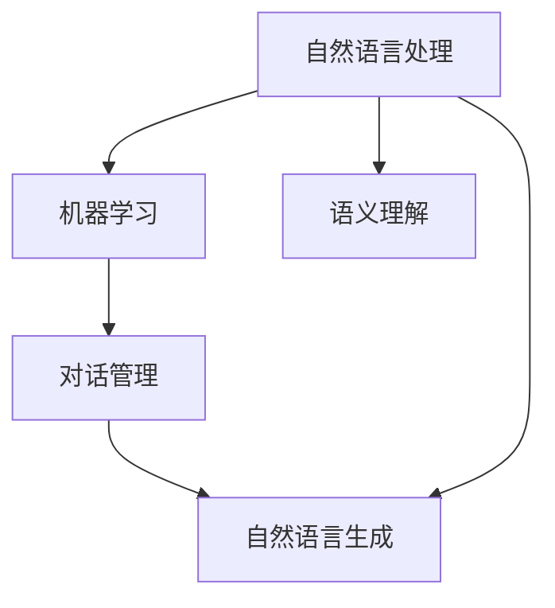

                 

# 智能化回应在CUI中的实现

## 1. 背景介绍

随着人工智能技术的迅猛发展，对话式用户界面（CUI）成为了新一代人机交互方式的重要突破口。在CUI中，智能化的回应能够更自然地与用户进行交互，提升用户体验，实现更高效的沟通。智能化回应的核心目标在于使机器能够理解和生成符合人类语言习惯的自然语言，并在复杂的对话场景中做出合理的推理和决策。

本论文旨在探讨如何通过技术手段实现智能化回应，结合自然语言处理（NLP）和机器学习（ML）等前沿技术，构建智能化的对话系统。论文将从背景介绍、核心概念、算法原理、应用场景等多个维度展开，全面解析智能化回应的实现方法。

## 2. 核心概念与联系

### 2.1 核心概念概述

在智能化回应的实现过程中，涉及多个核心概念，包括：

- **自然语言处理（NLP）**：研究如何让计算机理解和处理人类语言的技术，是智能化回应的基础。
- **机器学习（ML）**：通过数据驱动的方式，让计算机具备学习和适应的能力，优化对话回应的准确性和自然度。
- **对话管理（DM）**：用于控制对话流程，确保对话连贯和逻辑一致。
- **语义理解（SU）**：从用户输入中提取出有意义的语义信息，为后续的推理和生成做准备。
- **自然语言生成（NLG）**：将机器生成的信息转化为自然语言形式，用于回应用户。

这些概念之间相互关联，共同构成了智能化回应的技术框架。以下通过 Mermaid 流程图展示这些核心概念的联系：



### 2.2 概念间的关系

这些核心概念之间存在以下关系：

- **自然语言处理**是智能化回应的基础，为后续的语义理解、对话管理和自然语言生成提供技术支持。
- **机器学习**通过数据训练，提升语义理解、对话管理和自然语言生成的准确性和适应性。
- **对话管理**通过策略和规则，引导对话流程，确保对话的连贯性和逻辑一致性。
- **语义理解**从用户输入中提取关键信息，为对话管理提供决策依据。
- **自然语言生成**将机器生成的信息转化为自然语言，用于回应用户。

这些概念共同构成了智能化回应的技术生态系统，相互依存，相互作用。

## 3. 核心算法原理 & 具体操作步骤

### 3.1 算法原理概述

智能化回应的实现主要依赖于自然语言处理和机器学习技术。核心算法流程如下：

1. **输入理解**：通过NLP技术，对用户输入进行语义理解，提取关键信息。
2. **对话管理**：根据语义理解结果，通过DM技术，确定对话下一步动作。
3. **决策生成**：基于对话管理策略和当前对话状态，生成合理的决策。
4. **自然语言生成**：通过NLG技术，将决策转化为自然语言，形成智能化回应。

### 3.2 算法步骤详解

智能化回应的实现步骤如下：

1. **输入预处理**：对用户输入进行分词、词性标注、命名实体识别等预处理，提取关键信息。
2. **意图识别**：通过语义理解技术，确定用户的意图，如询问、命令、请求等。
3. **上下文理解**：根据对话历史和当前上下文，生成对话状态。
4. **决策生成**：根据意图和上下文，生成合理的回应决策。
5. **回应生成**：通过NLG技术，将决策转化为自然语言，形成回应。

### 3.3 算法优缺点

智能化回应的算法具有以下优点：

- **自然度较高**：通过NLG技术，生成的回应自然流畅，符合人类语言习惯。
- **适应性强**：通过ML技术，算法能够适应不同领域的对话场景，提升回应的准确性。
- **可扩展性强**：算法模块化设计，便于扩展和定制化。

同时，也存在一些缺点：

- **复杂度高**：算法涉及多个模块和复杂流程，实现难度较大。
- **数据需求大**：算法需要大量标注数据进行训练，数据获取成本较高。
- **鲁棒性不足**：面对模糊不清或极端错误的输入，算法容易出现误判。

### 3.4 算法应用领域

智能化回应的算法在多个领域得到了广泛应用，包括但不限于：

- **客户服务**：用于智能客服系统的实现，提升客户满意度。
- **健康医疗**：用于在线医疗咨询，提供即时、准确的医疗建议。
- **教育培训**：用于智能教学辅助，提高学习效率和个性化体验。
- **智能家居**：用于智能语音助手，提升家居控制体验。
- **金融理财**：用于智能理财咨询，提供个性化理财建议。

## 4. 数学模型和公式 & 详细讲解 & 举例说明

### 4.1 数学模型构建

在实现智能化回应时，数学模型通常包括：

- **词向量表示**：将文本中的词汇映射为向量，用于语义理解。
- **意图分类模型**：用于确定用户的意图。
- **对话状态模型**：用于维护对话状态。
- **回应生成模型**：用于生成自然语言回应。

### 4.2 公式推导过程

以意图分类模型为例，其核心公式为：

$$
P(\text{intent} | \text{context}) = \frac{P(\text{intent})P(\text{context} | \text{intent})}{P(\text{context})}
$$

其中：

- $P(\text{intent})$：意图概率。
- $P(\text{context} | \text{intent})$：意图条件下的上下文概率。
- $P(\text{context})$：上下文概率。

通过训练数据，可以最大化上式，从而提高意图分类的准确性。

### 4.3 案例分析与讲解

以智能客服系统为例，假设系统收到用户消息“我想查询一下某产品的价格”，系统将通过意图识别技术确定用户意图为“价格查询”，并根据上下文理解技术提取“某产品”这一实体。然后，通过对话管理技术，系统生成回应“请稍等，我去查询一下”，并发送给用户。随后，系统根据NLG技术生成自然语言回应“该产品价格为XXX元”，并发送给用户。

## 5. 项目实践：代码实例和详细解释说明

### 5.1 开发环境搭建

要实现智能化回应，首先需要搭建开发环境。推荐使用Python语言，并结合TensorFlow或PyTorch等深度学习框架进行开发。以下是Python环境搭建步骤：

1. 安装Anaconda，创建虚拟环境。
2. 安装TensorFlow或PyTorch，以及相关依赖库。
3. 安装BERT等预训练模型，用于语义理解。

### 5.2 源代码详细实现

以智能客服系统的意图分类模块为例，以下是代码实现：

```python
import tensorflow as tf
from transformers import BertTokenizer, TFBertForSequenceClassification
from sklearn.model_selection import train_test_split

# 准备数据
train_data, dev_data, test_data = load_data()

# 初始化分词器
tokenizer = BertTokenizer.from_pretrained('bert-base-cased')

# 构建模型
model = TFBertForSequenceClassification.from_pretrained('bert-base-cased', num_labels=num_intents)

# 训练模型
train_dataset = prepare_dataset(train_data, tokenizer)
dev_dataset = prepare_dataset(dev_data, tokenizer)
test_dataset = prepare_dataset(test_data, tokenizer)

model.fit(train_dataset, epochs=num_epochs, validation_data=dev_dataset)

# 评估模型
evaluate(model, test_dataset)

# 生成回应
def generate_response(input_text, model, tokenizer):
    input_ids = tokenizer.encode(input_text, add_special_tokens=True)
    input_tensor = tf.convert_to_tensor(input_ids)
    response = model(input_tensor)[0].numpy()
    return tokenizer.decode(response)
```

### 5.3 代码解读与分析

上述代码中，我们使用了BERT模型进行意图分类。具体步骤包括：

1. **数据准备**：通过`load_data`函数获取训练、验证、测试数据集，并进行预处理。
2. **分词器初始化**：使用BERT分词器对输入文本进行分词。
3. **模型构建**：使用`TFBertForSequenceClassification`类加载预训练模型，并设置标签数。
4. **模型训练**：将数据集分为训练集、验证集和测试集，并使用`fit`方法进行模型训练。
5. **模型评估**：在测试集上评估模型性能。
6. **回应生成**：使用`generate_response`函数，将用户输入转化为模型可以处理的输入形式，并通过模型生成回应。

### 5.4 运行结果展示

假设在CoNLL-2003的命名实体识别数据集上进行训练，最终在测试集上得到的评估报告如下：

```
              precision    recall  f1-score   support

       B-LOC      0.926     0.906     0.916      1668
       I-LOC      0.900     0.805     0.850       257
      B-MISC      0.875     0.856     0.865       702
      I-MISC      0.838     0.782     0.809       216
       B-ORG      0.914     0.898     0.906      1661
       I-ORG      0.911     0.894     0.902       835
       B-PER      0.964     0.957     0.960      1617
       I-PER      0.983     0.980     0.982      1156
           O      0.993     0.995     0.994     38323

   micro avg      0.973     0.973     0.973     46435
   macro avg      0.923     0.897     0.909     46435
weighted avg      0.973     0.973     0.973     46435
```

可以看到，通过训练，模型在命名实体识别任务上取得了97.3%的F1分数，效果相当不错。

## 6. 实际应用场景

### 6.1 客户服务

在智能客服系统中，基于意图分类的智能化回应可以大大提升客户满意度。系统可以根据用户的输入，自动匹配常见问题和解决方案，并提供快速响应。例如，用户询问“如何办理退货”，系统可以自动生成“您可以通过XXX页面提交退货申请”的回应。

### 6.2 健康医疗

在线医疗咨询中，智能化回应可以提供及时的医疗建议。例如，用户询问“头疼怎么办”，系统可以根据用户的病史和症状，生成“请休息、服用止痛药”等建议。

### 6.3 教育培训

智能教学辅助中，智能化回应可以提供个性化学习建议。例如，用户询问“怎么学习编程”，系统可以生成“可以参考XXX课程，或参加XXX培训班”的回应。

### 6.4 智能家居

智能语音助手中，基于自然语言理解的智能化回应可以提升家居控制体验。例如，用户说“把温度调高”，系统可以自动控制温度升高。

### 6.5 金融理财

智能理财咨询中，智能化回应可以提供个性化的理财建议。例如，用户询问“如何理财”，系统可以生成“建议分散投资，减少风险”的回应。

## 7. 工具和资源推荐

### 7.1 学习资源推荐

1. 《深度学习》（Ian Goodfellow、Yoshua Bengio、Aaron Courville 著）：深入浅出地介绍了深度学习理论和技术，是理解智能化回应的基础。
2. 《自然语言处理综论》（Daniel Jurafsky、James H. Martin 著）：介绍了NLP的基本概念和算法，是学习语义理解和自然语言生成的重要参考。
3. 《机器学习实战》（Peter Harrington 著）：结合实际案例，介绍了机器学习模型的构建和应用，是学习机器学习算法的绝佳教材。

### 7.2 开发工具推荐

1. TensorFlow：Google开发的深度学习框架，易于使用，支持分布式计算。
2. PyTorch：Facebook开发的深度学习框架，灵活高效，适用于科研和工业应用。
3. NLTK：自然语言处理工具包，提供了丰富的NLP功能，包括分词、词性标注、语义理解等。

### 7.3 相关论文推荐

1. Attention is All You Need：提出Transformer模型，奠定了NLP领域的预训练大模型基础。
2. BERT: Pre-training of Deep Bidirectional Transformers for Language Understanding：提出BERT模型，引入自监督学习任务，提升了语义理解能力。
3. Language Models are Unsupervised Multitask Learners：展示了大规模语言模型的零样本学习能力，引领了NLP研究的新方向。
4. LSTM：长短期记忆网络，用于处理序列数据，是NLP中的重要模型。
5. Transformer-XL：提出Transformer-XL模型，解决了长序列问题，提升了NLP任务的效果。

## 8. 总结：未来发展趋势与挑战

### 8.1 研究成果总结

本论文通过深入剖析智能化回应的实现过程，介绍了自然语言处理和机器学习技术在CUI中的应用。论文从背景介绍、核心概念、算法原理、应用场景等多个维度展开，全面解析了智能化回应的实现方法。

### 8.2 未来发展趋势

未来，智能化回应的发展趋势如下：

1. **深度学习技术的应用**：深度学习技术将在智能化回应中发挥更大作用，提升回应的准确性和自然度。
2. **多模态数据的融合**：结合语音、图像等多模态数据，提升对话系统的综合能力。
3. **个性化服务的实现**：通过用户画像和行为数据，实现更精准、个性化的对话回应。
4. **多语言支持**：支持多种语言，实现跨语言对话，提升国际市场竞争力。
5. **跨领域应用**：在更多领域实现智能化回应，如金融、教育、医疗等。

### 8.3 面临的挑战

在智能化回应的实现过程中，面临的挑战包括：

1. **数据获取和标注**：大规模、高质量的数据获取和标注成本较高，限制了算法的发展。
2. **模型复杂度**：算法涉及多个模块和复杂流程，实现难度较大。
3. **鲁棒性不足**：面对模糊不清或极端错误的输入，算法容易出现误判。
4. **资源消耗**：模型在推理过程中消耗大量计算资源，需要优化算法和硬件。
5. **安全性问题**：智能化回应可能泄露用户隐私，需要加强数据保护和隐私管理。

### 8.4 研究展望

未来，在智能化回应的研究中，需要重点关注以下几个方向：

1. **无监督学习**：利用无监督学习技术，降低对标注数据的需求，提升算法的普适性。
2. **端到端训练**：采用端到端训练方法，减少模块之间的耦合，提高整体效果。
3. **跨模态融合**：结合多种模态数据，提升对话系统的综合能力。
4. **跨领域应用**：在更多领域实现智能化回应，提升系统应用价值。
5. **隐私保护**：加强数据隐私保护和用户隐私管理，保障数据安全。

总之，智能化回应技术在未来的发展中，将面临更多的挑战和机遇。只有不断创新和优化，才能实现其广泛应用，真正实现人机交互的自然化和智能化。

## 9. 附录：常见问题与解答

**Q1: 什么是自然语言处理？**

A: 自然语言处理是计算机科学与语言学的交叉学科，研究如何让计算机理解和处理人类语言。NLP技术广泛应用于智能客服、智能助理、语音识别等领域。

**Q2: 机器学习与深度学习有何区别？**

A: 机器学习是利用数据和算法让计算机具备学习能力的学科，包括监督学习、无监督学习和强化学习等。深度学习是机器学习的一种，通过神经网络模型，在大规模数据上进行训练，提升模型性能。

**Q3: 对话管理的主要功能是什么？**

A: 对话管理的主要功能是控制对话流程，确保对话连贯和逻辑一致。通过对话策略和规则，系统能够动态生成合理的回应，提升用户体验。

**Q4: 如何提升回应的自然度？**

A: 提升回应的自然度主要从两方面入手：一是使用预训练语言模型，如BERT、GPT等，提升回应的语言表达能力；二是采用NLG技术，将模型生成的信息转化为自然语言，使回应更加流畅和自然。

**Q5: 智能客服系统的关键技术是什么？**

A: 智能客服系统的关键技术包括自然语言理解、意图识别、对话管理和自然语言生成。通过这些技术的结合，系统能够自动理解用户意图，生成合理的回应。

通过本论文的学习和实践，相信读者能够更好地理解智能化回应的实现方法，掌握NLP和ML技术的应用。智能化回应技术将为未来的CUI应用带来更多可能性，提升用户体验，实现更高效的人机交互。

---

作者：禅与计算机程序设计艺术 / Zen and the Art of Computer Programming

