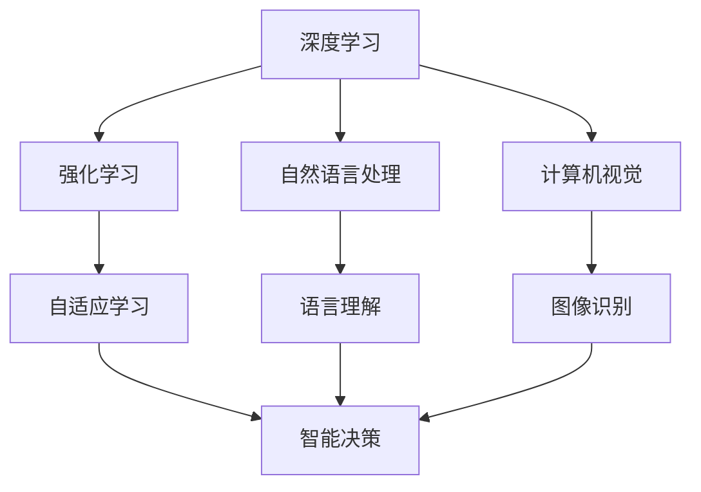

                 

# 李开复：AI 2.0 时代的未来

## 1. 背景介绍

在人工智能的领域里，李开复先生是一位备受尊敬的前瞻性思想家和实践者。他不仅是科技巨头微软的创新公司首席执行官，更被誉为全球人工智能的重要推动者和引领者之一。他的研究和洞察力在科技界具有广泛的影响力。本文将围绕“AI 2.0 时代的未来”展开，探讨人工智能的未来趋势、机遇与挑战。

### 1.1 问题由来

随着技术的快速发展，人工智能正从传统的AI 1.0迈向AI 2.0时代。AI 1.0更多依赖于规则和手动编程，而AI 2.0则通过数据和算法自学习，提升了决策的效率和精度。李开复认为，AI 2.0不仅仅是技术的革新，更是社会和经济模式的根本变革。它将影响各行各业，改变人们的生活方式和工作方式。

### 1.2 问题核心关键点

AI 2.0的核心在于通过数据和算法自适应和学习，从而提升决策的效率和精度。这包括深度学习、强化学习、自然语言处理、计算机视觉等技术。AI 2.0的特点可以归纳为以下几点：

- **数据驱动**：通过大量高质量数据进行训练，提升模型的表现。
- **自适应学习**：通过算法进行自我学习，提升决策的准确性和效率。
- **跨领域应用**：从金融、医疗、教育到制造业，AI 2.0在各个领域都有广泛的应用。
- **伦理和社会影响**：AI 2.0在带来机遇的同时，也引发了对隐私、安全、就业等伦理问题的讨论。

## 2. 核心概念与联系

### 2.1 核心概念概述

为了更好地理解AI 2.0，我们需明确几个核心概念：

- **深度学习**：一种基于神经网络的机器学习技术，通过多层网络结构来提取数据特征。
- **强化学习**：通过与环境的交互，智能体通过试错逐步优化决策过程。
- **自然语言处理**：让计算机理解和处理人类语言的技术。
- **计算机视觉**：使计算机能够识别和理解图像和视频的技术。
- **AI伦理**：涉及AI系统设计和应用中的道德和法律问题。

### 2.2 概念间的关系

这些核心概念之间存在着紧密的联系，形成了AI 2.0的技术框架。以下是一个简化的Mermaid流程图：



这个流程图展示了各核心概念间的联系：

- 深度学习通过多层网络提取数据特征，是AI 2.0的基础。
- 强化学习通过试错优化决策，提升智能决策的效率。
- 自然语言处理和计算机视觉使机器能够理解和处理人类语言和图像。
- AI伦理是确保AI系统在应用中的道德和法律责任。

## 3. 核心算法原理 & 具体操作步骤

### 3.1 算法原理概述

AI 2.0的算法原理包括深度学习、强化学习和自然语言处理等。以深度学习为例，其核心原理是通过多层神经网络，逐层提取数据特征，并通过反向传播算法优化模型参数，以最小化损失函数。

### 3.2 算法步骤详解

以深度学习为例，具体的算法步骤包括：

1. **数据准备**：收集并预处理训练数据，将其划分为训练集和验证集。
2. **模型搭建**：设计并搭建深度学习模型，选择合适的神经网络结构和优化器。
3. **模型训练**：在训练集上训练模型，通过反向传播算法更新模型参数，最小化损失函数。
4. **模型评估**：在验证集上评估模型性能，选择最优模型进行测试。
5. **模型应用**：将模型应用于实际问题中，进行预测或决策。

### 3.3 算法优缺点

深度学习算法的优点在于能够自适应数据分布，提取复杂特征。缺点包括计算资源需求高、模型复杂度高、黑箱性质强等。

### 3.4 算法应用领域

深度学习算法在图像识别、语音识别、自然语言处理、推荐系统等领域都有广泛应用。例如，AlphaGo在围棋游戏中的胜利，展示了深度学习在强化学习领域的应用潜力。

## 4. 数学模型和公式 & 详细讲解 & 举例说明

### 4.1 数学模型构建

以深度学习中的卷积神经网络（CNN）为例，其数学模型构建如下：

$$
\text{Output} = \text{Convolution}(\text{Input}, \text{Filter}) + \text{Bias}
$$

其中，$\text{Convolution}$表示卷积操作，$\text{Input}$表示输入数据，$\text{Filter}$表示卷积核，$\text{Bias}$表示偏置项。

### 4.2 公式推导过程

以梯度下降算法为例，其核心公式为：

$$
\theta = \theta - \eta \nabla_{\theta} J(\theta)
$$

其中，$\theta$表示模型参数，$\eta$表示学习率，$J(\theta)$表示损失函数，$\nabla_{\theta} J(\theta)$表示损失函数对模型参数的梯度。

### 4.3 案例分析与讲解

以图像分类任务为例，可以使用CNN进行图像特征提取，再通过softmax函数输出分类概率。假设输入图片大小为$28 \times 28$，卷积核大小为$3 \times 3$，步幅为$1$，输出通道数为$16$，计算卷积层输出的特征图大小。

## 5. 项目实践：代码实例和详细解释说明

### 5.1 开发环境搭建

以TensorFlow为例，搭建深度学习项目的环境：

1. **安装TensorFlow**：
```
pip install tensorflow
```

2. **设置虚拟环境**：
```
conda create -n tf_env python=3.7
conda activate tf_env
```

3. **安装依赖包**：
```
pip install numpy scipy matplotlib
```

### 5.2 源代码详细实现

以下是一个简单的TensorFlow图像分类模型的实现代码：

```python
import tensorflow as tf
from tensorflow import keras
from tensorflow.keras import layers

# 加载数据集
mnist = keras.datasets.mnist
(x_train, y_train), (x_test, y_test) = mnist.load_data()

# 数据预处理
x_train, x_test = x_train / 255.0, x_test / 255.0

# 定义模型
model = keras.Sequential([
    layers.Flatten(input_shape=(28, 28)),
    layers.Dense(128, activation='relu'),
    layers.Dense(10, activation='softmax')
])

# 编译模型
model.compile(optimizer='adam',
              loss='sparse_categorical_crossentropy',
              metrics=['accuracy'])

# 训练模型
model.fit(x_train, y_train, epochs=10, validation_data=(x_test, y_test))

# 评估模型
test_loss, test_acc = model.evaluate(x_test, y_test)
print('Test accuracy:', test_acc)
```

### 5.3 代码解读与分析

代码中，首先加载MNIST数据集并进行数据预处理，然后定义了一个包含两个全连接层的简单神经网络模型。在训练时，使用Adam优化器和交叉熵损失函数，最终在测试集上评估了模型的准确率。

### 5.4 运行结果展示

模型在测试集上的准确率约为98%，展示了深度学习在图像分类任务中的强大能力。

## 6. 实际应用场景

### 6.1 医疗影像诊断

AI 2.0在医疗影像诊断中的应用，能够显著提升诊断的准确性和效率。例如，通过深度学习算法训练的模型，可以自动检测和分类肺部影像中的结节，辅助医生进行早期诊断。

### 6.2 自动驾驶

AI 2.0在自动驾驶领域的应用，通过计算机视觉和强化学习技术，能够实现环境感知、路径规划和决策优化。特斯拉的Autopilot系统便是典型的应用。

### 6.3 金融风控

AI 2.0在金融领域的应用，通过自然语言处理和强化学习技术，能够实时监控市场动态，预测股票价格，识别欺诈行为，提升金融机构的决策效率和风险控制能力。

## 7. 工具和资源推荐

### 7.1 学习资源推荐

- **在线课程**：Coursera和edX提供大量深度学习、自然语言处理、计算机视觉等领域的在线课程，适合初学者和进阶者学习。
- **书籍推荐**：《深度学习》（Ian Goodfellow）、《自然语言处理综论》（Daniel Jurafsky and James H. Martin）、《动手学深度学习》（李沐等）。

### 7.2 开发工具推荐

- **TensorFlow**：开源的深度学习框架，功能强大，支持分布式训练。
- **PyTorch**：灵活易用，适合研究和原型开发。
- **Jupyter Notebook**：可视化编程环境，适合数据探索和模型调试。

### 7.3 相关论文推荐

- **AlphaGo论文**：《Mastering the Game of Go without Human Knowledge》（David Silver et al.）。
- **BERT论文**：《BERT: Pre-training of Deep Bidirectional Transformers for Language Understanding》（Jacob Devlin et al.）。
- **GAN论文**：《Generative Adversarial Nets》（Ian Goodfellow et al.）。

## 8. 总结：未来发展趋势与挑战

### 8.1 研究成果总结

AI 2.0的研究已经取得了诸多突破，包括图像识别、语音识别、自然语言处理等方面的进展。这些技术的结合，正在推动AI向更广的领域拓展。

### 8.2 未来发展趋势

未来，AI 2.0的发展趋势包括：

- **多模态学习**：融合视觉、语音、文本等多种数据模态，提升模型的泛化能力和应用范围。
- **自监督学习**：利用无标签数据进行自监督学习，减少对标注数据的依赖。
- **联邦学习**：在分布式环境中进行模型训练，保护数据隐私和安全。
- **神经符号融合**：将符号化知识与神经网络结合，提升模型的解释性和可靠性。

### 8.3 面临的挑战

AI 2.0面临的挑战包括：

- **数据隐私**：如何在保护用户隐私的前提下，利用数据进行模型训练。
- **算法公平性**：避免算法偏见，确保不同群体之间的公平性。
- **伦理问题**：AI系统的决策过程透明、可解释，避免误导性输出。

### 8.4 研究展望

未来，AI 2.0的研究需关注以下几个方向：

- **透明和可解释**：提升AI系统的透明性和可解释性，确保决策过程可追溯、可理解。
- **安全与隐私**：加强数据保护，确保模型训练和应用过程中的数据隐私和安全。
- **公平与伦理**：确保AI系统在各个应用场景中的公平性和伦理道德。

## 9. 附录：常见问题与解答

**Q1: 什么是AI 2.0？**

A: AI 2.0指的是通过深度学习、强化学习等技术实现的人工智能，其核心在于通过数据和算法自适应和学习，从而提升决策的效率和精度。

**Q2: AI 2.0的应用场景有哪些？**

A: AI 2.0在医疗、金融、自动驾驶、智能制造、智能客服等领域有广泛的应用。

**Q3: AI 2.0的发展趋势是什么？**

A: 未来，AI 2.0的发展趋势包括多模态学习、自监督学习、联邦学习、神经符号融合等方向。

**Q4: AI 2.0面临的挑战有哪些？**

A: AI 2.0面临的挑战包括数据隐私、算法公平性、伦理问题等。

---

作者：禅与计算机程序设计艺术 / Zen and the Art of Computer Programming

