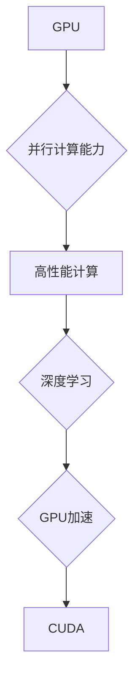

> 关键词：GPU，深度学习，人工智能，并行计算，加速，神经网络，CUDA，Tensor Core，深度神经网络

# GPU技术在AI中的应用

随着深度学习在人工智能领域的迅猛发展，GPU（图形处理单元）技术因其强大的并行计算能力，成为了推动AI研究与应用的关键因素。本文将深入探讨GPU技术在AI中的应用，涵盖核心概念、算法原理、项目实践、实际应用场景以及未来发展趋势。

## 1. 背景介绍

### 1.1 深度学习的兴起

深度学习是人工智能领域的一种重要技术，它通过模仿人脑神经网络的结构和功能，对大量数据进行分析和学习，从而实现智能识别、决策和预测。深度学习的兴起得益于计算能力的提升和大数据的积累，其中GPU技术的应用起到了至关重要的作用。

### 1.2 GPU的并行计算优势

与传统的CPU（中央处理单元）相比，GPU具有更高的并行计算能力，能够同时处理大量的计算任务。这种并行计算能力使得GPU在深度学习训练过程中，可以显著提高计算效率，缩短训练时间。

## 2. 核心概念与联系

### 2.1 GPU与CUDA

GPU（图形处理单元）是一种高度并行的处理器，最初设计用于渲染高质量的图形。CUDA（Compute Unified Device Architecture）是NVIDIA推出的一种并行计算平台和编程模型，它允许开发者在GPU上执行通用计算任务。



### 2.2 GPU架构

GPU架构通常包括多个核心（也称为流处理器或CUDA核心），每个核心可以独立执行计算任务。这种架构使得GPU非常适合并行计算，尤其是在处理大量简单计算任务时。

## 3. 核心算法原理 & 具体操作步骤

### 3.1 算法原理概述

深度学习算法，如神经网络，涉及大量的矩阵运算和向量运算。GPU的并行计算能力可以显著加速这些运算，从而提高深度学习训练的效率。

### 3.2 算法步骤详解

1. **数据加载**：将数据从内存加载到GPU的显存中。
2. **模型前向传播**：在GPU上并行计算模型的前向传播，包括矩阵乘法、激活函数等操作。
3. **计算损失函数**：在前向传播后，计算损失函数以评估模型性能。
4. **反向传播**：在GPU上并行计算反向传播，更新模型参数。
5. **参数更新**：使用优化算法更新模型参数。
6. **评估和迭代**：使用验证集评估模型性能，并根据需要迭代训练过程。

### 3.3 算法优缺点

**优点**：
- **高计算效率**：GPU的并行计算能力可以显著提高深度学习训练速度。
- **低延迟**：GPU的快速访问速度可以降低延迟，提高训练效率。
- **灵活的编程模型**：CUDA等编程模型提供了灵活的编程接口，可以轻松实现并行计算。

**缺点**：
- **成本较高**：高性能GPU的价格较高，可能不适合预算有限的项目。
- **能耗较高**：GPU在运行时会产生较高的热量，需要良好的散热系统。
- **软件兼容性**：某些GPU优化技术可能需要特定的软件支持。

### 3.4 算法应用领域

GPU技术在以下领域得到了广泛应用：

- **图像识别**：例如人脸识别、物体检测、图像分类等。
- **语音识别**：例如语音转文字、语音合成等。
- **自然语言处理**：例如机器翻译、情感分析、问答系统等。
- **推荐系统**：例如商品推荐、电影推荐等。

## 4. 数学模型和公式 & 详细讲解 & 举例说明

### 4.1 数学模型构建

深度学习中的神经网络模型通常由多个层组成，包括输入层、隐藏层和输出层。每一层由多个神经元组成，每个神经元都执行特定的数学运算。

### 4.2 公式推导过程

以下是一个简单的神经网络前向传播的公式推导过程：

$$
y_i = f(\sum_j w_{ij}x_j + b_i)
$$

其中，$y_i$ 是输出层的输出，$f$ 是激活函数，$x_j$ 是输入层的输入，$w_{ij}$ 是连接权重，$b_i$ 是偏置项。

### 4.3 案例分析与讲解

以下是一个使用PyTorch在GPU上实现神经网络的基本示例：

```python
import torch
import torch.nn as nn

# 定义一个简单的全连接神经网络
class SimpleNN(nn.Module):
    def __init__(self):
        super(SimpleNN, self).__init__()
        self.fc1 = nn.Linear(10, 50)
        self.fc2 = nn.Linear(50, 1)
        self.sigmoid = nn.Sigmoid()

    def forward(self, x):
        x = self.fc1(x)
        x = self.sigmoid(x)
        x = self.fc2(x)
        return x

# 创建模型实例
model = SimpleNN().to('cuda')

# 创建随机输入和标签
x = torch.randn(64, 10).to('cuda')
y = torch.randn(64, 1).to('cuda')

# 训练模型
model.train()
output = model(x)
loss = nn.MSELoss()(output, y)
loss.backward()
optimizer = torch.optim.SGD(model.parameters(), lr=0.01)
optimizer.step()

# 评估模型
model.eval()
with torch.no_grad():
    output = model(x)
    print(output)
```

## 5. 项目实践：代码实例和详细解释说明

### 5.1 开发环境搭建

为了在GPU上进行深度学习项目开发，你需要以下环境：

- 操作系统：Linux或macOS
- 编程语言：Python
- 深度学习框架：PyTorch、TensorFlow或Caffe等
- CUDA：NVIDIA的CUDA工具包，用于在GPU上编译和运行代码

### 5.2 源代码详细实现

以下是一个使用PyTorch在GPU上训练一个简单的神经网络模型的完整示例：

```python
import torch
import torch.nn as nn
import torch.optim as optim

# 定义一个简单的神经网络模型
class SimpleNN(nn.Module):
    def __init__(self):
        super(SimpleNN, self).__init__()
        self.fc1 = nn.Linear(10, 50)
        self.fc2 = nn.Linear(50, 1)

    def forward(self, x):
        x = torch.relu(self.fc1(x))
        x = self.fc2(x)
        return x

# 创建模型实例
model = SimpleNN().cuda()

# 创建随机数据和标签
x = torch.randn(100, 10).cuda()
y = torch.randn(100, 1).cuda()

# 定义损失函数和优化器
criterion = nn.MSELoss()
optimizer = optim.SGD(model.parameters(), lr=0.01)

# 训练模型
for epoch in range(10):
    optimizer.zero_grad()
    output = model(x)
    loss = criterion(output, y)
    loss.backward()
    optimizer.step()
    if epoch % 10 == 0:
        print(f"Epoch {epoch+1}, Loss: {loss.item()}")

# 评估模型
with torch.no_grad():
    output = model(x)
    print(output)
```

### 5.3 代码解读与分析

以上代码定义了一个简单的全连接神经网络，用于回归任务。我们使用随机生成的数据和标签进行训练，并使用均方误差作为损失函数。在训练过程中，我们使用随机梯度下降（SGD）优化器更新模型参数。

### 5.4 运行结果展示

在训练完成后，我们可以在控制台上看到模型训练的损失值，以及模型在随机数据上的预测结果。

## 6. 实际应用场景

### 6.1 图像识别

GPU技术在图像识别领域得到了广泛应用，例如人脸识别、物体检测和图像分类等。

### 6.2 语音识别

GPU加速的语音识别技术可以用于实时语音转文字、语音合成等应用。

### 6.3 自然语言处理

GPU技术在自然语言处理领域也得到了广泛应用，例如机器翻译、情感分析和问答系统等。

## 7. 工具和资源推荐

### 7.1 学习资源推荐

- 《深度学习》（Goodfellow、Bengio和Courville著）
- 《GPU Pro Programming》（NVIDIA著）
- 《CUDA C Programming Guide》（NVIDIA著）

### 7.2 开发工具推荐

- CUDA工具包（NVIDIA）
- PyTorch（PyTorch官方）
- TensorFlow（Google）

### 7.3 相关论文推荐

- cuDNN（NVIDIA）
- NCCL（NVIDIA）
-cuBLAS（NVIDIA）

## 8. 总结：未来发展趋势与挑战

### 8.1 研究成果总结

GPU技术在AI领域的应用已经取得了显著的成果，它为深度学习训练提供了强大的计算支持，加速了AI研究与应用的进程。

### 8.2 未来发展趋势

- **异构计算**：结合CPU和GPU的异构计算将进一步提高计算效率。
- **软件优化**：深度学习框架和编程模型将不断优化，以更好地利用GPU的并行计算能力。
- **边缘计算**：GPU技术将应用于边缘计算，推动智能设备的快速发展。

### 8.3 面临的挑战

- **能耗**：GPU在运行时会产生较高的热量和能耗，需要有效的散热和电源管理。
- **资源分配**：如何合理分配GPU资源，以实现高效的并行计算，是一个挑战。
- **软件兼容性**：不同GPU之间的软件兼容性可能存在差异，需要考虑软件的通用性和兼容性。

### 8.4 研究展望

随着GPU技术的不断发展和优化，GPU在AI领域的应用将会更加广泛。未来，GPU技术将与更多新兴技术相结合，推动AI领域的进一步发展。

## 9. 附录：常见问题与解答

### 9.1 Q1：为什么GPU比CPU更适合深度学习？

A1：GPU具有更高的并行计算能力，能够同时处理大量的计算任务，这使得GPU在深度学习训练过程中可以显著提高计算效率。

### 9.2 Q2：如何选择合适的GPU进行深度学习？

A2：选择GPU时需要考虑计算能力、内存大小、功耗等因素。NVIDIA的GPU在深度学习领域应用广泛，建议选择NVIDIA的GPU进行深度学习。

### 9.3 Q3：如何优化GPU计算性能？

A3：优化GPU计算性能可以通过以下方法实现：
- 使用深度学习框架的内置优化功能。
- 使用高效的算法和数据结构。
- 使用GPU特定的编程模型，如CUDA。
- 优化内存访问模式。

作者：禅与计算机程序设计艺术 / Zen and the Art of Computer Programming