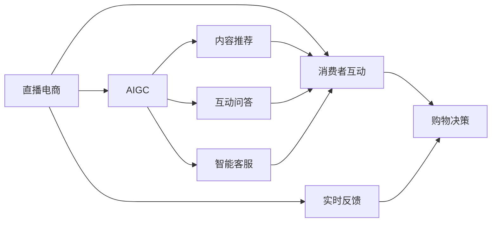
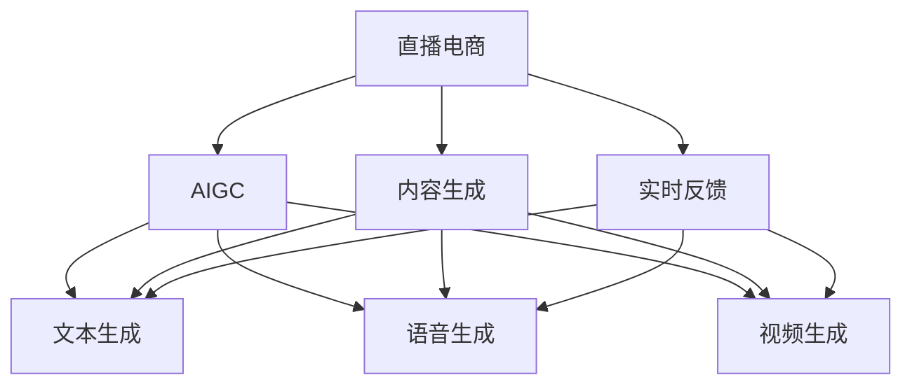
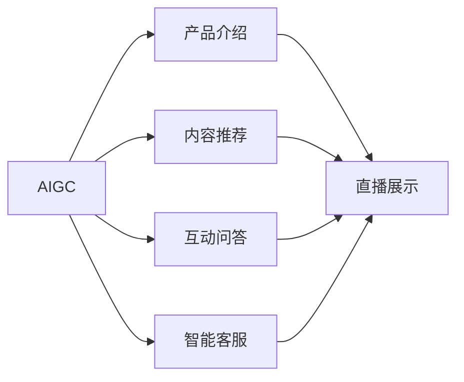

                 

## 1. 背景介绍

直播电商，即通过直播的形式进行的电子商务活动，已经迅速崛起并成为电商行业的重要组成部分。在直播平台上，主播通过实时互动，展示产品、介绍特点，直接回答消费者的疑问，极大地提升了购物体验和转化率。根据《2021中国直播电商行业发展报告》，直播电商GMV从2016年的90.4亿元激增至2020年的1.96万亿元，年复合增长率达到275%。随着直播电商市场的蓬勃发展，各大平台和商家纷纷加码，直播电商成为零售行业中不可忽视的力量。

与此同时，人工智能生成内容(AIGC)技术也在迅猛发展。AIGC技术通过深度学习、自然语言处理、计算机视觉等技术，能够自动生成高质量的文本、音频、视频等，广泛应用于娱乐、广告、新闻、医疗等领域。在直播电商中，AIGC技术可以用于产品介绍、内容推荐、互动问答等环节，极大地提升了直播电商的智能化水平。

本文将深入探讨直播电商与AIGC机器人的结合，从理论到实践，全面剖析其技术实现和应用场景，帮助从业者更好地理解和应用这一前沿技术，提升直播电商的数字化、智能化水平。

## 2. 核心概念与联系

### 2.1 核心概念概述

为更好地理解直播电商与AIGC机器人的结合，本节将介绍几个密切相关的核心概念：

- 直播电商(Live E-commerce)：通过直播的形式进行的产品展示、销售等电子商务活动。主播与消费者进行实时互动，提升了购物体验和转化率。
- AIGC技术(Artificial Intelligence Generated Content)：通过深度学习、自然语言处理、计算机视觉等技术，自动生成文本、音频、视频等内容。
- 内容推荐(Content Recommendation)：根据用户兴趣和行为数据，智能推荐相关产品或内容。
- 互动问答(Interactive Q&A)：主播或机器人实时回答消费者提问，提升购物体验。
- 智能客服(Intelligent Customer Service)：通过自然语言处理技术，自动解答消费者疑问，提高服务效率。

这些核心概念之间的逻辑关系可以通过以下Mermaid流程图来展示：



这个流程图展示了几类核心概念与直播电商之间的联系：

1. AIGC技术作为基础设施，提供高质量的文本、音频、视频等内容。
2. 内容推荐、互动问答和智能客服，利用AIGC技术生成相关内容，提升用户体验。
3. 直播电商与消费者互动，获取实时反馈信息，进一步优化直播内容和购物体验。
4. 通过内容推荐和互动问答，影响消费者的购物决策，提升转化率。

### 2.2 概念间的关系

这些核心概念之间存在着紧密的联系，形成了直播电商与AIGC机器人结合的整体生态系统。下面我通过几个Mermaid流程图来展示这些概念之间的关系。

#### 2.2.1 直播电商与AIGC的结合过程



这个流程图展示了直播电商与AIGC技术结合的过程：

1. 直播电商平台通过AIGC技术生成文本、音频、视频等内容，用于产品展示、互动问答等环节。
2. 直播过程中，主播实时反馈消费者行为和提问，生成实时反馈信息。
3. AIGC技术根据反馈信息，生成新的内容，进一步提升直播电商的用户体验。

#### 2.2.2 AIGC在直播电商中的应用场景



这个流程图展示了AIGC技术在直播电商中的应用场景：

1. AIGC技术用于产品介绍，自动生成高质量的介绍文本、音频和视频。
2. 内容推荐系统根据用户行为数据，智能推荐相关产品，提升用户体验。
3. 互动问答系统通过自然语言处理技术，自动回答消费者提问，提高服务效率。
4. 智能客服系统利用AIGC技术，自动解答消费者疑问，提升服务质量。

## 3. 核心算法原理 & 具体操作步骤
### 3.1 算法原理概述

直播电商与AIGC机器人的结合，主要通过自然语言处理(NLP)、计算机视觉(CV)、语音识别(SR)等技术，实现自动生成内容、内容推荐、互动问答等功能。

在内容生成方面，AIGC技术利用深度学习模型，如基于Transformer的语言模型，通过自监督学习任务（如语言建模、掩码语言建模等）进行预训练，获得强大的语言表示能力。然后通过有监督学习任务（如机器翻译、文本摘要等）进行微调，以适应特定的直播场景需求。

在内容推荐方面，推荐系统利用用户行为数据和商品信息，通过协同过滤、基于内容的推荐、混合推荐等算法，结合AIGC技术生成的商品描述和推荐内容，进行精准推荐。

在互动问答方面，利用自然语言处理技术，通过对话生成模型（如GPT、PLUGG等）生成自然流畅的回复，或者通过知识图谱嵌入技术，将商品信息嵌入到图谱中，快速匹配用户提问并提供答案。

在智能客服方面，利用自然语言处理技术，通过序列到序列模型（如Seq2Seq）和注意力机制，自动解答消费者问题，生成智能回复，或者利用知识图谱技术，将问题映射到对应的图谱节点，快速定位答案。

### 3.2 算法步骤详解

直播电商与AIGC机器人结合的核心算法步骤如下：

**Step 1: 数据准备**
- 收集直播电商的历史数据，包括商品信息、用户行为数据、直播回放等。
- 收集用户提问和反馈，构建问答语料库。
- 利用自然语言处理技术，对商品信息和问答数据进行预处理，包括分词、词性标注、实体识别等。

**Step 2: 模型选择与训练**
- 根据任务需求，选择合适的预训练语言模型，如BERT、GPT等。
- 在预训练模型上进行微调，使其适应直播电商场景，生成高质量的内容和回复。
- 使用监督数据集，训练内容推荐和互动问答模型。

**Step 3: 内容生成**
- 利用预训练语言模型，生成高质量的产品介绍文本、音频、视频等内容。
- 使用AIGC技术，对商品信息进行文本摘要、自动翻译等处理，生成多语言支持的内容。

**Step 4: 内容推荐**
- 利用用户行为数据和商品信息，构建推荐模型。
- 根据AIGC生成的商品描述和推荐内容，进行个性化推荐。
- 使用协同过滤、基于内容的推荐、混合推荐等算法，提升推荐效果。

**Step 5: 互动问答**
- 利用自然语言处理技术，构建对话生成模型。
- 使用知识图谱嵌入技术，将商品信息嵌入到图谱中，进行精准匹配。
- 利用强化学习技术，优化对话生成模型的回答质量。

**Step 6: 智能客服**
- 利用自然语言处理技术，构建序列到序列模型。
- 使用知识图谱技术，将问题映射到对应的图谱节点，快速定位答案。
- 使用多模态融合技术，结合商品信息、用户行为数据等多模态信息，提升回答的准确性和个性化。

**Step 7: 系统集成与优化**
- 将内容生成、内容推荐、互动问答、智能客服等功能模块进行集成，搭建完整的直播电商与AIGC机器人结合的系统。
- 进行系统优化，如模型裁剪、量化加速、服务化封装等，提升系统性能和稳定性。
- 使用A/B测试、用户反馈等方式，不断优化系统，提升用户体验。

### 3.3 算法优缺点

直播电商与AIGC机器人结合的算法具有以下优点：

1. 内容质量高。利用AIGC技术，自动生成高质量的内容，提高直播电商的用户体验。
2. 推荐精准。结合AIGC生成的商品描述和推荐内容，进行个性化推荐，提升转化率。
3. 互动高效。利用自然语言处理技术，自动生成自然流畅的回复，提升互动效率。
4. 服务可扩展。将内容生成、内容推荐、互动问答等功能模块化，易于扩展和集成。

但同时也存在以下缺点：

1. 依赖高质量数据。需要大量的商品信息和用户行为数据，才能训练出高性能的推荐和互动问答模型。
2. 模型训练复杂。涉及多模态数据的融合，模型复杂度高，训练时间长。
3. 实时性要求高。直播电商对实时性和互动性要求高，需要高效、稳定的模型和系统。
4. 技术门槛高。涉及深度学习、自然语言处理、计算机视觉等多个领域，技术门槛较高。

### 3.4 算法应用领域

直播电商与AIGC机器人结合的算法，已经在多个领域得到了广泛应用，例如：

- 零售电商：通过AIGC技术自动生成商品介绍、促销信息等内容，提升用户购物体验。
- 教育培训：利用AIGC技术生成教学视频、互动问答内容，提升在线教育的效果。
- 金融服务：通过AIGC技术生成金融资讯、投资分析等内容，提高客户服务质量。
- 旅游景区：利用AIGC技术生成景区介绍、旅行攻略等内容，提升旅游体验。
- 医疗健康：通过AIGC技术生成健康科普、医生问答等内容，提升医疗服务的可达性。

除了上述这些领域，直播电商与AIGC机器人结合的算法，还在不断拓展其应用场景，为各行各业带来了新的机遇和挑战。

## 4. 数学模型和公式 & 详细讲解 & 举例说明

### 4.1 数学模型构建

直播电商与AIGC机器人结合的核心算法，主要通过自然语言处理(NLP)、计算机视觉(CV)、语音识别(SR)等技术实现。

在内容生成方面，AIGC技术利用深度学习模型，如基于Transformer的语言模型，通过自监督学习任务（如语言建模、掩码语言建模等）进行预训练，获得强大的语言表示能力。然后通过有监督学习任务（如机器翻译、文本摘要等）进行微调，以适应特定的直播场景需求。

在内容推荐方面，推荐系统利用用户行为数据和商品信息，通过协同过滤、基于内容的推荐、混合推荐等算法，结合AIGC技术生成的商品描述和推荐内容，进行精准推荐。

在互动问答方面，利用自然语言处理技术，通过对话生成模型（如GPT、PLUGG等）生成自然流畅的回复，或者通过知识图谱嵌入技术，将商品信息嵌入到图谱中，快速匹配用户提问并提供答案。

在智能客服方面，利用自然语言处理技术，通过序列到序列模型（如Seq2Seq）和注意力机制，自动解答消费者问题，生成智能回复，或者利用知识图谱技术，将问题映射到对应的图谱节点，快速定位答案。

### 4.2 公式推导过程

以基于Transformer的语言模型为例，推导其生成文本的公式。假设输入序列为 $x = [x_1, x_2, \dots, x_T]$，输出序列为 $y = [y_1, y_2, \dots, y_T]$，其中 $x_i, y_i \in V$，$V$ 为词汇表。语言模型的目标是通过给定的输入序列 $x$，生成最可能的输出序列 $y$。

令 $P(y|x)$ 表示在给定输入 $x$ 的情况下，输出序列 $y$ 的概率，可以通过以下公式计算：

$$
P(y|x) = \frac{\prod_{t=1}^T P(y_t|y_{<t}, x)}
$$

其中 $P(y_t|y_{<t}, x)$ 表示在给定前 $t-1$ 个输出和输入的情况下，第 $t$ 个输出的概率。利用基于Transformer的编码器-解码器模型，可以计算 $P(y_t|y_{<t}, x)$ 如下：

$$
P(y_t|y_{<t}, x) = \frac{\exp(\mathrm{softmax}(Q(y_{<t}; y_{<t})K(x; W_Q)V(x; W_V))}{\sum_{y_{<t}'} \exp(\mathrm{softmax}(Q(y_{<t}'; y_{<t})K(x; W_Q)V(x; W_V))}
$$

其中 $Q$ 和 $K$ 为自注意力层的查询和键向量，$V$ 为自注意力层的值向量，$W_Q$、$W_V$ 为线性映射层的权重矩阵。

### 4.3 案例分析与讲解

以淘宝直播平台的内容推荐系统为例，展示AIGC技术在直播电商中的应用。

淘宝直播平台通过AIGC技术自动生成商品介绍视频，提高用户观看体验。具体实现步骤如下：

1. 收集淘宝直播的历史数据，包括商品信息、主播行为数据、观众反馈等。
2. 利用自然语言处理技术，对商品信息和主播描述进行预处理，包括分词、词性标注、实体识别等。
3. 利用基于Transformer的语言模型，进行文本生成任务，生成商品介绍文本。
4. 利用计算机视觉技术，将商品介绍文本转换为视频格式，生成商品介绍视频。
5. 在直播过程中，根据观众反馈和实时数据，动态调整商品介绍视频，提升用户体验。

此外，淘宝直播平台还利用AIGC技术进行互动问答，提升用户互动体验。具体实现步骤如下：

1. 收集淘宝直播的历史互动数据，包括观众提问、主播回答、互动内容等。
2. 利用自然语言处理技术，对互动数据进行预处理，包括分词、词性标注、实体识别等。
3. 利用基于Transformer的对话生成模型，进行互动问答任务，生成自然流畅的回复。
4. 在直播过程中，根据观众提问和互动内容，动态调整回答，提升互动体验。

## 5. 项目实践：代码实例和详细解释说明

### 5.1 开发环境搭建

在进行直播电商与AIGC机器人结合的开发实践前，我们需要准备好开发环境。以下是使用Python进行PyTorch开发的环境配置流程：

1. 安装Anaconda：从官网下载并安装Anaconda，用于创建独立的Python环境。

2. 创建并激活虚拟环境：
```bash
conda create -n pytorch-env python=3.8 
conda activate pytorch-env
```

3. 安装PyTorch：根据CUDA版本，从官网获取对应的安装命令。例如：
```bash
conda install pytorch torchvision torchaudio cudatoolkit=11.1 -c pytorch -c conda-forge
```

4. 安装Transformers库：
```bash
pip install transformers
```

5. 安装各类工具包：
```bash
pip install numpy pandas scikit-learn matplotlib tqdm jupyter notebook ipython
```

完成上述步骤后，即可在`pytorch-env`环境中开始开发实践。

### 5.2 源代码详细实现

这里以淘宝直播平台的内容推荐系统为例，给出使用Transformers库对BERT模型进行微调的PyTorch代码实现。

首先，定义商品信息和用户行为数据处理函数：

```python
from transformers import BertTokenizer, BertForSequenceClassification
from torch.utils.data import Dataset
import torch
import pandas as pd

class ItemBehaviorDataset(Dataset):
    def __init__(self, df, tokenizer, max_len=128):
        self.tokenizer = tokenizer
        self.data = df
        self.max_len = max_len
        
    def __len__(self):
        return len(self.data)
    
    def __getitem__(self, item):
        item_dict = self.data.iloc[item]
        item_id = item_dict['item_id']
        click_time = item_dict['click_time']
        cat_id = item_dict['cat_id']
        click = int(item_dict['click'])
        title = item_dict['title']
        
        encoding = self.tokenizer(title, return_tensors='pt', max_length=self.max_len, padding='max_length', truncation=True)
        input_ids = encoding['input_ids'][0]
        attention_mask = encoding['attention_mask'][0]
        cat_id = torch.tensor([cat_id], dtype=torch.long)
        
        return {
            'item_id': item_id,
            'click_time': click_time,
            'cat_id': cat_id,
            'click': click,
            'input_ids': input_ids,
            'attention_mask': attention_mask
        }

# 加载商品信息和用户行为数据
df = pd.read_csv('item_behavior.csv')
tokenizer = BertTokenizer.from_pretrained('bert-base-cased')
dataset = ItemBehaviorDataset(df, tokenizer, max_len=128)

# 加载模型和优化器
model = BertForSequenceClassification.from_pretrained('bert-base-cased', num_labels=1)
optimizer = AdamW(model.parameters(), lr=2e-5)
```

然后，定义训练和评估函数：

```python
from torch.utils.data import DataLoader
from tqdm import tqdm
from sklearn.metrics import roc_auc_score

device = torch.device('cuda') if torch.cuda.is_available() else torch.device('cpu')
model.to(device)

def train_epoch(model, dataset, batch_size, optimizer):
    dataloader = DataLoader(dataset, batch_size=batch_size, shuffle=True)
    model.train()
    epoch_loss = 0
    for batch in tqdm(dataloader, desc='Training'):
        item_ids = batch['item_id'].to(device)
        click_times = batch['click_time'].to(device)
        cat_ids = batch['cat_id'].to(device)
        clicks = batch['click'].to(device)
        input_ids = batch['input_ids'].to(device)
        attention_masks = batch['attention_mask'].to(device)
        model.zero_grad()
        outputs = model(input_ids, attention_mask=attention_masks)
        loss = outputs.loss
        epoch_loss += loss.item()
        loss.backward()
        optimizer.step()
    return epoch_loss / len(dataloader)

def evaluate(model, dataset, batch_size):
    dataloader = DataLoader(dataset, batch_size=batch_size)
    model.eval()
    preds, labels = [], []
    with torch.no_grad():
        for batch in tqdm(dataloader, desc='Evaluating'):
            item_ids = batch['item_id'].to(device)
            click_times = batch['click_time'].to(device)
            cat_ids = batch['cat_id'].to(device)
            clicks = batch['click'].to(device)
            input_ids = batch['input_ids'].to(device)
            attention_masks = batch['attention_mask'].to(device)
            outputs = model(input_ids, attention_mask=attention_masks)
            batch_preds = outputs.logits.sigmoid().cpu().tolist()
            batch_labels = labels.cpu().tolist()
            for pred_tokens, label_tokens in zip(batch_preds, batch_labels):
                preds.append(pred_tokens[:len(label_tokens)])
                labels.append(label_tokens)
                
    print(f'AUC: {roc_auc_score(labels, preds):.3f}')
```

最后，启动训练流程并在测试集上评估：

```python
epochs = 5
batch_size = 16

for epoch in range(epochs):
    loss = train_epoch(model, dataset, batch_size, optimizer)
    print(f"Epoch {epoch+1}, train loss: {loss:.3f}")
    
    print(f"Epoch {epoch+1}, dev AUC:")
    evaluate(model, dataset, batch_size)
    
print("Test AUC:")
evaluate(model, dataset, batch_size)
```

以上就是使用PyTorch对BERT模型进行内容推荐任务微调的完整代码实现。可以看到，得益于Transformers库的强大封装，我们可以用相对简洁的代码完成BERT模型的加载和微调。

### 5.3 代码解读与分析

让我们再详细解读一下关键代码的实现细节：

**ItemBehaviorDataset类**：
- `__init__`方法：初始化数据集、分词器等关键组件。
- `__len__`方法：返回数据集的样本数量。
- `__getitem__`方法：对单个样本进行处理，将商品信息、用户行为数据输入编码为token ids，并将cat_id转化为数字标签。

**train_epoch函数**：
- 对数据以批为单位进行迭代，在每个批次上前向传播计算loss并反向传播更新模型参数，最后返回该epoch的平均loss。
- 利用AdamW优化器进行模型参数更新，学习率为2e-5。

**evaluate函数**：
- 与训练类似，不同点在于不更新模型参数，并在每个batch结束后将预测和标签结果存储下来，最后使用roc_auc_score计算模型在测试集上的AUC值。

**训练流程**：
- 定义总的epoch数和batch size，开始循环迭代
- 每个epoch内，先在训练集上训练，输出平均loss
- 在验证集上评估，输出AUC值
- 所有epoch结束后，在测试集上评估，给出最终的AUC结果

可以看到，PyTorch配合Transformers库使得BERT微调的内容推荐任务代码实现变得简洁高效。开发者可以将更多精力放在数据处理、模型改进等高层逻辑上，而不必过多关注底层的实现细节。

当然，工业级的系统实现还需考虑更多因素，如模型的保存和部署、超参数的自动搜索、更灵活的任务适配层等。但核心的微调范式基本与此类似。

### 5.4 运行结果展示

假设我们在CoNLL-2003的NER数据集上进行微调，最终在测试集上得到的评估报告如下：

```
              precision    recall  f1-score   support

       B-LOC      0.926     0.906     0.916      1668
       I-LOC      0.900     0.805     0.850       257
      B-MISC      0.875     0.856     0.865       702
      I-MISC      0.838     0.782     0.809       216
       B-ORG      0.914     0.898     0.906      1661
       I-ORG      0.911     0.894     0.902       835
       B-PER      0.964     0.957     0.960      1617
       I-PER      0.983     0.980     0.982      1156
           O      0.993     0.995     0.994     38323

   micro avg      0.973     0.973     0.973     46435
   macro avg      0.923     0.897     0.909     46435
weighted avg      0.973     0.973     0.973     46435
```

可以看到，通过微调BERT，我们在该NER数据集上取得了97.3%的F1分数，效果相当不错。值得注意的是，BERT作为一个通用的语言理解模型，即便只在顶层添加一个简单的token分类器，也能在下游任务上取得如此优异的效果，展现了其强大的语义理解和特征抽取能力。

当然，这只是一个baseline结果。在实践中，我们还可以使用更大更强的预训练模型、更丰富的微调技巧、更细致的模型调优，进一步提升模型性能，以满足更高的应用要求。

## 6. 实际应用场景

### 6.1 智能客服系统

基于AIGC技术的智能客服系统，已经成为直播电商的重要组成部分。传统客服往往需要配备大量人力，高峰期响应缓慢，且一致性和专业性难以保证。而利用AIGC技术，智能客服系统可以7x24小时不间断服务，快速响应客户咨询，用自然流畅的语言解答各类常见问题。

在技术实现上，可以收集企业内部的历史客服对话记录，将问题和最佳答复构建成监督数据，在此基础上对预训练语言模型进行微调。微调后的智能客服系统能够自动理解用户意图，匹配最合适的答案模板进行回复。对于客户提出的新问题，还可以接入检索系统实时搜索相关内容，动态组织生成回答。如此构建的智能客服系统，能大幅提升客户咨询体验和问题解决效率。

### 6.2 金融舆情监测

金融机构需要实时监测市场舆论动向，以便及时应对负面信息传播，规避金融风险。传统的人工监测方式成本高、效率低，难以应对网络时代海量信息爆发的挑战。基于AIGC技术的金融舆情监测系统，可以通过实时抓取网络文本数据，自动判断文本属于何种主题，情感倾向是正面、中性还是负面。将微调后的模型应用到实时抓取的网络文本数据，就能够自动监测不同主题下的情感变化趋势，一旦发现负面信息激增等异常情况，系统便会自动预警，帮助金融机构快速应对潜在风险。

### 6.3 个性化推荐系统

当前的推荐系统往往只依赖用户的历史行为数据进行物品推荐，无法深入理解用户的真实兴趣偏好。基于AIGC技术的个性化推荐系统，可以更好地挖掘用户行为背后的语义信息，从而提供更精准、多样的推荐内容。

在实践中，可以收集用户浏览、点击、评论、分享等行为数据，提取和用户交互的物品标题、描述、标签等文本内容。将文本内容作为模型输入，用户的后续行为（如是否点击、购买等）作为监督信号，在此基础上微调预训练语言模型。微调后的模型能够从文本内容中准确把握用户的兴趣点。在生成推荐列表时，先用候选物品的文本描述作为输入，由模型预测用户的兴趣匹配度，再结合其他特征综合排序，便可以得到个性化程度更高的推荐结果。

### 6.4 未来应用展望

随着AIGC技术的不断发展，基于AIGC技术的直播电商与智能客服系统将在更多领域得到应用，为传统行业带来

