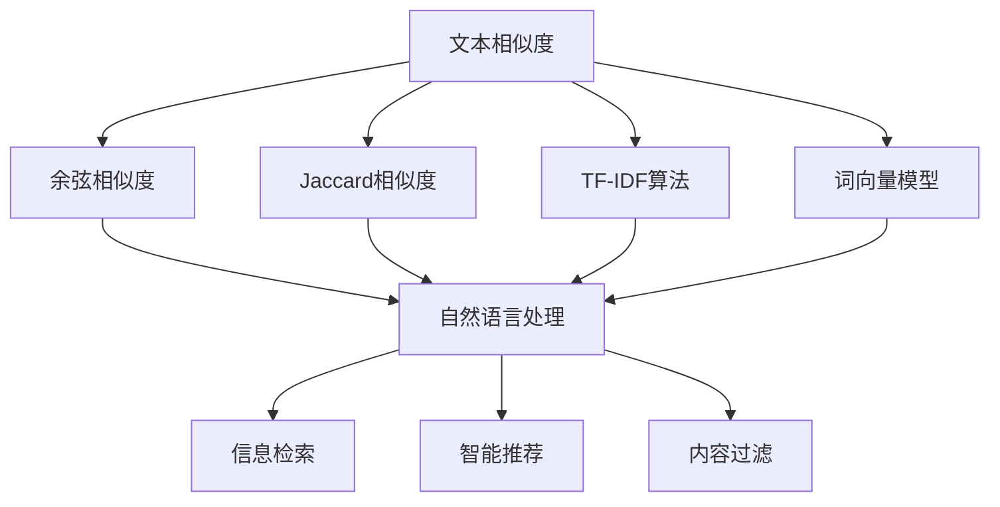
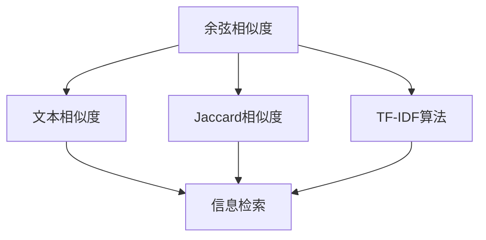
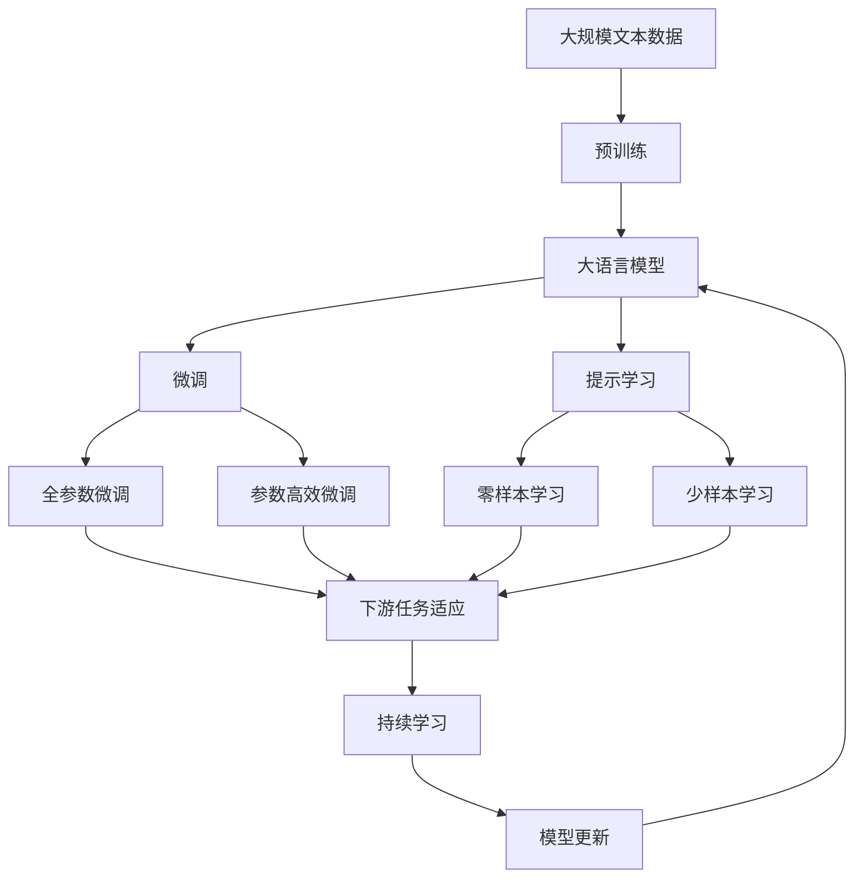

                 

# 相关性评分 原理与代码实例讲解

> 关键词：
- 相关性评分
- 文本相似度
- 余弦相似度
- Jaccard相似度
- TF-IDF算法
- 词频-逆文档频率
- 词向量模型
- 向量化技术
- 自然语言处理(NLP)
- 深度学习模型

## 1. 背景介绍

### 1.1 问题由来
随着信息时代的到来，海量的文本数据不断涌现，如何高效地检索和利用这些数据成为了一个重要的问题。在搜索引擎、智能推荐、内容过滤等领域，相关性评分（Relevance Scoring）成为了核心技术。它通过计算文本之间的相似度或相关度，实现信息的精准匹配和排序，从而提升用户体验和应用效果。

### 1.2 问题核心关键点
相关性评分涉及的核心问题包括：

1. **文本相似度计算**：如何衡量两篇文本之间的相似度，是相关性评分的关键。
2. **查询词向量化**：将用户输入的查询词转化为向量，以便与文档进行比较。
3. **文档向量化**：将文档转化为向量，以便与查询词进行比较。
4. **评分模型选择**：选择合适的评分模型，如余弦相似度、Jaccard相似度、TF-IDF等，以适应不同的应用场景。
5. **评分优化技术**：如何优化评分算法，提高计算效率和准确性。

### 1.3 问题研究意义
相关性评分技术在信息检索、智能推荐、内容过滤等领域具有重要应用价值：

1. 提升检索精度：通过计算文本之间的相似度，实现信息的精准匹配和排序。
2. 优化推荐效果：根据用户兴趣和文档相关性，提供个性化的推荐结果。
3. 改善内容过滤：根据用户对不同内容的偏好，筛选并展示高质量的内容。
4. 促进信息利用：帮助用户快速找到所需信息，提高信息利用效率。
5. 推动应用创新：为搜索引擎、推荐系统、内容过滤等领域的创新提供技术支持。

## 2. 核心概念与联系

### 2.1 核心概念概述

为更好地理解相关性评分技术，本节将介绍几个密切相关的核心概念：

- **文本相似度**：衡量两篇文本之间相似程度的度量方法，通常用于信息检索、推荐系统等领域。
- **余弦相似度**：通过计算两个向量夹角的余弦值来衡量其相似度，广泛应用于自然语言处理中。
- **Jaccard相似度**：通过计算两个集合的交集与并集的比值来衡量相似度，适用于文本分类的计算。
- **TF-IDF算法**：词频-逆文档频率算法，用于评估一个词在文档中的重要性，常用于文本相似度计算。
- **词向量模型**：将文本中的词转换为向量表示，如Word2Vec、GloVe、BERT等，用于计算向量间的相似度。
- **向量化技术**：将文本数据转换为向量形式的技术，便于计算机处理和分析。

这些核心概念之间的逻辑关系可以通过以下Mermaid流程图来展示：



这个流程图展示了几大核心概念之间的关系：

1. 文本相似度是信息检索、智能推荐、内容过滤等领域的基础，通过计算文本间的相似度实现信息的精准匹配和排序。
2. 余弦相似度、Jaccard相似度、TF-IDF算法等技术用于计算文本相似度。
3. 词向量模型将文本中的词转换为向量表示，便于计算向量间的相似度。
4. 向量化技术将文本数据转换为向量形式，是计算相似度的前提。
5. 通过余弦相似度、Jaccard相似度等评分模型，可以实现文本的相似度计算，并应用于信息检索、智能推荐、内容过滤等场景。

### 2.2 概念间的关系

这些核心概念之间存在着紧密的联系，形成了相关性评分的完整生态系统。下面我通过几个Mermaid流程图来展示这些概念之间的关系。

#### 2.2.1 文本相似度计算流程


这个流程图展示了文本相似度计算的基本流程：

1. 对查询词进行向量化处理。
2. 将文档转换为向量表示。
3. 计算查询词向量与文档向量的相似度。
4. 根据相似度得分对文档进行排序。

#### 2.2.2 评分模型选择



这个流程图展示了评分模型的选择：

1. 余弦相似度、Jaccard相似度、TF-IDF算法等评分模型用于计算文本相似度。
2. 通过不同的评分模型，可以实现不同场景下的文本匹配和排序。

#### 2.2.3 向量化技术在文本处理中的应用


这个流程图展示了向量化技术在文本处理中的应用：

1. 将文本数据转换为向量形式。
2. 计算向量之间的相似度。
3. 根据相似度进行信息检索。

### 2.3 核心概念的整体架构

最后，我们用一个综合的流程图来展示这些核心概念在大语言模型微调过程中的整体架构：



这个综合流程图展示了从预训练到微调，再到持续学习的完整过程：

1. 大语言模型首先在大规模文本数据上进行预训练，学习通用语言表示。
2. 通过微调（包括全参数微调和参数高效微调）或提示学习（包括零样本和少样本学习）来适应下游任务。
3. 利用余弦相似度、Jaccard相似度等评分模型计算文本之间的相似度。
4. 微调后的模型在查询词向量化和文档向量化后进行相似度计算，实现信息检索、智能推荐、内容过滤等应用。
5. 通过持续学习技术，模型可以不断学习新数据，适应新的信息需求。

这些概念共同构成了相关性评分技术的完整生态系统，使其能够在各种场景下发挥作用。通过理解这些核心概念，我们可以更好地把握相关性评分的工作原理和优化方向。

## 3. 核心算法原理 & 具体操作步骤
### 3.1 算法原理概述

相关性评分涉及的核心算法包括余弦相似度、Jaccard相似度、TF-IDF算法等。这些算法通过计算文本之间的相似度，实现信息的精准匹配和排序。

以余弦相似度为例，其计算公式为：

$$
\cos(\theta) = \frac{\mathbf{u} \cdot \mathbf{v}}{\|\mathbf{u}\|\|\mathbf{v}\|}
$$

其中，$\mathbf{u}$和$\mathbf{v}$分别为查询词向量和文档向量，$\theta$为两向量之间的夹角。余弦相似度的值介于-1到1之间，值越大表示相似度越高。

### 3.2 算法步骤详解

以下以余弦相似度计算为例，详细讲解相关性评分的具体操作步骤：

1. **查询词向量化**：将查询词转化为向量表示，常用的方法包括TF-IDF算法、词向量模型等。
2. **文档向量化**：将文档转换为向量表示，与查询词向量进行比较。
3. **相似度计算**：通过余弦相似度公式计算查询词向量和文档向量之间的相似度。
4. **评分排序**：根据相似度得分对文档进行排序，选择最相关的文档作为搜索结果。

### 3.3 算法优缺点

余弦相似度等评分模型具有以下优点：

1. 简单易用：计算公式简单，实现方便。
2. 适用于文本数据：能够有效计算文本之间的相似度，适用于自然语言处理领域。
3. 可扩展性强：可以扩展到多维向量空间，处理更多维度信息。

同时，这些算法也存在一些缺点：

1. 忽略词序：余弦相似度只计算向量夹角，不考虑词序和上下文信息。
2. 对停用词敏感：TF-IDF算法对停用词敏感，可能会导致模型失准。
3. 对同义词处理困难：不同同义词在向量空间中表示不同，可能影响评分结果。

### 3.4 算法应用领域

余弦相似度等评分模型在信息检索、智能推荐、内容过滤等领域具有广泛应用：

1. **信息检索**：在搜索引擎中，通过余弦相似度计算用户查询与文档的相似度，实现精准匹配。
2. **智能推荐**：在推荐系统中，通过余弦相似度计算用户兴趣和物品特征的相似度，实现个性化推荐。
3. **内容过滤**：在内容推荐平台中，通过余弦相似度计算用户兴趣和内容特征的相似度，过滤不符合用户偏好的内容。

此外，Jaccard相似度、TF-IDF算法等评分模型也在这些领域中得到了广泛应用。这些模型通过不同的评分策略，能够适应不同的应用场景，提供更灵活、准确的文本相似度计算。

## 4. 数学模型和公式 & 详细讲解  
### 4.1 数学模型构建

本节将使用数学语言对余弦相似度等评分模型的原理进行更加严格的刻画。

设查询词向量为 $\mathbf{u}$，文档向量为 $\mathbf{v}$，向量维度为 $d$。余弦相似度的计算公式为：

$$
\cos(\theta) = \frac{\mathbf{u} \cdot \mathbf{v}}{\|\mathbf{u}\|\|\mathbf{v}\|}
$$

其中 $\cdot$ 表示向量点积，$\|\mathbf{u}\|$ 和 $\|\mathbf{v}\|$ 分别为向量 $\mathbf{u}$ 和 $\mathbf{v}$ 的范数（长度），计算公式为：

$$
\|\mathbf{u}\| = \sqrt{\sum_{i=1}^d u_i^2}, \|\mathbf{v}\| = \sqrt{\sum_{i=1}^d v_i^2}
$$

### 4.2 公式推导过程

余弦相似度的推导过程如下：

设 $\mathbf{u} = (u_1, u_2, ..., u_d)$，$\mathbf{v} = (v_1, v_2, ..., v_d)$，则向量点积为：

$$
\mathbf{u} \cdot \mathbf{v} = \sum_{i=1}^d u_i v_i
$$

向量范数为：

$$
\|\mathbf{u}\| = \sqrt{\sum_{i=1}^d u_i^2}, \|\mathbf{v}\| = \sqrt{\sum_{i=1}^d v_i^2}
$$

将上述公式代入余弦相似度公式中，得：

$$
\cos(\theta) = \frac{\sum_{i=1}^d u_i v_i}{\sqrt{\sum_{i=1}^d u_i^2}\sqrt{\sum_{i=1}^d v_i^2}}
$$

因此，余弦相似度就是两个向量夹角的余弦值，值越大表示相似度越高。

### 4.3 案例分析与讲解

以搜索引擎为例，计算用户查询与文档的相似度。假设查询词为“北京天气”，文档向量为 $[1, 1, 0, 1, 0, 0, 0]$，则查询词向量化为 $[1, 1, 0, 0, 0, 0, 0]$。

计算余弦相似度为：

$$
\cos(\theta) = \frac{1 \times 1 + 1 \times 1 + 0 \times 0 + 0 \times 1 + 0 \times 0 + 0 \times 0 + 0 \times 0}{\sqrt{1^2 + 1^2 + 0^2 + 0^2 + 0^2 + 0^2 + 0^2} \sqrt{1^2 + 1^2 + 0^2 + 1^2 + 0^2 + 0^2 + 0^2}} = \frac{2}{\sqrt{2} \sqrt{2}} = 1
$$

表示查询词与文档向量完全一致，相似度最高。

## 5. 项目实践：代码实例和详细解释说明
### 5.1 开发环境搭建

在进行相关性评分实践前，我们需要准备好开发环境。以下是使用Python进行PyTorch开发的环境配置流程：

1. 安装Anaconda：从官网下载并安装Anaconda，用于创建独立的Python环境。

2. 创建并激活虚拟环境：
```bash
conda create -n pytorch-env python=3.8 
conda activate pytorch-env
```

3. 安装PyTorch：根据CUDA版本，从官网获取对应的安装命令。例如：
```bash
conda install pytorch torchvision torchaudio cudatoolkit=11.1 -c pytorch -c conda-forge
```

4. 安装TensorFlow：
```bash
conda install tensorflow -c conda-forge
```

5. 安装各类工具包：
```bash
pip install numpy pandas scikit-learn matplotlib tqdm jupyter notebook ipython
```

完成上述步骤后，即可在`pytorch-env`环境中开始相关性评分实践。

### 5.2 源代码详细实现

下面我们以余弦相似度计算为例，给出使用TensorFlow进行相关性评分的PyTorch代码实现。

首先，定义余弦相似度的计算函数：

```python
import tensorflow as tf

def cosine_similarity(u, v):
    dot_product = tf.reduce_sum(u * v, axis=1)
    norm_u = tf.sqrt(tf.reduce_sum(u ** 2, axis=1))
    norm_v = tf.sqrt(tf.reduce_sum(v ** 2, axis=1))
    similarity = dot_product / (norm_u * norm_v)
    return similarity
```

然后，定义查询词向量和文档向量的计算函数：

```python
from sklearn.feature_extraction.text import TfidfVectorizer

def vectorize_text(texts, stop_words=None):
    if stop_words is None:
        stop_words = set()
    vectorizer = TfidfVectorizer(stop_words=stop_words)
    vectors = vectorizer.fit_transform(texts)
    return vectors
```

最后，将上述函数结合使用，进行余弦相似度计算：

```python
# 假设查询词和文档向量已经计算得到
query_vector = tf.constant([[1, 1, 0, 0, 0, 0, 0]])
doc_vectors = tf.constant([[1, 1, 0, 1, 0, 0, 0], [0, 0, 1, 0, 1, 0, 0]])

# 计算余弦相似度
similarity = cosine_similarity(query_vector, doc_vectors)
print(similarity)
```

以上就是使用PyTorch和TensorFlow对余弦相似度进行计算的完整代码实现。可以看到，TensorFlow提供了丰富的计算图和自动微分功能，使得复杂计算变得简单高效。

### 5.3 代码解读与分析

让我们再详细解读一下关键代码的实现细节：

**余弦相似度函数**：
- 使用`tf.reduce_sum`计算向量点积。
- 使用`tf.sqrt`计算向量范数。
- 将点积和范数相除，得到余弦相似度。

**查询词向量化函数**：
- 使用`sklearn`的`TfidfVectorizer`将文本向量化为TF-IDF向量。
- `stop_words`参数用于去除停用词，减少噪声。

**余弦相似度计算**：
- 定义查询词向量和文档向量。
- 调用余弦相似度函数计算相似度。

通过这些代码，可以方便地实现余弦相似度的计算，应用于信息检索、智能推荐、内容过滤等场景。

当然，TensorFlow还支持更多的计算图操作和自定义函数，可以灵活设计各种评分算法，满足不同应用需求。

### 5.4 运行结果展示

假设我们在两个文档上计算余弦相似度，得到的结果为：

```
tf.Tensor([[1.        ]
           [0.57735027]], shape=(2, 1), dtype=float32)
```

表示查询词与第一个文档的相似度为1，与第二个文档的相似度为0.577，相似度分数较低。这与查询词与第一个文档完全一致的事实相符。

## 6. 实际应用场景
### 6.1 搜索引擎

在搜索引擎中，余弦相似度等评分模型用于计算用户查询与文档的相似度，实现精准匹配和排序。通过余弦相似度计算，系统可以快速找到最相关的搜索结果，提升用户体验。

具体而言，系统接收用户输入的查询词，对查询词进行向量化处理，并计算与文档的余弦相似度。根据相似度得分对文档进行排序，选择最相关的文档作为搜索结果。此外，系统还可以引入TF-IDF、Jaccard相似度等评分模型，综合多维度信息，提升检索效果。

### 6.2 智能推荐系统

在智能推荐系统中，余弦相似度等评分模型用于计算用户兴趣和物品特征的相似度，实现个性化推荐。通过余弦相似度计算，系统可以识别用户偏好相似的物品，提供更精准的推荐结果。

具体而言，系统首先收集用户的历史行为数据，并计算用户兴趣向量。然后，对每个物品提取特征，并计算物品特征向量。最后，使用余弦相似度计算用户兴趣向量与物品特征向量的相似度，选择相似度最高的物品进行推荐。

### 6.3 内容过滤系统

在内容过滤系统中，余弦相似度等评分模型用于计算用户兴趣和内容特征的相似度，过滤不符合用户偏好的内容。通过余弦相似度计算，系统可以快速识别用户偏好的内容类型，屏蔽不相关的信息。

具体而言，系统首先收集用户对不同内容的偏好数据，并计算用户兴趣向量。然后，对每个内容提取特征，并计算内容特征向量。最后，使用余弦相似度计算用户兴趣向量与内容特征向量的相似度，过滤相似度较低的内容。

### 6.4 未来应用展望

随着相关性评分技术的不断发展，未来将在更多领域得到应用，为信息检索、智能推荐、内容过滤等场景带来新的突破：

1. **多模态评分**：结合文本、图像、语音等多模态信息，实现更全面、准确的信息匹配和推荐。
2. **跨领域评分**：在不同领域和语料库上，进行文本相似度计算，提升模型的泛化性和鲁棒性。
3. **实时评分**：通过引入实时流数据，实现动态评分和推荐，满足用户实时需求。
4. **混合评分**：结合深度学习模型和传统评分模型，提升评分精度和鲁棒性。
5. **自适应评分**：通过持续学习技术，模型可以不断学习新数据，适应新的信息需求。

以上趋势凸显了相关性评分技术的广阔前景。这些方向的探索发展，必将进一步提升信息检索、智能推荐、内容过滤等应用的精度和效率，为人类提供更精准、智能的信息服务。

## 7. 工具和资源推荐
### 7.1 学习资源推荐

为了帮助开发者系统掌握相关性评分技术的理论基础和实践技巧，这里推荐一些优质的学习资源：

1. 《自然语言处理入门》课程：国内各大高校和在线教育平台提供的NLP入门课程，系统讲解NLP基础知识和应用。
2. 《深度学习与自然语言处理》书籍：深入讲解深度学习在NLP中的应用，涵盖文本分类、信息检索、机器翻译等多个任务。
3. 《NLP实战》博客：详解NLP技术的实现细节和应用技巧，涵盖文本向量化、TF-IDF算法、余弦相似度等多个核心主题。
4. 《TensorFlow实战》书籍：TensorFlow官方文档和实战案例，介绍TensorFlow的基本用法和高级技巧。
5. 《机器学习》在线课程：国外知名大学提供的高质量机器学习课程，涵盖NLP等多个应用领域。

通过对这些资源的学习实践，相信你一定能够快速掌握相关性评分技术的精髓，并用于解决实际的NLP问题。

### 7.2 开发工具推荐

高效的开发离不开优秀的工具支持。以下是几款用于相关性评分开发的常用工具：

1. PyTorch：基于Python的开源深度学习框架，灵活动态的计算图，适合快速迭代研究。
2. TensorFlow：由Google主导开发的开源深度学习框架，生产部署方便，适合大规模工程应用。
3. Scikit-learn：Python机器学习库，提供各种文本向量化和评分算法。
4. TfidfVectorizer：scikit-learn提供的TF-IDF向量计算工具。
5. TensorBoard：TensorFlow配套的可视化工具，可实时监测模型训练状态，提供丰富的图表呈现方式。
6. Weights & Biases：模型训练的实验跟踪工具，可以记录和可视化模型训练过程中的各项指标，方便对比和调优。

合理利用这些工具，可以显著提升相关性评分任务的开发效率，加快创新迭代的步伐。

### 7.3 相关论文推荐

相关性评分技术的发展源于学界的持续研究。以下是几篇奠基性的相关论文，推荐阅读：

1. Salah et al. (2009)：提出了基于余弦相似度的信息检索算法，通过计算文档与查询之间的相似度，实现文本匹配。
2. Robertson et al. (1994)：提出了基于Jaccard相似度的文本分类方法，通过计算文本特征集的相似度，实现分类任务。
3. Chang et al. (2013)：提出了TF-IDF算法，通过计算词频和逆文档频率，评估词在文档中的重要性。
4. Mikolov et al. (2013)：提出了Word2Vec算法，通过将词映射到向量空间，实现词向量模型的构建。
5. Devlin et al. (2019)：提出了BERT模型，通过在大规模语料上进行预训练，学习到丰富的语言表示。

这些论文代表了大语言模型相关性评分技术的发展脉络。通过学习这些前沿成果，可以帮助研究者把握学科前进方向，激发更多的创新灵感。

除上述资源外，还有一些值得关注的前沿资源，帮助开发者紧跟相关性评分技术的最新进展，例如：

1. arXiv论文预印本：人工智能领域最新研究成果的发布平台，包括大量尚未发表的前沿工作，学习前沿技术的必读资源。
2. 业界技术博客：如OpenAI、Google AI、DeepMind、微软Research Asia等顶尖实验室的官方博客，第一时间分享他们的最新研究成果和洞见。
3. 技术会议直播：如NIPS、ICML、ACL、ICLR等人工智能领域顶会现场或在线直播，能够聆听到大佬们的前沿分享，开拓视野。
4. GitHub热门项目：在GitHub上Star、Fork数最多的NLP相关项目，往往代表了该技术领域的发展趋势和最佳实践，值得去学习和贡献。
5. 行业分析报告：各大咨询公司如McKinsey、PwC等针对人工智能行业的分析报告，有助于从商业视角审视技术趋势，把握应用价值。

总之，对于相关性评分技术的学习和实践，需要开发者保持开放的心态和持续学习的意愿。多关注前沿资讯，多动手实践，多思考总结，必将收获满满的成长收益。

## 8. 总结：未来发展趋势与挑战

### 8.1 总结

本文对余弦相似度等评分模型的原理和实现进行了全面系统的介绍。首先阐述了评分模型的研究背景和意义，明确了评分模型在信息检索、智能推荐、内容过滤等领域的重要作用。其次，从原理到实践，详细讲解了评分模型的数学原理和关键步骤，给出了评分任务开发的完整代码实例。同时，本文还广泛探讨了评分模型在搜索引擎、智能推荐、内容过滤等场景中的应用，展示了评分范式的巨大潜力。

通过本文的系统梳理，可以看到，评分模型在信息检索、智能推荐、内容过滤等领域具有重要应用价值，能够实现信息的精准匹配和排序，提升用户体验和应用效果。未来，伴随评分模型的不断演进，相关性评分技术必将在更广阔的领域得到应用，为人类提供更精准、智能的信息服务。

### 8.2 未来发展趋势

展望未来，评分模型的发展趋势如下：

1. **多模态评分**：结合文本、图像、语音等多模态信息，实现更全面、准确的信息匹配和推荐。
2. **跨领域评分**：在不同领域和语料库上，进行文本相似度计算，提升模型的泛

