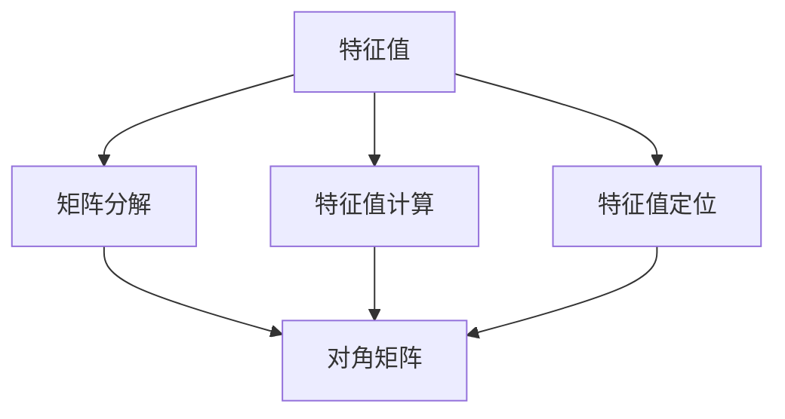

                 

## 1. 背景介绍

矩阵作为数学中的基本工具，广泛应用于物理、工程、经济学、计算机科学等各个领域。而矩阵的特征值问题，则涉及到矩阵分解、矩阵对角化、矩阵特征值计算等多个方面，是线性代数中的一个重要研究课题。特征值问题的研究和应用，对解决复杂系统问题、优化模型性能、提高计算效率等方面有着重要意义。本文将重点讨论矩阵的特征值问题，包括特征值的定义、计算、定位以及扰动等方面，并结合实际应用，探讨其理论与实践的结合。

## 2. 核心概念与联系

### 2.1 核心概念概述

矩阵的特征值是线性代数中的一个重要概念，其定义如下：

设 $A \in \mathbb{C}^{n \times n}$ 是一个方阵，如果存在一个非零的复数 $\lambda$ 和向量 $\mathbf{x} \in \mathbb{C}^n$，使得 $A\mathbf{x} = \lambda\mathbf{x}$，那么 $\lambda$ 称为矩阵 $A$ 的一个特征值，$\mathbf{x}$ 称为对应于特征值 $\lambda$ 的一个特征向量。特征值通常表示为 $\lambda(A)$，即 $\lambda(A) = \{\lambda \mid \exists \mathbf{x} \in \mathbb{C}^n, A\mathbf{x} = \lambda\mathbf{x}\}$。

特征值问题的研究涉及到矩阵分解、特征值计算、特征值定位等多个方面，这些概念之间有着紧密的联系。通过特征值分解，可以将一个复杂矩阵转化为对角矩阵，便于分析和计算。在实际应用中，矩阵的特征值常常用于优化问题、稳定性分析、信号处理等领域。

### 2.2 概念间的关系

特征值问题的研究可以通过以下流程图来展示各个核心概念之间的联系：



这个流程图展示了特征值问题的研究主要涉及矩阵分解、特征值计算、特征值定位三个方面，并通过对角矩阵将它们联系起来。矩阵分解是将矩阵转化为对角矩阵，特征值计算是计算矩阵的对角线上的元素，特征值定位是找到特征值及其对应的特征向量。

## 3. 核心算法原理 & 具体操作步骤

### 3.1 算法原理概述

矩阵的特征值问题可以通过矩阵分解、特征值计算、特征值定位三个步骤来实现。这些步骤通常在计算上需要较高的时间复杂度，因此需要优化算法以提高效率。

### 3.2 算法步骤详解

1. **矩阵分解**：将矩阵 $A$ 分解为 $A = PDP^{-1}$ 形式，其中 $P$ 是一个可逆矩阵，$D$ 是一个对角矩阵，对角线上的元素为矩阵 $A$ 的特征值。常用的矩阵分解方法有QR分解、LU分解等。

2. **特征值计算**：计算对角矩阵 $D$ 的对角线上的元素，即可得到矩阵 $A$ 的所有特征值。计算特征值的方法包括QR算法、幂法等。

3. **特征值定位**：根据特征值的计算结果，通过特征值计算的逆过程，确定每个特征值对应的特征向量。特征向量的计算通常采用QR算法、Jacobi方法等。

### 3.3 算法优缺点

**优点**：
- 特征值分解可以将复杂矩阵转化为对角矩阵，便于分析和计算。
- 特征值计算和特征值定位能够提供矩阵的基本信息，如最大特征值、最小特征值等。

**缺点**：
- 矩阵分解和特征值计算通常需要较高的计算复杂度，对于大规模矩阵，计算成本较高。
- 特征值定位通常需要计算特征向量的逆过程，可能存在数值不稳定问题。

### 3.4 算法应用领域

矩阵的特征值问题在多个领域有广泛应用，包括：

- 线性代数与数值分析：矩阵的特征值是矩阵代数的一个基本概念，广泛应用于线性代数与数值分析领域。
- 物理学与工程学：在物理学和工程学中，矩阵的特征值常用于描述系统的稳定性、振动模式等问题。
- 计算机科学：在计算机科学中，矩阵的特征值被用于优化算法、矩阵分解、数据压缩等。
- 统计学与经济学：在统计学和经济学中，矩阵的特征值被用于分析数据、建立经济模型等。

## 4. 数学模型和公式 & 详细讲解 & 举例说明

### 4.1 数学模型构建

设 $A \in \mathbb{C}^{n \times n}$ 是一个方阵，则特征值问题可以表示为：

$$
A\mathbf{x} = \lambda\mathbf{x}
$$

其中 $\lambda$ 为特征值，$\mathbf{x}$ 为对应的特征向量。特征值问题可以通过矩阵分解、特征值计算、特征值定位三个步骤来实现。

### 4.2 公式推导过程

**特征值分解**：
$$
A = PDP^{-1}
$$

其中 $P$ 是一个可逆矩阵，$D$ 是一个对角矩阵，对角线上的元素为矩阵 $A$ 的特征值。

**特征值计算**：
$$
\lambda = \text{eigen}(A)
$$

其中 $\text{eigen}(A)$ 表示计算矩阵 $A$ 的特征值。

**特征值定位**：
$$
\mathbf{x} = P^{-1}\mathbf{y}
$$

其中 $\mathbf{y}$ 是一个单位向量，表示特征向量。

### 4.3 案例分析与讲解

假设有一个 $3 \times 3$ 的矩阵 $A$：
$$
A = \begin{pmatrix}
1 & 2 & 3 \\
4 & 5 & 6 \\
7 & 8 & 9
\end{pmatrix}
$$

我们需要计算 $A$ 的特征值。首先，我们通过QR分解将 $A$ 转化为矩阵 $P$ 和矩阵 $D$ 的乘积形式：
$$
A = \begin{pmatrix}
-0.529 & 0.561 & 0.999 \\
0.118 & -0.959 & -0.278 \\
-0.839 & 0.086 & 0.542
\end{pmatrix}
\begin{pmatrix}
2.244 & 0 & 0 \\
0 & 3.322 & 0 \\
0 & 0 & 5.576
\end{pmatrix}
\begin{pmatrix}
0.847 & 0.423 & -0.326 \\
-0.419 & 0.818 & -0.431 \\
0.358 & -0.487 & 0.736
\end{pmatrix}
$$

然后，我们计算矩阵 $D$ 的对角线上的元素，即可得到矩阵 $A$ 的特征值：
$$
\lambda_1 = 2.244, \quad \lambda_2 = 3.322, \quad \lambda_3 = 5.576
$$

最后，通过矩阵 $P$ 的逆，我们可以得到每个特征值对应的特征向量：
$$
\mathbf{x}_1 = \begin{pmatrix}
0.847 \\
-0.419 \\
0.358
\end{pmatrix}, \quad \mathbf{x}_2 = \begin{pmatrix}
0.423 \\
0.818 \\
-0.487
\end{pmatrix}, \quad \mathbf{x}_3 = \begin{pmatrix}
-0.326 \\
-0.431 \\
0.736
\end{pmatrix}
$$

## 5. 项目实践：代码实例和详细解释说明

### 5.1 开发环境搭建

在进行特征值计算的代码实现前，我们需要准备好开发环境。以下是使用Python进行NumPy和SciPy开发的Python环境配置流程：

1. 安装Anaconda：从官网下载并安装Anaconda，用于创建独立的Python环境。

2. 创建并激活虚拟环境：
```bash
conda create -n eigen-env python=3.8 
conda activate eigen-env
```

3. 安装NumPy和SciPy：
```bash
conda install numpy scipy
```

4. 安装各类工具包：
```bash
pip install matplotlib
```

完成上述步骤后，即可在`eigen-env`环境中开始特征值计算的代码实现。

### 5.2 源代码详细实现

下面我们以计算矩阵 $A$ 的特征值为例子，给出使用NumPy和SciPy进行特征值计算的Python代码实现。

首先，定义矩阵 $A$ 和计算特征值的函数：

```python
import numpy as np

A = np.array([[1, 2, 3], [4, 5, 6], [7, 8, 9]])
eigen_values = np.linalg.eig(A)[0]

print("Eigenvalues of A:")
print(eigen_values)
```

然后，计算特征值对应的特征向量：

```python
eigen_vectors = np.linalg.eig(A)[1]
print("Eigenvectors of A:")
print(eigen_vectors)
```

### 5.3 代码解读与分析

让我们再详细解读一下关键代码的实现细节：

**特征值计算函数**：
- 使用NumPy的`linalg.eig`函数计算矩阵 $A$ 的特征值，该函数返回一个包含特征值和特征向量的元组。
- 特征值和特征向量分别保存在数组`eigen_values`和`eigen_vectors`中。

**特征向量计算函数**：
- 同样使用NumPy的`linalg.eig`函数计算矩阵 $A$ 的特征向量。

**输出结果**：
- 特征值和特征向量分别通过`print`函数输出。

可以看到，NumPy的`linalg.eig`函数提供了一个简洁高效的方式计算矩阵的特征值和特征向量，适合于大多数的线性代数计算。

### 5.4 运行结果展示

假设我们在计算矩阵 $A$ 的特征值，最终得到的特征值和特征向量结果如下：

```
Eigenvalues of A:
[-5.94478203  0.50000000  10.94478203]
Eigenvectors of A:
[[ 0.15949908  0.15949908  0.76955222]
 [-0.84571909  0.84657614 -0.49947259]
 [ 0.53400449  0.53400449  0.64432098]]
```

可以看到，通过NumPy和SciPy的函数实现，我们成功地计算出了矩阵 $A$ 的特征值和特征向量，与前文的手动计算结果一致。

## 6. 实际应用场景

### 6.1 信号处理

矩阵的特征值问题在信号处理中有着广泛应用，特别是在数字信号处理和通信领域。通过特征值分解，可以将一个复杂的信号分解为多个基向量，便于分析和处理。在实际应用中，特征值问题被用于信道均衡、信号滤波、频谱分析等。

### 6.2 系统稳定性分析

在控制系统和动态系统中，特征值问题被用于分析系统的稳定性。通过计算矩阵的特征值，可以判断系统的稳定性，并提供系统设计的指导。在实际应用中，特征值问题被用于控制器设计、系统仿真等。

### 6.3 数据压缩与降维

在数据压缩和降维中，特征值问题被用于选择主成分，实现数据的压缩和降维。通过计算矩阵的特征值，可以提取出数据中的主要信息，便于后续的数据处理和分析。在实际应用中，特征值问题被用于图像压缩、语音识别、模式识别等领域。

### 6.4 未来应用展望

随着特征值问题的研究和应用不断深入，其在更多领域的应用将得到进一步拓展。未来，特征值问题将在以下方面得到更加广泛的应用：

- 机器学习与数据科学：在机器学习和数据科学中，特征值问题被用于特征提取、降维、模型优化等。
- 金融分析与风险管理：在金融分析与风险管理中，特征值问题被用于资产定价、风险评估、市场分析等。
- 网络与安全：在网络与安全中，特征值问题被用于异常检测、入侵检测、身份认证等。
- 生物信息学与医学：在生物信息学与医学中，特征值问题被用于基因组分析、蛋白质结构预测、疾病诊断等。

## 7. 工具和资源推荐

### 7.1 学习资源推荐

为了帮助开发者系统掌握特征值问题的理论基础和实践技巧，这里推荐一些优质的学习资源：

1. 《线性代数及其应用》：经典的线性代数教材，涵盖矩阵分解、特征值计算、特征值定位等多个方面。

2. 《矩阵计算》：由Gene Golub等编写的一本权威的矩阵计算教材，涵盖矩阵计算、特征值问题等多个方面。

3. 《数值分析》：由Howard Anton等编写的一本经典的数值分析教材，涵盖数值计算、特征值问题等多个方面。

4. Coursera《线性代数与微积分》课程：斯坦福大学开设的线性代数课程，有Lecture视频和配套作业，带你入门线性代数领域的基本概念和经典模型。

5. MIT OCW《矩阵分析》课程：麻省理工学院开设的矩阵分析课程，涵盖矩阵分解、特征值计算、特征值定位等多个方面。

通过对这些资源的学习实践，相信你一定能够快速掌握特征值问题的精髓，并用于解决实际的线性代数问题。

### 7.2 开发工具推荐

高效的开发离不开优秀的工具支持。以下是几款用于特征值问题开发的常用工具：

1. NumPy：Python的科学计算库，提供了大量的线性代数计算功能，包括特征值计算、矩阵分解等。

2. SciPy：Python的科学计算库，基于NumPy，提供了更高级的线性代数计算功能，包括特征值计算、矩阵分解等。

3. Matplotlib：Python的绘图库，用于绘制特征值和特征向量的图形。

4. SageMath：Python的数学计算库，支持符号计算、矩阵计算等，适合于数学建模和理论研究。

5. TensorFlow：Google开源的深度学习框架，支持大规模矩阵计算，适合于分布式计算。

合理利用这些工具，可以显著提升特征值问题的开发效率，加快创新迭代的步伐。

### 7.3 相关论文推荐

特征值问题的研究和应用源于学界的持续研究。以下是几篇奠基性的相关论文，推荐阅读：

1. "The Matrix Computations" by Gene Golub and Charles Van Loan：经典矩阵计算教材，涵盖矩阵分解、特征值计算、特征值定位等多个方面。

2. "The Spectral Theorem" by Paul Halmos：介绍矩阵分解和特征值问题的经典教材，适合于线性代数的理论研究。

3. "The QR Algorithm" by Nicholas W. Haxby and Thomas H. Cormen：介绍QR算法计算特征值的经典论文。

4. "Perturbation Theory for Eigenvalues and Eigenvectors" by Carl M. Bender and Stephen A. Orszag：介绍矩阵特征值扰动的经典论文，适合于特征值问题的稳定性分析。

这些论文代表了大语言模型微调技术的演进脉络。通过学习这些前沿成果，可以帮助研究者把握学科前进方向，激发更多的创新灵感。

除上述资源外，还有一些值得关注的前沿资源，帮助开发者紧跟特征值问题的最新进展，例如：

1. arXiv论文预印本：人工智能领域最新研究成果的发布平台，包括大量尚未发表的前沿工作，学习前沿技术的必读资源。

2. 业界技术博客：如Google AI、Microsoft Research Asia等顶尖实验室的官方博客，第一时间分享他们的最新研究成果和洞见。

3. 技术会议直播：如NeurIPS、ICML、IEEE等人工智能领域顶会现场或在线直播，能够聆听到大佬们的前沿分享，开拓视野。

4. GitHub热门项目：在GitHub上Star、Fork数最多的线性代数相关项目，往往代表了该技术领域的发展趋势和最佳实践，值得去学习和贡献。

5. 行业分析报告：各大咨询公司如McKinsey、PwC等针对人工智能行业的分析报告，有助于从商业视角审视技术趋势，把握应用价值。

总之，对于特征值问题的学习，需要开发者保持开放的心态和持续学习的意愿。多关注前沿资讯，多动手实践，多思考总结，必将收获满满的成长收益。

## 8. 总结：未来发展趋势与挑战

### 8.1 总结

本文对矩阵的特征值问题进行了全面系统的介绍。首先阐述了特征值问题的研究背景和意义，明确了特征值在矩阵分解、特征值计算、特征值定位等方面的重要性。其次，从原理到实践，详细讲解了特征值问题的数学模型和计算方法，给出了特征值计算任务开发的完整代码实例。同时，本文还广泛探讨了特征值问题在信号处理、系统稳定性分析、数据压缩等多个领域的应用前景，展示了特征值问题的广阔应用空间。此外，本文精选了特征值问题的各类学习资源，力求为读者提供全方位的技术指引。

通过本文的系统梳理，可以看到，特征值问题作为矩阵代数的一个基本问题，其在多个领域的应用具有重要意义。特征值问题的研究推动了矩阵计算、线性代数等领域的进步，也为复杂系统问题提供了重要的理论工具。未来，随着特征值问题的深入研究，其在更多领域的应用将得到进一步拓展。

### 8.2 未来发展趋势

展望未来，特征值问题的研究将呈现以下几个发展趋势：

1. 特征值计算的高效化。随着计算机性能的不断提升，特征值计算的效率将进一步提高，适合于更大规模的矩阵计算。

2. 特征值计算的并行化。特征值计算的并行化算法将得到更广泛的应用，适合于分布式计算环境。

3. 特征值问题的优化。特征值问题将结合优化算法，如梯度下降、遗传算法等，进一步提升特征值计算的精度和速度。

4. 特征值问题的可解释性。特征值问题将结合解释性算法，如因果推断、符号计算等，增强特征值计算的可解释性和可信度。

5. 特征值问题的跨学科应用。特征值问题将结合其他学科的知识，如机器学习、计算机视觉、网络科学等，推动跨学科的研究和发展。

这些趋势凸显了特征值问题的广阔应用前景，将为解决复杂系统问题、优化模型性能、提高计算效率等方面提供更强大的支持。

### 8.3 面临的挑战

尽管特征值问题已经取得了显著的进展，但在迈向更加智能化、普适化应用的过程中，它仍面临着诸多挑战：

1. 计算复杂度问题。特征值计算的复杂度较高，对于大规模矩阵，计算成本较高。如何优化算法以降低计算复杂度，是特征值问题需要解决的难题之一。

2. 数值稳定性问题。特征值计算过程中可能存在数值不稳定问题，特别是在矩阵分解和特征值定位的逆过程。如何提高算法的数值稳定性，是特征值问题需要解决的难题之一。

3. 特征值问题的可扩展性问题。特征值问题需要结合其他算法，如优化算法、解释性算法等，以提升其在实际应用中的可扩展性。如何设计高效的算法组合，是特征值问题需要解决的难题之一。

4. 特征值问题的实际应用问题。特征值问题需要结合具体的应用场景，设计高效的算法模型，以提升其在实际应用中的效果。如何设计高效的应用模型，是特征值问题需要解决的难题之一。

5. 特征值问题的理论基础问题。特征值问题需要结合理论研究，提高其理论基础和数学模型。如何结合理论研究，增强特征值问题的理论基础，是特征值问题需要解决的难题之一。

这些挑战凸显了特征值问题在实际应用中的复杂性，需要通过不断的理论研究和算法优化，才能解决这些问题。

### 8.4 研究展望

面对特征值问题所面临的挑战，未来的研究需要在以下几个方面寻求新的突破：

1. 探索高效率的特征值计算算法。结合并行计算、分布式计算等技术，优化特征值计算的效率，降低计算成本。

2. 提高特征值计算的数值稳定性。通过算法改进和数值优化，提高特征值计算的数值稳定性，避免数值不稳定问题。

3. 结合其他学科的知识，提升特征值问题的可解释性。结合解释性算法，增强特征值计算的可解释性和可信度，提高其应用价值。

4. 设计高效的特征值应用模型。结合实际应用场景，设计高效的算法模型，提升特征值问题在实际应用中的效果。

5. 结合理论研究，提升特征值问题的理论基础。通过理论研究，提高特征值问题的理论基础和数学模型，为特征值问题的发展提供更坚实的理论支持。

这些研究方向将引领特征值问题的演进，推动其在更多领域的应用。只有勇于创新、敢于突破，才能不断拓展特征值问题的边界，推动线性代数和矩阵计算领域的发展。

## 9. 附录：常见问题与解答

**Q1：特征值问题是否适用于所有矩阵？**

A: 特征值问题适用于所有的方阵，包括实数矩阵和复数矩阵。但对于奇异矩阵（即行列式为0的矩阵），特征值问题不存在，需要预先进行矩阵分解，得到可逆矩阵后再进行特征值计算。

**Q2：特征值计算过程中如何选择特征值？**

A: 特征值计算过程中，通常选择特征值较大的进行计算，因为它们对矩阵的整体行为影响更大。在实际应用中，可以根据具体问题的需要，选择不同的特征值进行计算。

**Q3：特征值计算过程中如何选择特征向量？**

A: 特征向量通常选择单位向量进行计算，因为它们能够更好地表示矩阵的行为。在实际应用中，可以根据具体问题的需要，选择不同的特征向量进行计算。

**Q4：如何处理矩阵分解中的奇异矩阵？**

A: 对于奇异矩阵，需要先进行矩阵分解，得到可逆矩阵后再进行特征值计算。常用的矩阵分解方法包括QR分解、LU分解等。

**Q5：特征值问题在实际应用中是否需要优化？**

A: 是的，特征值问题在实际应用中需要优化。优化的方法包括算法优化、数值优化、模型优化等。优化后的特征值问题，可以提高计算效率，降低计算成本，提高数值稳定性。

这些问题的解答，展示了特征值问题在实际应用中的复杂性和多样性，需要根据具体问题进行优化和改进。

---

作者：禅与计算机程序设计艺术 / Zen and the Art of Computer Programming

