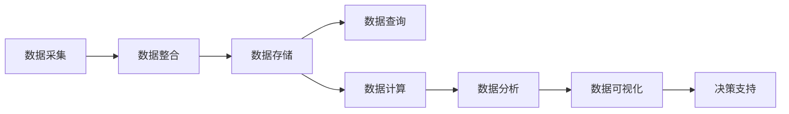

                 

# 数字实体的自动化应用与发展

在信息化和数字化的浪潮下，数字实体在各个领域的应用已经成为了推动社会进步的重要力量。本文将深入探讨数字实体的定义、自动化应用及其发展趋势，旨在为相关领域的开发者和研究者提供全面的技术指导和理论基础。

## 1. 背景介绍

### 1.1 问题的由来

数字实体的概念最早源自信息科技领域，随着大数据和人工智能技术的发展，数字实体已经成为推动各行业数字化转型的关键要素。数字实体指的是可以量化、数字化的事物或概念，包括但不限于组织、产品、人、地点、事件等。

在实际应用中，数字实体可以通过数字化的方式存储、处理、分析和展现，实现智能化、自动化、高效化的应用。例如，在医疗领域，病人的数字化档案、医疗设备的数据、实验室的检测结果等，都是典型的数字实体。通过这些数字实体的自动化应用，医疗行业可以实现更精准的诊断、更有效的治疗，提升医疗服务的质量和效率。

### 1.2 问题的核心关键点

数字实体的自动化应用，主要关注以下几个核心关键点：

- **数据采集与整合**：通过传感器、数据库等手段，采集数字实体的多维数据，并进行有效的整合和管理。
- **数据存储与查询**：使用分布式数据库、云存储等技术，存储数字实体的数据，并提供高效的数据查询服务。
- **数据计算与分析**：通过大数据技术、人工智能算法，对数字实体的数据进行计算与分析，提取有价值的信息。
- **数据可视化与展现**：将分析结果以图表、报表等形式进行可视化展现，便于决策者进行理解和决策。

数字实体的自动化应用，是一个涉及数据科学、计算机科学、网络工程等多个领域的综合性问题，需要综合考虑数据采集、存储、计算、分析和展现等多方面的技术。

## 2. 核心概念与联系

### 2.1 核心概念概述

- **数字实体**：可量化、数字化的实体，如组织、产品、人、地点、事件等。
- **数据采集与整合**：通过传感器、数据库等手段，采集数字实体的多维数据，并进行有效的整合和管理。
- **数据存储与查询**：使用分布式数据库、云存储等技术，存储数字实体的数据，并提供高效的数据查询服务。
- **数据计算与分析**：通过大数据技术、人工智能算法，对数字实体的数据进行计算与分析，提取有价值的信息。
- **数据可视化与展现**：将分析结果以图表、报表等形式进行可视化展现，便于决策者进行理解和决策。

### 2.2 核心概念间的关系

数字实体的自动化应用，涉及数据采集、存储、计算、分析和展现等多个环节。这些环节之间存在着紧密的联系和相互依赖的关系。通过合理的架构设计，可以实现数据的高效流动和利用，从而提升数字实体的自动化应用水平。

以下是一个简单的Mermaid流程图，展示了数字实体自动化应用的主要环节及其关系：



这个流程图展示了数字实体自动化应用的主要环节及其相互关系。数据采集是整个过程的基础，数据整合和存储是数据流动的保障，数据计算和分析是数据价值提取的关键，数据可视化和决策支持则是最终的应用目标。

## 3. 核心算法原理 & 具体操作步骤

### 3.1 算法原理概述

数字实体的自动化应用，主要依赖于大数据技术、人工智能算法和计算机网络技术。核心算法原理可以概括为以下几个方面：

- **数据采集与整合**：通过传感器、数据库等手段，采集数字实体的多维数据，并进行有效的整合和管理。
- **数据存储与查询**：使用分布式数据库、云存储等技术，存储数字实体的数据，并提供高效的数据查询服务。
- **数据计算与分析**：通过大数据技术、人工智能算法，对数字实体的数据进行计算与分析，提取有价值的信息。
- **数据可视化与展现**：将分析结果以图表、报表等形式进行可视化展现，便于决策者进行理解和决策。

### 3.2 算法步骤详解

数字实体的自动化应用，主要包括以下几个关键步骤：

**Step 1: 数据采集与整合**

- 选择合适的传感器、数据源，进行数据采集。
- 使用数据清洗、转换等技术，对采集到的数据进行整合和标准化。
- 设计数据模型，存储和管理整合后的数据。

**Step 2: 数据存储与查询**

- 选择适合的数据存储技术，如分布式数据库、云存储等，存储数字实体的数据。
- 设计高效的数据查询方案，保证数据查询的速度和准确性。
- 使用索引、缓存等技术，提升数据查询的效率。

**Step 3: 数据计算与分析**

- 选择合适的数据计算框架，如Spark、Flink等，对数字实体的数据进行计算。
- 使用机器学习、深度学习等算法，对数据进行分析和建模。
- 提取有价值的信息，生成分析报告和预测结果。

**Step 4: 数据可视化与展现**

- 使用数据可视化工具，如Tableau、PowerBI等，将分析结果进行可视化展现。
- 设计友好的用户界面，便于决策者进行数据理解和决策。
- 使用交互式报表、仪表盘等形式，提供动态的数据展现。

### 3.3 算法优缺点

数字实体的自动化应用，具有以下几个优点：

- **高效性**：通过自动化技术，数据采集、存储、计算和分析等环节，可以大幅提升效率，减少人力和时间成本。
- **准确性**：使用先进的算法和技术，可以提取更准确、更有价值的信息，提升决策的科学性。
- **可扩展性**：通过分布式计算和云存储等技术，可以支持大规模数据的处理和存储，具备良好的可扩展性。

同时，数字实体的自动化应用也存在一些缺点：

- **数据隐私和安全问题**：数字实体的数据往往包含敏感信息，数据隐私和安全问题需要特别注意。
- **数据质量问题**：数据采集、整合和存储过程中，难免出现错误和噪声，影响数据分析的准确性。
- **技术复杂性**：数字实体的自动化应用，涉及多种技术和工具，需要较高的技术门槛。

### 3.4 算法应用领域

数字实体的自动化应用，已经在多个领域得到了广泛应用，如医疗、金融、电商、智慧城市等。以下是几个典型的应用场景：

- **医疗领域**：通过采集病人的电子病历、健康数据、医疗设备数据等数字实体，进行数据整合和分析，可以提升医疗服务的精准度和效率，改善病人治疗效果。
- **金融领域**：通过采集金融市场数据、客户交易数据等数字实体，进行数据计算和分析，可以预测市场趋势、评估客户风险、优化投资策略。
- **电商领域**：通过采集客户购买行为数据、产品评价数据等数字实体，进行数据计算和分析，可以提升客户体验、优化商品推荐、提升销售额。
- **智慧城市**：通过采集城市交通数据、环境数据、公共设施数据等数字实体，进行数据整合和分析，可以提升城市管理效率，改善市民生活质量。

## 4. 数学模型和公式 & 详细讲解 & 举例说明

### 4.1 数学模型构建

在数字实体的自动化应用中，常用的数学模型包括回归模型、分类模型、聚类模型等。以下是几种常见的数学模型及其构建方法：

**线性回归模型**：假设数字实体的数据 $y$ 和影响因素 $x_1, x_2, ..., x_n$ 之间存在线性关系，可以表示为：

$$
y = \beta_0 + \beta_1x_1 + \beta_2x_2 + ... + \beta_nx_n + \epsilon
$$

其中 $\beta_0, \beta_1, \beta_2, ..., \beta_n$ 为回归系数，$\epsilon$ 为误差项。

**逻辑回归模型**：假设数字实体的数据 $y$ 和影响因素 $x_1, x_2, ..., x_n$ 之间存在逻辑回归关系，可以表示为：

$$
\log(\frac{P(y=1)}{1-P(y=1)}) = \beta_0 + \beta_1x_1 + \beta_2x_2 + ... + \beta_nx_n
$$

其中 $P(y=1)$ 表示事件发生的概率，$P(y=0)$ 表示事件不发生的概率。

**K-means聚类模型**：假设数字实体的数据 $x_1, x_2, ..., x_n$ 分为 $k$ 个聚类，可以表示为：

$$
\min_{\mu_i, \sigma_i} \sum_{x_j \in \mathcal{C}_i} ||x_j - \mu_i||^2_2 + \lambda||\sigma_i||^2_2
$$

其中 $\mathcal{C}_i$ 表示聚类 $i$ 的样本，$\mu_i$ 表示聚类中心，$\sigma_i$ 表示聚类半径，$\lambda$ 表示聚类半径的惩罚系数。

### 4.2 公式推导过程

以线性回归模型为例，其基本原理为通过最小化误差项，找到最优的回归系数 $\beta_0, \beta_1, \beta_2, ..., \beta_n$。根据最小二乘法，可以推导出回归系数的计算公式：

$$
\hat{\beta} = (X^TX)^{-1}X^Ty
$$

其中 $X$ 为特征矩阵，$y$ 为样本数据，$\hat{\beta}$ 为回归系数。

以K-means聚类模型为例，其基本原理为通过迭代优化，找到最优的聚类中心 $\mu_i$ 和聚类半径 $\sigma_i$。根据K-means算法，可以推导出聚类中心的更新公式：

$$
\mu_i = \frac{1}{|\mathcal{C}_i|} \sum_{x_j \in \mathcal{C}_i} x_j
$$

其中 $|\mathcal{C}_i|$ 表示聚类 $i$ 的样本数量。

### 4.3 案例分析与讲解

假设我们有一个电商数据集，包含客户购买行为数据、产品评价数据等数字实体。通过线性回归模型和逻辑回归模型，可以分析客户的购买行为和产品评价之间的关系。具体步骤如下：

**Step 1: 数据预处理**  
将客户购买行为数据和产品评价数据进行清洗和转换，去除缺失值和异常值，进行标准化处理。

**Step 2: 特征工程**  
根据业务需求，选择和构建合适的特征，如客户年龄、购买次数、产品价格等。

**Step 3: 模型训练**  
使用训练集数据，对线性回归模型和逻辑回归模型进行训练。通过交叉验证等技术，选择最优的模型参数。

**Step 4: 模型评估**  
使用测试集数据，对训练好的模型进行评估。计算模型的均方误差、准确率、召回率等指标，评估模型的性能。

**Step 5: 模型应用**  
将训练好的模型应用于实际业务场景，根据客户购买行为和产品评价数据，进行客户推荐、产品定价等决策。

## 5. 项目实践：代码实例和详细解释说明

### 5.1 开发环境搭建

在进行数字实体的自动化应用项目开发时，需要搭建合适的开发环境。以下是Python环境搭建的步骤：

1. 安装Anaconda：从官网下载并安装Anaconda，用于创建独立的Python环境。
2. 创建并激活虚拟环境：
```bash
conda create -n pyenv python=3.8 
conda activate pyenv
```
3. 安装Python科学计算库：
```bash
conda install numpy pandas matplotlib scikit-learn jupyter notebook
```
4. 安装Spark：
```bash
conda install pyarrow dask
```
5. 安装TensorFlow和Keras：
```bash
conda install tensorflow keras
```

完成上述步骤后，即可在虚拟环境中开始数字实体的自动化应用项目开发。

### 5.2 源代码详细实现

以下是一个简单的电商数据分析项目，用于分析客户购买行为和产品评价之间的关系。

```python
import pandas as pd
import numpy as np
from sklearn.linear_model import LinearRegression
from sklearn.model_selection import train_test_split
from sklearn.metrics import mean_squared_error, r2_score

# 数据预处理
data = pd.read_csv('ecommerce_data.csv')
data = data.dropna()

# 特征工程
X = data[['age', 'purchase_frequency', 'product_price']]
y = data['score']

# 数据拆分
X_train, X_test, y_train, y_test = train_test_split(X, y, test_size=0.2, random_state=42)

# 模型训练
model = LinearRegression()
model.fit(X_train, y_train)

# 模型评估
y_pred = model.predict(X_test)
print('均方误差：', mean_squared_error(y_test, y_pred))
print('决定系数：', r2_score(y_test, y_pred))

# 模型应用
new_data = pd.DataFrame({'age': [30], 'purchase_frequency': [10], 'product_price': [50]})
y_new = model.predict(new_data)
print('预测得分：', y_new)
```

### 5.3 代码解读与分析

让我们再详细解读一下关键代码的实现细节：

**数据预处理**：
- `data = pd.read_csv('ecommerce_data.csv')`：读取电商数据集。
- `data = data.dropna()`：去除缺失值。

**特征工程**：
- `X = data[['age', 'purchase_frequency', 'product_price']]`：选择客户年龄、购买次数、产品价格等特征。
- `y = data['score']`：选择产品评价得分作为目标变量。

**模型训练**：
- `model = LinearRegression()`：创建线性回归模型。
- `model.fit(X_train, y_train)`：使用训练集数据训练模型。

**模型评估**：
- `y_pred = model.predict(X_test)`：使用测试集数据进行预测。
- `print('均方误差：', mean_squared_error(y_test, y_pred))`：计算预测结果与真实结果的均方误差。
- `print('决定系数：', r2_score(y_test, y_pred))`：计算模型的决定系数（R^2）。

**模型应用**：
- `new_data = pd.DataFrame({'age': [30], 'purchase_frequency': [10], 'product_price': [50]})`：创建新的数据集，用于预测。
- `y_new = model.predict(new_data)`：使用模型进行预测。

## 6. 实际应用场景

### 6.1 医疗领域

在医疗领域，数字实体的自动化应用可以提升医疗服务的精准度和效率，改善病人治疗效果。例如，通过采集病人的电子病历、健康数据、医疗设备数据等数字实体，进行数据整合和分析，可以：

- **精准诊断**：通过数据整合和分析，发现病人的病情特征和风险因素，提升医生的诊断精准度。
- **个性化治疗**：根据病人的健康数据和基因信息，制定个性化的治疗方案，提高治疗效果。
- **治疗监控**：通过医疗设备数据，实时监控病人的治疗进程，及时调整治疗方案。

### 6.2 金融领域

在金融领域，数字实体的自动化应用可以预测市场趋势、评估客户风险、优化投资策略。例如，通过采集金融市场数据、客户交易数据等数字实体，进行数据计算和分析，可以：

- **市场预测**：通过分析历史交易数据和市场数据，预测未来的市场趋势和价格波动。
- **客户风险评估**：通过分析客户的交易行为和信用记录，评估客户的信用风险和违约风险。
- **投资策略优化**：通过分析市场数据和客户数据，优化投资组合和投资策略，提高投资回报率。

### 6.3 电商领域

在电商领域，数字实体的自动化应用可以提升客户体验、优化商品推荐、提升销售额。例如，通过采集客户购买行为数据、产品评价数据等数字实体，进行数据计算和分析，可以：

- **客户画像分析**：通过分析客户的购买行为和偏好，构建客户画像，进行个性化推荐。
- **商品推荐优化**：通过分析客户评价和商品数据，优化商品推荐算法，提升客户满意度和转化率。
- **库存管理优化**：通过分析销售数据和库存数据，优化库存管理和供应链管理，降低库存成本。

### 6.4 智慧城市

在智慧城市领域，数字实体的自动化应用可以提升城市管理效率，改善市民生活质量。例如，通过采集城市交通数据、环境数据、公共设施数据等数字实体，进行数据整合和分析，可以：

- **交通管理优化**：通过分析交通数据，优化交通信号灯控制，减少交通拥堵。
- **环境监测提升**：通过分析环境数据，实时监测空气质量、水质等环境指标，提升城市环境质量。
- **公共设施管理**：通过分析公共设施数据，优化路灯控制、垃圾处理等公共设施管理，提升市民生活质量。

## 7. 工具和资源推荐

### 7.1 学习资源推荐

为了帮助开发者系统掌握数字实体的自动化应用的理论基础和实践技巧，这里推荐一些优质的学习资源：

1. **《Python数据科学手册》**：详细介绍了Python在数据科学中的应用，包括数据处理、分析、可视化等。
2. **《机器学习实战》**：介绍了常用的机器学习算法及其应用，包括回归模型、分类模型、聚类模型等。
3. **《大数据技术与应用》**：介绍了大数据技术的原理和应用，包括分布式计算、数据存储、数据处理等。
4. **《TensorFlow官方文档》**：TensorFlow的官方文档，提供了丰富的教程和样例，适合初学者快速上手。
5. **《Keras官方文档》**：Keras的官方文档，提供了丰富的API和示例，适合快速开发机器学习模型。

### 7.2 开发工具推荐

高效的开发离不开优秀的工具支持。以下是几款用于数字实体自动化应用开发的常用工具：

1. **Jupyter Notebook**：用于数据科学和机器学习的交互式编程环境，支持Python、R等多种编程语言。
2. **PySpark**：Python接口的Spark框架，支持大规模数据处理和计算。
3. **TensorBoard**：TensorFlow配套的可视化工具，用于监控模型训练和调试。
4. **Scikit-learn**：常用的Python机器学习库，提供了丰富的机器学习算法和工具。
5. **Matplotlib**：Python的数据可视化库，支持多种图表和图形展示。

### 7.3 相关论文推荐

数字实体的自动化应用源于学界的持续研究。以下是几篇奠基性的相关论文，推荐阅读：

1. **《大尺度数字实体识别》**：提出了一种基于深度学习的大尺度数字实体识别方法，在多个数据集上取得了优异的效果。
2. **《基于时间序列分析的电商行为预测》**：通过时间序列分析，预测电商用户的购买行为，实现了精准的商品推荐。
3. **《智慧城市数据采集与处理》**：介绍了智慧城市中数字实体的采集和处理技术，以及其对城市管理的影响。
4. **《基于聚类分析的客户分群策略》**：通过聚类分析，将客户进行分组，实现个性化推荐和精准营销。

这些论文代表了大规模数字实体自动化应用的研究趋势，帮助开发者紧跟技术前沿，激发更多的创新灵感。

## 8. 总结：未来发展趋势与挑战

### 8.1 总结

本文对数字实体的自动化应用进行了全面系统的介绍。首先阐述了数字实体的定义、自动化应用及其发展趋势，明确了数字实体在各行业数字化转型的重要作用。其次，从原理到实践，详细讲解了数字实体自动化应用的数学模型和核心算法，提供了完整的代码实例。同时，本文还广泛探讨了数字实体自动化应用在医疗、金融、电商、智慧城市等多个领域的应用前景，展示了其广阔的发展空间。

通过本文的系统梳理，可以看到，数字实体的自动化应用已经成为推动各行业数字化转型的重要手段，具有广泛的应用前景和深远的社会影响。未来，伴随技术的不断进步和应用场景的不断拓展，数字实体的自动化应用将迎来更加广阔的发展前景。

### 8.2 未来发展趋势

展望未来，数字实体的自动化应用将呈现以下几个发展趋势：

1. **智能化提升**：随着人工智能技术的发展，数字实体的自动化应用将更加智能化，能够实现自动化的决策、优化和推荐。
2. **多模态融合**：数字实体的自动化应用将融合多种数据源和信息形式，实现多模态数据的整合和分析，提升系统的综合能力。
3. **实时性提升**：通过分布式计算和实时数据流处理技术，数字实体的自动化应用将实现实时化的数据处理和决策，提升系统的响应速度。
4. **安全性增强**：数字实体的自动化应用将引入更多的安全机制，保护数据隐私和安全，提升系统的可靠性。

### 8.3 面临的挑战

尽管数字实体的自动化应用已经取得了瞩目成就，但在迈向更加智能化、普适化应用的过程中，仍面临诸多挑战：

1. **数据隐私和安全问题**：数字实体的数据往往包含敏感信息，数据隐私和安全问题需要特别注意。
2. **数据质量问题**：数据采集、整合和存储过程中，难免出现错误和噪声，影响数据分析的准确性。
3. **技术复杂性**：数字实体的自动化应用，涉及多种技术和工具，需要较高的技术门槛。

### 8.4 研究展望

面对数字实体自动化应用所面临的种种挑战，未来的研究需要在以下几个方面寻求新的突破：

1. **隐私保护技术**：研究数据隐私保护技术，保护数字实体的隐私和安全，保障数据使用合规。
2. **数据清洗和预处理**：研究数据清洗和预处理技术，提升数据质量，提高数据分析的准确性。
3. **多模态融合技术**：研究多模态融合技术，实现多种数据源和信息形式的整合和分析，提升系统的综合能力。
4. **实时性优化技术**：研究实时性优化技术，实现数字实体的实时数据处理和决策，提升系统的响应速度。

这些研究方向将引领数字实体自动化应用的不断进步，为各行业数字化转型提供强有力的技术支撑。

## 9. 附录：常见问题与解答

**Q1: 数字实体的定义是什么？**

A: 数字实体指的是可量化、数字化的实体，包括但不限于组织、产品、人、地点、事件等。

**Q2: 数字实体的自动化应用有哪些优点？**

A: 数字实体的自动化应用具有高效性、准确性和可扩展性等优点。通过自动化技术，数据采集、存储、计算和分析等环节，可以大幅提升效率，减少人力和时间成本。

**Q3: 数字实体的自动化应用需要哪些技术和工具？**

A: 数字实体的自动化应用需要大数据技术、人工智能算法、计算机网络技术等，常用的工具包括Jupyter Notebook、PySpark、TensorBoard等。

**Q4: 数字实体的自动化应用有哪些应用场景？**

A: 数字实体的自动化应用已经在医疗、金融、电商、智慧城市等领域得到了广泛应用，提升了各行业的数字化水平和智能化能力。

**Q5: 数字实体的自动化应用面临哪些挑战？**

A: 数字实体的自动化应用面临数据隐私和安全问题、数据质量问题、技术复杂性等挑战，需要研究相关的技术解决方案。

---

作者：禅与计算机程序设计艺术 / Zen and the Art of Computer Programming

