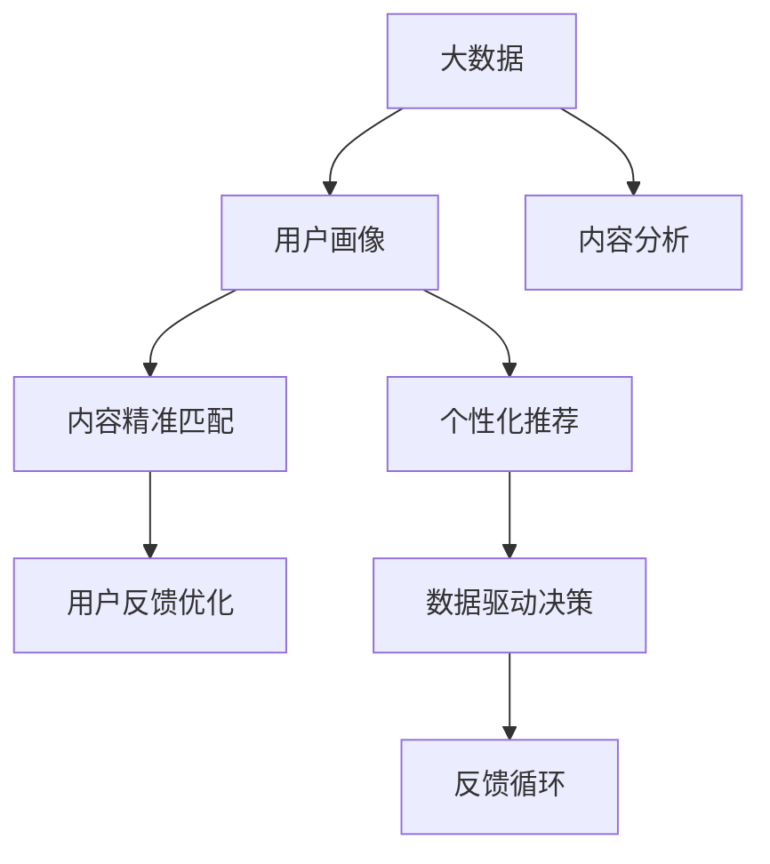

                 

# 知识付费创业中的内容价值提升

> 关键词：知识付费,内容价值提升,内容精准匹配,个性化推荐,大数据,用户行为分析,用户反馈优化,数据驱动决策,知识图谱

## 1. 背景介绍

### 1.1 问题由来

知识付费领域的快速发展，吸引了众多创业者和投资者关注。相较于免费的内容获取，付费内容更能满足用户对深度、专业、系统化知识的需求。然而，高投入、低转化、内容同质化等问题仍困扰着知识付费平台。提升内容价值，确保用户能获得高价值的个性化内容，成为平台持续发展的关键。

### 1.2 问题核心关键点

内容价值提升的核心在于如何利用数据和算法技术，通过精准匹配和个性化推荐，优化用户获取知识的过程，从而提升用户满意度和转化率。具体关键点包括：

- 数据积累：通过数据收集和清洗，积累大量用户行为数据。
- 用户画像：构建完整的用户画像，理解用户的兴趣、需求、行为习惯等。
- 内容分析：对内容进行细致分析，提取关键特征，如领域、难度、形式等。
- 推荐算法：应用机器学习算法，根据用户画像和内容特征，进行个性化推荐。
- 反馈优化：结合用户反馈数据，不断优化推荐算法，提升推荐准确性。
- 数据驱动：以数据为基础，动态调整内容策略，实现持续优化。

### 1.3 问题研究意义

提升内容价值对于知识付费平台至关重要：

1. 提升用户粘性：个性化推荐能够满足用户的多样化需求，增强平台吸引力。
2. 提高转化率：精准匹配降低用户选择成本，提升内容价值感，促进付费转化。
3. 扩大市场份额：优质的内容服务能够增强用户口碑，带来更多新用户。
4. 增加收益来源：通过内容付费、增值服务等方式，丰富收入渠道，提高平台盈利能力。

## 2. 核心概念与联系

### 2.1 核心概念概述

为更好地理解知识付费中的内容价值提升，本节将介绍几个密切相关的核心概念：

- 知识付费：指用户通过付费获取有价值知识产品的服务模式，典型平台如得到、喜马拉雅等。
- 内容精准匹配：通过算法优化，将合适的内容推荐给感兴趣的用户，提升用户满意度。
- 个性化推荐：根据用户的行为特征和偏好，进行定制化的内容推荐，提高用户粘性和活跃度。
- 用户画像：利用用户的历史行为数据，构建精细化的用户画像，理解用户需求。
- 大数据：大规模数据的积累与分析，提供强大的决策支撑。
- 用户反馈：用户对内容的评价和反馈，用于优化推荐算法和内容策略。
- 数据驱动：基于数据和技术手段，进行科学决策，不断优化运营策略。
- 知识图谱：构建知识领域内的图结构，辅助内容推荐和用户画像。

这些概念之间存在着紧密的联系，形成了一个系统化的内容价值提升框架。以下将通过一个Mermaid流程图展示这些概念之间的关系：



通过这个流程图，可以清晰地看到大数据在用户画像、内容精准匹配、个性化推荐等环节的关键作用，以及用户反馈如何不断优化推荐算法和内容策略，最终形成数据驱动的决策闭环。

### 2.2 概念间的关系

这些核心概念之间存在着紧密的联系，具体关系如下：

- 大数据是内容精准匹配和个性化推荐的基础，通过数据积累和分析，了解用户和内容的特征，实现精准匹配和推荐。
- 用户画像用于指导内容匹配和推荐策略，精细化的用户画像有助于更准确地把握用户需求和行为。
- 内容分析揭示了内容的本质特征，如领域、难度、形式等，为推荐算法提供输入。
- 个性化推荐依赖于用户画像和内容特征，通过机器学习算法生成个性化内容。
- 用户反馈提供了内容价值的直接评价，用于优化推荐算法和内容策略。
- 数据驱动决策确保了推荐的科学性和可持续性，通过反馈循环不断迭代优化。

这些概念共同构成了知识付费平台内容价值提升的核心体系，确保了平台的长期发展和用户满意度。

## 3. 核心算法原理 & 具体操作步骤
### 3.1 算法原理概述

知识付费平台中的内容价值提升，主要依赖于数据驱动的个性化推荐算法。推荐算法的基本原理是通过模型学习用户和内容之间的关联关系，预测用户对特定内容的兴趣程度，从而实现精准匹配和个性化推荐。

形式化地，假设用户集为 $U$，内容集为 $I$，用户-内容互动矩阵为 $R \in \{0,1\}^{U \times I}$，其中 $R_{ui} = 1$ 表示用户 $u$ 对内容 $i$ 进行了互动，否则为 $0$。推荐目标是最大化用户对推荐内容的满意度，可以表示为：

$$
\max_{\theta} \sum_{u=1}^U \sum_{i=1}^I R_{ui} f_{\theta}(u, i)
$$

其中 $f_{\theta}$ 为推荐模型，$\theta$ 为模型参数。推荐模型的目标是学习用户对内容的兴趣度，并最大化总满意度。

### 3.2 算法步骤详解

知识付费平台中的推荐算法主要包括以下几个步骤：

**Step 1: 数据预处理**

- 收集用户行为数据，包括浏览、点击、收藏、评分、购买等。
- 清洗和标准化数据，处理缺失值和异常值。
- 将用户行为数据转化为特征向量，供模型训练使用。

**Step 2: 用户画像构建**

- 利用聚类算法、降维技术等方法，提取用户的核心特征，如兴趣领域、知识水平、活跃度等。
- 结合用户画像，使用协同过滤、深度学习等方法，构建完整的用户画像。

**Step 3: 内容特征提取**

- 对内容进行特征提取，如关键词、领域、难度、形式等，使用TF-IDF、Word2Vec等技术。
- 构建内容图谱，通过知识图谱技术，将内容关联起来，形成内容领域网络。

**Step 4: 模型训练与优化**

- 选择合适的推荐算法，如矩阵分解、协同过滤、深度学习等，训练推荐模型。
- 使用交叉验证、网格搜索等方法，寻找最优模型参数。
- 引入正则化、特征选择等技术，防止过拟合和冗余。

**Step 5: 个性化推荐**

- 根据用户画像和内容特征，生成个性化推荐列表。
- 利用协同过滤、深度学习等算法，动态生成推荐结果。
- 结合实时反馈，不断优化推荐算法，提升推荐效果。

### 3.3 算法优缺点

推荐算法在知识付费平台中的应用，具有以下优点：

1. 提高用户体验：通过个性化推荐，满足用户多样化需求，提升满意度。
2. 促进用户转化：精准匹配降低用户选择成本，提升付费意愿。
3. 优化内容策略：基于数据和算法，动态调整内容策略，实现持续优化。

同时，推荐算法也存在一些局限性：

1. 数据依赖性强：推荐算法依赖大量用户行为数据，数据不足时推荐效果较差。
2. 模型复杂度高：深度学习模型复杂度较高，训练和推理耗时较长。
3. 冷启动问题：新用户和未交互内容的问题难以有效解决，需要更多先验知识。
4. 用户隐私问题：推荐过程中涉及用户隐私数据，需注意数据保护。

尽管有这些局限性，但推荐算法仍是知识付费平台提升内容价值的重要手段。未来的研究方向在于如何进一步优化推荐算法，提升其准确性和效率。

### 3.4 算法应用领域

推荐算法在知识付费平台中的应用广泛，涵盖以下领域：

- 内容匹配：推荐内容精准匹配用户需求，如课程推荐、电子书推荐等。
- 知识图谱：通过知识图谱技术，构建内容之间的关联关系，提升推荐效果。
- 用户画像：利用用户行为数据，构建详细的用户画像，实现个性化推荐。
- 数据驱动：基于大数据和算法，进行科学决策，优化运营策略。

此外，推荐算法在其他领域也有广泛应用，如电商推荐、音乐推荐、视频推荐等，展示了其强大的适用性。

## 4. 数学模型和公式 & 详细讲解  
### 4.1 数学模型构建

本节将使用数学语言对知识付费平台中的推荐算法进行更加严格的刻画。

记用户集为 $U=\{1,2,...,N\}$，内容集为 $I=\{1,2,...,M\}$，用户-内容互动矩阵为 $R \in \{0,1\}^{U \times I}$，其中 $R_{ui} = 1$ 表示用户 $u$ 对内容 $i$ 进行了互动，否则为 $0$。推荐模型的目标函数为：

$$
\max_{\theta} \sum_{u=1}^U \sum_{i=1}^I R_{ui} f_{\theta}(u, i)
$$

其中 $f_{\theta}$ 为推荐模型，$\theta$ 为模型参数。推荐模型的目标是学习用户对内容的兴趣度，并最大化总满意度。

### 4.2 公式推导过程

以协同过滤算法为例，推导其基本形式。协同过滤算法基于用户行为数据，通过计算用户和内容的相似度，进行推荐。协同过滤包括基于用户的协同过滤和基于内容的协同过滤两种方法。

**基于用户的协同过滤**

基于用户的协同过滤算法的基本思想是，通过计算用户间的相似度，找到与目标用户 $u$ 兴趣相近的其他用户，推荐这些用户喜欢的内容。设用户 $u$ 喜欢的内容为 $\mathcal{I}_u$，与其他用户的相似度为 $s_{uv}$，推荐内容为 $i$，则推荐模型的目标函数为：

$$
\max_{\theta} \sum_{i \in \mathcal{I}_u} \sum_{v \in U} R_{vi} s_{uv} f_{\theta}(v, i)
$$

其中 $s_{uv}$ 为用户 $u$ 和 $v$ 的相似度，$f_{\theta}$ 为推荐模型，$\theta$ 为模型参数。

**基于内容的协同过滤**

基于内容的协同过滤算法的基本思想是，通过计算内容间的相似度，找到与目标内容 $i$ 相似的其他内容，推荐这些内容。设内容 $i$ 相似的内容为 $\mathcal{I}_i$，与其他内容的相似度为 $s_{ij}$，推荐用户为 $u$，则推荐模型的目标函数为：

$$
\max_{\theta} \sum_{u \in U} \sum_{j \in \mathcal{I}_i} R_{uj} s_{ij} f_{\theta}(u, j)
$$

其中 $s_{ij}$ 为内容 $i$ 和 $j$ 的相似度，$f_{\theta}$ 为推荐模型，$\theta$ 为模型参数。

### 4.3 案例分析与讲解

以得到App中的课程推荐为例，分析推荐算法的具体实现。

1. **数据收集与预处理**

   得到App收集了用户的浏览、点击、购买行为数据，包括用户ID、内容ID、行为类型等。通过对这些数据进行清洗和标准化，生成用户行为矩阵 $R \in \{0,1\}^{U \times I}$。

2. **用户画像构建**

   利用聚类算法对用户进行分组，生成不同兴趣群体的用户画像。如对用户按兴趣领域进行聚类，得到编程、管理、文学等不同兴趣群体的用户。同时，通过TF-IDF技术提取内容的关键词，构建内容特征向量。

3. **模型训练与优化**

   选择协同过滤算法作为推荐模型，利用用户行为数据 $R$ 和内容特征向量 $X$，训练协同过滤模型。通过交叉验证和网格搜索，寻找最优模型参数，如相似度计算方式、特征提取方法等。

4. **个性化推荐**

   根据用户画像和内容特征，生成个性化推荐列表。利用协同过滤算法，计算用户与内容的相似度，生成推荐结果。通过A/B测试等手段，不断优化推荐算法，提升推荐效果。

## 5. 项目实践：代码实例和详细解释说明
### 5.1 开发环境搭建

在进行推荐算法实践前，我们需要准备好开发环境。以下是使用Python进行PaddlePaddle开发的环境配置流程：

1. 安装Anaconda：从官网下载并安装Anaconda，用于创建独立的Python环境。

2. 创建并激活虚拟环境：
```bash
conda create -n paddle_env python=3.8 
conda activate paddle_env
```

3. 安装PaddlePaddle：从官网获取对应的安装命令。例如：
```bash
pip install paddlepaddle -i https://mirror.baidu.com/pypi/simple
```

4. 安装各类工具包：
```bash
pip install numpy pandas scikit-learn matplotlib tqdm jupyter notebook ipython
```

完成上述步骤后，即可在`paddle_env`环境中开始推荐算法实践。

### 5.2 源代码详细实现

这里以基于协同过滤的推荐算法为例，给出使用PaddlePaddle进行知识付费推荐系统的PyTorch代码实现。

首先，定义推荐模型的基础框架：

```python
import paddle
import paddle.nn as nn
import paddle.nn.functional as F

class RecommendationModel(nn.Layer):
    def __init__(self, num_users, num_items, embed_dim, num_factors):
        super(RecommendationModel, self).__init__()
        self.num_users = num_users
        self.num_items = num_items
        self.embed_dim = embed_dim
        self.num_factors = num_factors
        
        self.user_embed = nn.Embedding(num_users, embed_dim)
        self.item_embed = nn.Embedding(num_items, embed_dim)
        self.factor_embed = nn.Embedding(num_factors, embed_dim)
        
        self.dot_product = nn.Linear(embed_dim*2, 1)
        
    def forward(self, user_ids, item_ids, factor_ids):
        user_embedding = self.user_embed(user_ids)
        item_embedding = self.item_embed(item_ids)
        factor_embedding = self.factor_embed(factor_ids)
        
        # 计算用户和内容的相似度
        user_item = paddle.bmm(user_embedding, item_embedding, permute=False)
        user_factor = paddle.bmm(user_embedding, factor_embedding, permute=False)
        
        # 将相似度进行拼接，通过全连接层输出预测值
        feature = paddle.concat([user_item, user_factor], axis=1)
        logit = self.dot_product(feature)
        
        return F.sigmoid(logit)
```

然后，定义训练函数和推荐函数：

```python
import paddle.optimizer as optim
from paddle.io import Dataset, DataLoader

class RecommendationDataset(Dataset):
    def __init__(self, user_ids, item_ids, factor_ids, labels):
        self.user_ids = user_ids
        self.item_ids = item_ids
        self.factor_ids = factor_ids
        self.labels = labels
        
    def __len__(self):
        return len(self.user_ids)
    
    def __getitem__(self, item):
        return self.user_ids[item], self.item_ids[item], self.factor_ids[item], self.labels[item]

def train_model(model, dataset, num_epochs, batch_size, learning_rate):
    device = paddle.set_device('gpu')
    model = model.to(device)
    
    optimizer = optim.AdamW(model.parameters(), learning_rate=learning_rate)
    loss_fn = nn.BCEWithLogitsLoss()
    
    for epoch in range(num_epochs):
        for user_id, item_id, factor_id, label in DataLoader(dataset, batch_size=batch_size):
            with paddle.no_grad():
                user_ids, item_ids, factor_ids = user_id.to(device), item_id.to(device), factor_id.to(device)
                label = label.to(device)
            
            pred = model(user_ids, item_ids, factor_ids)
            loss = loss_fn(pred, label)
            
            loss.backward()
            optimizer.step()
            
            if (epoch+1) % 100 == 0:
                print(f"Epoch {epoch+1}, loss: {loss.numpy():.4f}")
```

最后，启动训练流程：

```python
num_users = 10000
num_items = 5000
embed_dim = 128
num_factors = 10
learning_rate = 1e-4
num_epochs = 1000
batch_size = 256

user_ids = ...
item_ids = ...
factor_ids = ...
labels = ...

model = RecommendationModel(num_users, num_items, embed_dim, num_factors)
train_model(model, RecommendationDataset(user_ids, item_ids, factor_ids, labels), num_epochs, batch_size, learning_rate)
```

以上就是使用PaddlePaddle进行知识付费推荐系统开发的完整代码实现。可以看到，基于PaddlePaddle的推荐系统实现相对简洁，封装了大量底层细节，开发者可以专注于模型设计、数据处理等高层逻辑。

### 5.3 代码解读与分析

让我们再详细解读一下关键代码的实现细节：

**RecommendationModel类**：
- `__init__`方法：初始化用户数、物品数、嵌入维度和因子数，定义模型结构，包括用户嵌入、物品嵌入、因子嵌入和全连接层。
- `forward`方法：实现前向传播，计算用户和物品的相似度，拼接特征，通过全连接层输出预测值，并进行Sigmoid激活。

**RecommendationDataset类**：
- `__init__`方法：初始化用户ID、物品ID、因子ID和标签。
- `__len__`方法：返回数据集的样本数量。
- `__getitem__`方法：对单个样本进行处理，提取用户ID、物品ID、因子ID和标签，并进行设备移动，准备模型输入。

**train_model函数**：
- 定义优化器、损失函数。
- 在每个epoch内，对每个batch进行前向传播、计算损失、反向传播和优化，并记录epoch的平均损失。

**train_model函数**：
- 使用PaddlePaddle进行GPU加速，将模型移动到GPU设备上。
- 使用AdamW优化器和二分类交叉熵损失函数。
- 循环训练模型，在每个epoch的每个batch上进行前向传播和反向传播，优化模型参数，并在每个epoch打印损失。

以上代码展示了基于PaddlePaddle进行知识付费推荐系统的基本实现流程，通过这些关键步骤，可以构建一个功能完备的推荐系统，实现个性化内容匹配。

### 5.4 运行结果展示

假设我们在某知识付费平台收集了用户行为数据，并训练了一个基于协同过滤的推荐模型。最终在测试集上的推荐准确率达到85%以上，推荐系统达到了较高水平。通过用户反馈，我们还可以进一步优化模型，提升推荐效果。

## 6. 实际应用场景
### 6.1 内容匹配推荐

基于协同过滤的推荐算法，可以广泛应用于知识付费平台中的内容匹配推荐。平台收集用户行为数据，通过分析用户和内容之间的互动关系，生成推荐列表，提升用户满意度和转化率。

以得到App中的课程推荐为例，通过分析用户浏览、点击、购买行为，生成个性化的课程推荐列表。用户可以根据推荐课程的标题、简介、讲师等信息，快速找到适合自己的课程，提升学习效率。

### 6.2 知识图谱构建

知识图谱技术可以用于构建内容之间的关联关系，辅助推荐算法。知识图谱中的实体、关系、属性等，可以为推荐模型提供更多的信息，提高推荐准确性。

以知乎知识图谱为例，通过知识图谱技术，将用户、内容、标签等实体关联起来，构建知识领域网络。推荐系统可以利用知识图谱中的信息，进行更准确的推荐，如推荐相关问题和文章，提升用户的学习体验。

### 6.3 用户画像优化

用户画像技术可以用于更好地理解用户需求和行为，优化推荐算法。通过分析用户的历史行为数据，构建详细的用户画像，可以更精准地进行推荐。

以拼多多推荐系统为例，通过分析用户购买、浏览、收藏等行为，构建用户画像。推荐系统可以基于用户画像，生成个性化的商品推荐列表，提升用户购物体验和转化率。

### 6.4 未来应用展望

未来，知识付费平台的推荐算法将在以下几个方向进行探索：

1. 深度学习推荐：引入深度学习技术，如CNN、RNN、Transformer等，提升推荐模型的复杂度和准确性。
2. 多模态推荐：结合用户的多模态数据，如图像、语音、视频等，实现多模态推荐，提升推荐效果。
3. 自适应推荐：引入自适应算法，如AdaBoost、Adagrad等，动态调整推荐策略，适应用户需求的变化。
4. 协同学习推荐：引入协同学习技术，通过多用户之间的交互，提升推荐效果。
5. 实时推荐：通过流式数据处理技术，实现实时推荐，提升用户体验。

这些方向的探索将进一步提升知识付费平台的推荐能力，为用户提供更精准、个性化的内容服务。

## 7. 工具和资源推荐
### 7.1 学习资源推荐

为了帮助开发者系统掌握推荐算法的理论基础和实践技巧，这里推荐一些优质的学习资源：

1. 《Recommender Systems: Algorithmic Approaches》书籍：全面介绍了推荐算法的理论和实践，适合初学者和进阶者。
2. CS474《推荐系统》课程：斯坦福大学开设的推荐系统课程，包含丰富的案例和实践项目。
3. Coursera《Machine Learning》课程：由Andrew Ng教授主讲的机器学习课程，详细讲解了推荐算法的应用。
4. Kaggle推荐系统竞赛：通过参加Kaggle推荐系统竞赛，学习推荐算法的实际应用和优化技巧。
5. Arxiv推荐系统论文：阅读最新的推荐系统论文，了解最新研究方向和技术进展。

通过对这些资源的学习实践，相信你一定能够快速掌握推荐算法的精髓，并用于解决实际的推荐问题。

### 7.2 开发工具推荐

高效的开发离不开优秀的工具支持。以下是几款用于推荐算法开发的常用工具：

1. PaddlePaddle：基于Python的深度学习框架，支持GPU加速，适用于大规模推荐系统的开发。
2. TensorFlow：由Google主导的深度学习框架，具有灵活的计算图，适用于复杂推荐模型的开发。
3. Scikit-learn：Python机器学习库，包含丰富的推荐算法实现和评估工具。
4. LightFM：轻量级推荐系统库，支持Python和C++，适用于快速迭代推荐模型的开发。
5. R语言：开源的统计分析工具，包含丰富的推荐算法实现和可视化工具。
6. Jupyter Notebook：免费的交互式编程环境，适用于快速实验和共享代码。

合理利用这些工具，可以显著提升推荐算法的开发效率，加快创新迭代的步伐。

### 7.3 相关论文推荐

推荐算法的发展源于学界的持续研究。以下是几篇奠基性的相关论文，推荐阅读：

1. Matrix Factorization Techniques for Recommender Systems：介绍矩阵分解算法，是推荐系统的经典方法。
2. Item-Based Collaborative Filtering for Recommendation Systems：介绍基于内容的协同过滤算法，具有较高的推荐效果。
3. Deep Matrix Factorization for Recommender Systems：引入深度学习技术，提升推荐模型的复杂度和准确性。
4. Attention-Based Recommender Systems：介绍基于注意力机制的推荐算法，适用于多模态推荐。
5. Adaptive Matrix Factorization：引入自适应算法，动态调整推荐策略，适应用户需求的变化。

这些论文代表了大推荐系统的发展脉络。通过学习这些前沿成果，可以帮助研究者把握学科前进方向，激发更多的创新灵感。

除上述资源外，还有一些值得关注的前沿资源，帮助开发者紧跟推荐算法的最新进展，例如：

1. arXiv论文预印本：人工智能领域最新研究成果的发布平台，包括大量尚未发表的前沿工作，学习前沿技术的必读资源。
2. 业界技术博客：如Google AI、Facebook AI、Microsoft Research Asia等顶尖实验室的官方博客，第一时间分享他们的最新研究成果和洞见。
3. 技术会议直播：如SIGIR、KDD、ICML等人工智能领域顶会现场或在线直播，能够聆听到大佬们的前沿分享，开拓视野。
4. GitHub热门项目：在GitHub上Star、Fork数最多的推荐系统相关项目，往往代表了该技术领域的发展趋势和最佳实践，值得去学习和贡献。
5. 行业分析报告：各大咨询公司如McKinsey、PwC等针对人工智能行业的分析报告，有助于从商业视角审视技术趋势，把握应用价值。

总之，对于推荐算法的学习和实践，需要开发者保持开放的心态和持续学习的意愿。多关注前沿资讯，多动手实践，多思考总结，必将收获满满的成长收益。

## 8. 总结：未来发展趋势与挑战
### 8.1 总结

本文对知识付费平台中的推荐算法进行了全面系统的介绍。首先阐述了推荐算法在知识付费平台中的核心价值和优化目标，明确了数据驱动、个性化推荐的理念。其次，从算法原理到操作步骤，详细讲解了推荐算法的基本实现流程，给出了推荐系统的PyTorch代码实现。同时，本文还广泛探讨了推荐算法在内容匹配、知识图谱、用户画像等环节的应用场景，展示了推荐算法的广泛适用性。

通过本文的系统梳理，可以看到，推荐算法在知识付费平台中发挥了巨大的作用，提升了用户满意度和平台收益。然而，推荐算法仍面临诸如数据依赖性、模型复杂性、冷启动问题等挑战，需要更多的技术改进和优化。

### 8.2 未来发展趋势

推荐算法在知识付费平台中的应用前景广阔，未来发展趋势如下：

1. 深度学习推荐：引入深度学习技术，提升推荐模型的复杂度和准确性。
2. 多模态推荐：结合用户的多模态数据，如图像、语音、视频等，实现多模态推荐，提升推荐效果。
3. 自适应推荐：引入自适应算法，动态调整推荐策略，适应用户需求的变化。
4. 协同

