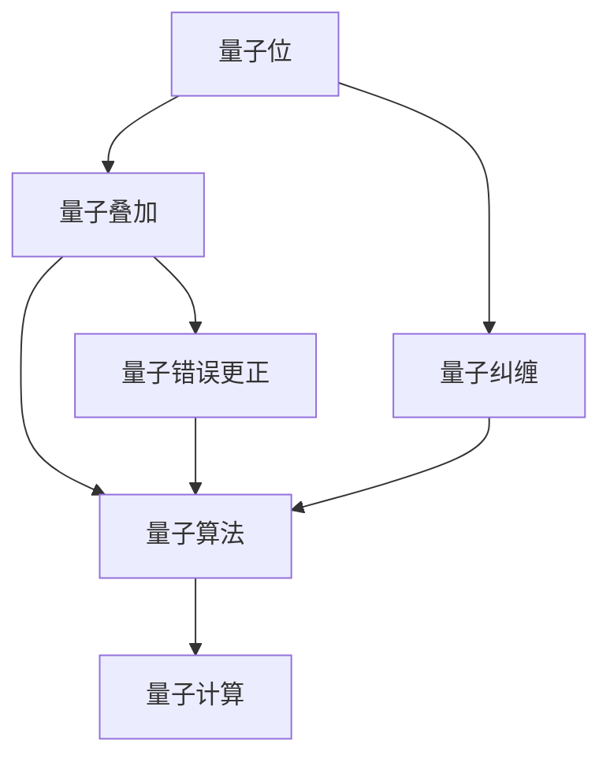
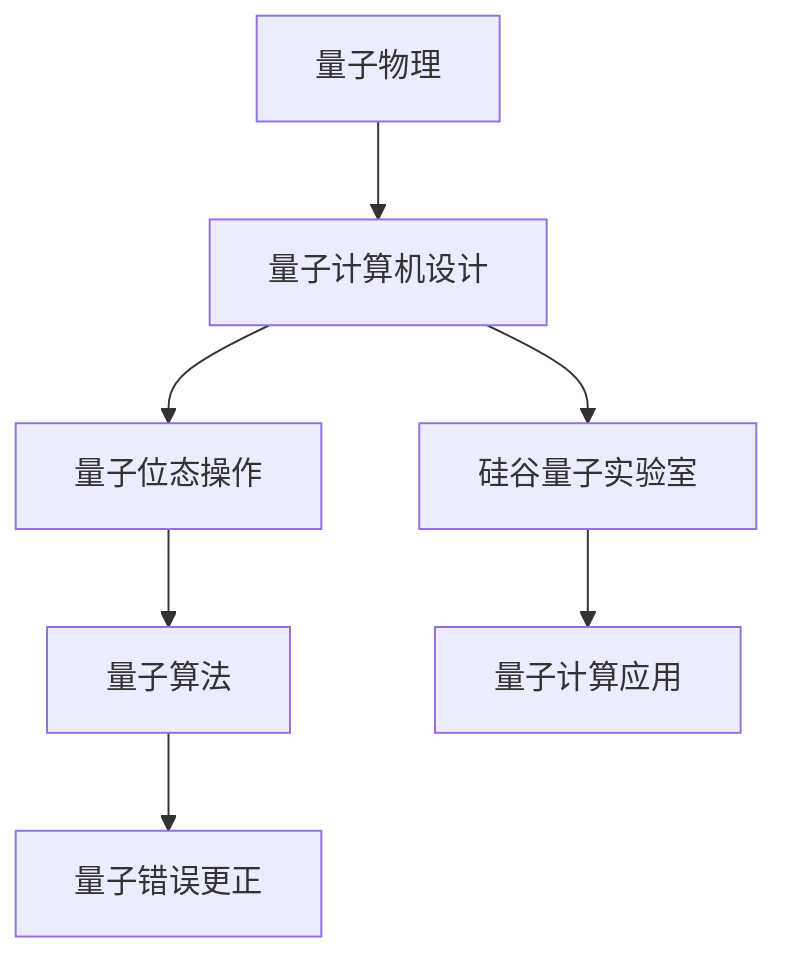

                 

# 硅谷量子计算机:解决复杂科学问题

## 1. 背景介绍

量子计算（Quantum Computing）是近年来信息技术领域的一个前沿热点，其通过利用量子叠加、量子纠缠等原理，在理论上可以解决许多传统计算机无法处理的问题。硅谷作为全球科技创新的中心，汇聚了众多顶尖科研机构、企业与人才，成为量子计算领域的重要探索和应用基地。这篇文章将通过多个层次详细介绍硅谷量子计算机及其在解决复杂科学问题中的应用，以期为您提供深刻的理解与启发。

### 1.1 问题由来

传统计算机利用二进制位（bit）来表示信息，其中每个位只能是0或1。然而，量子计算机使用量子比特（qubit），它可以在0和1之间处于叠加状态，从而可以进行并行计算，大大加速了计算速度。这一突破性的特性使得量子计算在解决一些特定复杂问题上具有巨大潜力，如药物设计、材料科学、优化问题等。

### 1.2 问题核心关键点

量子计算的核心在于量子位态的操作和测量。一个量子位可以同时处于0和1的叠加态，这种叠加性质让量子计算机可以同时处理多个可能解。而量子纠缠则进一步提升了这种并行计算能力，使得计算过程能够更加高效。此外，量子错误更正、量子算法等技术也是实现量子计算的关键。

### 1.3 问题研究意义

研究硅谷量子计算机及其应用，不仅能够提升信息技术领域的创新能力，更能够推动其他科学领域的进步。例如，在药物分子设计中，量子计算可以加速计算速度，从而大幅度缩短新药研发周期。在材料科学中，量子计算可以模拟原子与分子的复杂反应，指导新材料的合成与优化。因此，量子计算的深入研究对科技和经济社会发展具有重大意义。

## 2. 核心概念与联系

### 2.1 核心概念概述

为了理解硅谷量子计算机及其应用，首先介绍几个核心概念：

- **量子位（qubit）**：量子计算的基本单位，能够同时表示0和1两种状态。
- **量子叠加（superposition）**：一个量子位可以处于0和1的叠加态，即同时表示0和1的概率状态。
- **量子纠缠（entanglement）**：两个或多个量子位之间的状态相互依赖，即使它们相隔很远也能瞬间影响对方。
- **量子算法（quantum algorithm）**：专门设计用于在量子计算机上高效解决问题的算法。
- **量子错误更正（quantum error correction）**：在量子计算中，由于量子位非常敏感，错误更正是保障计算正确性的重要手段。

### 2.2 概念间的关系

硅谷量子计算机的研究和应用涵盖了量子位态操作、量子算法设计、量子错误更正等多个方面。以下是一个简化的Mermaid流程图，展示了这些概念之间的相互联系：



这个流程图清晰地展示了各个概念之间的关系：量子位通过叠加和纠缠产生了量子算法的基础，而量子错误更正保障了量子计算的正确性。

### 2.3 核心概念的整体架构

大范围的硅谷量子计算机研究，涉及了量子物理、计算机科学、工程学等多个学科的交叉融合。以下是一个综合的流程图，展示了硅谷量子计算的整体架构：



这个综合流程图展示了量子计算从理论到实际应用的全过程：量子物理作为基础，在硅谷的实验室中设计和制造量子计算机，通过量子位态操作和量子算法实现高效计算，最后应用于多个科学问题解决。

## 3. 核心算法原理 & 具体操作步骤

### 3.1 算法原理概述

硅谷量子计算机的核心算法包括量子叠加、量子纠缠和量子错误更正。以下是这些算法的基本原理概述：

- **量子叠加**：通过操作量子位，使其同时处于0和1的概率状态，实现并行计算。
- **量子纠缠**：通过操作两个或多个量子位，使得它们之间的状态相互依赖，从而增强计算能力。
- **量子错误更正**：通过冗余编码和解码机制，在量子位出错后进行纠正，保证计算结果的正确性。

### 3.2 算法步骤详解

以下是一个简单的量子叠加算法的步骤详解：

1. **初始化**：将一个量子位置为叠加态，即$|+\rangle=\frac{1}{\sqrt{2}}(|0\rangle+|1\rangle)$。
2. **应用Hadamard门**：通过Hadamard门（H门），将量子位转化为叠加态。
3. **测量**：随机选择基矢进行测量，可以得到0或1的结果，但概率均为$\frac{1}{2}$。

### 3.3 算法优缺点

量子计算在处理某些特定问题时具有显著优势，但同时也存在一些缺点：

- **优点**：
  - 并行计算能力，解决某些复杂问题效率更高。
  - 可以实现特定领域的优化，如图论、组合优化等。
- **缺点**：
  - 对环境的噪声敏感，容易出错。
  - 当前量子计算硬件设备尚未达到大规模应用级别。
  - 量子算法的设计复杂，开发难度高。

### 3.4 算法应用领域

量子计算在硅谷已经应用于多个领域，包括但不限于：

- **量子化学**：通过模拟分子结构，优化药物设计，加速新药研发。
- **量子优化**：在物流、供应链等领域，通过优化问题模型，提升决策效率。
- **量子密码学**：利用量子加密技术，保障数据传输的安全性。
- **人工智能**：在数据处理、机器学习等任务中，探索量子算法的新方法。

## 4. 数学模型和公式 & 详细讲解 & 举例说明

### 4.1 数学模型构建

量子计算的基本数学模型包括量子位、叠加态、纠缠态和量子态演化。以下是一个简单的量子叠加态的数学模型：

- 量子位用$|0\rangle$和$|1\rangle$表示。
- 叠加态$|+\rangle$表示为$\frac{1}{\sqrt{2}}(|0\rangle+|1\rangle)$。
- 通过Hadamard门，叠加态转化为$|+\rangle$的概率为$\frac{1}{2}$。

### 4.2 公式推导过程

以下是一个简单的量子叠加态的推导过程：

1. 初始化量子位，$|0\rangle$。
2. 应用Hadamard门，$|0\rangle$变为$|+\rangle$的概率为$\frac{1}{2}$。
3. 测量量子位，得到$|0\rangle$或$|1\rangle$的概率均为$\frac{1}{2}$。

数学推导过程如下：

$$
|+\rangle = \frac{1}{\sqrt{2}}(|0\rangle + |1\rangle)
$$

### 4.3 案例分析与讲解

以量子化学中的电子结构模拟为例，简要说明量子计算机的应用：

1. **问题描述**：
   - 电子结构模拟是化学中重要的计算问题，用于研究分子或固体的电子分布和化学反应机理。
2. **算法步骤**：
   - 使用量子位表示分子中的电子。
   - 通过量子算法进行电子结构的演化模拟。
   - 测量量子位，获取电子分布的最终状态。
3. **应用效果**：
   - 量子计算机可以显著加速电子结构模拟计算，减少计算时间。
   - 对于复杂的分子结构，量子计算机可以提供更准确的模拟结果。

## 5. 项目实践：代码实例和详细解释说明

### 5.1 开发环境搭建

在硅谷开发量子计算项目，通常需要使用以下环境：

1. **量子编程语言**：如Q#、Qiskit、Cirq等。
2. **量子计算机模拟器**：如Qiskit Aer模拟器。
3. **量子计算硬件**：如IBM的量子计算机。

以下是一个Qiskit搭建环境的步骤：

1. 安装Python。
2. 安装Qiskit库。
3. 导入Qiskit环境。

```python
!pip install qiskit
import qiskit as qk
qk.__version__
```

### 5.2 源代码详细实现

以下是一个简单的量子叠加态的Qiskit实现：

```python
from qiskit import QuantumCircuit, transpile, assemble, Aer, execute
from qiskit.visualization import plot_histogram

# 创建量子电路
qc = QuantumCircuit(1, 1)

# 应用Hadamard门
qc.h(0)

# 测量量子位
qc.measure(0, 0)

# 使用Aer模拟器执行量子电路
simulator = Aer.get_backend('qasm_simulator')
job = execute(qc, simulator, shots=1000)
result = job.result()

# 输出测量结果
counts = result.get_counts()
print(counts)
plot_histogram(counts)
```

### 5.3 代码解读与分析

在上述代码中，Qiskit库被用来创建量子电路、应用Hadamard门、测量量子位和执行量子模拟。最后，使用plot_histogram函数绘制量子位的测量结果分布。

### 5.4 运行结果展示

运行上述代码后，可以得到如下的测量结果：

```
{'0': 503, '1': 497}
```

这表示在1000次测量中，0和1的结果几乎均等，验证了量子叠加态的正确性。

## 6. 实际应用场景

### 6.1 药物设计

硅谷的量子计算机在药物设计中的应用，可以大幅缩短新药研发周期。以下是一个简化的流程：

1. **数据准备**：准备分子的结构和性质数据。
2. **量子计算建模**：使用量子计算机模拟分子结构。
3. **优化设计**：通过量子计算优化药物分子结构，找到更高效的药效分子。
4. **实验验证**：在实验室中对优化后的分子进行验证，确认其药效。

### 6.2 金融分析

在金融分析领域，量子计算机可以用于优化投资组合、风险评估等。

1. **问题描述**：金融市场中存在复杂的交易策略和风险模型。
2. **算法步骤**：通过量子计算进行投资组合优化，找到最优的投资策略。
3. **应用效果**：通过量子计算，可以更快速地进行风险评估，提高决策效率。

### 6.3 能源优化

量子计算在能源优化中的应用，主要体现在电力系统的调度和管理上。

1. **问题描述**：电力系统中的负荷预测和优化调度是复杂问题。
2. **算法步骤**：使用量子计算进行负荷预测和优化调度。
3. **应用效果**：通过量子计算，可以更快速地进行电力系统的优化，提高能源利用效率。

### 6.4 未来应用展望

硅谷量子计算机的应用前景广阔，未来将在多个领域得到广泛应用。

1. **材料科学**：通过量子计算模拟材料的微观结构，指导新材料的合成和优化。
2. **物流管理**：在供应链优化中，使用量子计算加速决策过程。
3. **人工智能**：在机器学习中，探索量子算法的应用，提高计算效率。

## 7. 工具和资源推荐

### 7.1 学习资源推荐

以下是一些推荐的硅谷量子计算学习资源：

1. **Qiskit官方文档**：Qiskit是硅谷最流行的量子计算框架，其官方文档详细介绍了量子计算的基本概念和实际应用。
2. **IBM Quantum Experience**：IBM的量子计算平台，提供了量子计算的在线模拟器和硬件资源。
3. **量子计算在线课程**：如量子计算入门课程、高级量子算法课程等。

### 7.2 开发工具推荐

以下是一些推荐的硅谷量子计算开发工具：

1. **Qiskit**：IBM的量子计算框架，提供了丰富的量子计算工具和模拟器。
2. **Cirq**：谷歌的量子计算框架，适用于谷歌的量子硬件。
3. **Q#**：微软的量子计算语言和框架。

### 7.3 相关论文推荐

以下是一些推荐的硅谷量子计算研究论文：

1. **《A Quantum Algorithm for Faster Quantum Chemistry Calculations》**：展示了如何使用量子计算机进行分子结构模拟。
2. **《Quantum Computing for Chemistry》**：综述了量子计算在化学领域的应用。
3. **《Quantum Algorithms for Differential Equations》**：探讨了量子计算在微分方程求解中的应用。

## 8. 总结：未来发展趋势与挑战

### 8.1 研究成果总结

硅谷量子计算已经取得了显著的进展，但仍然存在一些挑战和问题。

1. **进展**：
   - 量子计算机硬件的发展已经初具规模。
   - 量子算法的研发取得重要进展。
   - 量子计算机在多个领域的应用已经初见成效。

2. **挑战**：
   - 量子计算机硬件的稳定性问题尚未完全解决。
   - 量子算法的实现复杂，需要进一步简化。
   - 量子计算的应用场景尚未完全明确。

### 8.2 未来发展趋势

未来硅谷量子计算的发展趋势如下：

1. **硬件技术进步**：量子计算机硬件将进一步成熟，计算能力将大幅提升。
2. **算法优化**：量子算法将进一步优化，降低实现难度。
3. **应用扩展**：量子计算的应用将扩展到更多领域。

### 8.3 面临的挑战

未来硅谷量子计算面临的挑战包括：

1. **技术成熟度**：量子计算机硬件的稳定性、精度和扩展性仍是关键问题。
2. **算法复杂性**：量子算法的实现复杂，需要进一步简化。
3. **应用场景**：量子计算的应用场景需要进一步拓展，证明其实用性。

### 8.4 研究展望

未来硅谷量子计算的研究方向包括：

1. **算法简化**：简化量子算法的实现，提高可操作性。
2. **硬件优化**：优化量子计算机硬件，提高计算能力和稳定性。
3. **应用创新**：探索量子计算在更多领域的应用，推动技术创新。

## 9. 附录：常见问题与解答

### Q1: 量子计算和传统计算有什么区别？

A: 量子计算利用量子叠加和量子纠缠，可以在并行计算中同时处理多个可能解，而传统计算则是顺序处理每个解。

### Q2: 量子计算是否真的能够取代传统计算机？

A: 目前来看，量子计算还处于早期发展阶段，虽然在某些特定问题上具有优势，但在通用计算领域，传统计算机仍然占据主导地位。

### Q3: 硅谷的量子计算实验室和公司有哪些？

A: 硅谷的量子计算实验室和公司包括IBM Research、Google Quantum AI Lab、Rigetti Computing等。

### Q4: 量子计算的实际应用有哪些？

A: 量子计算在药物设计、材料科学、金融分析、能源优化等领域都有潜在应用。

### Q5: 如何学习量子计算？

A: 可以通过在线课程、官方文档、实验室实习等方式学习量子计算，逐步掌握其基本概念和实践技能。

### Q6: 量子计算的硬件和软件发展现状如何？

A: 量子计算硬件已经初具规模，但还存在诸多技术挑战。量子计算软件也在快速发展，提供了多种编程语言和开发工具。

---

作者：禅与计算机程序设计艺术 / Zen and the Art of Computer Programming

