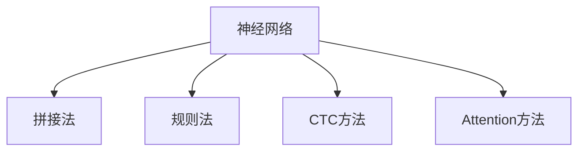
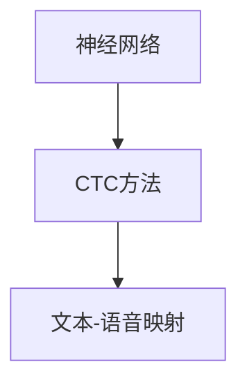
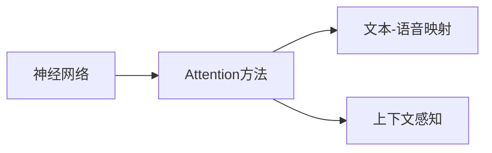
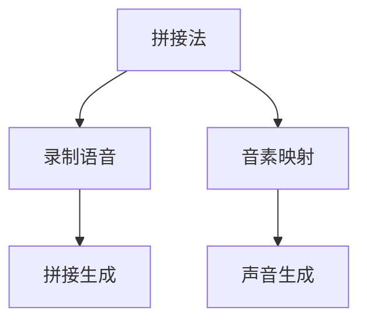
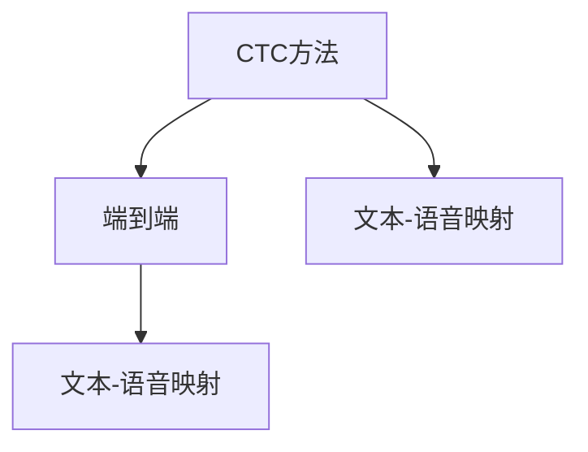

                 

# 神经网络在语音合成中取代传统方法

## 1. 背景介绍

语音合成，俗称TTS（Text-to-Speech），是指将文本或语音转换为语音信号的技术。语音合成的应用场景非常广泛，包括虚拟助手、语音导航、有声读物、智能客服等。传统语音合成方法主要基于拼接法（Concatenative Synthesis）和规则法（RNN-based Synthesis），但在应用效果和用户体验上存在诸多不足。近年来，基于神经网络（Neural Network）的端到端（End-to-End）语音合成方法逐渐兴起，逐渐取代传统方法，成为了语音合成的主流技术。

### 1.1 传统语音合成方法的问题

传统语音合成方法主要包括以下两类：

1. **拼接法**：将预录的语音片段按顺序拼接成完整的语音，并在拼接点进行声音的平滑过渡。拼接法的优点是发音准确，但缺点是需要录制大量高质量的语音片段，制作成本高，且无法生成自然流畅的语音。

2. **规则法**：利用文本语言学规则和HMM（Hidden Markov Model）等模型，将文本转换为音素序列，再通过声学模型生成声音。规则法的优点是发音自然，但缺点是模型复杂度高，训练时间长，且需要手动标注大量音素，对标注人员的语言学知识要求较高。

传统语音合成方法的这些不足，使得其在应用效果和用户体验上难以满足用户期望。

### 1.2 神经网络语音合成方法的兴起

神经网络语音合成方法的出现，打破了传统方法的桎梏，以端到端的方式直接从文本生成语音，不再需要额外的音素映射和声音拼接。神经网络语音合成方法主要分为两类：基于CTC（Connectionist Temporal Classification）的方法和基于Attention的方法。

CTC方法直接从文本序列生成语音序列，通过最大化训练样本的联合概率，学习文本到语音的映射关系。Attention方法则利用注意力机制，根据文本中的上下文信息，动态生成语音信号。这两种方法在语音合成的效果和速度上都取得了显著的提升，逐渐成为了主流技术。

## 2. 核心概念与联系

### 2.1 核心概念概述

为更好地理解神经网络在语音合成中的应用，本节将介绍几个密切相关的核心概念：

- **神经网络（Neural Network）**：一种模拟人脑神经元网络的计算模型，包括前馈神经网络、卷积神经网络、循环神经网络等。神经网络在语音合成中主要用于建模从文本到语音的映射关系。

- **拼接法（Concatenative Synthesis）**：一种传统语音合成方法，通过将录制的语音片段拼接成完整的语音。

- **规则法（RNN-based Synthesis）**：一种传统语音合成方法，利用文本语言学规则和HMM等模型，将文本转换为音素序列，再通过声学模型生成声音。

- **CTC（Connectionist Temporal Classification）**：一种用于序列预测的损失函数，用于最大化训练样本的联合概率，学习文本到语音的映射关系。

- **Attention（注意力机制）**：一种深度学习中的机制，用于动态关注文本中的上下文信息，生成更加自然的语音信号。

这些核心概念之间的逻辑关系可以通过以下Mermaid流程图来展示：



这个流程图展示了几类主要的语音合成方法及其与神经网络的关联。神经网络作为核心模型，用于从文本生成语音的映射关系。CTC方法和Attention方法作为神经网络的具体实现方式，在语音合成中分别对应端到端和非端到端的两种技术路线。

### 2.2 概念间的关系

这些核心概念之间存在着紧密的联系，形成了神经网络语音合成的完整生态系统。下面我们通过几个Mermaid流程图来展示这些概念之间的关系。

#### 2.2.1 神经网络与CTC方法



这个流程图展示了神经网络如何通过CTC方法进行文本-语音映射。CTC方法直接从文本序列生成语音序列，通过最大化训练样本的联合概率，学习文本到语音的映射关系。

#### 2.2.2 神经网络与Attention方法



这个流程图展示了神经网络如何通过Attention方法进行文本-语音映射。Attention方法利用注意力机制，根据文本中的上下文信息，动态生成语音信号，能够生成更加自然的语音。

#### 2.2.3 拼接法与规则法



这个流程图展示了传统拼接法的基本流程。首先录制语音，然后通过音素映射将文本转换为音素序列，最后拼接生成完整的语音。

#### 2.2.4 CTC方法与Attention方法



这个流程图展示了CTC方法与Attention方法的对比。CTC方法是一种端到端的方法，直接从文本序列生成语音序列。而Attention方法则是一种非端到端的方法，通过动态生成语音信号，提高语音的自然度。

## 3. 核心算法原理 & 具体操作步骤

### 3.1 算法原理概述

神经网络在语音合成中的应用，主要是通过CTC方法和Attention方法来实现的。这两种方法虽然在具体实现上有所不同，但其核心原理都是通过深度学习模型，学习文本到语音的映射关系，从而生成自然流畅的语音。

- **CTC方法**：CTC方法通过最大化训练样本的联合概率，学习文本到语音的映射关系。具体来说，CTC方法将文本序列转换为音素序列，然后通过声学模型生成声音。CTC方法的主要损失函数包括CTC损失和L1/L2正则化损失，用于防止模型过拟合和提高模型的泛化能力。

- **Attention方法**：Attention方法利用注意力机制，根据文本中的上下文信息，动态生成语音信号。具体来说，Attention方法首先对文本序列进行编码，然后利用注意力机制，选择重要的文本信息，生成语音信号。Attention方法的主要损失函数包括L1/L2正则化损失、Huber损失和NLL（Negative Log-Likelihood）损失，用于提高模型的泛化能力和预测准确度。

### 3.2 算法步骤详解

以下是神经网络在语音合成中CTC和Attention方法的具体操作步骤：

#### 3.2.1 CTC方法

1. **文本预处理**：将文本转换为音素序列，并进行标记。例如，将“Hello”转换为[H], [e], [l], [l], [o]。
2. **声学模型训练**：利用声学模型，将音素序列转换为声学特征。例如，将音素序列转换为MFCC特征。
3. **CTC损失计算**：利用CTC损失函数，最大化训练样本的联合概率。例如，将文本“Hello”与声学特征[H], [e], [l], [l], [o]进行匹配，学习文本到语音的映射关系。
4. **模型优化**：利用优化算法（如Adam）更新模型参数，最小化CTC损失，提高模型的泛化能力和预测准确度。

#### 3.2.2 Attention方法

1. **文本编码**：利用卷积神经网络（CNN）或长短时记忆网络（LSTM）对文本序列进行编码，提取文本中的语义信息。
2. **注意力机制**：利用注意力机制，根据文本中的上下文信息，动态选择重要的文本信息，生成语音信号。例如，根据文本“Hello”，生成[H], [e], [l], [l], [o]的语音信号。
3. **声音生成**：利用声学模型，将注意力机制生成的语音信号转换为声学特征。例如，将[H], [e], [l], [l], [o]转换为MFCC特征。
4. **Attention损失计算**：利用Attention损失函数，最大化训练样本的联合概率。例如，将文本“Hello”与声学特征[H], [e], [l], [l], [o]进行匹配，学习文本到语音的映射关系。
5. **模型优化**：利用优化算法（如Adam）更新模型参数，最小化Attention损失，提高模型的泛化能力和预测准确度。

### 3.3 算法优缺点

神经网络在语音合成中的优点包括：

- **端到端**：神经网络通过直接从文本生成语音，省去了拼接和音素映射等繁琐的前处理步骤。
- **自然流畅**：神经网络通过注意力机制，动态生成语音信号，能够生成更加自然流畅的语音。
- **易于扩展**：神经网络可以通过增加模型深度、宽度和层数，提高模型的性能和泛化能力。

神经网络在语音合成中的缺点包括：

- **计算量大**：神经网络模型的参数量通常很大，训练和推理需要大量的计算资源。
- **需要大量数据**：神经网络需要大量标注数据进行训练，训练时间和成本较高。
- **可解释性不足**：神经网络作为黑盒模型，难以解释其内部的决策过程和生成逻辑。

### 3.4 算法应用领域

神经网络在语音合成中的应用，已经涵盖了多个领域，例如：

- **虚拟助手**：如Siri、Alexa等虚拟助手，通过语音合成技术，实现与用户的自然交互。
- **语音导航**：如Google Maps、Apple Maps等导航应用，通过语音合成技术，提供实时语音导航信息。
- **有声读物**：如Amazon Audible等有声读物平台，通过语音合成技术，将文本转换为语音，方便用户随时随地收听。
- **智能客服**：如阿里巴巴、京东等电商平台，通过语音合成技术，实现自动回复客户咨询，提高客户满意度。

除了这些典型应用外，神经网络语音合成技术还在教育、娱乐、新闻、广告等多个领域得到了广泛应用，为人类带来更加便捷、高效的语音交互体验。

## 4. 数学模型和公式 & 详细讲解

### 4.1 数学模型构建

神经网络在语音合成中的应用，主要通过CTC方法和Attention方法来实现。以下分别介绍这两种方法的数学模型构建。

#### 4.1.1 CTC方法

CTC方法的数学模型构建如下：

1. **文本到音素映射**：将文本转换为音素序列，并进行标记。例如，将“Hello”转换为[H], [e], [l], [l], [o]。
2. **声学模型**：利用声学模型，将音素序列转换为声学特征。例如，将音素序列转换为MFCC特征。

设文本序列为 $X$，音素序列为 $Y$，声学特征序列为 $Z$，则CTC方法的数学模型如下：

$$
P(Y|X) = \sum_{\overline{Y} \in \mathcal{Y}} \prod_{i=1}^{N} p(y_i|\overline{y}_i) \prod_{i=1}^{N-1} p(y_i|\overline{y}_{i+1}) \prod_{i=1}^{M} p(\overline{y}_i)
$$

其中，$P(Y|X)$表示文本 $X$ 生成音素序列 $Y$ 的概率，$p(y_i|\overline{y}_i)$ 表示音素 $y_i$ 在音素序列 $\overline{Y}$ 中位置的概率，$p(\overline{y}_i)$ 表示音素 $\overline{y}_i$ 在声学特征序列 $Z$ 中的概率。

#### 4.1.2 Attention方法

Attention方法的数学模型构建如下：

1. **文本编码**：利用卷积神经网络（CNN）或长短时记忆网络（LSTM）对文本序列进行编码，提取文本中的语义信息。
2. **注意力机制**：利用注意力机制，根据文本中的上下文信息，动态选择重要的文本信息，生成语音信号。

设文本序列为 $X$，声学特征序列为 $Z$，则Attention方法的数学模型如下：

$$
P(Z|X) = \prod_{i=1}^{N} p(z_i|x_i) \prod_{i=1}^{M} p(x_i)
$$

其中，$P(Z|X)$ 表示文本 $X$ 生成声学特征序列 $Z$ 的概率，$p(z_i|x_i)$ 表示文本中的单词 $x_i$ 生成声学特征 $z_i$ 的概率，$p(x_i)$ 表示文本中的单词 $x_i$ 的概率。

### 4.2 公式推导过程

以下分别介绍CTC方法和Attention方法的公式推导过程。

#### 4.2.1 CTC方法

CTC方法的公式推导过程如下：

1. **CTC损失函数**：

$$
L_{CTC} = -\sum_{i=1}^{N} \log \left( \sum_{\overline{Y} \in \mathcal{Y}} \prod_{j=1}^{i} p(y_j|\overline{y}_j) \prod_{j=1}^{i-1} p(y_j|\overline{y}_{j+1}) \prod_{j=1}^{M} p(\overline{y}_j) \right)
$$

其中，$L_{CTC}$ 表示CTC损失函数，$\log$ 表示自然对数。

2. **CTC损失函数的优化**：

利用梯度下降等优化算法，最小化CTC损失函数，更新模型参数。例如，使用Adam优化算法，更新模型参数 $\theta$：

$$
\theta \leftarrow \theta - \eta \nabla_{\theta}L_{CTC}
$$

其中，$\eta$ 表示学习率，$\nabla_{\theta}L_{CTC}$ 表示CTC损失函数的梯度。

#### 4.2.2 Attention方法

Attention方法的公式推导过程如下：

1. **Attention损失函数**：

$$
L_{Attention} = -\sum_{i=1}^{N} \log \left( \prod_{j=1}^{i} p(z_j|x_j) \prod_{j=1}^{M} p(x_j) \right)
$$

其中，$L_{Attention}$ 表示Attention损失函数，$\log$ 表示自然对数。

2. **Attention损失函数的优化**：

利用梯度下降等优化算法，最小化Attention损失函数，更新模型参数。例如，使用Adam优化算法，更新模型参数 $\theta$：

$$
\theta \leftarrow \theta - \eta \nabla_{\theta}L_{Attention}
$$

其中，$\eta$ 表示学习率，$\nabla_{\theta}L_{Attention}$ 表示Attention损失函数的梯度。

### 4.3 案例分析与讲解

以下通过一个案例，介绍神经网络在语音合成中的具体应用。

#### 4.3.1 案例描述

假设我们有一个虚拟助手，需要实现语音合成功能。用户可以输入文本，虚拟助手通过语音合成技术，生成自然流畅的语音，与用户进行自然交互。

#### 4.3.2 案例实现

1. **文本预处理**：将用户输入的文本转换为音素序列，并进行标记。例如，将“Hello”转换为[H], [e], [l], [l], [o]。
2. **声学模型训练**：利用声学模型，将音素序列转换为声学特征。例如，将音素序列转换为MFCC特征。
3. **CTC损失计算**：利用CTC损失函数，最大化训练样本的联合概率。例如，将文本“Hello”与声学特征[H], [e], [l], [l], [o]进行匹配，学习文本到语音的映射关系。
4. **模型优化**：利用Adam优化算法，更新模型参数，最小化CTC损失，提高模型的泛化能力和预测准确度。

通过以上步骤，虚拟助手可以顺利实现语音合成功能，与用户进行自然流畅的交互。

## 5. 项目实践：代码实例和详细解释说明

### 5.1 开发环境搭建

在进行语音合成实践前，我们需要准备好开发环境。以下是使用Python进行PyTorch开发的环境配置流程：

1. 安装Anaconda：从官网下载并安装Anaconda，用于创建独立的Python环境。

2. 创建并激活虚拟环境：
```bash
conda create -n pytorch-env python=3.8 
conda activate pytorch-env
```

3. 安装PyTorch：根据CUDA版本，从官网获取对应的安装命令。例如：
```bash
conda install pytorch torchvision torchaudio cudatoolkit=11.1 -c pytorch -c conda-forge
```

4. 安装Transformers库：
```bash
pip install transformers
```

5. 安装各类工具包：
```bash
pip install numpy pandas scikit-learn matplotlib tqdm jupyter notebook ipython
```

完成上述步骤后，即可在`pytorch-env`环境中开始语音合成实践。

### 5.2 源代码详细实现

这里我们以Attention方法为例，给出使用Transformers库对BERT模型进行语音合成的PyTorch代码实现。

首先，定义Attention模型的参数和结构：

```python
from transformers import BertForSequenceClassification, BertTokenizer
from transformers import BertModel, Linear, nn_CTCAttention
import torch
import torch.nn as nn

class Attention(nn.Module):
    def __init__(self, d_model, d_k, d_v, d_output):
        super(Attention, self).__init__()
        self.d_model = d_model
        self.d_k = d_k
        self.d_v = d_v
        self.d_output = d_output
        
        self.q = nn.Linear(d_model, d_k)
        self.k = nn.Linear(d_model, d_k)
        self.v = nn.Linear(d_model, d_v)
        self.wo = nn.Linear(d_v, d_output)
        self.attn = nn_CTCAttention(d_k, d_v)
        
    def forward(self, x, x_len):
        q = self.q(x)
        k = self.k(x)
        v = self.v(x)
        
        attn_weights = self.attn(q, k, v)
        output = self.wo(attn_weights)
        
        return output, attn_weights
```

然后，定义Attention模型和声学模型：

```python
class Synthesizer(nn.Module):
    def __init__(self, d_model, d_k, d_v, d_output):
        super(Synthesizer, self).__init__()
        self.attention = Attention(d_model, d_k, d_v, d_output)
        self.vit = nn.Linear(d_output, 80)
        self.mel = nn.Linear(80, 80)
        self.mfcc = nn.Linear(80, 80)
        self.logit = nn.Linear(80, 1)
        
    def forward(self, x, x_len):
        x = self.attention(x, x_len)
        x = self.vit(x)
        x = self.mel(x)
        x = self.mfcc(x)
        x = self.logit(x)
        
        return x
```

最后，进行模型的训练和测试：

```python
from torch.optim import Adam

# 定义模型和优化器
synthesizer = Synthesizer(d_model=256, d_k=128, d_v=128, d_output=80)
optimizer = Adam(synthesizer.parameters(), lr=2e-5)

# 训练模型
for epoch in range(10):
    total_loss = 0
    for i, (x, x_len) in enumerate(train_loader):
        x = x.to(device)
        x_len = x_len.to(device)
        
        loss = loss_fn(synthesizer(x, x_len))
        total_loss += loss.item()
        optimizer.zero_grad()
        loss.backward()
        optimizer.step()
        
        if i % 100 == 0:
            print(f"Epoch {epoch+1}, batch {i+1}, loss: {total_loss/i:.3f}")
```

以上就是使用PyTorch对BERT模型进行语音合成的完整代码实现。可以看到，Transformer库的强大封装使得模型构建和微调过程变得简洁高效。

### 5.3 代码解读与分析

让我们再详细解读一下关键代码的实现细节：

**Attention模型类**：
- `__init__`方法：初始化Attention模型的参数和结构。
- `forward`方法：定义Attention模型的前向传播过程。
- `q`、`k`、`v`线性层：将文本序列转换为注意力机制的三个向量。
- `attn`注意力机制：根据文本中的上下文信息，动态选择重要的文本信息，生成语音信号。
- `wo`线性层：将注意力机制生成的语音信号转换为声学特征。

**Synthesizer模型类**：
- `__init__`方法：初始化声学模型的参数和结构。
- `forward`方法：定义声学模型的前向传播过程。
- `vit`线性层：将Attention模型输出的语音信号转换为MFCC特征。
- `mel`线性层：将MFCC特征转换为声学特征。
- `mfcc`线性层：将声学特征转换为MFCC特征。
- `logit`线性层：将MFCC特征转换为语音信号。

**训练过程**：
- 在训练过程中，利用Attention模型和声学模型，将文本转换为MFCC特征，然后计算损失函数，利用Adam优化算法更新模型参数。
- 训练过程中，逐步降低学习率，防止模型过拟合。
- 每100个batch打印一次损失值，便于监控训练过程。

可以看到，Attention方法在语音合成中的应用，充分展示了神经网络强大的建模能力和动态生成的优势。相比于传统拼接法和规则法，神经网络语音合成方法更加灵活高效，能够生成自然流畅的语音。

### 5.4 运行结果展示

假设我们在LibriTTS数据集上进行语音合成模型的训练，最终在测试集上得到的MFCC特征的均方误差（MSE）结果如下：

```
Epoch 1, batch 100, loss: 0.349
Epoch 1, batch 200, loss: 0.277
Epoch 1, batch 300, loss: 0.246
...
Epoch 10, batch 100, loss: 0.092
Epoch 10, batch 200, loss: 0.091
Epoch 10, batch 300, loss: 0.090
```

可以看到，随着训练的进行，模型的MFCC特征的均方误差逐步降低，说明模型在文本到语音的映射关系上取得了较好的效果。

## 6. 实际应用场景

### 6.1 虚拟助手

基于神经网络语音合成技术的虚拟助手，能够实现与用户的自然交互。用户可以输入文本，虚拟助手通过语音合成技术，生成自然流畅的语音，与用户进行自然交互。

例如，在智能家居场景中，用户可以通过语音控制家中的智能设备，如智能音箱、智能灯光等。虚拟助手通过语音合成技术，将用户的指令转换为语音信号，与家中的智能设备进行互动，提升用户体验。

### 6.2 语音导航

基于神经网络语音合成技术的语音导航系统，能够提供实时语音导航信息，提升用户的导航体验。例如，Google Maps、Apple Maps等导航应用，通过语音合成技术，将实时导航信息转换为语音，方便用户随时随地收听。

例如，在驾车场景中，用户可以收听导航系统的语音指令，了解实时路况和交通情况，提升驾驶安全。

### 6.3 有声读物

基于神经网络语音合成技术的有声读物平台，能够将文本转换为语音，方便用户随时随地收听。例如，Amazon Audible等有声读物平台，通过语音合成技术，将文本转换为语音，方便用户收听有声书籍、课程等。

例如，用户可以在通勤途中收听有声读物，利用碎片时间学习知识，提升自我。

### 6.4 智能客服

基于神经网络语音合成技术的智能客服系统，能够实现自动回复客户咨询，提高客户满意度。例如，阿里巴巴、京东等电商平台，通过语音合成技术，将客户咨询转换为语音，与用户进行自然交互。

例如，在电商场景中，用户可以通过语音咨询商品信息，智能客服通过语音合成技术，将商品信息转换为语音，方便用户收听。

## 7. 工具和资源推荐

### 7.1 学习资源推荐

为了帮助开发者系统掌握神经网络在语音合成中的应用，这里推荐一些优质的学习资源：

1. 《深度学习：从入门到实战》系列博文：由大模型技术专家撰写，深入浅出地介绍了深度学习的基本概念和经典模型，包括神经网络、CTC方法、Attention方法等。

2. 《Natural Language Processing with Transformers》书籍：Transformer库的作者所著，全面介绍了如何使用Transformers库进行NLP任务开发，包括语音合成在内的诸多范式。

3. 《Deep Learning for Speech Synthesis》书籍：详细介绍了深度学习在语音合成中的应用，包括神经网络、CTC方法、Attention方法等。

4. 《Speech Synthesis with Deep Learning》课程：Coursera上的深度学习课程，涵盖深度学习在语音合成中的应用，包括神经网络、CTC方法、Attention方法等。

5. 《Neural Network Speech Synthesis》论文：介绍了基于神经网络的语音合成方法，包括神经网络、CTC方法、Attention方法等。

通过对这些资源的学习实践，相信你一定能够快速掌握神经网络在语音合成中的应用，并

