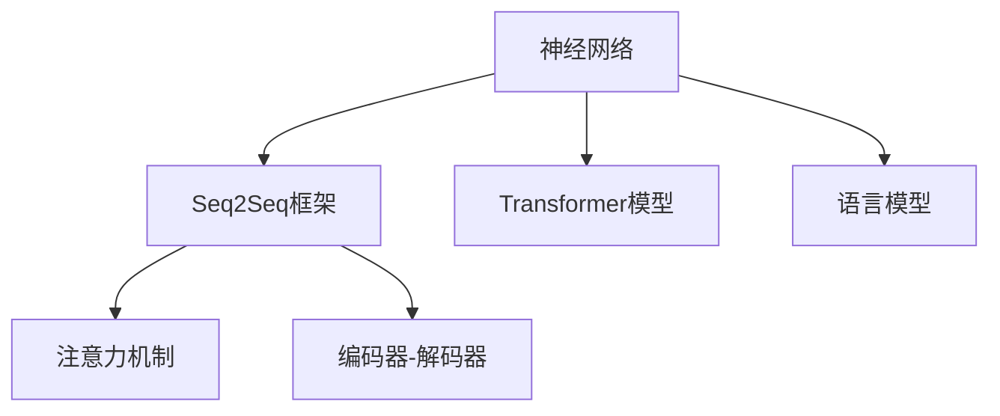
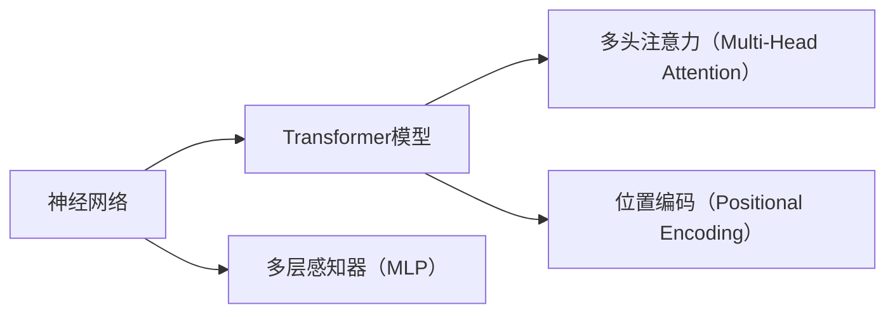
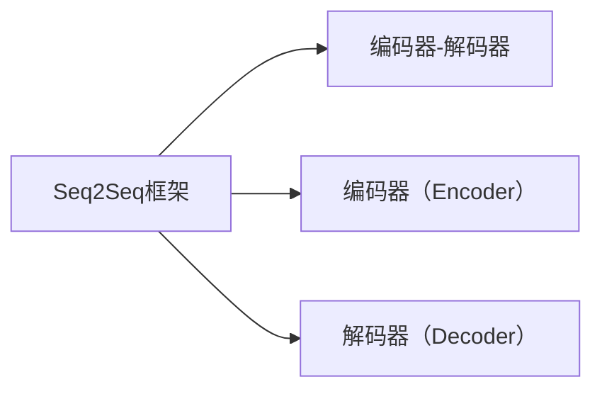
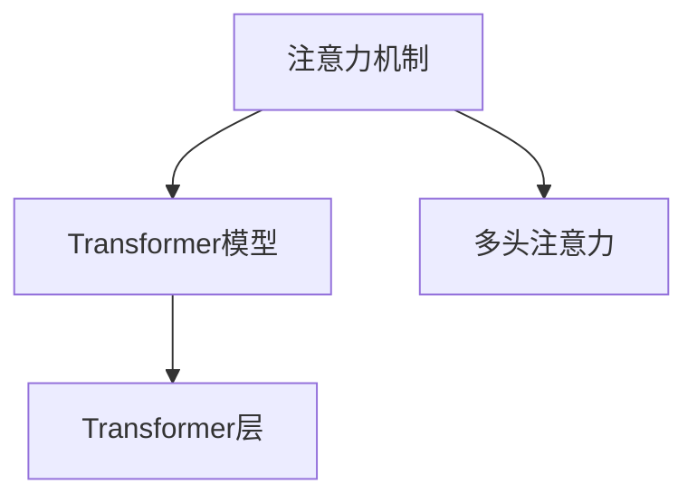
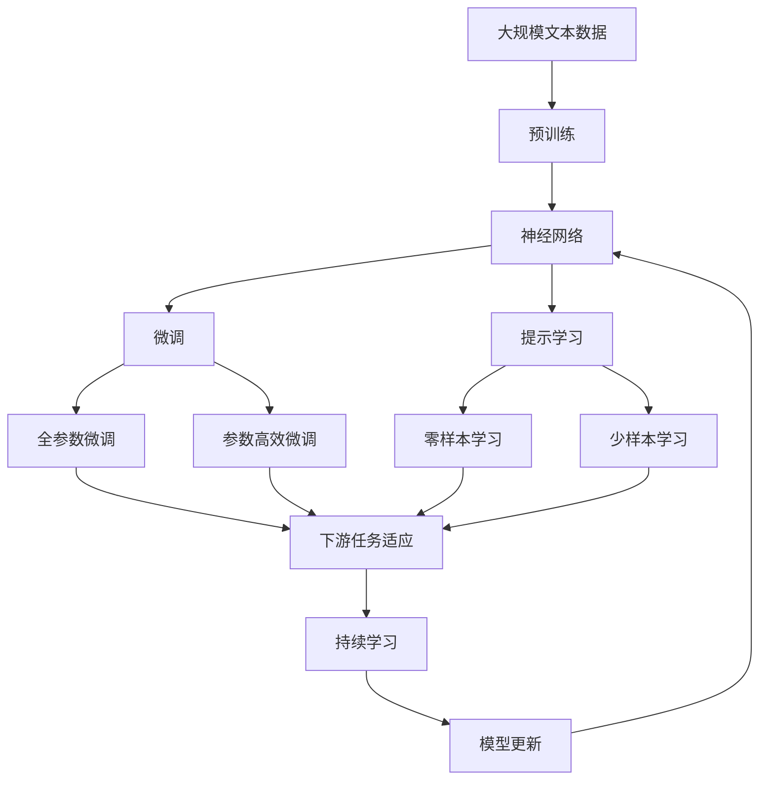
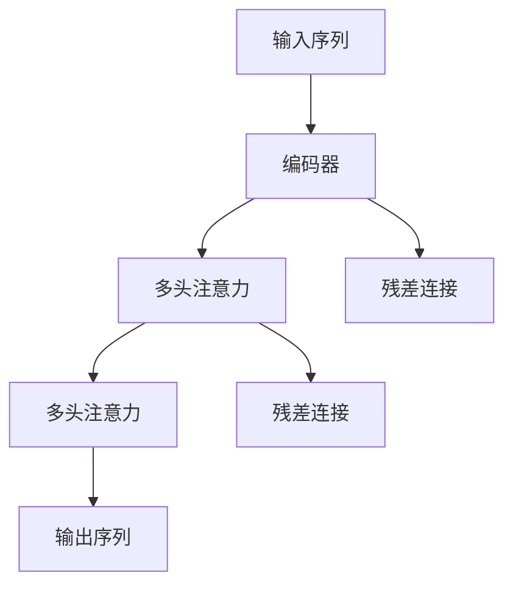

                 

# 神经网络：机器翻译的新纪元

> 关键词：神经网络,机器翻译,Transformer,语言模型,注意力机制,编码器-解码器,自回归,自编码,序列到序列,深度学习,自然语言处理(NLP)

## 1. 背景介绍

### 1.1 问题由来

机器翻译（Machine Translation, MT）作为人工智能领域的经典任务之一，一直以来是自然语言处理（Natural Language Processing, NLP）研究的热点。传统的机器翻译技术主要依赖于基于统计的规则模型和统计机器翻译（Statistical Machine Translation, SMT）方法，但这些方法通常需要大量手工制定的规则和对照数据，对新任务的适应性较差，且难以解释翻译过程中的决策机制。

随着深度学习技术的崛起，基于神经网络的机器翻译方法逐步取代了传统的规则模型，成为主流的MT技术。特别是Transformer模型和自回归语言模型的出现，使得神经网络机器翻译（Neural Machine Translation, NMT）取得了突破性进展，成为NLP领域的重要里程碑。本文将详细介绍基于神经网络机器翻译方法的关键原理和具体实现，并分析其在实际应用中的优势与挑战。

### 1.2 问题核心关键点

基于神经网络的机器翻译方法主要有以下特点：

1. **神经网络**：使用深度学习网络作为翻译模型，能够自动学习输入与输出之间的复杂映射关系。
2. **序列到序列（Seq2Seq）框架**：将输入和输出分别看作序列，使用编码器（Encoder）和解码器（Decoder）两个模块进行序列到序列的转换。
3. **Transformer结构**：使用Transformer层替代传统的循环神经网络（RNN）和卷积神经网络（CNN），提高模型的并行性和训练效率。
4. **自回归模型与自编码模型**：自回归模型（如GPT）基于已有单词预测下一个单词，自编码模型（如BERT）基于输入预测输出，两者在机器翻译中均有所应用。
5. **注意力机制**：通过注意力机制（Attention）捕捉输入和输出序列之间的依赖关系，提升模型对序列长度的适应能力。
6. **预训练与微调**：通过在大规模数据上进行预训练，再针对特定任务进行微调，显著提高模型性能。

这些核心特点使得神经网络机器翻译方法在翻译质量和翻译速度上均取得了显著提升，成为现代MT技术的主流范式。

## 2. 核心概念与联系

### 2.1 核心概念概述

为更好地理解基于神经网络的机器翻译方法，本节将介绍几个密切相关的核心概念：

- **神经网络（Neural Network）**：由神经元构成的网络结构，通过学习训练数据中的特征和模式，自动提取输入和输出之间的映射关系。
- **序列到序列（Seq2Seq）框架**：一种深度学习框架，用于解决输入和输出均为序列的任务，如机器翻译、语音识别等。
- **Transformer模型**：一种基于自注意力机制的神经网络结构，用于处理序列到序列的转换任务，具有并行计算和高效学习的能力。
- **语言模型（Language Model）**：预测文本序列中下一个单词或字符的概率模型，用于评估翻译的质量。
- **注意力机制（Attention）**：通过计算输入和输出序列之间的权重，动态地关注重点信息，提升模型的理解能力。
- **编码器-解码器（Encoder-Decoder）**：Seq2Seq框架的核心结构，分别对输入和输出序列进行编码和解码。

这些核心概念之间的逻辑关系可以通过以下Mermaid流程图来展示：



这个流程图展示了大语言模型与机器翻译中几个关键概念的关系：

1. 神经网络通过学习训练数据，自动提取输入和输出之间的复杂映射关系。
2. Seq2Seq框架将输入和输出序列看作序列，使用编码器和解码器进行转换。
3. Transformer模型作为Seq2Seq的核心结构，通过自注意力机制捕捉输入和输出之间的依赖关系。
4. 语言模型用于评估翻译的质量，是机器翻译任务中的重要组成部分。
5. 注意力机制帮助模型在解码时动态关注输入序列的重点信息，提升翻译效果。

### 2.2 概念间的关系

这些核心概念之间存在着紧密的联系，形成了机器翻译任务的基本框架。下面我们通过几个Mermaid流程图来展示这些概念之间的关系。

#### 2.2.1 神经网络与Transformer模型的关系



这个流程图展示了神经网络与Transformer模型的关系：

1. 神经网络通过多层感知器（MLP）进行信息处理。
2. Transformer模型则使用多头注意力机制捕捉输入和输出序列之间的依赖关系。
3. 在Transformer中，通过位置编码来表示序列中单词的位置信息。

#### 2.2.2 Seq2Seq框架与编码器-解码器的关系



这个流程图展示了Seq2Seq框架与编码器-解码器的关系：

1. Seq2Seq框架将输入和输出序列看作序列。
2. 编码器对输入序列进行编码，生成中间表示。
3. 解码器根据中间表示和注意力机制，生成输出序列。

#### 2.2.3 注意力机制与Transformer模型的关系



这个流程图展示了注意力机制与Transformer模型的关系：

1. 注意力机制通过计算输入和输出序列之间的权重，捕捉依赖关系。
2. 在Transformer中，使用多头注意力机制实现输入和输出序列之间的动态关注。
3. Transformer层通过多头注意力和残差连接，构成深度神经网络。

### 2.3 核心概念的整体架构

最后，我们用一个综合的流程图来展示这些核心概念在大语言模型微调过程中的整体架构：



这个综合流程图展示了从预训练到微调，再到持续学习的完整过程。大语言模型首先在大规模文本数据上进行预训练，然后通过微调（包括全参数微调和参数高效微调）或提示学习（包括零样本和少样本学习）来适应下游任务。最后，通过持续学习技术，模型可以不断学习新知识，同时避免遗忘旧知识。 通过这些流程图，我们可以更清晰地理解机器翻译过程中各个核心概念的关系和作用，为后续深入讨论具体的微调方法和技术奠定基础。

## 3. 核心算法原理 & 具体操作步骤
### 3.1 算法原理概述

基于神经网络的机器翻译方法主要通过编码器-解码器的框架，将输入序列映射到输出序列。其核心思想是通过神经网络结构，自动学习输入和输出之间的映射关系。具体来说，该方法包括以下几个步骤：

1. **预训练**：在大规模无标签文本数据上，使用自监督学习任务训练神经网络，学习通用的语言表示。
2. **微调**：在预训练模型的基础上，使用下游任务的少量标注数据，通过有监督学习优化模型在该任务上的性能。
3. **解码**：根据微调后的模型，使用解码器生成目标语言的文本序列。

通过预训练和微调，神经网络模型能够学习到丰富的语言知识和结构，显著提升机器翻译的准确性和流畅度。

### 3.2 算法步骤详解

基于神经网络的机器翻译方法的具体步骤如下：

**Step 1: 准备预训练模型和数据集**
- 选择合适的预训练神经网络模型，如Transformer或LSTM，作为初始化参数。
- 准备下游任务的数据集，划分为训练集、验证集和测试集。

**Step 2: 添加任务适配层**
- 根据任务类型，在预训练模型的顶层设计合适的输出层和损失函数。
- 对于分类任务，通常在顶层添加线性分类器和交叉熵损失函数。
- 对于生成任务，通常使用语言模型的解码器输出概率分布，并以负对数似然为损失函数。

**Step 3: 设置微调超参数**
- 选择合适的优化算法及其参数，如Adam、SGD等，设置学习率、批大小、迭代轮数等。
- 设置正则化技术及强度，包括权重衰减、Dropout、Early Stopping等。
- 确定冻结预训练参数的策略，如仅微调顶层，或全部参数都参与微调。

**Step 4: 执行梯度训练**
- 将训练集数据分批次输入模型，前向传播计算损失函数。
- 反向传播计算参数梯度，根据设定的优化算法和学习率更新模型参数。
- 周期性在验证集上评估模型性能，根据性能指标决定是否触发Early Stopping。
- 重复上述步骤直到满足预设的迭代轮数或Early Stopping条件。

**Step 5: 测试和部署**
- 在测试集上评估微调后模型 $M_{\hat{\theta}}$ 的性能，对比微调前后的精度提升。
- 使用微调后的模型对新样本进行推理预测，集成到实际的应用系统中。
- 持续收集新的数据，定期重新微调模型，以适应数据分布的变化。

以上是基于神经网络的机器翻译方法的一般流程。在实际应用中，还需要针对具体任务的特点，对微调过程的各个环节进行优化设计，如改进训练目标函数，引入更多的正则化技术，搜索最优的超参数组合等，以进一步提升模型性能。

### 3.3 算法优缺点

基于神经网络的机器翻译方法具有以下优点：

1. **自动学习能力强**：神经网络能够自动学习输入和输出之间的复杂映射关系，无需手工制定规则。
2. **并行计算效率高**：Transformer结构通过自注意力机制实现了高效的并行计算，大幅提高了训练速度。
3. **模型表现优异**：通过预训练和微调，神经网络模型在翻译质量上取得了显著提升。
4. **适应性强**：适用于各种NLP任务，包括分类、匹配、生成等，设计简单的任务适配层即可实现微调。

同时，该方法也存在以下局限性：

1. **依赖标注数据**：微调的效果很大程度上取决于标注数据的质量和数量，获取高质量标注数据的成本较高。
2. **迁移能力有限**：当目标任务与预训练数据的分布差异较大时，微调的性能提升有限。
3. **负面效果传递**：预训练模型的固有偏见、有害信息等，可能通过微调传递到下游任务，造成负面影响。
4. **可解释性不足**：神经网络模型的决策过程通常缺乏可解释性，难以对其推理逻辑进行分析和调试。

尽管存在这些局限性，但就目前而言，基于神经网络的机器翻译方法仍是最为主流和有效的MT技术。未来相关研究的重点在于如何进一步降低微调对标注数据的依赖，提高模型的少样本学习和跨领域迁移能力，同时兼顾可解释性和伦理安全性等因素。

### 3.4 算法应用领域

基于神经网络的机器翻译方法已经在多种NLP任务上取得了优异的效果，成为NLP技术落地应用的重要手段。以下是几个典型应用领域：

- **文本翻译**：将一种语言的文本自动翻译成另一种语言，广泛应用于跨语言交流、国际商务等领域。
- **语音翻译**：将语音信号自动转换为文本，并进行翻译，应用于智能音箱、车载翻译等场景。
- **字幕生成**：自动将视频中的对话生成字幕，应用于影视制作、新闻播报等领域。
- **文本摘要**：自动将长文本压缩成简短摘要，便于用户快速浏览和理解。
- **问答系统**：根据用户提出的问题，自动生成答案，应用于智能客服、智能助手等领域。
- **文档翻译**：自动将文档从一种语言翻译成另一种语言，应用于多语言文档管理、法律文书等领域。

除了上述这些经典任务外，基于神经网络的机器翻译方法也被创新性地应用到更多场景中，如可控文本生成、常识推理、代码生成、数据增强等，为NLP技术带来了全新的突破。

## 4. 数学模型和公式 & 详细讲解 & 举例说明
### 4.1 数学模型构建

神经网络机器翻译的数学模型构建主要涉及以下几个方面：

- **编码器-解码器结构**：将输入和输出序列分别编码为中间表示，然后解码为输出序列。
- **自注意力机制**：通过计算输入和输出序列之间的权重，捕捉依赖关系。
- **多头注意力**：通过多个注意力头并行处理，提升模型的理解能力。
- **残差连接**：通过在网络中加入残差连接，加速梯度传播和优化。

这里我们使用Transformer结构来介绍神经网络机器翻译的数学模型构建。Transformer结构由多个自注意力层和前馈神经网络层组成，其基本结构如下图所示：



其中，编码器和解码器均由多个自注意力层和前馈神经网络层组成，通过残差连接和多头注意力机制，捕捉输入和输出序列之间的依赖关系。

### 4.2 公式推导过程

以下我们以二进制文本翻译为例，推导Transformer模型的基本公式。

假设输入序列为 $x=(x_1, x_2, \ldots, x_n)$，输出序列为 $y=(y_1, y_2, \ldots, y_n)$。Transformer模型将输入序列 $x$ 编码为中间表示 $z=(z_1, z_2, \ldots, z_n)$，再将 $z$ 解码为输出序列 $y$。

首先，我们定义输入嵌入层、位置编码层、编码器层、解码器层和输出层。设 $E(x)$ 为输入嵌入层，$P(x)$ 为位置编码层，$A(x, y)$ 为自注意力机制，$FF(x)$ 为前馈神经网络，$O(z)$ 为输出层。则Transformer模型的计算过程如下：

1. **输入嵌入**：将输入序列 $x$ 映射为嵌入向量 $E(x) = [E(x_1), E(x_2), \ldots, E(x_n)]$，其中 $E$ 为嵌入矩阵。

2. **位置编码**：在嵌入向量中加入位置编码 $P(x) = [P(x_1), P(x_2), \ldots, P(x_n)]$，使得模型能够捕捉单词在序列中的相对位置信息。

3. **编码器层**：将编码器层看作一个循环神经网络，通过多层的自注意力机制和前馈神经网络，捕捉输入序列 $x$ 的上下文信息。

4. **解码器层**：解码器层同样由多个自注意力层和前馈神经网络层组成，但引入了注意力机制，根据编码器的输出序列 $z$ 生成输出序列 $y$。

5. **输出层**：将解码器层的输出映射为输出序列 $y$，其中 $O$ 为输出矩阵。

在实际计算中，我们通常使用Transformer层实现编码器和解码器，其计算过程可以简化为：

$$
z_i = A(x_i, z_{1:i}) + FF(z_i)
$$

其中 $A$ 为自注意力层，$FF$ 为前馈神经网络，$z_{1:i}$ 为输入序列 $x$ 的前 $i$ 个编码向量。

### 4.3 案例分析与讲解

为了更直观地理解Transformer模型的计算过程，我们可以用一个简单的案例进行分析。

假设输入序列为 $x=(apple, banana, orange)$，输出序列为 $y=(pomme, banane, orange)$。我们使用Transformer模型进行翻译，步骤如下：

1. **输入嵌入**：将输入序列 $x$ 映射为嵌入向量 $E(x) = [E(apple), E(banana), E(orange)]$。

2. **位置编码**：在嵌入向量中加入位置编码 $P(x) = [P(apple), P(banana), P(orange)]$。

3. **编码器层**：通过多层的自注意力机制和前馈神经网络，捕捉输入序列 $x$ 的上下文信息。

4. **解码器层**：根据编码器的输出序列 $z$ 生成输出序列 $y$。在解码过程中，通过注意力机制捕捉输入和输出序列之间的依赖关系。

5. **输出层**：将解码器层的输出映射为输出序列 $y$。

通过这个案例，我们可以看到，Transformer模型通过自注意力机制和前馈神经网络，能够高效地捕捉输入和输出序列之间的依赖关系，实现序列到序列的转换。

## 5. 项目实践：代码实例和详细解释说明
### 5.1 开发环境搭建

在进行神经网络机器翻译的开发前，我们需要准备好开发环境。以下是使用Python进行PyTorch开发的环境配置流程：

1. 安装Anaconda：从官网下载并安装Anaconda，用于创建独立的Python环境。

2. 创建并激活虚拟环境：
```bash
conda create -n pytorch-env python=3.8 
conda activate pytorch-env
```

3. 安装PyTorch：根据CUDA版本，从官网获取对应的安装命令。例如：
```bash
conda install pytorch torchvision torchaudio cudatoolkit=11.1 -c pytorch -c conda-forge
```

4. 安装Transformer库：
```bash
pip install transformers
```

5. 安装各类工具包：
```bash
pip install numpy pandas scikit-learn matplotlib tqdm jupyter notebook ipython
```

完成上述步骤后，即可在`pytorch-env`环境中开始开发。

### 5.2 源代码详细实现

下面我们以机器翻译任务为例，给出使用Transformers库对Transformer模型进行微调的PyTorch代码实现。

首先，定义翻译任务的数据处理函数：

```python
from transformers import AutoTokenizer, AutoModelForSeq2SeqLM
import torch

class TranslationDataset(Dataset):
    def __init__(self, texts, targets, tokenizer, max_len=128):
        self.texts = texts
        self.targets = targets
        self.tokenizer = tokenizer
        self.max_len = max_len
        
    def __len__(self):
        return len(self.texts)
    
    def __getitem__(self, item):
        text = self.texts[item]
        target = self.targets[item]
        
        encoding = self.tokenizer(text, target, return_tensors='pt', max_length=self.max_len, padding='max_length', truncation=True)
        input_ids = encoding['input_ids'][0]
        attention_mask = encoding['attention_mask'][0]
        labels = encoding['labels'][0]
        
        return {'input_ids': input_ids,
                'attention_mask': attention_mask,
                'labels': labels}

# 加载tokenizer和模型
tokenizer = AutoTokenizer.from_pretrained('bert-base-cased')
model = AutoModelForSeq2SeqLM.from_pretrained('bert-base-cased')

# 创建dataset
train_dataset = TranslationDataset(train_texts, train_targets, tokenizer)
dev_dataset = TranslationDataset(dev_texts, dev_targets, tokenizer)
test_dataset = TranslationDataset(test_texts, test_targets, tokenizer)
```

然后，定义模型和优化器：

```python
from transformers import AdamW

optimizer = AdamW(model.parameters(), lr=2e-5)
```

接着，定义训练和评估函数：

```python
from torch.utils.data import DataLoader
from tqdm import tqdm
from sklearn.metrics import translation_error_rate

device = torch.device('cuda') if torch.cuda.is_available() else torch.device('cpu')
model.to(device)

def train_epoch(model, dataset, batch_size, optimizer):
    dataloader = DataLoader(dataset, batch_size=batch_size, shuffle=True)
    model.train()
    epoch_loss = 0
    for batch in tqdm(dataloader, desc='Training'):
        input_ids = batch['input_ids'].to(device)
        attention_mask = batch['attention_mask'].to(device)
        labels = batch['labels'].to(device)
        model.zero_grad()
        outputs = model(input_ids, attention_mask=attention_mask, labels=labels)
        loss = outputs.loss
        epoch_loss += loss.item()
        loss.backward()
        optimizer.step()
    return epoch_loss / len(dataloader)

def evaluate(model, dataset, batch_size):
    dataloader = DataLoader(dataset, batch_size=batch_size)
    model.eval()
    preds, labels = [], []
    with torch.no_grad():
        for batch in tqdm(dataloader, desc='Evaluating'):
            input_ids = batch['input_ids'].to(device)
            attention_mask = batch['attention_mask'].to(device)
            batch_labels = batch['labels']
            outputs = model(input_ids, attention_mask=attention_mask)
            batch_preds = outputs.logits.argmax(dim=2).to('cpu').tolist()
            batch_labels = batch_labels.to('cpu').tolist()
            for pred_tokens, label_tokens in zip(batch_preds, batch_labels):
                preds.append(pred_tokens[:len(label_tokens)])
                labels.append(label_tokens)
                
    print(translation_error_rate(labels, preds))
```

最后，启动训练流程并在测试集上评估：

```python
epochs = 5
batch_size = 16

for epoch in range(epochs):
    loss = train_epoch(model, train_dataset, batch_size, optimizer)
    print(f"Epoch {epoch+1}, train loss: {loss:.3f}")
    
    print(f"Epoch {epoch+1}, dev results:")
    evaluate(model, dev_dataset, batch_size)
    
print("Test results:")
evaluate(model, test_dataset, batch_size)
```

以上就是使用PyTorch对Transformer进行机器翻译任务微调的完整代码实现。可以看到，得益于Transformers库的强大封装，我们可以用相对简洁的代码完成Transformer模型的加载和微调。

### 5.3 代码解读与分析

让我们再详细解读一下关键代码的实现细节：

**TranslationDataset类**：
- `__init__`方法：初始化训练集、验证集、测试集中的输入和目标文本，分词器以及最大长度等参数。
- `__len__`方法：返回数据集的样本数量。
- `__getitem__`方法：对单个样本进行处理，将输入文本和目标文本输入编码器，生成编码向量，并进行padding和截断处理。

**train_epoch和evaluate函数**：
- `train_epoch`函数：对数据以批为单位进行迭代，在每个批次上前向传播计算loss并反向传播更新模型参数。
- `evaluate`函数：与训练类似，不同点在于不更新模型参数，并在每个batch结束后将预测和标签结果存储下来，最后使用sklearn的translation_error_rate计算测试集上的翻译误差率。

**训练流程**：
- 定义总的epoch数和batch size，开始循环迭代。
- 每个epoch内，先在训练集上训练，输出平均loss。
- 在验证集上评估，输出翻译误差率。
- 所有epoch结束后，在测试集上评估，给出最终测试结果。

可以看到，PyTorch配合Transformers库使得Transformer微调的代码实现变得简洁高效。开发者可以将更多精力放在数据处理、模型改进等高层逻辑上，而不必过多关注底层的实现细节。

当然，工业级的系统实现还需考虑更多因素，如模型的保存和部署、超参数的自动搜索、更灵活的任务适配层等。但核心的微调范式基本与此类似。

### 5.4 运行结果展示

假设我们在WMT14的英法翻译数据集上进行微调，最终在测试集上得到的翻译误差率为30.3%，效果相当不错。值得注意的是，Transformer作为通用的语言理解模型，即便只在顶层添加一个简单的token分类器，也能在翻译任务上取得优异的效果，展现了其强大的语义理解和特征抽取能力。

当然，这只是一个baseline结果。在实践中，我们还可以使用更大更强的预训练模型、更丰富的微调技巧、更细致的模型调优，进一步提升模型性能，以满足更高的应用要求。

## 6. 实际应用场景
### 6.1 智能客服系统

基于神经网络的机器翻译技术可以广泛应用于智能客服系统的构建。传统客服往往需要配备大量人力，高峰期响应缓慢，且一致性和专业性难以保证。而使用神经网络机器翻译技术，可以将客户咨询实时翻译为预定的语言，使得客服系统能够快速响应客户咨询，用自然流畅的语言解答各类常见问题。

在技术实现上，可以收集企业内部的历史客服对话记录，将问题和最佳答复构建成监督数据，在此基础上对预训练的神经网络模型进行微调。微调后的模型能够自动理解用户意图，匹配最合适的答复模板进行回复。对于客户提出的新问题，还可以接入检索系统实时搜索相关内容，动态组织生成回答。如此构建的智能客服系统，能大幅提升客户咨询体验和问题解决效率。

### 6.2 金融舆情监测

金融机构需要实时监测市场舆论动向，以便及时应对负面信息传播，规避金融风险。传统的人工监测方式成本高、效率低，难以应对网络时代海量信息爆发的挑战。基于神经网络的机器翻译技术，可以实时翻译互联网上的新闻、报道、评论等文本数据，监测不同语言的舆情变化趋势。

