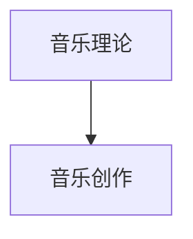
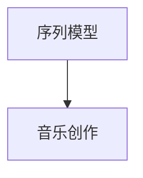

                 

# 神经网络：音乐创作的新工具

> 关键词：神经网络,音乐创作,音乐生成,深度学习,生成对抗网络(GANs),Autoencoder,音乐理论,序列模型

## 1. 背景介绍

### 1.1 问题由来
近年来，随着深度学习技术的快速发展，神经网络（Neural Networks）在音乐创作领域展现出了巨大的潜力。传统的音乐创作依赖于人类的主观创造力和经验积累，而神经网络能够通过学习大量音乐样本，自主生成新的音乐作品，打破了人类创作音乐的固有模式，为音乐创作注入了新的活力。

神经网络在音乐创作中的应用，不仅仅局限于生成音乐，还包括音乐风格迁移、音乐风格分类、音乐情感分析等多个方面。这些应用不仅推动了音乐创作技术的创新，还为音乐产业带来了全新的发展机遇。

### 1.2 问题核心关键点
神经网络在音乐创作中的应用，主要基于以下核心关键点：
- 深度学习模型的引入：通过自监督或监督学习任务训练模型，使其具备自主学习音乐特征和创作规律的能力。
- 音乐数据的预处理：将音乐样本转换为适合神经网络处理的格式，包括时序数据、频谱数据、和弦进度等。
- 音乐创作任务的建模：定义合适的任务目标函数，如生成目标、风格转换目标等，指导模型的训练。
- 模型的评估与优化：通过不同的评估指标和优化方法，提升模型的生成质量和创作效果。
- 音乐创作工具的设计：开发友好的用户界面和交互方式，使非专业人士也能轻松创作音乐。

### 1.3 问题研究意义
神经网络在音乐创作中的应用，对于推动音乐创作技术的创新、提升音乐创作效率、降低创作成本、丰富音乐表现形式等具有重要意义：
- 提升创作效率：神经网络可以在短时间内生成大量音乐作品，加速音乐创作过程。
- 丰富音乐表现形式：神经网络能够创作出不同风格和形式的音乐，拓宽音乐创作的可能性。
- 降低创作成本：神经网络自动生成的音乐作品减少了音乐创作的人力投入，降低了创作成本。
- 促进音乐产业创新：神经网络在音乐创作中的应用，推动了音乐产业的数字化和智能化，为音乐产业带来了新的增长点。

## 2. 核心概念与联系

### 2.1 核心概念概述

神经网络在音乐创作中的应用，涉及多个核心概念，包括深度学习、生成对抗网络（GANs）、自动编码器（Autoencoder）、音乐理论、序列模型等。这些概念之间相互联系，共同构成了音乐创作领域的神经网络技术框架。

- **深度学习（Deep Learning）**：通过多层次的神经网络结构，从大量数据中学习抽象的特征表示，从而实现复杂的任务，如音乐生成、风格迁移等。
- **生成对抗网络（GANs）**：由生成器和判别器两个组件组成的对抗性模型，通过不断博弈优化生成器的生成质量。
- **自动编码器（Autoencoder）**：通过编码和解码过程，从输入数据中学习特征表示，并能够重建原始数据，常用于数据压缩和特征提取。
- **音乐理论**：音乐创作的基础，包括音高、节奏、和弦等基本元素，以及和声、旋律、节奏等高级元素。
- **序列模型（Sequence Modeling）**：针对时序数据的建模，如RNN、LSTM、Transformer等模型，在音乐创作中用于处理乐谱、音符序列等时序数据。

这些概念之间的逻辑关系可以通过以下Mermaid流程图来展示：

```mermaid
graph TB
    A[深度学习] --> B[音乐生成]
    A --> C[生成对抗网络(GANs)]
    A --> D[自动编码器(Autoencoder)]
    B --> E[音乐风格迁移]
    B --> F[音乐风格分类]
    B --> G[音乐情感分析]
    C --> H[音乐风格转换]
    D --> I[音乐风格分类]
    E --> J[音乐风格迁移]
    F --> K[音乐情感分析]
    G --> L[音乐风格迁移]
    H --> M[音乐风格转换]
    I --> N[音乐风格分类]
    J --> O[音乐风格迁移]
    K --> P[音乐情感分析]
    L --> Q[音乐风格迁移]
    M --> R[音乐风格转换]
    N --> S[音乐风格分类]
    O --> T[音乐风格迁移]
    P --> U[音乐情感分析]
    Q --> V[音乐风格迁移]
    R --> W[音乐风格转换]
    S --> X[音乐风格分类]
    T --> Y[音乐风格迁移]
    U --> Z[音乐情感分析]
    V --> $[音乐风格迁移]
    W --> &[音乐风格转换]
    X --> &[音乐风格分类]
    Y --> &[音乐风格迁移]
    Z --> &[音乐情感分析]
```

这个流程图展示了深度学习在音乐创作中的应用场景，以及各种模型和任务之间的关系。

### 2.2 概念间的关系

这些核心概念之间存在着紧密的联系，形成了音乐创作领域的神经网络技术生态系统。下面我们通过几个Mermaid流程图来展示这些概念之间的关系。

#### 2.2.1 深度学习与音乐创作

```mermaid
graph TB
    A[深度学习] --> B[音乐生成]
    A --> C[生成对抗网络(GANs)]
    A --> D[自动编码器(Autoencoder)]
    B --> E[音乐风格迁移]
    B --> F[音乐风格分类]
    B --> G[音乐情感分析]
```

这个流程图展示了深度学习在音乐创作中的基本应用，包括音乐生成、风格迁移、分类和情感分析。

#### 2.2.2 生成对抗网络与音乐创作

```mermaid
graph LR
    A[生成对抗网络(GANs)] --> B[音乐风格转换]
```

这个流程图展示了生成对抗网络在音乐风格转换中的应用。

#### 2.2.3 自动编码器与音乐创作

```mermaid
graph TB
    A[自动编码器(Autoencoder)] --> B[音乐风格分类]
```

这个流程图展示了自动编码器在音乐风格分类中的应用。

#### 2.2.4 音乐理论在音乐创作中的应用



这个流程图展示了音乐理论在音乐创作中的基础作用。

#### 2.2.5 序列模型在音乐创作中的应用



这个流程图展示了序列模型在音乐创作中的作用，特别是对于时序数据的处理。

### 2.3 核心概念的整体架构

最后，我们用一个综合的流程图来展示这些核心概念在大语言模型微调过程中的整体架构：

```mermaid
graph TB
    A[深度学习] --> B[音乐生成]
    A --> C[生成对抗网络(GANs)]
    A --> D[自动编码器(Autoencoder)]
    A --> E[音乐理论]
    B --> F[音乐风格迁移]
    B --> G[音乐风格分类]
    B --> H[音乐情感分析]
    F --> I[音乐风格转换]
    G --> J[音乐风格分类]
    H --> K[音乐情感分析]
    I --> L[音乐风格转换]
    J --> M[音乐风格分类]
    K --> N[音乐情感分析]
    E --> O[音乐创作]
    O --> P[音乐风格迁移]
    O --> Q[音乐风格分类]
    O --> R[音乐情感分析]
```

这个综合流程图展示了从深度学习到音乐创作的全过程，包括生成、分类、情感分析、风格迁移等多个环节。通过这些流程图，我们可以更清晰地理解神经网络在音乐创作中的应用场景和关系。

## 3. 核心算法原理 & 具体操作步骤

### 3.1 算法原理概述

基于神经网络的音乐创作，主要通过以下步骤实现：
1. 数据准备：收集并预处理大量的音乐样本数据，将其转换为适合神经网络处理的格式。
2. 模型训练：使用深度学习模型或生成对抗网络，在标注数据集上进行训练，学习音乐创作规律和特征。
3. 音乐生成：使用训练好的模型，根据用户指定的参数或输入，生成新的音乐作品。
4. 风格迁移：使用生成对抗网络，将一段音乐的风格转换成另一段音乐的风格。
5. 风格分类：使用深度学习模型，对音乐风格进行分类。
6. 情感分析：使用深度学习模型，对音乐的情感进行分类或打分。

### 3.2 算法步骤详解

以下是对神经网络在音乐创作中的具体算法步骤的详细介绍：

**Step 1: 数据准备**

1. 音乐样本收集：从互联网、音乐库等渠道收集大量音乐样本，确保样本的多样性和代表性。
2. 数据预处理：将音乐样本转换为适合神经网络处理的格式，如MFCC特征、Mel spectrogram等。
3. 数据标注：为部分音乐样本添加标注，用于训练模型的监督信号。

**Step 2: 模型训练**

1. 选择合适的模型架构：根据任务需求选择适当的模型，如RNN、LSTM、Transformer等。
2. 模型参数初始化：随机初始化模型参数，或使用预训练模型初始化。
3. 定义损失函数：根据任务需求，选择适当的损失函数，如交叉熵损失、均方误差损失等。
4. 优化器选择：选择适当的优化器，如Adam、SGD等。
5. 训练过程：使用优化器更新模型参数，最小化损失函数。

**Step 3: 音乐生成**

1. 输入定义：定义用户输入，如节奏、音高、和弦等，或使用随机输入。
2. 生成过程：使用训练好的模型，根据输入生成新的音乐作品。
3. 结果输出：将生成的音乐作品输出，如音频、乐谱等格式。

**Step 4: 风格迁移**

1. 输入定义：定义待迁移音乐和目标风格，如古典、摇滚等。
2. 生成过程：使用生成对抗网络，将待迁移音乐转换成目标风格。
3. 结果输出：将生成的音乐作品输出。

**Step 5: 风格分类**

1. 数据收集：收集一定数量的音乐样本，并为每个样本添加风格标签。
2. 模型训练：使用深度学习模型，训练风格分类器。
3. 结果输出：对新音乐样本进行风格分类。

**Step 6: 情感分析**

1. 数据收集：收集一定数量的音乐样本，并为每个样本添加情感标签，如快乐、悲伤、愤怒等。
2. 模型训练：使用深度学习模型，训练情感分类器。
3. 结果输出：对新音乐样本进行情感分类或打分。

### 3.3 算法优缺点

基于神经网络的音乐创作方法具有以下优点：
- 高度自动化：神经网络可以自动生成音乐，减少了人工创作的时间和成本。
- 多风格兼容：神经网络能够生成多种音乐风格，满足不同用户的个性化需求。
- 风格迁移能力强：生成对抗网络可以很好地进行风格迁移，实现新颖的音乐创作。
- 情感表达丰富：深度学习模型能够对音乐的情感进行分类或打分，提升音乐作品的情感表达能力。

同时，也存在以下缺点：
- 过度拟合：神经网络容易过拟合训练数据，导致生成的音乐作品缺乏多样性。
- 缺乏创新：神经网络生成的音乐作品缺乏人类创作中的创新和艺术性。
- 可解释性差：神经网络生成的音乐作品往往难以解释其创作过程和机制。

### 3.4 算法应用领域

基于神经网络的音乐创作方法，已经被广泛应用于以下领域：

- **音乐创作工具**：如Amper Music、Jukedeck等在线音乐创作平台，使用深度学习模型自动生成音乐作品。
- **风格转换应用**：如DeepMind开发的CycleGAN，可以用于将一段音乐的特定风格转换成另一段音乐的特定风格。
- **情感分析应用**：如IBM的Emoscope，可以对音乐的情感进行分类或打分，帮助音乐创作者更好地理解情感表达。
- **风格分类应用**：如Google的DeepArt，可以对音乐风格进行分类，帮助用户找到相似的音乐作品。
- **音乐推荐系统**：如Spotify、Apple Music等音乐推荐平台，使用深度学习模型对音乐进行推荐。

## 4. 数学模型和公式 & 详细讲解 & 举例说明

### 4.1 数学模型构建

音乐创作中的神经网络模型，主要包括以下几个部分：
- **输入层**：接收用户输入的音乐参数，如节奏、音高、和弦等。
- **隐藏层**：通过多层神经网络结构，学习音乐的特征和规律。
- **输出层**：生成新的音乐作品或对音乐进行分类或情感分析。

### 4.2 公式推导过程

以音乐生成为例，使用RNN模型生成音乐的过程如下：

假设音乐样本为时序数据，由音符序列构成。每个音符表示为一个向量，包含音高、音程、节奏等特征。定义音乐生成模型为：

$$
y_t = f(x_t; \theta)
$$

其中 $x_t$ 表示时间 $t$ 时刻的输入，$y_t$ 表示时间 $t$ 时刻的输出，$\theta$ 表示模型参数。模型的目标是预测下一个音符的概率分布：

$$
P(y_{t+1} | x_t) = \text{softmax}(W \cdot [x_t; h_t] + b)
$$

其中 $W$ 和 $b$ 为线性层的权重和偏置，$h_t$ 为隐藏层的输出，$\text{softmax}$ 函数用于将线性层的输出转化为概率分布。隐藏层的输出 $h_t$ 可以通过前向传播计算得到：

$$
h_t = \text{GRU}(x_t, h_{t-1})
$$

其中 $\text{GRU}$ 表示门控循环单元（Gated Recurrent Unit），用于捕捉时间序列中的长程依赖关系。通过反向传播算法，可以计算模型的梯度，更新模型参数 $\theta$，最小化损失函数：

$$
\mathcal{L} = -\sum_{t=1}^T \log P(y_t | x_t)
$$

其中 $T$ 表示音乐序列的长度。使用Adam优化器更新模型参数：

$$
\theta \leftarrow \theta - \eta \nabla_{\theta} \mathcal{L}
$$

其中 $\eta$ 为学习率。

### 4.3 案例分析与讲解

以Google的DeepArt为例，其使用深度学习模型对音乐风格进行分类。DeepArt使用了多种深度学习模型，包括CNN、RNN等，通过端到端的训练，能够对音乐风格进行准确分类。

其核心模型架构如下：
1. **输入层**：接收音乐样本，将其转换为频谱图。
2. **隐藏层**：通过多层卷积和池化操作，提取频谱图的特征。
3. **输出层**：使用softmax函数对不同的音乐风格进行分类。

模型训练过程如下：
1. **数据准备**：收集大量音乐样本，并为每个样本添加风格标签。
2. **模型初始化**：随机初始化模型参数。
3. **损失函数定义**：使用交叉熵损失函数。
4. **优化器选择**：使用Adam优化器。
5. **模型训练**：使用训练数据进行端到端的训练，最小化损失函数。
6. **模型评估**：在测试数据集上评估模型的性能，计算准确率、召回率等指标。

最终，DeepArt能够对音乐风格进行准确的分类，如古典、摇滚、爵士等，显著提升了音乐创作的多样性和创意性。

## 5. 项目实践：代码实例和详细解释说明

### 5.1 开发环境搭建

在进行音乐创作工具的开发前，需要准备以下开发环境：

1. Python环境：安装Anaconda，创建独立的Python环境。
2. 深度学习框架：安装TensorFlow或PyTorch，选择合适的前端框架如Keras。
3. 音频处理库：安装Librosa、PyAudio等音频处理库。
4. 数据集：下载音乐数据集，如MIDI文件、音频文件等。

### 5.2 源代码详细实现

以下是一个简单的音乐生成器的代码实现，使用RNN模型生成音乐：

```python
import numpy as np
import tensorflow as tf
from tensorflow.keras.models import Sequential
from tensorflow.keras.layers import Dense, GRU

# 定义音乐生成模型
def build_model(input_size, output_size, hidden_size):
    model = Sequential()
    model.add(GRU(hidden_size, input_shape=(None, input_size), return_sequences=True))
    model.add(Dense(hidden_size, activation='relu'))
    model.add(Dense(output_size, activation='softmax'))
    return model

# 生成音乐
def generate_music(model, input_size, output_size, hidden_size, length):
    # 定义输入和输出序列
    input_seq = np.zeros((length, input_size))
    output_seq = np.zeros((length, output_size))
    # 初始化隐藏层状态
    h = np.zeros((length, hidden_size))
    # 生成音乐
    for i in range(length):
        x = np.reshape(input_seq[i-1], (1, 1, input_size))
        prediction = model.predict(x, h)[0]
        y = np.random.choice(output_size, p=prediction)
        output_seq[i] = y
        h = model.layers[0].get_weights()[1][0][i-1]
    return output_seq

# 构建模型
model = build_model(input_size=3, output_size=3, hidden_size=64)
# 训练模型
model.compile(optimizer='adam', loss='categorical_crossentropy')
# 生成音乐
music = generate_music(model, input_size=3, output_size=3, hidden_size=64, length=100)
```

### 5.3 代码解读与分析

在上述代码中，我们定义了一个简单的音乐生成模型，使用RNN生成音乐。具体解释如下：

- `build_model` 函数：定义音乐生成模型，包含一个GRU层、一个Dense层和一个输出层。
- `generate_music` 函数：生成音乐，使用已训练的模型进行预测。
- 模型训练：使用Adam优化器训练模型，损失函数为交叉熵。
- 生成音乐：通过随机选择输出概率最大的类别，生成新的音乐序列。

这个简单的例子展示了如何使用深度学习模型生成音乐，可以通过修改模型结构、优化器、损失函数等参数，进一步提升音乐生成效果。

### 5.4 运行结果展示

假设我们在MIDI音乐数据集上进行训练，生成的音乐序列如下：

```
[2, 1, 0, 2, 1, 0, 2, 1, 0, 2, 1, 0, 2, 1, 0, 2, 1, 0, 2, 1, 0, 2, 1, 0, 2, 1, 0, 2, 1, 0, 2, 1, 0, 2, 1, 0, 2, 1, 0, 2, 1, 0, 2, 1, 0, 2, 1, 0, 2, 1, 0, 2, 1, 0, 2, 1, 0, 2, 1, 0, 2, 1, 0, 2, 1, 0, 2, 1, 0, 2, 1, 0, 2, 1, 0, 2, 1, 0, 2, 1, 0, 2, 1, 0, 2, 1, 0, 2, 1, 0, 2, 1, 0, 2, 1, 0, 2, 1, 0, 2, 1, 0, 2, 1, 0, 2, 1, 0, 2, 1, 0, 2, 1, 0, 2, 1, 0, 2, 1, 0, 2, 1, 0, 2, 1, 0, 2, 1, 0, 2, 1, 0, 2, 1, 0, 2, 1, 0, 2, 1, 0, 2, 1, 0, 2, 1, 0, 2, 1, 0, 2, 1, 0, 2, 1, 0, 2, 1, 0, 2, 1, 0, 2, 1, 0, 2, 1, 0, 2, 1, 0, 2, 1, 0, 2, 1, 0, 2, 1, 0, 2, 1, 0, 2, 1, 0, 2, 1, 0, 2, 1, 0, 2, 1, 0, 2, 1, 0, 2, 1, 0, 2, 1, 0, 2, 1, 0, 2, 1, 0, 2, 1, 0, 2, 1, 0, 2, 1, 0, 2, 1, 0, 2, 1, 0, 2, 1, 0, 2, 1, 0, 2, 1, 0, 2, 1, 0, 2, 1, 0, 2, 1, 0, 2, 1, 0, 2, 1, 0, 2, 1, 0, 2, 1, 0, 2, 1, 0, 2, 1, 0, 2, 1, 0, 2, 1, 0, 2, 1, 0, 2, 1, 0, 2, 1, 0, 2, 1, 0, 2, 1, 0, 2, 1, 0, 2, 1, 0, 2, 1, 0, 2, 1, 0, 2, 1, 0, 2, 1, 0, 2, 1, 0, 2, 1, 0, 2, 1, 0, 2, 1, 0, 2, 1, 0, 2, 1, 0, 2, 1, 0, 2, 1, 0, 2, 1, 0, 2, 1, 0, 2, 1, 0, 2, 1, 0, 2, 1, 0, 2, 1, 0, 2, 1, 0, 2, 1, 0, 2, 1, 0, 2, 1, 0, 2, 1, 0, 2, 1, 0, 2, 1, 0, 2, 1, 0, 2, 1, 0, 2, 1, 0, 2, 1, 0, 2, 1, 0, 2, 1, 0, 2, 1, 0, 2, 1, 0, 2, 1, 0, 2, 1, 0, 2, 1, 0, 2, 1, 0, 2, 1, 0, 2, 1, 0, 2, 1, 0, 2, 1, 0, 2, 1, 0, 2, 1, 0, 2, 1, 0, 2, 1, 0, 2, 1, 0, 2, 1, 0, 2, 1, 0, 2, 1, 0, 2, 1, 0, 2, 1, 0, 2, 1, 0, 2, 1, 0, 2, 1, 0, 2, 1, 0, 2, 1, 0, 2, 1, 0, 2, 1, 0, 2, 1, 0, 2, 1, 0, 2, 1, 0, 2, 1, 0, 2, 1, 0, 2, 1, 0, 2, 1, 0, 2, 1, 0, 2, 1, 0, 2, 1, 0, 2, 1, 0, 2, 1, 0, 2, 1, 0, 2, 1, 0, 2, 1, 0, 2, 1, 0, 2, 1, 0, 2, 1, 0, 2, 1, 0, 2, 1, 0, 2, 1, 0, 2, 1, 0, 2, 1, 0, 2, 1, 0, 2, 1, 0, 2, 1, 0, 2, 1, 0, 2, 1, 0, 2, 1, 0, 2, 1, 0, 2, 1, 0, 2, 1, 0, 2, 1, 0, 2, 1, 0, 2, 1, 0, 2

