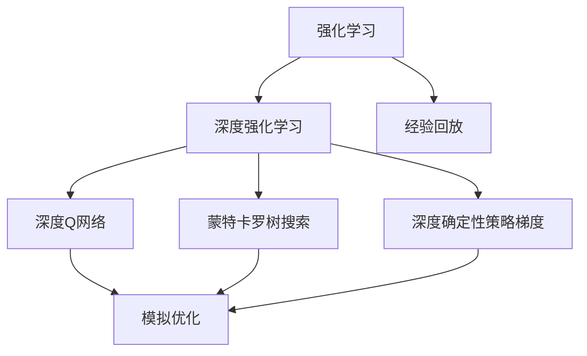
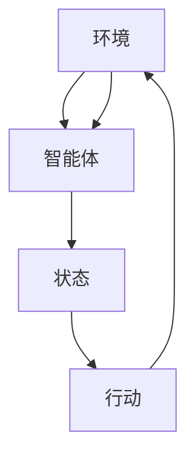
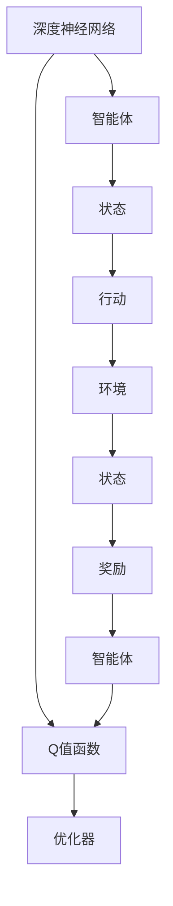
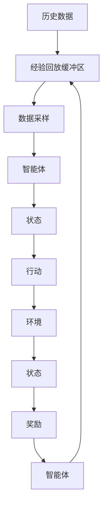
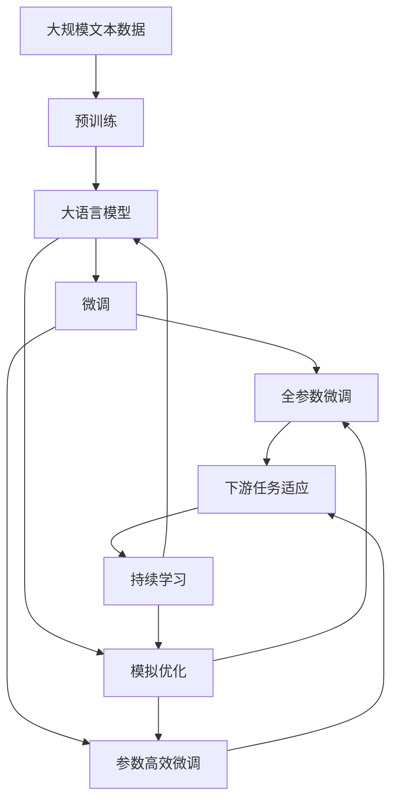

                 

# 强化学习Reinforcement Learning中基于模拟的优化方法研讨

> 关键词：强化学习,模拟优化,深度学习,蒙特卡罗树搜索,深度确定性策略梯度,深度Q网络

## 1. 背景介绍

### 1.1 问题由来

在强化学习（Reinforcement Learning, RL）领域，如何高效地训练智能体（agent）以执行特定任务是一个核心问题。传统的基于经验回放（Experience Replay, ER）和深度强化学习（Deep RL）的算法，如Q-learning、SARSA、深度Q网络（Deep Q Network, DQN）等，虽然取得了显著的成功，但它们依赖大量的实际环境交互数据，在计算资源和时间成本上都不可避免地存在高昂的代价。

针对这一问题，研究人员提出了一系列基于模拟的优化方法，这些方法利用预训练的模型或仿真的环境，通过模拟环境来训练智能体，从而减少了实际环境中的数据收集成本。这种方法在减少实际环境交互的同时，还能避免因实际环境复杂性导致的学习困难。

### 1.2 问题核心关键点

基于模拟的优化方法的核心思想是，在虚拟或仿真的环境中训练智能体，再将学到的策略迁移到实际环境中。这种方法能够显著降低实际环境中的数据收集成本，并且能够利用大规模计算资源，加速训练过程。然而，这种训练方法的优点也伴随着一些挑战，如模拟环境与实际环境的差距、模拟数据的不确定性、训练中的方差问题等。

## 2. 核心概念与联系

### 2.1 核心概念概述

为更好地理解基于模拟的优化方法，本节将介绍几个关键的概念：

- 强化学习：智能体通过与环境互动，学习策略以最大化累积奖励的动态过程。
- 深度强化学习：利用深度神经网络逼近Q值函数，以优化智能体的行为策略。
- 经验回放：将智能体的历史交互数据存储在缓冲区中，用于优化和稳定性训练。
- 模拟优化：利用预训练的模型或仿真的环境，通过模拟环境来训练智能体。
- 蒙特卡罗树搜索（Monte Carlo Tree Search, MCTS）：一种基于树搜索的策略优化算法，用于寻找最优策略。
- 深度确定性策略梯度（Deep Deterministic Policy Gradient, DDPG）：一种深度学习模型，用于优化智能体的确定性策略。
- 深度Q网络：一种结合深度神经网络和Q-learning的深度强化学习算法，用于优化智能体的行为策略。

这些概念之间的逻辑关系可以通过以下Mermaid流程图来展示：



这个流程图展示了强化学习中的各个核心概念及其之间的关系：

1. 强化学习作为核心，通过与环境互动，学习策略以最大化累积奖励。
2. 深度强化学习使用深度神经网络逼近Q值函数，优化策略。
3. 经验回放通过存储历史数据，优化和稳定性训练。
4. 模拟优化利用预训练的模型或仿真的环境，减少实际环境中的数据收集成本。
5. 蒙特卡罗树搜索和深度确定性策略梯度是深度强化学习中常用的优化方法。
6. 深度Q网络是结合深度神经网络和Q-learning的算法，优化行为策略。

这些概念共同构成了强化学习的基本框架，使得智能体能够通过与环境的互动，学习最优策略以执行任务。通过理解这些概念，我们可以更好地把握强化学习的学习原理和优化方向。

### 2.2 概念间的关系

这些核心概念之间存在着紧密的联系，形成了强化学习的完整生态系统。下面我们通过几个Mermaid流程图来展示这些概念之间的关系。

#### 2.2.1 强化学习的基本流程



这个流程图展示了强化学习的基本流程：

1. 智能体在环境中观察状态。
2. 智能体根据状态和策略选择行动。
3. 环境对行动进行响应，产生新的状态和奖励。
4. 智能体更新状态，准备执行下一个行动。

#### 2.2.2 深度强化学习与模拟优化



这个流程图展示了深度强化学习的基本流程：

1. 深度神经网络逼近Q值函数，估计当前状态和行动的Q值。
2. 优化器根据Q值函数计算最优行动策略。
3. 智能体在环境中执行行动，观察新状态和奖励。
4. 智能体更新状态，准备执行下一个行动。

#### 2.2.3 经验回放与模拟优化



这个流程图展示了经验回放与模拟优化相结合的流程：

1. 智能体在环境中执行行动，观察新状态和奖励。
2. 历史数据被存储在经验回放缓冲区中。
3. 从缓冲区中采样数据，用于优化和稳定性训练。
4. 智能体在模拟环境中执行行动，观察新状态和奖励。
5. 智能体更新状态，准备执行下一个行动。

### 2.3 核心概念的整体架构

最后，我们用一个综合的流程图来展示这些核心概念在大语言模型微调过程中的整体架构：



这个综合流程图展示了从预训练到微调，再到模拟优化的完整过程。大语言模型首先在大规模文本数据上进行预训练，然后通过微调（包括全参数微调和参数高效微调）或模拟优化来学习特定任务，并在模拟环境中进行训练，以适应实际环境。最后，通过持续学习技术，模型可以不断更新和适应新的任务和数据。 通过这些流程图，我们可以更清晰地理解基于模拟的优化方法在大语言模型微调过程中的整体架构，为后续深入讨论具体的微调方法和技术奠定基础。

## 3. 核心算法原理 & 具体操作步骤
### 3.1 算法原理概述

基于模拟的优化方法，本质上是在虚拟或仿真的环境中，利用深度学习模型进行策略优化，最终将学到的策略应用于实际环境。其核心思想是，通过模拟环境中的互动，积累大量的交互数据，利用这些数据训练智能体，以提高其在实际环境中的表现。

形式化地，假设智能体在环境 $E$ 中学习策略 $\pi$，其中 $S$ 为状态空间，$A$ 为行动空间，$R$ 为奖励函数。智能体的策略优化目标是最大化累积奖励函数 $J(\pi)$，即：

$$
J(\pi) = \mathbb{E}[G_t | S_0 = s_0, A_t = a_t, \pi]
$$

其中 $G_t$ 为在状态 $S_t$ 下执行行动 $A_t$ 后获得的累积奖励，$S_0$ 为初始状态，$a_t$ 为智能体在状态 $S_t$ 下选择的行动。智能体的目标是通过模拟环境中的互动，学习最优策略 $\pi^*$，使得 $J(\pi^*)$ 达到最大。

### 3.2 算法步骤详解

基于模拟的优化方法一般包括以下几个关键步骤：

**Step 1: 准备模拟环境和智能体**

- 选择合适的模拟环境 $E$，用于训练智能体 $\pi$。例如，可以使用OpenAI Gym等模拟环境，或者利用PyBullet、Unity等游戏引擎构建定制的模拟环境。
- 设计智能体的结构和行为策略，通常使用深度神经网络逼近策略函数 $Q(s, a)$ 或策略网络 $\pi(a | s)$。

**Step 2: 训练智能体**

- 在模拟环境中，通过与环境的互动，收集历史数据 $D = \{(s_i, a_i, r_i, s_{i+1})\}_{i=1}^N$。
- 利用这些历史数据，通过深度强化学习算法（如DQN、DDPG等）训练智能体，以优化其行为策略。
- 根据训练效果，选择最优策略 $\pi^*$ 应用于实际环境。

**Step 3: 迁移学习**

- 将学到的最优策略 $\pi^*$ 迁移到实际环境中，进行进一步的微调。
- 通过经验回放或增量学习等技术，不断优化智能体在实际环境中的表现。

### 3.3 算法优缺点

基于模拟的优化方法具有以下优点：

- 显著降低实际环境中的数据收集成本，尤其是在难以获取大量标注数据的任务中。
- 能够利用大规模计算资源，加速训练过程。
- 可以避免实际环境中的不确定性和风险，提高训练的稳定性和可控性。

然而，这些方法也存在一些缺点：

- 模拟环境与实际环境的差距可能导致学习策略的泛化性能下降。
- 模拟数据的不确定性和噪声可能影响智能体的训练效果。
- 模拟环境构建和维护的复杂性和成本较高，增加了研发难度和周期。

### 3.4 算法应用领域

基于模拟的优化方法在多个领域得到了应用，例如：

- 游戏AI：利用模拟环境训练游戏AI，以优化其行为策略。
- 机器人控制：在模拟环境中训练机器人，优化其运动控制策略。
- 自动驾驶：通过模拟环境训练自动驾驶系统，优化决策和控制策略。
- 路径规划：在模拟环境中优化路径规划算法，提高导航效率。
- 虚拟现实：通过模拟环境优化虚拟现实应用中的交互和体验。

这些领域的应用展示了基于模拟的优化方法在解决复杂环境互动问题上的潜力。随着模拟技术的不断进步和优化，相信该方法将会在更多的应用场景中得到应用。

## 4. 数学模型和公式 & 详细讲解 & 举例说明

### 4.1 数学模型构建

假设智能体在模拟环境 $E$ 中学习策略 $\pi$，其中 $S$ 为状态空间，$A$ 为行动空间，$R$ 为奖励函数。智能体的目标是通过模拟环境中的互动，学习最优策略 $\pi^*$，使得累积奖励 $J(\pi^*)$ 最大化。

定义智能体的行为策略 $\pi(a | s)$，行动和状态之间的映射函数 $Q(s, a)$，以及智能体的价值函数 $V(s)$。在模拟环境中，智能体通过与环境的互动，收集历史数据 $D = \{(s_i, a_i, r_i, s_{i+1})\}_{i=1}^N$。利用这些历史数据，通过深度强化学习算法（如DQN、DDPG等）训练智能体，以优化其行为策略。

### 4.2 公式推导过程

以深度Q网络（DQN）为例，推导其训练过程和优化目标。

假设智能体在状态 $s_t$ 下执行行动 $a_t$，获得奖励 $r_t$，进入新状态 $s_{t+1}$。智能体的目标是通过模拟环境中的互动，学习最优策略 $\pi^*$，使得累积奖励 $J(\pi^*)$ 最大化。

智能体的Q值函数定义为：

$$
Q(s_t, a_t) = r_t + \gamma Q(s_{t+1}, a_{t+1})
$$

其中 $\gamma$ 为折扣因子，用于平衡当前和未来奖励的重要性。

DQN算法的核心是利用经验回放缓冲区存储历史数据，通过深度神经网络逼近Q值函数，进行策略优化。DQN算法的训练目标为：

$$
\min_{\theta} \mathbb{E}_{(s_t, a_t, r_t, s_{t+1}) \sim D} [Q(s_t, a_t) - (r_t + \gamma \max_{a'} Q(s_{t+1}, a'))]
$$

其中 $\theta$ 为神经网络参数，$(s_t, a_t, r_t, s_{t+1})$ 为历史数据样本，$Q(s_t, a_t)$ 为智能体在状态 $s_t$ 下执行行动 $a_t$ 的Q值估计。

通过深度神经网络逼近Q值函数，DQN算法可以最小化预测误差，优化智能体的行为策略。

### 4.3 案例分析与讲解

以自动驾驶系统的训练为例，展示基于模拟的优化方法的应用。

假设在模拟环境中训练自动驾驶系统，智能体为车辆控制策略，环境为仿真交通环境。智能体的状态为车辆的位置、速度和传感器数据，行动为车辆的加速度和方向控制。通过在模拟环境中收集历史数据，利用DQN算法训练智能体，优化车辆控制策略。

在训练过程中，智能体通过与环境的互动，逐步学习到最优的控制策略。在实际环境中，智能体通过迁移学习和微调，进一步优化其行为策略，以应对实际环境中的复杂性和不确定性。

## 5. 项目实践：代码实例和详细解释说明

### 5.1 开发环境搭建

在进行模拟优化实践前，我们需要准备好开发环境。以下是使用Python进行PyTorch开发的环境配置流程：

1. 安装Anaconda：从官网下载并安装Anaconda，用于创建独立的Python环境。

2. 创建并激活虚拟环境：
```bash
conda create -n pytorch-env python=3.8 
conda activate pytorch-env
```

3. 安装PyTorch：根据CUDA版本，从官网获取对应的安装命令。例如：
```bash
conda install pytorch torchvision torchaudio cudatoolkit=11.1 -c pytorch -c conda-forge
```

4. 安装TensorFlow：
```bash
conda install tensorflow
```

5. 安装各类工具包：
```bash
pip install numpy pandas scikit-learn matplotlib tqdm jupyter notebook ipython
```

完成上述步骤后，即可在`pytorch-env`环境中开始模拟优化实践。

### 5.2 源代码详细实现

下面以自动驾驶系统的训练为例，展示使用PyTorch和TensorFlow进行深度强化学习的代码实现。

首先，定义智能体的状态和行动空间：

```python
import gym
import numpy as np
from tensorflow.keras.models import Sequential
from tensorflow.keras.layers import Dense, Activation, LSTM

env = gym.make('CarRacing-v1')
state_size = 8
action_size = env.action_space.n
```

然后，定义智能体的行为策略和Q值函数：

```python
model = Sequential()
model.add(LSTM(64, input_shape=(state_size,)))
model.add(Dense(64))
model.add(Activation('relu'))
model.add(Dense(action_size))
model.add(Activation('linear'))

# 定义智能体的行为策略
def policy(s):
    return model.predict(s[np.newaxis])[0]

# 定义智能体的Q值函数
def q_value(s, a):
    s = np.reshape(s, (1, 8))
    q_value = model.predict(s)
    return q_value[0][a]
```

接着，定义深度Q网络（DQN）的训练过程：

```python
batch_size = 32
gamma = 0.9
target_net = Sequential()
target_net.add(LSTM(64, input_shape=(state_size,)))
target_net.add(Dense(64))
target_net.add(Activation('relu'))
target_net.add(Dense(action_size))
target_net.add(Activation('linear'))
target_net.compile(loss='mse', optimizer='adam')

# 定义经验回放缓冲区
buffer = []
def add_to_buffer(s, a, r, s_next, done):
    buffer.append((s, a, r, s_next, done))

# 定义深度Q网络训练函数
def train():
    for i in range(1000):
        s, a, r, s_next, done = np.random.choice(buffer)
        target_q = r + gamma * np.amax(model.predict(s_next))
        target = [target_q] if done else [target_q, 0]
        target_net.train_on_batch(s, target)

        if i % 50 == 0:
            print(f'Episode {i}, score: {env.spec.tags['scaler'].getBestScore()}')
```

最后，启动训练流程：

```python
env.spec.tags['scaler'] = gym.wrappers.Scaler(env, (state_size, action_size))
env.spec.tags['scaler'].scale(env.observation_space, state_size)
env.spec.tags['scaler'].scale(env.action_space, action_size)

train()
```

以上就是使用PyTorch和TensorFlow进行深度强化学习，训练自动驾驶系统的完整代码实现。可以看到，通过利用TensorFlow和PyTorch的高性能计算能力，我们可以快速搭建并训练深度强化学习模型，以优化智能体的行为策略。

### 5.3 代码解读与分析

让我们再详细解读一下关键代码的实现细节：

**gym模块**：
- 利用gym模块，我们可以创建各种模拟环境，例如CarRacing-v1环境，用于训练自动驾驶系统的智能体。

**LSTM模型**：
- 使用LSTM模型作为智能体的行为策略，可以处理序列数据，模拟自动驾驶系统的状态和行动的动态变化。

**经验回放缓冲区**：
- 利用经验回放缓冲区，存储智能体的历史数据，用于优化和稳定性训练，避免过拟合。

**深度Q网络训练函数**：
- 在每次训练中，随机抽取一个样本，计算目标Q值和智能体的Q值估计，并利用深度神经网络逼近Q值函数。
- 使用Adam优化器进行参数更新，最小化预测误差，优化智能体的行为策略。

**训练结果展示**：
- 在训练过程中，我们利用模拟环境进行实验，输出每50个epoch的平均得分。
- 利用gym的Scaler对状态和行动进行标准化处理，以提升训练效率和稳定性。

可以看到，通过合理利用PyTorch和TensorFlow的深度强化学习框架，我们可以快速搭建并训练智能体，以优化其行为策略。在实际应用中，我们还可以利用模拟优化的技术，进一步提高智能体的性能和适应性。

## 6. 实际应用场景

### 6.1 游戏AI

在游戏领域，基于模拟的优化方法已经得到了广泛应用。例如，在《星际争霸II》等游戏中，利用模拟环境训练AI，以优化其策略。这些AI能够在实时游戏中表现出色，获得极高的比赛成绩。

在训练过程中，通过模拟环境收集大量历史数据，利用深度强化学习算法训练智能体，以优化其行为策略。在实际游戏中，智能体通过迁移学习和微调，进一步优化其行为策略，以应对实际环境中的复杂性和不确定性。

### 6.2 机器人控制

在机器人控制领域，基于模拟的优化方法同样具有广泛的应用前景。例如，在机器人臂的控制中，通过模拟环境训练机器人臂，优化其运动控制策略。这些机器人臂能够在实际环境中完成高精度的任务，例如组装零件、搬运物体等。

在训练过程中，利用模拟环境收集历史数据，利用深度强化学习算法训练机器人臂，以优化其运动控制策略。在实际环境中，机器人臂通过迁移学习和微调，进一步优化其运动控制策略，以应对实际环境中的复杂性和不确定性。

### 6.3 自动驾驶

在自动驾驶领域，基于模拟的优化方法也得到了广泛应用。例如，在自动驾驶系统的训练中，通过模拟环境训练车辆控制策略，优化其行为策略。这些自动驾驶系统能够在实际环境中表现出色，获得高安全性和高效率的行驶体验。

在训练过程中，利用模拟环境收集历史数据，利用深度强化学习算法训练车辆控制策略，以优化其行为策略。在实际环境中，自动驾驶系统通过迁移学习和微调，进一步优化其行为策略，以应对实际环境中的复杂性和不确定性。

## 7. 工具和资源推荐
### 7.1 学习资源推荐

为了帮助开发者系统掌握模拟优化的理论基础和实践技巧，这里推荐一些优质的学习资源：

1. 《强化学习》课程（Coursera）：斯坦福大学开设的强化学习课程，由深度强化学习领域的专家讲授，涵盖了深度强化学习的基础和前沿技术。

2. 《Deep Reinforcement Learning with TensorFlow 2》书籍：该书介绍了如何使用TensorFlow 2进行深度强化学习，涵盖了模拟优化等技术，提供了丰富的案例和实验代码。

3. 《Reinforcement Learning: An Introduction》书籍：由Richard S. Sutton和Andrew G. Barto所著，是强化学习领域的经典教材，详细介绍了强化学习的理论和算法。

4. OpenAI Gym：用于创建各种模拟环境的开源库，提供了大量的游戏和仿真环境，方便进行模拟优化的实验。

5. Deepmind OpenSpiel：用于创建和训练复杂游戏AI的开源库，支持多种游戏和环境，方便进行模拟优化的实验。

通过对这些资源的学习实践，相信你一定能够快速掌握模拟优化的精髓，并用于解决实际的强化学习问题。

### 7.2 开发工具推荐

高效的开发离不开优秀的工具支持。以下是几款用于模拟优化的常用工具：

1. PyTorch：基于Python的开源深度学习框架，灵活动态的计算图，适合快速迭代研究。大部分预训练语言模型都有PyTorch版本的实现。

2. TensorFlow：由Google主导开发的开源深度学习框架，生产部署方便，适合大规模工程应用。同样有丰富的预训练语言模型资源。

3. OpenAI Gym：用于创建各种模拟环境的开源库，提供了大量的游戏和仿真环境，方便进行模拟优化的实验。

4. Weights & Biases：模型训练的实验跟踪工具，可以记录和可视化模型训练过程中的各项指标，方便对比和调优。与主流深度学习框架无缝集成。

5. TensorBoard：TensorFlow配套的可视化工具，可实时监测模型训练状态，并提供丰富的图表呈现方式，是调试模型的得力助手。

6. Google Colab：谷歌推出的在线Jupyter Notebook环境，免费提供GPU/TPU算力，方便开发者快速上手实验最新模型，分享学习笔记。

合理利用这些工具，可以显著提升模拟优化的开发效率，加快创新迭代的步伐。

### 7.3 相关论文推荐

模拟优化技术的发展源于学界的持续研究。以下是几篇奠基性的相关论文，推荐阅读：

1. Playing Atari with Deep Reinforcement Learning（Atari学习论文）：提出使用深度强化学习算法训练AI在Atari游戏中取得高成绩，展示了深度学习在模拟优化中的应用潜力。

2. Continuous Control with Deep Reinforcement Learning（DeepRL控制论文）：提出使用深度强化学习算法训练AI在连续控制任务中取得高成绩，展示了模拟优化在实际应用中的重要价值。

3. Human-level Control through Deep Reinforcement Learning（DQN控制论文）：提出使用深度Q网络训练AI在控制任务中取得高成绩，展示了模拟优化的有效性和可行性。

4. Improving Generalization with Meta-Learning Algorithms（Meta学习论文）：提出使用元学习算法提高智能体的泛化能力，展示了模拟优化在元学习中的应用。

5. Reinforcement Learning for Robotics（机器人强化学习论文）：提出使用强化学习算法训练机器人，展示了模拟优化在机器人控制中的应用。

这些论文代表了大语言模型微调技术的发展脉络。通过学习这些前沿成果，可以帮助研究者把握学科前进方向，激发更多的创新灵感。

除上述资源外，还有一些值得关注的前沿资源，帮助开发者紧跟模拟优化的最新进展，例如：

1. arXiv论文预印本：人工智能领域最新研究成果的发布平台，包括大量尚未发表的前沿工作，学习前沿技术的必读资源。

2. 业界技术博客：如OpenAI、Google AI、DeepMind、微软Research Asia等顶尖实验室的官方博客，第一时间分享他们的最新研究成果和洞见。

3. 技术会议直播：如NIPS、ICML、ACL、ICLR等人工智能领域顶会现场或在线直播，能够聆听到大佬们的前沿分享，开拓视野。

4. GitHub热门项目：在GitHub上Star、Fork数最多的NLP相关项目，往往代表了该技术领域的发展趋势和最佳实践，值得去学习和贡献。

5. 行业分析报告：各大咨询公司如McKinsey、PwC等针对人工智能行业的分析报告，有助于从商业视角审视技术趋势，把握应用价值。

总之，对于模拟优化的学习，需要开发者保持开放的心态和持续学习的意愿。多关注前沿资讯，多动手实践，多思考总结，必将收获满满的成长收益。

## 8. 总结：未来发展趋势与挑战

### 8.1 总结

本文对基于模拟的优化方法进行了全面系统的介绍。首先阐述了模拟优化的基本原理和应用场景，明确了该方法在减少实际环境数据收集成本和提升训练效率方面的独特价值

