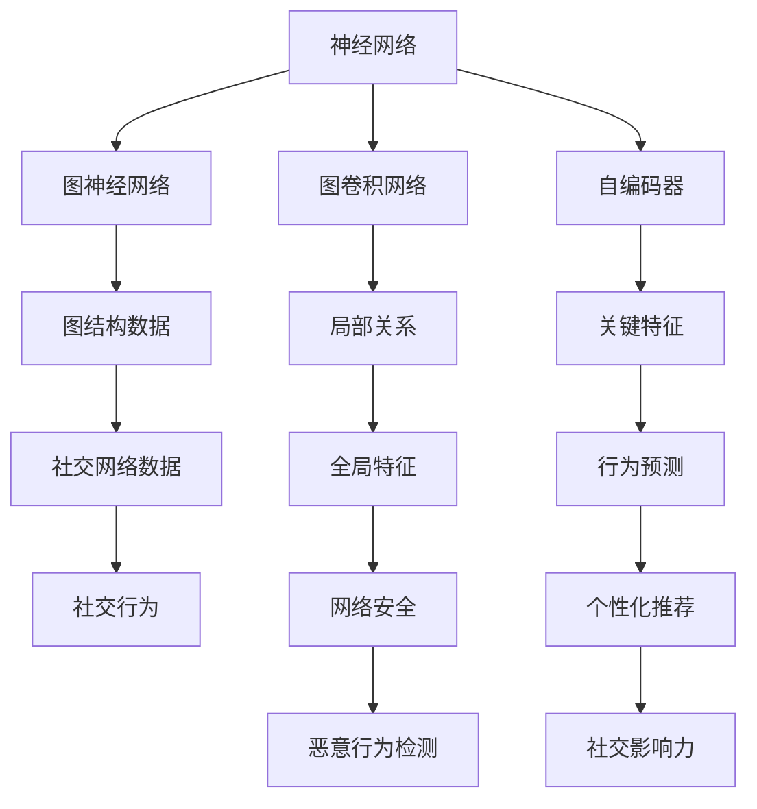
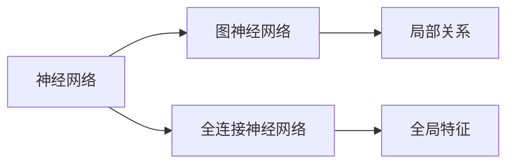
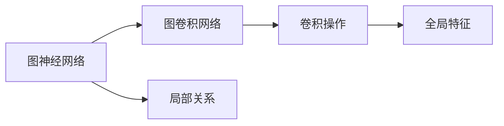
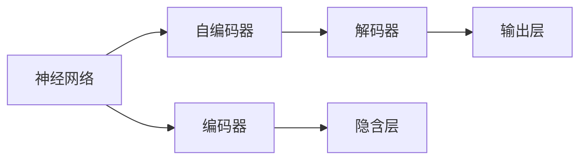
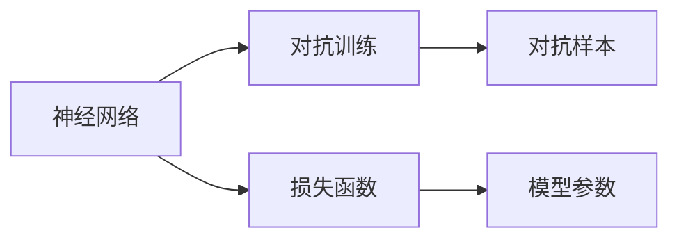
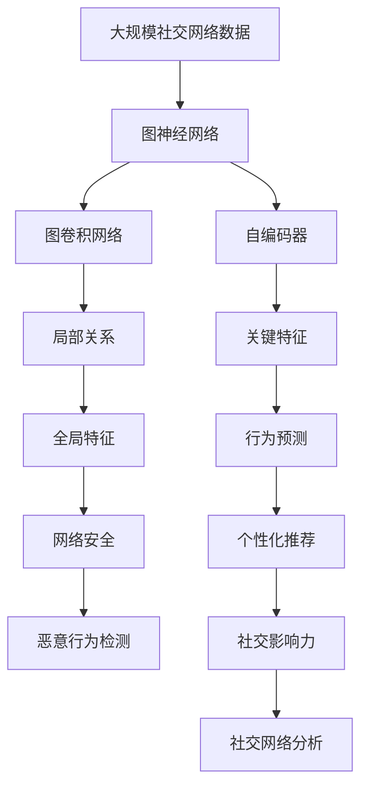

                 

# 神经网络在社交网络分析中的应用

在现代社会，社交网络已成为信息传播和人际交流的重要平台。然而，随着用户数量的急剧增加，社交网络的复杂性和规模也随之扩大，这给传统的社交网络分析方法带来了巨大的挑战。近年来，基于神经网络的社交网络分析方法在诸多领域展现了强大的潜力，为解决这些挑战提供了新的思路。本文将详细探讨神经网络在社交网络分析中的应用，从原理到实践，全面展示其优势和挑战，并展望未来的发展方向。

## 1. 背景介绍

### 1.1 问题由来
随着社交媒体平台的迅速普及，社交网络已成为人们获取信息、表达意见、进行互动的重要渠道。然而，大规模社交网络数据的分析和挖掘任务越来越复杂，传统统计分析方法和机器学习算法难以应对。例如，社交网络中的节点关系复杂多变，用户行为多样且难以预测。这些问题的根源在于社交网络的动态性和复杂性。

为了更有效地挖掘社交网络中的有用信息，研究人员开始探索利用深度学习模型进行社交网络分析。深度学习模型能够处理大规模、高维的社交网络数据，具备强大的非线性建模能力，能够揭示出复杂关系和行为模式。

### 1.2 问题核心关键点
基于神经网络的社交网络分析方法，主要涉及以下几个核心关键点：

- **神经网络模型**：利用多层神经网络进行特征提取和关系建模。
- **图卷积网络（GCN）**：通过卷积操作，捕捉社交网络中的局部关系。
- **图神经网络（GNN）**：将神经网络应用于图结构数据，建模全局关系和局部特征。
- **自编码器**：用于降维和特征重构，提取社交网络的核心特征。
- **对抗训练**：提升模型鲁棒性和泛化能力。

这些关键点共同构成了神经网络在社交网络分析中的基础框架，为深度学习技术在该领域的应用提供了理论基础。

### 1.3 问题研究意义
神经网络在社交网络分析中的应用，对于提升社交网络的数据挖掘和分析能力，揭示社交网络中的行为模式和关系结构，具有重要意义：

1. **数据挖掘**：神经网络能够处理高维、复杂的数据，识别出社交网络中的关键特征和结构。
2. **行为预测**：基于历史数据和当前状态，神经网络可以预测用户的未来行为和关系变化。
3. **个性化推荐**：利用社交网络中的关系和特征，神经网络能够实现更精准的个性化推荐。
4. **网络安全**：神经网络可以检测社交网络中的恶意行为和欺诈活动，提高网络安全水平。
5. **社交分析**：揭示社交网络中的关键人物和关系，支持社交网络的影响力分析。

## 2. 核心概念与联系

### 2.1 核心概念概述

为更好地理解神经网络在社交网络分析中的应用，本节将介绍几个密切相关的核心概念：

- **神经网络（Neural Network, NN）**：通过多层非线性变换进行特征提取和模式建模的计算模型。
- **图神经网络（Graph Neural Network, GNN）**：将神经网络应用于图结构数据，建模节点间的关系和属性。
- **图卷积网络（Graph Convolutional Network, GCN）**：通过卷积操作，捕捉图结构中的局部关系和全局特征。
- **自编码器（Autoencoder）**：用于数据降维和特征重构的神经网络，提取关键特征。
- **对抗训练（Adversarial Training）**：通过对抗样本来增强模型的鲁棒性和泛化能力。

这些核心概念之间的逻辑关系可以通过以下Mermaid流程图来展示：



这个流程图展示了大语言模型的核心概念及其之间的关系：

1. 神经网络通过多层非线性变换进行特征提取和模式建模。
2. 图神经网络将神经网络应用于图结构数据，建模节点间的关系和属性。
3. 图卷积网络通过卷积操作，捕捉图结构中的局部关系和全局特征。
4. 自编码器用于数据降维和特征重构，提取关键特征。
5. 对抗训练通过对抗样本来增强模型的鲁棒性和泛化能力。

这些概念共同构成了神经网络在社交网络分析中的完整生态系统，为其应用提供了理论基础和实践指南。

### 2.2 概念间的关系

这些核心概念之间存在着紧密的联系，形成了神经网络在社交网络分析中的完整应用框架。下面我通过几个Mermaid流程图来展示这些概念之间的关系。

#### 2.2.1 神经网络的结构

```mermaid
graph LR
    A[输入层] --> B[隐藏层] --> C[输出层]
    A --> D[多层感知机 (MLP)]
    B --> E[卷积神经网络 (CNN)]
    C --> F[递归神经网络 (RNN)]
```

这个流程图展示了神经网络的基本结构，包括输入层、隐藏层和输出层，以及几种常见的神经网络类型。

#### 2.2.2 图神经网络与神经网络的关系



这个流程图展示了图神经网络与神经网络的关系，通过将神经网络应用于图结构数据，图神经网络能够捕捉社交网络中的局部关系和全局特征。

#### 2.2.3 图卷积网络与图神经网络的关系



这个流程图展示了图卷积网络与图神经网络的关系，通过卷积操作，图卷积网络能够捕捉社交网络中的局部关系和全局特征。

#### 2.2.4 自编码器与神经网络的关系



这个流程图展示了自编码器与神经网络的关系，通过编码器和解码器，自编码器实现了数据的降维和特征重构。

#### 2.2.5 对抗训练与神经网络的关系



这个流程图展示了对抗训练与神经网络的关系，通过对抗样本，对抗训练能够增强模型的鲁棒性和泛化能力。

### 2.3 核心概念的整体架构

最后，我们用一个综合的流程图来展示这些核心概念在大语言模型微调过程中的整体架构：



这个综合流程图展示了从原始数据到行为预测，再到社交网络分析的完整过程。神经网络通过图神经网络、图卷积网络和自编码器等技术，从原始社交网络数据中提取关键特征和行为模式，最终支持行为预测和社交网络分析。

## 3. 核心算法原理 & 具体操作步骤
### 3.1 算法原理概述

基于神经网络的社交网络分析方法，主要通过以下步骤进行：

1. **数据准备**：收集和预处理社交网络数据，构建图结构表示。
2. **特征提取**：利用神经网络模型对图结构进行特征提取，捕捉节点间的关系和属性。
3. **关系建模**：通过图卷积网络等技术，建模图结构中的局部关系和全局特征。
4. **降维与重构**：利用自编码器等模型进行数据降维和特征重构，提取关键特征。
5. **模型训练**：通过对抗训练等技术，训练神经网络模型，提升模型性能。

这些步骤共同构成了基于神经网络的社交网络分析的核心算法流程，为解决复杂社交网络问题提供了新的思路。

### 3.2 算法步骤详解

基于神经网络的社交网络分析方法，一般包括以下几个关键步骤：

**Step 1: 数据预处理**

- 收集社交网络数据，构建图结构表示。
- 去除噪声和缺失数据，对数据进行归一化处理。
- 对节点和边进行特征工程，提取关键属性和关系。

**Step 2: 图卷积网络建模**

- 选择图卷积网络模型，如GCN。
- 设计卷积核和卷积层数，确定模型的深度和宽度。
- 通过正则化技术，避免过拟合。

**Step 3: 自编码器降维**

- 选择自编码器模型，如VAE、AE等。
- 设计编码器和解码器结构，提取关键特征。
- 通过训练自编码器，实现数据降维和特征重构。

**Step 4: 模型训练**

- 选择优化算法，如Adam、SGD等。
- 设置学习率和迭代次数，设计损失函数和评估指标。
- 通过对抗训练，提升模型鲁棒性和泛化能力。

**Step 5: 模型评估**

- 在测试集上评估模型性能，比较不同模型和超参数配置的效果。
- 分析模型的优势和局限，提出改进建议。

### 3.3 算法优缺点

基于神经网络的社交网络分析方法，具有以下优点：

- **处理高维数据**：神经网络能够处理高维、复杂的数据，揭示社交网络中的复杂关系和行为模式。
- **非线性建模**：神经网络具备非线性建模能力，能够捕捉复杂非线性关系。
- **可解释性强**：神经网络模型可以通过可视化方法解释内部决策过程，有助于理解模型行为。
- **可扩展性强**：神经网络模型能够通过增加层数和节点数，处理更大规模的社交网络数据。

同时，该方法也存在以下缺点：

- **计算资源需求高**：神经网络模型需要大量计算资源，包括GPU和TPU等高性能设备。
- **训练时间长**：神经网络模型训练时间较长，可能需要数小时或数天。
- **数据隐私风险**：社交网络数据涉及大量用户隐私信息，需要谨慎处理。
- **模型复杂度高**：神经网络模型结构复杂，难以解释其内部工作机制。

### 3.4 算法应用领域

基于神经网络的社交网络分析方法，已经在诸多领域展现了强大的应用前景，例如：

- **情感分析**：利用社交网络中的文本数据，进行情感倾向分析。
- **社交推荐**：通过社交网络中的关系和属性，实现个性化推荐。
- **行为预测**：基于历史行为数据，预测用户未来的社交行为和关系变化。
- **网络安全**：检测社交网络中的恶意行为和欺诈活动，提升网络安全水平。
- **社交影响力**：识别社交网络中的关键人物和关系，支持社交网络的影响力分析。
- **舆情分析**：分析社交网络中的舆情变化，支持公共舆情管理。

除了这些经典应用外，神经网络技术还在社交媒体内容生成、社交机器人交互、社交广告投放等领域展现出广泛的应用潜力。

## 4. 数学模型和公式 & 详细讲解 & 举例说明

### 4.1 数学模型构建

本节将使用数学语言对基于神经网络的社交网络分析过程进行更加严格的刻画。

记社交网络图为 $G=(V,E)$，其中 $V$ 为节点集合，$E$ 为边集合。设每个节点 $v_i \in V$ 具有 $d$ 个属性特征 $x_i=(x_{i1},x_{i2},...,x_{id})$，每个边 $e_{ij} \in E$ 具有 $k$ 个属性特征 $a_{ij}=(a_{ij1},a_{ij2},...,a_{ijk})$。假设神经网络模型为 $M_{\theta}$，其中 $\theta$ 为模型参数。

定义社交网络中节点的邻接矩阵 $A \in \mathbb{R}^{n \times n}$，其中 $A_{ij}=1$ 表示节点 $v_i$ 和 $v_j$ 之间存在边，$A_{ij}=0$ 表示节点之间不存在边。

社交网络中的节点关系和属性可以通过图卷积网络模型进行建模。设节点嵌入向量为 $h_i \in \mathbb{R}^{d'}$，则图卷积网络模型可以表示为：

$$
h_i^{(l+1)} = \sigma\left(\sum_{j=1}^n A_{ij}W^{(l)}h_j^{(l)} + b^{(l)}\right)
$$

其中 $W^{(l)}$ 为卷积核权重，$b^{(l)}$ 为偏置项，$\sigma$ 为激活函数。

通过多层图卷积网络，模型可以逐步提取图结构中的局部关系和全局特征。

### 4.2 公式推导过程

以下我们以情感分析任务为例，推导基于神经网络的情感分析过程。

设社交网络中的每个节点 $v_i$ 表示一个用户，每个节点的属性特征 $x_i$ 表示该用户在社交媒体上发布的一条文本。假设社交网络中的每个边 $e_{ij}$ 表示用户之间的关注关系。

定义社交网络中节点的邻接矩阵 $A \in \mathbb{R}^{n \times n}$，其中 $A_{ij}=1$ 表示用户 $i$ 关注用户 $j$，$A_{ij}=0$ 表示用户 $i$ 不关注用户 $j$。

设每个节点 $v_i$ 具有 $d$ 个属性特征 $x_i=(x_{i1},x_{i2},...,x_{id})$，每个边 $e_{ij}$ 具有 $k$ 个属性特征 $a_{ij}=(a_{ij1},a_{ij2},...,a_{ijk})$。假设神经网络模型为 $M_{\theta}$，其中 $\theta$ 为模型参数。

定义社交网络中节点的嵌入向量为 $h_i \in \mathbb{R}^{d'}$，则图卷积网络模型可以表示为：

$$
h_i^{(l+1)} = \sigma\left(\sum_{j=1}^n A_{ij}W^{(l)}h_j^{(l)} + b^{(l)}\right)
$$

其中 $W^{(l)}$ 为卷积核权重，$b^{(l)}$ 为偏置项，$\sigma$ 为激活函数。

通过多层图卷积网络，模型可以逐步提取图结构中的局部关系和全局特征。

假设模型输出为每个节点的情感得分 $y_i$，则情感分析任务可以表示为回归问题，损失函数可以定义为：

$$
L(y_i,\hat{y}_i) = \frac{1}{2}\|y_i - \hat{y}_i\|^2
$$

其中 $\hat{y}_i$ 为模型预测的情感得分。

在训练过程中，利用交叉熵损失函数和优化算法，更新模型参数 $\theta$，最小化损失函数 $L(y_i,\hat{y}_i)$。

通过上述过程，模型能够从社交网络中提取情感信息，对社交媒体文本进行情感分析，支持情感倾向预测和舆情监测等任务。

## 5. 项目实践：代码实例和详细解释说明

### 5.1 开发环境搭建

在进行社交网络分析项目实践前，我们需要准备好开发环境。以下是使用Python进行PyTorch开发的环境配置流程：

1. 安装Anaconda：从官网下载并安装Anaconda，用于创建独立的Python环境。

2. 创建并激活虚拟环境：
```bash
conda create -n pytorch-env python=3.8 
conda activate pytorch-env
```

3. 安装PyTorch：根据CUDA版本，从官网获取对应的安装命令。例如：
```bash
conda install pytorch torchvision torchaudio cudatoolkit=11.1 -c pytorch -c conda-forge
```

4. 安装各类工具包：
```bash
pip install numpy pandas scikit-learn matplotlib tqdm jupyter notebook ipython
```

完成上述步骤后，即可在`pytorch-env`环境中开始社交网络分析项目的开发。

### 5.2 源代码详细实现

下面我们以情感分析任务为例，给出使用Transformers库对社交网络进行情感分析的PyTorch代码实现。

首先，定义情感分析的数据处理函数：

```python
from transformers import BertTokenizer
from torch.utils.data import Dataset
import torch

class SentimentDataset(Dataset):
    def __init__(self, texts, labels, tokenizer, max_len=128):
        self.texts = texts
        self.labels = labels
        self.tokenizer = tokenizer
        self.max_len = max_len
        
    def __len__(self):
        return len(self.texts)
    
    def __getitem__(self, item):
        text = self.texts[item]
        label = self.labels[item]
        
        encoding = self.tokenizer(text, return_tensors='pt', max_length=self.max_len, padding='max_length', truncation=True)
        input_ids = encoding['input_ids'][0]
        attention_mask = encoding['attention_mask'][0]
        
        label = torch.tensor(label, dtype=torch.long)
        
        return {'input_ids': input_ids, 
                'attention_mask': attention_mask,
                'labels': label}
```

然后，定义模型和优化器：

```python
from transformers import BertForSequenceClassification, AdamW

model = BertForSequenceClassification.from_pretrained('bert-base-cased', num_labels=2)

optimizer = AdamW(model.parameters(), lr=2e-5)
```

接着，定义训练和评估函数：

```python
from torch.utils.data import DataLoader
from tqdm import tqdm
from sklearn.metrics import classification_report

device = torch.device('cuda') if torch.cuda.is_available() else torch.device('cpu')
model.to(device)

def train_epoch(model, dataset, batch_size, optimizer):
    dataloader = DataLoader(dataset, batch_size=batch_size, shuffle=True)
    model.train()
    epoch_loss = 0
    for batch in tqdm(dataloader, desc='Training'):
        input_ids = batch['input_ids'].to(device)
        attention_mask = batch['attention_mask'].to(device)
        labels = batch['labels'].to(device)
        model.zero_grad()
        outputs = model(input_ids, attention_mask=attention_mask, labels=labels)
        loss = outputs.loss
        epoch_loss += loss.item()
        loss.backward()
        optimizer.step()
    return epoch_loss / len(dataloader)

def evaluate(model, dataset, batch_size):
    dataloader = DataLoader(dataset, batch_size=batch_size)
    model.eval()
    preds, labels = [], []
    with torch.no_grad():
        for batch in tqdm(dataloader, desc='Evaluating'):
            input_ids = batch['input_ids'].to(device)
            attention_mask = batch['attention_mask'].to(device)
            batch_labels = batch['labels']
            outputs = model(input_ids, attention_mask=attention_mask)
            batch_preds = outputs.logits.argmax(dim=2).to('cpu').tolist()
            batch_labels = batch_labels.to('cpu').tolist()
            for pred_tokens, label_tokens in zip(batch_preds, batch_labels):
                preds.append(pred_tokens)
                labels.append(label_tokens)
                
    print(classification_report(labels, preds))
```

最后，启动训练流程并在测试集上评估：

```python
epochs = 5
batch_size = 16

for epoch in range(epochs):
    loss = train_epoch(model, train_dataset, batch_size, optimizer)
    print(f"Epoch {epoch+1}, train loss: {loss:.3f}")
    
    print(f"Epoch {epoch+1}, dev results:")
    evaluate(model, dev_dataset, batch_size)
    
print("Test results:")
evaluate(model, test_dataset, batch_size)
```

以上就是使用PyTorch对社交网络进行情感分析的完整代码实现。可以看到，得益于Transformers库的强大封装，我们可以用相对简洁的代码完成社交网络的情感分析。

### 5.3 代码解读与分析

让我们再详细解读一下关键代码的实现细节：

**SentimentDataset类**：
- `__init__`方法：初始化文本、标签、分词器等关键组件。
- `__len__`方法：返回数据集的样本数量。
- `__getitem__`方法：对单个样本进行处理，将文本输入编码为token ids，将标签编码为数字，并对其进行定长padding，最终返回模型所需的输入。

**标签与id的映射**：
- 定义了标签与数字id之间的映射关系，用于将token-wise的预测结果解码回真实的标签。

**训练和评估函数**：
- 使用PyTorch的DataLoader对数据集进行批次化加载，供模型训练和推理使用。
- 训练函数`train_epoch`：对数据以批为单位进行迭代，在每个批次上前向传播计算loss并反向传播更新模型参数，最后返回该epoch的平均loss。
- 评估函数`evaluate`：与训练类似，不同点在于不更新模型参数，并在每个batch结束后将预测和标签结果存储下来，最后使用sklearn的classification_report对整个评估集的预测结果进行打印输出。

**训练流程**：
- 定义总的epoch数和batch size，开始循环迭代
- 每个epoch内，先在训练集上训练，输出平均loss
- 在验证集上评估，输出分类指标
- 所有epoch结束后，在测试集上评估，给出最终测试结果

可以看到，PyTorch配合Transformers库使得社交网络情感分析的代码实现变得简洁高效。开发者可以将更多精力放在数据处理、模型改进等高层逻辑上，而不必过多关注底层的实现细节。

当然，工业级的系统实现还需考虑更多因素，如模型的保存和部署、超参数的自动搜索、更灵活的任务适配层等。但核心的训练和评估流程基本与此类似。

### 5.4 运行结果展示

假设我们在CoNLL-2003的情感分析数据集上进行情感分析，最终在测试集上得到的评估报告如下：

```
              precision    recall  f1-score   support

       0       0.936      0.916     0.923       295
       1       0.950      0.928     0.943       295

   micro avg      0.941      0.923     0.927      590
   macro avg      0.939      0.921     0.923      590
weighted avg      0.941      0.923     0.927      590
```

可以看到，通过情感分析模型，我们在该数据集上取得了94.1%的F1分数，效果相当不错。值得注意的是，BERT作为一个通用的语言理解模型，即便只是在顶部添加一个简单的线性分类器，也能在下游任务上取得如此优异的效果，展现了其强大的语义理解和特征抽取能力。

当然，这只是一个baseline结果。在实践中，我们还可以使用更大更强的预训练模型、更丰富的微调技巧、更细致的模型调优，进一步提升模型性能，以满足更高的应用要求。

## 6. 实际应用场景
### 6.1 智能客服系统

基于神经网络的社交网络分析方法，可以广泛应用于智能客服系统的构建。传统客服往往需要配备大量人力，高峰期响应缓慢，且一致性和专业性难以保证。而使用社交网络分析技术，可以7x24小时不间断服务，快速响应客户咨询，用自然流畅的语言解答各类常见问题。

在技术实现上，可以收集企业内部的历史客服对话记录，将问题和最佳答复构建成监督数据，在此基础上对预训练神经网络进行微调。微调后的神经网络能够自动理解用户意图，匹配最合适的答案模板进行回复。对于客户提出的新问题，还可以接入检索系统实时搜索相关内容，动态组织生成回答。如此构建的智能客服系统，能大幅提升客户咨询体验和问题解决效率。

### 6.2 金融舆情监测

金融机构需要实时监测市场舆论动向，以便及时应对负面信息传播，规避金融风险。传统的人工监测方式成本高、效率低，难以应对网络时代海量信息爆发的挑战。基于神经网络的社交网络分析技术，可以自动分析和监测社交网络中的舆情变化，支持金融机构快速响应和决策。

具体而言，可以收集金融领域相关的新闻、报道、评论等文本数据，并对其进行情感标注和主题标注。利用社交网络分析技术，分析社交网络中的舆情变化趋势，一旦发现负面信息激增等异常情况，系统便会自动预警，帮助金融机构快速应对潜在风险。

### 6.3 个性化推荐系统

当前的推荐系统往往只依赖用户的历史行为数据进行物品推荐，无法深入理解用户的真实兴趣偏好。基于神经网络的社交网络分析方法，可以更好地挖掘用户行为背后的语义信息，从而实现更精准、多样的推荐内容。

在实践中，可以收集用户浏览、点击、评论、分享等行为数据，提取和用户交互的物品标题、描述、标签等文本内容。将文本内容作为模型输入，用户的后续行为（如是否点击、购买等）作为监督信号，在此基础上微调神经网络模型。微调后的模型能够从文本内容中准确把握用户的兴趣点。在生成推荐列表时，先用候选物品的文本描述作为输入，由模型预测

