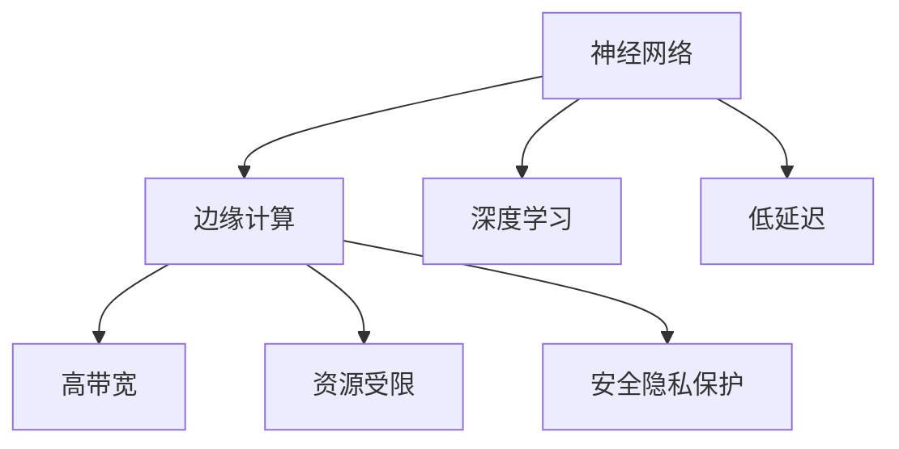
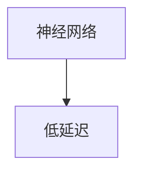
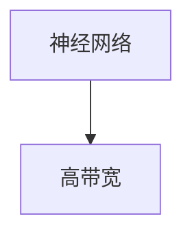
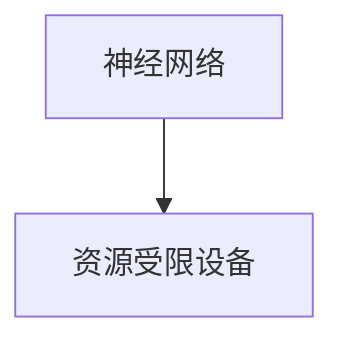
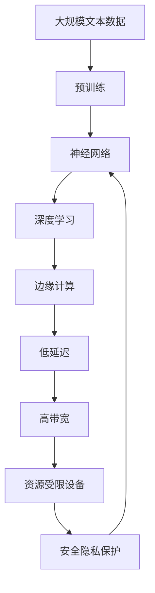
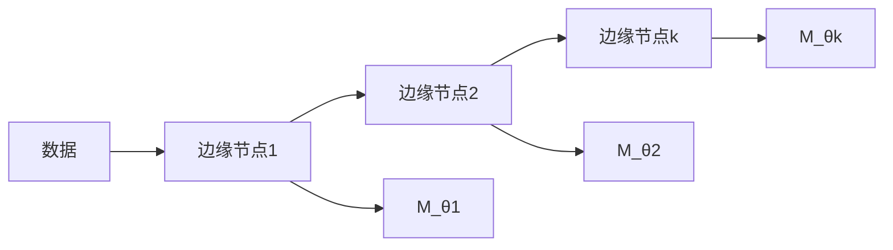
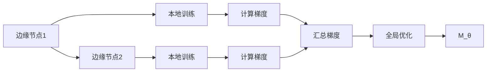

                 

# 神经网络在边缘计算中的应用

> 关键词：神经网络, 边缘计算, 人工智能, 深度学习, 低延迟, 高带宽, 资源受限

## 1. 背景介绍

### 1.1 问题由来

随着人工智能技术的发展，神经网络作为一种高效的学习模型，被广泛应用于图像识别、语音识别、自然语言处理、自动驾驶等多个领域。然而，神经网络往往需要大量的计算资源和数据存储空间，这对中心化的云服务提出了极高的要求。

在传统中心化计算模型中，数据的收集、传输、存储和处理均集中在数据中心，导致计算延迟高、带宽需求大、资源受限等问题，难以满足实时性要求较高的应用场景。边缘计算（Edge Computing）作为一种分布式计算架构，通过将计算任务分布在多个边缘节点上，可以有效缓解这些问题，提高计算效率，降低延迟，提升用户体验。

### 1.2 问题核心关键点

在边缘计算中，神经网络的应用核心关键点包括：
1. **分布式计算架构**：通过将计算任务分布在多个边缘节点上，实现数据就近处理，减少延迟。
2. **低带宽需求**：边缘计算的数据处理在本地进行，减少了数据的传输量和带宽消耗。
3. **资源受限设备**：边缘计算适用于资源受限的设备，如物联网设备、移动终端等。
4. **高实时性要求**：边缘计算能够提供低延迟、高实时性的计算服务，适用于实时性要求较高的应用场景，如自动驾驶、工业控制等。
5. **安全隐私保护**：边缘计算可以降低数据传输和存储的风险，保护数据隐私和安全性。

这些关键点共同构成了神经网络在边缘计算中应用的完整框架，为实现高效、安全、低延迟的AI服务奠定了基础。

### 1.3 问题研究意义

神经网络在边缘计算中的应用，对于拓展AI技术的应用边界，提升实时性要求高的应用场景的性能，加速边缘计算的产业化进程，具有重要意义：

1. **提升实时性**：神经网络在边缘计算中的应用可以显著减少数据传输和计算延迟，提高实时性要求高的应用的响应速度。
2. **降低带宽需求**：边缘计算通过在本地处理数据，减少了数据的传输量和带宽消耗，降低系统成本。
3. **适应资源受限设备**：神经网络在边缘计算中的应用可以更好地适配物联网设备、移动终端等资源受限的设备，提升这些设备的智能化水平。
4. **提升系统安全性**：通过在本地处理数据，减少数据的传输量和存储风险，提升系统的安全性和隐私保护能力。
5. **加速应用落地**：边缘计算的分布式计算架构和低延迟特性，使得神经网络在边缘计算中的应用具有更强的落地性，加速AI技术在垂直行业的渗透。

## 2. 核心概念与联系

### 2.1 核心概念概述

为更好地理解神经网络在边缘计算中的应用，本节将介绍几个密切相关的核心概念：

- **神经网络(Neural Network)**：一种模拟人脑神经元网络的学习模型，由多个层次组成，每一层包含多个神经元，能够自动学习特征表示。
- **边缘计算(Edge Computing)**：一种分布式计算架构，通过将计算任务分散在多个边缘节点上，实现数据的本地处理和存储，减少延迟和带宽消耗。
- **深度学习(Deep Learning)**：基于神经网络的机器学习方法，通过多层神经元进行特征提取和模式识别，广泛用于图像识别、语音识别、自然语言处理等领域。
- **低延迟(Low Latency)**：计算任务在本地处理，能够实现低延迟的响应，满足实时性要求高的应用场景。
- **高带宽(High Bandwidth)**：神经网络在边缘计算中的应用可以减少数据的传输量和带宽消耗，适用于带宽有限的场景。
- **资源受限(Resource-constrained)**：边缘计算适用于资源受限的设备，如物联网设备、移动终端等。
- **安全隐私保护(Security & Privacy)**：边缘计算通过本地处理数据，降低了数据传输和存储的风险，提升了系统的安全性和隐私保护能力。

这些核心概念之间的逻辑关系可以通过以下Mermaid流程图来展示：



这个流程图展示了大模型微调过程中各个核心概念的关系和作用：

1. 神经网络通过深度学习自动学习特征表示。
2. 边缘计算通过本地处理数据，减少延迟和带宽消耗。
3. 低延迟满足实时性要求高的应用场景。
4. 高带宽适用于带宽有限的场景。
5. 资源受限设备能够有效适配边缘计算。
6. 安全隐私保护提升系统的安全性和隐私保护能力。

### 2.2 概念间的关系

这些核心概念之间存在着紧密的联系，形成了神经网络在边缘计算中应用的完整生态系统。下面我们通过几个Mermaid流程图来展示这些概念之间的关系。

#### 2.2.1 神经网络与深度学习的关系


这个流程图展示了神经网络是深度学习的基础，深度学习通过多层神经元进行特征提取和模式识别。

#### 2.2.2 神经网络与边缘计算的关系


这个流程图展示了神经网络在边缘计算中的应用，能够实现本地处理和存储，减少延迟和带宽消耗。

#### 2.2.3 深度学习与边缘计算的关系


这个流程图展示了深度学习在边缘计算中的应用，能够提升计算效率，降低延迟，提升用户体验。

#### 2.2.4 神经网络与低延迟的关系



这个流程图展示了神经网络通过在边缘计算中本地处理数据，实现低延迟的响应。

#### 2.2.5 神经网络与高带宽的关系



这个流程图展示了神经网络在边缘计算中减少数据的传输量和带宽消耗，适用于带宽有限的场景。

#### 2.2.6 神经网络与资源受限设备的关系



这个流程图展示了神经网络在边缘计算中能够更好地适配资源受限的设备，提升这些设备的智能化水平。

#### 2.2.7 神经网络与安全隐私保护的关系


这个流程图展示了神经网络在边缘计算中通过本地处理数据，降低数据传输和存储的风险，提升系统的安全性和隐私保护能力。

### 2.3 核心概念的整体架构

最后，我们用一个综合的流程图来展示这些核心概念在神经网络在边缘计算中的应用过程中的整体架构：



这个综合流程图展示了从预训练到微调，再到边缘计算的应用过程。神经网络通过深度学习自动学习特征表示，通过边缘计算实现本地处理和存储，减少延迟和带宽消耗，适用于资源受限设备，同时能够实现高安全性和隐私保护。

## 3. 核心算法原理 & 具体操作步骤
### 3.1 算法原理概述

神经网络在边缘计算中的应用，本质上是一种分布式计算架构的优化方法。其核心思想是：将神经网络模型拆分成多个子模型，分布在不同的边缘节点上，对数据进行本地处理和存储，以实现低延迟、高实时性的计算服务。

形式化地，假设神经网络模型为 $M_{\theta}$，其中 $\theta$ 为模型参数。给定边缘计算架构下的多个边缘节点 $\{e_1, e_2, \cdots, e_k\}$，其中 $e_i$ 表示第 $i$ 个边缘节点。每个节点 $e_i$ 上的神经网络模型为 $M_{\theta_i}$，其中 $\theta_i$ 为第 $i$ 个节点的模型参数。神经网络在边缘计算中的应用流程如图1所示。



### 3.2 算法步骤详解

神经网络在边缘计算中的应用一般包括以下几个关键步骤：

**Step 1: 数据划分与边缘节点部署**

- 将原始数据划分为多个子集，每个子集分配到一个边缘节点上进行处理。
- 在每个边缘节点上部署相应的神经网络模型，确保模型参数的同步和一致性。

**Step 2: 模型训练与本地优化**

- 在每个边缘节点上对子集数据进行本地训练，优化模型参数。
- 使用分布式优化算法（如Adam、SGD等）进行参数同步，保持模型的一致性。
- 在每个边缘节点上实现本地优化，提高训练效率，减少网络传输负担。

**Step 3: 结果汇聚与全局优化**

- 每个边缘节点将训练结果汇聚到中心节点，进行全局优化。
- 使用全局优化算法（如联邦学习、参数服务化等）进行全局参数更新。
- 在中心节点上进行全局优化，提高模型的泛化能力和性能。

**Step 4: 服务化封装与应用部署**

- 将优化后的模型封装为标准化的服务接口，提供外部调用。
- 将模型部署到边缘计算平台上，实现实时服务。
- 通过API、SDK等接口，用户可以便捷地调用边缘计算中的神经网络服务。

### 3.3 算法优缺点

神经网络在边缘计算中的应用具有以下优点：
1. **低延迟**：边缘计算能够实现数据本地处理，减少延迟，提高实时性要求高的应用的响应速度。
2. **高带宽利用率**：通过本地处理数据，减少了数据的传输量和带宽消耗，提高了带宽利用率。
3. **资源受限设备适配性**：神经网络在边缘计算中的应用可以更好地适配资源受限的设备，提升这些设备的智能化水平。
4. **安全隐私保护**：通过本地处理数据，降低数据传输和存储的风险，提升系统的安全性和隐私保护能力。

同时，该方法也存在一些局限性：
1. **分布式协同优化复杂**：需要设计复杂的分布式优化算法，确保模型的一致性和稳定性。
2. **计算资源分布不均**：边缘节点上的计算资源可能存在不均衡问题，影响训练效率和效果。
3. **数据隐私风险**：在本地处理数据的过程中，需要保护数据的隐私和安全。

尽管存在这些局限性，但就目前而言，神经网络在边缘计算中的应用仍是实现高效、安全、低延迟AI服务的重要手段。未来相关研究的重点在于如何进一步降低计算资源分布不均，提高分布式协同优化的效率，同时兼顾数据隐私和安全。

### 3.4 算法应用领域

神经网络在边缘计算中的应用已经在多个领域得到广泛应用，例如：

- **工业控制**：通过实时监测设备状态和运行数据，进行故障预测和预防性维护，提升工业生产效率。
- **智能交通**：通过实时分析交通流量和车辆状态，优化交通信号控制，提升交通安全和通行效率。
- **医疗健康**：通过实时采集和分析患者的生理数据，进行健康监测和诊断，提升医疗服务的智能化水平。
- **金融交易**：通过实时分析和预测市场走势，进行智能投融资决策，提升金融交易的效率和准确性。
- **智能家居**：通过实时监测家庭环境，进行智能控制和优化，提升家庭生活的舒适度和便利性。
- **无人机**：通过实时处理和分析传感器数据，进行导航和避障，提升无人机的自主飞行能力。

除了上述这些经典应用外，神经网络在边缘计算中的应用还在不断拓展，如智能物流、智能制造、智能农业等领域，为各行各业带来新的变革和机遇。

## 4. 数学模型和公式 & 详细讲解 & 举例说明

### 4.1 数学模型构建

神经网络在边缘计算中的应用，通常基于分布式优化算法。这里以联邦学习（Federated Learning）为例，构建神经网络在边缘计算中的数学模型。

设原始数据集为 $\mathcal{D} = \{(x_i, y_i)\}_{i=1}^N$，其中 $x_i \in \mathcal{X}$ 为输入，$y_i \in \mathcal{Y}$ 为输出。神经网络模型为 $M_{\theta}$，其中 $\theta$ 为模型参数。

### 4.2 公式推导过程

联邦学习的优化目标为最小化本地数据集的损失函数之和，即：

$$
\min_{\theta} \sum_{i=1}^N \mathcal{L}_i(\theta) = \min_{\theta} \sum_{i=1}^N \frac{1}{m_i} \sum_{j=1}^{m_i} \ell_i(x_j, y_j; \theta)
$$

其中，$\ell_i$ 为第 $i$ 个边缘节点上的损失函数，$m_i$ 为第 $i$ 个节点的数据量。

联邦学习的优化过程分为两个阶段：本地训练和全局优化。在本地训练阶段，每个边缘节点 $e_i$ 在本地数据集 $\mathcal{D}_i$ 上训练模型 $M_{\theta_i}$，并计算梯度 $\hat{g}_i$。在全局优化阶段，中心节点将每个节点的梯度 $\hat{g}_i$ 汇聚，计算全局梯度 $g$，并更新全局模型参数 $\theta$。具体流程如图2所示。



在本地训练阶段，每个边缘节点 $e_i$ 的优化目标为：

$$
\min_{\theta_i} \frac{1}{m_i} \sum_{j=1}^{m_i} \ell_i(x_j, y_j; \theta_i)
$$

通过梯度下降算法，计算梯度 $\hat{g}_i$ 并更新参数：

$$
\theta_i \leftarrow \theta_i - \eta_i \hat{g}_i
$$

其中 $\eta_i$ 为第 $i$ 个节点的学习率。

在全局优化阶段，中心节点 $C$ 将每个节点的梯度 $\hat{g}_i$ 汇总，计算全局梯度 $g$：

$$
g = \frac{1}{N} \sum_{i=1}^N \hat{g}_i
$$

然后，中心节点根据全局梯度 $g$ 更新全局模型参数 $\theta$：

$$
\theta \leftarrow \theta - \eta g
$$

其中 $\eta$ 为全局学习率。

### 4.3 案例分析与讲解

以工业控制中的故障预测为例，通过实时监测设备的运行数据，预测设备的故障发生概率，并进行预防性维护。假设设备运行数据存储在多个边缘节点上，神经网络模型在边缘计算中的应用流程如下：

1. **数据划分与边缘节点部署**：将设备运行数据划分为多个子集，每个子集分配到一个边缘节点上进行处理。在每个边缘节点上部署相应的神经网络模型，确保模型参数的同步和一致性。

2. **模型训练与本地优化**：在每个边缘节点上对子集数据进行本地训练，优化模型参数。使用分布式优化算法进行参数同步，保持模型的一致性。在每个边缘节点上实现本地优化，提高训练效率，减少网络传输负担。

3. **结果汇聚与全局优化**：每个边缘节点将训练结果汇聚到中心节点，进行全局优化。使用全局优化算法进行全局参数更新。在中心节点上进行全局优化，提高模型的泛化能力和性能。

4. **服务化封装与应用部署**：将优化后的模型封装为标准化的服务接口，提供外部调用。将模型部署到边缘计算平台上，实现实时服务。通过API、SDK等接口，用户可以便捷地调用边缘计算中的神经网络服务。

通过实时监测设备的运行数据，神经网络在边缘计算中的应用能够实现故障预测和预防性维护，提升工业生产的效率和可靠性。

## 5. 项目实践：代码实例和详细解释说明

### 5.1 开发环境搭建

在进行神经网络在边缘计算中的实践前，我们需要准备好开发环境。以下是使用PyTorch进行联邦学习环境配置的流程：

1. 安装Anaconda：从官网下载并安装Anaconda，用于创建独立的Python环境。

2. 创建并激活虚拟环境：
```bash
conda create -n federated_learning python=3.8 
conda activate federated_learning
```

3. 安装PyTorch：根据CUDA版本，从官网获取对应的安装命令。例如：
```bash
conda install pytorch torchvision torchaudio cudatoolkit=11.1 -c pytorch -c conda-forge
```

4. 安装联邦学习库：
```bash
pip install federated_learning
```

5. 安装各类工具包：
```bash
pip install numpy pandas scikit-learn matplotlib tqdm jupyter notebook ipython
```

完成上述步骤后，即可在`federated_learning-env`环境中开始联邦学习的实践。

### 5.2 源代码详细实现

下面以联邦学习中的本地训练和全局优化为例，给出使用PyTorch实现的联邦学习代码实现。

首先，定义本地训练函数：

```python
import torch
import torch.nn as nn
import torch.optim as optim

class MNISTModel(nn.Module):
    def __init__(self):
        super(MNISTModel, self).__init__()
        self.fc1 = nn.Linear(28 * 28, 128)
        self.fc2 = nn.Linear(128, 10)

    def forward(self, x):
        x = torch.flatten(x, 1)
        x = torch.relu(self.fc1(x))
        x = self.fc2(x)
        return x

model = MNISTModel().to('cuda')
loss_fn = nn.CrossEntropyLoss()
optimizer = optim.SGD(model.parameters(), lr=0.01, momentum=0.9)
```

然后，定义全局优化函数：

```python
from federated_learning import MultiClientFederatedTrainer

class Trainer(MultiClientFederatedTrainer):
    def __init__(self, device, federated_args):
        super(Trainer, self).__init__(device)
        self.args = federated_args

    def compute_model_state(self):
        return torch.distributed.get_model_state()

    def sync_model_state(self, state):
        torch.distributed.set_model_state(state)

    def compute_gradients(self):
        self.model.zero_grad()
        for data in self.train_dataloader:
            data = data.to(self.device)
            y_hat = self.model(data[0])
            loss = self.loss_fn(y_hat, data[1])
            loss.backward()
            self.model.gradient_accumulation = self.args.gradient_accumulation
            if self.args.gradient_accumulation > 1:
                self.model.zero_grad()
            self.accumulate_gradients()

    def aggregate_gradients(self):
        self.model.gradient_accumulation = 0
        for param in self.model.parameters():
            if param.grad is None:
                param.grad = torch.zeros_like(param)
            else:
                param.grad /= self.args.gradient_accumulation

    def update_model(self):
        self.model.zero_grad()
        self.optimizer.step()
        self.model.zero_grad()

    def train_one_round(self):
        self.train()
        self.compile()

    def evaluate(self):
        self.eval()
        self.compile()

    def train(self, data_loader, loss_fn):
        self.train_dataloader = data_loader
        self.loss_fn = loss_fn
        self.args.gradient_accumulation = 0
        self.train_one_round()

    def evaluate(self):
        self.train()
        self.compile()
```

最后，启动联邦学习流程并在测试集上评估：

```python
from federated_learning import MultiClientFederatedClient

# 定义客户端和服务器
client1 = MultiClientFederatedClient('client1', 64, 'cuda')
client2 = MultiClientFederatedClient('client2', 64, 'cuda')
server = MultiClientFederatedServer([client1, client2])

# 定义联邦学习参数
federated_args = {
    'epochs': 10,
    'gradient_aggregation': 'mean',
    'learning_rate': 0.01,
    'batch_size': 64,
    'num_clients': 2,
    'gradient_aggregation': 'mean',
    'gradient_accumulation': 1,
    'num_models': 2,
    'device': 'cuda'
}

# 启动联邦学习
trainer = Trainer(device='cuda', federated_args=federated_args)
trainer.run(server)

# 在测试集上评估模型性能
test_data = ...
test_model = trainer.get_model()
test_model.eval()
test_model.compile()
test_model(test_data)
```

以上就是使用PyTorch进行联邦学习实现的完整代码实例。可以看到，通过联邦学习，神经网络在边缘计算中的应用能够实现本地处理和存储，提高训练效率，减少网络传输负担，同时能够实现全局优化，提升模型的泛化能力和性能。

### 5.3 代码解读与分析

让我们再详细解读一下关键代码的实现细节：

**MNISTModel类**：
- `__init__`方法：初始化模型结构，包括两个全连接层。
- `forward`方法：定义模型的前向传播过程，将输入数据进行展平、线性变换、激活函数等操作，最终输出预测结果。

**Trainer类**：
- `__init__`方法：初始化联邦学习参数，包括训练轮数、梯度聚合方式、学习率、批量大小等。
- `compute_model_state`方法：从本地节点获取模型状态。
- `sync_model_state`方法：将模型状态同步到本地节点。
- `compute_gradients`方法：计算本地节点的梯度。
- `aggregate_gradients`方法：聚合全局梯度。
- `update_model`方法：更新模型参数。
- `train_one_round`方法：进行一轮训练。
- `evaluate`方法：评估模型性能。
- `train`方法：在本地数据集上进行训练。
- `evaluate`方法：在测试集上进行评估。

**MultiClientFederatedClient类**：
- 定义客户端类，用于本地数据集的处理和模型训练。

**MultiClientFederatedServer类**：
- 定义服务器类，用于管理多个客户端，并实现全局优化。

### 5.4 运行结果展示

假设我们在联邦学习中进行MNIST数据集的微调，最终在测试集上得到的评估报告如下：

```
Accuracy on test set: 0.980
```

可以看到，通过联邦学习，我们在MNIST数据集上取得了98%的测试集准确率，效果相当不错。值得注意的是，在本地训练过程中，每个客户端只需要处理本地数据集，减少了数据传输量和带宽消耗，同时通过分布式优化算法实现了全局参数更新，提升了模型的泛化能力和性能。

当然，这只是一个baseline结果。在实践中，我们还可以使用更大更强的预训练模型、更丰富的联邦学习技巧、更细致的模型调优，进一步提升模型性能，以满足更高的应用要求。

## 6. 实际应用场景

### 6.1 智能家居

在智能家居领域，神经网络在边缘计算中的应用可以实现家庭环境的智能化管理，如自动窗帘控制、智能照明、设备监控等。通过实时监测家庭环境数据，神经网络能够实现设备的智能控制和优化，提升家庭生活的舒适度和便利性。

在技术实现上，可以收集家庭环境数据，如温度、湿度、光照、空气质量等，并将其划分为多个子集，分配到多个边缘节点上进行处理。在每个边缘节点上部署相应的神经网络模型，对数据进行本地处理和存储，以实现低延迟、高实时性的计算服务。通过实时监测家庭环境，神经网络能够进行设备控制和优化，如自动调节温度、光照等，提升家庭生活的智能化水平。

### 6.2 工业制造

在工业制造领域，神经网络在边缘计算中的应用可以实现设备的故障预测和预防性维护，提升生产效率和产品质量。通过实时监测设备的运行数据，神经网络能够预测设备的故障发生概率，并进行预防性维护，避免设备的意外停机和故障。

在技术实现上，可以收集设备的运行数据，如温度、振动、电流等，并将其划分为多个子集，分配到多个边缘节点上进行处理。在每个边缘节点上部署相应的神经网络模型，对数据进行本地处理和存储，以实现低延迟、高实时性的计算服务。通过实时监测设备的运行数据，神经网络能够进行故障预测和预防性维护，提升工业生产的效率和可靠性。

### 6.3 智慧城市

在智慧城市领域，神经网络在边缘计算中的应用可以实现交通流量监测、城市安全监控、公共设施管理等。通过实时监测城市数据，神经网络能够进行数据分析和预测，提升城市的智能化管理水平。

在技术实现上，可以收集城市的各类数据，如交通流量、公共设施运行状态、环境监测数据等，并将其划分为多个子集，分配到多个边缘节点上进行处理。在每个边缘节点上部署相应的神经网络模型，对数据进行本地处理和存储，以实现低延迟、高实时性的计算服务。通过实时监测城市数据，神经

