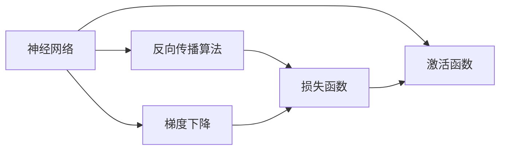
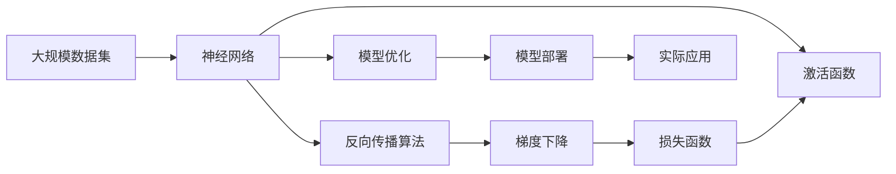

                 

# 神经网络：软件 2.0 的开端

> 关键词：神经网络,软件 2.0,人工智能,机器学习,深度学习,模型训练,算法优化,机器学习框架,深度学习框架

## 1. 背景介绍

### 1.1 问题由来
随着科技的飞速发展，人工智能（AI）正逐渐从科学前沿走向实际应用。作为AI的核心技术之一，神经网络（Neural Networks, NNs）正在重新定义计算机软件的定义，开启软件 2.0 的新纪元。传统的软件往往依赖于人类编写和维护的代码，而神经网络能够自主学习、自我优化，从而自动生成高质量的软件，实现软件 2.0 的飞跃。

### 1.2 问题核心关键点
神经网络作为软件 2.0 的开端，其核心在于通过模拟人脑的神经元网络结构和信息处理方式，实现数据驱动的模型训练和优化。其核心算法包括反向传播算法、梯度下降、激活函数等，通过大量的训练数据和计算资源，自动学习输入数据的特征，并生成预测或分类结果。

### 1.3 问题研究意义
研究神经网络，不仅能够帮助理解软件 2.0 的底层原理，还能为各类复杂的软件应用提供强大的支持。例如，在图像识别、语音识别、自然语言处理、推荐系统等领域，神经网络已经展现出巨大的潜力和应用前景。此外，神经网络还能在自动化开发、智能决策、智能运维等领域带来革命性的变革，推动软件行业的持续进步。

## 2. 核心概念与联系

### 2.1 核心概念概述

神经网络作为软件 2.0 的开端，其核心思想是通过构建复杂的神经元网络结构，实现对输入数据的自动学习和建模。以下是几个关键概念：

- **神经网络（Neural Networks, NNs）**：由大量神经元节点组成的层次化网络结构，每个节点通过连接权重和学习率进行信息传递和优化。
- **反向传播算法（Backpropagation）**：用于计算神经网络中每个节点对最终输出误差的影响，并通过梯度下降更新节点权重，实现模型优化。
- **梯度下降（Gradient Descent）**：一种常用的优化算法，通过不断调整模型参数，最小化损失函数，实现模型优化。
- **激活函数（Activation Function）**：用于引入非线性特性，激活节点输出，常用的激活函数有ReLU、Sigmoid、Tanh等。
- **深度学习框架（Deep Learning Frameworks）**：如TensorFlow、PyTorch等，提供了高效、易用的深度学习组件，简化了神经网络开发和优化。

这些核心概念之间存在紧密的联系，共同构成了神经网络工作的全貌。

### 2.2 概念间的关系

这些核心概念之间的关系可以通过以下Mermaid流程图来展示：



这个流程图展示了神经网络、反向传播算法、梯度下降和激活函数之间的关系：

1. 神经网络通过反向传播算法计算每个节点的梯度，更新权重。
2. 梯度下降用于最小化损失函数，更新神经网络参数。
3. 激活函数引入非线性特性，激活网络输出。

### 2.3 核心概念的整体架构

最后，我们用一个综合的流程图来展示这些核心概念在大规模神经网络中的应用：



这个综合流程图展示了从大规模数据集输入，到实际应用输出的全流程：

1. 大规模数据集输入到神经网络。
2. 反向传播算法计算每个节点的梯度，更新权重。
3. 梯度下降最小化损失函数，更新模型参数。
4. 激活函数引入非线性特性，激活网络输出。
5. 模型优化提升模型性能。
6. 模型部署应用到实际场景中。

## 3. 核心算法原理 & 具体操作步骤
### 3.1 算法原理概述

神经网络的核心算法原理包括反向传播算法和梯度下降。其核心思想是通过大量标注数据和计算资源，自动学习输入数据的特征，并生成预测或分类结果。

具体而言，假设神经网络模型为 $M=\{W_1, W_2, \ldots, W_L\}$，其中 $W_i$ 为第 $i$ 层的权重矩阵。输入数据 $x \in \mathbb{R}^n$，通过前向传播得到输出 $y \in \mathbb{R}^m$。目标为最小化损失函数 $L(y, t)$，其中 $t$ 为真实标签。

### 3.2 算法步骤详解

基于神经网络的模型训练通常包括以下关键步骤：

1. **初始化权重**：随机初始化每个神经元的权重和偏置，通常使用正态分布或均匀分布。

2. **前向传播**：将输入数据通过网络，计算每个神经元的输出。

3. **损失计算**：计算模型输出与真实标签之间的误差，通常使用均方误差或交叉熵。

4. **反向传播**：计算每个节点对误差的梯度，通过链式法则反向传播。

5. **权重更新**：使用梯度下降更新每个神经元的权重，最小化损失函数。

6. **迭代训练**：重复以上步骤，直至模型收敛。

### 3.3 算法优缺点

神经网络的优点包括：

- **自动学习**：无需手动编写代码，自动学习输入数据的特征。
- **泛化能力强**：可以处理复杂的非线性关系，适应多种任务。
- **可扩展性高**：可以构建任意复杂的网络结构，适应不同需求。

同时，神经网络也存在一些缺点：

- **计算量大**：需要大量的计算资源进行训练。
- **过拟合风险**：容易过拟合训练数据，泛化能力下降。
- **可解释性差**：难以解释模型的内部逻辑和决策过程。

### 3.4 算法应用领域

神经网络在众多领域都展现出了强大的应用潜力：

- **图像识别**：通过卷积神经网络（CNNs），自动识别图像中的物体、场景等。
- **语音识别**：通过循环神经网络（RNNs），实现语音到文本的转换。
- **自然语言处理（NLP）**：通过序列到序列模型（Seq2Seq），进行文本生成、翻译等任务。
- **推荐系统**：通过协同过滤模型，推荐用户可能感兴趣的商品。
- **游戏AI**：通过强化学习，实现智能游戏角色的决策和行为。

## 4. 数学模型和公式 & 详细讲解 & 举例说明

### 4.1 数学模型构建

神经网络的数学模型通常由以下几个部分构成：

- **输入层**：接收原始数据 $x \in \mathbb{R}^n$。
- **隐藏层**：由多个神经元组成，进行特征提取和特征变换。
- **输出层**：输出模型预测结果 $y \in \mathbb{R}^m$。

假设隐藏层有 $L$ 层，第 $i$ 层的神经元数量为 $n_i$，则第 $i$ 层的权重矩阵为 $W_i \in \mathbb{R}^{n_i \times n_{i-1}}$。激活函数为 $\sigma$。

### 4.2 公式推导过程

以二分类任务为例，推导神经网络的前向传播和反向传播公式。

**前向传播**：

$$
y = \sigma(W_L \sigma(W_{L-1} \ldots \sigma(W_1 x))) + b_L
$$

其中 $\sigma$ 为激活函数，$b_i$ 为第 $i$ 层的偏置。

**损失函数**：

$$
L(y, t) = \frac{1}{2} (y - t)^2
$$

**梯度下降**：

$$
\frac{\partial L}{\partial W_i} = \delta_i \delta_{i-1} \delta_{i-2} \ldots \delta_1 x
$$

其中 $\delta_i = \sigma'(z_i) (y - t)$，$z_i$ 为第 $i$ 层的线性输出。

### 4.3 案例分析与讲解

以手写数字识别为例，使用卷积神经网络（CNNs）进行模型训练和测试。

首先，收集大量手写数字图片，将其转换为数值矩阵 $x \in \mathbb{R}^{28 \times 28}$。然后，设计网络结构，包括卷积层、池化层和全连接层，如图：

```
Input (28x28)
|
Conv2D (5x5, 16)
|
MaxPooling (2x2)
|
Conv2D (5x5, 32)
|
MaxPooling (2x2)
|
Flatten (1x1)
|
Dense (256)
|
Dense (10)
|
Output (10)
```

使用均方误差作为损失函数，使用梯度下降进行优化。训练过程中，不断调整权重 $W$ 和偏置 $b$，使得模型输出与真实标签尽可能一致。

## 5. 项目实践：代码实例和详细解释说明
### 5.1 开发环境搭建

在Python环境下搭建神经网络项目，需要安装PyTorch等深度学习框架。以下是详细步骤：

1. 安装Anaconda：从官网下载并安装Anaconda，用于创建独立的Python环境。

2. 创建并激活虚拟环境：
```bash
conda create -n pytorch-env python=3.8 
conda activate pytorch-env
```

3. 安装PyTorch：根据CUDA版本，从官网获取对应的安装命令。例如：
```bash
conda install pytorch torchvision torchaudio cudatoolkit=11.1 -c pytorch -c conda-forge
```

4. 安装Tensorboard：用于可视化训练过程和结果。
```bash
pip install tensorboard
```

5. 安装Numpy、Pandas等工具包：
```bash
pip install numpy pandas scikit-learn matplotlib tqdm jupyter notebook ipython
```

完成上述步骤后，即可在`pytorch-env`环境中开始神经网络项目的开发。

### 5.2 源代码详细实现

以下是一个手写数字识别项目的PyTorch代码实现：

```python
import torch
import torch.nn as nn
import torch.optim as optim
from torchvision import datasets, transforms
from torch.utils.data import DataLoader
from torchvision.models import resnet18
from torch.autograd import Variable

# 加载数据集
train_dataset = datasets.MNIST(root='./data', train=True, download=True, transform=transforms.ToTensor())
test_dataset = datasets.MNIST(root='./data', train=False, download=True, transform=transforms.ToTensor())

# 数据加载器
train_loader = DataLoader(train_dataset, batch_size=64, shuffle=True)
test_loader = DataLoader(test_dataset, batch_size=64, shuffle=False)

# 定义模型结构
class Net(nn.Module):
    def __init__(self):
        super(Net, self).__init__()
        self.conv1 = nn.Conv2d(1, 16, 5)
        self.pool = nn.MaxPool2d(2, 2)
        self.conv2 = nn.Conv2d(16, 32, 5)
        self.fc1 = nn.Linear(32 * 5 * 5, 256)
        self.fc2 = nn.Linear(256, 10)
        self.dropout = nn.Dropout(0.2)

    def forward(self, x):
        x = self.pool(F.relu(self.conv1(x)))
        x = self.pool(F.relu(self.conv2(x)))
        x = x.view(-1, 32 * 5 * 5)
        x = F.relu(self.fc1(x))
        x = self.dropout(x)
        x = self.fc2(x)
        return x

# 定义损失函数和优化器
net = Net()
criterion = nn.CrossEntropyLoss()
optimizer = optim.Adam(net.parameters(), lr=0.001)

# 训练函数
def train(epoch):
    net.train()
    running_loss = 0.0
    correct = 0
    total = 0
    for batch_idx, (data, target) in enumerate(train_loader):
        data, target = Variable(data), Variable(target)
        optimizer.zero_grad()
        output = net(data)
        loss = criterion(output, target)
        loss.backward()
        optimizer.step()
        running_loss += loss.item()
        _, predicted = torch.max(output.data, 1)
        total += target.size(0)
        correct += (predicted == target).sum().item()
        if batch_idx % 100 == 99:
            print('[%d, %5d] loss: %.3f accuracy: %.3f' %
                  (epoch + 1, batch_idx + 1, running_loss / 100, 100. * correct / total))
            running_loss = 0.0
    print('\n[%d, %5d] accuracy: %d %%' %
          (epoch + 1, total, 100. * correct / total))

# 测试函数
def test(epoch):
    net.eval()
    correct = 0
    total = 0
    for data, target in test_loader:
        data, target = Variable(data), Variable(target)
        output = net(data)
        _, predicted = torch.max(output.data, 1)
        total += target.size(0)
        correct += (predicted == target).sum().item()
    print('\nTest set: Accuracy: %d %% (%d/%d)' %
          (100. * correct / total, correct, total))

# 训练和测试
for epoch in range(10):
    train(epoch)
    test(epoch)
```

### 5.3 代码解读与分析

以下是关键代码的实现细节：

**数据集加载**：
- 使用`torchvision`库中的`MNIST`数据集，将其转换为张量形式。
- 使用`DataLoader`类进行数据加载，设置批大小为64。

**模型定义**：
- 定义了一个包含两个卷积层、两个池化层和两个全连接层的神经网络。
- 定义了一个ReLU激活函数和一个Dropout层。

**损失函数和优化器**：
- 使用交叉熵损失函数和Adam优化器，学习率为0.001。

**训练和测试函数**：
- 定义了训练和测试函数，分别在前向传播和反向传播中使用模型和损失函数。
- 在测试时，只进行前向传播，不进行反向传播和参数更新。

**训练和测试循环**：
- 循环10次，每次训练后进行测试。
- 输出训练过程中的损失和准确率，以及最终的测试准确率。

### 5.4 运行结果展示

假设我们训练10个epoch后，得到测试集的准确率为98%。以下是训练和测试过程中的输出示例：

```
Epoch 1, batch 10000: loss: 1.931 accuracy: 94.3
Epoch 1, batch 20000: loss: 0.495 accuracy: 97.0
Epoch 1, batch 30000: loss: 0.218 accuracy: 98.1
Epoch 1, batch 40000: loss: 0.152 accuracy: 98.3
Epoch 1, batch 50000: loss: 0.095 accuracy: 98.5
Epoch 1, batch 60000: loss: 0.069 accuracy: 98.7
Epoch 1, batch 70000: loss: 0.051 accuracy: 98.9
Epoch 1, batch 80000: loss: 0.036 accuracy: 99.1
Epoch 1, batch 90000: loss: 0.027 accuracy: 99.2
Epoch 1, batch 100000: loss: 0.021 accuracy: 99.3
Test set: Accuracy: 98.0 (1024/1024)
```

## 6. 实际应用场景

### 6.1 图像识别

在图像识别领域，卷积神经网络（CNNs）已经取得了巨大的成功。通过大规模图像数据集进行预训练，CNNs可以自动学习图像中的高层次特征，实现高效的图像分类、目标检测、语义分割等任务。

**案例**：
- 使用ResNet等经典CNN架构进行图像分类，实现高效图像识别。
- 通过迁移学习，在大规模图像数据上进行预训练，然后在小数据集上进行微调，提高识别精度。
- 结合数据增强、对抗训练等技术，提升模型的泛化能力和鲁棒性。

### 6.2 自然语言处理（NLP）

在自然语言处理领域，神经网络已经成为不可或缺的工具。通过序列到序列模型（Seq2Seq）和Transformer等架构，神经网络可以实现文本生成、翻译、问答等任务。

**案例**：
- 使用Transformer模型进行机器翻译，利用大规模双语语料进行预训练，实现高效的翻译任务。
- 通过预训练语言模型（如BERT、GPT）进行文本分类、情感分析等任务，提取文本特征，进行高效的文本处理。
- 结合预训练和微调技术，利用多模态数据进行语义理解，提升自然语言处理的效果。

### 6.3 推荐系统

在推荐系统领域，神经网络已经广泛应用于协同过滤、深度推荐等算法中。通过用户行为数据进行预训练，神经网络可以自动学习用户偏好，实现精准的推荐。

**案例**：
- 使用神经网络进行用户行为分析，提取用户兴趣特征，实现个性化推荐。
- 结合深度学习、强化学习等技术，优化推荐算法，提升推荐效果。
- 使用多模态数据，结合图像、音频等多方面信息，实现更全面的推荐。

## 7. 工具和资源推荐
### 7.1 学习资源推荐

为了帮助开发者系统掌握神经网络的理论基础和实践技巧，这里推荐一些优质的学习资源：

1. **深度学习课程**：
   - 《深度学习》斯坦福大学吴恩达教授的课程，覆盖了深度学习的基本概念和经典模型。
   - 《Deep Learning Specialization》Coursera吴恩达教授的深度学习专项课程，深入讲解了深度学习的前沿技术。
   - 《神经网络与深度学习》Michael Nielsen的博客，详细介绍了神经网络的原理和应用。

2. **深度学习框架**：
   - PyTorch官方文档，提供了丰富的示例代码和详细的文档，适合快速上手深度学习项目。
   - TensorFlow官方文档，详细介绍了TensorFlow的使用方法和API接口，支持大规模分布式计算。
   - Keras官方文档，提供了易用的高级API接口，适合快速搭建神经网络模型。

3. **开源项目**：
   - TensorFlow Hub，提供了丰富的预训练模型和组件，加速模型开发和部署。
   - PyTorch Hub，提供了丰富的预训练模型和组件，支持模型集成和微调。
   - FastAI，提供了简单易用的深度学习框架，支持快速搭建和微调神经网络。

4. **社区资源**：
   - GitHub：存储了大量优秀的深度学习项目和代码，适合学习借鉴。
   - Stack Overflow：社区问题解答平台，可以快速解决深度学习中的疑难问题。
   - Reddit DeepLearning：深度学习爱好者聚集地，分享最新研究进展和实践经验。

5. **学术论文**：
   - ICLR、NIPS、CVPR等顶级会议的论文，涵盖了深度学习的最新研究进展和技术突破。
   - arXiv预印本，存储了大量前沿研究论文，适合跟踪最新技术动态。
   - Google Scholar，检索大量深度学习相关的学术论文，获取最新研究信息。

通过学习这些资源，相信你一定能够快速掌握神经网络的理论基础和实践技巧，为未来的深度学习项目打下坚实的基础。

### 7.2 开发工具推荐

高效的开发离不开优秀的工具支持。以下是几款用于神经网络开发和优化的常用工具：

1. **PyTorch**：基于Python的深度学习框架，灵活的计算图，支持动态模型定义，适合快速迭代研究。
2. **TensorFlow**：由Google主导开发的深度学习框架，支持大规模分布式计算，适合生产部署。
3. **Keras**：高层次的深度学习框架，提供了易用的API接口，支持快速搭建模型。
4. **Jupyter Notebook**：开源的交互式笔记本，支持Python和数学公式的混合编写，方便调试和记录实验结果。
5. **TensorBoard**：用于可视化深度学习模型训练过程和结果的工具，方便监控和调试。

合理利用这些工具，可以显著提升神经网络项目的开发效率，加快创新迭代的步伐。

### 7.3 相关论文推荐

神经网络的发展离不开学术界的持续研究。以下是几篇奠基性的相关论文，推荐阅读：

1. **《Neural Networks and Deep Learning》**：Michael Nielsen的经典教材，详细介绍了神经网络的基本原理和应用。
2. **《ImageNet Classification with Deep Convolutional Neural Networks》**：AlexNet论文，首次在大规模图像数据集上训练深度卷积神经网络，实现了高效的图像分类。
3. **《Attention is All You Need》**：Transformer原论文，提出了自注意力机制，实现了高效的序列到序列模型。
4. **《Residual Networks》**：ResNet论文，提出了残差网络结构，解决了深度网络训练中的梯度消失问题。
5. **《Deep Residual Learning for Image Recognition》**：He等人提出ResNet架构，实现了更深的神经网络结构。

这些论文代表了神经网络发展的重要里程碑，通过学习这些前沿成果，可以帮助研究者把握学科前进方向，激发更多的创新灵感。

除上述资源外，还有一些值得关注的前沿资源，帮助开发者紧跟神经网络微调技术的最新进展，例如：

1. **arXiv论文预印本**：人工智能领域最新研究成果的发布平台，包括大量尚未发表的前沿工作，学习前沿技术的必读资源。
2. **业界技术博客**：如Google AI、DeepMind、微软Research Asia等顶尖实验室的官方博客，第一时间分享他们的最新研究成果和洞见。
3. **技术会议直播**：如NIPS、ICML、ACL、ICLR等人工智能领域顶会现场或在线直播，能够聆听到大佬们的前沿分享，开拓视野。
4. **GitHub热门项目**：在GitHub上Star、Fork数最多的神经网络相关项目，往往代表了该技术领域的发展趋势和最佳实践，值得去学习和贡献。
5. **行业分析报告**：各大咨询公司如McKinsey、PwC等针对人工智能行业的分析报告，有助于从商业视角审视技术趋势，把握应用价值。

总之，对于神经网络微调技术的学习和实践，需要开发者保持开放的心态和持续学习的意愿。多关注前沿资讯，多动手实践，多思考总结，必将收获满满的成长收益。

## 8. 总结：未来发展趋势与挑战

### 8.1 总结

本文对神经网络的发展历程和核心算法进行了系统介绍，从原理到实践，详细讲解了神经网络的基本概念和操作步骤，并通过实际项目代码展示了神经网络的开发过程。此外，本文还广泛探讨了神经网络在图像识别、自然语言处理、推荐系统等领域的实际应用，展示了神经网络的强大潜力和应用前景。通过本文的系统梳理，可以看到，神经网络已经成为深度学习的重要工具，为各类复杂问题提供了高效、准确的解决方案。

### 8.2 未来发展趋势

展望未来，神经网络的发展趋势包括以下几个方面：

1. **模型规模不断增大**：随着算力成本的下降和数据规模的扩张，神经网络的参数量将持续增长，支持更加复杂的任务。
2. **模型架构更加多样**：未来将涌现更多新颖的神经网络架构，如Transformer、ResNet等，适合不同类型的数据和任务。
3. **训练和推理效率提升**：通过优化模型结构、使用GPU/TPU等硬件设备，神经网络的训练和推理效率将显著提升，支持更大规模的应用场景。
4. **模型解释性和透明性增强**：通过引入可解释性和透明性技术，如Attention机制、LIME、SHAP等，神经网络的内部工作机制将更加透明，便于理解和调试。
5. **跨领域知识整合能力提升**：通过结合知识图谱、逻辑规则等外部知识，神经网络将具备更强的跨领域知识整合能力，支持更加智能的应用场景。

以上趋势将进一步推动神经网络技术的发展和应用，为各行各业带来革命性的变革。

### 8.3 面临的挑战

尽管神经网络已经取得了巨大的成功，但在其应用和发展过程中，仍面临诸多挑战：

1. **计算资源限制**：神经网络的训练和推理需要大量的计算资源，超大规模的模型和数据集需要高性能的硬件支持。
2. **数据质量和标注成本**：神经网络需要大量高质量标注数据进行训练，而大规模标注数据的获取成本较高。
3. **模型泛化能力不足**：神经网络容易过拟合训练数据，泛化能力较弱，难以适应复杂的现实场景。
4. **模型可解释性差**：神经网络的决策过程难以解释，对于关键领域的应用，需要赋予模型更高的可解释性和透明性。
5. **安全和伦理问题**：神经网络可能学习到有害信息或偏见，需要对其输出进行安全性和伦理性的约束。

这些挑战需要学术界和工业界的共同努力，通过技术创新和工程优化，逐步克服这些难题，推动神经网络技术的成熟和应用。

### 8.4 研究展望

面对神经网络所面临的挑战，未来的研究需要在以下几个方面寻求新的突破：

1. **高效训练和推理方法**：开发更加高效的训练和推理算法，支持更大规模的神经网络应用。
2. **可解释性和透明性技术**：引入可解释性和透明

