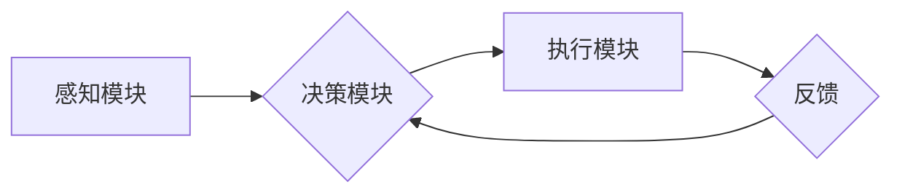

## AI Agent: AI的下一个风口 智能体的核心技术

> 关键词：人工智能代理、智能体、强化学习、深度学习、自然语言处理、机器人学、决策推理

### 1. 背景介绍

人工智能（AI）技术近年来取得了飞速发展，从语音识别、图像识别到自然语言处理，AI已经渗透到我们生活的方方面面。然而，我们离真正意义上的通用人工智能（AGI）还有很长的路要走。AGI的目标是创造出能够像人类一样学习、思考、解决问题和做出决策的智能体。

AI代理作为实现AGI的重要途径之一，正在成为AI领域下一个风口。AI代理是指能够感知环境、做出决策并与环境交互的智能体。它可以独立完成任务，并根据环境反馈不断学习和改进。与传统的AI模型相比，AI代理更加灵活、自主和适应性强，能够更好地应对复杂、动态的环境。

### 2. 核心概念与联系

**2.1 AI代理的核心概念**

AI代理的核心概念包括：

* **感知:** AI代理需要感知周围环境的信息，例如传感器数据、文本、图像等。
* **决策:** 基于感知到的信息，AI代理需要做出决策，决定下一步的动作。
* **执行:** AI代理需要执行决策，与环境交互，改变环境状态。
* **学习:** AI代理需要从与环境交互中学习，不断改进决策策略。

**2.2 AI代理与其他AI技术的联系**

AI代理与其他AI技术密切相关，例如：

* **深度学习:** 深度学习算法可以用于训练AI代理的感知和决策模块，提高其准确性和效率。
* **强化学习:** 强化学习算法可以用于训练AI代理的学习模块，使其能够通过与环境交互不断优化决策策略。
* **自然语言处理:** 自然语言处理技术可以用于帮助AI代理理解和生成人类语言，使其能够与人类进行更自然的交互。
* **机器人学:** 机器人学技术可以将AI代理与物理世界连接起来，使其能够执行实际操作。

**2.3 AI代理的架构**

AI代理的架构通常包括以下几个模块：

* **感知模块:** 收集环境信息，例如传感器数据、文本、图像等。
* **决策模块:** 基于感知到的信息，做出决策，决定下一步的动作。
* **执行模块:** 执行决策，与环境交互，改变环境状态。
* **学习模块:** 从与环境交互中学习，不断改进决策策略。

**Mermaid 流程图**



### 3. 核心算法原理 & 具体操作步骤

**3.1 算法原理概述**

AI代理的核心算法是强化学习算法。强化学习是一种机器学习方法，它通过奖励和惩罚机制来训练智能体，使其能够在与环境交互的过程中学习最优策略。

**3.2 算法步骤详解**

强化学习算法的具体步骤如下：

1. **环境建模:** 建立一个数学模型来描述环境的状态、动作和奖励。
2. **策略初始化:** 初始化一个策略，用于指导智能体在环境中采取行动。
3. **环境交互:** 智能体与环境交互，根据策略选择动作，并观察环境状态的变化和获得奖励。
4. **价值函数估计:** 使用价值函数估计每个状态下采取不同动作的长期回报。
5. **策略更新:** 根据价值函数的估计结果，更新策略，使其能够选择更优的动作。
6. **重复步骤3-5:** 重复以上步骤，直到策略收敛，即智能体能够在环境中获得最大化的长期回报。

**3.3 算法优缺点**

**优点:**

* **能够学习复杂决策策略:** 强化学习算法能够学习解决复杂、动态环境中的决策问题。
* **无需明确的规则:** 强化学习算法不需要事先定义明确的规则，能够通过与环境交互学习。
* **能够适应变化的环境:** 强化学习算法能够根据环境的变化不断更新策略，保持适应性。

**缺点:**

* **训练时间长:** 强化学习算法的训练过程通常需要很长时间。
* **数据需求大:** 强化学习算法需要大量的训练数据。
* **容易陷入局部最优:** 强化学习算法可能陷入局部最优解，无法找到全局最优解。

**3.4 算法应用领域**

强化学习算法在许多领域都有广泛的应用，例如：

* **游戏:** 强化学习算法被用于训练游戏AI，例如AlphaGo、AlphaStar等。
* **机器人学:** 强化学习算法被用于训练机器人进行导航、抓取、操作等任务。
* **自动驾驶:** 强化学习算法被用于训练自动驾驶汽车进行决策和控制。
* **金融:** 强化学习算法被用于投资策略优化、风险管理等。

### 4. 数学模型和公式 & 详细讲解 & 举例说明

**4.1 数学模型构建**

强化学习的数学模型通常由以下几个要素组成：

* **状态空间 (S):** 环境可能存在的全部状态集合。
* **动作空间 (A):** 智能体在每个状态下可以采取的所有动作集合。
* **奖励函数 (R):** 描述智能体在每个状态采取每个动作后获得的奖励。
* **转移概率 (P):** 描述从一个状态采取一个动作后转移到另一个状态的概率。

**4.2 公式推导过程**

强化学习的目标是找到一个策略 π，使得智能体在与环境交互的过程中获得最大的长期回报。

长期回报可以定义为：

$$
R_t = \sum_{k=t}^{\infty} \gamma^k r_{k}
$$

其中：

* $R_t$ 是从时间步 t 开始的长期回报。
* $r_k$ 是在时间步 k 获得的奖励。
* $\gamma$ 是折扣因子，控制未来奖励的权重。

策略 π 的价值函数可以定义为：

$$
V^\pi(s) = E_{\pi}[R_t | S_t = s]
$$

其中：

* $V^\pi(s)$ 是策略 π 下状态 s 的价值。
* $E_{\pi}[R_t | S_t = s]$ 是在状态 s 下按照策略 π 执行动作并获得的长期回报的期望值。

**4.3 案例分析与讲解**

例如，考虑一个简单的强化学习问题：一个智能体在一条走廊上行走，目标是到达走廊的尽头。走廊上有障碍物，智能体需要避开障碍物才能到达目的地。

在这个问题中，状态空间可以是走廊上每个位置的状态，动作空间可以是向左、向右、向前移动的动作。奖励函数可以定义为：到达目的地获得最大奖励，撞到障碍物获得负奖励。转移概率可以根据走廊的布局和智能体的移动方式来确定。

通过强化学习算法，智能体可以学习避开障碍物并到达目的地的最优策略。

### 5. 项目实践：代码实例和详细解释说明

**5.1 开发环境搭建**

为了实现AI代理，需要搭建一个合适的开发环境。常用的开发环境包括：

* **Python:** Python 是一个流行的编程语言，拥有丰富的AI库，例如TensorFlow、PyTorch、OpenAI Gym等。
* **Linux:** Linux 是一个开源的操作系统，适合进行AI开发。
* **GPU:** GPU (图形处理单元) 可以加速深度学习算法的训练。

**5.2 源代码详细实现**

以下是一个简单的AI代理的Python代码示例，使用OpenAI Gym环境进行训练：

```python
import gym
import numpy as np

# 创建环境
env = gym.make('CartPole-v1')

# 定义策略
def policy(state):
    return 1 if state[2] > 0 else 0

# 训练
for episode in range(100):
    state = env.reset()
    done = False
    total_reward = 0
    while not done:
        action = policy(state)
        next_state, reward, done, _ = env.step(action)
        total_reward += reward
        state = next_state
    print(f'Episode {episode+1}, Total Reward: {total_reward}')

# 关闭环境
env.close()
```

**5.3 代码解读与分析**

这段代码定义了一个简单的AI代理，它使用一个基于状态的策略来决定采取的动作。策略根据购物车倾斜的角度来决定是否向右移动。

代码首先创建了一个CartPole-v1环境，这是一个经典的强化学习环境。然后，定义了一个策略函数，该函数根据当前状态决定采取的动作。最后，代码进行训练，在每个episode中，AI代理与环境交互，根据策略选择动作，并获得奖励。

**5.4 运行结果展示**

运行这段代码后，会输出每个episode的总奖励。随着训练的进行，AI代理的总奖励会逐渐提高，最终能够稳定地完成任务。

### 6. 实际应用场景

**6.1 游戏AI**

AI代理可以用于训练游戏AI，例如AlphaGo、AlphaStar等。这些AI能够学习复杂的策略，并战胜人类玩家。

**6.2 机器人控制**

AI代理可以用于控制机器人进行导航、抓取、操作等任务。例如，可以训练一个AI代理来控制机器人自动驾驶汽车。

**6.3 个性化推荐系统**

AI代理可以用于构建个性化推荐系统，例如推荐电影、音乐、商品等。

**6.4 自动化决策**

AI代理可以用于自动化决策，例如金融交易、医疗诊断等。

**6.5 未来应用展望**

AI代理的应用前景广阔，未来可能在更多领域得到应用，例如：

* **虚拟助手:** 更智能、更自然的虚拟助手。
* **教育:** 个性化学习体验。
* **医疗:** 辅助医生进行诊断和治疗。
* **科学研究:** 自动化实验和数据分析。

### 7. 工具和资源推荐

**7.1 学习资源推荐**

* **书籍:**
    * Reinforcement Learning: An Introduction by Richard S. Sutton and Andrew G. Barto
    * Deep Reinforcement Learning Hands-On by Maxim Lapan
* **在线课程:**
    * Deep Reinforcement Learning Specialization by DeepLearning.AI
    * Reinforcement Learning by David Silver (University of DeepMind)

**7.2 开发工具推荐**

* **TensorFlow:** 一个开源的机器学习框架。
* **PyTorch:** 另一个开源的机器学习框架。
* **OpenAI Gym:** 一个强化学习库，提供各种环境和工具。

**7.3 相关论文推荐**

* Deep Q-Network (DQN)
* Policy Gradient Methods for Reinforcement Learning
* Proximal Policy Optimization (PPO)

### 8. 总结：未来发展趋势与挑战

**8.1 研究成果总结**

近年来，AI代理领域取得了显著进展，例如：

* 强化学习算法取得了突破性进展，能够解决更复杂的任务。
* 深度学习技术被应用于AI代理的感知和决策模块，提高了其性能。
* 出现了许多新的AI代理应用场景，例如自动驾驶、机器人控制等。

**8.2 未来发展趋势**

未来，AI代理领域将朝着以下方向发展：

* **更强大的学习能力:** 开发更强大的强化学习算法，使其能够学习更复杂的任务。
* **更安全的AI代理:** 研究如何确保AI代理的安全性和可靠性。
* **更广泛的应用场景:** 将AI代理应用到更多领域，例如医疗、教育、科学研究等。

**8.3 面临的挑战**

AI代理领域也面临着一些挑战：

* **数据需求大:** 强化学习算法需要大量的训练数据。
* **训练时间长:** 强化学习算法的训练过程通常需要很长时间。
* **解释性问题:** 强化学习算法的决策过程难以解释。

**8.4 研究展望**

未来，我们需要继续研究如何解决这些挑战，开发更强大、更安全、更广泛应用的AI代理。


### 9. 附录：常见问题与解答

**9.1 什么是AI代理？**

AI代理是一种能够感知环境、做出决策并与环境交互的智能体。

**9.2 强