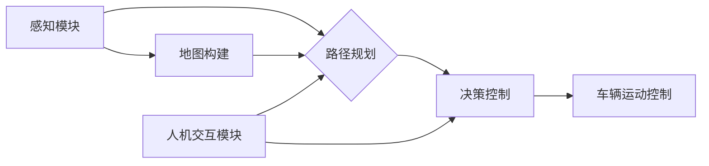

## IROS 2024自动驾驶论文解读:感知、导航与人机交互

> 关键词：自动驾驶、感知、导航、人机交互、深度学习、强化学习、传感器融合、路径规划、决策控制、虚拟现实

### 1. 背景介绍

自动驾驶技术作为未来交通运输的重要发展方向，近年来取得了显著进展。从早期基于规则的控制系统到如今的深度学习和强化学习驱动的智能驾驶系统，自动驾驶技术不断突破创新。 IROS 2024作为机器人领域顶级的学术会议，汇聚了全球顶尖的学者和研究人员，展示了自动驾驶技术最新的研究成果和发展趋势。

本篇文章将对 IROS 2024 上发表的若干篇自动驾驶相关论文进行解读，重点关注感知、导航和人机交互三个关键方面。通过对论文内容的分析和总结，希望能为读者提供对自动驾驶技术发展现状和未来方向的深入理解。

### 2. 核心概念与联系

自动驾驶系统是一个复杂的智能系统，需要感知周围环境、规划路径、控制车辆运动以及与人类进行交互。

**感知模块**负责收集车辆周围环境的信息，包括道路状况、交通标志、其他车辆和行人等。常用的感知技术包括：

* **摄像头:** 提供视觉信息，用于识别道路标线、交通信号灯、车辆和行人等。
* **雷达:** 通过发射电磁波探测目标距离和速度，能够在恶劣天气条件下有效感知环境。
* **激光雷达:** 利用激光扫描技术构建三维环境地图，能够精确测量目标的距离、形状和运动状态。
* **超声波传感器:** 用于检测车辆周围的近距离障碍物。

**导航模块**负责根据感知到的环境信息规划车辆行驶路径，并控制车辆运动。常用的导航技术包括：

* **路径规划:** 根据目标位置和环境约束，规划出车辆行驶的最佳路径。
* **地图构建:** 利用传感器数据构建车辆行驶环境的详细地图。
* **定位:** 确定车辆在环境地图中的位置。

**人机交互模块**负责与驾驶员进行交互，提供驾驶信息和辅助驾驶功能。常用的交互方式包括：

* **语音交互:** 驾驶员可以通过语音指令控制车辆。
* **显示屏:** 在显示屏上显示车辆状态、导航信息和驾驶辅助信息。
* **触控界面:** 驾驶员可以通过触控界面操作车辆。

**Mermaid 流程图:**



### 3. 核心算法原理 & 具体操作步骤

#### 3.1  算法原理概述

自动驾驶系统中广泛应用了许多先进的算法，例如深度学习、强化学习、传感器融合等。

* **深度学习:** 利用多层神经网络学习数据特征，能够实现图像识别、目标检测、路径规划等任务。
* **强化学习:** 通过奖励机制训练智能体，使其在环境中学习最优策略。
* **传感器融合:** 将来自不同传感器的数据进行融合，提高感知系统的鲁棒性和精度。

#### 3.2  算法步骤详解

以深度学习为例，其训练过程可以概括为以下步骤：

1. **数据收集:** 收集大量标注数据，例如图像、视频、传感器数据等。
2. **数据预处理:** 对数据进行清洗、格式化、增强等处理，使其适合深度学习模型训练。
3. **模型构建:** 选择合适的深度学习模型架构，例如卷积神经网络、循环神经网络等。
4. **模型训练:** 利用训练数据训练深度学习模型，调整模型参数，使其能够准确预测目标。
5. **模型评估:** 利用测试数据评估模型性能，例如准确率、召回率、F1-score等。
6. **模型部署:** 将训练好的模型部署到自动驾驶系统中，用于实际应用。

#### 3.3  算法优缺点

**深度学习:**

* **优点:** 能够学习复杂数据特征，具有较高的识别精度。
* **缺点:** 需要大量数据进行训练，训练时间长，易受数据噪声影响。

**强化学习:**

* **优点:** 可以学习最优策略，适应动态环境。
* **缺点:** 训练过程复杂，需要设计合理的奖励机制。

**传感器融合:**

* **优点:** 提高感知系统的鲁棒性和精度。
* **缺点:** 需要复杂的算法和硬件支持。

#### 3.4  算法应用领域

深度学习、强化学习和传感器融合等算法广泛应用于自动驾驶系统的各个方面，例如：

* **目标检测:** 识别道路上的车辆、行人、交通标志等。
* **路径规划:** 根据环境信息规划车辆行驶路径。
* **决策控制:** 根据感知信息和路径规划结果控制车辆运动。
* **地图构建:** 利用传感器数据构建车辆行驶环境的详细地图。
* **人机交互:** 与驾驶员进行交互，提供驾驶信息和辅助驾驶功能。

### 4. 数学模型和公式 & 详细讲解 & 举例说明

#### 4.1  数学模型构建

自动驾驶系统中，许多算法可以用数学模型来描述。例如，路径规划算法可以使用数学公式来计算车辆行驶路径，决策控制算法可以使用状态转移方程来描述车辆运动状态的变化。

#### 4.2  公式推导过程

以路径规划为例，常用的路径规划算法之一是A*算法。A*算法利用启发函数来估算目标位置的距离，并通过优先队列来选择最优路径。

A*算法的核心公式如下：

$$f(n) = g(n) + h(n)$$

其中：

* $f(n)$ 是节点 $n$ 的总代价，即从起点到节点 $n$ 的实际代价加上到目标位置的估算代价。
* $g(n)$ 是从起点到节点 $n$ 的实际代价。
* $h(n)$ 是从节点 $n$ 到目标位置的估算代价，通常使用曼哈顿距离或欧几里得距离。

#### 4.3  案例分析与讲解

假设我们有一个自动驾驶车辆需要从起点 A 到达终点 B，地图上存在障碍物。可以使用 A* 算法来规划车辆行驶路径。

A* 算法会首先将起点 A 加入到优先队列中，然后根据 $f(n)$ 值的大小选择最优节点进行扩展。每次扩展节点时，会计算该节点到所有相邻节点的实际代价 $g(n)$，并根据启发函数 $h(n)$ 计算到目标位置的估算代价。

最终，A* 算法会找到从起点 A 到终点 B 的最优路径，并返回该路径上的所有节点。

### 5. 项目实践：代码实例和详细解释说明

#### 5.1  开发环境搭建

自动驾驶项目开发通常需要搭建一个完整的开发环境，包括操作系统、编程语言、开发工具、仿真平台等。

例如，可以使用 Ubuntu 操作系统，Python 编程语言，ROS（机器人操作系统）开发框架，Gazebo 仿真平台等。

#### 5.2  源代码详细实现

以下是一个简单的自动驾驶路径规划代码示例，使用 Python 和 ROS 开发框架实现：

```python
import rospy
from nav_msgs.msg import Path
from geometry_msgs.msg import PoseStamped

class PathPlanner:
    def __init__(self):
        rospy.init_node('path_planner')
        self.path_pub = rospy.Publisher('/path', Path, queue_size=10)

    def plan_path(self, start_pose, goal_pose):
        # 使用 A* 算法规划路径
        #...

        path = Path()
        path.header.frame_id ='map'
        path.poses = [PoseStamped() for _ in range(len(planned_path))]
        # 将规划好的路径发布到 /path 主题
        self.path_pub.publish(path)

if __name__ == '__main__':
    planner = PathPlanner()
    # 设置起点和终点坐标
    start_pose = PoseStamped()
    goal_pose = PoseStamped()
    # 调用 plan_path 函数规划路径
    planner.plan_path(start_pose, goal_pose)
    rospy.spin()
```

#### 5.3  代码解读与分析

这段代码定义了一个 `PathPlanner` 类，用于规划自动驾驶车辆的路径。

* `__init__` 方法初始化 ROS 节点，并创建路径发布器。
* `plan_path` 方法使用 A* 算法规划路径，并将规划好的路径发布到 `/path` 主题。

#### 5.4  运行结果展示

运行这段代码后，会在 ROS 节点中发布一个包含规划路径的 `Path` 消息。

### 6. 实际应用场景

自动驾驶技术在多个领域都有着广泛的应用场景，例如：

* **自动驾驶汽车:** 自动驾驶汽车能够自动驾驶，提高交通安全和效率。
* **无人配送:** 无人配送车辆能够自动配送货物，降低物流成本。
* **无人驾驶飞机:** 无人驾驶飞机能够自动飞行，用于航拍、侦察等任务。
* **智能交通系统:** 自动驾驶技术可以用于构建智能交通系统，优化交通流量和减少拥堵。

#### 6.4  未来应用展望

未来，自动驾驶技术将更加智能化、安全可靠，并应用于更多领域。例如：

* **自动驾驶出租车:** 自动驾驶出租车能够提供便捷、高效的出行服务。
* **自动驾驶公交车:** 自动驾驶公交车能够提高公共交通效率和安全性。
* **自动驾驶货车:** 自动驾驶货车能够降低物流成本和提高运输效率。
* **自动驾驶农业机械:** 自动驾驶农业机械能够提高农业生产效率和降低人工成本。

### 7. 工具和资源推荐

#### 7.1  学习资源推荐

* **书籍:**
    * 《自动驾驶汽车》
    * 《机器人操作系统教程》
* **在线课程:**
    * Coursera 上的自动驾驶课程
    * Udacity 上的自动驾驶工程师 Nanodegree

#### 7.2  开发工具推荐

* **ROS (机器人操作系统):** 一个用于机器人开发的开源框架。
* **Gazebo:** 一个用于机器人仿真和测试的开源平台。
* **OpenCV:** 一个用于计算机视觉的开源库。
* **TensorFlow:** 一个用于深度学习的开源框架。

#### 7.3  相关论文推荐

* **论文标题:** 深度学习在自动驾驶中的应用
* **论文标题:** 强化学习在自动驾驶中的应用
* **论文标题:** 自动驾驶感知系统综述

### 8. 总结：未来发展趋势与挑战

#### 8.1  研究成果总结

IROS 2024 上发表的自动驾驶相关论文展示了该领域取得的显著进展，包括感知、导航和人机交互方面的突破。

#### 8.2  未来发展趋势

未来，自动驾驶技术将朝着更加智能化、安全可靠、通用化的方向发展。

* **人工智能技术:** 深度学习、强化学习等人工智能技术将进一步提升自动驾驶系统的感知、决策和控制能力。
* **传感器技术:** 新一代传感器，例如激光雷达、毫米波雷达等，将提供更精确、更可靠的环境感知信息。
* **通信技术:** 5G 和更高带宽的通信技术将支持自动驾驶车辆之间的数据共享和协作。

#### 8.3  面临的挑战

自动驾驶技术仍然面临着一些挑战，例如：

* **安全问题:** 确保自动驾驶系统在复杂环境中能够安全可靠地运行。
* **伦理问题:** 自动驾驶系统在遇到紧急情况时如何做出决策，需要进行伦理规范的制定。
* **法律法规:** 自动驾驶技术的法律法规体系尚不完善，需要进一步完善。

#### 8.4  研究展望

未来，需要继续加强自动驾驶技术的研究和开发，解决其面临的挑战，推动自动驾驶技术向更安全、更智能、更可靠的方向发展。

### 9. 附录：常见问题与解答

*