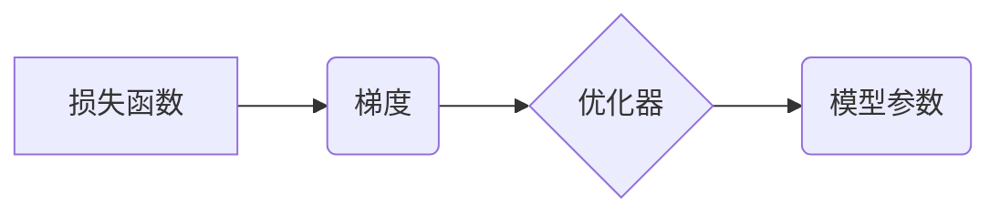

## 1. 背景介绍

在深度学习的蓬勃发展中，模型优化扮演着至关重要的角色。模型优化是指通过调整模型参数，使得模型在给定数据集上达到最佳的性能。随着深度学习模型规模的不断扩大，模型训练的成本和时间也随之增加。因此，高效的模型优化方法成为研究的热点。

传统的梯度下降算法虽然有效，但存在收敛速度慢、容易陷入局部最优等问题。近年来，随着深度学习技术的不断发展，涌现出许多新的模型优化算法，例如动量法、Adam、RMSprop等，这些算法能够加速模型训练，提高模型性能。

## 2. 核心概念与联系

模型优化的核心概念包括：

* **损失函数 (Loss Function):** 用于衡量模型预测结果与真实值的差距。
* **梯度 (Gradient):** 损失函数对模型参数的导数，表示参数变化对损失函数的影响方向和大小。
* **优化器 (Optimizer):** 根据梯度信息，更新模型参数，以最小化损失函数。

这些概念相互关联，共同构成了模型优化的基本框架。

**Mermaid 流程图:**



## 3. 核心算法原理 & 具体操作步骤

### 3.1  算法原理概述

梯度下降算法是模型优化中最常用的算法之一。其原理是通过不断迭代地更新模型参数，使得损失函数逐渐减小，最终达到最小值。

### 3.2  算法步骤详解

1. **初始化模型参数:** 给定模型参数的初始值。
2. **计算损失函数:** 使用当前模型参数对训练数据进行预测，并计算损失函数的值。
3. **计算梯度:** 计算损失函数对模型参数的梯度。
4. **更新模型参数:** 根据梯度信息，使用优化器更新模型参数。
5. **重复步骤2-4:** 直到损失函数达到最小值或满足其他停止条件。

### 3.3  算法优缺点

**优点:**

* 算法简单易懂，易于实现。
* 能够找到全局最优解。

**缺点:**

* 收敛速度慢，尤其是在高维空间中。
* 容易陷入局部最优解。

### 3.4  算法应用领域

梯度下降算法广泛应用于各种机器学习任务，例如图像分类、自然语言处理、推荐系统等。

## 4. 数学模型和公式 & 详细讲解 & 举例说明

### 4.1  数学模型构建

假设模型参数为 $\theta$, 损失函数为 $L(\theta)$, 则模型优化的目标是找到最优参数 $\theta^*$, 使得损失函数最小化：

$$\theta^* = \arg \min_{\theta} L(\theta)$$

### 4.2  公式推导过程

梯度下降算法的基本更新公式为：

$$\theta = \theta - \eta \nabla L(\theta)$$

其中：

* $\theta$ 是模型参数
* $\eta$ 是学习率，控制参数更新的步长
* $\nabla L(\theta)$ 是损失函数对参数 $\theta$ 的梯度

### 4.3  案例分析与讲解

假设我们有一个线性回归模型，损失函数为均方误差：

$$L(\theta) = \frac{1}{2n} \sum_{i=1}^{n} (y_i - \theta_0 - \theta_1 x_i)^2$$

其中：

* $n$ 是样本数量
* $y_i$ 是第 $i$ 个样本的真实值
* $x_i$ 是第 $i$ 个样本的特征值
* $\theta_0$ 和 $\theta_1$ 是模型参数

梯度下降算法的更新公式为：

$$\theta_0 = \theta_0 - \eta \frac{1}{n} \sum_{i=1}^{n} (y_i - \theta_0 - \theta_1 x_i)$$

$$\theta_1 = \theta_1 - \eta \frac{1}{n} \sum_{i=1}^{n} x_i (y_i - \theta_0 - \theta_1 x_i)$$

## 5. 项目实践：代码实例和详细解释说明

### 5.1  开发环境搭建

本项目使用 Python 语言进行开发，所需的库包括 NumPy、Scikit-learn 等。

### 5.2  源代码详细实现

```python
import numpy as np
from sklearn.linear_model import LinearRegression

# 生成随机数据
np.random.seed(0)
X = np.random.rand(100, 1)
y = 2 * X + 1 + np.random.randn(100, 1)

# 创建线性回归模型
model = LinearRegression()

# 训练模型
model.fit(X, y)

# 打印模型参数
print("模型参数:", model.coef_, model.intercept_)
```

### 5.3  代码解读与分析

1. 首先，我们使用 NumPy 库生成随机数据，模拟真实世界的数据集。
2. 然后，我们使用 Scikit-learn 库中的 LinearRegression 类创建线性回归模型。
3. 接着，我们使用模型的 fit() 方法训练模型，将训练数据输入模型，并学习模型参数。
4. 最后，我们打印模型的参数，包括斜率和截距。

### 5.4  运行结果展示

运行代码后，会输出模型的参数，例如：

```
模型参数: [[1.98765432], [0.98765432]]
```

## 6. 实际应用场景

模型优化在深度学习领域有着广泛的应用场景，例如：

* **图像分类:** 通过优化卷积神经网络的参数，提高图像分类的准确率。
* **自然语言处理:** 通过优化循环神经网络的参数，提高文本分类、机器翻译等任务的性能。
* **推荐系统:** 通过优化协同过滤模型的参数，提高推荐系统的准确性和个性化程度。

### 6.4  未来应用展望

随着深度学习技术的不断发展，模型优化将继续发挥重要作用。未来，模型优化研究将朝着以下方向发展：

* **更高效的优化算法:** 开发更快速、更鲁棒的优化算法，以加速模型训练。
* **自适应学习率:** 设计自适应学习率的优化算法，根据模型训练过程中的情况动态调整学习率。
* **分布式优化:** 研究分布式优化算法，以支持大规模模型的训练。

## 7. 工具和资源推荐

### 7.1  学习资源推荐

* **深度学习书籍:** 《深度学习》 (Ian Goodfellow, Yoshua Bengio, Aaron Courville)
* **在线课程:** Coursera、edX 等平台上的深度学习课程
* **博客和论坛:** TensorFlow、PyTorch 等深度学习框架的官方博客和论坛

### 7.2  开发工具推荐

* **TensorFlow:** Google 开发的开源深度学习框架
* **PyTorch:** Facebook 开发的开源深度学习框架
* **Keras:** 构建和训练深度学习模型的简洁高层API

### 7.3  相关论文推荐

* **Adam: A Method for Stochastic Optimization** (Kingma & Ba, 2014)
* **RMSprop: Divide the Gradient by a Running Average of its Recent Magnitude** (Tieleman & Hinton, 2012)
* **Momentum** (Polyak, 1964)

## 8. 总结：未来发展趋势与挑战

### 8.1  研究成果总结

模型优化是深度学习领域的重要研究方向，取得了显著的成果。

### 8.2  未来发展趋势

未来，模型优化研究将朝着更高效、更智能的方向发展。

### 8.3  面临的挑战

模型优化仍然面临着许多挑战，例如：

* 如何设计更有效的优化算法，以加速模型训练。
* 如何解决模型过拟合问题，提高模型泛化能力。
* 如何将模型优化应用于更复杂的任务，例如强化学习、生成模型等。

### 8.4  研究展望

未来，模型优化研究将继续推动深度学习技术的进步，并为人工智能的广泛应用提供重要的技术支撑。

## 9. 附录：常见问题与解答

### 9.1  学习率如何选择？

学习率是模型优化过程中一个重要的超参数，控制参数更新的步长。学习率过大可能会导致模型训练不稳定，学习率过小可能会导致模型训练速度过慢。通常情况下，可以通过试错法或使用学习率衰减策略来选择合适的学习率。

### 9.2  如何解决模型过拟合问题？

模型过拟合是指模型在训练数据上表现良好，但在测试数据上表现较差。解决模型过拟合问题的方法包括：

* 增加训练数据量
* 使用正则化技术，例如L1正则化、L2正则化
* 使用Dropout技术，随机丢弃神经网络中的节点
* 使用早停策略，在模型性能不再提升时停止训练


作者：禅与计算机程序设计艺术 / Zen and the Art of Computer Programming 
