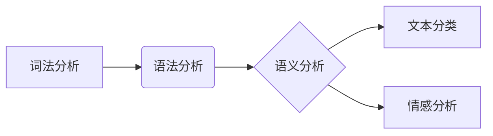

## Natural Language Processing (NLP)原理与代码实例讲解

> 关键词：自然语言处理、NLP、文本分析、机器学习、深度学习、词嵌入、Transformer、BERT

## 1. 背景介绍

自然语言处理 (Natural Language Processing，简称 NLP) 是一门跨学科领域，它致力于使计算机能够理解、解释和生成人类语言。随着人工智能技术的快速发展，NLP 已经成为一个炙手可热的研究领域，并在各个领域得到了广泛应用，例如搜索引擎、机器翻译、语音识别、聊天机器人等。

NLP 的目标是构建能够与人类进行自然流畅对话的计算机系统。为了实现这一目标，NLP 研究者们需要解决许多技术难题，例如：

* **文本分析:**  理解文本的语义和结构，例如识别实体、关系、情感等。
* **语言建模:**  学习语言的统计规律，例如预测下一个词语。
* **机器翻译:**  将一种语言翻译成另一种语言。
* **语音识别:**  将语音信号转换为文本。
* **文本生成:**  生成自然流畅的文本，例如写文章、生成对话等。

## 2. 核心概念与联系

NLP 的核心概念包括：

* **词法分析:** 将文本分解成单词或词组。
* **语法分析:** 分析文本的语法结构。
* **语义分析:** 理解文本的含义。
* **文本分类:** 将文本归类到不同的类别。
* **情感分析:** 分析文本的情感倾向。

这些概念相互关联，共同构成了 NLP 的基础框架。



## 3. 核心算法原理 & 具体操作步骤

### 3.1  算法原理概述

在 NLP 中，许多算法被用于处理文本数据。其中一些最常用的算法包括：

* **朴素贝叶斯算法:**  基于贝叶斯定理，用于文本分类。
* **支持向量机 (SVM):**  一种监督学习算法，用于文本分类和回归。
* **决策树算法:**  一种树形结构的分类算法。
* **随机森林算法:**  一种基于多个决策树的分类算法。
* **神经网络算法:**  一种能够学习复杂模式的算法，在 NLP 中取得了显著的成果。

### 3.2  算法步骤详解

以朴素贝叶斯算法为例，详细说明其操作步骤：

1. **数据预处理:**  将文本数据转换为数字格式，例如使用词袋模型或 TF-IDF 模型。
2. **训练模型:**  使用训练数据训练朴素贝叶斯模型，计算每个类别出现的概率以及每个词语在每个类别中出现的概率。
3. **预测类别:**  将新文本数据转换为数字格式，然后根据训练好的模型计算每个类别的概率，选择概率最高的类别作为预测结果。

### 3.3  算法优缺点

**朴素贝叶斯算法:**

* **优点:**  简单易懂，训练速度快，对数据要求不高。
* **缺点:**  假设词语之间相互独立，这在实际应用中并不总是成立。

### 3.4  算法应用领域

朴素贝叶斯算法广泛应用于文本分类任务，例如：

* **垃圾邮件过滤:**  识别垃圾邮件。
* **文本主题分类:**  将文本归类到不同的主题。
* **情感分析:**  分析文本的情感倾向。

## 4. 数学模型和公式 & 详细讲解 & 举例说明

### 4.1  数学模型构建

朴素贝叶斯算法基于贝叶斯定理，其核心公式如下：

$$P(C|D) = \frac{P(D|C)P(C)}{P(D)}$$

其中：

* $P(C|D)$ 是给定证据 $D$ 下类别 $C$ 的后验概率。
* $P(D|C)$ 是给定类别 $C$ 下证据 $D$ 的似然概率。
* $P(C)$ 是类别 $C$ 的先验概率。
* $P(D)$ 是证据 $D$ 的先验概率。

### 4.2  公式推导过程

贝叶斯定理的推导过程如下：

1. 从条件概率的定义出发：

$$P(A|B) = \frac{P(A \cap B)}{P(B)}$$

2. 将公式应用于 $P(C|D)$：

$$P(C|D) = \frac{P(C \cap D)}{P(D)}$$

3. 将 $P(C \cap D)$ 替换为 $P(D|C)P(C)$：

$$P(C|D) = \frac{P(D|C)P(C)}{P(D)}$$

### 4.3  案例分析与讲解

假设我们有一个文本分类任务，需要将文本分类为“正面”或“负面”情感。

* $C$ 代表类别，可以是“正面”或“负面”。
* $D$ 代表证据，可以是文本中的词语。

我们可以使用朴素贝叶斯算法训练模型，计算每个类别出现的概率以及每个词语在每个类别中出现的概率。

例如，如果“开心”这个词语在“正面”类别的文本中出现的概率较高，那么在预测新文本的情感时，如果新文本包含“开心”这个词语，那么模型会倾向于将新文本分类为“正面”。

## 5. 项目实践：代码实例和详细解释说明

### 5.1  开发环境搭建

为了实现 NLP 项目，我们需要搭建一个开发环境。常用的开发环境包括：

* **Python:**  一个流行的编程语言，广泛用于 NLP 开发。
* **NLTK:**  一个 Python 库，提供许多 NLP 工具和算法。
* **spaCy:**  另一个 Python 库，提供高效的 NLP 处理能力。
* **TensorFlow/PyTorch:**  深度学习框架，用于训练复杂的 NLP 模型。

### 5.2  源代码详细实现

以下是一个使用 NLTK 库进行文本分类的简单代码实例：

```python
import nltk
from nltk.corpus import movie_reviews
from nltk.classify.scikitlearn import SklearnClassifier
from sklearn.naive_bayes import MultinomialNB

# 下载电影评论数据集
nltk.download('movie_reviews')

# 加载电影评论数据集
documents = [(list(movie_reviews.words(fileid)), category)
             for category in movie_reviews.categories()
             for fileid in movie_reviews.fileids(category)]

# 训练朴素贝叶斯分类器
classifier = SklearnClassifier(MultinomialNB())
classifier.train(documents)

# 测试分类器
test_document = ["This", "movie", "is", "great"]
prediction = classifier.classify(test_document)
print(prediction)
```

### 5.3  代码解读与分析

这段代码首先下载并加载电影评论数据集。然后，它使用朴素贝叶斯分类器训练模型。最后，它使用训练好的模型对一个测试文本进行分类。

### 5.4  运行结果展示

运行这段代码后，会输出测试文本的分类结果，例如“pos”或“neg”。

## 6. 实际应用场景

NLP 技术在各个领域都有广泛的应用场景，例如：

* **搜索引擎:**  理解用户搜索意图，提供更精准的搜索结果。
* **机器翻译:**  将文本从一种语言翻译成另一种语言。
* **语音识别:**  将语音信号转换为文本。
* **聊天机器人:**  构建能够与人类进行自然对话的聊天机器人。
* **文本摘要:**  自动生成文本的摘要。
* **情感分析:**  分析文本的情感倾向。

### 6.4  未来应用展望

随着人工智能技术的不断发展，NLP 技术的应用场景将会更加广泛。例如：

* **个性化推荐:**  根据用户的语言习惯和偏好，提供个性化的产品或服务推荐。
* **自动写作:**  自动生成新闻报道、广告文案、诗歌等文本。
* **跨语言理解:**  实现不同语言之间的理解和交流。
* **人机交互:**  构建更加自然流畅的人机交互方式。

## 7. 工具和资源推荐

### 7.1  学习资源推荐

* **斯坦福大学 NLP课程:**  https://web.stanford.edu/class/cs224n/
* **Coursera NLP课程:**  https://www.coursera.org/search?query=natural%20language%20processing
* **NLTK官方文档:**  https://www.nltk.org/book/

### 7.2  开发工具推荐

* **NLTK:**  https://www.nltk.org/
* **spaCy:**  https://spacy.io/
* **Gensim:**  https://radimrehurek.com/gensim/
* **TensorFlow:**  https://www.tensorflow.org/
* **PyTorch:**  https://pytorch.org/

### 7.3  相关论文推荐

* **Attention Is All You Need:**  https://arxiv.org/abs/1706.03762
* **BERT: Pre-training of Deep Bidirectional Transformers for Language Understanding:**  https://arxiv.org/abs/1810.04805

## 8. 总结：未来发展趋势与挑战

### 8.1  研究成果总结

NLP 技术取得了显著的进展，例如：

* **深度学习的应用:**  深度学习算法在 NLP 中取得了突破性进展，例如 Transformer 模型的出现。
* **预训练模型的兴起:**  预训练模型，例如 BERT 和 GPT-3，能够在大量文本数据上进行预训练，从而提高 NLP 任务的性能。
* **跨语言理解的进展:**  跨语言理解技术取得了显著的进展，例如机器翻译的准确率不断提高。

### 8.2  未来发展趋势

NLP 技术的未来发展趋势包括：

* **更强大的预训练模型:**  预训练模型将会更加强大，能够处理更复杂的任务。
* **更有效的训练方法:**  新的训练方法将会提高 NLP 模型的训练效率和性能。
* **更广泛的应用场景:**  NLP 技术将会应用于更多领域，例如医疗、教育、金融等。

### 8.3  面临的挑战

NLP 技术仍然面临一些挑战，例如：

* **数据稀缺性:**  一些领域的数据稀缺，难以训练有效的 NLP 模型。
* **可解释性:**  深度学习模型的决策过程难以解释，这限制了其在一些领域中的应用。
* **公平性:**  NLP 模型可能存在偏见，需要进行公平性评估和改进。

### 8.4  研究展望

未来，NLP 研究需要关注以下几个方面：

* **解决数据稀缺性问题:**  探索新的数据增强技术和迁移学习方法。
* **提高模型的可解释性:**  研究可解释的深度学习模型和方法。
* **确保模型的公平性:**  开发公平性评估指标和改进方法。


## 9. 附录：常见问题与解答

**Q1:  什么是词袋模型？**

**A1:**  词袋模型是一种文本表示方法，它将文本视为一个词语集合，忽略词语的顺序。

**Q2:  什么是 TF-IDF 模型？**

**A2:**  TF-IDF 模型是一种文本表示方法，它考虑了词语在文档中出现的频率和在整个语料库中出现的频率。

**Q3:  什么是 Transformer 模型？**

**A3:**  Transformer 模型是一种深度学习模型，它使用注意力机制来处理文本序列，能够捕捉长距离依赖关系。

**Q4:  什么是 BERT 模型？**

**A4:**  BERT 模型是一种基于 Transformer 的预训练语言模型，能够在大量文本数据上进行预训练，从而提高 NLP 任务的性能。


作者：禅与计算机程序设计艺术 /