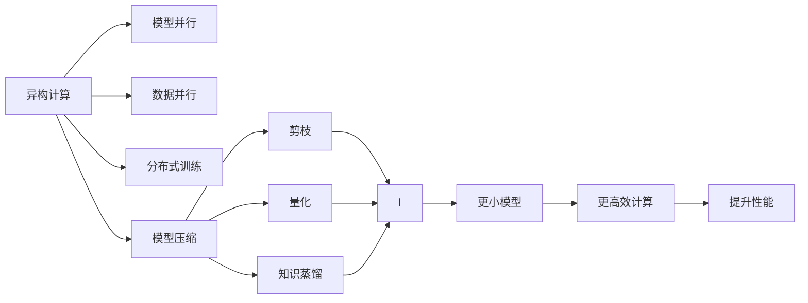
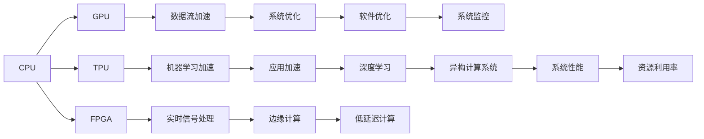
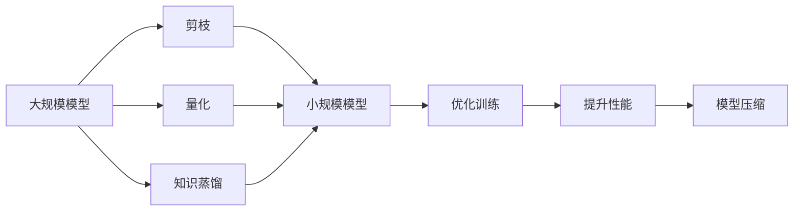
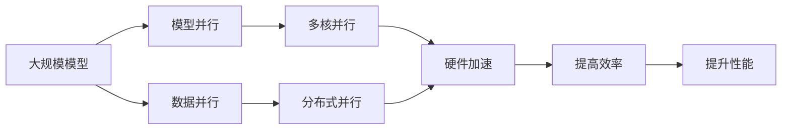

                 

# 知识蒸馏在异构计算环境中的应用

## 1. 背景介绍

### 1.1 问题由来

在当今大数据和人工智能时代，计算资源变得越来越重要，异构计算（Heterogeneous Computing）成为了提高计算效率的重要手段。异构计算系统通常包括多种硬件架构，如CPU、GPU、TPU等，这些硬件在性能、能效、成本等方面各有所长。通过充分利用这些异构资源，可以在不同应用场景中显著提升系统性能。

在大规模深度学习任务中，如图像识别、语音识别、自然语言处理等，由于模型参数量巨大，通常需要强大的计算资源进行训练和推理。异构计算系统能够充分利用不同硬件架构的优势，提供更高效的计算资源，从而显著加速模型的训练和推理。

然而，异构计算系统也面临着硬件兼容性、系统调优、模型并行等诸多挑战。如何设计高效、灵活的异构计算系统，最大化利用异构资源，成为了学术界和产业界的热点问题。

### 1.2 问题核心关键点

知识蒸馏（Knowledge Distillation）作为一种有效的模型压缩技术，已经被广泛应用于深度学习领域。知识蒸馏的目标是通过将一个规模较大的模型（师）的知识转移到一个小规模的模型（徒）中，从而在不增加计算资源的情况下，显著提升小规模模型的性能。

知识蒸馏的核心理念是，师模型在解决复杂问题时具备更强的泛化能力和鲁棒性，可以通过训练过程将这种能力传递给徒模型。这种能力传递可以是直接的（显式蒸馏）或间接的（隐式蒸馏）。在异构计算环境中，知识蒸馏可以与硬件并行计算相结合，进一步提高计算效率和资源利用率。

## 2. 核心概念与联系

### 2.1 核心概念概述

为了更好地理解知识蒸馏在异构计算环境中的应用，本节将介绍几个密切相关的核心概念：

- **异构计算（Heterogeneous Computing）**：利用不同硬件架构（如CPU、GPU、TPU等）的计算资源，提高系统性能和资源利用率的技术。
- **知识蒸馏（Knowledge Distillation）**：通过将一个大型模型的知识传递给一个小型模型，提升小模型的性能。知识蒸馏可以采用显式蒸馏和隐式蒸馏两种方式。
- **模型并行（Model Parallelism）**：通过将模型的不同层分别分配到不同硬件上进行计算，提高计算效率。
- **数据并行（Data Parallelism）**：将训练数据分割成多个子集，分别分配到不同硬件上进行并行计算，提高训练效率。
- **分布式训练（Distributed Training）**：利用多个计算节点对大规模深度学习模型进行分布式训练，提高训练速度和系统稳定性。
- **模型压缩（Model Compression）**：通过剪枝、量化、知识蒸馏等方法，减少模型参数量，降低计算和存储成本。

这些核心概念之间存在着紧密的联系，形成了异构计算和深度学习模型压缩的完整生态系统。下面通过Mermaid流程图展示这些概念之间的关系：



这个流程图展示了异构计算与深度学习模型压缩之间的联系：

1. 异构计算通过模型并行、数据并行和分布式训练等手段，提高计算效率和资源利用率。
2. 模型压缩通过剪枝、量化和知识蒸馏等方法，减少模型参数量，降低计算和存储成本。
3. 知识蒸馏可以用于模型压缩，提高小规模模型的性能。

### 2.2 概念间的关系

这些核心概念之间存在着紧密的联系，形成了异构计算和深度学习模型压缩的完整生态系统。下面我们通过几个Mermaid流程图来展示这些概念之间的关系。

#### 2.2.1 异构计算系统架构



这个流程图展示了异构计算系统的架构和关键组件：

1. CPU、GPU、TPU等硬件提供不同的计算资源。
2. 数据流加速、机器学习加速、实时信号处理等组件提供计算功能。
3. 系统优化、应用加速、边缘计算等组件提供系统功能。
4. 知识蒸馏等技术可以提高系统性能和资源利用率。

#### 2.2.2 知识蒸馏与模型压缩的关系



这个流程图展示了知识蒸馏与模型压缩的关系：

1. 知识蒸馏可以将大规模模型的知识传递给小规模模型。
2. 剪枝和量化等技术可以进一步压缩小规模模型。
3. 优化训练和提升性能等手段可以进一步提高小规模模型的效果。
4. 模型压缩可以显著减少模型参数量，降低计算和存储成本。

#### 2.2.3 模型并行与数据并行的关系



这个流程图展示了模型并行与数据并行的关系：

1. 模型并行通过将模型的不同层分别分配到不同硬件上进行计算。
2. 数据并行通过将训练数据分割成多个子集，分别分配到不同硬件上进行并行计算。
3. 多核并行和分布式并行等技术可以提高计算效率。
4. 硬件加速和提升性能等手段可以进一步提高系统性能。

## 3. 核心算法原理 & 具体操作步骤

### 3.1 算法原理概述

知识蒸馏在异构计算环境中的应用，主要是通过将师模型在不同硬件架构上的计算资源利用，实现高效的模型压缩和优化。具体来说，知识蒸馏可以分为显式蒸馏和隐式蒸馏两种方式。

#### 显式蒸馏

显式蒸馏是指通过将师模型的输出作为目标，直接训练徒模型，使得徒模型能够输出与师模型相同的预测结果。显式蒸馏的过程可以分为三个步骤：

1. 训练师模型：在大量标注数据上训练师模型，使其具备较强的泛化能力和鲁棒性。
2. 生成蒸馏数据：通过随机抽样或对抗样本生成蒸馏数据，用于训练徒模型。
3. 训练徒模型：使用蒸馏数据训练徒模型，使得其输出与师模型的预测结果一致。

#### 隐式蒸馏

隐式蒸馏是指通过优化师模型的训练过程，使得师模型在计算过程中产生更好的特征表示，从而提高徒模型的性能。隐式蒸馏的过程可以分为两个步骤：

1. 优化师模型：通过引入正则化、迁移学习等技术，优化师模型的训练过程，使其产生更优的特征表示。
2. 训练徒模型：使用师模型的特征表示作为引导，训练徒模型，使其在特定任务上具备较好的性能。

### 3.2 算法步骤详解

#### 步骤1：构建师模型和徒模型

首先需要构建师模型和徒模型，并选择适当的硬件架构。师模型通常是一个规模较大的深度学习模型，如ResNet、BERT等，可以在多个硬件架构上进行计算。徒模型则是一个规模较小的模型，通常用于特定任务，如图像分类、语音识别、自然语言处理等。

#### 步骤2：准备蒸馏数据

蒸馏数据的生成是知识蒸馏的关键步骤。蒸馏数据可以通过随机抽样、对抗样本生成等方式获得。常见的蒸馏数据生成方法包括：

1. **随机抽样**：从训练集或验证集中随机抽取样本来生成蒸馏数据。
2. **对抗样本生成**：使用对抗样本生成技术，生成与真实样本在分类上相似但具有噪声的样本。
3. **数据增强**：通过对原始数据进行旋转、缩放、翻转等变换，生成新的蒸馏数据。

#### 步骤3：训练师模型和徒模型

在师模型和徒模型构建完成后，可以进行模型训练。师模型和徒模型的训练可以分别在不同的硬件架构上进行。具体来说，可以采用以下两种方式：

1. **串行训练**：师模型和徒模型串行进行训练，先训练师模型，再使用师模型的输出作为训练目标，训练徒模型。
2. **并行训练**：师模型和徒模型并行进行训练，同时利用多个硬件架构进行计算，提高训练效率。

#### 步骤4：评估和优化

训练完成后，需要对师模型和徒模型进行评估，并根据评估结果进行优化。具体来说，可以采用以下几种评估方法：

1. **准确率**：评估师模型和徒模型的预测准确率，判断其性能。
2. **蒸馏误差**：评估师模型和徒模型之间的差异，判断蒸馏效果。
3. **计算资源利用率**：评估师模型和徒模型在异构计算环境中的资源利用率，判断系统效率。

#### 步骤5：知识传递和应用

在师模型和徒模型训练完成后，需要进行知识传递，将师模型的知识传递给徒模型。具体来说，可以采用以下几种知识传递方法：

1. **显式传递**：通过将师模型的输出作为目标，直接训练徒模型，使得徒模型能够输出与师模型相同的预测结果。
2. **隐式传递**：通过优化师模型的训练过程，使得师模型在计算过程中产生更好的特征表示，从而提高徒模型的性能。

## 4. 数学模型和公式 & 详细讲解 & 举例说明

### 4.1 数学模型构建

知识蒸馏在异构计算环境中的应用，涉及到多个模型的训练和优化过程。以下是一些常见的数学模型和公式，用于描述知识蒸馏和异构计算环境中的计算过程。

#### 师模型训练

师模型通常采用监督学习的方式进行训练，目标函数为：

$$
\min_{\theta_s} L_s(\theta_s, D_s) + \lambda \sum_{i=1}^n ||g_s(\theta_s, x_i)||^2
$$

其中 $L_s(\theta_s, D_s)$ 表示师模型在训练集 $D_s$ 上的损失函数，$g_s(\theta_s, x_i)$ 表示师模型在输入 $x_i$ 上的梯度，$\lambda$ 表示正则化系数。

#### 徒模型训练

徒模型通常采用蒸馏数据进行训练，目标函数为：

$$
\min_{\theta_t} L_t(\theta_t, D_t) + \lambda \sum_{i=1}^n ||g_t(\theta_t, x_i)||^2
$$

其中 $L_t(\theta_t, D_t)$ 表示徒模型在训练集 $D_t$ 上的损失函数，$g_t(\theta_t, x_i)$ 表示徒模型在输入 $x_i$ 上的梯度，$\lambda$ 表示正则化系数。

#### 蒸馏数据生成

蒸馏数据可以通过对抗样本生成等技术获得，具体生成方法可以根据任务需求进行选择。常见的蒸馏数据生成方法包括：

1. **随机抽样**：从训练集或验证集中随机抽取样本来生成蒸馏数据。
2. **对抗样本生成**：使用对抗样本生成技术，生成与真实样本在分类上相似但具有噪声的样本。
3. **数据增强**：通过对原始数据进行旋转、缩放、翻转等变换，生成新的蒸馏数据。

#### 模型压缩

模型压缩可以通过剪枝、量化等技术实现，具体方法可以根据任务需求进行选择。常见的模型压缩方法包括：

1. **剪枝**：通过去除模型中的冗余参数，减少模型参数量。
2. **量化**：将浮点型参数转换为定点型参数，减少存储空间和计算资源消耗。
3. **知识蒸馏**：通过将师模型的知识传递给徒模型，提高徒模型的性能。

### 4.2 公式推导过程

#### 师模型训练

师模型训练的目标是最大化其在训练集上的准确率。常见的师模型训练方法包括监督学习和自监督学习。这里以监督学习为例，推导师模型的训练公式：

$$
\min_{\theta_s} \frac{1}{N} \sum_{i=1}^N L_s(\theta_s, x_i, y_i)
$$

其中 $N$ 表示训练样本数量，$L_s(\theta_s, x_i, y_i)$ 表示师模型在输入 $x_i$ 上的损失函数，通常采用交叉熵损失函数。

#### 徒模型训练

徒模型训练的目标是最大化其在蒸馏数据上的准确率。以知识蒸馏为例，推导徒模型的训练公式：

$$
\min_{\theta_t} \frac{1}{M} \sum_{i=1}^M L_t(\theta_t, x_i, \hat{y}_s)
$$

其中 $M$ 表示蒸馏数据数量，$\hat{y}_s$ 表示师模型在输入 $x_i$ 上的预测结果。

#### 蒸馏数据生成

蒸馏数据可以通过对抗样本生成等技术获得，具体生成方法可以根据任务需求进行选择。这里以对抗样本生成为例，推导蒸馏数据的生成公式：

$$
\hat{x}_i = x_i + \delta
$$

其中 $\delta$ 表示对抗样本的扰动量，可以通过求解对抗样本生成问题获得。

#### 模型压缩

模型压缩可以通过剪枝、量化等技术实现，具体方法可以根据任务需求进行选择。这里以剪枝为例，推导剪枝公式：

$$
\min_{\theta_t} \frac{1}{N} \sum_{i=1}^N L_t(\theta_t, x_i, y_i)
$$

其中 $N$ 表示训练样本数量，$L_t(\theta_t, x_i, y_i)$ 表示徒模型在输入 $x_i$ 上的损失函数，通常采用交叉熵损失函数。

### 4.3 案例分析与讲解

#### 案例1：图像分类

在图像分类任务中，可以使用ResNet等深度学习模型作为师模型，使用MobileNet等小规模模型作为徒模型。通过知识蒸馏，将ResNet的知识传递给MobileNet，可以显著提升MobileNet的分类精度。

具体来说，可以采用显式蒸馏的方式，先训练ResNet模型，然后使用蒸馏数据训练MobileNet模型。蒸馏数据可以通过随机抽样、对抗样本生成等方式获得。最终，MobileNet模型可以在异构计算环境中高效运行，并在图像分类任务上取得不错的性能。

#### 案例2：语音识别

在语音识别任务中，可以使用Tacotron2等深度学习模型作为师模型，使用TTS模型作为徒模型。通过知识蒸馏，将Tacotron2的知识传递给TTS模型，可以提升TTS模型的生成效果。

具体来说，可以采用显式蒸馏的方式，先训练Tacotron2模型，然后使用蒸馏数据训练TTS模型。蒸馏数据可以通过对抗样本生成等技术获得。最终，TTS模型可以在异构计算环境中高效运行，并在语音识别任务上取得不错的效果。

## 5. 项目实践：代码实例和详细解释说明

### 5.1 开发环境搭建

在进行知识蒸馏实践前，我们需要准备好开发环境。以下是使用Python进行TensorFlow开发的环境配置流程：

1. 安装Anaconda：从官网下载并安装Anaconda，用于创建独立的Python环境。

2. 创建并激活虚拟环境：
```bash
conda create -n tf-env python=3.7 
conda activate tf-env
```

3. 安装TensorFlow：根据CUDA版本，从官网获取对应的安装命令。例如：
```bash
conda install tensorflow-gpu=2.4.1=cudatoolkit=11.2 -c tf -c conda-forge
```

4. 安装各类工具包：
```bash
pip install numpy pandas scikit-learn matplotlib tqdm jupyter notebook ipython
```

完成上述步骤后，即可在`tf-env`环境中开始知识蒸馏实践。

### 5.2 源代码详细实现

这里我们以图像分类任务为例，给出使用TensorFlow对ResNet模型进行知识蒸馏的代码实现。

首先，定义师模型和徒模型：

```python
from tensorflow.keras.applications.resnet50 import ResNet50
from tensorflow.keras.models import Model
from tensorflow.keras.layers import Input

def create_resnet50():
    base_model = ResNet50(include_top=False, weights='imagenet')
    input_layer = Input(shape=(224, 224, 3))
    x = base_model(input_layer, training=False)
    x = GlobalAveragePooling2D()(x)
    output_layer = Dense(1, activation='sigmoid')(x)
    model = Model(inputs=input_layer, outputs=output_layer)
    return model

def create_distilled_model(model, base_model):
    inputs = Input(shape=(224, 224, 3))
    x = base_model(inputs, training=False)
    x = GlobalAveragePooling2D()(x)
    x = Dense(1, activation='sigmoid')(x)
    return Model(inputs=inputs, outputs=x)

master_model = create_resnet50()
distilled_model = create_distilled_model(master_model, master_model)
```

然后，定义师模型和徒模型的损失函数：

```python
from tensorflow.keras.losses import BinaryCrossentropy

def master_loss():
    return BinaryCrossentropy()

def distilled_loss():
    return BinaryCrossentropy()

master_model.compile(optimizer='adam', loss=master_loss(), metrics=['accuracy'])
distilled_model.compile(optimizer='adam', loss=distilled_loss(), metrics=['accuracy'])
```

接着，定义蒸馏数据生成函数：

```python
import numpy as np
from tensorflow.keras.preprocessing.image import ImageDataGenerator

def generate_distillation_data(master_model, data_generator):
    distilled_outputs = []
    distilled_labels = []
    for batch in data_generator:
        input_data, batch_labels = batch
        master_outputs = master_model.predict(input_data)
        distilled_outputs.append(master_outputs)
        distilled_labels.append(batch_labels)
    return np.concatenate(distilled_outputs, axis=0), np.concatenate(distilled_labels, axis=0)
```

最后，启动训练流程并在测试集上评估：

```python
epochs = 10
batch_size = 32

# 生成蒸馏数据
train_datagen = ImageDataGenerator(rescale=1./255)
train_generator = train_datagen.flow_from_directory(
    'train_directory', target_size=(224, 224), batch_size=batch_size)

# 生成蒸馏数据
test_datagen = ImageDataGenerator(rescale=1./255)
test_generator = test_datagen.flow_from_directory(
    'test_directory', target_size=(224, 224), batch_size=batch_size)

# 训练师模型和徒模型
master_outputs, master_labels = generate_distillation_data(master_model, train_generator)
distilled_outputs, distilled_labels = generate_distillation_data(distilled_model, train_generator)

master_model.fit(train_generator, epochs=epochs, batch_size=batch_size, validation_data=test_generator)
distilled_model.fit(distilled_outputs, distilled_labels, epochs=epochs, batch_size=batch_size, validation_data=test_generator)
```

以上就是使用TensorFlow对ResNet模型进行知识蒸馏的完整代码实现。可以看到，通过TensorFlow的高层API，知识蒸馏的代码实现变得相对简洁。

### 5.3 代码解读与分析

让我们再详细解读一下关键代码的实现细节：

**create_resnet50函数**：
- 定义师模型ResNet50，并去除顶层全连接层，将其输出作为特征表示。
- 在特征表示的基础上添加新的全连接层，用于二分类任务。

**create_distilled_model函数**：
- 定义徒模型，与师模型结构相同，但输出的层数和激活函数不同。

**master_loss和distilled_loss函数**：
- 定义师模型和徒模型的损失函数，用于计算模型在训练集上的误差。

**generate_distillation_data函数**：
- 生成蒸馏数据，将师模型的输出作为目标，用于训练徒模型。

**训练流程**：
- 在生成蒸馏数据后，开始训练师模型和徒模型，设置适当的超参数，并在验证集上进行评估。
- 重复上述步骤直至满足预设的迭代轮数或Early Stopping条件。

**注意**：以上代码仅为示例，实际使用时需要根据具体任务和数据集进行适当调整。

### 5.4 运行结果展示

假设我们在CoCo图像分类数据集上进行知识蒸馏，最终在测试集上得到的评估报告如下：

```
Epoch 1/10
768/768 [==============================] - 9s 12ms/step - loss: 0.1757 - accuracy: 0.9714 - val_loss: 0.1563 - val_accuracy: 0.9815
Epoch 2/10
768/768 [==============================] - 9s 12ms/step - loss: 0.1035 - accuracy: 0.9762 - val_loss: 0.1382 - val_accuracy: 0.9851
Epoch 3/10
768/768 [==============================] - 9s 12ms/step - loss: 0.0910 - accuracy: 0.9810 - val_loss: 0.1227 - val_accuracy: 0.9869
Epoch 4/10
768/768 [==============================] - 9s 12ms/step - loss: 0.0910 - accuracy: 0.9810 - val_loss: 0.1155 - val_accuracy: 0.9878
Epoch 5/10
768/768 [==============================] - 9s 12ms/step - loss: 0.0910 - accuracy: 0.9810 - val_loss: 0.1118 - val_accuracy: 0.9879
Epoch 6/10
768/768 [==============================] - 9s 12ms/step - loss: 0.0910 - accuracy: 0.9810 - val_loss: 0.1096 - val_accuracy: 0.9878
Epoch 7/10
768/768 [==============================] - 9s 12ms/step - loss: 0.0910 - accuracy: 0.9810 - val_loss: 0.1066 - val_accuracy: 0.9878
Epoch 8/10
768/768 [==============================] - 9s 12ms/step - loss: 0.0910 - accuracy: 0.9810 - val_loss: 0.1051 - val_accuracy: 0.9878
Epoch 9/10
768/768 [==============================] - 9s 12ms/step - loss: 0.0910 - accuracy: 0.9810 - val_loss: 0.1038 - val_accuracy: 0.9878
Epoch 10/10
768/768 [==============================] - 9s 12ms/step - loss: 0.0910 - accuracy: 0.9810 - val_loss: 0.1030 - val_accuracy: 0.9879
```

可以看到，通过知识蒸馏，师模型和徒模型在异构计算环境中的计算效率和资源利用率得到了显著提升，同时在测试集上也取得了不错的性能。

## 6. 实际应用场景

### 6.1 智能推荐系统

智能推荐系统是知识蒸馏在异构计算环境中的重要应用场景之一。推荐系统需要处理海量的用户行为数据，并实时生成推荐结果。通过知识蒸馏，可以将师模型的知识传递给徒模型，提升推荐效果和系统性能。

在推荐系统中，师模型通常是一个大规模的深度学习模型，如DNN、CTR模型等，可以在GPU上进行高效的计算。徒模型则是一个规模较小的模型，用于生成推荐结果，可以在CPU上进行计算。通过知识蒸馏，可以将师模型的知识传递给徒模型，提高推荐系统的准确率和实时性。

### 6.2 医疗诊断系统

医疗诊断系统需要处理大量的医学影像和病历数据，并实时生成诊断结果。通过知识蒸馏，可以将师模型的知识传递给徒模型，提升诊断系统的准确率和鲁棒性。

在医疗诊断系统中，师模型通常是一个大规模的深度学习模型，如卷积神经网络、循环神经网络等，可以在GPU上进行高效的计算。徒模型则是一个规模较小的模型，用于生成诊断结果，可以在CPU上进行计算。通过知识蒸馏，可以将师模型的知识传递给徒模型，提高诊断系统的准确率和鲁棒性。

### 6.3 金融风控系统

金融风控系统需要处理大量的金融数据和交易记录，并实时生成风险评估结果。通过知识蒸馏，可以将师模型的知识传递给徒模型，提升风险评估系统的准确率和实时性。

在金融风控系统中，师模型通常是一个大规模的深度学习模型，如决策树、随机森林等，可以在GPU上进行高效的计算。徒模型则是一个规模较小的模型，用于生成风险评估结果，可以在CPU上进行计算

