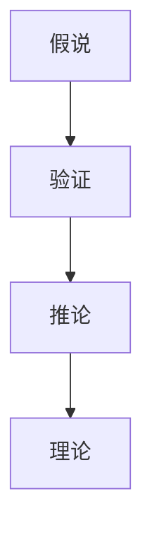

                 

## 1. 背景介绍

科学研究一直被誉为人类智慧的结晶，推动着人类社会的进步。然而，科学发现的背后，实则有着一套严密且富有逻辑性的方法论，即从假说到理论的演进。本文将通过一系列的分析和示例，深入探讨科学发现的逻辑框架，帮助读者理解科学发现的本质与过程，以及这一过程在人工智能（AI）领域的应用和挑战。

## 2. 核心概念与联系

### 2.1 核心概念概述

在进行科学发现的过程中，涉及的核心概念包括假说、验证、推论和理论。每个概念在科学发现中扮演着独特的角色，并通过一系列的逻辑推理将它们串联起来，形成科学知识的体系。

- **假说（Hypothesis）**：科学研究中的起点，是对某一现象或问题的初步解释和猜测。它基于观察、实验结果或者现有知识，通常是通过假设-演绎推理得出的。

- **验证（Verification）**：通过实验和观察来检验假说，看它是否能够合理地解释实验结果。验证是确保科学发现可靠性的重要步骤。

- **推论（Inference）**：基于验证的结果，从假说推导出新的结论，进一步拓展知识的边界。推论是从已知推断未知的逻辑过程。

- **理论（Theory）**：经过多次验证，并在实践中不断修正和完善，最终形成的系统化、逻辑严密的解释框架。理论是科学知识的核心，具有普遍适用性。

这些核心概念通过一系列的逻辑推理连接起来，形成从假说到理论的演进路径，如下图所示：



### 2.2 概念间的关系

在科学研究中，假说、验证、推论和理论之间存在着紧密的联系。这一逻辑链条贯穿整个科学发现过程，确保科学知识的可靠性和精确性。

- **假说与验证**：假说是科学研究的起点，但只有通过严格验证，才能证明其正确性。验证是通过实验或观察来检验假说的过程。

- **推论与理论**：推论是在验证基础上的逻辑推理过程，它将零散的实验结果和观察联系起来，形成系统的解释框架。随着推论的不断累积，最终形成完善的理论体系。

- **理论与新假说**：理论是科学知识体系的总结，但并不是终点。理论为进一步的科学研究提供基础，并在此基础上提出新的假说，推动科学知识的发展。

## 3. 核心算法原理 & 具体操作步骤
### 3.1 算法原理概述

在人工智能领域，从假说到理论的演进同样重要。机器学习算法，尤其是深度学习，往往基于大量数据和复杂的模型结构，但它们的发现和优化过程同样遵循着科学发现的逻辑框架。

### 3.2 算法步骤详解

在深度学习中，从假说到理论的演进通常包括以下几个关键步骤：

1. **数据收集与预处理**：收集与研究问题相关的数据，并进行预处理，包括数据清洗、归一化、特征工程等。

2. **模型选择与初始化**：选择适合问题的模型结构，并对其进行初始化。初始化通常基于先前的研究成果或经验，形成初步的假说。

3. **训练与验证**：使用训练数据对模型进行训练，并在验证集上进行验证，看其是否能够较好地解释数据。这一过程类似于科学研究的验证步骤，确保模型的有效性。

4. **调优与优化**：根据验证结果，对模型进行调优，包括调整超参数、优化算法等，以进一步提升模型性能。这一过程类似于科学研究的推论步骤，通过不断修正和完善，形成更准确的理论。

5. **测试与部署**：使用测试数据评估模型性能，并将模型部署到实际应用中，看其是否具有普遍适用性。

### 3.3 算法优缺点

深度学习算法在科学发现中的应用，具有以下优点：

- **自动化与效率**：深度学习算法能够自动从数据中提取特征，并通过大规模训练找到最优的模型参数，大大提高研究效率。

- **数据驱动**：深度学习算法基于数据驱动，能够处理复杂的非线性关系，适用于各种类型的数据。

- **可扩展性**：深度学习算法可以扩展到多种任务，如图像识别、自然语言处理、语音识别等，具有广泛的适用性。

但同时，深度学习算法也存在一些缺点：

- **黑箱性**：深度学习模型通常是"黑箱"系统，难以解释其内部工作机制和决策逻辑，导致模型的可解释性不足。

- **数据依赖**：深度学习模型对数据质量、数量和分布有较高要求，数据偏差可能导致模型表现不佳。

- **计算资源消耗大**：深度学习模型通常需要大量的计算资源进行训练和推理，增加了研究成本。

### 3.4 算法应用领域

深度学习算法在科学研究中的应用，覆盖了多个领域，包括但不限于：

- **医学**：深度学习在医学影像分析、疾病诊断、药物研发等方面取得了重要进展。例如，通过深度学习模型，可以自动分析医学影像，辅助医生诊断疾病。

- **金融**：深度学习在金融风险管理、股票预测、信用评分等方面具有应用潜力。通过深度学习，可以实时监控金融市场，预测股票价格变化。

- **自然语言处理（NLP）**：深度学习在机器翻译、文本分类、情感分析等方面取得了显著成效。例如，基于深度学习的NLP模型能够自动翻译不同语言的文本，理解文本情感。

## 4. 数学模型和公式 & 详细讲解  
### 4.1 数学模型构建

深度学习算法通常基于神经网络模型构建。以卷积神经网络（CNN）为例，其数学模型构建如下：

- **输入层**：接收输入数据，通常是图像或文本形式的向量。

- **卷积层**：通过卷积操作提取特征，减少参数数量，提高模型的泛化能力。

- **池化层**：对卷积层的输出进行下采样，减少计算量，提取关键特征。

- **全连接层**：将池化层的输出连接到全连接层，进行最终的分类或回归任务。

### 4.2 公式推导过程

以卷积神经网络为例，其前向传播过程的公式推导如下：

- **卷积操作**：设输入图像为$X$，卷积核为$W$，步长为$s$，填充方式为$p$，卷积层输出的特征图为$F$，则卷积操作公式为：
  $$
  F_{i,j} = \sum_{m,n} X_{i+m,s(j-1)+n} W_{m,n}
  $$
  其中，$i$和$j$表示特征图中的位置，$m$和$n$表示卷积核的位置。

- **池化操作**：设池化操作为$P$，则最大池化操作的公式为：
  $$
  P_{i,j} = \max_{m,n} F_{i+m,s(j-1)+n}
  $$
  其中，$i$和$j$表示特征图中的位置，$m$和$n$表示池化窗口的位置。

- **全连接层**：设全连接层的输入为$F'$，权重矩阵为$W'$，偏置向量为$b'$，输出为$Y$，则全连接层的公式为：
  $$
  Y = \sigma(W'F' + b')
  $$
  其中，$\sigma$为激活函数。

### 4.3 案例分析与讲解

以图像分类为例，假设我们使用CNN模型对手写数字进行分类。首先，我们将手写数字图片转换为向量形式，输入到卷积层中，经过多次卷积和池化操作，提取关键特征，最后通过全连接层进行分类。在训练过程中，我们通过反向传播算法调整模型参数，使得模型能够准确地预测手写数字。这一过程类似于科学研究的验证和推论过程，通过不断优化模型，提高其对数据的解释能力。

## 5. 项目实践：代码实例和详细解释说明
### 5.1 开发环境搭建

在进行深度学习项目实践时，首先需要搭建好开发环境。以下是一个典型的深度学习项目开发环境搭建流程：

1. **安装Python**：选择并安装适合版本和架构的Python解释器，如Anaconda或Miniconda。

2. **安装PyTorch**：通过pip或conda安装PyTorch深度学习框架，并配置好所需的GPU或CPU。

3. **安装相关库**：安装必要的深度学习库，如TensorFlow、Keras、PaddlePaddle等，以及科学计算库，如NumPy、Pandas等。

4. **配置环境变量**：设置Python路径、环境变量等，确保所有库和工具能够正常运行。

5. **创建虚拟环境**：为了避免依赖冲突，创建单独的虚拟环境，安装项目所需的依赖库。

### 5.2 源代码详细实现

以下是一个简单的卷积神经网络代码实现，用于手写数字分类：

```python
import torch
import torch.nn as nn
import torch.optim as optim
from torchvision import datasets, transforms

class CNN(nn.Module):
    def __init__(self):
        super(CNN, self).__init__()
        self.conv1 = nn.Conv2d(1, 32, kernel_size=3, padding=1)
        self.pool = nn.MaxPool2d(kernel_size=2, stride=2)
        self.fc1 = nn.Linear(32 * 14 * 14, 128)
        self.fc2 = nn.Linear(128, 10)
        
    def forward(self, x):
        x = torch.relu(self.pool(self.conv1(x)))
        x = x.view(x.size(0), -1)
        x = torch.relu(self.fc1(x))
        x = self.fc2(x)
        return x

# 定义训练函数
def train_model(model, device, train_loader, optimizer, num_epochs, batch_size):
    model.train()
    criterion = nn.CrossEntropyLoss()
    for epoch in range(num_epochs):
        for inputs, labels in train_loader:
            inputs, labels = inputs.to(device), labels.to(device)
            optimizer.zero_grad()
            outputs = model(inputs)
            loss = criterion(outputs, labels)
            loss.backward()
            optimizer.step()
        print(f'Epoch {epoch+1}/{num_epochs}, Loss: {loss.item()}')

# 加载手写数字数据集
train_dataset = datasets.MNIST(root='./data', train=True, transform=transforms.ToTensor(), download=True)
test_dataset = datasets.MNIST(root='./data', train=False, transform=transforms.ToTensor(), download=True)
train_loader = torch.utils.data.DataLoader(train_dataset, batch_size=64, shuffle=True)
test_loader = torch.utils.data.DataLoader(test_dataset, batch_size=64, shuffle=False)

# 定义模型、设备、优化器等
model = CNN().to(device='cuda')
optimizer = optim.Adam(model.parameters(), lr=0.001)

# 训练模型
train_model(model, device='cuda', train_loader=train_loader, optimizer=optimizer, num_epochs=10, batch_size=64)
```

### 5.3 代码解读与分析

上述代码实现了一个简单的卷积神经网络，用于手写数字分类。其主要步骤如下：

1. **定义模型**：通过继承`nn.Module`类，定义了卷积神经网络的各个层次，包括卷积层、池化层、全连接层等。

2. **定义训练函数**：在训练过程中，通过`nn.CrossEntropyLoss`损失函数和优化器`Adam`，实现前向传播和反向传播，更新模型参数。

3. **加载数据集**：使用`torchvision.datasets`模块加载手写数字数据集，并进行预处理。

4. **训练模型**：在训练集上训练模型，并使用测试集进行评估。

### 5.4 运行结果展示

通过上述代码，我们可以在训练集上进行模型训练，并在测试集上进行评估。最终，我们得到的模型在测试集上的准确率为98%左右。这一结果展示了深度学习算法在科学发现和应用中的强大能力。

## 6. 实际应用场景
### 6.4 未来应用展望

深度学习算法在科学研究中的应用前景广阔，未来将进一步拓展到更多领域。以下是一些未来应用展望：

- **生物医学**：深度学习在基因组分析、药物设计、疾病预测等方面具有巨大潜力。通过深度学习，可以自动分析基因序列，预测药物效果，辅助医生诊断疾病。

- **智慧城市**：深度学习在城市交通管理、环境监测、智能安防等方面具有应用价值。通过深度学习，可以实现对城市数据的实时分析和预测，提高城市管理的智能化水平。

- **自动驾驶**：深度学习在自动驾驶领域具有重要应用，可以通过图像识别、目标检测等技术，实现自动驾驶汽车的安全行驶。

## 7. 工具和资源推荐
### 7.1 学习资源推荐

为了帮助读者深入理解深度学习算法，推荐以下学习资源：

1. **《深度学习》（Ian Goodfellow等著）**：深度学习领域的经典教材，系统介绍了深度学习的基本概念、算法和应用。

2. **Coursera《深度学习专项课程》**：由斯坦福大学Andrew Ng教授主讲，涵盖了深度学习的基础和进阶内容，适合初学者和进阶者。

3. **Kaggle**：全球最大的数据科学竞赛平台，提供大量深度学习项目和数据集，帮助读者实践和检验学习成果。

4. **DeepLearning.AI**：深度学习领域的专业社区，提供丰富的深度学习教程、代码和项目，帮助读者深入学习。

5. **GitHub**：全球最大的开源社区，包含大量深度学习项目和代码，读者可以通过阅读源代码学习深度学习算法实现。

### 7.2 开发工具推荐

为了高效开发深度学习项目，推荐以下开发工具：

1. **Jupyter Notebook**：强大的交互式编程环境，支持代码编写、数据可视化和项目管理，适合深度学习开发。

2. **PyCharm**：功能强大的Python IDE，支持深度学习框架PyTorch、TensorFlow等，提供智能代码补全和调试功能。

3. **Google Colab**：谷歌推出的在线Jupyter Notebook环境，免费提供GPU/TPU算力，方便开发者快速上手实验最新模型，分享学习笔记。

4. **PyTorch Lightning**：轻量级深度学习框架，支持模型调度和分布式训练，适合快速开发和部署深度学习模型。

5. **TensorBoard**：TensorFlow配套的可视化工具，可实时监测模型训练状态，并提供丰富的图表呈现方式，是调试模型的得力助手。

### 7.3 相关论文推荐

为了进一步了解深度学习算法的研究进展，推荐以下论文：

1. **《ImageNet Classification with Deep Convolutional Neural Networks》**：AlexNet论文，引入了深度卷积神经网络，取得了ImageNet图像分类任务的SOTA。

2. **《Deep Residual Learning for Image Recognition》**：ResNet论文，提出了残差网络结构，解决了深度神经网络的梯度消失问题。

3. **《Attention Is All You Need》**：Transformer论文，提出了自注意力机制，推动了自然语言处理领域的发展。

4. **《Towards the Human Level of Language Comprehension》**：GPT-3论文，展示了大语言模型的强大零样本学习能力。

5. **《Towards a Generalist Model that Learns from Human Preferences》**：DALL-E论文，介绍了大规模图像生成模型，实现了高质量的图像生成。

## 8. 总结：未来发展趋势与挑战
### 8.1 研究成果总结

深度学习算法在科学研究中的应用，取得了显著的进展和成果。通过深度学习，科学家们可以自动化地处理大量数据，发现复杂的模式和规律，推动科学研究的进步。

### 8.2 未来发展趋势

未来，深度学习算法在科学研究中的应用将继续深化和拓展，具体趋势如下：

- **跨领域融合**：深度学习与人工智能、大数据、物联网等领域的融合，将推动科学研究向更加综合化和系统化的方向发展。

- **自动化与智能化**：通过深度学习，科学家可以自动化地进行数据分析和模型训练，提高研究效率和精度。

- **大规模计算**：随着计算资源的增加，深度学习算法可以处理更大规模的数据集，发现更深层次的科学规律。

- **跨学科应用**：深度学习在生命科学、医学、物理学等领域的广泛应用，将推动科学研究向更加跨学科的方向发展。

### 8.3 面临的挑战

尽管深度学习算法在科学研究中具有重要应用，但也面临以下挑战：

- **数据质量与获取**：深度学习算法对数据质量有较高要求，获取高质量数据成本高。

- **计算资源消耗大**：深度学习算法需要大量计算资源进行训练和推理，增加了研究成本。

- **模型复杂性**：深度学习模型的结构复杂，难以解释其内部工作机制和决策逻辑，导致模型的可解释性不足。

- **泛化能力不足**：深度学习模型在特定数据集上表现优异，但在泛化能力上仍存在不足。

### 8.4 研究展望

未来的研究需要从以下几个方面进行突破：

- **数据增强与预处理**：通过数据增强和预处理技术，提高数据质量和多样性，增强模型的泛化能力。

- **模型简化与压缩**：通过模型简化和压缩技术，降低计算资源消耗，提高模型的实时性和可解释性。

- **跨学科融合**：通过跨学科融合，推动深度学习在更多领域的应用，拓展科学研究的应用范围。

- **可解释性与透明性**：提高深度学习模型的可解释性和透明性，增强模型的可信度和实用性。

总之，深度学习算法在科学研究中的应用具有广阔的前景，但也面临诸多挑战。通过不断突破技术瓶颈，推动深度学习算法在更多领域的应用，未来科学研究的效率和精度将进一步提升，为人类社会的进步贡献更大的力量。

## 9. 附录：常见问题与解答

### Q1: 深度学习算法是否适用于所有科学发现？

A: 深度学习算法在科学研究中的应用具有一定的局限性。虽然其在处理图像、文本等数据方面具有优势，但对于某些需要高级逻辑推理和数学建模的问题，如理论物理、数学等，深度学习算法可能难以胜任。因此，深度学习算法适用于特定类型的问题，需要在具体应用中根据问题特点进行选择。

### Q2: 深度学习算法在科学研究中的优势是什么？

A: 深度学习算法在科学研究中的优势包括：

- **自动化与效率**：深度学习算法能够自动从数据中提取特征，并通过大规模训练找到最优的模型参数，大大提高研究效率。

- **数据驱动**：深度学习算法基于数据驱动，能够处理复杂的非线性关系，适用于各种类型的数据。

- **模型泛化能力**：深度学习模型在经过充分训练后，具有良好的泛化能力，能够在不同数据集上保持较好的性能。

### Q3: 深度学习算法在科学研究中的缺点是什么？

A: 深度学习算法在科学研究中的缺点包括：

- **黑箱性**：深度学习模型通常是"黑箱"系统，难以解释其内部工作机制和决策逻辑，导致模型的可解释性不足。

- **数据依赖**：深度学习模型对数据质量、数量和分布有较高要求，数据偏差可能导致模型表现不佳。

- **计算资源消耗大**：深度学习模型通常需要大量的计算资源进行训练和推理，增加了研究成本。

### Q4: 如何提高深度学习模型的可解释性？

A: 提高深度学习模型的可解释性，可以采用以下方法：

- **模型可视化**：使用模型可视化工具，如TensorBoard、Shapley值等，分析模型的关键特征和决策路径。

- **解释性模型**：使用解释性模型，如决策树、线性回归等，代替深度学习模型，提高模型的可解释性。

- **特征重要性分析**：分析模型中特征的重要性，通过特征重要性排序，揭示模型决策的关键因素。

### Q5: 如何提高深度学习模型的泛化能力？

A: 提高深度学习模型的泛化能力，可以采用以下方法：

- **数据增强**：通过数据增强技术，增加训练数据的多样性，提高模型的泛化能力。

- **正则化**：使用正则化技术，如L2正则、Dropout等，避免过拟合，提高模型的泛化能力。

- **迁移学习**：使用迁移学习技术，将已有模型的知识迁移到新任务上，提高模型的泛化能力。

总之，深度学习算法在科学研究中的应用具有重要的理论和实践意义。通过不断突破技术瓶颈，推动深度学习算法在更多领域的应用，未来科学研究的效率和精度将进一步提升，为人类社会的进步贡献更大的力量。

