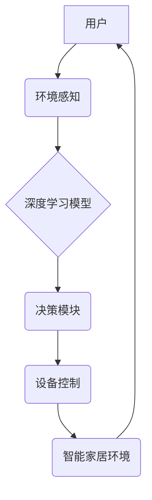

## AI人工智能深度学习算法：智能深度学习代理在智能家居场景中的应用

> 关键词：深度学习、智能家居、代理、强化学习、自然语言处理、计算机视觉、预测建模

## 1. 背景介绍

智能家居已成为现代生活的重要组成部分，它通过将各种智能设备连接起来，实现自动化控制、远程管理和个性化服务，为用户带来更加便捷舒适的生活体验。深度学习作为人工智能领域最前沿的技术之一，在智能家居场景中发挥着越来越重要的作用。

传统的智能家居系统通常依赖于规则引擎或有限状态机，难以应对复杂多变的场景和用户需求。深度学习算法能够从海量数据中学习模式和规律，实现更智能、更灵活的控制和服务。例如，深度学习可以用于图像识别，识别用户的身份和意图，从而实现个性化控制；可以用于语音识别，理解用户的自然语言指令，实现更便捷的交互；可以用于预测建模，预测用户的行为模式，提前提供服务。

## 2. 核心概念与联系

智能家居中的深度学习代理是一个能够自主学习、决策和执行任务的智能实体。它通过深度学习算法，从环境感知数据中学习用户行为模式、设备状态和场景信息，并根据学习到的知识，做出最优的控制决策，实现智能家居的自动化和个性化服务。

**智能家居深度学习代理架构**



**核心概念原理和架构**

* **环境感知:** 智能家居代理需要感知周围环境的信息，例如用户的行为、设备状态、时间、天气等。这可以通过传感器、摄像头、麦克风等设备获取。
* **深度学习模型:** 深度学习模型是智能家居代理的核心，它负责从环境感知数据中学习用户行为模式、设备状态和场景信息。常见的深度学习模型包括卷积神经网络（CNN）、循环神经网络（RNN）和强化学习算法等。
* **决策模块:** 决策模块根据深度学习模型的输出，做出最优的控制决策，例如调节灯光、温度、窗帘等。
* **设备控制:** 设备控制模块将决策模块的指令发送到相应的智能设备，实现自动化控制。

## 3. 核心算法原理 & 具体操作步骤

### 3.1  算法原理概述

智能家居深度学习代理通常采用强化学习算法进行训练。强化学习是一种机器学习方法，它通过奖励机制来训练智能体，使其在特定环境中做出最优决策。

在智能家居场景中，智能代理可以看作是一个智能体，环境感知数据可以看作是环境状态，设备控制指令可以看作是智能体的动作，用户反馈（例如舒适度、满意度）可以看作是奖励信号。通过不断地与环境交互，智能代理学习到最优的控制策略，从而实现智能家居的自动化和个性化服务。

### 3.2  算法步骤详解

1. **环境建模:** 建立智能家居环境的数学模型，包括用户行为、设备状态、场景信息等。
2. **奖励函数设计:** 设计一个奖励函数，根据用户反馈和环境状态，为智能代理的行为分配奖励。
3. **策略网络训练:** 使用强化学习算法，例如深度Q网络（DQN）或策略梯度算法，训练一个策略网络，该网络能够根据环境状态预测最优的控制动作。
4. **代理执行动作:** 智能代理根据策略网络的输出，执行相应的设备控制指令。
5. **环境反馈:** 环境反馈用户对智能代理行为的评价，例如舒适度、满意度等。
6. **更新奖励信号:** 根据用户反馈，更新奖励信号，并反馈给策略网络。
7. **重复步骤4-6:** 智能代理不断地与环境交互，学习最优的控制策略。

### 3.3  算法优缺点

**优点:**

* **自主学习:** 深度学习代理能够从数据中学习，无需人工编程，可以适应复杂多变的场景。
* **个性化服务:** 深度学习代理可以根据用户的行为模式和偏好，提供个性化的服务。
* **持续优化:** 深度学习代理可以不断地学习和优化，提高控制效率和服务质量。

**缺点:**

* **数据依赖:** 深度学习代理需要大量的训练数据，否则难以学习到有效的控制策略。
* **计算资源:** 深度学习模型训练需要大量的计算资源，部署成本较高。
* **安全风险:** 深度学习代理可能存在安全风险，例如被攻击或滥用。

### 3.4  算法应用领域

强化学习算法在智能家居场景中的应用领域非常广泛，例如：

* **智能照明:** 根据用户的活动模式和环境光线，自动调节灯光亮度和颜色。
* **智能温度控制:** 根据用户的温度偏好和环境温度，自动调节空调温度。
* **智能家居安全:** 通过图像识别和行为分析，检测异常情况，提高家居安全。
* **智能语音助手:** 理解用户的自然语言指令，执行相应的控制操作。

## 4. 数学模型和公式 & 详细讲解 & 举例说明

### 4.1  数学模型构建

智能家居深度学习代理的数学模型通常基于马尔可夫决策过程（MDP）。MDP是一个描述智能体与环境交互的数学框架，它包含以下几个要素：

* **状态空间 (S):** 智能家居环境的所有可能状态，例如用户位置、设备状态、时间等。
* **动作空间 (A):** 智能体可以执行的所有动作，例如调节灯光、温度、窗帘等。
* **转移概率 (P):** 从一个状态到另一个状态的概率，取决于智能体的动作。
* **奖励函数 (R):** 为智能体的动作分配奖励，例如用户满意度、舒适度等。
* **折扣因子 (γ):** 权衡未来奖励和当前奖励的比例。

### 4.2  公式推导过程

强化学习的目标是找到一个最优策略 π，该策略能够使智能体在 MDP 环境中获得最大的累积奖励。最优策略可以通过动态规划或蒙特卡罗方法来求解。

**Bellman 方程:**

$$
V^{\pi}(s) = \max_{a \in A} \left[ R(s, a) + \gamma \sum_{s' \in S} P(s' | s, a) V^{\pi}(s') \right]
$$

其中：

* $V^{\pi}(s)$ 是状态 $s$ 下按照策略 $\pi$ 的价值函数。
* $R(s, a)$ 是在状态 $s$ 执行动作 $a$ 得到的奖励。
* $P(s' | s, a)$ 是从状态 $s$ 执行动作 $a$ 转移到状态 $s'$ 的概率。
* $\gamma$ 是折扣因子。

### 4.3  案例分析与讲解

例如，在智能照明场景中，智能代理的目标是根据用户的活动模式和环境光线，自动调节灯光亮度。

* 状态空间：用户位置、环境光线强度、时间等。
* 动作空间：调节灯光亮度、颜色等。
* 转移概率：用户位置和环境光线强度变化的概率。
* 奖励函数：用户对灯光亮度的满意度。

通过训练深度学习模型，智能代理可以学习到最优的灯光控制策略，例如在用户靠近时，自动提高灯光亮度；在用户离开时，自动降低灯光亮度；在环境光线较暗时，自动提高灯光亮度等。

## 5. 项目实践：代码实例和详细解释说明

### 5.1  开发环境搭建

* **操作系统:** Ubuntu 18.04 或更高版本
* **编程语言:** Python 3.6 或更高版本
* **深度学习框架:** TensorFlow 或 PyTorch
* **其他依赖:** NumPy、Pandas、Matplotlib 等

### 5.2  源代码详细实现

```python
# 导入必要的库
import tensorflow as tf

# 定义深度Q网络模型
class DQN(tf.keras.Model):
    def __init__(self, state_size, action_size):
        super(DQN, self).__init__()
        self.dense1 = tf.keras.layers.Dense(64, activation='relu')
        self.dense2 = tf.keras.layers.Dense(32, activation='relu')
        self.output = tf.keras.layers.Dense(action_size)

    def call(self, state):
        x = self.dense1(state)
        x = self.dense2(x)
        return self.output(x)

# 定义强化学习环境
class SmartHomeEnv:
    #...

# 创建深度Q网络模型和强化学习环境
model = DQN(state_size, action_size)
env = SmartHomeEnv()

# 训练深度Q网络模型
#...

# 使用训练好的模型进行控制
#...
```

### 5.3  代码解读与分析

* **深度Q网络模型:** 代码中定义了一个深度Q网络模型，它包含两层全连接层和一个输出层。输出层的大小等于动作空间的大小，每个输出值代表执行相应动作的价值。
* **强化学习环境:** 代码中定义了一个智能家居环境类，它包含状态空间、动作空间、转移概率和奖励函数等信息。
* **训练过程:** 训练过程使用强化学习算法，例如DQN算法，通过与环境交互，学习最优的控制策略。
* **控制过程:** 训练完成后，可以使用训练好的模型进行控制。根据当前环境状态，模型会预测执行每个动作的价值，并选择价值最高的动作进行执行。

### 5.4  运行结果展示

训练好的深度Q网络模型可以用于控制智能家居设备，例如自动调节灯光亮度、温度等。运行结果可以展示智能代理在不同场景下的控制效果，例如用户活动模式、环境光线强度等。

## 6. 实际应用场景

### 6.1  智能照明

智能照明系统可以根据用户的活动模式和环境光线，自动调节灯光亮度和颜色，提高照明效率和舒适度。例如，当用户靠近时，灯光会自动变亮；当用户离开时，灯光会自动变暗。

### 6.2  智能温度控制

智能温度控制系统可以根据用户的温度偏好和环境温度，自动调节空调温度，提高能源效率和舒适度。例如，当用户设定温度为25度时，系统会自动调节空调温度，保持室内温度在25度左右。

### 6.3  智能家居安全

智能家居安全系统可以利用图像识别和行为分析技术，检测异常情况，提高家居安全。例如，当系统检测到陌生人进入家中时，会自动报警。

### 6.4  未来应用展望

随着深度学习技术的不断发展，智能家居代理的应用场景将会更加广泛，例如：

* **个性化服务:** 智能代理可以根据用户的个人喜好和需求，提供更加个性化的服务，例如推荐合适的音乐、电影、书籍等。
* **主动预测:** 智能代理可以根据用户的行为模式和环境信息，主动预测用户的需求，并提前提供服务，例如提醒用户出门前关灯、锁门等。
* **协同控制:** 多个智能代理可以协同工作，实现更加复杂的控制任务，例如家庭娱乐系统、智能医疗系统等。

## 7. 工具和资源推荐

### 7.1  学习资源推荐

* **书籍:**
    * 深度学习
    * 强化学习
    * 人工智能
* **在线课程:**
    * Coursera
    * edX
    * Udacity
* **博客和论坛:**
    * TensorFlow Blog
    * PyTorch Blog
    * Reddit

### 7.2  开发工具推荐

* **深度学习框架:** TensorFlow, PyTorch
* **编程语言:** Python
* **云平台:** AWS, Azure, GCP

### 7.3  相关论文推荐

* Deep Reinforcement Learning for Smart Home Automation
* A Survey of Deep Reinforcement Learning for Robotics
* Deep Learning for Smart Environments

## 8. 总结