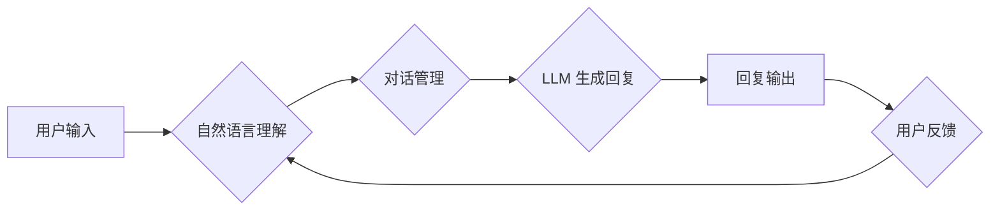

## LLM-based Chatbot System Architecture

> 关键词：大型语言模型 (LLM)、聊天机器人、系统架构、自然语言处理 (NLP)、对话流、知识图谱、推理引擎、用户体验

## 1. 背景介绍

近年来，大型语言模型 (LLM) 的快速发展为聊天机器人领域带来了革命性的变革。LLM 拥有强大的文本生成、理解和翻译能力，使得聊天机器人能够进行更自然、更流畅的对话，并提供更丰富的服务。

传统的聊天机器人通常依赖于规则驱动的对话流程和有限的知识库，难以应对复杂、开放式的用户提问。而基于 LLM 的聊天机器人能够学习和理解用户意图，并根据上下文生成更精准、更符合语境的回复。

随着 LLM 技术的成熟，基于 LLM 的聊天机器人系统架构也逐渐完善，并呈现出以下趋势：

* **模型规模化:** LLM 模型规模不断扩大，参数量增加，模型能力不断提升。
* **多模态交互:** 聊天机器人开始支持多模态交互，例如文本、语音、图像等，提供更丰富的用户体验。
* **个性化定制:** 聊天机器人能够根据用户的个性化需求进行定制，提供更精准、更贴心的服务。
* **知识图谱融合:** 聊天机器人开始与知识图谱相结合，能够提供更准确、更全面的信息查询服务。

## 2. 核心概念与联系

### 2.1  核心概念

* **大型语言模型 (LLM):** 训练数据量巨大，参数量庞大的深度学习模型，能够理解和生成人类语言。
* **聊天机器人:**  能够与人类进行自然语言交互的智能系统。
* **对话流:** 聊天机器人与用户进行对话的流程和规则。
* **自然语言处理 (NLP):**  使计算机能够理解、处理和生成人类语言的技术领域。
* **知识图谱:**  结构化存储和表示知识的图数据库。

### 2.2  架构流程图



## 3. 核心算法原理 & 具体操作步骤

### 3.1  算法原理概述

基于 LLM 的聊天机器人主要依赖于以下核心算法：

* **Transformer:**  一种新型的深度学习架构，能够有效捕捉文本序列中的长距离依赖关系，是 LLM 模型的基础。
* **自回归语言模型:**  一种预测下一个词的概率分布的模型，能够生成流畅、连贯的文本。
* **注意力机制:**  一种能够学习文本中重要信息的机制，能够帮助模型更好地理解用户意图。

### 3.2  算法步骤详解

1. **用户输入:** 用户向聊天机器人发送文本输入。
2. **自然语言理解:** 使用 NLP 技术对用户输入进行分析，识别用户意图、实体和关系。
3. **对话管理:** 根据用户意图和对话上下文，选择合适的回复策略和对话流。
4. **LLM 生成回复:** 使用预训练的 LLM 模型，根据对话上下文生成符合语境的回复文本。
5. **回复输出:** 将生成的回复文本发送给用户。
6. **用户反馈:** 用户对回复进行评价，反馈信息用于模型训练和优化。

### 3.3  算法优缺点

**优点:**

* **自然流畅的对话:**  LLM 能够生成更自然、更流畅的文本，提升用户体验。
* **强大的理解能力:**  LLM 可以理解复杂的语言结构和用户意图，提供更精准的回复。
* **可扩展性强:**  LLM 模型可以根据需要进行微调和扩展，适应不同的应用场景。

**缺点:**

* **训练成本高:**  LLM 模型训练需要大量的计算资源和数据。
* **可能产生偏差:**  LLM 模型的训练数据可能存在偏差，导致模型输出存在偏见。
* **缺乏真实世界知识:**  LLM 模型的知识主要来自训练数据，缺乏对真实世界事件的实时更新。

### 3.4  算法应用领域

* **客服机器人:**  自动处理客户咨询、订单查询等常见问题。
* **教育机器人:**  提供个性化学习辅导、知识问答等服务。
* **娱乐机器人:**  进行聊天、游戏、故事创作等娱乐活动。
* **写作辅助工具:**  帮助用户撰写文章、邮件、代码等文本。

## 4. 数学模型和公式 & 详细讲解 & 举例说明

### 4.1  数学模型构建

LLM 模型通常采用 Transformer 架构，其核心是注意力机制和多头注意力机制。

**注意力机制:**  注意力机制能够学习文本中重要信息的权重，并根据这些权重对文本进行加权求和，从而更好地理解文本语义。

**公式:**

$$
Attention(Q, K, V) = softmax(\frac{QK^T}{\sqrt{d_k}})V
$$

其中：

* $Q$: 查询矩阵
* $K$: 键矩阵
* $V$: 值矩阵
* $d_k$: 键向量的维度
* $softmax$:  softmax 函数

**多头注意力机制:**  多头注意力机制通过并行计算多个注意力头，并对这些注意力头的输出进行融合，能够捕捉到文本中更丰富的语义信息。

### 4.2  公式推导过程

注意力机制的公式推导过程如下：

1. 计算查询矩阵 $Q$ 和键矩阵 $K$ 的点积，并进行归一化处理。
2. 应用 softmax 函数对点积结果进行归一化，得到每个词对其他词的注意力权重。
3. 将注意力权重与值矩阵 $V$ 进行加权求和，得到最终的注意力输出。

### 4.3  案例分析与讲解

例如，在翻译句子 "The cat sat on the mat" 时，注意力机制可以帮助模型关注 "cat" 和 "sat" 之间的语义关系，从而更好地理解句子含义。

## 5. 项目实践：代码实例和详细解释说明

### 5.1  开发环境搭建

* Python 3.7+
* PyTorch 或 TensorFlow
* Hugging Face Transformers 库

### 5.2  源代码详细实现

```python
from transformers import AutoModelForCausalLM, AutoTokenizer

# 加载预训练模型和词典
model_name = "gpt2"
tokenizer = AutoTokenizer.from_pretrained(model_name)
model = AutoModelForCausalLM.from_pretrained(model_name)

# 用户输入
user_input = "Hello, how are you?"

# Token化用户输入
input_ids = tokenizer.encode(user_input, return_tensors="pt")

# 生成回复
output = model.generate(input_ids, max_length=50)

# 解码回复
response = tokenizer.decode(output[0], skip_special_tokens=True)

# 打印回复
print(response)
```

### 5.3  代码解读与分析

* 使用 Hugging Face Transformers 库加载预训练的 GPT-2 模型和词典。
* 对用户输入进行 Token 化，将文本转换为模型可以理解的数字表示。
* 使用模型的 `generate` 方法生成回复文本。
* 使用词典解码回复文本，将其转换为人类可读的文本。

### 5.4  运行结果展示

```
I am an AI language model, so I do not have feelings or experiences like humans do. However, I am here to assist you with any questions or tasks you may have.
```

## 6. 实际应用场景

### 6.1  客服机器人

基于 LLM 的客服机器人能够自动处理客户咨询、订单查询、退换货等常见问题，提高客服效率，降低人工成本。

### 6.2  教育机器人

LLM 能够理解和生成自然语言，可以用于开发教育机器人，提供个性化学习辅导、知识问答、练习批改等服务，提升学习效率。

### 6.3  娱乐机器人

LLM 可以用于开发娱乐机器人，进行聊天、游戏、故事创作等娱乐活动，为用户提供更丰富多彩的体验。

### 6.4  未来应用展望

随着 LLM 技术的不断发展，其应用场景将更加广泛，例如：

* **个性化推荐:**  根据用户的兴趣爱好和行为数据，提供个性化的商品、服务和内容推荐。
* **自动写作:**  帮助用户自动生成各种类型的文本，例如文章、邮件、代码等。
* **跨语言沟通:**  实现不同语言之间的实时翻译，打破语言障碍。

## 7. 工具和资源推荐

### 7.1  学习资源推荐

* **Hugging Face Transformers:** https://huggingface.co/docs/transformers/index
* **OpenAI GPT-3 API:** https://openai.com/api/
* **Stanford NLP Group:** https://nlp.stanford.edu/

### 7.2  开发工具推荐

* **PyTorch:** https://pytorch.org/
* **TensorFlow:** https://www.tensorflow.org/
* **Jupyter Notebook:** https://jupyter.org/

### 7.3  相关论文推荐

* **Attention Is All You Need:** https://arxiv.org/abs/1706.03762
* **BERT: Pre-training of Deep Bidirectional Transformers for Language Understanding:** https://arxiv.org/abs/1810.04805
* **GPT-3: Language Models are Few-Shot Learners:** https://arxiv.org/abs/2005.14165

## 8. 总结：未来发展趋势与挑战

### 8.1  研究成果总结

基于 LLM 的聊天机器人系统架构取得了显著进展，模型能力不断提升，应用场景不断拓展。

### 8.2  未来发展趋势

* **模型规模化:**  LLM 模型规模将继续扩大，模型能力将进一步提升。
* **多模态交互:**  聊天机器人将支持多模态交互，例如文本、语音、图像等。
* **个性化定制:**  聊天机器人将更加个性化，能够根据用户的需求进行定制。
* **知识图谱融合:**  聊天机器人将与知识图谱相结合，提供更准确、更全面的信息查询服务。

### 8.3  面临的挑战

* **训练成本高:**  LLM 模型训练需要大量的计算资源和数据。
* **可能产生偏差:**  LLM 模型的训练数据可能存在偏差，导致模型输出存在偏见。
* **缺乏真实世界知识:**  LLM 模型的知识主要来自训练数据，缺乏对真实世界事件的实时更新。

### 8.4  研究展望

未来研究将重点关注以下方面：

* **降低训练成本:**  探索新的训练方法和模型架构，降低 LLM 模型训练成本。
* **解决模型偏差问题:**  开发新的数据预处理和模型训练方法，减少模型输出的偏差。
* **增强模型的知识更新能力:**  研究如何将实时信息和知识图谱与 LLM 模型相结合，增强模型的知识更新能力。

## 9. 附录：常见问题与解答

### 9.1  常见问题

* **LLM 模型的训练数据是什么？**

LLM 模型的训练数据通常来自公开的文本数据集，例如书籍、文章、网站等。

* **LLM 模型可以理解用户的情感吗？**

LLM 模型可以识别文本中的情感倾向，但不能真正理解用户的感受。

* **LLM 模型会产生虚假信息吗？**

LLM 模型可能会生成虚假信息，因为其训练数据中可能存在错误或不准确的信息。

### 9.2  解答

* **LLM 模型的训练数据需要经过严格的筛选和清洗，以减少虚假信息的影响。**
* **在使用 LLM 模型生成文本时，需要进行人工审核，以确保文本的准确性和可靠性。**
* **LLM 模型是一个不断发展的技术，未来将会有更多方法来提高其准确性和