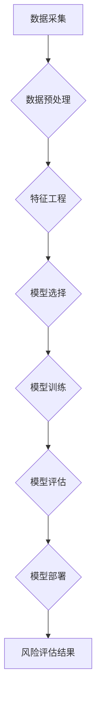

## Python机器学习实战：机器学习在金融风险评估中的应用

> 关键词：机器学习、金融风险评估、Python、模型构建、风险预测、数据分析、算法原理、实践案例

## 1. 背景介绍

金融风险评估是金融机构的核心业务之一，旨在识别、量化和管理各种金融风险，保障金融机构的稳定运营和客户利益。传统风险评估方法主要依赖于经验和专家判断，存在主观性强、难以捕捉复杂风险关系等问题。近年来，机器学习技术在金融领域得到广泛应用，为金融风险评估提供了新的思路和方法。

机器学习算法能够从海量数据中自动学习风险模式，提高风险识别和预测的准确性。其强大的数据处理能力和模式识别能力，能够帮助金融机构更全面、更精准地评估各种风险，例如信用风险、市场风险、操作风险等。

## 2. 核心概念与联系

**2.1 核心概念**

* **金融风险评估:**  金融机构识别、量化和管理各种金融风险的过程，旨在降低风险敞口，保障机构稳定运营和客户利益。
* **机器学习:** 一种人工智能技术，通过算法训练，使计算机能够从数据中学习，并根据学习到的知识进行预测或决策。
* **数据分析:**  从数据中提取有价值信息的过程，包括数据清洗、数据挖掘、数据可视化等。

**2.2 架构图**



**2.3 联系**

金融风险评估的核心是识别和预测风险。机器学习技术通过数据分析，学习风险模式，并构建预测模型，从而实现对金融风险的识别和预测。

## 3. 核心算法原理 & 具体操作步骤

**3.1 算法原理概述**

机器学习算法在金融风险评估中应用广泛，常见的算法包括：

* **逻辑回归:** 用于二分类问题，例如判断客户是否会违约。
* **支持向量机:** 用于分类和回归问题，能够处理高维数据。
* **决策树:** 用于分类和回归问题，易于理解和解释。
* **随机森林:** 结合多个决策树，提高预测精度。
* **梯度提升树:** 通过迭代训练多个决策树，不断提升预测精度。
* **神经网络:** 能够学习复杂非线性关系，适用于大规模数据分析。

**3.2 算法步骤详解**

以逻辑回归为例，其具体操作步骤如下：

1. **数据采集:** 收集相关金融数据，例如客户信用评分、收入、负债等。
2. **数据预处理:** 清洗数据，处理缺失值，标准化数据。
3. **特征工程:** 选择和提取重要的特征，例如客户年龄、工作年限、贷款金额等。
4. **模型训练:** 使用训练数据训练逻辑回归模型，学习风险预测关系。
5. **模型评估:** 使用测试数据评估模型性能，例如准确率、召回率、F1-score等。
6. **模型部署:** 将训练好的模型部署到生产环境，用于预测新的风险。

**3.3 算法优缺点**

* **优点:** 
    * 易于理解和实现。
    * 计算效率高。
    * 可解释性强。
* **缺点:** 
    * 难以处理复杂非线性关系。
    * 对特征工程要求较高。

**3.4 算法应用领域**

* **信用风险评估:** 判断客户是否会违约。
* **市场风险评估:** 评估投资组合的市场波动风险。
* **操作风险评估:** 评估内部控制和流程风险。

## 4. 数学模型和公式 & 详细讲解 & 举例说明

**4.1 数学模型构建**

逻辑回归模型的数学模型如下：

$$
P(Y=1|X) = \frac{1}{1 + e^{-(w^T X + b)}}
$$

其中：

* $P(Y=1|X)$ 是给定特征 $X$ 时，目标变量 $Y$ 为 1 的概率。
* $w$ 是模型参数向量。
* $X$ 是特征向量。
* $b$ 是模型偏置项。
* $e$ 是自然对数的底数。

**4.2 公式推导过程**

逻辑回归模型的推导过程基于最大似然估计。

**4.3 案例分析与讲解**

假设我们想要预测客户是否会违约，特征包括客户的信用评分、收入和负债。我们可以使用逻辑回归模型训练一个预测模型。

训练完成后，我们可以使用模型预测新的客户是否会违约。例如，如果一个客户的信用评分为 700，收入为 50,000 美元，负债为 10,000 美元，模型可能会预测其违约概率为 10%。

## 5. 项目实践：代码实例和详细解释说明

**5.1 开发环境搭建**

* Python 3.x
* scikit-learn 库
* pandas 库
* matplotlib 库

**5.2 源代码详细实现**

```python
import pandas as pd
from sklearn.linear_model import LogisticRegression
from sklearn.model_selection import train_test_split
from sklearn.metrics import accuracy_score

# 加载数据
data = pd.read_csv('credit_risk_data.csv')

# 选择特征和目标变量
features = ['credit_score', 'income', 'debt']
target = 'default'

# 数据分割
X_train, X_test, y_train, y_test = train_test_split(data[features], data[target], test_size=0.2, random_state=42)

# 训练模型
model = LogisticRegression()
model.fit(X_train, y_train)

# 模型预测
y_pred = model.predict(X_test)

# 模型评估
accuracy = accuracy_score(y_test, y_pred)
print(f'模型准确率: {accuracy}')
```

**5.3 代码解读与分析**

* 首先，我们加载数据，选择特征和目标变量。
* 然后，我们将数据分割成训练集和测试集。
* 接着，我们训练一个逻辑回归模型，并使用测试集评估模型性能。
* 最后，我们打印模型的准确率。

**5.4 运行结果展示**

运行代码后，会输出模型的准确率。

## 6. 实际应用场景

机器学习在金融风险评估中的应用场景广泛，例如：

* **信用风险评估:** 银行可以使用机器学习模型评估客户的信用风险，决定是否授予贷款，以及贷款的利率和期限。
* **市场风险评估:** 投资机构可以使用机器学习模型评估投资组合的市场风险，例如股票价格波动风险、利率风险等。
* **操作风险评估:** 金融机构可以使用机器学习模型评估内部控制和流程风险，例如欺诈风险、系统风险等。

**6.4 未来应用展望**

随着机器学习技术的不断发展，其在金融风险评估中的应用将更加广泛和深入。未来，机器学习可能在以下方面发挥更大的作用：

* **更精准的风险预测:** 利用更先进的机器学习算法和更丰富的金融数据，提高风险预测的准确性。
* **更全面的风险管理:** 将机器学习与其他风险管理工具结合，实现更全面的风险管理。
* **更个性化的风险服务:** 根据客户的个体特征，提供更个性化的风险服务。

## 7. 工具和资源推荐

**7.1 学习资源推荐**

* **书籍:**
    * 《Python机器学习实战》
    * 《机器学习》
* **在线课程:**
    * Coursera 上的机器学习课程
    * edX 上的机器学习课程

**7.2 开发工具推荐**

* **Python:** 
    * scikit-learn 库
    * pandas 库
    * matplotlib 库
* **其他工具:**
    * Jupyter Notebook
    * TensorFlow
    * PyTorch

**7.3 相关论文推荐**

* **金融风险评估中的机器学习应用:**
    * [Machine Learning for Credit Risk Assessment](https://www.sciencedirect.com/science/article/pii/S092577611830039X)
    * [A Survey of Machine Learning Techniques for Financial Risk Management](https://www.researchgate.net/publication/329911310_A_Survey_of_Machine_Learning_Techniques_for_Financial_Risk_Management)

## 8. 总结：未来发展趋势与挑战

**8.1 研究成果总结**

机器学习技术在金融风险评估领域取得了显著成果，能够提高风险识别和预测的准确性，帮助金融机构更好地管理风险。

**8.2 未来发展趋势**

* **模型复杂度提升:** 利用更复杂的机器学习算法，例如深度学习，提高风险预测的精度。
* **数据融合:** 将来自不同来源的金融数据融合，构建更全面的风险模型。
* **解释性增强:** 开发更具解释性的机器学习模型，帮助金融机构更好地理解风险预测结果。

**8.3 面临的挑战**

* **数据质量:** 机器学习模型的性能依赖于数据质量，金融数据往往存在噪声、缺失值等问题。
* **模型可解释性:** 一些复杂的机器学习模型难以解释，这可能会阻碍金融机构的决策。
* **监管合规:** 机器学习模型的应用需要符合相关监管要求，例如公平性、透明度等。

**8.4 研究展望**

未来，机器学习在金融风险评估领域将继续发展，并与其他技术融合，例如区块链、云计算等，为金融行业带来更多创新和价值。

## 9. 附录：常见问题与解答

**9.1 如何处理金融数据中的缺失值？**

常见的方法包括：删除缺失值的行或列，使用均值或中位数填充缺失值，使用机器学习算法进行缺失值预测。

**9.2 如何选择合适的机器学习算法？**

需要根据具体问题和数据特点选择合适的算法。例如，对于二分类问题，可以考虑逻辑回归、支持向量机等算法；对于回归问题，可以考虑线性回归、决策树等算法。

**9.3 如何评估机器学习模型的性能？**

常用的评估指标包括准确率、召回率、F1-score、AUC等。

**9.4 如何确保机器学习模型的公平性？**

需要关注模型训练数据中的偏差，并使用公平性评估指标来衡量模型的公平性。

作者：禅与计算机程序设计艺术 / Zen and the Art of Computer Programming


