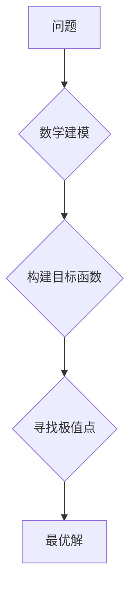

## 像数学家一样思考：极值原理

> 关键词：极值原理、优化算法、数学建模、机器学习、深度学习、梯度下降、凸优化

### 1. 背景介绍

在现代科技的蓬勃发展中，数据分析和优化问题无处不在。从推荐系统到自动驾驶，从药物研发到金融预测，我们都需要找到最优解，最大化效益，最小化成本。而“极值原理”作为一种强大的数学工具，为解决这些问题提供了坚实的基础。

极值原理的核心思想是：许多自然现象和工程问题都可以用寻找函数的极值来描述。例如，一个物体在重力作用下的稳定位置对应着其势能的极小值，而一个生产过程的成本最小化问题则对应着成本函数的极小值。

### 2. 核心概念与联系

极值原理的核心概念是**函数的极值点**。极值点是指函数在该点处达到最大值或最小值。

**极值原理的应用场景**

* **优化问题:** 寻找最优解，例如最小化成本、最大化利润、优化资源分配等。
* **物理学:** 描述物体运动的轨迹、稳定状态等。
* **经济学:** 分析市场均衡、资源配置等。
* **机器学习:** 训练模型参数，寻找最优的模型结构。

**Mermaid 流程图**



### 3. 核心算法原理 & 具体操作步骤

#### 3.1 算法原理概述

**梯度下降法**是寻找函数极值点的一种经典算法。其原理是通过不断迭代地更新参数，朝着函数梯度的负方向移动，最终找到函数的极小值点。

#### 3.2 算法步骤详解

1. **初始化参数:** 随机选择一个初始参数值。
2. **计算梯度:** 计算目标函数对参数的梯度。梯度表示函数变化的方向和大小。
3. **更新参数:** 根据梯度方向和学习率，更新参数值。学习率控制着每次更新的步长。
4. **重复步骤2-3:** 重复计算梯度和更新参数，直到达到收敛条件，例如梯度值小于某个阈值。

#### 3.3 算法优缺点

**优点:**

* 算法简单易懂，易于实现。
* 适用于各种类型的函数，包括非凸函数。

**缺点:**

* 容易陷入局部最优解。
* 收敛速度可能较慢。

#### 3.4 算法应用领域

* **机器学习:** 训练神经网络、支持向量机等模型。
* **深度学习:** 训练深度神经网络，例如卷积神经网络、循环神经网络等。
* **优化问题:** 解决各种优化问题，例如线性规划、非线性规划等。

### 4. 数学模型和公式 & 详细讲解 & 举例说明

#### 4.1 数学模型构建

假设我们有一个目标函数 $f(x)$，我们需要找到其极小值点 $x^*$. 

#### 4.2 公式推导过程

梯度下降法的更新公式为:

$$x_{t+1} = x_t - \eta \nabla f(x_t)$$

其中:

* $x_t$ 是第 $t$ 次迭代的参数值。
* $\eta$ 是学习率，控制着每次更新的步长。
* $\nabla f(x_t)$ 是目标函数 $f(x)$ 在 $x_t$ 处的梯度。

#### 4.3 案例分析与讲解

**举例说明:**

假设我们有一个目标函数 $f(x) = x^2$，我们需要使用梯度下降法找到其极小值点。

1. **初始化参数:** $x_0 = 2$
2. **计算梯度:** $\nabla f(x) = 2x$
3. **更新参数:** $x_1 = x_0 - \eta \nabla f(x_0) = 2 - \eta \cdot 4 = 2 - 4\eta$

重复步骤2-3，直到达到收敛条件。

### 5. 项目实践：代码实例和详细解释说明

#### 5.1 开发环境搭建

* Python 3.x
* NumPy
* Matplotlib

#### 5.2 源代码详细实现

```python
import numpy as np
import matplotlib.pyplot as plt

def f(x):
  return x**2

def gradient(x):
  return 2*x

def gradient_descent(x0, learning_rate, iterations):
  x = x0
  for i in range(iterations):
    gradient_value = gradient(x)
    x = x - learning_rate * gradient_value
    print(f"Iteration {i+1}: x = {x}")
  return x

# 设置初始参数、学习率和迭代次数
x0 = 2
learning_rate = 0.1
iterations = 100

# 使用梯度下降法求解
x_star = gradient_descent(x0, learning_rate, iterations)

# 绘制函数图像和梯度下降过程
x_values = np.linspace(-5, 5, 100)
y_values = f(x_values)
plt.plot(x_values, y_values)
plt.scatter(x_star, f(x_star), color='red', label='极小值点')
plt.xlabel('x')
plt.ylabel('f(x)')
plt.title('梯度下降法')
plt.legend()
plt.show()
```

#### 5.3 代码解读与分析

* 函数 `f(x)` 定义目标函数。
* 函数 `gradient(x)` 计算目标函数的梯度。
* 函数 `gradient_descent(x0, learning_rate, iterations)` 实现梯度下降算法。
* 代码首先设置初始参数、学习率和迭代次数。
* 然后调用 `gradient_descent()` 函数进行求解。
* 最后绘制函数图像和梯度下降过程。

#### 5.4 运行结果展示

运行代码后，会生成一个函数图像和梯度下降过程的散点图。散点图显示了梯度下降算法迭代过程中参数的变化趋势，最终收敛到函数的极小值点。

### 6. 实际应用场景

#### 6.1 机器学习中的应用

* **神经网络训练:** 梯度下降法是训练神经网络模型的核心算法。通过不断调整神经网络参数，使得模型预测结果与真实值之间的误差最小化。
* **模型参数优化:** 在机器学习中，模型的性能往往取决于参数的设置。梯度下降法可以帮助我们找到最优的参数组合，从而提高模型的准确率和泛化能力。

#### 6.2 其他领域的应用

* **图像处理:** 使用梯度下降法可以实现图像的边缘检测、目标识别等任务。
* **控制系统:** 梯度下降法可以用于控制系统的参数调整，使得系统能够稳定运行。
* **金融建模:** 梯度下降法可以用于金融风险管理、投资组合优化等领域。

#### 6.4 未来应用展望

随着人工智能技术的不断发展，极值原理和梯度下降法将在更多领域得到应用。例如，在自动驾驶、医疗诊断、药物研发等领域，极值原理将帮助我们解决更复杂的问题，创造更大的价值。

### 7. 工具和资源推荐

#### 7.1 学习资源推荐

* **书籍:**
    * 《机器学习》 - 周志华
    * 《深度学习》 - Ian Goodfellow
* **在线课程:**
    * Coursera: Machine Learning
    * edX: Deep Learning

#### 7.2 开发工具推荐

* **Python:** 作为机器学习和深度学习的常用编程语言，Python 提供了丰富的库和工具，例如 NumPy、Scikit-learn、TensorFlow、PyTorch 等。
* **Jupyter Notebook:** Jupyter Notebook 是一个交互式编程环境，方便进行代码编写、调试和可视化。

#### 7.3 相关论文推荐

* **梯度下降法:**
    * "Gradient Descent" -  Bottou, L. (2010)
* **深度学习:**
    * "Deep Learning" - Goodfellow, I., Bengio, Y., & Courville, A. (2016)

### 8. 总结：未来发展趋势与挑战

#### 8.1 研究成果总结

极值原理和梯度下降法在机器学习、深度学习等领域取得了显著成果，为解决各种优化问题提供了有效工具。

#### 8.2 未来发展趋势

* **更有效的优化算法:** 研究更快速、更鲁棒的优化算法，例如自适应学习率算法、Momentum 算法、Adam 算法等。
* **非凸优化问题:** 研究解决非凸优化问题的有效方法，例如随机梯度下降、贝叶斯优化等。
* **分布式优化:** 研究分布式优化算法，能够处理海量数据和复杂模型。

#### 8.3 面临的挑战

* **局部最优解:** 梯度下降法容易陷入局部最优解，如何避免陷入局部最优解仍然是一个挑战。
* **超参数调优:** 梯度下降法的性能依赖于超参数的设置，如何有效地调优超参数也是一个挑战。
* **计算复杂度:** 对于大型模型和海量数据，梯度下降法的计算复杂度较高，如何降低计算复杂度也是一个研究方向。

#### 8.4 研究展望

未来，极值原理和梯度下降法将在人工智能、机器学习等领域继续发挥重要作用。随着算法的不断改进和应用场景的不断拓展，极值原理将为我们解决更多复杂问题提供新的思路和方法。

### 9. 附录：常见问题与解答

* **什么是极值点？**

极值点是指函数在该点处达到最大值或最小值。

* **梯度下降法的原理是什么？**

梯度下降法通过不断迭代地更新参数，朝着函数梯度的负方向移动，最终找到函数的极小值点。

* **梯度下降法容易陷入局部最优解，如何解决？**

可以使用一些技巧来避免陷入局部最优解，例如：

* 使用随机梯度下降
* 使用 Momentum 算法
* 使用 Adam 算法
* 增加学习率


作者：禅与计算机程序设计艺术 / Zen and the Art of Computer Programming