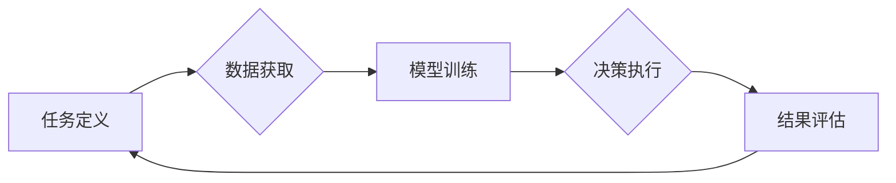

## AI人工智能代理工作流AI Agent WorkFlow：在电子商务中应用AI代理的策略

> 关键词：人工智能代理、电子商务、工作流自动化、机器学习、自然语言处理、决策优化、客户服务

## 1. 背景介绍

电子商务行业在全球范围内蓬勃发展，其核心是高效便捷的交易流程和优质的客户服务。随着数据量的激增和用户需求的不断变化，传统的人工处理模式面临着效率低下、成本高昂和服务质量难以保证等挑战。人工智能（AI）技术作为一种颠覆性的力量，为电子商务行业带来了新的机遇。

其中，AI代理作为一种智能化自动化技术，能够模拟人类的行为，自动完成一系列任务，例如处理客户咨询、推荐商品、完成订单等。AI代理的工作流自动化可以显著提高电子商务运营效率，降低成本，提升客户体验。

## 2. 核心概念与联系

### 2.1 AI代理的概念

AI代理是一种能够自主学习、决策和执行任务的软件实体。它通常由以下几个核心组件组成：

* **感知模块:** 收集和处理来自外部环境的信息，例如用户输入、商品数据、市场趋势等。
* **推理模块:** 基于感知到的信息，运用机器学习算法和知识库进行分析和推理，做出决策。
* **执行模块:** 根据推理结果，执行相应的动作，例如发送邮件、更新数据库、控制机器人等。

### 2.2 AI代理工作流

AI代理工作流是指AI代理在完成特定任务过程中所遵循的一系列步骤和规则。它通常由以下几个阶段组成：

* **任务定义:** 明确AI代理需要完成的任务目标和范围。
* **数据获取:** 收集和准备AI代理所需的输入数据。
* **模型训练:** 利用机器学习算法训练AI代理模型，使其能够准确地识别和理解数据。
* **决策执行:** AI代理根据训练好的模型，对输入数据进行分析和推理，并执行相应的决策。
* **结果评估:** 评估AI代理完成任务的质量和效率，并进行反馈和优化。

### 2.3  AI代理在电子商务中的应用

AI代理可以应用于电子商务各个环节，例如：

* **客户服务:** AI聊天机器人可以自动回答客户常见问题，提供24/7在线支持，提高客户满意度。
* **商品推荐:** AI代理可以根据用户的购买历史、浏览记录和兴趣偏好，推荐个性化的商品，提升销售转化率。
* **订单处理:** AI代理可以自动完成订单确认、物流跟踪、支付处理等流程，提高订单处理效率。
* **营销推广:** AI代理可以根据用户画像和市场趋势，进行精准的营销推广，提高广告投放效果。

**Mermaid 流程图**



## 3. 核心算法原理 & 具体操作步骤

### 3.1  算法原理概述

AI代理的工作流自动化主要依赖于以下核心算法：

* **机器学习:** 用于训练AI代理模型，使其能够从数据中学习规律，进行预测和决策。常见的机器学习算法包括监督学习、无监督学习和强化学习。
* **自然语言处理 (NLP):** 用于处理和理解自然语言文本，例如用户咨询、商品描述等。NLP技术可以帮助AI代理进行文本分类、情感分析、问答系统等功能。
* **决策树:** 用于构建决策规则，根据输入数据进行分类和决策。决策树算法可以帮助AI代理做出更智能化的决策。

### 3.2  算法步骤详解

1. **数据收集和预处理:** 收集电子商务平台相关数据，例如用户行为数据、商品信息、市场趋势等。对数据进行清洗、转换和格式化，使其适合机器学习算法的训练。
2. **模型选择和训练:** 根据任务目标选择合适的机器学习算法，例如使用分类算法训练商品推荐模型，使用回归算法训练价格预测模型。利用训练数据训练模型，并进行参数调优，提高模型的准确性和效率。
3. **规则定义和决策树构建:** 根据业务需求定义AI代理的工作流程和决策规则。使用决策树算法构建决策树模型，将规则转化为可执行的代码。
4. **系统集成和部署:** 将训练好的模型和决策树集成到电子商务平台的系统中，并进行部署和测试。
5. **监控和优化:** 持续监控AI代理的工作性能，收集用户反馈和数据分析结果，并对模型和规则进行优化，不断提高AI代理的效率和准确性。

### 3.3  算法优缺点

**优点:**

* **自动化效率:** AI代理可以自动完成重复性任务，提高工作效率。
* **成本降低:** AI代理可以减少人工成本，降低运营成本。
* **个性化服务:** AI代理可以根据用户需求提供个性化的服务，提升客户体验。
* **数据驱动决策:** AI代理可以利用数据分析结果进行决策，提高决策的准确性和效率。

**缺点:**

* **数据依赖:** AI代理的性能依赖于训练数据的质量和数量。
* **算法复杂性:** 训练和维护AI代理模型需要一定的技术难度。
* **伦理风险:** AI代理的决策可能会存在偏差或误判，需要进行伦理风险评估和控制。

### 3.4  算法应用领域

AI代理的工作流自动化技术在电子商务之外，还广泛应用于其他领域，例如：

* **金融服务:** 自动化理财、风险评估、欺诈检测等任务。
* **医疗保健:** 自动化病历分析、诊断辅助、预约挂号等任务。
* **制造业:** 自动化生产调度、质量控制、设备维护等任务。

## 4. 数学模型和公式 & 详细讲解 & 举例说明

### 4.1  数学模型构建

在AI代理工作流中，常用的数学模型包括：

* **贝叶斯网络:** 用于表示变量之间的概率关系，可以用于预测和决策。
* **决策树:** 用于构建决策规则，可以将复杂决策问题分解成一系列简单的决策步骤。
* **支持向量机 (SVM):** 用于分类和回归问题，可以找到最佳的分隔超平面。

### 4.2  公式推导过程

例如，在商品推荐系统中，可以使用协同过滤算法进行推荐。协同过滤算法基于用户的历史购买行为和商品的相似度进行推荐。

**公式:**

$$
r_{ui} = \frac{\sum_{j \in N(u)} \frac{s_{uj} * r_{uj}}{ \sqrt{\sum_{k \in N(u)} s_{uk}^2}} }{\sum_{j \in N(u)} \frac{s_{uj}}{ \sqrt{\sum_{k \in N(u)} s_{uk}^2}}}
$$

其中：

* $r_{ui}$: 用户 $u$ 对商品 $i$ 的评分
* $s_{uj}$: 用户 $u$ 和用户 $j$ 的相似度
* $r_{uj}$: 用户 $j$ 对商品 $i$ 的评分
* $N(u)$: 用户 $u$ 的邻居用户集合

### 4.3  案例分析与讲解

假设用户 $A$ 喜欢购买电影和书籍，用户 $B$ 喜欢购买书籍和音乐。如果用户 $A$ 购买了电影 $X$，那么根据协同过滤算法，可以推测用户 $B$ 也可能喜欢电影 $X$。

## 5. 项目实践：代码实例和详细解释说明

### 5.1  开发环境搭建

* **操作系统:** Ubuntu 20.04 LTS
* **编程语言:** Python 3.8
* **开发工具:** Jupyter Notebook, VS Code
* **库依赖:** TensorFlow, PyTorch, scikit-learn, NLTK

### 5.2  源代码详细实现

```python
# 导入必要的库
import tensorflow as tf
from sklearn.model_selection import train_test_split

# 定义模型
model = tf.keras.models.Sequential([
    tf.keras.layers.Dense(64, activation='relu', input_shape=(10,)),
    tf.keras.layers.Dense(32, activation='relu'),
    tf.keras.layers.Dense(1, activation='sigmoid')
])

# 编译模型
model.compile(optimizer='adam', loss='binary_crossentropy', metrics=['accuracy'])

# 数据加载和预处理
#...

# 数据划分
X_train, X_test, y_train, y_test = train_test_split(X, y, test_size=0.2)

# 模型训练
model.fit(X_train, y_train, epochs=10, batch_size=32)

# 模型评估
loss, accuracy = model.evaluate(X_test, y_test)
print('Test Loss:', loss)
print('Test Accuracy:', accuracy)
```

### 5.3  代码解读与分析

这段代码展示了如何使用TensorFlow框架构建一个简单的分类模型。

* 首先，导入必要的库。
* 然后，定义一个包含两层全连接层的模型。
* 接着，编译模型，指定优化器、损失函数和评估指标。
* 接下来，加载和预处理数据，并将其划分成训练集和测试集。
* 最后，训练模型并评估其性能。

### 5.4  运行结果展示

训练完成后，可以查看模型的训练损失和测试准确率。

## 6. 实际应用场景

### 6.1  AI聊天机器人

AI聊天机器人可以用于提供24/7在线客户服务，回答常见问题，引导用户完成订单操作，提升客户体验。

### 6.2  个性化商品推荐

AI代理可以根据用户的购买历史、浏览记录和兴趣偏好，推荐个性化的商品，提高商品销售转化率。

### 6.3  智能客服

AI智能客服可以根据用户的咨询内容，自动识别问题类型，并提供相应的解决方案，提高客服效率。

### 6.4  未来应用展望

随着AI技术的不断发展，AI代理的工作流自动化将在电子商务行业得到更广泛的应用，例如：

* **智能营销:** AI代理可以根据用户画像和市场趋势，进行精准的营销推广，提高广告投放效果。
* **个性化物流:** AI代理可以根据用户的需求和物流情况，优化物流路线和配送时间，提高物流效率。
* **智能仓储:** AI代理可以自动完成仓储管理任务，例如货物入库、出库、盘点等，提高仓储效率。

## 7. 工具和资源推荐

### 7.1  学习资源推荐

* **书籍:**
    * 《深度学习》
    * 《机器学习实战》
    * 《自然语言处理入门》
* **在线课程:**
    * Coursera: 深度学习
    * edX: 机器学习
    * Udacity: 自然语言处理

### 7.2  开发工具推荐

* **TensorFlow:** 开源深度学习框架
* **PyTorch:** 开源深度学习框架
* **scikit-learn:** 机器学习库
* **NLTK:** 自然语言处理库

### 7.3  相关论文推荐

* **Attention Is All You Need:** https://arxiv.org/abs/1706.03762
* **BERT: Pre-training of Deep Bidirectional Transformers for Language Understanding:** https://arxiv.org/abs/1810.04805
* **Generative Pre-trained Transformer 3 (GPT-3):** https://openai.com/blog/gpt-3/

## 8. 总结：未来发展趋势与挑战

### 8.1  研究成果总结

AI代理的工作流自动化技术在电子商务行业取得了显著的成果，例如提高了客户服务效率、个性化商品推荐、智能营销等。

### 8.2  未来发展趋势

* **更智能的AI代理:** 未来AI代理将更加智能化，能够更好地理解用户需求，提供更个性化的服务