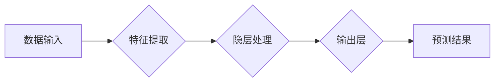

## Andrej Karpathy谈AI与机器学习的未来

> 关键词：人工智能、机器学习、深度学习、计算机视觉、自然语言处理、模型训练、伦理

### 1. 背景介绍

人工智能（AI）正以惊人的速度发展，深刻地改变着我们生活和工作的方式。作为AI领域领军人物之一，Andrej Karpathy在过去十年中做出了杰出的贡献，他的研究和见解对AI的未来发展具有重要意义。本文将探讨Karpathy关于AI与机器学习未来的观点，并分析其背后的核心概念、算法原理、数学模型以及实际应用场景。

### 2. 核心概念与联系

Karpathy强调，深度学习是推动AI发展的关键技术。深度学习是一种基于多层神经网络的机器学习方法，能够从海量数据中学习复杂的模式和特征。

**Mermaid 流程图：**



**核心概念：**

* **深度神经网络：**由多层神经元组成的网络结构，能够学习层次化的特征表示。
* **特征提取：**通过卷积神经网络（CNN）或循环神经网络（RNN）等网络结构，从原始数据中提取有意义的特征。
* **隐层处理：**神经网络的隐藏层对提取的特征进行非线性变换和组合，学习更高级的表示。
* **输出层：**根据学习到的特征，生成最终的预测结果。

### 3. 核心算法原理 & 具体操作步骤

#### 3.1  算法原理概述

深度学习算法的核心是**反向传播算法**，它通过调整神经网络权重，最小化预测结果与真实值的误差。

#### 3.2  算法步骤详解

1. **初始化网络参数：**随机初始化神经网络的权重和偏置。
2. **前向传播：**将输入数据通过网络层级传递，计算每个神经元的输出。
3. **计算损失函数：**比较预测结果与真实值之间的差异，使用损失函数量化误差。
4. **反向传播：**根据损失函数的梯度，反向传播误差信息，更新网络参数。
5. **迭代训练：**重复步骤2-4，直到损失函数达到最小值。

#### 3.3  算法优缺点

**优点：**

* **高精度：**深度学习算法能够学习复杂的模式，在许多任务中取得了超越传统算法的精度。
* **自动化特征提取：**无需人工设计特征，深度学习算法能够自动从数据中学习特征。
* **可扩展性：**深度学习算法可以处理海量数据，并随着数据量的增加而提高精度。

**缺点：**

* **数据依赖性：**深度学习算法需要大量的训练数据，否则精度会下降。
* **计算资源需求：**训练深度学习模型需要大量的计算资源和时间。
* **可解释性差：**深度学习模型的决策过程难以理解，缺乏透明度。

#### 3.4  算法应用领域

深度学习算法广泛应用于计算机视觉、自然语言处理、语音识别、推荐系统等领域。

### 4. 数学模型和公式 & 详细讲解 & 举例说明

#### 4.1  数学模型构建

深度学习模型通常由多个神经网络层组成，每个层包含多个神经元。每个神经元接收来自上一层的输入，并通过激活函数进行非线性变换，输出到下一层。

#### 4.2  公式推导过程

**激活函数：**

常用的激活函数包括 sigmoid 函数、ReLU 函数、tanh 函数等。

**损失函数：**

常用的损失函数包括均方误差（MSE）、交叉熵损失（Cross-Entropy Loss）等。

**反向传播算法：**

反向传播算法利用链式法则，计算每个参数的梯度，并根据梯度更新参数值。

#### 4.3  案例分析与讲解

**举例说明：**

假设我们训练一个简单的线性回归模型，目标是预测房价。模型输入房屋面积，输出房价。

**公式：**

```latex
y = w_1 * x_1 + w_2 * x_2 + b
```

其中：

* $y$ 是预测的房价
* $x_1$ 是房屋面积
* $w_1$ 和 $w_2$ 是模型参数
* $b$ 是偏置项

**损失函数：**

```latex
Loss = \frac{1}{n} \sum_{i=1}^{n} (y_i - \hat{y}_i)^2
```

其中：

* $n$ 是样本数量
* $y_i$ 是真实房价
* $\hat{y}_i$ 是预测房价

**反向传播算法：**

通过计算损失函数对每个参数的梯度，并使用梯度下降算法更新参数值，最终得到一个能够准确预测房价的模型。

### 5. 项目实践：代码实例和详细解释说明

#### 5.1  开发环境搭建

使用 Python 语言和 TensorFlow 或 PyTorch 等深度学习框架进行开发。

#### 5.2  源代码详细实现

```python
import tensorflow as tf

# 定义模型
model = tf.keras.models.Sequential([
    tf.keras.layers.Dense(64, activation='relu', input_shape=(1,)),
    tf.keras.layers.Dense(1)
])

# 编译模型
model.compile(optimizer='adam', loss='mse')

# 训练模型
model.fit(x_train, y_train, epochs=10)

# 评估模型
loss = model.evaluate(x_test, y_test)
```

#### 5.3  代码解读与分析

* **定义模型：**使用 Keras API 定义一个简单的线性回归模型，包含两层神经元。
* **编译模型：**使用 Adam 优化器和均方误差损失函数编译模型。
* **训练模型：**使用训练数据训练模型，设置训练轮数为 10。
* **评估模型：**使用测试数据评估模型的性能，并打印损失值。

#### 5.4  运行结果展示

训练完成后，可以将模型应用于新的数据进行预测。

### 6. 实际应用场景

#### 6.1  计算机视觉

* **图像分类：**识别图像中的物体类别，例如猫、狗、汽车等。
* **目标检测：**定位图像中的物体，并识别其类别。
* **图像分割：**将图像分割成不同的区域，例如前景和背景。

#### 6.2  自然语言处理

* **文本分类：**识别文本的类别，例如情感分析、主题分类等。
* **机器翻译：**将文本从一种语言翻译成另一种语言。
* **文本生成：**生成新的文本，例如文章、故事、对话等。

#### 6.3  语音识别

* **语音转文本：**将语音信号转换为文本。
* **语音助手：**理解用户的语音指令，并执行相应的操作。

#### 6.4  未来应用展望

* **个性化推荐：**根据用户的兴趣和行为，推荐个性化的商品、服务和内容。
* **医疗诊断：**辅助医生进行疾病诊断，提高诊断准确率。
* **自动驾驶：**实现自动驾驶汽车，提高交通安全和效率。

### 7. 工具和资源推荐

#### 7.1  学习资源推荐

* **书籍：**
    * Deep Learning by Ian Goodfellow, Yoshua Bengio, and Aaron Courville
    * Hands-On Machine Learning with Scikit-Learn, Keras & TensorFlow by Aurélien Géron
* **在线课程：**
    * Coursera: Deep Learning Specialization by Andrew Ng
    * Udacity: Deep Learning Nanodegree
* **博客和网站：**
    * Andrej Karpathy's Blog: https://karpathy.github.io/
    * OpenAI Blog: https://openai.com/blog/

#### 7.2  开发工具推荐

* **Python:** https://www.python.org/
* **TensorFlow:** https://www.tensorflow.org/
* **PyTorch:** https://pytorch.org/

#### 7.3  相关论文推荐

* **ImageNet Classification with Deep Convolutional Neural Networks** by Alex Krizhevsky, Ilya Sutskever, and Geoffrey E. Hinton
* **Attention Is All You Need** by Ashish Vaswani, Noam Shazeer, Niki Parmar, Jakob Uszkoreit, Llion Jones, Aidan N. Gomez, Łukasz Kaiser, and Illia Polosukhin

### 8. 总结：未来发展趋势与挑战

#### 8.1  研究成果总结

深度学习在过去十年取得了令人瞩目的进展，在许多领域取得了突破性的成果。

#### 8.2  未来发展趋势

* **模型规模和复杂度提升：**训练更大规模、更复杂的神经网络模型。
* **数据增强和合成：**利用数据增强和合成技术，提高训练数据的质量和数量。
* **模型解释性和可解释性：**研究更可解释的深度学习模型，提高模型的透明度和信任度。
* **边缘计算和部署：**将深度学习模型部署到边缘设备，实现更低延迟和更高效率的应用。

#### 8.3  面临的挑战

* **数据隐私和安全：**深度学习模型训练需要大量数据，如何保护数据隐私和安全是一个重要挑战。
* **算法偏见和公平性：**深度学习模型可能存在算法偏见，导致不公平的结果。
* **能源消耗：**训练大型深度学习模型需要大量的计算资源，导致高能源消耗。

#### 8.4  研究展望

未来，深度学习研究将继续朝着更强大、更安全、更可解释的方向发展，为人类社会带来更多福祉。

### 9. 附录：常见问题与解答

* **什么是深度学习？**

深度学习是一种基于多层神经网络的机器学习方法，能够学习复杂的模式和特征。

* **深度学习有哪些应用场景？**

深度学习广泛应用于计算机视觉、自然语言处理、语音识别、推荐系统等领域。

* **如何学习深度学习？**

可以通过阅读书籍、在线课程、博客和网站等方式学习深度学习。

* **深度学习有哪些挑战？**

深度学习面临的数据隐私和安全、算法偏见和公平性、能源消耗等挑战。


作者：禅与计算机程序设计艺术 / Zen and the Art of Computer Programming 
