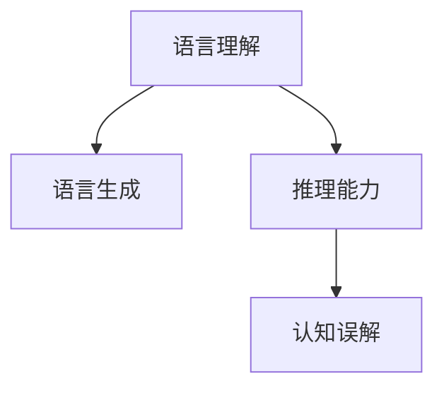
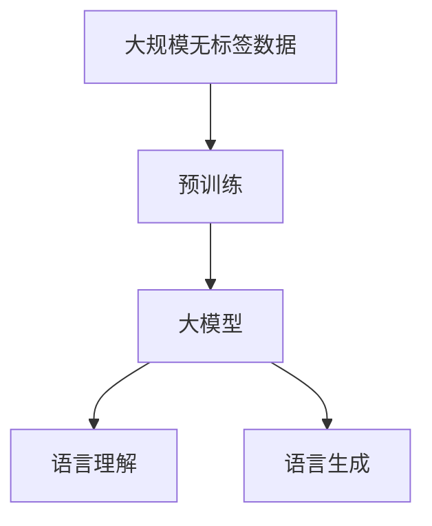
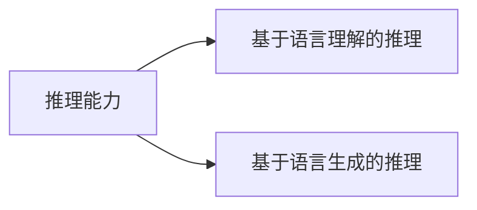
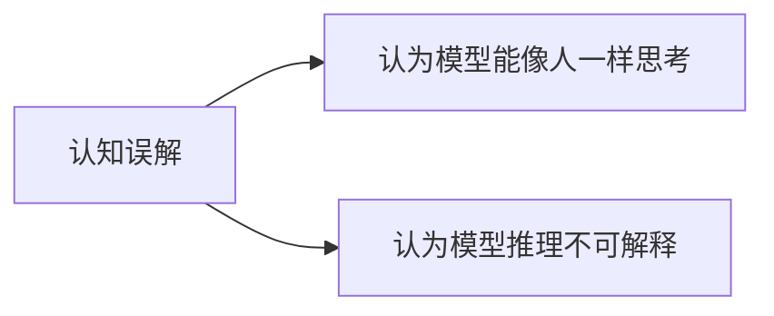
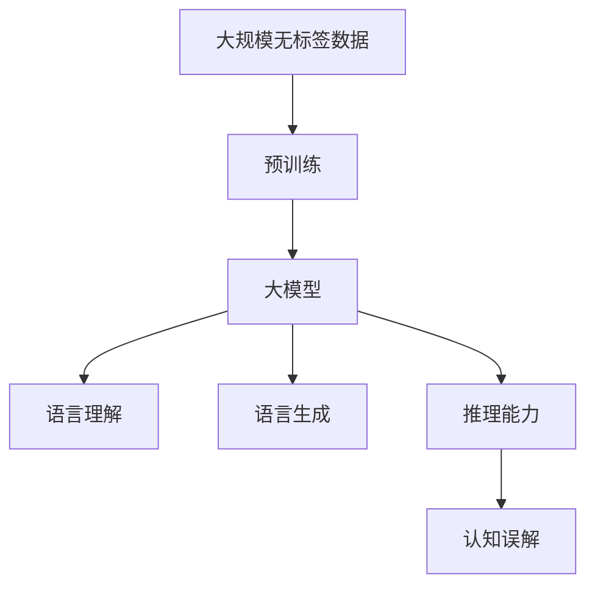

                 

# 语言与推理：大模型的认知误解

> 关键词：大模型,认知误区,推理能力,自然语言处理(NLP),语言理解,语言生成

## 1. 背景介绍

### 1.1 问题由来
随着深度学习技术的快速发展，特别是近年来大语言模型(Large Language Models, LLMs)的涌现，自然语言处理(Natural Language Processing, NLP)领域取得了令人瞩目的突破。这些大模型通过在海量无标签文本数据上进行预训练，学习了丰富的语言知识和常识，能够在各种自然语言处理任务上表现出色。

然而，大语言模型在语言理解和推理方面的认知能力，仍存在许多误解和困惑。一方面，许多人认为大模型能够像人类一样进行思考和推理；另一方面，也有很多人认为大模型的推理能力是机械的、不可解释的。这些问题不仅限制了大模型应用场景的拓展，也影响了公众对其真实能力的认知。

### 1.2 问题核心关键点
在探讨大模型的认知误解前，我们需要明确以下几点：

- **大模型的语言理解能力**：大模型通常基于自回归或自编码模型架构，通过在大规模无标签文本数据上进行预训练，学习到语言的一般性规律和词汇分布。这种预训练过程使其能够处理自然语言中的语法、语义和语用特征。

- **大模型的推理能力**：大模型的推理能力主要依赖于其在预训练期间学习到的语言表示。通过微调或提示学习，模型可以在下游任务上进行推理，但这种推理能力仍受限于预训练数据和任务目标。

- **认知误区**：认知误区主要来源于对大模型工作原理的误解，包括认为大模型能像人类一样思考、推理，以及认为其推理过程是不可解释的。

- **模型限制**：尽管大模型在语言理解和推理方面取得了显著进展，但其认知能力仍存在限制，如对于抽象概念、因果关系的理解，以及跨模态信息的整合。

理解这些关键点，可以帮助我们更好地把握大模型的局限性和实际应用中的挑战，从而更科学地评估和利用其能力。

## 2. 核心概念与联系

### 2.1 核心概念概述

为深入理解大模型的认知误解，我们首先介绍几个核心概念：

- **语言理解**：指模型对自然语言的词汇、语法、语义和语用特征的理解能力。
- **语言生成**：指模型根据给定的输入生成符合语言规范的文本。
- **推理能力**：指模型对语言的逻辑推理能力，包括推理结论的准确性和推理过程的可解释性。
- **认知误解**：指对大模型语言理解和推理能力的错误认知和期待。

这些概念之间的关系可以用以下Mermaid流程图来展示：



这个流程图展示了语言理解、语言生成、推理能力和认知误解之间的逻辑关系：

1. **语言理解**是基础，为语言生成和推理提供了前提条件。
2. **语言生成**基于语言理解，用于生成符合语言规范的文本。
3. **推理能力**基于语言理解，用于对语言进行逻辑推理。
4. **认知误解**则是对推理能力的一种错误认知。

### 2.2 概念间的关系

这些核心概念之间存在着紧密的联系，形成了大模型认知能力的整体框架。下面我们通过几个Mermaid流程图来展示这些概念之间的关系。

#### 2.2.1 大模型的语言理解与生成



这个流程图展示了预训练过程、大模型的语言理解能力和语言生成能力。大模型通过在大规模无标签数据上进行预训练，学习到了语言的词汇、语法和语义特征，并能够基于这种理解进行文本生成。

#### 2.2.2 推理能力在大模型中的应用



这个流程图展示了推理能力在大模型中的应用。推理能力主要依赖于语言理解和语言生成，通过这两种能力，模型能够对语言进行逻辑推理。

#### 2.2.3 认知误解在推理过程中的体现



这个流程图展示了认知误区在大模型推理过程中的体现。许多人对大模型的推理能力存在误解，认为它能够像人一样思考和推理，而另一些人则认为大模型的推理过程是不可解释的。

### 2.3 核心概念的整体架构

最后，我们用一个综合的流程图来展示这些核心概念在大模型认知能力中的整体架构：



这个综合流程图展示了从预训练到推理能力的完整过程，以及认知误解在其中的体现。通过这些概念的相互作用，我们能够更全面地理解大模型的认知能力。

## 3. 核心算法原理 & 具体操作步骤
### 3.1 算法原理概述

大模型在语言理解和推理方面的核心算法原理，主要依赖于自监督预训练和微调。其基本原理可以总结如下：

- **自监督预训练**：在大规模无标签文本数据上进行预训练，学习语言的词汇、语法和语义特征。
- **微调**：在特定任务的数据集上进行有监督学习，调整模型参数以适应任务需求。
- **推理能力**：基于预训练和微调过程中学习到的语言表示，进行语言的逻辑推理。

### 3.2 算法步骤详解

基于大模型的语言理解和推理，其核心算法步骤可以概括为以下几个步骤：

1. **数据准备**：收集并准备用于预训练和微调的大规模无标签数据集，以及特定任务的标注数据集。
2. **预训练**：在大规模无标签数据上，通过自监督学习任务，如语言建模、掩码语言模型等，训练大模型。
3. **微调**：在特定任务的数据集上，使用标注数据进行有监督学习，调整模型参数以适应任务需求。
4. **推理**：在得到微调后的模型上，输入新的文本数据，进行语言理解、生成和推理，得到最终输出。

### 3.3 算法优缺点

大模型在语言理解和推理方面的算法具有以下优点：

- **高效性**：通过大规模预训练，大模型能够在特定任务上快速适应，微调所需的标注数据量相对较少。
- **泛化能力**：预训练过程中学习到的语言表示，能够很好地适应不同任务，提高模型的泛化能力。

但同时也存在一些缺点：

- **过拟合风险**：微调过程中可能会出现过拟合现象，尤其是在数据量较小的情况下。
- **推理能力限制**：大模型的推理能力仍受限于预训练数据和微调任务，对于抽象概念和因果关系的理解有限。
- **可解释性不足**：大模型的推理过程通常难以解释，缺乏透明性。

### 3.4 算法应用领域

大模型的语言理解和推理能力，主要应用于以下几个领域：

- **自然语言处理**：包括文本分类、命名实体识别、情感分析、机器翻译等任务。
- **知识图谱**：用于构建和推理知识图谱，提取和整合语义信息。
- **智能对话**：用于构建智能对话系统，进行多轮对话理解和回复生成。
- **人工智能辅助**：辅助医疗、金融、教育等领域的决策和推理，提供个性化服务。

## 4. 数学模型和公式 & 详细讲解 & 举例说明（备注：数学公式请使用latex格式，latex嵌入文中独立段落使用 $$，段落内使用 $)
### 4.1 数学模型构建

大模型的语言理解和推理，主要依赖于深度神经网络模型。这里以Transformer为例，其数学模型可以表示为：

$$
M(x) = \text{Encoder}(x) + \text{Decoder}(\text{Encoder}(x))
$$

其中，$x$ 为输入的文本向量，$\text{Encoder}$ 和 $\text{Decoder}$ 分别表示编码器和解码器。编码器通过多层次的Transformer块进行特征提取，解码器则通过生成器进行文本生成。

### 4.2 公式推导过程

以语言模型为例，假设模型接收一个长度为 $T$ 的文本序列 $x = (x_1, x_2, ..., x_T)$，其中 $x_t$ 表示第 $t$ 个词。模型的输出为文本的概率分布 $P(x)$，表示给定 $x$ 的情况下，每个词出现的概率。

模型的目标是最小化预测概率与真实概率之间的差距，即：

$$
\mathcal{L} = -\frac{1}{N}\sum_{i=1}^N \log P(x_i)
$$

其中 $N$ 为训练样本数。在训练过程中，模型通过优化损失函数 $\mathcal{L}$，调整参数 $\theta$，使得 $P(x)$ 尽可能接近真实概率分布。

### 4.3 案例分析与讲解

以GPT-2为例，其语言模型训练过程可以总结如下：

1. **数据预处理**：将文本数据转换为模型可接受的向量形式。
2. **模型初始化**：初始化模型的权重。
3. **前向传播**：将输入数据输入模型，计算预测概率。
4. **损失计算**：计算预测概率与真实概率之间的差距。
5. **反向传播**：根据梯度下降等优化算法，更新模型参数。
6. **迭代训练**：重复以上步骤，直到模型收敛。

## 5. 项目实践：代码实例和详细解释说明
### 5.1 开发环境搭建

在进行语言理解和推理的实践前，我们需要准备好开发环境。以下是使用Python进行PyTorch开发的环境配置流程：

1. 安装Anaconda：从官网下载并安装Anaconda，用于创建独立的Python环境。

2. 创建并激活虚拟环境：
```bash
conda create -n pytorch-env python=3.8 
conda activate pytorch-env
```

3. 安装PyTorch：根据CUDA版本，从官网获取对应的安装命令。例如：
```bash
conda install pytorch torchvision torchaudio cudatoolkit=11.1 -c pytorch -c conda-forge
```

4. 安装Transformers库：
```bash
pip install transformers
```

5. 安装各类工具包：
```bash
pip install numpy pandas scikit-learn matplotlib tqdm jupyter notebook ipython
```

完成上述步骤后，即可在`pytorch-env`环境中开始实践。

### 5.2 源代码详细实现

下面我们以语言模型为例，给出使用Transformers库进行GPT-2语言模型训练的PyTorch代码实现。

首先，定义语言模型训练函数：

```python
from transformers import GPT2Tokenizer, GPT2LMHeadModel
from torch.utils.data import DataLoader
from tqdm import tqdm
from torch import nn, optim

def train_epoch(model, tokenizer, dataset, batch_size, optimizer):
    dataloader = DataLoader(dataset, batch_size=batch_size, shuffle=True)
    model.train()
    epoch_loss = 0
    for batch in tqdm(dataloader, desc='Training'):
        inputs = tokenizer(batch['input_ids'], return_tensors='pt', padding='max_length', truncation=True)
        labels = inputs['input_ids'].clone()
        labels[labels<0] = -100  # 用-100表示无标签
        outputs = model(**inputs)
        loss = nn.CrossEntropyLoss()(outputs.logits, labels)
        epoch_loss += loss.item()
        loss.backward()
        optimizer.step()
        optimizer.zero_grad()
    return epoch_loss / len(dataloader)
```

然后，定义训练和评估函数：

```python
from transformers import AdamW

device = torch.device('cuda') if torch.cuda.is_available() else torch.device('cpu')
model = GPT2LMHeadModel.from_pretrained('gpt2')
tokenizer = GPT2Tokenizer.from_pretrained('gpt2')
optimizer = AdamW(model.parameters(), lr=2e-5)

def train(model, tokenizer, dataset, batch_size, optimizer, epochs=5):
    device = torch.device('cuda') if torch.cuda.is_available() else torch.device('cpu')
    model.to(device)
    tokenizer.to(device)
    
    for epoch in range(epochs):
        train_loss = train_epoch(model, tokenizer, dataset, batch_size, optimizer)
        print(f'Epoch {epoch+1}, train loss: {train_loss:.3f}')
    
    return model
```

最后，启动训练流程：

```python
dataset = ...
model = train(model, tokenizer, dataset, batch_size, optimizer)
```

以上就是使用PyTorch对GPT-2进行语言模型训练的完整代码实现。可以看到，借助Transformers库，代码实现非常简单高效，开发者可以将更多精力放在数据处理和模型改进上。

### 5.3 代码解读与分析

让我们再详细解读一下关键代码的实现细节：

**train_epoch函数**：
- 定义训练过程中的一些关键变量，如损失函数、梯度、优化器等。
- 遍历数据集，对每个样本进行前向传播和反向传播，更新模型参数。

**train函数**：
- 在训练前，将模型和分词器移动到GPU（如果可用），提高计算效率。
- 在每个epoch内，调用train_epoch函数进行训练，并输出训练损失。
- 在训练结束后，返回最终的模型。

**train模型**：
- 调用训练函数，传入预训练模型、分词器、数据集和优化器。
- 在训练过程中，模型会在GPU上加速训练。

## 6. 实际应用场景
### 6.1 智能客服系统

智能客服系统是一个典型的应用场景，通过大模型的语言理解和推理能力，系统能够理解客户的问题，提供准确的答案。例如，在智能问答系统中，客户提出一个问题，系统能够基于预训练和微调的知识库，提供最合适的回答。这种应用不仅提高了客户满意度，也降低了企业的运营成本。

### 6.2 医疗诊断系统

医疗诊断系统是另一个重要应用场景。通过大模型的语言理解和推理能力，系统能够从患者的病历中提取关键信息，辅助医生进行诊断和治疗决策。例如，在临床诊断中，系统能够从患者的症状描述中推断出可能的疾病，提供初步诊断建议。这种应用能够显著提高医疗服务的效率和准确性。

### 6.3 金融风险管理

金融风险管理也是大模型的一个重要应用场景。通过大模型的语言理解和推理能力，系统能够从市场报告、新闻、社交媒体等数据中提取有价值的信息，辅助金融分析师进行风险评估和投资决策。例如，在系统输入市场报告，系统能够理解其中的关键信息，推断出潜在的风险因素，提供风险预警。这种应用能够有效降低金融市场的风险，保护投资者利益。

## 7. 工具和资源推荐
### 7.1 学习资源推荐

为了帮助开发者系统掌握大模型的语言理解和推理能力，这里推荐一些优质的学习资源：

1. 《深度学习与自然语言处理》课程：斯坦福大学开设的NLP明星课程，涵盖NLP的基础知识和大模型应用，适合初学者入门。
2. 《Transformer from the Inside Out》系列博文：由大模型技术专家撰写，详细介绍了Transformer原理、GPT模型等前沿话题。
3. 《自然语言处理综述》书籍：综述了NLP领域的经典模型和技术，包括大模型的语言理解和推理能力。
4. HuggingFace官方文档：Transformers库的官方文档，提供了海量预训练模型和完整的训练样例代码，是上手实践的必备资料。
5. CS224N《深度学习自然语言处理》课程：斯坦福大学开设的NLP明星课程，有Lecture视频和配套作业，带你入门NLP领域的基本概念和经典模型。

通过对这些资源的学习实践，相信你一定能够快速掌握大模型的语言理解和推理能力，并用于解决实际的NLP问题。

### 7.2 开发工具推荐

高效的开发离不开优秀的工具支持。以下是几款用于大模型语言理解和推理开发的常用工具：

1. PyTorch：基于Python的开源深度学习框架，灵活动态的计算图，适合快速迭代研究。大部分预训练语言模型都有PyTorch版本的实现。
2. TensorFlow：由Google主导开发的开源深度学习框架，生产部署方便，适合大规模工程应用。同样有丰富的预训练语言模型资源。
3. Transformers库：HuggingFace开发的NLP工具库，集成了众多SOTA语言模型，支持PyTorch和TensorFlow，是进行语言理解和推理开发的利器。
4. Weights & Biases：模型训练的实验跟踪工具，可以记录和可视化模型训练过程中的各项指标，方便对比和调优。与主流深度学习框架无缝集成。
5. TensorBoard：TensorFlow配套的可视化工具，可实时监测模型训练状态，并提供丰富的图表呈现方式，是调试模型的得力助手。

合理利用这些工具，可以显著提升大模型语言理解和推理任务的开发效率，加快创新迭代的步伐。

### 7.3 相关论文推荐

大模型在语言理解和推理方面的研究源于学界的持续研究。以下是几篇奠基性的相关论文，推荐阅读：

1. Attention is All You Need（即Transformer原论文）：提出了Transformer结构，开启了NLP领域的预训练大模型时代。
2. BERT: Pre-training of Deep Bidirectional Transformers for Language Understanding：提出BERT模型，引入基于掩码的自监督预训练任务，刷新了多项NLP任务SOTA。
3. T5: Exploring the Limits of Transfer Learning with a Unified Text-to-Text Transformer：提出T5模型，在多种NLP任务上取得了SOTA性能。
4. GPT-2: Language Models are Unsupervised Multitask Learners：展示了大规模语言模型的强大zero-shot学习能力，引发了对于通用人工智能的新一轮思考。
5. Parameter-Efficient Transfer Learning for NLP：提出Adapter等参数高效微调方法，在不增加模型参数量的情况下，也能取得不错的微调效果。

这些论文代表了大模型语言理解和推理技术的发展脉络。通过学习这些前沿成果，可以帮助研究者把握学科前进方向，激发更多的创新灵感。

除上述资源外，还有一些值得关注的前沿资源，帮助开发者紧跟大语言模型微调技术的最新进展，例如：

1. arXiv论文预印本：人工智能领域最新研究成果的发布平台，包括大量尚未发表的前沿工作，学习前沿技术的必读资源。
2. 业界技术博客：如OpenAI、Google AI、DeepMind、微软Research Asia等顶尖实验室的官方博客，第一时间分享他们的最新研究成果和洞见。
3. 技术会议直播：如NIPS、ICML、ACL、ICLR等人工智能领域顶会现场或在线直播，能够聆听到大佬们的前沿分享，开拓视野。
4. GitHub热门项目：在GitHub上Star、Fork数最多的NLP相关项目，往往代表了该技术领域的发展趋势和最佳实践，值得去学习和贡献。
5. 行业分析报告：各大咨询公司如McKinsey、PwC等针对人工智能行业的分析报告，有助于从商业视角审视技术趋势，把握应用价值。

总之，对于大模型语言理解和推理技术的学习和实践，需要开发者保持开放的心态和持续学习的意愿。多关注前沿资讯，多动手实践，多思考总结，必将收获满满的成长收益。

## 8. 总结：未来发展趋势与挑战
### 8.1 总结

本文对大模型的语言理解和推理能力进行了全面系统的介绍。首先阐述了大模型的语言理解能力和推理能力的核心概念和相互关系，明确了当前在语言理解和推理方面的认知误区。其次，从原理到实践，详细讲解了语言理解和推理的数学模型和关键步骤，给出了具体的代码实现和运行结果展示。同时，本文还广泛探讨了语言理解和推理在大模型应用中的实际场景，展示了其在智能客服、医疗诊断、金融风险管理等领域的潜力。最后，本文精选了语言理解和推理技术的各类学习资源，力求为读者提供全方位的技术指引。

通过本文的系统梳理，可以看到，大模型的语言理解和推理能力正在成为NLP领域的重要范式，极大地拓展了预训练语言模型的应用边界，催生了更多的落地场景。受益于大规模语料的预训练，语言理解和推理模型以更低的时间和标注成本，在小样本条件下也能取得不俗的效果，有力推动了NLP技术的产业化进程。未来，伴随预训练语言模型和微调方法的持续演进，相信NLP技术将在更广阔的应用领域大放异彩，深刻影响人类的生产生活方式。

### 8.2 未来发展趋势

展望未来，大模型的语言理解和推理能力将呈现以下几个发展趋势：

1. **模型规模持续增大**：随着算力成本的下降和数据规模的扩张，预训练语言模型的参数量还将持续增长。超大规模语言模型蕴含的丰富语言知识，有望支撑更加复杂多变的语言理解和推理任务。
2. **参数高效微调方法**：未来会涌现更多参数高效的微调方法，如Prefix-Tuning、LoRA等，在节省计算资源的同时也能保证推理精度。
3. **多模态语言理解**：当前的语言理解主要聚焦于文本数据，未来会进一步拓展到图像、视频、语音等多模态数据理解。多模态信息的融合，将显著提升语言模型对现实世界的理解和建模能力。
4. **跨领域知识迁移**：通过预训练和微调，大模型能够学习到广泛的常识和背景知识，能够更好地进行跨领域知识迁移，提升其在不同任务上的性能。
5. **零样本和少样本推理**：大模型的语言推理能力不仅仅依赖于标注数据，未来会进一步提升其在零样本和少样本条件下的推理能力，使得模型能够更好地适应新任务和新数据。

这些趋势凸显了大模型语言理解和推理技术的广阔前景。这些方向的探索发展，必将进一步提升NLP系统的性能和应用范围，为人类认知智能的进化带来深远影响。

### 8.3 面临的挑战

尽管大模型的语言理解和推理技术已经取得了瞩目成就，但在迈向更加智能化、普适化应用的过程中，它仍面临着诸多挑战：

1. **推理能力局限**：大模型的推理能力仍受限于预训练数据和微调任务，对于抽象概念和因果关系的理解有限。
2. **模型鲁棒性不足**：大模型面对域外数据时，泛化性能往往大打折扣。对于测试样本的微小扰动，模型容易发生波动。
3. **可解释性不足**：大模型的推理过程通常难以解释，缺乏透明性。
4. **知识整合能力不足**：现有的语言模型往往局限于文本数据，难以灵活吸收和运用更广泛的先验知识。
5. **安全性有待保障**：预训练语言模型难免会学习到有偏见、有害的信息，通过推理传递到下游任务，产生误导性、歧视性的输出，给实际应用带来安全隐患。

正视大模型语言理解和推理面临的这些挑战，积极应对并寻求突破，将是大模型语言理解和推理技术走向成熟的必由之路。相信随着学界和产业界的共同努力，这些挑战终将一一被克服，大模型语言理解和推理必将在构建人机协同的智能时代中扮演越来越重要的角色。

### 8.4 未来突破

面对大模型语言理解和推理所面临的种种挑战，未来的研究需要在以下几个方面寻求新的突破：

1. **引入更多先验知识**：将符号化的先验知识，如知识图谱、逻辑规则等，与神经网络模型进行巧妙融合，引导推理过程学习更准确、合理的语言表示。同时加强不同模态数据的整合，实现视觉、语音等多模态信息与文本信息的协同建模。
2. **融合因果和对比学习范式**：通过引入因果推断和对比学习思想，增强大模型建立稳定因果关系的能力，学习更加普适、鲁棒的语言表征，从而提升模型泛化性和抗干扰能力。
3. **改进推理能力**：开发更加高效的推理算法，如深度神经网络推理引擎，提高推理速度和精度。同时探索多模态推理方法，使得大模型能够更好地理解和处理复杂的多模态数据。
4. **提升可解释性**：通过改进模型结构和推理算法，提高推理过程的可解释性。同时引入可解释性评估指标，如因果分析和逻辑推理，提升模型的透明性。
5. **保障模型安全性**：在模型训练目标中引入伦理导向的评估指标，过滤和惩罚有偏见、有害的输出倾向。同时加强人工干预和审核，建立模型行为的监管机制，确保输出符合人类价值观和伦理道德。

这些研究方向的探索，必将引领大模型语言理解和推理技术迈向更高的台阶，为构建安全、可靠、可解释、可控的智能系统铺平道路。面向未来，大模型语言理解和推理技术还需要与其他人工智能技术进行更深入的融合，如知识表示、因果推理、强化学习等，多路径协同发力，共同推动自然语言理解和智能交互系统的进步。只有勇于创新、敢于突破，才能不断拓展语言模型的边界，让智能技术更好地造福人类社会。

## 9. 附录：常见问题与解答

**Q1：大模型的语言理解能力是否等同于人类的语言理解能力？**

A: 大模型的语言理解能力虽然接近人类的理解能力，但并不等同。人类语言理解能力具有高度的抽象和推理能力，能够理解复杂的隐喻、比喻等高级语言现象。而大模型在处理这些高级语言现象时，仍然存在一定的局限性。

**Q2：大模型进行推理时，是否能够解释推理过程？**

A: 大模型在进行推理时，通常难以解释推理过程，其推理过程通常被视为"黑盒"系统。虽然一些模型采用了一些解释性技术，如LIME、SHAP等，能够提供部分推理过程的解释，但这种解释仍然不全面，缺乏透明性。

**Q3：大模型在推理过程中，是否容易受到噪音和扰动的干扰？**

A: 大模型在进行

