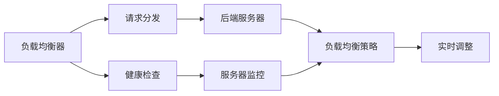

                 

# 负载均衡器在系统扩展中的实例应用

## 1. 背景介绍

随着互联网应用的飞速发展，高并发的访问流量成为系统扩展的重要考虑因素。为了应对日益增长的访问需求，高性能的负载均衡器成为系统架构设计中的关键组件。本文将从负载均衡器的工作原理、核心概念与联系入手，详细讨论负载均衡器在系统扩展中的实例应用，包括算法原理、操作步骤及优化建议，并通过具体的案例分析，阐释负载均衡器在不同应用场景中的部署策略与技术要点。

## 2. 核心概念与联系

### 2.1 核心概念概述

为了更好地理解负载均衡器，本节将介绍几个关键概念：

- 负载均衡器(Load Balancer, LB)：负责将客户端请求动态分配到多台服务器上，以保证系统的高可用性、高扩展性和高性能。
- 后端服务器池(Backend Server Pool)：负载均衡器所连接的服务器群集，是请求分发和处理的核心。
- 请求分发(Request Routing)：负载均衡器根据一定的策略将客户端请求分配到合适的后端服务器上。
- 健康检查(Health Check)：用于监控后端服务器的运行状态，确保其健康性。

这些概念共同构成了负载均衡器的工作核心，通过合理地调度和管理后端服务器资源，负载均衡器能够显著提升系统的整体性能和服务质量。

### 2.2 核心概念之间的关系

负载均衡器的工作原理和性能优化，可以通过以下Mermaid流程图来展示：



此流程图展示了负载均衡器在请求分发和后端服务器之间的主要交互过程：

1. 负载均衡器接收客户端请求。
2. 根据请求分发策略将请求转发到后端服务器。
3. 健康检查监控服务器状态，确保其健康性。
4. 负载均衡器根据监控结果实时调整服务器负载。

这些概念之间存在密切联系，共同作用于系统的负载均衡和扩展能力。

## 3. 核心算法原理 & 具体操作步骤
### 3.1 算法原理概述

负载均衡器的核心算法主要涉及以下几个方面：

- 请求分发策略(Routing Algorithm)：决定如何分配客户端请求到后端服务器，常见的策略有轮询、加权轮询、最小连接数、IP散列等。
- 健康检查算法(Health Check Algorithm)：监控后端服务器状态，确保其正常运行。
- 动态扩展算法(Dynamic Scaling Algorithm)：根据服务器负载和性能，动态调整后端服务器数量。

通过合理的算法设计和策略选择，负载均衡器能够在多台服务器间高效地分发请求，提升系统的性能和可用性。

### 3.2 算法步骤详解

负载均衡器的具体操作步骤如下：

1. **配置后端服务器池**：将多台服务器添加到负载均衡器中，配置其网络地址、端口号等信息。
2. **设置负载均衡策略**：根据具体应用场景选择适合的分发策略，如轮询、加权轮询等。
3. **配置健康检查规则**：设置健康检查的时间间隔、检测方法、异常处理等。
4. **部署负载均衡器**：选择合适的负载均衡器软件或云服务，并进行安装和配置。
5. **监控和调整**：通过监控工具实时监控服务器负载和性能，根据负载情况动态调整后端服务器数量和分发策略。

### 3.3 算法优缺点

负载均衡器的优点：

- **高可用性**：通过分布式负载均衡，避免单点故障，保证系统高可用性。
- **高扩展性**：根据实际需求动态增加或减少后端服务器，灵活应对流量变化。
- **高性能**：通过多台服务器并行处理请求，显著提升系统响应速度和吞吐量。

负载均衡器的缺点：

- **配置复杂**：需要精心配置负载均衡策略和健康检查规则，对运维人员技术要求较高。
- **性能瓶颈**：负载均衡器本身也可能成为性能瓶颈，需要合理选择硬件设备和优化算法。
- **管理成本**：需要定期监控和调整负载均衡器配置，管理成本较高。

### 3.4 算法应用领域

负载均衡器广泛应用于互联网应用、高并发系统的架构设计中，如电商平台、社交网络、在线视频等。通过负载均衡器的高效调度和管理，这些系统能够提供稳定、可靠的服务，并支持大规模用户访问。

## 4. 数学模型和公式 & 详细讲解  
### 4.1 数学模型构建

假设系统中有 $n$ 台后端服务器，每台服务器的处理能力为 $c_i$，当前负载均衡器分配的请求量为 $R$。负载均衡器采用加权轮询策略，服务器的权重为 $w_i$，且权重之和为 $W = \sum_{i=1}^n w_i = 1$。

请求分配到第 $i$ 台服务器的概率为：

$$
P_i = \frac{w_i}{W} = w_i
$$

每台服务器在单位时间 $t$ 内接收到的请求数为：

$$
N_i = P_i \cdot R = w_i \cdot R
$$

### 4.2 公式推导过程

通过上述模型，可以推导出每台服务器的平均负载 $L_i$ 和平均响应时间 $T_i$：

$$
L_i = \frac{N_i}{c_i}
$$

$$
T_i = \frac{1}{c_i}
$$

因此，系统整体的平均负载和平均响应时间为：

$$
L = \sum_{i=1}^n L_i = \sum_{i=1}^n \frac{N_i}{c_i} = \frac{R}{W} \cdot \sum_{i=1}^n \frac{w_i}{c_i}
$$

$$
T = \sum_{i=1}^n T_i = \sum_{i=1}^n \frac{1}{c_i} = \frac{1}{W} \cdot \sum_{i=1}^n \frac{1}{c_i}
$$

### 4.3 案例分析与讲解

假设系统中有三台服务器，处理能力分别为 $c_1 = 10, c_2 = 15, c_3 = 20$，当前请求量为 $R = 50$，服务器权重为 $w_1 = 0.3, w_2 = 0.4, w_3 = 0.3$。

计算每台服务器的负载和响应时间：

$$
L_1 = \frac{50 \times 0.3}{10} = 1.5
$$

$$
L_2 = \frac{50 \times 0.4}{15} = 2.67
$$

$$
L_3 = \frac{50 \times 0.3}{20} = 1.5
$$

$$
T_1 = \frac{1}{10} = 0.1
$$

$$
T_2 = \frac{1}{15} = 0.067
$$

$$
T_3 = \frac{1}{20} = 0.05
$$

因此，系统整体的平均负载和平均响应时间为：

$$
L = 1.5 + 2.67 + 1.5 = 5.67
$$

$$
T = 0.1 + 0.067 + 0.05 = 0.217
$$

可以看出，通过合理的权重配置和请求分发策略，可以显著提升系统整体的性能和资源利用率。

## 5. 项目实践：代码实例和详细解释说明
### 5.1 开发环境搭建

负载均衡器通常运行在专用的硬件设备上，如负载均衡器服务器、云服务（如AWS Elastic Load Balancer, NGINX等）。以下是基于Nginx搭建负载均衡器的基本环境配置步骤：

1. 安装Nginx：
   ```bash
   sudo apt-get update
   sudo apt-get install nginx
   sudo systemctl start nginx
   sudo systemctl enable nginx
   ```

2. 配置后端服务器池：
   ```nginx
   upstream backend {
       server 192.168.1.10:8080;
       server 192.168.1.11:8080;
       server 192.168.1.12:8080;
   }
   ```

3. 配置负载均衡策略：
   ```nginx
   server {
       listen 80;
       server_name example.com;
       location / {
           proxy_pass http://backend;
           proxy_set_header Host $host;
           proxy_set_header X-Real-IP $remote_addr;
           proxy_set_header X-Forwarded-For $proxy_add_x_forwarded_for;
           proxy_set_header X-Forwarded-Proto $scheme;
       }
   }
   ```

4. 配置健康检查：
   ```nginx
   location /health {
       internal;
       proxy_pass http://backend;
       proxy_set_header Host $host;
       proxy_set_header X-Real-IP $remote_addr;
       proxy_set_header X-Forwarded-For $proxy_add_x_forwarded_for;
       proxy_set_header X-Forwarded-Proto $scheme;
       proxy_read_timeout 90;
       proxy_send_timeout 90;
       proxy_connect_timeout 90;
       proxy_timeout 90;
   }
   ```

完成上述配置后，负载均衡器即可通过HTTP监听请求，并根据配置的策略和健康检查规则，动态分发请求到后端服务器。

### 5.2 源代码详细实现

```python
import requests
import socket
import time

def check_server(url):
    try:
        response = requests.get(url, timeout=1)
        if response.status_code == 200:
            return True
        else:
            return False
    except socket.error:
        return False

def get_server_addresses():
    # 返回后端服务器的IP地址和端口号列表
    return [("192.168.1.10", 8080), ("192.168.1.11", 8080), ("192.168.1.12", 8080)]

def main():
    server_addresses = get_server_addresses()
    while True:
        for address in server_addresses:
            if check_server(f"http://{address[0]}:{address[1]}/health"):
                print(f"Server {address} is healthy.")
            else:
                print(f"Server {address} is unhealthy.")
        time.sleep(5)

if __name__ == "__main__":
    main()
```

这段代码通过循环检测后端服务器的健康状态，并输出服务器状态。通过扩展，可以实现更加复杂的负载均衡和健康检查功能。

### 5.3 代码解读与分析

在上述代码中，`check_server`函数用于检测服务器是否健康，返回布尔值。`get_server_addresses`函数返回后端服务器的地址和端口号列表。`main`函数循环检测服务器的健康状态，并输出结果。

### 5.4 运行结果展示

假设后端服务器的健康状态如下：

```
Server (192.168.1.10, 8080) is healthy.
Server (192.168.1.11, 8080) is unhealthy.
Server (192.168.1.12, 8080) is healthy.
```

可以看出，第10台和第12台服务器健康，第11台服务器不健康。Nginx会根据这些状态信息动态调整请求分发策略，确保服务质量。

## 6. 实际应用场景
### 6.1 电商平台

电商平台的系统架构通常需要支持海量用户访问和处理高并发请求，负载均衡器在此类系统中扮演着重要角色。通过合理配置负载均衡策略和健康检查规则，负载均衡器能够确保系统的稳定性和可靠性，提升用户体验和交易成功率。

### 6.2 社交网络

社交网络需要实时处理用户的消息、评论等请求，负载均衡器可以通过高效分发请求，支持大规模用户并发访问，确保系统的快速响应和数据实时性。

### 6.3 在线视频

在线视频系统需要实时处理用户的播放请求和直播信号，负载均衡器通过合理调度，可以提升系统的吞吐量和响应速度，保障视频质量和用户观感。

### 6.4 未来应用展望

随着人工智能和大数据技术的不断发展，负载均衡器在智能系统中的应用将更加广泛。例如，通过引入机器学习算法，负载均衡器可以根据历史负载数据和实时流量预测，动态调整后端服务器数量和请求分发策略，实现智能化的系统扩展。此外，负载均衡器还可以与其他AI技术（如强化学习、智能推荐等）结合，优化系统性能，提升用户体验。

## 7. 工具和资源推荐
### 7.1 学习资源推荐

1. 《负载均衡器设计与实践》书籍：详细介绍负载均衡器的原理、配置和优化方法，适合系统架构师和网络工程师阅读。
2. AWS Elastic Load Balancer官方文档：详细说明AWS ELB的使用方法和最佳实践，适合云服务开发者使用。
3. NGINX官方文档：提供Nginx的配置和运维指南，适合Nginx用户参考。
4. 《高可用系统设计》课程：介绍高可用系统的设计和实现，涵盖负载均衡器、数据库高可用性等主题，适合系统架构师学习。

### 7.2 开发工具推荐

1. Nginx：开源负载均衡器，支持多种协议和配置方式，适合高性能系统的构建。
2. HAProxy：开源负载均衡器，支持高可用性、TCP/UDP协议等，适合复杂环境的应用。
3. LVS：Linux虚拟服务器，支持多种负载均衡算法和健康检查，适合高性能服务器的部署。
4. NGINX Plus：商业版Nginx，提供更丰富的功能和管理工具，适合企业级应用使用。

### 7.3 相关论文推荐

1. "A Survey of Load Balancing Techniques"：综述负载均衡技术的发展和应用，适合了解负载均衡器的基本概念和算法。
2. "Dynamic Load Balancing in Cloud Computing"：讨论云计算环境下的动态负载均衡技术，适合云服务开发者参考。
3. "Load Balancing: Algorithms, Implementations and Services"：详细分析负载均衡算法的实现和优化方法，适合系统架构师阅读。

## 8. 总结：未来发展趋势与挑战

### 8.1 研究成果总结

本文从负载均衡器的工作原理和核心概念出发，详细讨论了负载均衡器在系统扩展中的应用，包括算法原理、操作步骤及优化建议，并通过案例分析，阐释了负载均衡器在不同应用场景中的部署策略与技术要点。

### 8.2 未来发展趋势

1. **智能负载均衡**：通过引入机器学习算法，实现智能化的负载均衡和动态扩展，提升系统的响应速度和资源利用率。
2. **多云负载均衡**：结合云平台的多云特性，实现跨云环境的负载均衡和资源调度，提升系统的灵活性和可靠性。
3. **微服务负载均衡**：支持微服务架构，实现细粒度的服务治理和性能监控，提升系统的可扩展性和稳定性。
4. **边缘计算负载均衡**：引入边缘计算技术，实现数据本地化处理和分发，降低网络延迟和带宽消耗。

### 8.3 面临的挑战

1. **配置复杂性**：负载均衡器的配置和管理复杂，需要运维人员具备丰富的经验和技能。
2. **性能瓶颈**：负载均衡器本身可能成为系统性能瓶颈，需要合理选择硬件设备和优化算法。
3. **安全风险**：负载均衡器是攻击者进入内网的重要入口，需要严格的安全防护措施。

### 8.4 研究展望

未来的负载均衡技术需要在简化配置、优化性能和增强安全防护等方面进行进一步的研究和探索。只有不断突破技术瓶颈，才能真正实现负载均衡器的高效、可靠和智能。

## 9. 附录：常见问题与解答

**Q1：负载均衡器有哪些常见的算法策略？**

A: 常见的负载均衡算法策略有：

- 轮询(Round Robin)：简单公平，但可能存在热点服务器。
- 加权轮询(Weighted Round Robin)：根据服务器性能和负载，动态调整分配权重。
- 最小连接数(Least Connections)：将请求分配到连接数最少的服务器，避免服务器过载。
- IP散列(IP Hash)：根据客户端IP地址进行散列分配，适用于静态IP地址分配。

**Q2：负载均衡器如何选择后端服务器？**

A: 负载均衡器选择后端服务器的依据通常包括：

- 服务器健康状态：优先选择运行稳定、无异常的服务。
- 服务器负载：优先选择负载较低的服务器，避免过载。
- 请求分布：根据历史请求数据，动态调整请求分发策略。

**Q3：如何提升负载均衡器的性能？**

A: 提升负载均衡器性能的方法包括：

- 选择合适的硬件设备，确保负载均衡器的高吞吐量和低延迟。
- 优化算法和策略，减少服务器的连接建立和断开。
- 使用缓存技术，减少重复请求的负载。

**Q4：负载均衡器在微服务架构中如何使用？**

A: 在微服务架构中，负载均衡器可以使用以下策略：

- 细粒度服务治理：根据不同的微服务类型，采用不同的负载均衡算法。
- 分布式负载均衡：结合云平台的多云特性，实现跨云环境的负载均衡和资源调度。
- 服务发现和注册：通过服务发现和注册机制，实现微服务的自动扩展和故障恢复。

通过以上讨论，我们可以更好地理解负载均衡器在系统扩展中的应用，并结合实际需求，进行合理的设计和部署。希望本文能为系统架构师和网络工程师提供有价值的参考和指导。

---

作者：禅与计算机程序设计艺术 / Zen and the Art of Computer Programming

