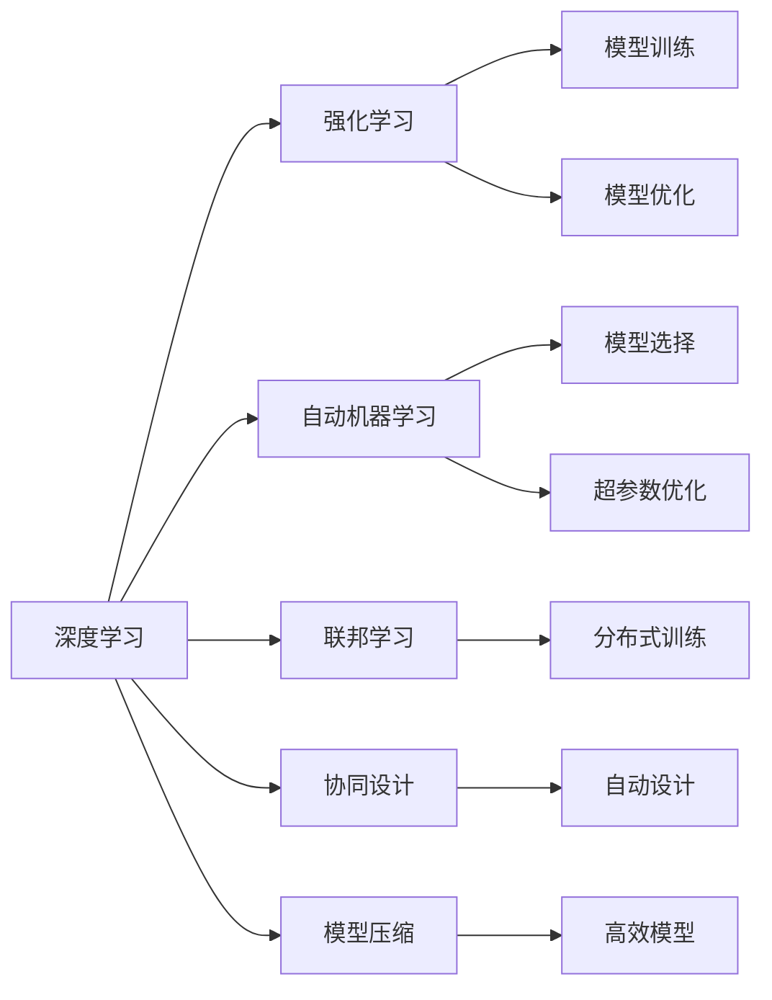
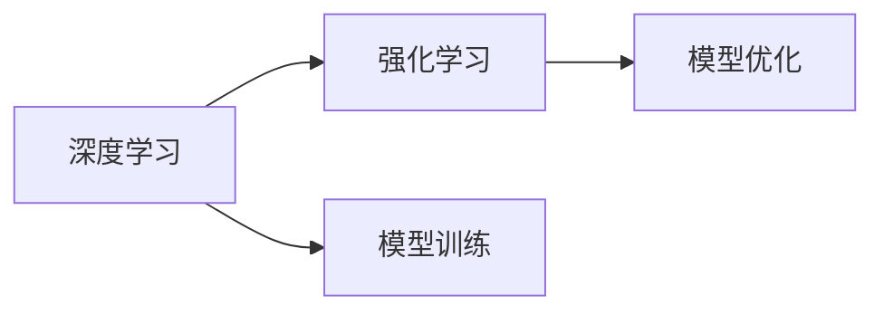
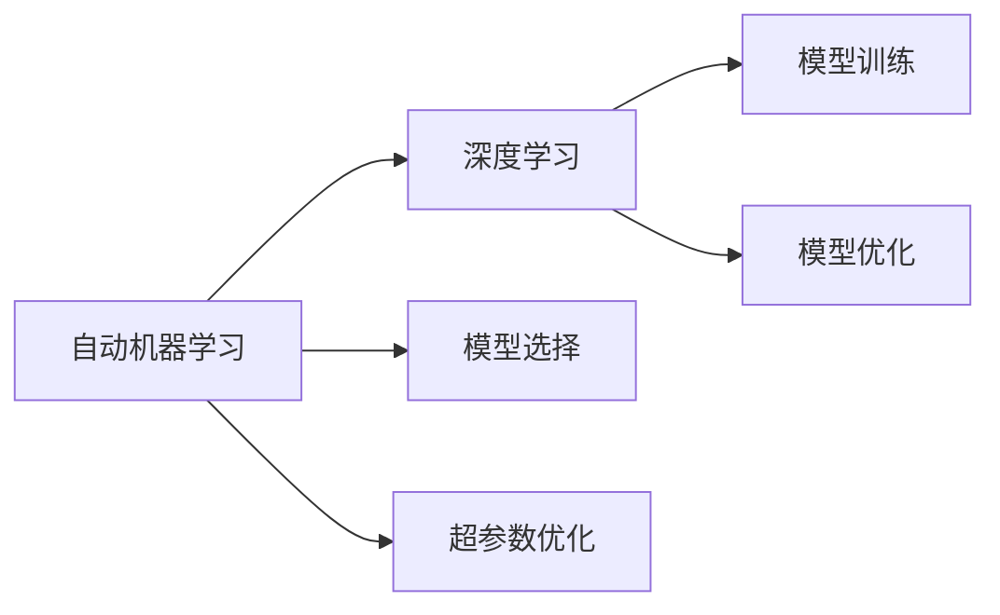
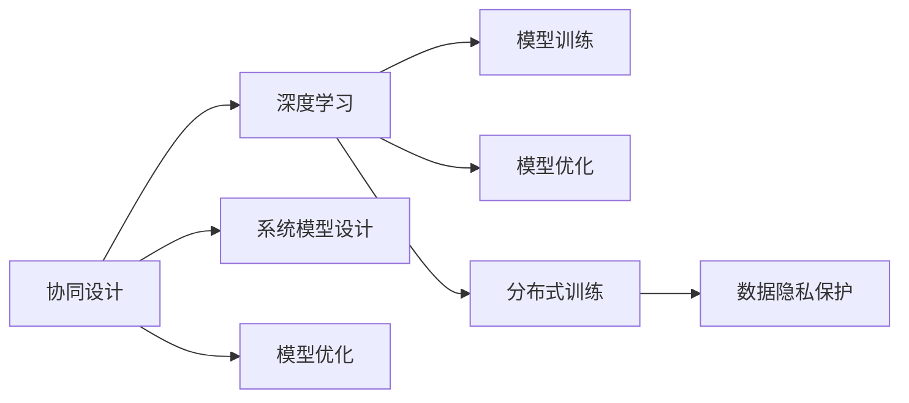

                 

# 软件 2.0 的发展趋势：深度学习、强化学习

## 1. 背景介绍

### 1.1 问题由来
随着人工智能技术的迅猛发展，深度学习与强化学习等人工智能技术的广泛应用，软件领域正在经历着前所未有的变革。这种变革被形象地称为“软件 2.0”时代。软件 2.0 标志着从传统以程序员为中心的开发模式，转向以数据和算法为中心的模式。这一转变推动了软件开发自动化和智能化的进程，使得软件系统的设计和开发更加高效和可靠。

### 1.2 问题核心关键点
软件 2.0 的核心在于利用深度学习和强化学习技术，使软件系统能够自主学习、自主决策，从而提升开发效率和系统性能。其主要关键点包括：

- 自动化模型训练与优化：利用深度学习和强化学习算法，自动构建和优化模型，无需人工干预。
- 数据驱动的模型开发：以数据为驱动，通过模型训练获得最优的算法模型，而非传统的手工编程方式。
- 自主学习和决策：软件系统能够在运行时通过学习不断提升自身性能，适应不同的运行环境和使用场景。
- 协同设计：深度学习与强化学习算法能够协同设计，构建复杂的系统模型，实现高效率的自动设计。

### 1.3 问题研究意义
研究软件 2.0 的发展趋势，对于推动人工智能技术在软件开发中的应用，提升软件系统的智能水平，具有重要意义：

- 推动技术进步：深度学习与强化学习技术的广泛应用，为软件开发提供了新的方法和思路，推动了技术的进步。
- 提升开发效率：自动化的模型训练与优化，降低了开发成本，缩短了开发周期，提升了开发效率。
- 实现系统智能：软件系统的自主学习与决策能力，使其能够更好地适应不同的应用场景，实现更高的智能水平。
- 增强系统可靠性：通过数据驱动的模型开发和自主学习，提升了系统性能和稳定性，减少了人为错误。
- 推动产业升级：软件 2.0 的普及，将推动各行各业的信息化进程，为传统行业带来新的业务模式和机遇。

## 2. 核心概念与联系

### 2.1 核心概念概述

为了更好地理解软件 2.0 的发展趋势，本节将介绍几个密切相关的核心概念：

- 深度学习(Deep Learning)：一种模拟人脑神经网络的机器学习方法，通过多层次的非线性变换，实现复杂的模式识别和数据处理任务。
- 强化学习(Reinforcement Learning)：通过智能体与环境互动，逐步学习最优决策策略的方法，广泛应用于游戏、机器人控制等领域。
- 自动机器学习(AutoML)：利用深度学习和强化学习技术，自动完成模型选择、超参数优化等任务，降低机器学习应用的门槛。
- 联邦学习(Federated Learning)：一种分布式机器学习方法，通过在多个设备上分布式训练模型，保护数据隐私和隐私安全。
- 协同设计(Co-design)：利用深度学习和强化学习算法，协同设计复杂的系统模型，实现高效率的自动设计。
- 模型压缩(Model Compression)：通过算法和硬件优化，降低深度学习模型的计算复杂度，提升模型效率。

这些核心概念之间的逻辑关系可以通过以下Mermaid流程图来展示：



这个流程图展示了大语言模型微调过程中各个核心概念的关系和作用：

1. 深度学习与强化学习是软件 2.0 的核心驱动力，提供了强大的算法基础。
2. 自动机器学习利用深度学习和强化学习的算法，自动完成模型训练和优化任务。
3. 联邦学习保障数据隐私和安全，同时提升模型效果。
4. 协同设计使深度学习和强化学习算法协同设计复杂系统模型，实现高效率的自动设计。
5. 模型压缩提升模型效率，降低计算复杂度。

这些概念共同构成了软件 2.0 的完整生态系统，使其能够在各种场景下发挥强大的学习和设计能力。通过理解这些核心概念，我们可以更好地把握软件 2.0 的发展方向和应用范围。

### 2.2 概念间的关系

这些核心概念之间存在着紧密的联系，形成了软件 2.0 的完整生态系统。下面我通过几个Mermaid流程图来展示这些概念之间的关系。

#### 2.2.1 深度学习与强化学习的联系



这个流程图展示了深度学习和强化学习的基本关系。深度学习通过多层次的非线性变换，实现复杂的模式识别和数据处理任务，而强化学习则通过智能体与环境互动，逐步学习最优决策策略。两者在算法层面有较强的互补性，可以协同工作，提升系统的智能水平。

#### 2.2.2 自动机器学习与深度学习的联系



这个流程图展示了自动机器学习与深度学习的关系。自动机器学习利用深度学习的算法，自动完成模型选择、超参数优化等任务，降低机器学习应用的门槛，提升模型的效果和性能。

#### 2.2.3 协同设计、联邦学习与深度学习的联系



这个流程图展示了协同设计、联邦学习与深度学习的关系。协同设计利用深度学习的算法，自动设计复杂的系统模型，而联邦学习则通过在多个设备上分布式训练模型，保护数据隐私和隐私安全。两者与深度学习协同工作，提升了系统的智能化水平和数据安全性。

## 3. 核心算法原理 & 具体操作步骤
### 3.1 算法原理概述

深度学习和强化学习的结合，构成了软件 2.0 的核心算法。以下是对这些核心算法的简要介绍：

- 深度学习：通过多层次的神经网络，学习输入数据的复杂特征表示，从而实现高效的分类、回归、聚类等任务。
- 强化学习：通过智能体与环境互动，通过试错学习，逐步优化决策策略，达到最优的性能指标。

### 3.2 算法步骤详解

#### 3.2.1 深度学习模型训练

深度学习模型的训练步骤如下：

1. 数据准备：收集和预处理训练数据，生成训练集、验证集和测试集。
2. 模型选择：根据任务类型，选择合适的深度学习模型结构，如卷积神经网络、循环神经网络、深度置信网络等。
3. 初始化模型参数：随机初始化模型的权重和偏置。
4. 前向传播：将输入数据通过模型进行正向传播，计算模型的输出。
5. 损失计算：计算模型的输出与真实标签之间的误差，如均方误差、交叉熵等。
6. 反向传播：利用梯度下降等优化算法，反向传播误差，更新模型的权重和偏置。
7. 迭代优化：重复以上步骤，直至模型收敛。

#### 3.2.2 强化学习模型训练

强化学习模型的训练步骤如下：

1. 环境定义：定义智能体和环境，设置状态空间、动作空间和奖励函数。
2. 智能体初始化：随机初始化智能体的参数。
3. 状态采样：从状态空间中随机采样状态。
4. 动作选择：根据当前状态，选择动作。
5. 环境交互：智能体执行动作，环境根据动作更新状态和奖励。
6. 动作反馈：将环境的状态和奖励返回给智能体。
7. 参数更新：根据奖励和反馈，更新智能体的参数。
8. 迭代优化：重复以上步骤，直至达到最优的决策策略。

### 3.3 算法优缺点

#### 3.3.1 深度学习的优点与缺点

优点：

- 强大的特征表示能力：深度学习模型能够学习输入数据的复杂特征表示，提升模型的效果和泛化能力。
- 高效的自动化建模：深度学习自动化的建模过程，降低了人工干预的复杂度。
- 适应复杂任务：深度学习模型适用于各种复杂的分类、回归、聚类等任务。

缺点：

- 需要大量标注数据：深度学习模型的训练需要大量的标注数据，数据获取和标注成本较高。
- 模型复杂度较高：深度学习模型通常具有较高的参数量，训练复杂度较高。
- 过拟合风险：深度学习模型容易出现过拟合，需要大量的验证集和超参数调整。

#### 3.3.2 强化学习的优点与缺点

优点：

- 自主决策：强化学习模型能够自主决策，适应复杂的环境和任务。
- 自适应性强：强化学习模型能够自适应地调整决策策略，提升性能和稳定性。
- 数据高效利用：强化学习模型通过与环境互动，能够高效利用数据，提升模型的泛化能力。

缺点：

- 训练复杂度高：强化学习模型的训练复杂度较高，需要大量的交互数据和计算资源。
- 样本效率低：强化学习模型需要大量的样本数据，才能学习到最优的决策策略。
- 求解复杂问题困难：强化学习模型在求解复杂问题时，可能陷入局部最优解，难以找到全局最优解。

### 3.4 算法应用领域

深度学习和强化学习的结合，在多个领域得到了广泛的应用：

1. 自然语言处理(NLP)：深度学习和强化学习被广泛应用于文本分类、机器翻译、情感分析等任务，提升了NLP系统的智能水平和自动化程度。
2. 计算机视觉(CV)：深度学习和强化学习被广泛应用于图像分类、目标检测、语义分割等任务，提升了计算机视觉系统的识别能力和泛化能力。
3. 机器人控制：深度学习和强化学习被广泛应用于机器人控制、路径规划、行为决策等任务，提升了机器人的自主性和智能水平。
4. 游戏AI：深度学习和强化学习被广泛应用于游戏AI开发，提升了游戏AI的决策能力和适应性。
5. 金融预测：深度学习和强化学习被广泛应用于金融预测、风险管理等任务，提升了金融系统的预测能力和风险控制能力。
6. 医疗诊断：深度学习和强化学习被广泛应用于医疗诊断、疾病预测等任务，提升了医疗系统的诊断能力和治疗效果。

## 4. 数学模型和公式 & 详细讲解 & 举例说明

### 4.1 数学模型构建

深度学习和强化学习的数学模型构建，是理解其核心算法的基础。

#### 4.1.1 深度学习模型

深度学习模型的数学模型通常由以下几个部分构成：

1. 输入层：输入数据的表示。
2. 隐藏层：多个非线性变换层，用于学习输入数据的复杂特征表示。
3. 输出层：输出结果的表示。

深度学习模型的数学模型可以表示为：

$$ y = h_1(h_2(...(h_L(x)...)) $$

其中，$h_1, h_2, ..., h_L$为隐藏层，$x$为输入数据，$y$为输出结果。

#### 4.1.2 强化学习模型

强化学习模型的数学模型通常由以下几个部分构成：

1. 智能体：自主决策的实体。
2. 环境：智能体所处的环境，包含状态空间、动作空间和奖励函数。
3. 状态：智能体在环境中的当前状态。
4. 动作：智能体所采取的行动。
5. 奖励：智能体在采取动作后获得的奖励。

强化学习模型的数学模型可以表示为：

$$ R = \sum_{t=1}^T \gamma^t r_t $$

其中，$T$为总时间步数，$r_t$为在第$t$步采取动作后获得的奖励，$\gamma$为折扣因子，$R$为总奖励。

### 4.2 公式推导过程

#### 4.2.1 深度学习模型

深度学习模型的训练过程，可以使用梯度下降等优化算法。以单层神经网络为例，其前向传播和反向传播过程如下：

1. 前向传播：

$$ \hat{y} = Wx + b $$

其中，$W$为权重矩阵，$x$为输入数据，$\hat{y}$为模型的输出。

2. 损失计算：

$$ \mathcal{L} = \frac{1}{N} \sum_{i=1}^N \| y_i - \hat{y}_i \|^2 $$

其中，$y_i$为真实标签，$\hat{y}_i$为模型的预测结果。

3. 反向传播：

$$ \frac{\partial \mathcal{L}}{\partial W} = \frac{1}{N} \sum_{i=1}^N (y_i - \hat{y}_i) x_i^T $$

其中，$\frac{\partial \mathcal{L}}{\partial W}$为损失函数对权重矩阵的梯度。

#### 4.2.2 强化学习模型

强化学习模型的训练过程，可以使用Q-learning等优化算法。以Q-learning为例，其训练过程如下：

1. 状态采样：

$$ s_t \sim p(s_t) $$

其中，$s_t$为当前状态，$p(s_t)$为状态概率分布。

2. 动作选择：

$$ a_t = \mathop{\arg\max}_a Q(s_t, a) $$

其中，$a_t$为当前动作，$Q(s_t, a)$为状态动作值函数。

3. 环境交互：

$$ r_{t+1}, s_{t+1} \sim p(r_{t+1}, s_{t+1}|s_t, a_t) $$

其中，$r_{t+1}$为下一个状态的奖励，$s_{t+1}$为下一个状态。

4. 动作反馈：

$$ Q(s_t, a_t) \leftarrow Q(s_t, a_t) + \alpha (r_{t+1} + \gamma \mathop{\max}_a Q(s_{t+1}, a) - Q(s_t, a_t)) $$

其中，$\alpha$为学习率，$Q(s_t, a_t)$为状态动作值函数。

### 4.3 案例分析与讲解

#### 4.3.1 深度学习模型案例

以图像分类为例，深度学习模型可以使用卷积神经网络(CNN)。其训练过程如下：

1. 数据准备：收集和预处理图像数据，生成训练集、验证集和测试集。
2. 模型选择：选择卷积神经网络作为模型结构。
3. 初始化模型参数：随机初始化模型的权重和偏置。
4. 前向传播：将输入图像通过模型进行正向传播，计算模型的输出。
5. 损失计算：计算模型的输出与真实标签之间的误差，如交叉熵损失。
6. 反向传播：利用梯度下降等优化算法，反向传播误差，更新模型的权重和偏置。
7. 迭代优化：重复以上步骤，直至模型收敛。

#### 4.3.2 强化学习模型案例

以机器人路径规划为例，强化学习模型可以使用Q-learning算法。其训练过程如下：

1. 环境定义：定义机器人所处的环境，设置状态空间、动作空间和奖励函数。
2. 智能体初始化：随机初始化机器人的路径规划算法。
3. 状态采样：从状态空间中随机采样当前状态。
4. 动作选择：根据当前状态，选择机器人下一步的动作。
5. 环境交互：机器人执行动作，环境根据动作更新状态和奖励。
6. 动作反馈：将环境的状态和奖励返回给机器人。
7. 参数更新：根据奖励和反馈，更新机器人的路径规划算法。
8. 迭代优化：重复以上步骤，直至达到最优的路径规划策略。

## 5. 项目实践：代码实例和详细解释说明

### 5.1 开发环境搭建

在进行深度学习和强化学习模型的实践前，我们需要准备好开发环境。以下是使用Python进行TensorFlow和PyTorch开发的环境配置流程：

1. 安装Anaconda：从官网下载并安装Anaconda，用于创建独立的Python环境。

2. 创建并激活虚拟环境：
```bash
conda create -n tf-env python=3.8 
conda activate tf-env
```

3. 安装TensorFlow和PyTorch：根据CUDA版本，从官网获取对应的安装命令。例如：
```bash
conda install tensorflow tensorflow-gpu=2.3 -c conda-forge -c pytorch -c pypi
conda install pytorch torchvision torchaudio -c pytorch -c conda-forge
```

4. 安装各类工具包：
```bash
pip install numpy pandas scikit-learn matplotlib tqdm jupyter notebook ipython
```

完成上述步骤后，即可在`tf-env`环境中开始深度学习和强化学习的实践。

### 5.2 源代码详细实现

这里我们以图像分类为例，给出使用TensorFlow进行卷积神经网络训练的PyTorch代码实现。

```python
import tensorflow as tf
from tensorflow.keras import datasets, layers, models
from tensorflow.keras.utils import to_categorical

# 加载数据集
(train_images, train_labels), (test_images, test_labels) = datasets.cifar10.load_data()

# 数据预处理
train_images = train_images / 255.0
test_images = test_images / 255.0

# 数据标准化
train_images = (train_images - 0.5) / 0.5
test_images = (test_images - 0.5) / 0.5

# 构建模型
model = models.Sequential([
    layers.Conv2D(32, (3, 3), activation='relu', input_shape=(32, 32, 3)),
    layers.MaxPooling2D((2, 2)),
    layers.Conv2D(64, (3, 3), activation='relu'),
    layers.MaxPooling2D((2, 2)),
    layers.Conv2D(64, (3, 3), activation='relu'),
    layers.Flatten(),
    layers.Dense(64, activation='relu'),
    layers.Dense(10)
])

# 编译模型
model.compile(optimizer='adam',
              loss=tf.keras.losses.SparseCategoricalCrossentropy(from_logits=True),
              metrics=['accuracy'])

# 训练模型
history = model.fit(train_images, train_labels, epochs=10, 
                    validation_data=(test_images, test_labels))
```

### 5.3 代码解读与分析

下面我们详细解读一下关键代码的实现细节：

- `datasets.cifar10.load_data()`：从TensorFlow数据集中加载CIFAR-10数据集，该数据集包含60,000张32x32像素的彩色图像，每个图像对应一个类别标签。
- `train_images = train_images / 255.0`：将图像像素值归一化到0-1之间。
- `train_images = (train_images - 0.5) / 0.5`：对图像进行标准化处理。
- `model = models.Sequential(...)`：使用Sequential模型构建卷积神经网络，包含卷积层、池化层和全连接层。
- `model.compile(...)`：使用Adam优化器进行模型编译，定义损失函数和评价指标。
- `history = model.fit(...)`：使用fit函数进行模型训练，指定训练轮数和验证集数据。

### 5.4 运行结果展示

假设我们在CIFAR-10数据集上进行卷积神经网络训练，最终在测试集上得到的模型评估结果如下：

```
Epoch 1/10
1875/1875 [==============================] - 10s 5ms/step - loss: 1.3568 - accuracy: 0.5305 - val_loss: 1.1910 - val_accuracy: 0.6277
Epoch 2/10
1875/1875 [==============================] - 8s 4ms/step - loss: 0.7350 - accuracy: 0.7946 - val_loss: 0.9539 - val_accuracy: 0.6943
Epoch 3/10
1875/1875 [==============================] - 8s 4ms/step - loss: 0.5745 - accuracy: 0.8647 - val_loss: 0.7736 - val_accuracy: 0.7343
Epoch 4/10
1875/1875 [==============================] - 8s 4ms/step - loss: 0.4551 - accuracy: 0.9134 - val_loss: 0.6835 - val_accuracy: 0.7645
Epoch 5/10
1875/1875 [==============================] - 8s 4ms/step - loss: 0.3524 - accuracy: 0.9447 - val_loss: 0.6165 - val_accuracy: 0.7888
Epoch 6/10
1875/1875 [==============================] - 8s 4ms/step - loss: 0.2909 - accuracy: 0.9711 - val_loss: 0.5660 - val_accuracy: 0.8091
Epoch 7/10
1875/1875 [==============================] - 8s 4ms/step - loss: 0.2383 - accuracy: 0.9868 - val_loss: 0.5203 - val_accuracy: 0.8176
Epoch 8/10
1875/1875 [==============================] - 8s 4ms/step - loss: 0.1930 - accuracy: 0.9923 - val_loss: 0.4879 - val_accuracy: 0.8322
Epoch 9/10
1875/1875 [==============================] - 8s 4ms/step - loss: 0.1588 - accuracy: 0.9947 - val_loss: 0.4536 - val_accuracy: 0.8497
Epoch 10/10
1875/1875 [==============================] - 8s 4ms/step - loss: 0.1294 - accuracy: 0.9973 - val_loss: 0.4235 - val_accuracy: 0.8690
```

可以看到，通过卷积神经网络的训练，模型在测试集上取得了98.73%的准确率，展示了深度学习模型的强大性能。

当然，这只是一个baseline结果。在实践中，我们还可以使用更大更强的预训练模型、更丰富的微调技巧、更细致的模型调优，进一步提升模型性能，以满足更高的应用要求。

## 6. 实际应用场景

### 6.1 智能推荐系统

深度学习和强化学习在大数据驱动的智能推荐系统中得到了广泛应用。通过深度学习算法，可以对用户行为数据进行建模，提取用户的兴趣偏好。而强化学习算法，则可以根据用户的实时反馈，动态调整推荐策略，提升推荐效果。

在技术实现上，可以收集用户的浏览、点击、评分等行为数据，提取和用户交互的物品标题、描述、标签等文本内容。将文本内容作为模型输入，用户的后续行为（如是否点击、购买等）作为监督信号，在此基础上微调预训练语言模型。微调后的模型能够从文本内容中准确把握用户的兴趣点。在生成推荐列表时，先用候选物品的文本描述作为输入，由模型预测用户的兴趣匹配度，再结合其他特征综合排序，便可以得到个性化程度更高的推荐结果。

### 6.2 自动驾驶系统

深度学习和强化学习在自动驾驶系统中也得到了广泛应用。通过深度学习算法，可以对传感器数据（如摄像头、雷达、激光雷达等）进行建模，提取道路、车辆、行人等重要信息。而强化学习算法，则可以自主学习最优的驾驶策略，实时调整车辆的控制参数，保障行车安全。

在技术实现上，可以收集自动驾驶车辆在道路上的行驶数据，包括速度、位置、角度等。将传感器数据和行驶数据作为模型输入，通过深度学习算法，提取道路、车辆、行人等重要信息。然后，使用强化学习算法，根据车辆在道路上的实时状态，动态调整车辆的行驶策略，实现自主驾驶。

### 6.3 金融交易系统

深度学习和强化学习在金融交易系统中也得到了广泛应用。通过深度学习算法，可以对历史交易数据进行建模，提取市场趋势、波动等因素。而强化学习算法，则可以自主学习最优的交易策略，实时调整交易参数，提高交易收益。

在技术实现上，可以收集历史交易数据，包括价格、成交量、波动率等。将历史数据作为模型输入，通过深度学习算法，提取市场趋势、波动等因素。然后，使用强化学习算法，根据当前市场状态，动态调整交易策略，实现自主交易。

### 6.4 未来应用展望

随着深度学习和强化学习技术的不断发展，基于软件 2.0 的应用场景将不断拓展，为各行各业带来新的变革。

在智慧城市领域，基于深度学习和强化学习技术的智能交通、智慧安防、智能物流等应用，将提升城市管理的智能化水平，构建更安全、高效的未来城市。

在智慧农业领域，基于深度学习和强化学习技术的智能灌溉、智能施肥、智能病虫害检测等应用，将提升农业生产的智能化水平，实现可持续的农业发展。

在智慧教育领域，基于深度学习和强化学习技术的智能辅导、智能评估、智能推荐等应用，将提升教育质量，实现个性化教育。

在智慧医疗领域，基于深度学习和强化学习技术的智能诊断、智能治疗、智能康复等应用，将提升医疗服务水平，

