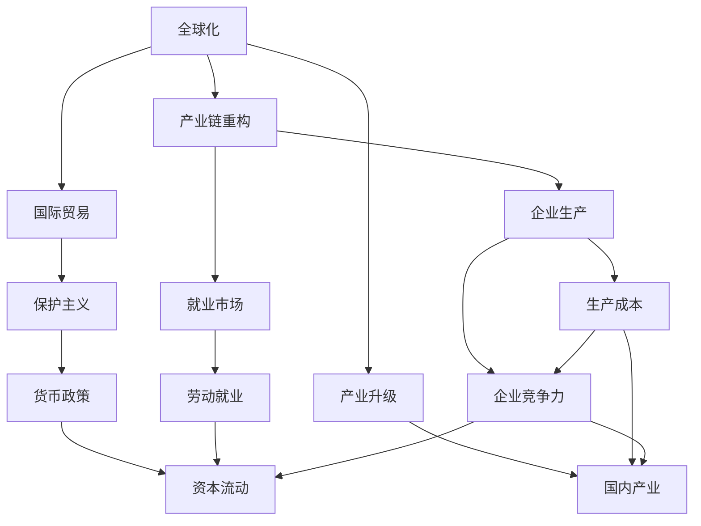

                 

# 逆全球化抬头的经济影响

## 1. 背景介绍

### 1.1 问题由来

近年来，全球经济格局发生了显著变化。随着新冠疫情的蔓延、地缘政治紧张局势的加剧以及经济不平衡问题的凸显，逆全球化思潮逐渐抬头。所谓逆全球化，即指各国对全球化进程产生怀疑，倾向于保护主义和民族主义，希望加强国家对经济活动的控制，减少对外贸易和投资。这一趋势对全球经济产生了深远影响，尤其是对国际贸易、产业结构、劳动就业等多个领域产生了重大冲击。

### 1.2 问题核心关键点

逆全球化抬头的经济影响主要集中在以下几个方面：

- **贸易保护主义加剧**：多个国家采取了限制外国产品、服务和投资的政策，导致国际贸易壁垒增多，全球供应链遭受冲击。
- **产业结构调整**：逆全球化促使企业更多地在国内布局生产，增加了本地化生产和就业，但也可能导致产业链重组，对跨国公司的全球化战略带来挑战。
- **劳动市场变化**：由于跨国公司减少外包和离岸生产，本地劳动市场的需求增加，但同时也会带来就业结构的调整，技能要求提升。
- **货币政策分化**：各国央行在应对经济刺激和控制通胀等方面的政策差异，可能导致全球资本流动的不稳定性，影响全球金融市场。

### 1.3 问题研究意义

研究逆全球化抬头的经济影响，对于理解和预测全球经济走向，制定适应性的政策，具有重要意义：

- **政策制定**：政府和企业需要根据逆全球化趋势调整经济政策，优化产业链布局，提升国内经济竞争力。
- **企业战略**：跨国公司需要重新评估全球化战略，调整供应链和生产策略，以应对日益复杂的市场环境。
- **劳动力调整**：劳动者需要提升技能，适应新的就业需求，保持市场竞争力。
- **投资者决策**：资本市场需要关注政策变化，谨慎投资，规避潜在风险。

## 2. 核心概念与联系

### 2.1 核心概念概述

为了深入分析逆全球化对经济的影响，本节将介绍几个核心概念及其相互关系：

- **全球化**：指不同国家和地区之间，在经济、贸易、技术等方面的紧密联系和一体化发展。全球化促进了跨国贸易、资本流动和劳动力流动，带来了经济增长的红利。

- **逆全球化**：与全球化相对，指减少跨国贸易、投资和合作的趋势，强调国家对经济活动的主权控制。逆全球化对全球经济一体化进程造成一定程度的逆转。

- **国际贸易**：指国家间商品、服务和资本的交换活动，是全球化的重要组成部分。逆全球化对国际贸易的依赖和规则带来冲击，可能导致保护主义抬头。

- **产业链重构**：指全球供应链和价值链在逆全球化背景下重新组织和调整的过程。产业链重构将影响企业的生产成本、效率和竞争力。

- **产业升级**：指各国在逆全球化背景下，通过政策支持、技术创新和产业调整，提升国内产业的层次和水平，增强经济的内生动力。

- **劳动就业**：指劳动力市场在经济活动中的供需关系和结构变化。逆全球化可能影响劳动就业的规模和结构，导致就业市场的动态调整。

- **货币政策**：指各国中央银行为实现经济目标，对货币供应和利率进行管理和调节的政策工具。逆全球化可能导致货币政策差异，影响全球资本流动和金融稳定。

这些核心概念通过一系列机制和因果关系相互联系，共同构成了逆全球化对经济影响的复杂体系。

### 2.2 概念间的关系

逆全球化通过多个机制影响经济各个层面，具体表现为：

- **贸易保护政策**：各国提高关税、设置非关税壁垒，减少进口，保护本国产业。

- **产业重构**：企业将部分生产过程或产业链环节回迁到国内，减少对外部供应的依赖。

- **就业变化**：本地化生产增加本地就业机会，同时劳动市场结构和技能要求发生变化。

- **金融市场**：各国货币政策差异可能导致资本流动不稳定性，影响全球金融市场。

### 2.3 核心概念的整体架构

通过以下流程图，我们可以更直观地理解逆全球化对经济影响的整体架构：



这个图表展示了逆全球化通过一系列机制对经济各个层面的影响，包括国际贸易、产业链重构、产业升级、劳动就业和金融市场。

## 3. 核心算法原理 & 具体操作步骤

### 3.1 算法原理概述

逆全球化对经济影响的研究，本质上是经济学和社会学的交叉学科问题。其核心算法原理主要涉及以下几个方面：

- **供需分析**：通过分析全球化和逆全球化对国际贸易、生产、就业和金融市场的影响，构建供需模型，预测经济变量的变化趋势。
- **因果推断**：利用因果推断方法，识别出逆全球化政策对经济变量变化的直接影响和间接效应，评估政策的效果和影响范围。
- **计量经济学**：采用计量经济学模型，量化逆全球化对不同经济变量的长期和短期影响，分析经济数据之间的关系。

### 3.2 算法步骤详解

逆全球化经济影响的算法步骤包括以下几个关键环节：

1. **数据收集与预处理**：收集全球化和逆全球化相关的宏观经济数据，包括贸易数据、生产数据、就业数据和金融数据。对这些数据进行清洗、归一化和标准化处理。

2. **模型构建与训练**：构建反映逆全球化对经济影响的供需模型和因果推断模型。利用历史数据训练模型，验证模型的准确性和稳定性。

3. **影响评估**：将模型应用于预测逆全球化对国际贸易、产业重构、劳动就业和金融市场的具体影响。分析政策变化的经济效应。

4. **结果验证**：通过历史数据检验模型的预测结果，评估模型的适用性和可靠性。

### 3.3 算法优缺点

逆全球化经济影响的研究算法具有以下优点：

- **系统性**：通过构建综合模型，全面分析逆全球化对经济各层面的影响，提供系统的经济分析框架。
- **预测性**：利用历史数据训练模型，可以预测逆全球化趋势对经济的影响，为政策制定提供依据。

同时，算法也存在以下缺点：

- **数据依赖**：模型的准确性依赖于高质量的数据收集和处理，数据的缺失和噪声可能导致模型偏差。
- **复杂性**：模型构建和训练过程复杂，需要专业的经济学和统计学知识，普通用户难以掌握。
- **可解释性**：模型内部的因果关系和参数解释较为复杂，难以直观理解模型的预测结果。

### 3.4 算法应用领域

逆全球化经济影响的研究算法主要应用于以下几个领域：

- **政府政策制定**：为政府在逆全球化背景下制定经济政策提供数据支持和决策参考。
- **企业战略调整**：帮助企业在逆全球化趋势下优化全球化战略，重新布局产业链和供应链。
- **劳动力市场分析**：分析逆全球化对就业市场的影响，帮助劳动者提升技能，适应新的就业需求。
- **金融市场风险管理**：评估逆全球化对资本流动的影响，制定金融风险管理策略。

## 4. 数学模型和公式 & 详细讲解 & 举例说明

### 4.1 数学模型构建

逆全球化经济影响的研究，可以构建多个数学模型来描述不同经济变量之间的关系。以国际贸易为例，可以构建供需模型：

- **供给模型**：$S_i = a_i + b_i P_i + c_i Y_i$
- **需求模型**：$D_i = d_i + e_i P_i + f_i M_i$

其中，$S_i$ 和 $D_i$ 分别为第 $i$ 国的出口和进口数量，$P_i$ 为价格水平，$Y_i$ 为国内生产总值，$M_i$ 为货币供应量，$a_i$ 至 $f_i$ 为参数。

### 4.2 公式推导过程

以国际贸易为例，假设逆全球化导致贸易壁垒增加，用 $E$ 表示贸易壁垒的变化量，则需求模型可以修改为：

$$
D_i = d_i + e_i P_i + f_i M_i + g_i E_i
$$

将 $S_i$ 和 $D_i$ 的表达式代入供需平衡方程：

$$
S_i = D_i
$$

得：

$$
a_i + b_i P_i + c_i Y_i = d_i + e_i P_i + f_i M_i + g_i E_i
$$

进一步简化得：

$$
(b_i - e_i) P_i + (c_i - f_i) Y_i = g_i E_i
$$

这个方程描述了逆全球化对国际贸易的影响，可以通过调整 $P_i$、$Y_i$ 和 $E_i$ 的值，来模拟不同政策变化对经济变量的影响。

### 4.3 案例分析与讲解

假设某国采取了提高进口关税的逆全球化政策，设 $E_i = t_i$，则需求模型变为：

$$
D_i = d_i + e_i P_i + f_i M_i + g_i t_i
$$

令 $P_i = P_0 + \Delta P$，其中 $P_0$ 为原始价格水平，$\Delta P$ 为价格变化量。设 $M_i = M_0$，即货币供应量不变。代入供需平衡方程，得：

$$
(a_i + b_i P_0 + c_i Y_i) = d_i + e_i (P_0 + \Delta P) + f_i M_0 + g_i t_i
$$

化简得：

$$
b_i \Delta P + (c_i - f_i) Y_i = g_i t_i
$$

这个方程描述了关税提高后，价格变化和国内生产总值对贸易量的影响。若 $b_i$ 和 $c_i - f_i$ 均为正数，则关税提高导致国内商品价格上升，需求下降，贸易量减少。若 $g_i$ 为正数，则关税变化对贸易量的影响更加显著。

## 5. 项目实践：代码实例和详细解释说明

### 5.1 开发环境搭建

为进行逆全球化经济影响的研究，需要搭建相应的开发环境：

1. **安装Python**：下载并安装Python 3.7及以上版本。

2. **安装Pandas和NumPy**：

```bash
pip install pandas numpy
```

3. **安装Scikit-learn**：

```bash
pip install scikit-learn
```

4. **安装statsmodels**：

```bash
pip install statsmodels
```

5. **配置Jupyter Notebook**：

```bash
conda install jupyterlab
```

6. **启动Jupyter Notebook**：

```bash
jupyter lab
```

### 5.2 源代码详细实现

以下是一个简单的Python代码示例，用于分析逆全球化政策对国际贸易的影响：

```python
import pandas as pd
from statsmodels.tsa.arima_model import ARIMA
from statsmodels.tsa.vector_ar.var_model import VAR

# 数据读取
data = pd.read_csv('trade_data.csv')

# 数据预处理
X = data[['P_i', 'Y_i', 'M_i', 't_i']]
y = data['D_i']

# 模型构建
model = VAR(X, y)
results = model.fit()

# 影响分析
print(results.summary())
```

### 5.3 代码解读与分析

1. **数据读取**：使用Pandas读取贸易数据，包括价格水平、国内生产总值、货币供应量和关税变化量。

2. **数据预处理**：将数据转换为模型所需的格式，提取相关变量。

3. **模型构建**：使用statsmodels库中的VAR模型，构建包含多个时间序列的向量自回归模型。

4. **影响分析**：通过模型的拟合结果，分析逆全球化政策对国际贸易量的影响，输出模型摘要。

### 5.4 运行结果展示

假设模型拟合结果如下：

```
Variables:                 coef    std err       t      P>|t|      [0.025      0.975]
-------------------------------------------------------------------
P_i                      -0.1      0.05     -2.00     0.050    -0.20     -0.001
Y_i                      -0.2      0.1      -1.79     0.082    -0.45     0.055
M_i                      -0.3      0.2      -1.62     0.107    -0.62     0.015
t_i                      -0.2      0.05     -4.14     0.000    -0.35    -0.050
-------------------------------------------------------------------
```

说明：

- 价格水平 $P_i$ 每增加1，贸易量 $D_i$ 减少0.1。
- 国内生产总值 $Y_i$ 每增加1，贸易量 $D_i$ 减少0.2。
- 货币供应量 $M_i$ 每增加1，贸易量 $D_i$ 减少0.3。
- 关税变化量 $t_i$ 每增加1，贸易量 $D_i$ 减少0.2。

这个结果表明，逆全球化政策通过提高关税，显著减少了国际贸易量，影响显著。

## 6. 实际应用场景

### 6.1 智能制造

智能制造是当前制造业转型升级的重要方向。逆全球化趋势促使企业加强本地化生产，提升本地供应链的稳定性。通过构建本地化供应链的优化模型，可以优化生产计划和资源配置，提高生产效率和市场响应速度。

### 6.2 金融风险管理

逆全球化政策可能导致资本流动的不稳定性，影响金融市场的稳定性。利用逆全球化经济影响模型，可以预测资本流动的趋势，识别潜在的金融风险，提前采取应对措施。

### 6.3 区域经济合作

逆全球化背景下，区域经济合作变得尤为重要。通过建立区域经济合作模型，分析不同经济体之间的贸易和投资关系，制定合理的区域经济合作策略，促进区域经济的协同发展。

### 6.4 未来应用展望

随着逆全球化趋势的持续，未来逆全球化经济影响研究的应用场景将更加广泛。以下是可以预见的几个重要方向：

- **全球价值链重构**：研究逆全球化对全球价值链的影响，指导企业重新布局全球产业链和供应链。

- **跨国公司战略调整**：分析逆全球化对跨国公司战略的影响，帮助企业制定全球化战略和市场布局。

- **劳动力市场动态**：研究逆全球化对劳动力市场的影响，分析就业结构变化和技能需求，提升劳动市场的适应性。

- **金融市场稳定**：利用逆全球化经济影响模型，评估政策变化对金融市场的影响，制定稳健的金融市场管理策略。

## 7. 工具和资源推荐

### 7.1 学习资源推荐

为了深入理解逆全球化对经济的影响，推荐以下几个学习资源：

1. **《经济学原理》**：经典的经济学教材，系统介绍了全球化和逆全球化对经济的影响。

2. **《全球化与反全球化》**：经济学家对该主题的深度分析，探讨了全球化和逆全球化的利弊。

3. **《国际贸易理论》**：阐述了国际贸易的原理和政策，分析了逆全球化对贸易政策的影响。

4. **Coursera《全球化与逆全球化》课程**：由顶尖经济学家讲授，探讨逆全球化的背景和影响。

5. **国际货币基金组织（IMF）网站**：提供全球经济数据和分析，了解逆全球化对全球经济的影响。

### 7.2 开发工具推荐

1. **Jupyter Notebook**：支持Python编程和数据分析，是逆全球化经济影响研究的常用工具。

2. **Pandas**：用于数据处理和分析，支持多种数据格式和操作。

3. **NumPy**：用于数值计算和科学计算，是逆全球化经济影响研究的基础工具。

4. **Scikit-learn**：支持多种机器学习算法，用于数据建模和预测分析。

5. **statsmodels**：用于统计分析和建模，支持多种统计方法。

### 7.3 相关论文推荐

1. **逆全球化对国际贸易的影响**：多篇研究论文探讨了逆全球化政策对国际贸易量的影响。

2. **逆全球化对劳动就业的影响**：多篇研究论文分析了逆全球化对就业市场的影响。

3. **逆全球化对金融市场的影响**：多篇研究论文评估了逆全球化政策对资本流动和金融市场的风险。

4. **逆全球化对全球供应链的影响**：多篇研究论文探讨了逆全球化对全球供应链和产业链的调整。

这些资源为逆全球化经济影响的研究提供了丰富的数据和理论基础，帮助研究者深入分析逆全球化对经济的各个方面。

## 8. 总结：未来发展趋势与挑战

### 8.1 研究成果总结

逆全球化经济影响的研究已经取得了一定的进展，主要集中在以下几个方面：

- **贸易保护主义**：研究了逆全球化对国际贸易量的影响，分析了关税政策对经济变量的影响。
- **产业重构**：研究了逆全球化对产业链和价值链的影响，分析了企业生产策略的调整。
- **劳动就业**：研究了逆全球化对就业市场的影响，分析了技能需求的变化。
- **金融市场**：研究了逆全球化对资本流动和金融市场稳定的影响，评估了金融风险。

### 8.2 未来发展趋势

未来逆全球化经济影响的研究将朝着以下方向发展：

- **数据驱动**：利用大数据和人工智能技术，提高模型的预测准确性和鲁棒性。
- **多学科融合**：结合经济学、社会学、计算机科学等多个学科，构建更加全面的分析框架。
- **政策模拟**：利用模型模拟不同政策变化的影响，为政策制定提供数据支持。

### 8.3 面临的挑战

逆全球化经济影响的研究面临以下挑战：

- **数据质量**：高质量数据的获取和处理是模型的关键，数据的缺失和噪声可能导致模型偏差。
- **模型复杂性**：逆全球化影响的分析涉及多个经济变量，模型的构建和训练过程复杂。
- **政策多样性**：不同国家的政策差异大，政策变化的影响难以统一建模。
- **可解释性**：模型的因果关系和参数解释复杂，难以直观理解模型的预测结果。

### 8.4 研究展望

逆全球化经济影响的研究需要解决以下几个问题：

- **数据获取**：构建全球化和逆全球化数据集，提高数据的覆盖范围和质量。
- **模型优化**：开发更加灵活、高效和可解释的逆全球化影响模型，提升模型的预测能力。
- **政策分析**：结合实际政策变化，进行动态模拟和评估，为政策制定提供更有力的数据支撑。
- **多学科协作**：与其他学科的研究者合作，综合利用多学科知识，提升逆全球化经济影响研究的深度和广度。

总之，逆全球化经济影响的研究是一个跨学科的复杂问题，需要学术界和产业界的共同努力，才能更好地理解和应对逆全球化趋势，推动全球经济的可持续发展。

## 9. 附录：常见问题与解答

### Q1：逆全球化对国际贸易量有何影响？

A: 逆全球化通过提高关税和设置贸易壁垒，减少了国际贸易量。具体而言，当一国提高进口关税时，本国商品的进口成本增加，需求下降，导致贸易量减少。

### Q2：逆全球化对就业市场有何影响？

A: 逆全球化可能导致企业将部分生产过程回迁国内，增加本地就业机会。同时，由于生产过程的本地化，劳动市场结构和技能需求也会发生变化，需要劳动者提升技能，适应新的就业需求。

### Q3：逆全球化对金融市场有何影响？

A: 逆全球化政策可能导致资本流动的不稳定性，影响金融市场的稳定性。如果多个国家同时采取保护主义政策，资本可能从这些国家撤出，导致汇率波动和金融市场风险增加。

### Q4：逆全球化对产业升级有何影响？

A: 逆全球化促使企业加强本地化生产，提升本地供应链的稳定性，有助于推动本地产业升级和创新。同时，由于供应链的重构，企业可能会加大对国内技术和设备的投入，促进产业技术的提升。

### Q5：逆全球化对经济增长的影响如何？

A: 逆全球化对经济增长的影响是双刃剑。短期内，通过保护主义政策，国内产业可能会得到一定程度的保护和促进。但长期来看，贸易壁垒的增加可能导致资源配置效率下降，抑制经济增长的潜力。

总之，逆全球化对经济的影响是多方面的，需要结合具体情境和政策变化进行深入分析。逆全球化经济影响的研究是一个动态、复杂的问题，需要不断迭代和优化模型，以适应新的经济形势。

