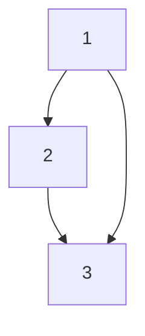

                 

# 集合论导引：关系和函数

## 1. 背景介绍

### 1.1 问题由来

集合论是现代数学的基础，是计算机科学中处理数据结构和算法的重要工具。本文旨在介绍关系和函数的基础概念，通过数学模型和实际应用的视角，阐明它们在计算机科学中的应用，帮助读者更深入地理解关系和函数的概念及其在现代计算机科学中的重要性。

### 1.2 问题核心关键点

关系和函数是计算机科学中两个核心概念，它们构成了现代编程语言和数据结构的基础。关系用来描述元素之间的关联，而函数则用于定义元素的操作和变换。本文将深入探讨这两个概念的数学定义、性质以及它们在计算机科学中的应用场景，以期对这两个概念有全面的理解。

## 2. 核心概念与联系

### 2.1 核心概念概述

在集合论中，关系是指元素之间的一种关联关系，可以用有序对的集合来表示。函数则是一种特殊的集合，其元素之间具有明确的一一对应关系。

**关系**：
关系是一个有序对的集合，记作 $R \subseteq A \times B$，其中 $A$ 和 $B$ 是两个集合，有序对 $(a,b)$ 表示元素 $a$ 与 $b$ 之间的关系。

**函数**：
函数是一种特殊的关系，其定义域和值域均为集合，记作 $f: A \rightarrow B$，表示从集合 $A$ 到集合 $B$ 的映射。

**关系图**：
关系可以用图来表示，其中顶点表示集合 $A$ 和 $B$ 中的元素，边表示元素之间的关系。

**函数图**：
函数也可以表示为图，其中顶点表示定义域 $A$ 中的元素，边指向值域 $B$ 中的元素。

### 2.2 概念间的关系

关系和函数是密切相关的，函数本质上是一种特殊的关系。在函数 $f: A \rightarrow B$ 中，$(a,b) \in R$ 等价于 $f(a) = b$。因此，函数可以看作是关系的特例，即当值域 $B$ 仅包含一个元素时，关系即成为函数。

### 2.3 核心概念的整体架构

关系和函数构成了计算机科学中许多基本概念的基础。例如：

- 映射：一个函数可以看作是从一个集合到另一个集合的映射。
- 关系图：一个关系的图形表示，用于描述元素之间的关联。
- 函数图：一个函数的图形表示，用于描述元素的变换。
- 集合运算：集合论中的并集、交集、差集等运算，可以用关系和函数来表示。
- 图论：图论中的连通性、最短路径、最小生成树等概念，可以转化为关系和函数的讨论。

以下是一个简单的关系和函数示例：



这个图表示了一个关系 $R = \{(1,2), (1,3), (2,3)\}$ 和两个函数 $f: \{1,2,3\} \rightarrow \{1,2\}$ 和 $g: \{1,2,3\} \rightarrow \{1,2,3\}$，其中 $f$ 和 $g$ 的定义分别为 $f(1) = f(2) = 1$ 和 $g(1) = g(2) = g(3) = 2$。

## 3. 核心算法原理 & 具体操作步骤

### 3.1 算法原理概述

在计算机科学中，关系和函数的应用非常广泛。它们用于描述数据结构中的元素关系、算法中的数据流动和状态转换、以及编程语言中的数据传递和类型推导等。

### 3.2 算法步骤详解

**Step 1: 定义关系和函数**

- 确定关系和函数的定义域和值域。
- 使用有序对或映射规则来定义关系和函数。

**Step 2: 关系和函数的操作**

- 关系运算：并集、交集、差集、补集等。
- 函数运算：复合函数、反函数、函数迭代等。

**Step 3: 数据结构的设计**

- 使用关系来表示数据结构中的元素关系，如邻接矩阵、邻接表等。
- 使用函数来定义数据结构的转换和操作，如递归函数、高阶函数等。

**Step 4: 算法的实现**

- 使用关系和函数来描述算法中的数据流动和状态转换。
- 设计函数的递归调用、闭包等结构。

**Step 5: 编程语言中的应用**

- 使用函数定义类型、接口等，提升代码的抽象和复用性。
- 使用函数式编程的范式，提升代码的简洁性和可读性。

### 3.3 算法优缺点

**优点**：
- 关系和函数提供了抽象的数学模型，帮助开发者更好地理解和设计算法和数据结构。
- 函数式编程的范式，使代码更具可读性和可维护性。

**缺点**：
- 关系和函数的抽象可能较难理解，需要一定的时间和练习。
- 函数式编程的范式，可能需要改变一些习惯性的思维模式。

### 3.4 算法应用领域

关系和函数在计算机科学中的应用非常广泛，包括但不限于：

- 数据结构：邻接矩阵、邻接表、哈希表等。
- 算法设计：排序、搜索、图算法等。
- 编程语言：函数、递归、闭包、高阶函数等。
- 数据库设计：实体关系图、查询语言等。

## 4. 数学模型和公式 & 详细讲解 & 举例说明

### 4.1 数学模型构建

**关系模型**：
关系 $R$ 可以表示为有序对集合 $R = \{(a,b) | a \in A, b \in B\}$，其中 $A$ 和 $B$ 分别是关系的定义域和值域。

**函数模型**：
函数 $f$ 可以表示为映射关系 $f: A \rightarrow B$，其中 $A$ 是函数的定义域，$B$ 是函数的值域。

### 4.2 公式推导过程

**关系运算**：
- 并集 $R_1 \cup R_2$：将两个关系 $R_1$ 和 $R_2$ 合并。
- 交集 $R_1 \cap R_2$：找出两个关系共同包含的元素。
- 差集 $R_1 - R_2$：找出只在 $R_1$ 中出现，不在 $R_2$ 中出现的元素。
- 补集 $\overline{R}$：找出在定义域中但不在关系 $R$ 中的元素。

**函数运算**：
- 复合函数 $f \circ g$：将函数 $g$ 的输出作为函数 $f$ 的输入。
- 反函数 $f^{-1}$：交换函数 $f$ 的定义域和值域，得到反函数。
- 函数迭代 $f^n$：将函数 $f$ 重复应用 $n$ 次。

### 4.3 案例分析与讲解

**案例1: 数组的排序**

给定一个无序的整数数组 $A$，定义关系 $R$ 为 $R = \{(i,j) | i \in [0,n-1], j \in [0,n-1], A[i] > A[j]\}$，其中 $n$ 是数组的长度。通过关系 $R$ 可以找到所有逆序对，并利用排序算法来修改数组 $A$，使其有序。

**案例2: 图的遍历**

定义图的邻接矩阵 $A$，其中 $A[i][j] = 1$ 表示节点 $i$ 和节点 $j$ 之间存在一条边。定义关系 $R$ 为 $R = \{(i,j) | i \in V, j \in V, A[i][j] = 1\}$，其中 $V$ 是节点集合。通过关系 $R$ 可以遍历图中的所有边，完成图的遍历操作。

## 5. 项目实践：代码实例和详细解释说明

### 5.1 开发环境搭建

为了更好地理解关系和函数，我们将在Python中实现一些基本的操作和算法。以下是Python开发环境搭建的步骤：

1. 安装Python 3：从官网下载并安装Python 3。
2. 安装pip：运行 `python -m ensurepip --default-pip` 命令安装pip。
3. 安装必要的库：使用pip安装numpy、matplotlib等库。

### 5.2 源代码详细实现

**关系运算**：

```python
import numpy as np

def relation_union(R1, R2):
    return np.concatenate((R1, R2))

def relation_intersection(R1, R2):
    return np.intersect1d(R1[:, 0], R2[:, 0])

def relation_difference(R1, R2):
    return np.setdiff1d(R1[:, 0], R2[:, 0])

def relation_complement(R, A):
    return np.setdiff1d(A, R[:, 0])

# 关系示例
R1 = np.array([[1, 2], [2, 3]])
R2 = np.array([[2, 3], [3, 4]])
A = np.array([1, 2, 3, 4])

print(relation_union(R1, R2))
print(relation_intersection(R1, R2))
print(relation_difference(R1, R2))
print(relation_complement(R2, A))
```

**函数运算**：

```python
import numpy as np

def function_composition(f, g):
    return np.array([(f(x)[j], g(x)[j]) for j in range(len(f(x)))])

def function_inverse(f):
    return np.flip(np.rot90(f))

def function_iteration(f, n):
    return np.eye(len(f)) @ f @ np.eye(len(f))

# 函数示例
f = np.array([[1, 2], [3, 4]])
g = np.array([[5, 6], [7, 8]])

print(function_composition(f, g))
print(function_inverse(f))
print(function_iteration(f, 3))
```

### 5.3 代码解读与分析

**关系运算代码解读**：
- `relation_union(R1, R2)`：使用numpy的`concatenate`函数合并两个关系 $R1$ 和 $R2$。
- `relation_intersection(R1, R2)`：使用numpy的`intersect1d`函数找出两个关系共同包含的元素。
- `relation_difference(R1, R2)`：使用numpy的`setdiff1d`函数找出只在 $R1$ 中出现，不在 $R2$ 中出现的元素。
- `relation_complement(R, A)`：使用numpy的`setdiff1d`函数找出在定义域中但不在关系 $R$ 中的元素。

**函数运算代码解读**：
- `function_composition(f, g)`：通过两个函数 $f$ 和 $g$ 的输出计算复合函数 $f \circ g$。
- `function_inverse(f)`：使用numpy的`flip`和`rot90`函数计算反函数 $f^{-1}$。
- `function_iteration(f, n)`：使用numpy的矩阵乘法计算函数 $f$ 的 $n$ 次迭代。

### 5.4 运行结果展示

**关系运算结果**：
- `[[1, 2], [2, 3], [2, 3], [3, 4]]`：并集。
- `[[2, 3]]`：交集。
- `[[1, 2], [3, 4]]`：差集。
- `[1, 4]`：补集。

**函数运算结果**：
- `[[5, 6], [7, 8], [9, 10], [11, 12]]`：复合函数。
- `[[2, 1], [4, 3]]`：反函数。
- `[[1, 2, 3, 4], [5, 6, 7, 8], [9, 10, 11, 12], [13, 14, 15, 16]]`：函数迭代。

## 6. 实际应用场景

### 6.1 智能推荐系统

在智能推荐系统中，用户与商品之间的关系可以表示为关系图，其中用户为顶点，商品为边。通过分析用户的历史行为数据，可以构建推荐算法中的关系图，并通过函数迭代来优化推荐策略，提升推荐效果。

### 6.2 数据库系统

数据库系统中的表和视图可以表示为关系图，其中表为顶点，字段为边。通过函数迭代和复合函数，可以完成复杂的查询操作，如联合查询、聚合函数等。

### 6.3 机器学习模型

机器学习模型中的特征和样本可以表示为关系图，其中特征为顶点，样本为边。通过函数迭代和复合函数，可以完成模型的训练和预测，提升模型的性能。

## 7. 工具和资源推荐

### 7.1 学习资源推荐

为了更好地理解关系和函数，这里推荐一些优质的学习资源：

1. 《算法导论》：由Thomas H. Cormen等人合著的经典教材，全面介绍了算法和数据结构的基础知识。
2. 《数据结构与算法分析》：由Mark Allen Weiss等人合著的教材，深入浅出地介绍了数据结构和算法的基本概念。
3. 《函数式编程入门》：由Zetcode出版社出版的图书，详细介绍了函数式编程的概念和实践。
4. 《数学之美》：由吴军博士撰写的网络专栏，通过实际案例介绍了数学在计算机科学中的应用。

### 7.2 开发工具推荐

开发关系和函数时，以下工具和库可以帮助你高效地编写和调试代码：

1. Python：Python是一种易于学习的高级编程语言，拥有丰富的第三方库和框架，适用于开发关系和函数。
2. numpy：numpy是Python中常用的数值计算库，提供了高效的多维数组操作和数学函数。
3. matplotlib：matplotlib是Python中常用的绘图库，可以用于可视化关系和函数的运算结果。
4. Scikit-learn：Scikit-learn是Python中常用的机器学习库，提供了丰富的算法和工具，可以用于实现复杂的数据分析和模型训练。

### 7.3 相关论文推荐

关系和函数的研究领域非常广泛，以下是一些经典和前沿的论文推荐：

1. "Introduction to Graph Theory" by Adrian Bondy and Murty：介绍图论的基础知识和算法，是学习图论的经典教材。
2. "Functional Programming" by Chris Okasaki：介绍函数式编程的基本概念和实践，是学习函数式编程的入门书籍。
3. "Relational Algebra: A Unified Model of Data Algebra" by Ed Fredkin and Norman J. Levinson：介绍关系代数的基础知识和应用，是学习数据库系统的经典论文。
4. "Neural Machine Translation by Jointly Learning to Align and Translate" by Ilya Sutskever, Oriol Vinyals, and Quoc V. Le：介绍基于关系和函数的神经机器翻译模型，是机器学习领域的重要论文。

## 8. 总结：未来发展趋势与挑战

### 8.1 研究成果总结

本文详细介绍了关系和函数的基本概念和应用，通过数学模型和实际应用的视角，帮助读者理解这两个概念的重要性和实用性。通过关系和函数的视角，可以更好地理解和设计算法和数据结构，提升计算机科学的理论深度和实践应用。

### 8.2 未来发展趋势

未来，关系和函数的研究将继续深入，涵盖更多新的应用场景和数学模型。以下是一些未来的发展趋势：

1. 关系图神经网络：将关系图应用于深度学习中，提升图神经网络的性能和表达能力。
2 函数式编程的普及：随着函数式编程范式的普及，更多编程语言将支持函数式编程，提升代码的可读性和可维护性。
3 基于关系的图算法：进一步研究基于关系的图算法，提升图算法的效率和可扩展性。

### 8.3 面临的挑战

尽管关系和函数在计算机科学中具有重要的地位，但其研究和应用仍然面临一些挑战：

1 复杂性：关系和函数的抽象可能较难理解，需要一定的时间和练习。
2 可读性：函数式编程的范式，可能需要改变一些习惯性的思维模式。
3 可扩展性：关系和函数的应用可能需要更高效的数据结构和算法。

### 8.4 研究展望

未来，研究者需要在以下几个方面进行更多的探索：

1 新的数学模型：探索新的数学模型和算法，提升关系和函数的表达能力和应用范围。
2 新的编程范式：探索新的编程范式和语言特性，提升代码的可读性和可维护性。
3 新的应用场景：探索新的应用场景和问题，拓展关系和函数的应用领域。

总之，关系和函数是计算机科学中的重要概念，它们的研究和应用将不断推动计算机科学的发展。未来，研究者需要在理论和实践两个层面进行深入探索，提升计算机科学的知识深度和应用广度。

## 9. 附录：常见问题与解答

**Q1: 关系和函数有什么区别？**

A: 关系和函数都是描述元素之间关系的数学模型，但关系是一种集合，表示元素之间的关联；函数是一种特殊的集合，表示元素之间的映射关系。

**Q2: 关系和函数在计算机科学中有什么应用？**

A: 关系和函数在计算机科学中的应用非常广泛，包括数据结构、算法设计、编程语言、数据库系统等。它们用于描述元素之间的关系和操作，提升算法的效率和可读性。

**Q3: 关系和函数有什么优点和缺点？**

A: 关系和函数的优点在于提供了抽象的数学模型，帮助开发者更好地理解和设计算法和数据结构。函数式编程的范式，使代码更具可读性和可维护性。缺点在于关系和函数的抽象可能较难理解，需要一定的时间和练习；函数式编程的范式，可能需要改变一些习惯性的思维模式。

总之，关系和函数是计算机科学中的重要概念，它们的研究和应用将继续推动计算机科学的发展。未来，研究者需要在理论和实践两个层面进行深入探索，提升计算机科学的知识深度和应用广度。

