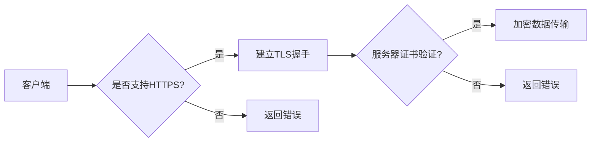

# 合规要求：使用 HTTPS

> 关键词：HTTPS, 网络安全, 数据加密, SSL/TLS, 合规性, 隐私保护, 安全协议

## 1. 背景介绍

在互联网时代，数据传输的安全性已成为企业和个人关注的焦点。HTTPS（超文本传输安全协议）作为一种广泛使用的安全协议，已经成为保护网站数据传输安全的基石。本文将深入探讨HTTPS的原理、应用以及未来发展趋势，帮助读者理解其重要性并掌握合规使用HTTPS的实践方法。

### 1.1 问题的由来

随着网络攻击手段的日益复杂，数据泄露、隐私侵犯等安全问题日益突出。传统的HTTP协议在传输过程中，数据以明文形式传输，容易被黑客截获和篡改。为了保障数据传输的安全，HTTPS协议应运而生。

### 1.2 研究现状

目前，全球范围内的网站和应用都在逐步向HTTPS协议迁移。许多国家和地区也出台了相关法规，要求企业必须使用HTTPS协议来保护用户数据。例如，欧盟的GDPR（通用数据保护条例）和美国加州的CCPA（加州消费者隐私法案）都对数据安全提出了严格的要求。

### 1.3 研究意义

使用HTTPS协议不仅能够保护用户数据安全，还能提升网站信誉，增强用户信任。对于企业和个人来说，合规使用HTTPS具有重要的现实意义：

- **保护用户隐私**：防止用户数据在传输过程中被窃取和篡改。
- **防止中间人攻击**：阻止攻击者拦截和篡改数据。
- **提升网站信誉**：增强用户对网站的信任感，提高用户粘性。
- **符合法律法规**：满足国内外数据安全法规的要求。

### 1.4 本文结构

本文将围绕以下内容展开：

- HTTPS的核心概念与联系
- HTTPS的核心算法原理与操作步骤
- HTTPS的数学模型和公式
- HTTPS的项目实践
- HTTPS的实际应用场景
- HTTPS的未来发展趋势与挑战
- HTTPS的工具和资源推荐
- HTTPS的总结与展望

## 2. 核心概念与联系

### 2.1 HTTPS协议架构

HTTPS协议在HTTP协议的基础上，加入了SSL/TLS协议来保证数据传输的安全性。以下是一个简化的HTTPS协议架构流程图：



### 2.2 核心概念

- **HTTP（超文本传输协议）**：用于在客户端和服务器之间传输超文本文档的协议。
- **HTTPS（超文本传输安全协议）**：在HTTP协议的基础上，加入SSL/TLS协议，对传输的数据进行加密和解密，确保数据传输的安全性。
- **SSL（安全套接层）**：一种常用的安全协议，用于在两个通信系统之间建立一个加密的连接。
- **TLS（传输层安全性协议）**：SSL的继任者，提供了比SSL更高级的安全功能。
- **数字证书**：用于验证服务器身份的电子文件，由可信的第三方颁发。

## 3. 核心算法原理 & 具体操作步骤

### 3.1 算法原理概述

HTTPS协议主要通过以下步骤实现数据加密和身份验证：

1. **TLS握手**：客户端和服务器通过TLS握手过程建立安全的连接。
2. **证书验证**：客户端验证服务器数字证书的真实性。
3. **加密通信**：客户端和服务器使用协商好的加密算法和密钥进行加密通信。

### 3.2 算法步骤详解

以下是HTTPS协议的具体操作步骤：

1. **客户端发送请求**：客户端向服务器发送HTTP请求，同时携带支持的TLS版本和加密算法列表。
2. **服务器响应请求**：服务器选择一个与客户端兼容的TLS版本和加密算法，并生成随机数用于后续的密钥交换。
3. **客户端验证证书**：客户端使用服务器提供的证书进行验证，确保服务器身份的真实性。
4. **生成会话密钥**：客户端和服务器使用随机数和预共享密钥（如果有的话）生成会话密钥。
5. **加密数据传输**：客户端和服务器使用会话密钥对数据进行加密和解密，确保数据传输的安全性。

### 3.3 算法优缺点

**优点**：

- **安全性**：通过数据加密和身份验证，有效防止数据泄露和中间人攻击。
- **兼容性**：与HTTP协议兼容，易于部署和维护。
- **普及性**：全球范围内的浏览器和服务器都支持HTTPS协议。

**缺点**：

- **性能开销**：加密和解密过程需要消耗一定的计算资源，可能会影响网站性能。
- **证书成本**：购买和维护数字证书需要一定的成本。

### 3.4 算法应用领域

HTTPS协议广泛应用于以下领域：

- 网上银行
- 购物网站
- 在线支付
- 社交媒体平台
- 企业内部系统

## 4. 数学模型和公式 & 详细讲解 & 举例说明

### 4.1 数学模型构建

HTTPS协议中的数学模型主要包括以下几个方面：

- **非对称加密**：使用公钥和私钥进行加密和解密。
- **对称加密**：使用相同的密钥进行加密和解密。
- **散列函数**：将数据转换为固定长度的散列值，用于验证数据的完整性。

### 4.2 公式推导过程

以下是一个简单的非对称加密公钥加密和解密的公式推导：

**公钥加密**：

$$
c = E_k(p, k_p)
$$

其中，$c$ 为加密后的密文，$p$ 为待加密的明文，$k_p$ 为公钥。

**私钥解密**：

$$
p = D_k(c, k_s)
$$

其中，$p$ 为解密后的明文，$c$ 为加密后的密文，$k_s$ 为私钥。

### 4.3 案例分析与讲解

以下是一个HTTPS协议的简单示例：

1. **客户端请求加密连接**：客户端发送HTTP请求，并指定使用HTTPS协议。
2. **服务器响应请求**：服务器返回服务器证书，其中包含公钥和证书链。
3. **客户端验证证书**：客户端使用证书链验证服务器证书的真实性。
4. **生成会话密钥**：客户端和服务器使用Diffie-Hellman密钥交换协议生成会话密钥。
5. **加密数据传输**：客户端和服务器使用会话密钥对数据进行加密和解密。

## 5. 项目实践：代码实例和详细解释说明

### 5.1 开发环境搭建

为了演示HTTPS协议的使用，我们需要搭建一个简单的Web服务器和客户端。

1. 安装Python 3.6及以上版本。
2. 安装Flask框架：`pip install flask`
3. 安装PyOpenSSL库：`pip install pyopenssl`

### 5.2 源代码详细实现

以下是一个使用Flask框架和PyOpenSSL库实现的简单HTTPS服务器示例：

```python
from flask import Flask, request
from OpenSSL import SSL

app = Flask(__name__)

@app.route('/')
def index():
    return 'Hello, HTTPS!'

if __name__ == '__main__':
    context = SSL.Context(SSL.PROTOCOL_TLS_SERVER)
    context.load_cert_chain(certfile='cert.pem', keyfile='key.pem')
    app.run(ssl_context=context, host='0.0.0.0', port=443)
```

其中，`cert.pem` 为服务器证书文件，`key.pem` 为服务器私钥文件。

### 5.3 代码解读与分析

- `Flask` 框架：用于创建Web服务器的框架。
- `OpenSSL` 库：用于处理SSL/TLS相关的操作。
- `SSL.Context`：创建SSL上下文对象，用于配置SSL/TLS协议和相关参数。
- `load_cert_chain`：加载服务器证书和私钥文件。
- `app.run`：启动Web服务器，并指定SSL上下文。

### 5.4 运行结果展示

运行上述代码后，在浏览器中访问 `https://localhost`，即可看到 "Hello, HTTPS!" 的提示信息。

## 6. 实际应用场景

### 6.1 网上银行

网上银行使用HTTPS协议保护用户账户信息和交易数据，防止黑客窃取和篡改。

### 6.2 购物网站

购物网站使用HTTPS协议保护用户个人信息和支付信息，增强用户信任。

### 6.3 在线支付

在线支付平台使用HTTPS协议保护用户支付数据，确保交易安全。

### 6.4 社交媒体平台

社交媒体平台使用HTTPS协议保护用户隐私和通信内容，防止数据泄露。

### 6.5 企业内部系统

企业内部系统使用HTTPS协议保护企业数据和企业机密，防止内部泄露。

## 7. 工具和资源推荐

### 7.1 学习资源推荐

- **《网络安全基础教程》**：介绍网络安全基础知识，包括HTTPS协议。
- **《HTTPS协议详解》**：深入讲解HTTPS协议的原理和实现。
- **《SSL/TLS协议工作原理》**：详细介绍SSL/TLS协议的工作原理。

### 7.2 开发工具推荐

- **Let's Encrypt**：提供免费的SSL/TLS证书。
- **Certbot**：自动化SSL/TLS证书的申请和安装。
- **OpenSSL**：开源的SSL/TLS协议库。

### 7.3 相关论文推荐

- **《The Design and Implementation of the Secure Sockets Layer》**：SSL协议的原始论文。
- **《The TLS Protocol Version 1.3》**：TLS 1.3协议的官方文档。

## 8. 总结：未来发展趋势与挑战

### 8.1 研究成果总结

本文深入探讨了HTTPS协议的原理、应用和未来发展趋势，帮助读者理解其重要性并掌握合规使用HTTPS的实践方法。

### 8.2 未来发展趋势

- **TLS 1.3将成为主流**：TLS 1.3提供了更高的安全性和性能，将成为未来的主流协议。
- **HTTPS将更加普及**：随着安全意识的提高，越来越多的网站和应用将使用HTTPS协议。
- **零信任安全模型**：零信任安全模型将逐渐取代传统的信任模型，HTTPS将成为其重要组成部分。

### 8.3 面临的挑战

- **性能优化**：HTTPS协议的加密和解密过程会消耗一定的计算资源，需要进一步优化性能。
- **安全威胁**：随着攻击手段的不断发展，HTTPS协议需要不断更新和改进，以应对新的安全威胁。
- **数字证书管理**：数字证书的有效管理和更新，需要建立完善的证书管理系统。

### 8.4 研究展望

未来，HTTPS协议将继续发展，为网络安全和隐私保护提供更加可靠的技术保障。同时，相关的研究和应用也将不断深入，为构建更加安全的网络环境贡献力量。

## 9. 附录：常见问题与解答

**Q1：HTTPS协议与HTTP协议有什么区别？**

A1：HTTPS协议是在HTTP协议的基础上，加入了SSL/TLS协议来保证数据传输的安全性。与HTTP协议相比，HTTPS协议在传输过程中对数据进行加密和解密，确保数据传输的安全性。

**Q2：如何获取HTTPS证书？**

A2：目前，有许多免费的证书颁发机构提供HTTPS证书，例如Let's Encrypt。用户可以通过Certbot等工具自动化地申请和安装HTTPS证书。

**Q3：如何检测网站的HTTPS协议版本？**

A3：可以使用在线工具检测网站的HTTPS协议版本，例如SSL Labs的SSL Test。

**Q4：如何优化HTTPS的性能？**

A4：可以通过以下方法优化HTTPS的性能：
- 使用HTTP/2协议，提高数据传输效率。
- 使用压缩技术，减少数据传输量。
- 使用缓存机制，减少重复请求。

**Q5：HTTPS协议的安全性如何保证？**

A5：HTTPS协议通过以下方式保证安全性：
- 使用非对称加密和对称加密，保证数据传输的安全性。
- 使用数字证书，验证服务器身份的真实性。
- 使用安全套接层协议，确保数据传输的完整性。

作者：禅与计算机程序设计艺术 / Zen and the Art of Computer Programming