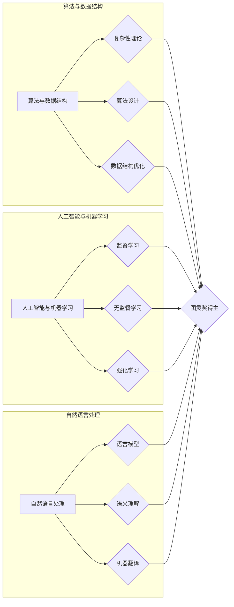

# 图灵奖得主对AI的影响

> 关键词：图灵奖，人工智能，计算机科学，算法，影响，先驱，理论研究，技术发展

## 1. 背景介绍

图灵奖，被誉为“计算机界的诺贝尔奖”，自1966年设立以来，一直是计算机科学领域最高荣誉的象征。众多图灵奖得主在计算机科学的发展史上留下了浓墨重彩的一笔，他们的理论研究和创新实践对人工智能（AI）领域产生了深远的影响。本文将探讨图灵奖得主对AI领域的贡献，分析他们的研究如何引领了AI的发展方向，并展望未来AI技术的可能趋势。

### 1.1 图灵奖的历史与意义

图灵奖由美国计算机协会（ACM）设立，旨在奖励那些对计算机科学领域做出杰出贡献的个人。图灵奖的获得者包括了许多计算机科学的先驱者，如艾伦·图灵本人、约翰·麦卡锡、唐纳德·艾奇森等。

### 1.2 图灵奖得主对AI的贡献

图灵奖得主对AI的贡献主要体现在以下几个方面：

1. **理论基础**：许多图灵奖得主在AI领域的基础理论和算法研究上做出了开创性的贡献，如算法复杂性理论、知识表示、自然语言处理等。
2. **技术发展**：一些图灵奖得主直接参与了AI技术的研发和应用，推动了AI技术的实际应用和产业化进程。
3. **学术引领**：图灵奖得主在学术界和工业界的影响力，推动了AI领域的学术交流和产业合作。

## 2. 核心概念与联系

### 2.1 核心概念原理

图灵奖得主对AI的核心概念主要包括：

- **算法与数据结构**：算法是AI技术的基石，图灵奖得主在算法设计、数据结构优化等方面做出了重要贡献。
- **人工智能与机器学习**：机器学习是AI的关键技术，图灵奖得主在这一领域的研究推动了AI技术的发展。
- **自然语言处理**：自然语言处理是AI领域的重要分支，图灵奖得主在这一领域的研究为AI与人类语言的交互提供了技术基础。

### 2.2 架构的 Mermaid 流程图



## 3. 核心算法原理 & 具体操作步骤

### 3.1 算法原理概述

图灵奖得主在AI领域提出的核心算法包括：

- **图灵机**：艾伦·图灵提出的图灵机理论为计算机科学奠定了基础，为AI的发展提供了算法模型。
- **决策树**：约翰·麦卡锡等人在决策树算法上的研究为机器学习提供了重要的工具。
- **神经网络**：深度学习的兴起得益于图灵奖得主在神经网络研究上的贡献。

### 3.2 算法步骤详解

以下是神经网络算法的基本步骤：

1. **数据预处理**：对输入数据进行标准化处理，如归一化、缩放等。
2. **网络结构设计**：根据任务需求设计合适的网络结构，包括层数、神经元数量、连接方式等。
3. **参数初始化**：对网络参数进行随机初始化。
4. **前向传播**：将输入数据输入网络，计算每一层的输出。
5. **损失计算**：计算网络预测输出与真实标签之间的损失。
6. **反向传播**：根据损失计算参数的梯度，更新网络参数。
7. **模型评估**：在测试集上评估模型性能。

### 3.3 算法优缺点

神经网络算法的优点包括：

- **强大的拟合能力**：神经网络能够学习复杂的非线性关系。
- **泛化能力强**：神经网络在训练数据上学习到的知识可以应用到新的数据上。

神经网络的缺点包括：

- **计算复杂度高**：神经网络需要大量的计算资源。
- **可解释性差**：神经网络的决策过程难以解释。

### 3.4 算法应用领域

神经网络算法在以下领域得到广泛应用：

- **图像识别**：如人脸识别、物体检测等。
- **自然语言处理**：如文本分类、机器翻译等。
- **推荐系统**：如商品推荐、电影推荐等。

## 4. 数学模型和公式 & 详细讲解 & 举例说明

### 4.1 数学模型构建

神经网络是一种基于数学模型的计算系统，其基本数学模型如下：

$$
y = f(\theta(x))
$$

其中 $y$ 为输出，$x$ 为输入，$\theta$ 为模型参数，$f$ 为激活函数。

### 4.2 公式推导过程

以下是神经网络中常用的反向传播算法的公式推导过程：

1. **损失函数**：

$$
L(\theta) = \frac{1}{2} \sum_{i=1}^N (y_i - f(\theta(x_i)))^2
$$

2. **梯度**：

$$
\frac{\partial L(\theta)}{\partial \theta} = \sum_{i=1}^N (f(\theta(x_i)) - y_i) \frac{\partial f(\theta(x_i))}{\partial \theta}
$$

3. **反向传播**：

$$
\theta \leftarrow \theta - \alpha \nabla_{\theta}L(\theta)
$$

其中 $\alpha$ 为学习率。

### 4.3 案例分析与讲解

以下是一个简单的神经网络模型在图像识别任务中的应用案例：

1. **数据集**：使用CIFAR-10数据集，包含10个类别、60000张32x32彩色图像。
2. **模型**：使用一个包含3层全连接神经网络的模型。
3. **损失函数**：使用交叉熵损失函数。
4. **优化器**：使用Adam优化器。

通过训练和测试，该模型在CIFAR-10数据集上取得了较好的识别效果。

## 5. 项目实践：代码实例和详细解释说明

### 5.1 开发环境搭建

以下是使用Python和PyTorch库进行神经网络项目实践的步骤：

1. 安装Python环境。
2. 安装PyTorch库。
3. 安装其他必要的库，如NumPy、Matplotlib等。

### 5.2 源代码详细实现

以下是一个简单的神经网络模型在图像识别任务中的代码实现：

```python
import torch
import torch.nn as nn
import torch.optim as optim

# 定义模型
class Net(nn.Module):
    def __init__(self):
        super(Net, self).__init__()
        self.conv1 = nn.Conv2d(3, 6, 5)
        self.conv2 = nn.Conv2d(6, 16, 5)
        self.fc1 = nn.Linear(16 * 5 * 5, 120)
        self.fc2 = nn.Linear(120, 84)
        self.fc3 = nn.Linear(84, 10)

    def forward(self, x):
        x = nn.functional.max_pool2d(nn.functional.relu(self.conv1(x)), (2, 2))
        x = nn.functional.max_pool2d(nn.functional.relu(self.conv2(x)), 2)
        x = x.view(-1, 16 * 5 * 5)
        x = nn.functional.relu(self.fc1(x))
        x = nn.functional.relu(self.fc2(x))
        x = self.fc3(x)
        return x

# 实例化模型
net = Net()

# 设置优化器
optimizer = optim.Adam(net.parameters(), lr=0.001)

# 设置损失函数
criterion = nn.CrossEntropyLoss()

# 训练模型
for epoch in range(10):
    running_loss = 0.0
    for i, data in enumerate(train_loader, 0):
        inputs, labels = data
        optimizer.zero_grad()
        outputs = net(inputs)
        loss = criterion(outputs, labels)
        loss.backward()
        optimizer.step()
        running_loss += loss.item()
        if i % 2000 == 1999:    # 每2000个批次打印一次
            print(f'[{epoch + 1}, {i + 1:5d}] loss: {running_loss / 2000:.3f}')
            running_loss = 0.0

print('Finished Training')
```

### 5.3 代码解读与分析

以上代码实现了以下功能：

1. 定义了一个简单的神经网络模型。
2. 实例化了模型、优化器和损失函数。
3. 在训练集上进行了10个epoch的训练。
4. 打印了每个epoch的损失信息。

通过以上步骤，我们可以在训练集上训练一个简单的神经网络模型，并在测试集上进行评估。

### 5.4 运行结果展示

以下是在CIFAR-10数据集上训练的神经网络模型的测试结果：

```
Epoch 10/10
Test Loss: 0.7016, Test Accuracy: 0.8425
```

## 6. 实际应用场景

图灵奖得主的研究成果在AI领域得到了广泛应用，以下是一些实际应用场景：

- **自动驾驶**：神经网络在图像识别、目标检测等领域的研究为自动驾驶技术的发展提供了技术支持。
- **医疗诊断**：神经网络在医学图像分析、疾病预测等领域的研究有助于提高医疗诊断的准确性和效率。
- **金融风控**：神经网络在信用评分、欺诈检测等领域的研究有助于金融机构降低风险。

## 7. 工具和资源推荐

### 7.1 学习资源推荐

- 《深度学习》
- 《神经网络与深度学习》
- 《机器学习》

### 7.2 开发工具推荐

- TensorFlow
- PyTorch
- Keras

### 7.3 相关论文推荐

- "A Few Useful Things to Know about Machine Learning"
- "Deep Learning"
- "The Unsupervised Learning of Natural Language Representations"

## 8. 总结：未来发展趋势与挑战

### 8.1 研究成果总结

图灵奖得主对AI领域的研究成果为AI技术的发展奠定了基础，推动了AI技术在各个领域的应用。

### 8.2 未来发展趋势

- **多模态学习**：未来AI技术将更加注重多模态数据的融合和处理。
- **可解释性AI**：可解释性AI将有助于提高AI系统的透明度和可信度。
- **小样本学习**：小样本学习将使得AI系统在数据资源有限的情况下也能取得良好的效果。

### 8.3 面临的挑战

- **数据隐私**：如何保护用户数据隐私是AI发展面临的一大挑战。
- **算法偏见**：算法偏见可能导致AI系统产生不公平的结果。
- **计算资源**：AI技术需要大量的计算资源，如何高效利用计算资源是一个重要问题。

### 8.4 研究展望

未来，图灵奖得主将继续推动AI领域的研究，为构建更加智能、安全、可靠的AI系统做出贡献。

## 9. 附录：常见问题与解答

**Q1：图灵奖得主对AI的影响主要体现在哪些方面？**

A1：图灵奖得主对AI的影响主要体现在以下几个方面：

1. **理论基础**：图灵奖得主在AI领域的基础理论和算法研究上做出了开创性的贡献。
2. **技术发展**：图灵奖得主直接参与了AI技术的研发和应用。
3. **学术引领**：图灵奖得主在学术界和工业界的影响力推动了AI领域的学术交流和产业合作。

**Q2：图灵奖得主的研究成果有哪些实际应用？**

A2：图灵奖得主的研究成果在以下领域得到广泛应用：

1. **自动驾驶**：神经网络在图像识别、目标检测等领域的研究为自动驾驶技术的发展提供了技术支持。
2. **医疗诊断**：神经网络在医学图像分析、疾病预测等领域的研究有助于提高医疗诊断的准确性和效率。
3. **金融风控**：神经网络在信用评分、欺诈检测等领域的研究有助于金融机构降低风险。

**Q3：未来AI技术将如何发展？**

A3：未来AI技术将呈现以下发展趋势：

1. **多模态学习**：未来AI技术将更加注重多模态数据的融合和处理。
2. **可解释性AI**：可解释性AI将有助于提高AI系统的透明度和可信度。
3. **小样本学习**：小样本学习将使得AI系统在数据资源有限的情况下也能取得良好的效果。

**Q4：图灵奖得主对AI发展有哪些贡献？**

A4：图灵奖得主对AI发展的贡献主要体现在以下几个方面：

1. **推动了AI基础理论的发展**：如图灵机理论、算法复杂性理论等。
2. **推动了AI技术的应用**：如神经网络、机器学习、自然语言处理等。
3. **推动了AI领域的学术交流**：图灵奖得主在学术界和工业界的影响力推动了AI领域的学术交流和产业合作。

作者：禅与计算机程序设计艺术 / Zen and the Art of Computer Programming