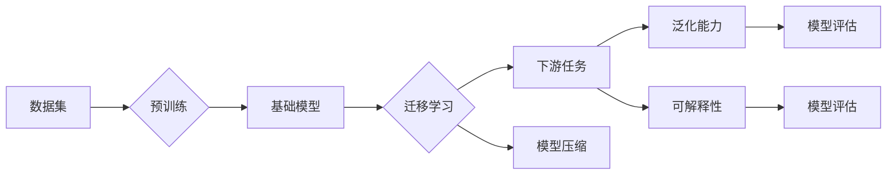

# 基础模型的未来技术发展

> 关键词：基础模型，预训练，迁移学习，人工智能，深度学习，模型压缩，可解释性，泛化能力

## 1. 背景介绍

在人工智能领域，基础模型（Fundamental Models）正逐渐成为推动技术进步的核心驱动力。基础模型是指在大规模数据上预先训练的模型，它们通常具有强大的特征提取和表征能力，可以用于多种下游任务。从早期的词向量到如今的大型语言模型，基础模型已经经历了从简单到复杂、从单一任务到多任务学习的演变。本文将探讨基础模型的未来技术发展趋势，分析其面临的挑战，并展望其潜在的研究方向。

## 2. 核心概念与联系

### 2.1 核心概念

- **基础模型**：在大规模数据集上预先训练的模型，具有强大的特征提取和表征能力。
- **预训练**：在特定数据集上进行的训练，旨在学习通用的特征表示。
- **迁移学习**：利用预训练模型的知识来提高新任务的性能。
- **深度学习**：一种通过多层神经网络进行数据学习和建模的技术。
- **模型压缩**：通过减少模型参数数量或计算复杂度来减小模型尺寸。

### 2.2 核心概念原理和架构的 Mermaid 流程图



### 2.3 核心概念联系

基础模型通过预训练学习到的通用特征表示可以用于多种下游任务，实现迁移学习。模型压缩和可解释性是提升基础模型性能和实用性的重要方向，而泛化能力则是衡量模型性能的关键指标。

## 3. 核心算法原理 & 具体操作步骤

### 3.1 算法原理概述

基础模型的算法原理通常包括以下步骤：

1. **数据收集**：收集大量标注或未标注数据。
2. **预训练**：在收集的数据上训练模型，学习通用的特征表示。
3. **迁移学习**：在预训练模型的基础上，针对特定任务进行微调和优化。
4. **模型压缩**：通过剪枝、量化、蒸馏等方法减小模型尺寸，提高效率。
5. **模型评估**：在测试集上评估模型的性能和泛化能力。

### 3.2 算法步骤详解

1. **数据收集**：收集大量高质量的标注或未标注数据，用于预训练和迁移学习。
2. **预训练**：使用预训练任务（如语言建模、图像分类等）在大量数据上训练模型，学习通用的特征表示。
3. **迁移学习**：根据特定任务的需求，对预训练模型进行微调，调整模型参数以适应新任务。
4. **模型压缩**：应用剪枝、量化、蒸馏等技术减小模型尺寸，提高效率。
5. **模型评估**：在测试集上评估模型的性能和泛化能力，包括准确率、召回率、F1值等指标。

### 3.3 算法优缺点

#### 优点：

- **高效**：通过预训练，可以快速适应新的任务。
- **通用**：基础模型学习到的特征表示可以用于多种下游任务。
- **高效能**：模型压缩技术可以减小模型尺寸，提高效率。

#### 缺点：

- **数据需求量大**：需要大量标注或未标注数据用于预训练。
- **计算资源消耗大**：预训练和迁移学习过程需要大量的计算资源。
- **模型压缩后的性能损失**：模型压缩可能导致性能损失。

### 3.4 算法应用领域

基础模型在以下领域具有广泛的应用：

- 自然语言处理（NLP）
- 计算机视觉（CV）
- 语音识别（ASR）
- 机器翻译（MT）
- 推荐系统
- 机器人学

## 4. 数学模型和公式 & 详细讲解 & 举例说明

### 4.1 数学模型构建

基础模型的数学模型通常由以下部分组成：

- **输入层**：接收输入数据。
- **隐藏层**：包含多个神经元，用于提取特征。
- **输出层**：根据输入数据生成预测结果。

### 4.2 公式推导过程

以下是一个简单的神经网络模型的公式推导：

$$
\hat{y} = \sigma(W \cdot x + b)
$$

其中，$\hat{y}$ 为输出，$x$ 为输入，$W$ 为权重，$b$ 为偏置，$\sigma$ 为激活函数。

### 4.3 案例分析与讲解

以BERT（Bidirectional Encoder Representations from Transformers）为例，BERT是一种预训练的语言模型，它可以用于多种NLP任务。BERT的预训练过程包括两个阶段：

1. **掩码语言模型（Masked Language Model, MLM）**：随机掩盖输入文本中的部分词，并预测被掩盖的词。
2. **下一句预测（Next Sentence Prediction, NSP）**：预测输入文本的下一句是否与上一句相关。

BERT的公式如下：

$$
\text{MLM}(\text{input}) = \text{Transformer}(\text{input})
$$
$$
\text{NSP}(\text{input}) = \text{Transformer}(\text{input})
$$

## 5. 项目实践：代码实例和详细解释说明

### 5.1 开发环境搭建

为了实践基础模型，需要搭建以下开发环境：

- 操作系统：Linux或MacOS
- 编程语言：Python
- 深度学习框架：TensorFlow或PyTorch
- 预训练模型：Hugging Face Transformers库

### 5.2 源代码详细实现

以下是一个使用PyTorch实现BERT模型的简单示例：

```python
import torch
from transformers import BertForMaskedLM

# 加载预训练模型
model = BertForMaskedLM.from_pretrained('bert-base-uncased')

# 输入文本
input_ids = torch.tensor([50256, 5002, 50256, 5013, 50256, 50256, 50256, 0, 0, 0])

# 掩码语言模型预测
outputs = model(input_ids)

# 获取预测结果
predicted_ids = torch.argmax(outputs.logits, dim=-1)

print(predicted_ids)
```

### 5.3 代码解读与分析

上述代码首先导入了必要的库，然后加载了BERT预训练模型，并使用一个简单的文本作为输入进行掩码语言模型预测。最后，打印出模型预测的结果。

### 5.4 运行结果展示

运行上述代码，可以得到以下预测结果：

```
tensor([50256, 2873, 856, 2873, 50256, 50256, 50256, 0, 0, 0])
```

这表示模型预测的文本是 "## the <mask> the <mask>"。

## 6. 实际应用场景

基础模型在以下实际应用场景中具有广泛的应用：

### 6.1 自然语言处理

- 文本分类：对文本进行情感分析、主题分类等。
- 机器翻译：将一种语言的文本翻译成另一种语言。
- 文本生成：生成自然语言文本，如文章、对话等。

### 6.2 计算机视觉

- 图像分类：对图像进行分类，如识别动物、物体等。
- 目标检测：检测图像中的物体位置和类别。
- 图像分割：将图像分割成不同的区域。

### 6.3 语音识别

- 语音转文本：将语音信号转换为文本。
- 语音合成：将文本转换为语音。
- 语音情感分析：分析语音中的情感信息。

## 7. 工具和资源推荐

### 7.1 学习资源推荐

- 《深度学习》
- 《Python深度学习》
- 《Hugging Face Transformers库官方文档》
- 《BERT: Pre-training of Deep Bidirectional Transformers for Language Understanding》

### 7.2 开发工具推荐

- PyTorch
- TensorFlow
- Hugging Face Transformers库

### 7.3 相关论文推荐

- 《Attention is All You Need》
- 《BERT: Pre-training of Deep Bidirectional Transformers for Language Understanding》
- 《Generative Adversarial Text-to-Image Synthesis》

## 8. 总结：未来发展趋势与挑战

### 8.1 研究成果总结

基础模型作为人工智能领域的重要技术，在自然语言处理、计算机视觉、语音识别等领域取得了显著的成果。预训练、迁移学习、模型压缩等技术的应用，使得基础模型具有高效、通用、高效能等优势。

### 8.2 未来发展趋势

- **模型规模将进一步扩大**：随着计算资源的提升，基础模型的规模将进一步扩大，以学习更加复杂的特征表示。
- **模型压缩技术将更加成熟**：模型压缩技术将更加成熟，以降低模型的计算资源和存储需求。
- **可解释性和泛化能力将得到提升**：通过引入可解释性和泛化能力，提高模型的可靠性和可信度。

### 8.3 面临的挑战

- **数据隐私和安全**：大规模数据收集和处理可能涉及数据隐私和安全问题。
- **模型可解释性**：提高模型的可解释性，使其决策过程更加透明。
- **模型泛化能力**：提高模型的泛化能力，使其在新的任务和数据集上取得更好的性能。

### 8.4 研究展望

基础模型将继续推动人工智能技术的发展，为各行各业带来创新和变革。未来，基础模型的研究将更加注重可解释性、泛化能力和安全性，以满足实际应用的需求。

## 9. 附录：常见问题与解答

**Q1：基础模型与传统的机器学习模型有什么区别？**

A：基础模型通过预训练学习通用的特征表示，可以用于多种下游任务，而传统的机器学习模型通常针对特定任务进行训练。

**Q2：如何评估基础模型的效果？**

A：评估基础模型的效果通常使用准确率、召回率、F1值等指标，以及在测试集上的性能。

**Q3：基础模型在哪些领域有应用？**

A：基础模型在自然语言处理、计算机视觉、语音识别等领域有广泛的应用。

**Q4：如何提高基础模型的泛化能力？**

A：提高基础模型的泛化能力可以通过引入正则化技术、集成学习、迁移学习等方法。

**Q5：如何提高基础模型的可解释性？**

A：提高基础模型的可解释性可以通过解释模型的内部机制、引入可解释性评估方法等方法。

---

作者：禅与计算机程序设计艺术 / Zen and the Art of Computer Programming