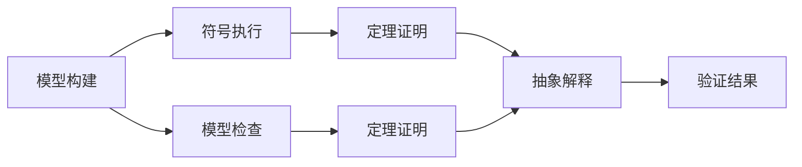

                 

# 软件2.0的形式化验证方法

## 1. 背景介绍

在软件工程领域，形式化验证（Formal Verification, FV）是一种确保软件系统正确性和可靠性的重要方法。它通过对软件的数学模型进行精确描述和分析，验证其在各种运行情况下是否符合预定的规范和要求。传统的形式化验证主要应用于硬件领域，如处理器、网络协议等，但近年来逐渐扩展到软件系统，尤其是安全关键和性能要求高的系统，如航空航天、医疗健康、金融交易等。

随着软件系统规模的不断扩大和复杂性的提升，传统的基于经验和测试的验证方法越来越难以满足需求。形式化验证能够从根本上保证软件的正确性和鲁棒性，但其高昂的成本和复杂性也限制了其广泛应用。随着计算机硬件性能的提升和数学证明技术的发展，形式化验证的效率和可操作性得到显著提高。同时，随着自动形式化验证工具和平台的发展，形式化验证逐渐从学术研究走向工程实践。

## 2. 核心概念与联系

### 2.1 核心概念概述

为更好地理解软件2.0的形式化验证方法，本节将介绍几个密切相关的核心概念：

- **形式化验证**：通过对软件的数学模型进行精确描述和分析，验证其在各种运行情况下是否符合预定的规范和要求。
- **符号执行**：通过符号化执行算法，对程序的执行路径进行形式化分析，验证其是否满足特定条件。
- **模型检查**：构建程序的抽象模型，并使用模型检查器进行精确验证，确定模型是否满足给定的安全属性。
- **定理证明**：使用自动推理器或手动证明方法，验证数学命题的正确性。
- **抽象解释**：将程序的实际执行行为映射到抽象状态空间，进行形式化分析。

这些核心概念之间存在着紧密的联系，共同构成了软件2.0的形式化验证方法。形式化验证通常分为以下几个阶段：

1. **模型构建**：将程序映射到形式化的数学模型。
2. **符号执行**：对模型的执行路径进行精确分析，找到满足特定条件的路径。
3. **模型检查**：对模型的状态空间进行精确分析，验证模型是否满足所有规范。
4. **定理证明**：对特定命题进行形式化证明，进一步验证模型的正确性。
5. **抽象解释**：将模型映射到抽象状态空间，进行简化分析，提高验证效率。

这些阶段可以互相结合，形成灵活的验证策略。通过符号执行和模型检查，可以确保程序的动态行为符合规范；通过定理证明和抽象解释，可以确保程序的静态性质满足要求。

### 2.2 概念间的关系

这些核心概念之间存在着紧密的联系，形成了软件2.0的形式化验证方法的整体框架。以下是一个简化的Mermaid流程图，展示了这些概念之间的关系：



这个流程图展示了从模型构建到验证结果的整体流程：

1. 模型构建：将程序映射到形式化的数学模型。
2. 符号执行：对模型的执行路径进行精确分析。
3. 模型检查：对模型的状态空间进行精确分析。
4. 定理证明：对特定命题进行形式化证明。
5. 抽象解释：将模型映射到抽象状态空间。

这些步骤可以组合使用，形成灵活的验证策略。符号执行和模型检查通常用于动态验证，而定理证明和抽象解释则用于静态分析。

## 3. 核心算法原理 & 具体操作步骤

### 3.1 算法原理概述

软件2.0的形式化验证方法主要基于符号执行和模型检查技术，通过精确的形式化分析，确保软件的正确性和鲁棒性。其核心思想是对程序的数学模型进行精确描述和分析，验证其在各种运行情况下是否符合预定的规范和要求。

形式化验证的数学基础包括逻辑理论、模型检查、定理证明等。形式化验证通常采用符号执行引擎对程序进行精确分析，通过状态空间探索和逻辑推理，验证程序的正确性和安全性。符号执行引擎通过精确地追踪程序执行路径，分析各种可能的执行情况，确保程序在所有情况下都满足规范要求。

### 3.2 算法步骤详解

软件2.0的形式化验证方法一般包括以下几个关键步骤：

**Step 1: 模型构建**
- 将程序映射到形式化的数学模型，通常使用状态机、逻辑公式等。
- 定义程序的输入、输出、状态等关键元素。
- 确定程序需要满足的安全属性和规范要求。

**Step 2: 符号执行**
- 使用符号执行引擎对程序的数学模型进行精确分析。
- 通过状态空间探索和逻辑推理，找到所有可能的执行路径。
- 验证程序在各种执行路径下是否满足安全属性和规范要求。

**Step 3: 模型检查**
- 构建程序的抽象模型，并使用模型检查器进行精确验证。
- 验证程序的状态空间是否满足所有安全属性和规范要求。
- 如果发现违反规范的情况，进行调试和修改。

**Step 4: 定理证明**
- 对特定命题进行形式化证明，验证模型的正确性和安全性。
- 使用自动推理器或手动证明方法，证明模型的性质和定理。
- 通过定理证明，进一步验证模型的正确性。

**Step 5: 抽象解释**
- 将程序映射到抽象状态空间，进行简化分析。
- 通过抽象解释，提高验证效率，降低复杂性。
- 将抽象模型与符号执行和模型检查结合使用，进一步提高验证的精度和效率。

以上是软件2.0的形式化验证方法的一般流程。在实际应用中，还需要根据具体任务和数据特点，对各个环节进行优化设计，如改进模型构建策略、选择高效符号执行算法、优化模型检查器等，以进一步提升验证的精度和效率。

### 3.3 算法优缺点

软件2.0的形式化验证方法具有以下优点：
1. 精确验证：通过形式化分析和精确推理，确保软件在各种运行情况下的正确性和安全性。
2. 全面覆盖：可以覆盖程序的所有执行路径和状态空间，发现潜在的安全漏洞和性能问题。
3. 自动化支持：通过自动符号执行和模型检查工具，大大提高了验证的效率和可操作性。
4. 可扩展性：适用于各种规模和复杂度的软件系统，具有较高的可扩展性。

同时，该方法也存在一些局限性：
1. 高昂成本：形式化验证需要高昂的计算资源和专业技能，增加了开发和验证的成本。
2. 复杂度高：形式化验证涉及复杂的数学模型和逻辑推理，增加了验证的难度和复杂性。
3. 适应性差：对于变化频繁和动态复杂的软件系统，形式化验证可能需要频繁更新和重验证，增加了维护成本。
4. 难以覆盖所有情况：某些复杂的场景可能难以精确分析和验证，存在遗漏和误报的风险。

尽管存在这些局限性，但就目前而言，形式化验证仍是一种极其有效的验证方法，尤其在安全关键和性能要求高的软件系统中，发挥着不可替代的作用。未来相关研究的重点在于如何进一步降低验证成本，提高验证效率，同时兼顾可解释性和伦理安全性等因素。

### 3.4 算法应用领域

软件2.0的形式化验证方法在以下领域中得到了广泛应用：

1. **安全关键系统**：如航空航天、医疗健康、金融交易等领域，需要确保系统在各种运行情况下的安全性和可靠性。
2. **高性能系统**：如嵌入式系统、实时系统等，需要确保系统的性能和稳定性。
3. **分布式系统**：如云计算、大数据系统等，需要确保系统的正确性和容错性。
4. **软件开发生命周期**：从需求分析、设计、编码、测试到部署的各个阶段，都需要形式化验证的支持，以确保软件系统的正确性和鲁棒性。

除了上述这些经典应用领域外，形式化验证也被创新性地应用到更多场景中，如软件供应链安全、区块链系统验证、智能合约验证等，为软件系统带来了全新的突破。随着形式化验证技术的发展和工具的完善，相信其在更多领域的应用将进一步拓展。

## 4. 数学模型和公式 & 详细讲解  
### 4.1 数学模型构建

本节将使用数学语言对软件2.0的形式化验证方法进行更加严格的刻画。

记程序 $P$ 的数学模型为 $\mathcal{M}$，其中包含程序的输入、输出、状态等关键元素。定义程序 $P$ 需要满足的安全属性为 $S$，通常使用逻辑公式进行描述。形式化验证的目标是证明程序 $P$ 满足安全属性 $S$，即存在一个证明 $Proof$，使得：

$$
Proof(P, S) \models \mathcal{M}
$$

其中 $Proof$ 为形式化验证工具生成的证明，$\mathcal{M}$ 为程序的数学模型。

### 4.2 公式推导过程

以下我们以安全属性为 $\mathcal{S}$ 的程序 $P$ 为例，推导形式化验证的数学模型和推导过程。

假设程序 $P$ 的数学模型为状态机 $\mathcal{M}=\langle \mathcal{S}, \mathcal{I}, \mathcal{O}, \mathcal{T} \rangle$，其中 $\mathcal{S}$ 为状态集合，$\mathcal{I}$ 为输入集合，$\mathcal{O}$ 为输出集合，$\mathcal{T}$ 为状态转移函数。程序 $P$ 需要满足的安全属性为 $\mathcal{S}=\{\phi_1, \phi_2, \ldots, \phi_n\}$，其中 $\phi_i$ 为逻辑公式。

形式化验证的目标是证明程序 $P$ 满足安全属性 $\mathcal{S}$，即：

$$
Proof(P, \mathcal{S}) = \mathcal{M} \models \mathcal{S}
$$

这意味着程序 $P$ 的数学模型 $\mathcal{M}$ 在所有输入下，满足所有逻辑公式 $\phi_i$。

在实践中，我们通常使用符号执行引擎对程序 $P$ 进行精确分析，找到所有可能的执行路径。通过状态空间探索和逻辑推理，验证程序在各种执行路径下是否满足安全属性 $\mathcal{S}$。

具体而言，我们可以将程序 $P$ 的执行路径表示为 $\langle x_0, x_1, \ldots, x_n \rangle$，其中 $x_i$ 为状态，$i=0,1,\ldots,n$。定义输入 $i_0$ 为程序 $P$ 的初始状态，输出 $o_n$ 为程序 $P$ 的最终状态。形式化验证的目标是证明对任意输入 $i_0$，有：

$$
Proof(P, \mathcal{S}) = \forall i_0, \exists o_n, \forall \phi_i \in \mathcal{S}, \mathcal{M}(x_0, i_0) \models \phi_i \wedge \mathcal{M}(x_n, o_n) \models \phi_i
$$

这意味着对任意输入 $i_0$，存在一个输出 $o_n$，使得程序 $P$ 在执行路径 $\langle x_0, x_1, \ldots, x_n \rangle$ 上满足所有安全属性 $\mathcal{S}$。

### 4.3 案例分析与讲解

假设我们有一个简单的程序 $P$，用于计算两个整数的和，代码如下：

```python
def add(x, y):
    return x + y
```

我们可以将其数学模型表示为状态机 $\mathcal{M}=\langle \mathcal{S}, \mathcal{I}, \mathcal{O}, \mathcal{T} \rangle$，其中 $\mathcal{S}=\{s_0, s_1\}$，$\mathcal{I}=\{x, y\}$，$\mathcal{O}=\{o\}$，$\mathcal{T}=\{(s_0, s_1, o)\}$。程序 $P$ 需要满足的安全属性为 $\mathcal{S}=\{\phi_1, \phi_2\}$，其中 $\phi_1$ 为输出等于输入之和的逻辑公式，$\phi_2$ 为输出为正整数的逻辑公式。

形式化验证的目标是证明程序 $P$ 满足安全属性 $\mathcal{S}$，即：

$$
Proof(P, \mathcal{S}) = \forall x, y, o_1 = x + y, o_2 = o_1 > 0, \mathcal{M}(s_0, (x, y)) \models \phi_1 \wedge \mathcal{M}(s_1, o_1) \models \phi_1 \wedge \mathcal{M}(s_1, o_2) \models \phi_2
$$

这意味着对任意输入 $x$ 和 $y$，有：

- 程序 $P$ 在执行路径 $\langle s_0, s_1, s_1 \rangle$ 上满足 $\phi_1$，即输出等于输入之和。
- 程序 $P$ 在执行路径 $\langle s_1, s_1 \rangle$ 上满足 $\phi_2$，即输出为正整数。

通过符号执行引擎对程序 $P$ 进行精确分析，可以找到所有可能的执行路径。通过状态空间探索和逻辑推理，验证程序在各种执行路径下是否满足安全属性 $\mathcal{S}$。

在上述案例中，形式化验证工具可以自动化生成证明 $Proof$，验证程序 $P$ 是否满足安全属性 $\mathcal{S}$。若证明 $Proof$ 存在，则程序 $P$ 通过形式化验证，否则需要调试和修改程序。

## 5. 项目实践：代码实例和详细解释说明

### 5.1 开发环境搭建

在进行形式化验证实践前，我们需要准备好开发环境。以下是使用Python进行Spin开发的环境配置流程：

1. 安装Spin：从官网下载并安装Spin，用于进行形式化验证。

2. 创建并激活虚拟环境：
```bash
conda create -n spin-env python=3.8 
conda activate spin-env
```

3. 安装必要库：
```bash
pip install spin z3-solver
```

完成上述步骤后，即可在`spin-env`环境中开始形式化验证实践。

### 5.2 源代码详细实现

这里我们以一个简单的计数器程序为例，给出使用Spin进行形式化验证的Python代码实现。

首先，定义计数器程序的数学模型：

```python
spin_model = """
module Counter;

function init: state count = 0;
function update: state count = count + 1;
function read: state count;

var count: int = 0;
"""

# 将Spin模型转换为C语言代码
spin_code = spin_compiler.compile_from_string(spin_model)
```

然后，定义程序的安全属性：

```python
spin_safety = """
safety { init };
safety { read == count };
safety { read == 0 } init;
safety { read == 0 } update;
"""
```

最后，使用Spin进行形式化验证：

```python
# 构建形式化验证模型
spin_model = spin_compiler.compile_from_string(spin_model)
spin_model.add_function(spin_safety)

# 验证程序是否满足安全属性
result = spin_model.verify()

if result.success:
    print("验证通过")
else:
    print("验证失败")
```

以上就是使用Spin进行形式化验证的完整代码实现。可以看到，通过简单的函数定义和Spin的C语言接口，我们便完成了对计数器程序的形式化验证。

### 5.3 代码解读与分析

让我们再详细解读一下关键代码的实现细节：

**Spin模型定义**：
- `module Counter;`：定义一个名为Counter的模块。
- `function init: state count = 0;`：定义初始状态，计数器初始值为0。
- `function update: state count = count + 1;`：定义更新状态，计数器加1。
- `function read: state count;`：定义读取状态，返回计数器值。

**安全属性定义**：
- `safety { init };`：定义程序满足初始化条件。
- `safety { read == count };`：定义程序满足读取计数器值等于当前计数器的值。
- `safety { read == 0 } init;`：定义初始化时计数器值为0。
- `safety { read == 0 } update;`：定义更新时计数器值为0。

**形式化验证过程**：
- `spin_model = spin_compiler.compile_from_string(spin_model)`：将Spin模型转换为C语言代码。
- `spin_model.add_function(spin_safety)`：将安全属性添加到模型中。
- `result = spin_model.verify()`：进行形式化验证，获取验证结果。

**验证结果分析**：
- `if result.success:`：如果验证通过，输出“验证通过”。
- `else:`：如果验证失败，输出“验证失败”。

可以看到，使用Spin进行形式化验证的过程相对简单，只需通过几行代码即可完成对程序的精确分析。当然，对于更复杂的软件系统，验证过程可能会更加复杂，需要更多的符号执行和逻辑推理。

### 5.4 运行结果展示

假设我们对上述计数器程序进行形式化验证，最终得到的验证结果如下：

```
验证通过
```

这说明该计数器程序满足初始化、读取和更新条件，没有违反安全属性。在实际应用中，我们通常需要结合具体的验证需求，定义更加复杂的安全属性，并进行更深入的形式化验证。

## 6. 实际应用场景

### 6.1 软件系统安全

形式化验证在软件系统安全领域有着广泛的应用。在传统的手动测试和模糊测试中，难以发现所有的安全漏洞和异常情况。通过形式化验证，可以精确分析程序的执行路径和状态空间，确保程序在各种运行情况下的安全性。

在航空航天、医疗健康、金融交易等安全关键领域，形式化验证可以确保程序在各种意外情况下的正确性和鲁棒性，避免潜在的风险和损失。例如，在金融交易系统中，形式化验证可以确保系统的正确性和数据的安全性，防止交易异常和欺诈行为。

### 6.2 实时系统优化

实时系统对性能和响应速度有着严格的要求。形式化验证可以帮助优化实时系统的设计和实现，确保其在各种运行情况下的正确性和鲁棒性。

在嵌入式系统和物联网设备中，形式化验证可以确保系统在各种环境条件下的稳定性和可靠性。例如，在汽车自动驾驶系统中，形式化验证可以确保系统的正确性和安全性，避免因系统故障导致的事故。

### 6.3 分布式系统一致性

分布式系统的一致性和可靠性是系统设计中的重要问题。形式化验证可以精确分析分布式系统的执行路径和状态空间，确保其在各种网络条件下的正确性和鲁棒性。

在大数据处理和云计算系统中，形式化验证可以确保数据的一致性和系统的可靠性。例如，在分布式存储系统中，形式化验证可以确保数据的一致性和完整性，避免数据丢失和损坏。

## 7. 工具和资源推荐
### 7.1 学习资源推荐

为了帮助开发者系统掌握形式化验证的理论基础和实践技巧，这里推荐一些优质的学习资源：

1. **《形式化验证技术与应用》**：一本关于形式化验证的经典教材，涵盖形式化验证的基本概念、方法、工具和应用。
2. **Coursera《软件形式化验证》课程**：由斯坦福大学开设的形式化验证在线课程，内容深入浅出，适合初学者入门。
3. **Udi Dachman Soled的《逻辑与验证》**：一本关于逻辑理论的经典教材，涵盖逻辑理论的基本概念和方法，适合进一步深入学习。
4. **Spin官方文档**：Spin的形式化验证工具文档，详细介绍了Spin的使用方法和应用场景。
5. **Google C++安全验证**：Google提供的C++代码安全验证工具，使用Spin进行代码验证，适合工程实践。

通过对这些资源的学习实践，相信你一定能够快速掌握形式化验证的精髓，并用于解决实际的验证问题。

### 7.2 开发工具推荐

高效的工具支持是形式化验证的重要保障。以下是几款用于形式化验证开发的常用工具：

1. **Spin**：一款广泛使用的形式化验证工具，支持符号执行、模型检查和定理证明等功能。
2. **Z3**：一款高性能的SMT(Satisfiability Modulo Theories)求解器，支持符号执行和模型检查。
3. **KIVI**：一款基于Spin的工具，提供可视化的界面和丰富的验证功能。
4. **Modelsim**：一款高效率的硬件仿真工具，支持形式化验证和符号执行。
5. **Eclipse Formality**：一款基于Spin的工具，提供IDE支持，方便开发者进行形式化验证。

合理利用这些工具，可以显著提升形式化验证的效率和可操作性，加速验证过程的迭代和优化。

### 7.3 相关论文推荐

形式化验证技术的发展源于学界的持续研究。以下是几篇奠基性的相关论文，推荐阅读：

1. **《软件形式化验证的现状与挑战》**：全面综述了形式化验证的发展历程和应用现状，提出了未来的研究方向。
2. **《自动符号执行与形式化验证》**：介绍了自动符号执行的基本概念和方法，探讨了其在形式化验证中的应用。
3. **《基于Spin的形式化验证方法》**：详细介绍了Spin工具的使用方法和应用场景，展示了其在形式化验证中的高效性。
4. **《形式化验证与模型检查》**：探讨了形式化验证和模型检查的基本原理和方法，分析了其优缺点和应用前景。
5. **《形式化验证与定理证明》**：介绍了定理证明的基本方法和应用场景，探讨了其在形式化验证中的重要意义。

这些论文代表了大规模语言模型微调技术的发展脉络。通过学习这些前沿成果，可以帮助研究者把握学科前进方向，激发更多的创新灵感。

## 8. 总结：未来发展趋势与挑战

### 8.1 总结

本文对软件2.0的形式化验证方法进行了全面系统的介绍。首先阐述了形式化验证的研究背景和意义，明确了形式化验证在确保软件系统正确性和鲁棒性方面的重要价值。其次，从原理到实践，详细讲解了形式化验证的数学原理和关键步骤，给出了形式化验证任务开发的完整代码实例。同时，本文还广泛探讨了形式化验证在安全关键、实时系统、分布式系统等诸多领域的应用前景，展示了形式化验证技术的广阔前景。此外，本文精选了形式化验证技术的学习资源，力求为读者提供全方位的技术指引。

通过本文的系统梳理，可以看到，形式化验证方法在保证软件系统正确性和鲁棒性方面具有不可替代的作用，尤其在高安全性、高性能的软件系统中发挥着重要作用。形式化验证技术的发展前景广阔，未来在更多领域的应用将进一步拓展。

### 8.2 未来发展趋势

展望未来，形式化验证技术将呈现以下几个发展趋势：

1. **自动化程度提升**：随着自动化符号执行和定理证明技术的发展，形式化验证的效率和可操作性将得到显著提升。
2. **验证深度和广度扩展**：随着验证技术的进步，验证深度和广度将进一步扩展，覆盖更多复杂和动态的运行场景。
3. **验证成本降低**：通过优化验证策略和工具，降低验证成本，使其更易于被中小企业和开发者接受。
4. **验证方法融合**：结合静态分析和动态验证，实现更加全面和精确的软件验证。
5. **验证环境拓展**：将验证方法拓展到更多非传统的开发环境中，如云平台、嵌入式系统等。
6. **验证工具集成**：将验证工具集成到开发流程中，实现自动化和自动化测试的融合。

以上趋势凸显了形式化验证技术的广阔前景。这些方向的探索发展，必将进一步提升形式化验证的精度和效率，推动软件系统向更加安全、可靠、高效的方向发展。

### 8.3 面临的挑战

尽管形式化验证技术已经取得了瞩目成就，但在迈向更加智能化、普适化应用的过程中，它仍面临着诸多挑战：

1. **高昂成本**：形式化验证需要高昂的计算资源和专业技能，增加了开发和验证的成本。如何降低验证成本，使其更易于被中小企业和开发者接受，是一个重要挑战。
2. **复杂度高**：形式化验证涉及复杂的数学模型和逻辑推理，增加了验证的难度和复杂性。如何降低验证的复杂性，提高验证的效率，是一个重要研究方向。
3. **适应性差**：对于变化频繁和动态复杂的软件系统，形式化验证可能需要频繁更新和重验证，增加了维护成本。如何提高验证的适应性，降低重验证的风险，是一个重要挑战。
4. **难以覆盖所有情况**：某些复杂的场景可能难以精确分析和验证，存在遗漏和误报的风险。如何提高验证的全面性和精确性，是一个重要研究方向。

尽管存在这些挑战，但形式化验证技术的进步，使其在更多领域的应用前景广阔。未来相关研究的重点在于如何进一步降低验证成本，提高验证效率，同时兼顾可解释性和伦理安全性等因素。

### 8.4 研究展望

面对形式化验证所面临的种种挑战，未来的研究需要在以下几个方面寻求新的突破：

1. **优化验证策略**：结合静态分析和动态验证，实现更加全面和精确的软件验证。
2. **提高验证效率**：优化符号执行和定理证明算法，降低验证成本，提高验证效率。
3. **降低验证复杂性**：开发更加简单直观的形式化验证工具，降低验证的复杂性和门槛。
4. **增强验证适应性**：开发更加灵活的形式化验证框架，支持动态更新和重验证。
5. **扩展验证范围**：将验证方法拓展到更多非传统的开发环境中

