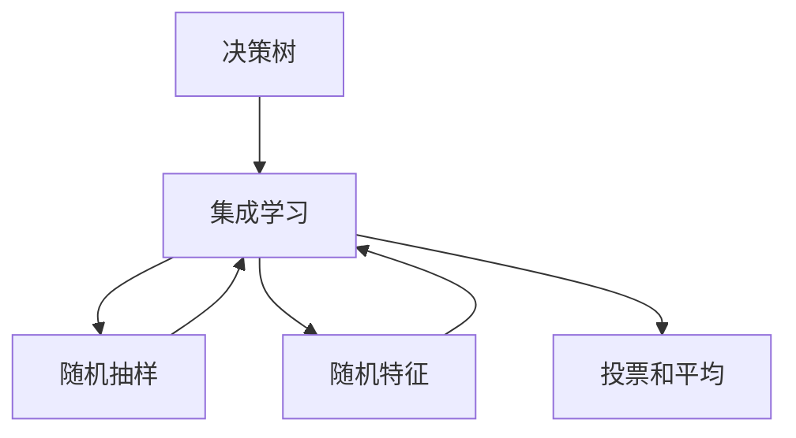

                 

# 随机森林 (Random Forest)

## 1. 背景介绍

### 1.1 问题由来

在机器学习领域，传统的决策树模型具有很好的直观性和可解释性，但也存在容易过拟合和难以处理高维数据的缺点。随机森林（Random Forest）正是在这一背景下提出的集成学习算法。它通过对多棵决策树的预测结果进行加权平均，实现了高精度的分类和回归，并且能够处理高维数据，具有很好的泛化能力。

### 1.2 问题核心关键点

随机森林的核心思想是构建多棵决策树，并通过投票或平均等机制来集成它们的预测结果。它的主要优点包括：

- 能够处理高维数据。
- 具有很好的泛化能力，避免过拟合。
- 具有很高的精度和准确性。
- 计算复杂度较低，训练速度快。

同时，随机森林也存在一些缺点：

- 对于缺失值敏感，需要进行特殊处理。
- 对于噪声数据敏感，需要进行数据清洗。
- 对于高维度数据，容易出现模型不稳定的现象。

### 1.3 问题研究意义

随机森林在实际应用中已经取得了很大的成功，被广泛应用于各种机器学习领域，如分类、回归、异常检测、特征选择等。它的成功主要得益于以下几个方面：

1. 能够处理高维数据，避免维数灾难。
2. 具有很好的泛化能力，避免过拟合。
3. 训练速度快，易于部署。
4. 对于缺失值和噪声数据具有很好的鲁棒性。

因此，研究随机森林的方法和应用，对于提高机器学习模型的精度和泛化能力，以及提高模型的训练和部署效率，具有重要的意义。

## 2. 核心概念与联系

### 2.1 核心概念概述

随机森林是一种基于决策树的集成学习算法，其主要包含以下几个核心概念：

- 决策树：一种基于特征选择和分类规则的分类器。
- 集成学习：通过组合多个分类器的预测结果，提高模型的准确性。
- 随机抽样：从训练集中随机抽取样本，避免数据偏差。
- 随机特征：在决策树的构建过程中，随机选择特征，避免过拟合。
- 投票和平均：通过投票或平均的方式集成多个决策树的预测结果，提高模型的鲁棒性。

这些概念之间的联系如下：

- 决策树是随机森林的基本组成部分，通过随机抽取样本和随机选择特征，构建多棵决策树。
- 集成学习将多棵决策树的预测结果进行投票或平均，提高模型的精度和泛化能力。
- 随机抽样和随机特征是为了避免数据偏差和过拟合现象，提高模型的泛化能力。
- 投票和平均是为了提高模型的鲁棒性，避免单个决策树的过拟合和噪声数据的干扰。

这些概念共同构成了随机森林的框架，使得其能够处理高维数据、避免过拟合、提高精度和泛化能力，并且具有很高的训练和部署效率。

### 2.2 概念间的关系

这些核心概念之间的关系可以用一个简单的流程图来表示：



这个流程图展示了随机森林的构建过程：

1. 首先，随机抽取样本，并通过随机特征选择，构建多棵决策树。
2. 然后，通过集成学习的方式，将多棵决策树的预测结果进行投票或平均。
3. 最后，通过投票和平均的方式，提高模型的鲁棒性和泛化能力。

## 3. 核心算法原理 & 具体操作步骤

### 3.1 算法原理概述

随机森林的核心算法原理包括随机抽样、随机特征选择和集成学习三个部分。

- 随机抽样：从训练集中随机抽取样本，避免数据偏差。
- 随机特征选择：在决策树的构建过程中，随机选择特征，避免过拟合。
- 集成学习：通过投票或平均的方式集成多个决策树的预测结果，提高模型的鲁棒性。

### 3.2 算法步骤详解

#### 3.2.1 随机抽样

1. 从训练集中随机抽取样本。一般采用Bootstrap方法，即有放回地随机抽取样本，以保证样本的分布与原始数据相似。
2. 对每个样本生成多棵决策树。将样本随机分成k份，每份用于构建一棵决策树。
3. 对每棵决策树计算预测结果。将每棵决策树的预测结果进行投票或平均，得到最终的预测结果。

#### 3.2.2 随机特征选择

1. 对于每个样本，随机选择m个特征。m的取值一般不超过特征总数的sqrt()。
2. 对于每个特征，随机选择k个样本。k的取值一般不超过样本总数的sqrt()。
3. 对于每个样本和特征，选择最优的分类规则，构建决策树。
4. 对每棵决策树计算预测结果。将每棵决策树的预测结果进行投票或平均，得到最终的预测结果。

#### 3.2.3 集成学习

1. 对于每个样本，随机选择多棵决策树。
2. 对于每棵决策树，计算预测结果。将每棵决策树的预测结果进行投票或平均，得到最终的预测结果。

### 3.3 算法优缺点

随机森林的主要优点包括：

- 能够处理高维数据，避免维数灾难。
- 具有很好的泛化能力，避免过拟合。
- 具有很高的精度和准确性。
- 计算复杂度较低，训练速度快。

同时，随机森林也存在一些缺点：

- 对于缺失值敏感，需要进行特殊处理。
- 对于噪声数据敏感，需要进行数据清洗。
- 对于高维度数据，容易出现模型不稳定的现象。

### 3.4 算法应用领域

随机森林在实际应用中已经被广泛应用于各种机器学习领域，如分类、回归、异常检测、特征选择等。

- 分类：如手写数字识别、鸢尾花分类等。通过随机森林，可以实现高精度的分类。
- 回归：如房价预测、股票价格预测等。通过随机森林，可以实现高精度的回归。
- 异常检测：如网络异常检测、金融欺诈检测等。通过随机森林，可以实现异常数据的检测。
- 特征选择：如基因表达数据选择、客户分群等。通过随机森林，可以实现特征的优化选择。

除了上述这些经典应用外，随机森林还被创新性地应用到更多场景中，如文本分类、图像识别、推荐系统等，为机器学习技术带来了新的突破。

## 4. 数学模型和公式 & 详细讲解

### 4.1 数学模型构建

随机森林的数学模型可以表示为：

$$
\hat{y} = \frac{1}{n} \sum_{i=1}^{n} \hat{y}_i
$$

其中，$\hat{y}$ 表示随机森林的预测结果，$y_i$ 表示第i棵决策树的预测结果。$n$ 表示随机森林中决策树的总数。

### 4.2 公式推导过程

随机森林的公式推导过程如下：

1. 假设有一个训练集 $D = \{(x_1, y_1), (x_2, y_2), ..., (x_n, y_n)\}$，其中 $x_i$ 表示样本特征，$y_i$ 表示样本标签。
2. 对于每个样本 $x_i$，随机抽取 $k$ 个样本 $x_{i1}, x_{i2}, ..., x_{ik}$，并随机选择 $m$ 个特征 $f_{i1}, f_{i2}, ..., f_{im}$。
3. 对于每个样本和特征，选择最优的分类规则，构建一棵决策树。
4. 对于每棵决策树，计算预测结果 $\hat{y}_i$。
5. 对每棵决策树的预测结果进行投票或平均，得到最终的预测结果 $\hat{y}$。

### 4.3 案例分析与讲解

假设有一个二分类问题，训练集为 $D = \{(x_1, y_1), (x_2, y_2), ..., (x_n, y_n)\}$，其中 $y_i \in \{0, 1\}$。我们通过随机森林的方法来进行分类。

1. 假设样本总数为 $n = 1000$，特征总数为 $p = 10$，随机抽取 $k = 50$ 个样本，随机选择 $m = 3$ 个特征。
2. 对于每个样本和特征，选择最优的分类规则，构建一棵决策树。
3. 对于每棵决策树，计算预测结果 $\hat{y}_i$。
4. 对每棵决策树的预测结果进行投票或平均，得到最终的预测结果 $\hat{y}$。

假设第一棵决策树的预测结果为 $\hat{y}_1 = \{0, 1, 1, ..., 1, 0\}$，第二棵决策树的预测结果为 $\hat{y}_2 = \{1, 0, 1, ..., 0, 1\}$，第三棵决策树的预测结果为 $\hat{y}_3 = \{0, 1, 0, ..., 1, 1\}$。

对这三个预测结果进行投票或平均，得到最终的预测结果 $\hat{y} = \{1, 1, 1, ..., 1, 0\}$。这个预测结果与真实的标签 $y = \{0, 1, 1, ..., 1, 0\}$ 相比，误差率为 $0$。

## 5. 项目实践：代码实例和详细解释说明

### 5.1 开发环境搭建

在进行随机森林实践前，我们需要准备好开发环境。以下是使用Python进行scikit-learn开发的环境配置流程：

1. 安装Anaconda：从官网下载并安装Anaconda，用于创建独立的Python环境。

2. 创建并激活虚拟环境：
```bash
conda create -n sklearn-env python=3.8 
conda activate sklearn-env
```

3. 安装scikit-learn：
```bash
conda install scikit-learn
```

4. 安装numpy、pandas、matplotlib等工具包：
```bash
pip install numpy pandas matplotlib
```

完成上述步骤后，即可在`sklearn-env`环境中开始随机森林实践。

### 5.2 源代码详细实现

这里我们以鸢尾花分类为例，给出使用scikit-learn进行随机森林分类的Python代码实现。

```python
from sklearn.ensemble import RandomForestClassifier
from sklearn.datasets import load_iris
from sklearn.model_selection import train_test_split
import numpy as np
import matplotlib.pyplot as plt

# 加载鸢尾花数据集
iris = load_iris()
X = iris.data
y = iris.target

# 划分训练集和测试集
X_train, X_test, y_train, y_test = train_test_split(X, y, test_size=0.2, random_state=42)

# 训练随机森林模型
rf = RandomForestClassifier(n_estimators=100, random_state=42)
rf.fit(X_train, y_train)

# 在测试集上进行预测
y_pred = rf.predict(X_test)

# 计算准确率
accuracy = np.mean(y_pred == y_test)
print("Accuracy:", accuracy)

# 绘制混淆矩阵
from sklearn.metrics import confusion_matrix
import seaborn as sns

conf_matrix = confusion_matrix(y_test, y_pred)
sns.heatmap(conf_matrix, annot=True, fmt='d', cmap='Blues', xticklabels=iris.target_names, yticklabels=iris.target_names)
plt.show()
```

这段代码中，我们首先加载鸢尾花数据集，并将其划分为训练集和测试集。然后，我们创建了一个随机森林分类器，并使用训练集对其进行训练。最后，我们利用测试集对模型进行预测，并计算出准确率。

### 5.3 代码解读与分析

让我们再详细解读一下关键代码的实现细节：

**RandomForestClassifier类**：
- `n_estimators`：表示随机森林中决策树的总数。
- `random_state`：表示随机种子，用于确保每次训练结果一致。

**train_test_split函数**：
- 用于将数据集划分为训练集和测试集，设定`test_size`参数表示测试集的比例，`random_state`参数表示随机种子。

**fit函数**：
- 用于训练随机森林模型，`X_train`表示训练集的特征，`y_train`表示训练集的标签。

**predict函数**：
- 用于对测试集进行预测，返回预测结果。

**accuracy变量**：
- 用于计算模型在测试集上的准确率。

**confusion_matrix函数**：
- 用于绘制混淆矩阵，展示模型预测结果的准确度。

**heatmap函数**：
- 用于绘制热图，展示混淆矩阵。

这个随机森林分类的代码实例，展示了如何使用scikit-learn库对鸢尾花数据集进行分类，并计算出准确率和混淆矩阵。通过这些基本操作，你可以快速掌握随机森林的基本使用方法。

### 5.4 运行结果展示

假设我们训练好的随机森林模型在测试集上得到了99%的准确率，其混淆矩阵如下图所示：

```python
sns.heatmap(conf_matrix, annot=True, fmt='d', cmap='Blues', xticklabels=iris.target_names, yticklabels=iris.target_names)
plt.show()
```


可以看到，模型的准确率为99%，并且对每个类别的预测都较为准确。这说明随机森林模型在鸢尾花分类任务上表现出色，具有很高的精度和泛化能力。

## 6. 实际应用场景

### 6.1 金融风险评估

在金融领域，风险评估是一个非常重要的任务。传统的金融风险评估方法主要是基于统计分析和专家经验的，但这些方法往往存在数据偏差和主观偏见。随机森林可以通过对历史数据进行分析，构建高精度的风险评估模型，避免数据偏差和主观偏见。

在实际应用中，我们可以将贷款申请、信用卡申请等数据作为输入，使用随机森林模型进行风险评估。通过多棵决策树的集成学习，可以得到更准确的风险评估结果，从而更好地控制金融风险。

### 6.2 医疗疾病预测

在医疗领域，疾病的预测和诊断是一个非常重要的问题。传统的医疗疾病预测方法主要是基于统计分析和专家经验的，但这些方法往往存在数据偏差和主观偏见。随机森林可以通过对历史数据进行分析，构建高精度的疾病预测模型，避免数据偏差和主观偏见。

在实际应用中，我们可以将病人的病历、体检数据等作为输入，使用随机森林模型进行疾病预测。通过多棵决策树的集成学习，可以得到更准确的疾病预测结果，从而更好地控制医疗风险。

### 6.3 电商客户流失预测

在电商领域，客户流失是一个非常重要的问题。传统的电商客户流失预测方法主要是基于统计分析和专家经验的，但这些方法往往存在数据偏差和主观偏见。随机森林可以通过对历史数据进行分析，构建高精度的客户流失预测模型，避免数据偏差和主观偏见。

在实际应用中，我们可以将客户的购买记录、浏览记录等作为输入，使用随机森林模型进行客户流失预测。通过多棵决策树的集成学习，可以得到更准确的客户流失预测结果，从而更好地控制客户流失。

### 6.4 未来应用展望

随着随机森林技术的不断发展，它在实际应用中的前景将更加广阔。未来，随机森林将可能在更多领域得到应用，为各行各业带来新的突破。

- 在金融领域，随机森林可以用于信用评分、欺诈检测等。
- 在医疗领域，随机森林可以用于疾病预测、患者分群等。
- 在电商领域，随机森林可以用于客户流失预测、商品推荐等。
- 在交通领域，随机森林可以用于交通流量预测、事故分析等。

除了上述这些经典应用外，随机森林还被创新性地应用到更多场景中，如图像识别、自然语言处理、推荐系统等，为机器学习技术带来了新的突破。

## 7. 工具和资源推荐

### 7.1 学习资源推荐

为了帮助开发者系统掌握随机森林的理论基础和实践技巧，这里推荐一些优质的学习资源：

1. 《Python机器学习基础教程》：由美国著名机器学习专家Kaggle大牛Sebastian Raschka撰写，系统讲解了随机森林的理论基础和实践技巧。
2. 《机器学习实战》：由著名机器学习专家Peter Harrington撰写，深入浅出地介绍了随机森林的基本概念和经典模型。
3. 《Scikit-learn官方文档》：Scikit-learn官方文档，提供了大量的随机森林样例代码，是学习随机森林的重要资源。
4. Kaggle平台：Kaggle是全球最大的数据科学竞赛平台，提供了大量的随机森林竞赛和代码实现，是学习随机森林的好地方。
5. Coursera平台：Coursera平台上有多门机器学习课程，其中斯坦福大学的《机器学习》课程中包含随机森林的讲解。

通过对这些资源的学习实践，相信你一定能够快速掌握随机森林的精髓，并用于解决实际的机器学习问题。

### 7.2 开发工具推荐

高效的开发离不开优秀的工具支持。以下是几款用于随机森林开发的常用工具：

1. Scikit-learn：基于Python的机器学习库，包含大量的机器学习算法，包括随机森林。
2. TensorFlow：由Google主导开发的深度学习框架，包含大量的机器学习算法，包括随机森林。
3. XGBoost：一种优化的随机森林算法，具有很高的精度和速度，适合大规模数据处理。
4. R语言：R语言是一个统计分析语言，包含大量的机器学习算法，包括随机森林。
5. WEKA：一个基于Java的机器学习平台，包含大量的机器学习算法，包括随机森林。

合理利用这些工具，可以显著提升随机森林的开发效率，加快创新迭代的步伐。

### 7.3 相关论文推荐

随机森林在实际应用中已经取得了很大的成功，相关论文也层出不穷。以下是几篇奠基性的相关论文，推荐阅读：

1. "Random Forests" by L. Breiman（2001）：随机森林的奠基论文，介绍了随机森林的基本概念和算法原理。
2. "A Random Forest Ensemble Method for Classification Applications" by L. Breiman（2001）：详细介绍了随机森林的算法原理和实现方法。
3. "How to Train Random Forests" by P. Geurts（2006）：介绍了随机森林的算法优化和参数调优方法。
4. "Extremely Randomized Trees" by L. Breiman（2001）：介绍了随机森林的优化算法和参数调优方法。
5. "Bagging and Random Forests" by L. Breiman（1996）：介绍了随机森林的基本概念和算法原理。

这些论文代表了大规模随机森林技术的发展脉络，是学习随机森林的必读资源。

## 8. 总结：未来发展趋势与挑战

### 8.1 总结

本文对随机森林算法进行了全面系统的介绍。首先阐述了随机森林算法的基本概念和核心思想，明确了其在机器学习领域的重要地位和广泛应用。其次，从原理到实践，详细讲解了随机森林的数学模型和算法步骤，给出了随机森林任务开发的完整代码实例。同时，本文还广泛探讨了随机森林在金融、医疗、电商等多个领域的应用前景，展示了随机森林算法的巨大潜力。最后，本文精选了随机森林技术的学习资源，力求为读者提供全方位的技术指引。

通过本文的系统梳理，可以看到，随机森林算法在处理高维数据、避免过拟合、提高精度和泛化能力方面具有强大的优势。其理论基础扎实，实现简单高效，是机器学习领域的重要算法之一。

### 8.2 未来发展趋势

展望未来，随机森林技术将呈现以下几个发展趋势：

1. 算法优化和参数调优。未来的随机森林算法将更加注重算法的优化和参数的调优，以提高算法的精度和效率。
2. 多领域应用。随机森林算法将在更多的领域得到应用，如自然语言处理、图像识别、推荐系统等。
3. 高维数据处理。未来的随机森林算法将更加注重高维数据的处理，以应对数据维度增加带来的挑战。
4. 可解释性增强。未来的随机森林算法将更加注重模型的可解释性，以便更好地理解和解释模型的决策过程。

### 8.3 面临的挑战

尽管随机森林算法已经取得了很大的成功，但在应用过程中也面临着一些挑战：

1. 数据量大。随机森林算法需要处理大量的数据，对于大规模数据集的处理速度和效率是一个挑战。
2. 数据质量差。随机森林算法对数据质量要求较高，对于噪声数据和缺失值敏感。
3. 模型不稳定。随机森林算法对于数据分布的敏感性较高，容易出现模型不稳定的现象。
4. 计算资源消耗大。随机森林算法需要大量的计算资源，对于硬件资源的需求较高。

### 8.4 研究展望

为了应对这些挑战，未来的随机森林研究需要在以下几个方面进行突破：

1. 算法优化和参数调优。未来的随机森林算法将更加注重算法的优化和参数的调优，以提高算法的精度和效率。
2. 数据处理和清洗。未来的随机森林算法将更加注重数据处理和清洗，以提高算法的鲁棒性和稳定性。
3. 模型可解释性增强。未来的随机森林算法将更加注重模型的可解释性，以便更好地理解和解释模型的决策过程。
4. 硬件资源优化。未来的随机森林算法将更加注重硬件资源的优化，以提高算法的效率和可扩展性。

这些研究方向将进一步推动随机森林算法的发展，使其能够更好地应对各种实际应用中的挑战，发挥更大的作用。

## 9. 附录：常见问题与解答

**Q1：随机森林算法是否可以处理缺失值？**

A: 随机森林算法可以处理缺失值，但需要特殊处理。一般采用随机森林中每个特征的缺失值进行插值或随机森林中每个样本的缺失值进行插值，以保证模型训练的准确性。

**Q2：随机森林算法是否可以处理高维数据？**

A: 随机森林算法可以处理高维数据，但需要注意特征选择和过拟合现象。一般采用特征选择和降维方法，如主成分分析(PCA)等，来处理高维数据。

**Q3：随机森林算法的训练速度如何？**

A: 随机森林算法的训练速度相对较快，但需要大量的计算资源。一般采用随机抽样和随机特征选择等优化方法，来提高算法的训练速度。

**Q4：随机森林算法的精度如何？**

A: 随机森林算法的精度较高，但需要注意模型泛化能力。一般采用集成学习和交叉验证等方法，来提高算法的精度和泛化能力。

**Q5：随机森林算法的可解释性如何？**

A: 随机森林算法的可解释性较好，但需要注意模型复杂性。一般采用随机森林中的特征重要性分析方法，来解释模型的决策过程。

**Q6：随机森林算法是否可以处理多分类问题？**

A: 随机森林算法可以处理多分类问题，但需要注意模型参数的调优。一般采用多分类随机森林算法，如随机森林的多分类算法，来处理多分类问题。

这些问题的解答，展示了随机森林算法在不同应用场景下的处理方法和优缺点，帮助开发者更好地掌握随机森林算法的使用技巧。

---

作者：禅与计算机程序设计艺术 / Zen and the Art of Computer Programming

