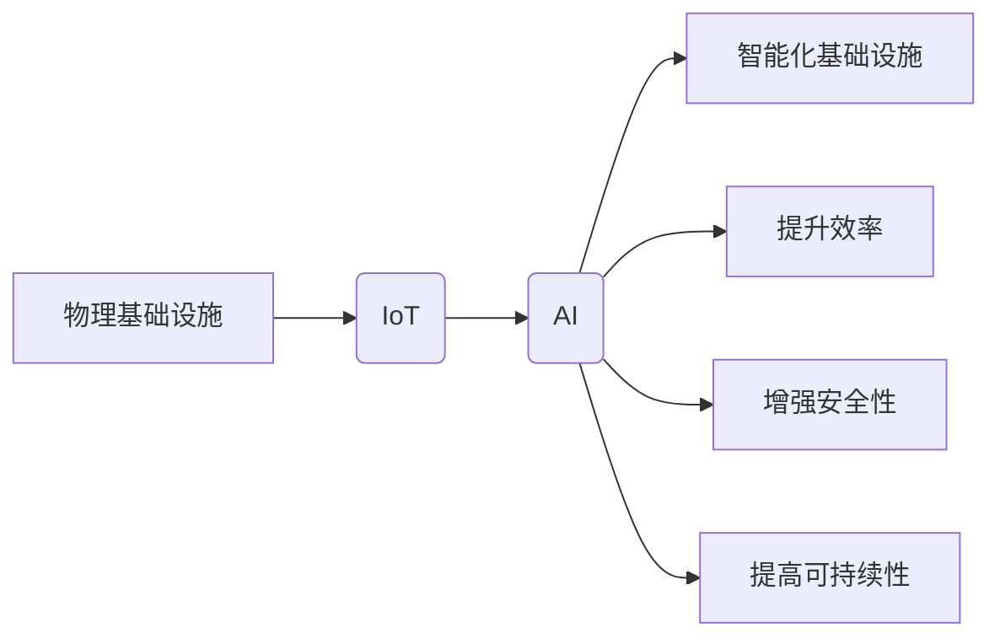

# AI在物理基础设施中的应用

> 关键词：人工智能，物理基础设施，智能电网，智能交通，智能建筑，物联网，数据分析，预测性维护

## 1. 背景介绍

随着人工智能技术的飞速发展，AI正在逐渐渗透到我们生活的方方面面。物理基础设施作为社会发展的基石，其智能化升级也成为了必然趋势。AI在物理基础设施中的应用，不仅能够提升基础设施的运行效率，还能增强其安全性和可持续性。本文将探讨AI在物理基础设施中的应用，分析其核心概念、算法原理、实践案例以及未来发展趋势。

## 2. 核心概念与联系

### 2.1 物理基础设施

物理基础设施是指支撑社会生产和人民生活的基础设施，包括能源、交通、建筑、水资源等领域。随着城市化进程的加快，物理基础设施的需求日益增长，对其进行智能化升级显得尤为重要。

### 2.2 物联网（IoT）

物联网是指通过传感器、控制器、执行器等设备将物理世界与数字世界连接起来，实现设备之间以及设备与人的智能交互。IoT是AI在物理基础设施中应用的重要基础。

### 2.3 人工智能（AI）

人工智能是指模拟、延伸和扩展人的智能的科学和技术，包括机器学习、深度学习、自然语言处理等领域。AI在物理基础设施中的应用，将极大地提升基础设施的智能化水平。

### 2.4 Mermaid流程图



## 3. 核心算法原理 & 具体操作步骤

### 3.1 算法原理概述

AI在物理基础设施中的应用，主要基于以下几种算法原理：

- **机器学习（ML）**：通过学习大量数据，使机器获得对特定任务的预测能力。
- **深度学习（DL）**：一种特殊的机器学习算法，使用多层神经网络模拟人脑处理信息的方式。
- **强化学习（RL）**：通过奖励和惩罚机制，使智能体在环境中学习最优策略。

### 3.2 算法步骤详解

1. 数据采集：通过传感器、摄像头等设备采集物理基础设施的实时数据。
2. 数据预处理：对采集到的数据进行清洗、去噪、特征提取等处理。
3. 模型训练：使用机器学习或深度学习算法对预处理后的数据进行分析和建模。
4. 模型评估：在验证集上评估模型的性能，优化模型参数。
5. 模型部署：将训练好的模型部署到物理基础设施中，进行实时监测和决策。

### 3.3 算法优缺点

- **优点**：提高效率、降低成本、增强安全性、提高可持续性。
- **缺点**：数据采集和预处理复杂、模型训练和部署成本高、数据安全和隐私问题。

### 3.4 算法应用领域

- **智能电网**：负荷预测、故障诊断、设备维护、需求响应等。
- **智能交通**：交通流量预测、交通信号优化、自动驾驶等。
- **智能建筑**：能源管理、环境控制、安全监测等。
- **水资源管理**：水质监测、水资源调配、防洪减灾等。

## 4. 数学模型和公式 & 详细讲解 & 举例说明

### 4.1 数学模型构建

以智能电网负荷预测为例，我们可以使用时间序列分析方法构建数学模型：

$$
L_t = f(L_{t-1}, L_{t-2}, ..., L_{t-k}, X_t) + \epsilon_t
$$

其中，$L_t$ 表示第 $t$ 时刻的负荷，$X_t$ 表示与负荷相关的输入变量（如温度、节假日等），$f$ 表示模型函数，$\epsilon_t$ 表示随机误差。

### 4.2 公式推导过程

以ARIMA模型为例，介绍时间序列分析公式的推导过程：

- **自回归模型（AR）**：
$$
L_t = c + \phi_1 L_{t-1} + \phi_2 L_{t-2} + ... + \phi_p L_{t-p} + \epsilon_t
$$

- **移动平均模型（MA）**：
$$
L_t = \epsilon_t + \theta_1 \epsilon_{t-1} + \theta_2 \epsilon_{t-2} + ... + \theta_q \epsilon_{t-q}
$$

- **自回归移动平均模型（ARMA）**：
$$
L_t = c + \phi_1 L_{t-1} + ... + \phi_p L_{t-p} + \epsilon_t + \theta_1 \epsilon_{t-1} + ... + \theta_q \epsilon_{t-q}
$$

- **自回归积分移动平均模型（ARIMA）**：
$$
L_t = c + \phi_1 L_{t-1} + ... + \phi_p L_{t-p} + (\epsilon_t + \theta_1 \epsilon_{t-1} + ... + \theta_q \epsilon_{t-q})_+
$$

其中，$c$ 为常数项，$\phi_i$ 和 $\theta_i$ 为系数，$p$ 和 $q$ 分别为自回归项和移动平均项的阶数，$\epsilon_t$ 为白噪声序列。

### 4.3 案例分析与讲解

以某地区一周的电力负荷数据为例，我们可以使用ARIMA模型进行负荷预测：

1. 数据处理：将数据按时间序列格式整理，并进行归一化处理。
2. 模型选择：根据ACF和PACF图选择ARIMA模型的参数。
3. 模型训练：使用训练数据训练ARIMA模型。
4. 模型评估：使用验证数据评估模型的预测性能。
5. 预测：使用训练好的模型进行未来一周的负荷预测。

通过以上步骤，我们可以得到未来一周的电力负荷预测结果，为电力调度和资源配置提供依据。

## 5. 项目实践：代码实例和详细解释说明

### 5.1 开发环境搭建

1. 安装Python环境。
2. 安装必要的库，如NumPy、Pandas、Scikit-learn、Statsmodels等。

### 5.2 源代码详细实现

```python
import pandas as pd
from statsmodels.tsa.arima.model import ARIMA

# 加载数据
data = pd.read_csv('power_load.csv')

# 模型训练
model = ARIMA(data['load'], order=(1,1,1))
model_fit = model.fit()

# 预测
forecast = model_fit.forecast(steps=7)

# 输出预测结果
print(forecast)
```

### 5.3 代码解读与分析

- 加载数据：使用Pandas读取电力负荷数据。
- 模型训练：使用Statsmodels的ARIMA模型进行训练。
- 预测：使用训练好的模型进行未来一周的负荷预测。
- 输出预测结果：打印预测结果。

通过以上代码，我们可以实现电力负荷的预测，为电力系统调度提供支持。

## 6. 实际应用场景

### 6.1 智能电网

- 负荷预测：通过预测电力负荷，优化电力调度，提高发电效率。
- 故障诊断：通过分析电网数据，及时发现故障，减少停电时间。
- 设备维护：通过预测设备状态，制定合理的维护计划，延长设备寿命。

### 6.2 智能交通

- 交通流量预测：通过预测交通流量，优化交通信号灯控制，缓解交通拥堵。
- 自动驾驶：通过感知环境，实现无人驾驶，提高道路安全性。
- 车联网：通过车联网技术，实现车辆与基础设施之间的信息交互，提高道路利用效率。

### 6.3 智能建筑

- 能源管理：通过智能设备监测能源消耗，优化能源使用，降低能源成本。
- 环境控制：通过监测室内环境参数，自动调节空调、灯光等设备，提高居住舒适度。
- 安全监测：通过视频监控和传感器数据，及时发现安全隐患，保障人员安全。

## 7. 工具和资源推荐

### 7.1 学习资源推荐

- 《Python数据科学手册》
- 《深度学习》
- 《机器学习实战》
- 《数据科学入门》

### 7.2 开发工具推荐

- Python：编程语言
- Jupyter Notebook：交互式计算环境
- TensorFlow：深度学习框架
- PyTorch：深度学习框架
- Matplotlib：数据可视化工具

### 7.3 相关论文推荐

- "A Review of IoT in Smart Grids: Challenges, Opportunities, and Solutions"
- "Deep Learning for Smart Grids: A Survey"
- "AI for Smart Transportation: A Survey"
- "Artificial Intelligence in Smart Buildings: A Survey"

## 8. 总结：未来发展趋势与挑战

### 8.1 研究成果总结

本文介绍了AI在物理基础设施中的应用，分析了其核心概念、算法原理、实践案例以及未来发展趋势。随着AI技术的不断发展，AI在物理基础设施中的应用将更加广泛，为人类社会带来更多福祉。

### 8.2 未来发展趋势

- AI与物理基础设施深度融合，实现智能化升级。
- 针对不同领域开发定制化的AI解决方案。
- AI在物理基础设施中的应用将更加高效、可靠、安全。

### 8.3 面临的挑战

- 数据安全和隐私保护。
- AI算法的可解释性和可靠性。
- AI在物理基础设施中的应用标准和规范。

### 8.4 研究展望

- 开发更加高效、可靠的AI算法。
- 提高AI算法的可解释性和透明度。
- 探索AI在物理基础设施中的创新应用。

## 9. 附录：常见问题与解答

**Q1：AI在物理基础设施中的应用前景如何？**

A：AI在物理基础设施中的应用前景广阔，能够提升基础设施的效率、安全性、可持续性，为社会发展带来巨大价值。

**Q2：如何保证AI在物理基础设施中的应用安全？**

A：保证AI在物理基础设施中的应用安全需要从多个方面入手，包括数据安全、算法安全、模型安全等。需要建立完善的安全体系，制定相关标准和规范。

**Q3：AI在物理基础设施中的应用是否会取代人工？**

A：AI在物理基础设施中的应用并非取代人工，而是与人工协同，提升工作效率，减轻人工负担。

**Q4：如何选择合适的AI算法应用于物理基础设施？**

A：选择合适的AI算法需要考虑多个因素，如数据类型、任务类型、性能要求等。需要根据具体问题选择合适的算法。

**Q5：AI在物理基础设施中的应用存在哪些挑战？**

A：AI在物理基础设施中的应用存在数据安全、算法可靠性、可解释性、伦理道德等方面的挑战。需要不断探索和解决这些挑战。

作者：禅与计算机程序设计艺术 / Zen and the Art of Computer Programming