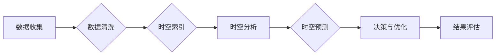

# AI时空建模的技术基石解析

> 关键词：AI时空建模，时空数据，时空分析，时空索引，图神经网络，深度学习，SLAM，时空预测

## 1. 背景介绍

随着物联网、移动设备和传感器技术的快速发展，时空数据已经成为大数据时代的重要资源。时空数据包含了时间、空间以及事物之间的相互关系，是理解现实世界动态变化的重要途径。在众多应用领域，如智能交通、智慧城市、环境监测等，都需要对时空数据进行有效的建模和分析。

AI时空建模旨在利用人工智能技术对时空数据进行建模，以发现数据中的规律和模式，从而实现对时空数据的预测、分析和优化。本文将深入探讨AI时空建模的技术基石，分析其核心概念、算法原理、数学模型以及实际应用场景。

## 2. 核心概念与联系

### 2.1 时空数据

时空数据是指记录了事物在特定时间和空间位置上的状态和属性的数据。它通常包含以下信息：

- 时间：表示数据发生的具体时间点或时间段。
- 空间：表示数据发生的地理位置或空间位置。
- 属性：表示事物的特征、状态或变化。

时空数据的表示形式多样，如时间序列、空间网格、轨迹数据、事件数据等。

### 2.2 时空分析

时空分析是指对时空数据进行处理、分析和解释的过程。其主要目标包括：

- 时空模式识别：发现数据中的时空规律和模式。
- 时空预测：预测未来时空事件的发生。
- 时空优化：优化时空事件的发生和资源配置。

### 2.3 时空索引

时空索引是一种用于加速时空查询和检索的技术。它通过对时空数据进行索引，可以快速定位和访问特定时间和空间范围内的数据。

### 2.4 Mermaid 流程图

以下是一个Mermaid流程图，展示了AI时空建模的基本流程：



### 2.5 关联概念

- 图神经网络（Graph Neural Networks，GNNs）：用于处理图结构数据，如社交网络、交通网络等。
- 深度学习：一种模拟人脑神经网络结构和学习方式的机器学习方法。
- 定位系统（如GPS）：用于获取地理位置信息的技术。
- 时间序列分析：用于分析时间序列数据的统计方法。

## 3. 核心算法原理 & 具体操作步骤

### 3.1 算法原理概述

AI时空建模通常涉及以下几个核心算法：

- 时空索引算法：如R-tree、GSD树、空间四叉树等，用于高效检索时空数据。
- 时空聚类算法：如K-means、DBSCAN等，用于发现时空数据中的聚类模式。
- 时空预测算法：如时间序列分析、图神经网络等，用于预测时空事件的发生。
- 时空优化算法：如遗传算法、模拟退火等，用于优化时空事件的发生和资源配置。

### 3.2 算法步骤详解

以下是AI时空建模的基本步骤：

1. 数据收集：收集相关的时空数据，包括时间、空间和属性信息。
2. 数据清洗：对收集到的数据进行清洗和预处理，如去除噪声、填补缺失值等。
3. 时空索引：对清洗后的数据进行索引，以加速查询和检索。
4. 时空分析：使用聚类、分类等方法分析时空数据，发现规律和模式。
5. 时空预测：使用时间序列分析、图神经网络等方法预测时空事件的发生。
6. 决策与优化：根据预测结果进行决策和优化，如路径规划、资源分配等。
7. 结果评估：评估模型的效果，并根据评估结果进行改进。

### 3.3 算法优缺点

- 时空索引算法：优点是查询速度快，缺点是索引构建成本高，且索引结构可能随着数据变化而失效。
- 时空聚类算法：优点是能够发现数据中的聚类模式，缺点是聚类结果可能受到聚类算法参数的影响。
- 时空预测算法：优点是能够预测时空事件的发生，缺点是预测精度可能受到数据质量的影响。
- 时空优化算法：优点是能够优化时空事件的发生和资源配置，缺点是优化过程可能需要较长时间。

### 3.4 算法应用领域

AI时空建模在以下领域具有广泛的应用：

- 智能交通：如交通流量预测、路径规划、停车管理等。
- 智慧城市：如环境监测、灾害预警、城市安全等。
- 环境监测：如空气质量监测、水质监测、森林火灾监测等。
- 金融风控：如股票市场预测、欺诈检测等。

## 4. 数学模型和公式 & 详细讲解 & 举例说明

### 4.1 数学模型构建

AI时空建模的数学模型通常包括以下部分：

- 时空表示：使用数学方法表示时空数据，如坐标系统、时间序列等。
- 时空分析模型：如聚类模型、分类模型等。
- 时空预测模型：如时间序列模型、图神经网络模型等。
- 时空优化模型：如线性规划模型、整数规划模型等。

### 4.2 公式推导过程

以下是一个时间序列预测模型的公式推导示例：

$$
y_t = \alpha y_{t-1} + \beta + \epsilon_t
$$

其中，$y_t$ 表示时间序列在时刻 $t$ 的值，$\alpha$ 和 $\beta$ 是模型参数，$\epsilon_t$ 是误差项。

### 4.3 案例分析与讲解

假设我们有一个包含时间、空间和温度的时空数据集，目标是预测未来某个地点的温度。我们可以使用时间序列分析方法进行预测。

首先，将时间序列数据进行预处理，如去除异常值、填补缺失值等。

然后，选择合适的时间序列模型，如ARIMA模型，对预处理后的数据进行拟合。

最后，使用拟合后的模型预测未来某个时间点的温度。

## 5. 项目实践：代码实例和详细解释说明

### 5.1 开发环境搭建

为了进行AI时空建模的项目实践，我们需要搭建以下开发环境：

- 编程语言：Python
- 机器学习库：Scikit-learn、Pandas、NumPy
- 时空分析库：Geopandas、Shapely
- 时间序列分析库：Statsmodels
- 深度学习库：TensorFlow、PyTorch

### 5.2 源代码详细实现

以下是一个使用Scikit-learn库进行时空聚类分析的代码实例：

```python
from sklearn.cluster import KMeans
import geopandas as gpd

# 加载时空数据
data = gpd.read_file('temp_data.geojson')
temp_data = data['temperature'].values

# 使用KMeans聚类
kmeans = KMeans(n_clusters=3)
clusters = kmeans.fit_predict(temp_data.reshape(-1, 1))

# 添加聚类信息到数据集
data['cluster'] = clusters

# 绘制聚类结果
data.plot(column='cluster')
```

### 5.3 代码解读与分析

上述代码首先从地理JSON文件中加载时空数据，然后使用KMeans聚类方法对温度数据进行聚类。最后，将聚类结果添加到数据集中，并绘制聚类结果图。

### 5.4 运行结果展示

运行上述代码后，我们将得到一个聚类结果图，图中不同颜色的区域代表不同的温度聚类。

## 6. 实际应用场景

### 6.1 智能交通

在智能交通领域，AI时空建模可以用于以下应用：

- 交通流量预测：预测未来某个时间段内的交通流量，为交通管理部门提供决策支持。
- 路径规划：为司机提供最优行驶路径，减少行驶时间。
- 停车管理：预测停车场的可用停车位数量，提高停车效率。

### 6.2 智慧城市

在智慧城市领域，AI时空建模可以用于以下应用：

- 环境监测：监测空气质量、水质等环境参数，及时发现环境污染问题。
- 灾害预警：预测自然灾害的发生，为防灾减灾提供支持。
- 公共安全：监测城市安全状况，及时发现安全隐患。

### 6.3 环境监测

在环境监测领域，AI时空建模可以用于以下应用：

- 空气质量预测：预测未来某个时间段内的空气质量状况，为居民提供健康建议。
- 水质监测：监测水体污染状况，及时发现污染源。
- 森林火灾监测：监测森林火险等级，为森林防火工作提供支持。

### 6.4 未来应用展望

随着人工智能技术的不断发展，AI时空建模将在更多领域得到应用，如：

- 健康医疗：预测疾病传播趋势，为疾病防控提供支持。
- 金融市场：预测股票市场走势，为投资者提供决策支持。
- 物流运输：优化物流路径，降低物流成本。

## 7. 工具和资源推荐

### 7.1 学习资源推荐

- 《时空数据分析与建模》
- 《人工智能导论》
- 《深度学习》

### 7.2 开发工具推荐

- Python
- Scikit-learn
- Pandas
- NumPy
- Geopandas
- Shapely
- Statsmodels
- TensorFlow
- PyTorch

### 7.3 相关论文推荐

-《Spatial-Temporal Analysis for Big Data: A Survey》
-《Spatial-Temporal Data Mining: A Survey》
-《Deep Learning for Time Series: A Survey》

## 8. 总结：未来发展趋势与挑战

### 8.1 研究成果总结

本文对AI时空建模的技术基石进行了深入解析，包括核心概念、算法原理、数学模型以及实际应用场景。通过分析，我们可以看到AI时空建模在多个领域具有广泛的应用前景。

### 8.2 未来发展趋势

- 时空数据融合：将来自不同来源的时空数据进行融合，提供更全面的信息。
- 时空数据可视化：开发更直观的时空数据可视化工具，帮助用户更好地理解时空数据。
- 时空知识图谱：构建时空知识图谱，实现对时空数据的语义理解。

### 8.3 面临的挑战

- 数据质量：时空数据质量对建模结果影响很大，需要加强对数据质量的控制。
- 模型可解释性：提高模型的可解释性，帮助用户理解模型的决策过程。
- 计算资源：AI时空建模通常需要大量的计算资源，需要进一步优化算法和模型。

### 8.4 研究展望

未来，AI时空建模将在以下方面取得突破：

- 开发更有效的时空数据预处理方法。
- 设计更鲁棒的时空分析模型。
- 构建更高效的时空预测模型。
- 开发更灵活的时空优化模型。

作者：禅与计算机程序设计艺术 / Zen and the Art of Computer Programming