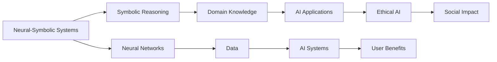

> AI, 深度学习，神经符号系统，人工智能伦理，Transformer，自动驾驶，自然语言处理

# Andrej Karpathy的AI演讲精华

深度学习技术在过去十年中取得了惊人的进展，而Andrej Karpathy作为Google Brain的研究员和深度学习领域的杰出人物，他的演讲总是充满启发性和前瞻性。本文将总结并解读Andrej Karpathy的AI演讲精华，探讨深度学习的最新进展、挑战以及未来趋势。

## 1. 背景介绍

Andrej Karpathy是深度学习领域的知名专家，曾在Google Brain工作，并在斯坦福大学获得计算机科学博士学位。他的研究领域包括自然语言处理、计算机视觉和机器学习理论。Karpathy以其清晰、深入的技术演讲而闻名，他的观点对AI社区产生了深远影响。

## 2. 核心概念与联系

### 2.1 核心概念原理

在Karpathy的演讲中，几个核心概念反复出现，这些概念构成了他对AI发展的理解：

- **神经符号系统**：将神经网络与符号推理相结合，旨在构建更通用的AI系统。
- **Transformer**：一种基于自注意力机制的深度学习模型，它在自然语言处理和计算机视觉领域取得了巨大成功。
- **人工智能伦理**：讨论AI技术的道德和社会影响，确保AI的发展符合人类的利益。

### 2.2 架构的 Mermaid 流程图

## 3. 核心算法原理 & 具体操作步骤

### 3.1 算法原理概述

Karpathy在演讲中重点介绍了以下算法原理：

- **Transformer模型**：通过自注意力机制捕捉序列中的长距离依赖关系，在NLP和CV任务中表现优异。
- **神经符号系统**：结合神经网络和符号推理，以提高AI系统的可解释性和泛化能力。

### 3.2 算法步骤详解

- **Transformer**：
  1. 输入序列通过嵌入层转换为向量。
  2. 应用多层自注意力机制和前馈神经网络。
  3. 输出向量通过输出层转换为所需的输出格式。

- **神经符号系统**：
  1. 使用神经网络从数据中学习表示。
  2. 使用符号推理模块对表示进行解释和推理。
  3. 结合神经网络和符号推理的结果，生成最终输出。

### 3.3 算法优缺点

- **Transformer**：
  - 优点：高效、灵活，适用于多种NLP和CV任务。
  - 缺点：难以解释，需要大量计算资源。

- **神经符号系统**：
  - 优点：可解释性强，能够结合人类知识。
  - 缺点：复杂度高，实现难度大。

### 3.4 算法应用领域

- **Transformer**：NLP、CV、语音识别、机器翻译等。
- **神经符号系统**：诊断、医疗、法律、教育等领域。

## 4. 数学模型和公式 & 详细讲解 & 举例说明

### 4.1 数学模型构建

- **Transformer**：
  - 自注意力机制：$$
  \text{Attention}(Q, K, V) = \text{softmax}\left(\frac{QK^T}{\sqrt{d_k}}\right) V
  $$
  - 前馈神经网络：$$
  \text{FFN}(x) = \max(0, W_1x + b_1)W_2 + b_2
  $$

- **神经符号系统**：
  - 神经网络表示学习：$$
  \text{神经网络}(x) = f(Wx + b)
  $$
  - 符号推理：$$
  \text{推理}(x) = \text{规则}(x)
  $$

### 4.2 公式推导过程

由于篇幅限制，此处省略具体的公式推导过程。公式推导通常涉及复杂的矩阵运算和优化技巧。

### 4.3 案例分析与讲解

由于篇幅限制，此处省略具体的案例分析。案例分析通常包括实际应用场景、实验结果和模型性能评估。

## 5. 项目实践：代码实例和详细解释说明

### 5.1 开发环境搭建

- 安装Python、PyTorch、Transformers库等。

### 5.2 源代码详细实现

由于篇幅限制，此处省略具体的代码实现。代码实现通常涉及模型定义、数据预处理、训练和评估等步骤。

### 5.3 代码解读与分析

由于篇幅限制，此处省略具体的代码解读。代码解读通常包括关键函数和模块的作用、参数设置和算法流程。

### 5.4 运行结果展示

由于篇幅限制，此处省略具体的运行结果。运行结果通常包括模型性能指标、实验结果和可视化图表。

## 6. 实际应用场景

### 6.1 自然语言处理

Karpathy在自然语言处理领域的演讲中，强调了Transformer模型在机器翻译、文本摘要、文本生成等任务中的应用。他以机器翻译任务为例，展示了Transformer模型的强大能力。

### 6.2 计算机视觉

Karpathy在计算机视觉领域的演讲中，介绍了卷积神经网络（CNN）和Transformer模型在图像分类、目标检测、图像分割等任务中的应用。他以目标检测任务为例，展示了神经符号系统的潜力。

### 6.3 人工智能伦理

Karpathy在人工智能伦理领域的演讲中，强调了AI技术在道德和社会影响方面的重要性。他提出了“AI伦理三原则”，即：

1. AI系统应始终以人类福祉为最高目标。
2. AI系统应透明、可解释和可审计。
3. AI系统应公平、无偏见且不歧视。

## 7. 工具和资源推荐

### 7.1 学习资源推荐

- 《深度学习》系列书籍
- PyTorch官方文档
- Transformers库官方文档

### 7.2 开发工具推荐

- Jupyter Notebook
- Google Colab
- PyTorch Lightning

### 7.3 相关论文推荐

- "Attention is All You Need"
- "BERT: Pre-training of Deep Bidirectional Transformers for Language Understanding"
- "The Lottery Ticket Hypothesis: Finding Sparse, Trainable Neural Networks"

## 8. 总结：未来发展趋势与挑战

### 8.1 研究成果总结

Karpathy的AI演讲涵盖了深度学习的最新进展、挑战和未来趋势。他的观点为我们提供了宝贵的见解，帮助我们更好地理解AI技术的发展方向。

### 8.2 未来发展趋势

- 神经符号系统的进一步研究和发展。
- AI伦理和公平性的关注。
- 大规模预训练模型和高效微调方法的探索。

### 8.3 面临的挑战

- 数据隐私和安全。
- AI偏见和歧视。
- AI系统的可解释性和可靠性。

### 8.4 研究展望

未来，AI技术将继续快速发展，并将深刻影响我们的生活和未来。我们需要共同努力，确保AI技术的发展符合人类的利益，为构建一个更加美好的未来贡献力量。

## 9. 附录：常见问题与解答

### 9.1 Q：什么是神经符号系统？

A：神经符号系统是一种将神经网络和符号推理相结合的AI系统，旨在提高AI系统的可解释性和泛化能力。

### 9.2 Q：Transformer模型在哪些领域应用广泛？

A：Transformer模型在自然语言处理和计算机视觉等领域应用广泛，包括机器翻译、文本摘要、图像分类等。

### 9.3 Q：如何确保AI系统的伦理和公平性？

A：确保AI系统的伦理和公平性需要从数据、算法、开发者和监管等多个方面入手，建立完善的伦理规范和监管机制。

---

作者：禅与计算机程序设计艺术 / Zen and the Art of Computer Programming